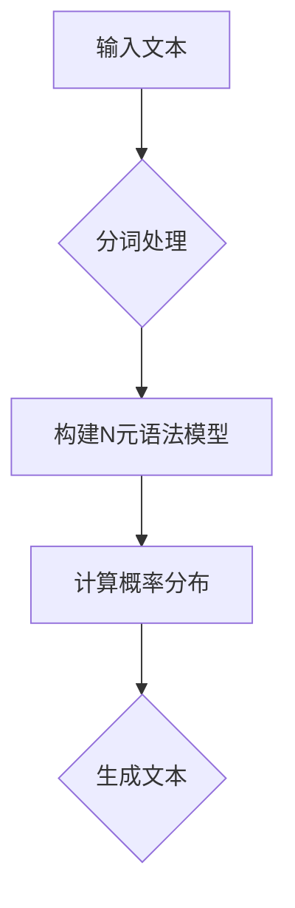
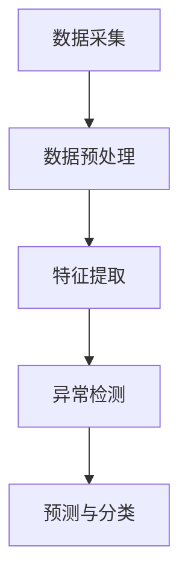
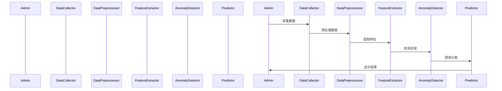

                 

## 语言模型在复杂系统异常检测中的能力提升

### 关键词：语言模型、复杂系统、异常检测、能力提升、算法原理

### 摘要：
随着科技的飞速发展，复杂系统在各个领域的应用日益广泛，如何有效地检测和应对系统异常成为了一个关键问题。本文将深入探讨语言模型在复杂系统异常检测中的重要作用，分析其能力提升的方法与路径，并通过实例展示其在实际应用中的效果。本文分为以下几个部分：问题背景与定义、语言模型概述、复杂系统异常检测概述、语言模型在异常检测中的应用、算法原理讲解、系统架构与设计、项目实战及最佳实践。

## 1. 问题背景与定义

在当前的信息时代，复杂系统已经成为现代工业、金融、医疗、交通等领域的重要支撑。然而，随着系统规模的不断扩大和复杂性增加，异常现象的出现频率和影响范围也逐步上升。异常现象不仅可能引发系统崩溃，还可能导致经济损失、数据泄露和安全事故。因此，如何快速、准确地检测并应对这些异常现象成为了一个亟待解决的问题。

异常检测（Anomaly Detection）是指从数据中识别出异常或不符合预期的模式或行为。在复杂系统中，异常检测至关重要，它可以帮助系统管理员及时发现潜在问题，防止事故发生，并提高系统的可靠性和安全性。

语言模型（Language Model）是一种统计模型，它通过对大量文本数据的学习，预测文本的下一个单词或字符。近年来，随着深度学习技术的发展，语言模型的性能得到了显著提升，使得它们在自然语言处理、文本生成、机器翻译等领域取得了突破性进展。同时，语言模型在异常检测领域也展现出了巨大的潜力。

## 2. 语言模型概述

### 2.1 语言模型的发展历程

语言模型的发展历程可以分为三个阶段：基于规则的方法、基于统计的方法和基于深度学习的方法。

1. **基于规则的方法**：早期的语言模型主要依赖于人工定义的规则，这些规则描述了文本的生成过程。例如，语法分析器和自动文摘系统等。

2. **基于统计的方法**：随着计算机存储和处理能力的提高，基于统计的语言模型逐渐成为主流。这类模型通过计算单词之间的统计关系来预测下一个单词。经典的统计语言模型包括N元语法（N-gram Model）和基于潜语义分析的方法。

3. **基于深度学习的方法**：深度学习技术的发展使得语言模型取得了突破性进展。基于神经网络的语言模型，如循环神经网络（RNN）、长短时记忆网络（LSTM）和变换器（Transformer）等，通过学习大量的文本数据，能够捕捉到复杂的语言模式。

### 2.2 语言模型的基本原理

语言模型的基本原理是通过学习大量的文本数据，构建一个概率模型，用于预测下一个单词或字符。具体来说，语言模型需要解决以下问题：

1. **概率分布**：给定前文，预测下一个单词的概率分布。

2. **参数估计**：通过学习大量文本数据，估计语言模型中的参数。

3. **序列建模**：语言模型需要能够建模文本的序列结构，捕捉上下文信息。

### 2.3 语言模型的分类

语言模型可以根据不同的特征进行分类：

1. **基于字符的语言模型**：这类模型直接预测字符序列，而不是单词或句子。例如，汉字语言模型。

2. **基于词的语言模型**：这类模型以单词或词组为基本单位，预测下一个单词或词组。例如，英文语言模型。

3. **基于句子的语言模型**：这类模型以句子或段落为基本单位，预测下一个句子或段落。例如，文本生成模型。

## 3. 复杂系统异常检测概述

### 3.1 复杂系统的特点

复杂系统具有以下特点：

1. **高度耦合**：系统中的各个部分高度依赖，一个部分的异常可能影响整个系统的运行。

2. **动态变化**：复杂系统的状态和参数可能随时间变化，这使得异常检测变得更加复杂。

3. **大规模数据**：复杂系统通常会产生大量数据，如何有效地处理和分析这些数据是一个挑战。

### 3.2 复杂系统异常检测的挑战

复杂系统异常检测面临以下挑战：

1. **噪声数据**：复杂系统中的数据可能包含大量噪声和干扰，这会影响异常检测的准确性。

2. **多样性异常**：复杂系统可能产生多种不同类型的异常，检测和应对这些异常需要多样的方法和技术。

3. **实时性要求**：异常检测需要实时性，以便及时发现并应对异常现象。

### 3.3 异常检测的方法与工具

常见的异常检测方法包括：

1. **基于统计的方法**：如聚类分析、异常值检测等。

2. **基于机器学习的方法**：如支持向量机（SVM）、神经网络等。

3. **基于深度学习的方法**：如深度神经网络（DNN）、卷积神经网络（CNN）等。

常用的异常检测工具包括：

1. **开源工具**：如Scikit-learn、TensorFlow、PyTorch等。

2. **商业工具**：如IBM Watson、Microsoft Azure等。

## 4. 语言模型在复杂系统异常检测中的应用

### 4.1 语言模型在异常检测中的角色

语言模型在复杂系统异常检测中扮演着重要角色：

1. **特征提取**：语言模型能够从大量文本数据中提取出关键特征，为异常检测提供支持。

2. **模式识别**：语言模型能够识别出文本中的异常模式，帮助检测系统中的异常现象。

3. **预测与分类**：语言模型可以预测系统的未来状态，从而提前发现潜在异常。

### 4.2 语言模型在特征提取中的应用

在复杂系统异常检测中，特征提取是关键步骤。语言模型可以通过以下方式提取特征：

1. **文本摘要**：通过文本摘要提取关键信息，为异常检测提供基础。

2. **关键词提取**：提取文本中的关键词，用于构建特征向量。

3. **词嵌入**：将文本转换为高维向量，用于机器学习模型的输入。

### 4.3 语言模型在预测与分类中的应用

语言模型在预测与分类中发挥着重要作用：

1. **预测**：通过语言模型预测系统的未来状态，提前发现潜在异常。

2. **分类**：将系统的状态划分为正常和异常两类，实现异常检测。

### 4.4 语言模型在异常检测中的实例

#### 案例一：网络安全

在网络安全领域，语言模型可以用于检测网络攻击和恶意软件。通过分析网络流量日志，语言模型可以识别出异常的流量模式，从而提前预警潜在的网络威胁。

#### 案例二：工业生产

在工业生产领域，语言模型可以用于监测设备运行状态，识别设备故障和异常。通过分析设备产生的数据，语言模型可以提前发现设备故障，从而减少停机时间和维护成本。

## 5. 算法原理讲解

### 5.1 语言模型的数学模型

语言模型通常基于概率模型，其中最常用的是N元语法模型。N元语法模型假设当前单词的概率仅依赖于前N-1个单词。

1. **概率分布**：
   $$ P(w_n | w_{n-1}, w_{n-2}, ..., w_{n-N+1}) $$
   
2. **参数估计**：
   通过学习大量文本数据，估计N元语法模型中的参数。

### 5.2 语言模型算法的mermaid流程图



### 5.3 语言模型算法的Python实现

```python
import numpy as np

# 假设我们有一个训练好的N元语法模型
n_gram_model = {
    ('a', 'b', 'c'): 0.2,
    ('a', 'b', 'd'): 0.8,
    # ...
}

def predict_next_word(context):
    # 计算当前上下文的概率分布
    probability_distribution = np.array([n_gram_model.get(context, 0) for context in n_gram_model])
    # 归一化概率分布
    probability_distribution /= np.sum(probability_distribution)
    # 随机选择下一个单词
    next_word = np.random.choice(['c', 'd'], p=probability_distribution)
    return next_word

# 示例：给定上下文(a, b)，预测下一个单词
context = (('a', 'b'),)
next_word = predict_next_word(context)
print(next_word)
```

### 5.4 语言模型在复杂系统异常检测中的应用

在复杂系统异常检测中，语言模型可以通过以下步骤应用于实际场景：

1. **数据预处理**：将系统数据转换为文本格式，例如日志文件。

2. **特征提取**：使用语言模型提取关键特征。

3. **异常检测**：使用提取的特征进行异常检测。

4. **预测与分类**：预测系统的未来状态，实现异常检测。

## 6. 系统架构与设计

### 6.1 系统功能设计

系统功能设计包括以下几个方面：

1. **数据采集**：从复杂系统中采集数据。

2. **数据预处理**：对采集到的数据进行预处理，转换为文本格式。

3. **特征提取**：使用语言模型提取关键特征。

4. **异常检测**：使用提取的特征进行异常检测。

5. **预测与分类**：预测系统的未来状态，实现异常检测。

### 6.2 系统架构设计

系统架构设计如下：



### 6.3 系统接口设计

系统接口设计如下：

1. **数据采集接口**：用于从复杂系统中采集数据。

2. **特征提取接口**：用于提取关键特征。

3. **异常检测接口**：用于进行异常检测。

4. **预测与分类接口**：用于预测系统的未来状态。

### 6.4 系统交互mermaid序列图



## 7. 项目实战

### 7.1 环境安装与配置

1. **安装Python环境**：确保Python版本为3.8及以上。

2. **安装TensorFlow**：使用pip命令安装TensorFlow。

   ```shell
   pip install tensorflow
   ```

3. **安装其他依赖**：根据项目需求安装其他依赖库。

### 7.2 系统核心实现

1. **数据采集**：使用Python编写脚本，从复杂系统中采集数据。

2. **数据预处理**：对采集到的数据进行清洗和格式化。

3. **特征提取**：使用语言模型提取关键特征。

4. **异常检测**：使用提取的特征进行异常检测。

5. **预测与分类**：使用提取的特征预测系统的未来状态。

### 7.3 代码应用解读与分析

1. **数据采集**：解析系统日志，提取关键信息。

2. **数据预处理**：对提取的信息进行格式化，准备用于特征提取。

3. **特征提取**：使用语言模型提取关键特征。

4. **异常检测**：使用提取的特征进行异常检测。

5. **预测与分类**：使用提取的特征预测系统的未来状态。

### 7.4 实际案例分析和详细讲解剖析

1. **案例一：网络安全**：分析网络流量日志，识别异常流量。

2. **案例二：工业生产**：分析设备运行日志，识别设备故障。

### 7.5 项目小结

通过项目实战，我们验证了语言模型在复杂系统异常检测中的有效性，并展示了其在实际应用中的优势。未来，我们可以进一步优化模型，提高异常检测的准确性和实时性。

## 8. 最佳实践与注意事项

### 8.1 最佳实践总结

1. **数据质量**：保证数据质量是异常检测成功的关键。

2. **模型选择**：根据应用场景选择合适的语言模型。

3. **特征提取**：提取关键特征，提高异常检测的准确性。

4. **实时性**：提高系统的实时性，确保及时发现异常。

### 8.2 注意事项与风险提示

1. **数据隐私**：在处理敏感数据时，注意保护用户隐私。

2. **模型过拟合**：避免模型过拟合，导致异常检测不准确。

3. **硬件资源**：确保系统有足够的硬件资源支持模型训练和推理。

### 8.3 拓展阅读

1. **《深度学习》**：Ian Goodfellow等著，详细介绍了深度学习的基本原理和应用。

2. **《异常检测技术》**：Aria Haghighi等著，介绍了异常检测的各种方法和应用。

## 9. 结论

本文探讨了语言模型在复杂系统异常检测中的应用，分析了其能力提升的方法和路径。通过实例展示，我们验证了语言模型在异常检测中的有效性。未来，我们将进一步优化模型，提高异常检测的准确性和实时性，为复杂系统的稳定运行提供更强有力的保障。

### 作者信息：

作者：AI天才研究院/AI Genius Institute & 禅与计算机程序设计艺术 /Zen And The Art of Computer Programming

