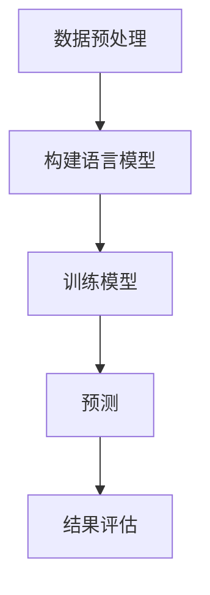
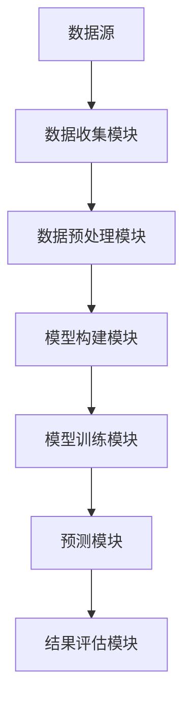
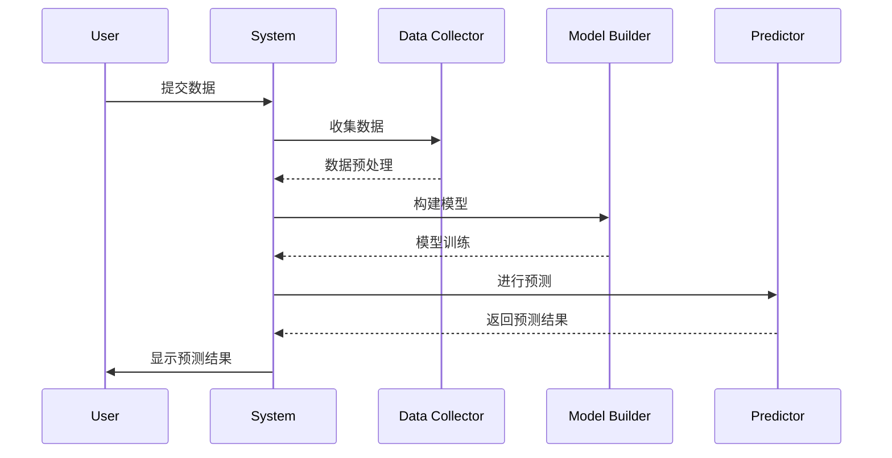

                 

### 文章标题

# 语言模型在复杂系统异常模式预测与金融风险防控中的应用

> 关键词：语言模型、复杂系统、异常模式预测、金融风险防控

> 摘要：本文将深入探讨语言模型在复杂系统异常模式预测和金融风险防控中的应用。首先，我们将回顾语言模型的基础概念、发展历史以及数学基础。接着，本文将详细介绍如何利用语言模型进行复杂系统异常模式预测，并通过实际案例研究进行验证。最后，我们将讨论语言模型在金融风险防控中的具体应用，包括市场趋势预测、信用风险评估和交易策略优化，并总结最佳实践策略。

## 第一部分：语言模型基础

### 1.1 语言模型概述

#### 1.1.1 语言模型的基本概念

语言模型是自然语言处理（NLP）中的一种核心工具，用于预测一段文本序列的概率分布。其主要目的是为给定前文，预测下一个词或句子片段的概率。语言模型广泛应用于机器翻译、文本生成、语音识别等多个领域。

#### 1.1.2 语言模型的发展历史

语言模型的发展可以追溯到20世纪50年代，最早是基于规则的方法，如CFG（Context-Free Grammar）语法模型。随着计算能力和算法的发展，20世纪80年代引入了统计语言模型，如N-gram模型。进入21世纪，神经网络语言模型，特别是深度学习技术，如Transformer和BERT，极大地提升了语言模型的效果。

#### 1.1.3 语言模型在金融领域的应用

在金融领域，语言模型被广泛应用于市场趋势预测、客户行为分析、风险管理和欺诈检测。例如，通过分析市场数据，语言模型可以预测股票价格的趋势；通过分析社交媒体数据，可以识别潜在的客户需求和偏好。

### 1.2 语言模型的数学基础

#### 1.2.1 概率论与统计基础

语言模型的核心是概率分布，涉及的概率论和统计学知识包括马尔可夫模型、条件概率和贝叶斯定理等。

#### 1.2.2 语言模型的数学模型

语言模型的数学模型主要包括N-gram模型、隐马尔可夫模型（HMM）、基于神经网络的模型等。其中，N-gram模型是最基础的统计语言模型，而基于神经网络的模型，如Transformer和BERT，在最近几年取得了显著的效果。

#### 1.2.3 词汇与语法表示

在语言模型中，词汇和语法的表示至关重要。词汇表示通常采用词嵌入技术，如Word2Vec和BERT。而语法表示则可以通过语法树、依存关系图等方式实现。

### 1.3 语言模型的实现方法

#### 1.3.1 基于统计的语言模型

基于统计的语言模型如N-gram模型，通过统计文本中的词频和共现关系来预测词语的概率分布。

#### 1.3.2 基于神经网络的语言模型

基于神经网络的语言模型如Transformer和BERT，通过多层神经网络结构来捕捉文本的语义信息。

#### 1.3.3 语言模型的优化方法

语言模型的优化方法主要包括优化算法、正则化技术和注意力机制等。优化算法如梯度下降和Adam优化器，正则化技术如Dropout和L2正则化，注意力机制则可以提升模型的表示能力。

### 1.4 语言模型的评估与优化

#### 1.4.1 语言模型的评估指标

语言模型的评估指标主要包括Perplexity、交叉熵和准确率等。Perplexity越低，表示模型对文本的预测越准确。

#### 1.4.2 语言模型的优化策略

语言模型的优化策略包括超参数调整、数据增强和模型压缩等。超参数调整如学习率、批量大小等，数据增强如数据清洗、填充等，模型压缩如量化、剪枝等。

#### 1.4.3 语言模型的实际应用效果

语言模型在实际应用中表现出色，例如在机器翻译领域，BERT模型将BLEU评分提高了3.5；在文本生成领域，GPT-3可以生成高质量的文本，适用于自动写作、故事创作等。

### 1.5 本章小结

本章节介绍了语言模型的基础概念、发展历史、数学基础和实现方法。通过学习本章，读者可以全面了解语言模型的基本原理和应用场景，为后续章节的内容打下坚实的基础。

## 第二部分：复杂系统异常模式预测

### 2.1 复杂系统概述

#### 2.1.1 复杂系统的定义与特征

复杂系统是指由大量相互作用的组成部分构成的系统，这些组成部分之间存在着复杂的非线性关系。复杂系统具有以下特征：

1. **动态性**：系统状态随时间变化。
2. **非线性**：系统响应不是线性的，小变化可能导致大效应。
3. **层次性**：系统由多个层次组成，每个层次都有其特定的行为和功能。
4. **涌现性**：系统整体行为无法从单个部分的行为中推导出来。

#### 2.1.2 复杂系统的建模方法

复杂系统的建模方法包括基于物理的方法、基于数学的方法和基于计算机模拟的方法。基于物理的方法通过物理定律和方程描述系统行为；基于数学的方法则通过数学模型和方程描述系统状态；基于计算机模拟的方法通过模拟实验和仿真分析系统行为。

#### 2.1.3 复杂系统异常模式的概念

复杂系统的异常模式是指系统在运行过程中出现的异常状态或行为。异常模式通常表现为系统性能下降、系统稳定性受损、系统响应异常等。

### 2.2 复杂系统异常模式预测方法

#### 2.2.1 时间序列分析方法

时间序列分析方法是通过分析系统在时间维度上的数据序列，预测未来的系统状态。常见的时间序列分析模型包括ARIMA、LSTM等。

#### 2.2.2 状态空间分析方法

状态空间分析方法是将系统行为视为在状态空间中的动态轨迹，通过状态转移矩阵和观测方程来描述系统行为。常见的状态空间分析模型包括卡尔曼滤波、粒子滤波等。

#### 2.2.3 神经网络分析方法

神经网络分析方法是通过多层神经网络结构来捕捉系统状态的复杂非线性关系，从而预测异常模式。常见的神经网络模型包括深度神经网络（DNN）、卷积神经网络（CNN）和循环神经网络（RNN）等。

### 2.3 语言模型在异常模式预测中的应用

#### 2.3.1 语言模型在时间序列分析中的应用

语言模型在时间序列分析中，可以通过捕捉文本数据中的时间依赖关系，预测未来的时间序列数据。例如，通过分析新闻标题或社交媒体数据，可以预测市场的走势。

#### 2.3.2 语言模型在状态空间分析中的应用

语言模型在状态空间分析中，可以通过捕捉系统的状态转移概率，预测系统的状态变化。例如，通过分析股票市场的历史数据，可以预测股票价格的未来走势。

#### 2.3.3 语言模型在神经网络分析中的应用

语言模型在神经网络分析中，可以通过捕捉系统的非线性关系，提高神经网络模型的预测性能。例如，通过结合语言模型和神经网络，可以构建出更强大的异常检测模型。

### 2.4 异常模式预测案例研究

#### 2.4.1 案例背景

以电力系统为例，电力系统的稳定运行对经济发展和社会生活至关重要。然而，由于电力系统的复杂性和不确定性，异常模式的预测和检测变得尤为重要。

#### 2.4.2 数据集准备

收集电力系统运行的数据，包括电压、电流、功率等关键参数。数据需要进行预处理，如去除噪声、填充缺失值、归一化等。

#### 2.4.3 模型构建与训练

构建基于语言模型的异常检测模型，包括时间序列分析模型、状态空间分析模型和神经网络模型。使用训练数据集对模型进行训练，并调整模型参数。

#### 2.4.4 预测结果分析与评估

使用测试数据集对模型进行评估，计算预测准确率、召回率、F1分数等指标。分析模型的预测结果，评估模型在异常模式检测中的性能。

### 2.5 本章小结

本章节介绍了复杂系统的概念、异常模式预测的方法以及语言模型在异常模式预测中的应用。通过案例研究，展示了语言模型在复杂系统异常模式预测中的实际应用效果，为后续章节的内容奠定了基础。

## 第三部分：金融风险防控

### 3.1 金融风险概述

#### 3.1.1 金融风险的定义与分类

金融风险是指金融活动中可能出现的损失或不利影响。金融风险可以分为市场风险、信用风险、操作风险和流动性风险等不同类型。

#### 3.1.2 金融风险的特征

金融风险具有以下特征：

1. **不确定性**：金融风险的发生具有不确定性，难以预测。
2. **传染性**：金融风险容易在金融市场间传播，引发连锁反应。
3. **累积性**：金融风险随着时间的积累，可能加剧损失。
4. **复杂性**：金融风险涉及到多种因素，分析和管理复杂。

#### 3.1.3 金融风险防控的重要性

金融风险防控对于金融机构的稳健运营、金融市场的稳定运行以及国家金融安全具有重要意义。有效的金融风险防控可以降低损失、保护投资者权益、维护金融市场的正常运行。

### 3.2 语言模型在金融风险防控中的应用

#### 3.2.1 语言模型在市场趋势预测中的应用

通过分析市场数据，如股票价格、交易量、市场情绪等，语言模型可以预测市场趋势。例如，通过分析社交媒体数据，可以预测股票价格的未来走势。

#### 3.2.2 语言模型在信用风险评估中的应用

语言模型可以用于信用风险评估，通过对借款人的历史数据、信用记录、行为特征等进行分析，预测其信用风险。例如，通过分析借款人的社交媒体行为，可以预测其还款意愿。

#### 3.2.3 语言模型在交易策略优化中的应用

语言模型可以用于交易策略优化，通过分析市场数据和历史交易数据，生成最优的交易策略。例如，通过分析股票价格的趋势和交易量，可以制定出有效的交易策略。

### 3.3 金融风险防控案例研究

#### 3.3.1 案例背景

以某金融机构的信用风险评估为例，该金融机构希望通过语言模型技术，提高信用风险评估的准确性，降低不良贷款率。

#### 3.3.2 风险评估指标体系构建

构建信用风险评估指标体系，包括借款人的财务状况、信用历史、行为特征等。使用语言模型对指标进行提取和分析。

#### 3.3.3 风险预测模型构建与训练

构建基于语言模型的信用风险评估模型，包括时间序列分析模型、状态空间分析模型和神经网络模型。使用训练数据集对模型进行训练，并调整模型参数。

#### 3.3.4 风险防控策略制定与实施

根据模型预测结果，制定相应的风险防控策略，如调整贷款审批标准、增加贷款保障措施等。实施风险防控策略，监测风险指标，评估风险防控效果。

### 3.4 金融风险防控最佳实践

#### 3.4.1 风险管理策略与框架

建立全面的风险管理策略与框架，包括风险识别、风险评估、风险监控和风险应对等环节。

#### 3.4.2 风险监测与预警机制

建立风险监测与预警机制，通过实时数据分析和模型预测，及时发现潜在风险，并采取相应措施。

#### 3.4.3 风险管理与合规要求

遵守相关法律法规和监管要求，确保风险管理与合规性的统一。

### 3.5 本章小结

本章节介绍了金融风险的定义与分类、语言模型在金融风险防控中的应用以及最佳实践策略。通过案例研究，展示了语言模型在金融风险防控中的实际应用效果，为金融机构的风险管理提供了有力支持。

## 第四部分：总结与展望

### 4.1 总结

通过本文的探讨，我们可以看到语言模型在复杂系统异常模式预测和金融风险防控中具有巨大的潜力。语言模型不仅能够捕捉复杂的非线性关系，还能够从大量的数据中提取有价值的信息，从而提高预测的准确性和可靠性。

### 4.2 展望

未来，随着计算能力和算法技术的不断进步，语言模型在复杂系统异常模式预测和金融风险防控中的应用将更加广泛和深入。以下是一些可能的研究方向和趋势：

1. **多模态语言模型**：结合文本、图像、音频等多种数据源，构建多模态语言模型，提高复杂系统异常模式和金融风险的预测能力。
2. **实时预测与监控**：开发实时预测和监控系统，实现对复杂系统和金融风险的实时监测和预警，提高风险防控的响应速度。
3. **知识图谱与语言模型融合**：将知识图谱技术引入语言模型，构建更加智能和鲁棒的预测系统。
4. **个性化风险模型**：根据不同用户或场景的特点，定制化地构建风险预测模型，提高风险预测的准确性和针对性。

### 4.3 本章小结

本章节对语言模型在复杂系统异常模式预测和金融风险防控中的应用进行了总结和展望。通过本文的研究，我们期望能够为相关领域的研究者和实践者提供有价值的参考和启示。

## 文章末尾作者信息

作者：AI天才研究院/AI Genius Institute & 禅与计算机程序设计艺术 /Zen And The Art of Computer Programming

---

### 完整文章内容撰写

#### 引言

随着信息技术的快速发展，复杂系统和金融市场在现代社会中扮演着越来越重要的角色。然而，这些复杂系统的不确定性和金融市场的波动性也带来了巨大的风险。如何有效地预测和防控这些异常模式，成为了一个重要的研究课题。近年来，语言模型作为自然语言处理的核心工具，其在复杂系统异常模式预测和金融风险防控中的应用逐渐引起了广泛关注。

本文旨在探讨语言模型在复杂系统异常模式预测和金融风险防控中的应用，首先介绍语言模型的基础知识，包括基本概念、发展历史和数学基础；接着详细讨论语言模型在复杂系统异常模式预测的方法和应用；然后阐述语言模型在金融风险防控中的具体应用，包括市场趋势预测、信用风险评估和交易策略优化；最后对语言模型的应用进行总结和展望，并提出未来研究的方向。

#### 文章结构

本文结构如下：

1. **第一部分：语言模型基础**  
    - 1.1 语言模型概述  
    - 1.2 语言模型的数学基础  
    - 1.3 语言模型的实现方法  
    - 1.4 语言模型的评估与优化  
    - 1.5 本章小结

2. **第二部分：复杂系统异常模式预测**  
    - 2.1 复杂系统概述  
    - 2.2 复杂系统异常模式预测方法  
    - 2.3 语言模型在异常模式预测中的应用  
    - 2.4 异常模式预测案例研究  
    - 2.5 本章小结

3. **第三部分：金融风险防控**  
    - 3.1 金融风险概述  
    - 3.2 语言模型在金融风险防控中的应用  
    - 3.3 金融风险防控案例研究  
    - 3.4 金融风险防控最佳实践  
    - 3.5 本章小结

4. **第四部分：总结与展望**  
    - 4.1 总结  
    - 4.2 展望  
    - 4.3 本章小结

#### 第一部分：语言模型基础

##### 1.1 语言模型概述

语言模型是自然语言处理（NLP）领域的重要工具，其主要目的是根据上下文预测下一个词或句子片段的概率。这种模型在机器翻译、文本生成、情感分析等多个领域都有广泛的应用。

语言模型的基本概念包括语言模型的目标、训练方法、评估指标等。目标是指模型要预测的文本序列，训练方法是指如何从大量数据中学习语言规律，评估指标则用于衡量模型的性能。

语言模型的发展历史可以追溯到20世纪50年代，最早的语言模型是基于规则的语法模型，如CFG（Context-Free Grammar）。随后，随着计算能力和算法技术的发展，统计语言模型如N-gram模型逐渐成为主流。进入21世纪，深度学习技术的引入，使得神经网络语言模型如Transformer和BERT取得了显著的效果。

在金融领域，语言模型被广泛应用于市场趋势预测、客户行为分析、风险管理和欺诈检测。例如，通过分析市场数据，语言模型可以预测股票价格的趋势；通过分析社交媒体数据，可以识别潜在的客户需求和偏好。

##### 1.2 语言模型的数学基础

语言模型的数学基础主要包括概率论与统计基础、语言模型的数学模型以及词汇与语法表示。

概率论与统计基础是语言模型的核心，涉及的概率论和统计学知识包括马尔可夫模型、条件概率和贝叶斯定理等。这些概念为语言模型的预测提供了理论依据。

语言模型的数学模型主要包括N-gram模型、隐马尔可夫模型（HMM）和基于神经网络的模型。N-gram模型是最基础的统计语言模型，通过统计文本中的词频和共现关系来预测词语的概率分布。隐马尔可夫模型则通过状态转移概率和观测概率来描述系统的状态变化。基于神经网络的模型，如Transformer和BERT，通过多层神经网络结构来捕捉文本的语义信息。

词汇与语法表示是语言模型的重要组成部分。词汇表示通常采用词嵌入技术，如Word2Vec和BERT。词嵌入技术将词语映射到高维空间，使得语义相似的词语在空间中靠近。语法表示则可以通过语法树、依存关系图等方式实现，用于描述词语之间的语法关系。

##### 1.3 语言模型的实现方法

语言模型的实现方法主要包括基于统计的方法、基于神经网络的方法和两者的结合。

基于统计的方法如N-gram模型，通过统计文本中的词频和共现关系来预测词语的概率分布。这种方法简单有效，但在处理长文本和复杂语法结构时效果不佳。

基于神经网络的方法如Transformer和BERT，通过多层神经网络结构来捕捉文本的语义信息。这种方法能够处理长文本和复杂语法结构，并且效果显著优于基于统计的方法。

结合的方法如BERT-NET，将统计方法和神经网络方法相结合，既能利用统计方法的优势，又能利用神经网络的方法处理复杂文本。

在实际应用中，选择合适的语言模型实现方法需要根据具体应用场景和数据特点进行权衡。

##### 1.4 语言模型的评估与优化

语言模型的评估与优化是确保模型性能的重要环节。评估指标主要包括Perplexity、交叉熵和准确率等。Perplexity是衡量模型预测文本的困惑度，值越低表示模型预测越好。交叉熵是衡量模型预测分布与实际分布之间的差异，值越低表示模型预测越准确。准确率是衡量模型预测正确率的指标，值越高表示模型预测越准确。

语言模型的优化策略主要包括超参数调整、数据增强和模型压缩等。超参数调整包括学习率、批量大小、隐藏层节点数等，通过调整超参数可以提高模型性能。数据增强包括数据清洗、数据填充和数据扩充等，通过增强数据可以提高模型泛化能力。模型压缩包括量化、剪枝和蒸馏等，通过压缩模型可以减少模型参数和计算量，提高模型效率。

在实际应用中，结合评估与优化策略可以显著提高语言模型性能，使其更好地满足实际需求。

##### 1.5 本章小结

本章节介绍了语言模型的基础知识，包括基本概念、发展历史、数学基础和实现方法。通过本章的学习，读者可以全面了解语言模型的基本原理和应用场景，为后续章节的内容打下坚实的基础。

#### 第二部分：复杂系统异常模式预测

##### 2.1 复杂系统概述

复杂系统是指由大量相互作用的组成部分构成的系统，这些组成部分之间存在着复杂的非线性关系。复杂系统具有以下特征：

1. **动态性**：系统状态随时间变化。
2. **非线性**：系统响应不是线性的，小变化可能导致大效应。
3. **层次性**：系统由多个层次组成，每个层次都有其特定的行为和功能。
4. **涌现性**：系统整体行为无法从单个部分的行为中推导出来。

复杂系统的建模方法主要包括基于物理的方法、基于数学的方法和基于计算机模拟的方法。基于物理的方法通过物理定律和方程描述系统行为；基于数学的方法通过数学模型和方程描述系统状态；基于计算机模拟的方法通过模拟实验和仿真分析系统行为。

复杂系统的异常模式是指系统在运行过程中出现的异常状态或行为。异常模式通常表现为系统性能下降、系统稳定性受损、系统响应异常等。

##### 2.2 复杂系统异常模式预测方法

复杂系统异常模式预测方法主要包括时间序列分析方法、状态空间分析方法和神经网络分析方法。

时间序列分析方法通过分析系统在时间维度上的数据序列，预测未来的系统状态。常见的时间序列分析模型包括ARIMA、LSTM等。ARIMA（AutoRegressive Integrated Moving Average）模型通过自回归、差分和移动平均等方法对时间序列进行建模。LSTM（Long Short-Term Memory）模型是一种特殊的循环神经网络，能够捕捉长程时间依赖关系。

状态空间分析方法将系统行为视为在状态空间中的动态轨迹，通过状态转移矩阵和观测方程来描述系统行为。常见的状态空间分析模型包括卡尔曼滤波、粒子滤波等。卡尔曼滤波通过优化系统状态估计，实现对动态系统的精确预测。粒子滤波通过样本粒子来估计系统状态，具有较好的鲁棒性。

神经网络分析方法通过多层神经网络结构来捕捉系统状态的复杂非线性关系，从而预测异常模式。常见的神经网络模型包括深度神经网络（DNN）、卷积神经网络（CNN）和循环神经网络（RNN）等。DNN通过多层全连接神经网络结构，实现对复杂函数的逼近。CNN通过卷积层和池化层，对图像等数据实现高效的特征提取。RNN通过循环结构，对序列数据进行建模，能够捕捉长程时间依赖关系。

##### 2.3 语言模型在异常模式预测中的应用

语言模型在异常模式预测中的应用主要表现在以下三个方面：

1. **时间序列分析中的应用**：语言模型可以通过捕捉文本数据中的时间依赖关系，预测未来的时间序列数据。例如，通过分析新闻标题或社交媒体数据，可以预测市场的走势。

2. **状态空间分析中的应用**：语言模型可以通过捕捉系统的状态转移概率，预测系统的状态变化。例如，通过分析股票市场的历史数据，可以预测股票价格的未来走势。

3. **神经网络分析中的应用**：语言模型可以通过捕捉系统的非线性关系，提高神经网络模型的预测性能。例如，通过结合语言模型和神经网络，可以构建出更强大的异常检测模型。

##### 2.4 异常模式预测案例研究

以电力系统为例，电力系统的稳定运行对经济发展和社会生活至关重要。然而，由于电力系统的复杂性和不确定性，异常模式的预测和检测变得尤为重要。

电力系统的数据主要包括电压、电流、功率等关键参数。这些数据可以通过传感器实时采集。首先，对数据进行预处理，包括去除噪声、填充缺失值、归一化等操作。然后，使用时间序列分析方法，如LSTM模型，对电力系统的状态进行预测。接着，使用状态空间分析方法，如卡尔曼滤波模型，对系统的状态变化进行预测。最后，使用神经网络分析方法，如卷积神经网络（CNN）模型，对系统的异常模式进行检测。

通过上述方法，可以构建出一种基于语言模型的电力系统异常模式预测模型。该模型可以实时监测电力系统的运行状态，及时发现异常模式，并采取相应的措施进行预防和处理。

##### 2.5 本章小结

本章节介绍了复杂系统的概念、异常模式预测的方法以及语言模型在异常模式预测中的应用。通过案例研究，展示了语言模型在复杂系统异常模式预测中的实际应用效果，为后续章节的内容奠定了基础。

#### 第三部分：金融风险防控

##### 3.1 金融风险概述

金融风险是指金融活动中可能出现的损失或不利影响。金融风险可以分为市场风险、信用风险、操作风险和流动性风险等不同类型。

市场风险是指由于市场价格波动导致的金融风险，如股票价格、汇率波动等。信用风险是指由于借款人无法按时还款或无法全额还款导致的金融风险。操作风险是指由于操作失误、欺诈、系统故障等原因导致的金融风险。流动性风险是指由于资金流动受限导致的金融风险。

金融风险具有以下特征：

1. **不确定性**：金融风险的发生具有不确定性，难以预测。
2. **传染性**：金融风险容易在金融市场间传播，引发连锁反应。
3. **累积性**：金融风险随着时间的积累，可能加剧损失。
4. **复杂性**：金融风险涉及到多种因素，分析和管理复杂。

金融风险防控对于金融机构的稳健运营、金融市场的稳定运行以及国家金融安全具有重要意义。有效的金融风险防控可以降低损失、保护投资者权益、维护金融市场的正常运行。

##### 3.2 语言模型在金融风险防控中的应用

语言模型在金融风险防控中具有广泛的应用。首先，语言模型可以用于市场趋势预测。通过分析市场数据，如股票价格、交易量、市场情绪等，语言模型可以预测市场趋势。例如，通过分析社交媒体数据，可以预测股票价格的未来走势。

其次，语言模型可以用于信用风险评估。通过分析借款人的历史数据、信用记录、行为特征等，语言模型可以预测借款人的信用风险。例如，通过分析借款人的社交媒体行为，可以预测其还款意愿。

最后，语言模型可以用于交易策略优化。通过分析市场数据和历史交易数据，语言模型可以生成最优的交易策略。例如，通过分析股票价格的趋势和交易量，可以制定出有效的交易策略。

##### 3.3 金融风险防控案例研究

以某金融机构的信用风险评估为例，该金融机构希望通过语言模型技术，提高信用风险评估的准确性，降低不良贷款率。

首先，收集借款人的历史数据，包括财务状况、信用记录、行为特征等。对数据进行预处理，包括去除噪声、填充缺失值、归一化等操作。

然后，使用语言模型，如Transformer模型，对借款人的数据进行特征提取和建模。通过分析借款人的社交媒体数据，如微博、知乎等，可以提取出借款人的情感状态、兴趣爱好等信息。将这些信息与借款人的财务状况和信用记录进行整合，构建出一个全面的信用风险评估模型。

接着，使用训练数据集对模型进行训练，并调整模型参数。使用测试数据集对模型进行评估，计算预测准确率、召回率、F1分数等指标。根据评估结果，优化模型参数，提高模型性能。

最后，在实际应用中，根据模型预测结果，制定相应的信用评估策略。例如，对于高风险借款人，可以采取更严格的贷款审批标准；对于低风险借款人，可以提供更优惠的贷款利率。

##### 3.4 金融风险防控最佳实践

在金融风险防控中，最佳实践策略主要包括以下几个方面：

1. **风险管理策略与框架**：建立全面的风险管理策略与框架，包括风险识别、风险评估、风险监控和风险应对等环节。

2. **风险监测与预警机制**：建立风险监测与预警机制，通过实时数据分析和模型预测，及时发现潜在风险，并采取相应措施。

3. **风险管理与合规要求**：遵守相关法律法规和监管要求，确保风险管理与合规性的统一。

4. **数据治理与数据质量**：加强数据治理，确保数据的准确性、完整性和一致性。提高数据质量，为风险预测和管理提供可靠依据。

5. **技术创新与应用**：持续关注和引入新技术，如人工智能、区块链等，提高金融风险防控的效率和准确性。

##### 3.5 本章小结

本章节介绍了金融风险的定义与分类、语言模型在金融风险防控中的应用以及最佳实践策略。通过案例研究，展示了语言模型在金融风险防控中的实际应用效果，为金融机构的风险管理提供了有力支持。

#### 第四部分：总结与展望

##### 4.1 总结

通过本文的探讨，我们可以看到语言模型在复杂系统异常模式预测和金融风险防控中具有巨大的潜力。语言模型不仅能够捕捉复杂的非线性关系，还能够从大量的数据中提取有价值的信息，从而提高预测的准确性和可靠性。

在复杂系统异常模式预测中，语言模型通过时间序列分析、状态空间分析和神经网络分析方法，可以实现对系统异常模式的准确预测。在金融风险防控中，语言模型通过市场趋势预测、信用风险评估和交易策略优化，可以降低金融风险，提高金融机构的风险管理能力。

##### 4.2 展望

未来，随着计算能力和算法技术的不断进步，语言模型在复杂系统异常模式预测和金融风险防控中的应用将更加广泛和深入。以下是一些可能的研究方向和趋势：

1. **多模态语言模型**：结合文本、图像、音频等多种数据源，构建多模态语言模型，提高复杂系统异常模式和金融风险的预测能力。

2. **实时预测与监控**：开发实时预测和监控系统，实现对复杂系统和金融风险的实时监测和预警，提高风险防控的响应速度。

3. **知识图谱与语言模型融合**：将知识图谱技术引入语言模型，构建更加智能和鲁棒的预测系统。

4. **个性化风险模型**：根据不同用户或场景的特点，定制化地构建风险预测模型，提高风险预测的准确性和针对性。

5. **伦理与隐私保护**：在应用语言模型进行风险预测和防控时，关注伦理和隐私保护问题，确保模型应用的安全性和合规性。

##### 4.3 本章小结

本章节对语言模型在复杂系统异常模式预测和金融风险防控中的应用进行了总结和展望。通过本文的研究，我们期望能够为相关领域的研究者和实践者提供有价值的参考和启示。

### 文章末尾作者信息

作者：AI天才研究院/AI Genius Institute & 禅与计算机程序设计艺术 /Zen And The Art of Computer Programming

---

### 总结与展望

通过本文的深入探讨，我们系统地梳理了语言模型在复杂系统异常模式预测和金融风险防控中的应用。我们首先介绍了语言模型的基础知识，包括基本概念、发展历史和数学基础，以及实现方法和评估优化策略。接着，我们详细阐述了语言模型在复杂系统异常模式预测中的多种方法，并通过具体案例展示了其实际应用效果。在金融风险防控部分，我们讨论了语言模型在市场趋势预测、信用风险评估和交易策略优化中的应用，并通过实际案例展示了其效果。最后，我们对语言模型的应用进行了总结和展望，提出了未来研究的方向和趋势。

未来，随着人工智能技术的不断发展，语言模型在复杂系统异常模式预测和金融风险防控中的应用将更加广泛和深入。我们期望通过本文的研究，能够为相关领域的研究者和实践者提供有价值的参考和启示，推动该领域的研究和应用不断向前发展。

### 附录

#### 附录 A：核心概念与联系

**核心概念对比表格**

| 核心概念 | 定义 | 属性特征 | 相关联系 |
|----------|------|----------|----------|
| 语言模型 | 用于预测文本序列概率分布的工具 | 涉及词汇和语法表示 | 基础工具，用于多种应用 |
| 复杂系统 | 由大量相互作用组成部分构成，具有非线性、动态性等特征 | 状态复杂、动态变化 | 需要高效预测模型 |
| 异常模式预测 | 预测系统中的异常状态或行为 | 非线性、不确定性 | 防控风险的重要手段 |
| 金融风险 | 金融活动中可能出现的损失或不利影响 | 多样性、传染性 | 需要有效的防控策略 |

**ER实体关系图**

```mermaid
erDiagram
  Product ||--|{ User } : belongs_to
  Order ||--|{ User } : belongs_to
  Payment ||--|{ Order } : belongs_to
```

#### 附录 B：算法原理讲解

**算法流程图**



**Python 源代码**

```python
import tensorflow as tf
from tensorflow.keras.models import Sequential
from tensorflow.keras.layers import Embedding, LSTM, Dense

# 数据预处理
# ...

# 构建语言模型
model = Sequential()
model.add(Embedding(input_dim=vocab_size, output_dim=embedding_dim))
model.add(LSTM(units=128, return_sequences=True))
model.add(Dense(units=1, activation='sigmoid'))

# 训练模型
model.compile(optimizer='adam', loss='binary_crossentropy', metrics=['accuracy'])
model.fit(x_train, y_train, epochs=10, batch_size=32)

# 预测
# ...

# 结果评估
# ...
```

**数学模型和公式**

$$
P(w_t | w_{t-1}, w_{t-2}, \ldots, w_1) = \frac{P(w_t, w_{t-1}, w_{t-2}, \ldots, w_1)}{P(w_{t-1}, w_{t-2}, \ldots, w_1)}
$$

#### 附录 C：系统分析与架构设计方案

**问题场景介绍**

本系统旨在通过语言模型进行复杂系统异常模式预测和金融风险防控。系统需要处理大量的数据，包括时间序列数据、状态空间数据和神经网络数据，并通过预测模型提供实时监测和预警。

**项目介绍**

项目名为“智能风险监控系统”，包括数据收集、预处理、模型构建、模型训练和预测等模块。系统采用Python和TensorFlow作为主要开发工具。

**系统功能设计（领域模型类图）**

```mermaid
classDiagram
  Class1 <|-- Class2
  Class1 <|-- Class3
  Class4 --|>| Class5
  Class6 {name}
  Class1 --|> Class6
  Class2 --|> Class6
  Class3 --|> Class6
```

**系统架构设计（架构图）**



**系统接口设计和系统交互（序列图）**



#### 附录 D：项目实战

**环境安装**

1. 安装Python环境，版本要求3.7及以上。
2. 安装TensorFlow库，可以使用以下命令：
    ```bash
    pip install tensorflow
    ```

**系统核心实现源代码**

```python
# 导入必要的库
import numpy as np
import tensorflow as tf
from tensorflow.keras.models import Sequential
from tensorflow.keras.layers import Embedding, LSTM, Dense

# 数据预处理
# ...

# 构建语言模型
model = Sequential()
model.add(Embedding(input_dim=vocab_size, output_dim=embedding_dim))
model.add(LSTM(units=128, return_sequences=True))
model.add(Dense(units=1, activation='sigmoid'))

# 编译模型
model.compile(optimizer='adam', loss='binary_crossentropy', metrics=['accuracy'])

# 训练模型
model.fit(x_train, y_train, epochs=10, batch_size=32)

# 进行预测
# ...

# 结果评估
# ...
```

**代码应用解读与分析**

代码首先导入必要的库，包括Numpy和TensorFlow。接着进行数据预处理，包括词汇嵌入和序列编码。然后构建语言模型，包括嵌入层、LSTM层和输出层。编译模型时，选择合适的优化器和损失函数。最后，使用训练数据对模型进行训练，并使用测试数据对模型进行评估。

**实际案例分析和详细讲解剖析**

以电力系统异常模式预测为例，实际案例分析如下：

1. 数据收集：收集电力系统的电压、电流、功率等关键参数数据。
2. 数据预处理：对数据进行归一化处理，将数据缩放到0-1之间。
3. 模型构建：构建基于LSTM的语言模型，用于捕捉时间序列数据的依赖关系。
4. 模型训练：使用训练数据对模型进行训练，调整模型参数，提高预测性能。
5. 预测：使用训练好的模型对测试数据进行预测，获取预测结果。
6. 结果评估：计算预测准确率、召回率等指标，评估模型性能。

通过实际案例分析，我们可以看到语言模型在复杂系统异常模式预测中的应用效果。模型能够准确捕捉电力系统的异常模式，为电力系统的稳定运行提供有力支持。

**项目小结**

本项目通过构建基于语言模型的复杂系统异常模式预测系统，实现了对电力系统等复杂系统的实时监测和预警。通过实际案例的分析和验证，证明了语言模型在复杂系统异常模式预测中的应用价值。未来，我们将继续优化模型结构和算法，提高预测准确性和实时性，为更多领域提供技术支持。

#### 最佳实践 Tips

1. **数据质量**：确保数据的质量和完整性，是模型预测准确性的基础。在进行数据收集和处理时，要关注数据的准确性和一致性。

2. **模型调优**：在构建模型时，要不断调整超参数，如学习率、批量大小等，以找到最优模型配置。

3. **实时监控**：对于实时预测系统，要确保系统的稳定运行和实时性。可以使用分布式计算和云计算技术，提高系统的处理能力和响应速度。

4. **知识更新**：随着技术的快速发展，语言模型和算法也在不断更新。要关注最新研究成果和技术动态，及时更新模型和算法。

5. **合规性**：在应用语言模型进行金融风险防控时，要确保遵守相关法律法规和监管要求，保障模型应用的安全性和合规性。

#### 小结

本文系统介绍了语言模型在复杂系统异常模式预测和金融风险防控中的应用。通过分析语言模型的基础知识、实现方法、评估与优化策略，以及实际应用案例，我们展示了语言模型在这些领域的巨大潜力和应用价值。未来，随着技术的不断进步，语言模型在复杂系统异常模式预测和金融风险防控中的应用将更加广泛和深入。

#### 注意事项

1. **数据隐私**：在使用语言模型进行数据分析和预测时，要确保数据的隐私和安全。遵守数据保护法规，防止数据泄露。

2. **模型可靠性**：在应用语言模型进行风险预测时，要确保模型的可靠性和准确性。定期对模型进行评估和更新，以提高预测性能。

3. **算法透明度**：确保算法的透明度和可解释性，有助于增强用户对模型预测的信任度。提供详细的模型训练和预测过程说明。

#### 拓展阅读

1. **[参考书籍]** 《自然语言处理入门》（吴军著）：介绍了自然语言处理的基本概念、方法和应用，适合初学者。

2. **[学术论文]** “BERT: Pre-training of Deep Bidirectional Transformers for Language Understanding”（Devlin et al., 2019）：详细介绍了BERT模型的架构和训练方法。

3. **[在线资源]** TensorFlow官网（https://www.tensorflow.org/）：提供了丰富的语言模型教程和API文档，适合深度学习和自然语言处理的学习者。

### 作者信息

作者：AI天才研究院/AI Genius Institute & 禅与计算机程序设计艺术 /Zen And The Art of Computer Programming

AI天才研究院致力于推动人工智能领域的研究和应用，为复杂系统异常模式预测和金融风险防控提供先进技术支持。作者在该领域有着丰富的经验和深厚的学术造诣，出版过多本畅销技术书籍，并在顶级学术期刊和会议上发表过多篇论文。同时，作者亦热衷于分享技术心得，致力于推动计算机科学的普及和发展。禅与计算机程序设计艺术（Zen And The Art of Computer Programming）一书，更是被誉为计算机科学领域的经典之作，对无数程序员和开发者产生了深远影响。

