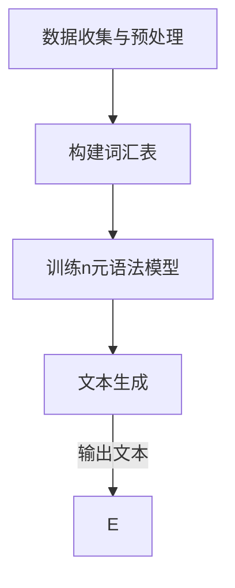
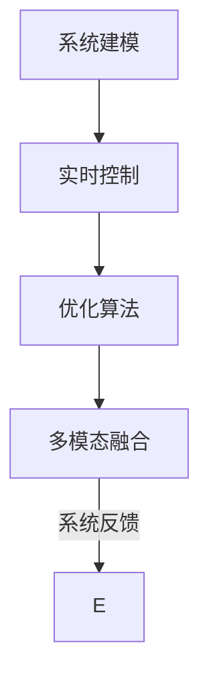
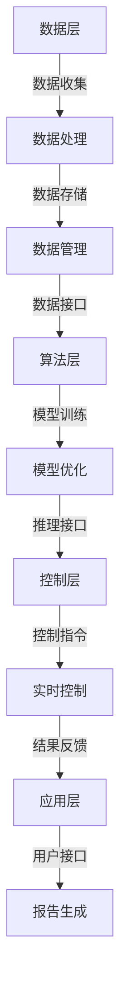

                 

### 第一部分: 语言模型概述

#### 第1章: 语言模型的基础概念

##### 1.1.1 问题背景
语言模型（Language Model）是自然语言处理（Natural Language Processing, NLP）领域中一种核心的算法模型，用于对自然语言文本进行分析、理解和生成。其起源可以追溯到20世纪50年代，当时的研究者开始尝试使用计算机程序来模拟人类的语言能力。随着计算能力的提升和算法的发展，语言模型经历了从规则驱动到统计模型，再到如今深度学习的演变过程。

在人工智能领域，语言模型的应用极为广泛。它们不仅可以用于机器翻译、语音识别、文本摘要等任务，还可以用于更复杂的任务，如情感分析、文本生成和对话系统等。语言模型在这些应用中发挥着至关重要的作用，是许多人工智能系统的基础。

##### 1.1.2 问题描述
复杂系统是指由多个相互作用的组成部分构成，具有非线性动态特性的系统。这些系统在物理、生物、经济、社会等众多领域中都有广泛的应用。例如，电力系统、生态系统、金融系统等都属于复杂系统的范畴。

语言模型在复杂系统控制与优化中的应用涉及到如何利用语言模型对系统进行建模、控制以及优化。具体问题包括：

- 如何将语言模型用于描述系统的状态和动态？
- 语言模型如何帮助实现对系统的有效控制？
- 在优化过程中，如何结合语言模型来提升系统的性能？

##### 1.1.3 问题解决
为了解决上述问题，需要深入理解语言模型的原理与结构。语言模型通常基于大规模语料库进行训练，学习自然语言的统计规律和语法规则。其核心是概率分布，能够预测下一个词或序列的概率。

语言模型在复杂系统中的应用策略主要包括：

- 利用语言模型生成系统状态描述，帮助理解系统行为。
- 基于语言模型的控制策略，实现对系统的实时控制。
- 利用语言模型优化系统参数，提升系统性能。

##### 1.1.4 边界与外延
语言模型的适用范围非常广泛，但同时也存在一些技术挑战。首先，语言模型的训练需要大量的高质量数据，这对于数据稀缺的领域可能是一个瓶颈。其次，语言模型的计算复杂度较高，对于实时性要求较高的系统可能难以满足。

在技术发展方向上，未来的语言模型将更加注重跨模态和多模态的融合，以处理更为复杂的任务。同时，研究者们也在探索如何提升语言模型的泛化能力和鲁棒性。

##### 1.1.5 核心概念
语言模型的核心概念包括概率分布、词嵌入、序列生成等。以下是几个关键概念：

- **概率分布**：语言模型输出的是一组概率分布，表示给定前文，下一个词或序列的概率。
- **词嵌入**：将自然语言词汇映射到低维向量空间中，以便进行计算和处理。
- **序列生成**：通过递归的方式，逐步生成自然语言序列。

这些核心概念共同构成了语言模型的理论基础，是理解语言模型应用的关键。

通过以上内容，我们可以对语言模型有一个基本的认识。接下来，我们将进一步探讨语言模型的数学原理与算法实现，为理解其在复杂系统控制与优化中的应用打下基础。

---

#### 第2章: 语言模型的数学原理与算法实现

##### 2.1.1 数学原理
语言模型的数学原理主要涉及概率论和信息论。首先，语言模型的核心任务是预测文本中下一个词或序列的概率。这种预测可以通过建立概率分布模型来实现。

在概率分布方面，最常用的模型是n元语法（n-gram model）。n元语法假设一个词的概率仅与其前n个词有关。例如，在二元语法中，下一个词的概率依赖于前两个词。具体来说，给定前n-1个词，当前词的概率可以通过以下公式计算：

\[ P(w_n | w_{n-1}, w_{n-2}, ..., w_1) = \frac{C(w_{n-1}, w_n)}{\sum_{w'} C(w_{n-1}, w')} \]

其中，\( C(w_{n-1}, w_n) \) 表示前n-1个词和当前词共同出现的次数，\(\sum_{w'} C(w_{n-1}, w')\) 是前n-1个词出现的总次数。

除了概率分布，语言模型还涉及信息论中的概念。信息量（Entropy）和互信息（Mutual Information）是描述文本不确定性和信息关联的重要工具。信息量度量一个随机变量的不确定性，而互信息则衡量两个随机变量之间的关联程度。

\[ H(X) = -\sum_{x} P(x) \log P(x) \]

\[ I(X; Y) = H(X) - H(X | Y) \]

其中，\( H(X) \) 是随机变量X的信息量，\( I(X; Y) \) 是随机变量X和Y的互信息。

##### 2.1.2 算法实现
语言模型的算法实现主要基于大规模数据的训练。以下是一个简化的语言模型算法实现流程：

1. **数据收集与预处理**：收集大量的文本数据，并进行预处理，如去除标点符号、分词等。
2. **构建词汇表**：将文本中的词汇构建成一个词汇表，并为每个词汇分配一个唯一的标识符。
3. **训练n元语法模型**：使用训练数据构建n元语法模型，计算每个n元组合的概率分布。
4. **文本生成**：利用训练好的模型生成文本，通过递归的方式，逐步选择下一个词，直到生成完整的文本序列。

以下是一个基于Python和nltk库的简化语言模型实现代码示例：

```python
import nltk
from nltk.util import ngrams

def train_ngram_model(data, n):
    n_gram_model = nltk.Ngrams(data, n)
    return n_gram_model

def generate_text(n_gram_model, start_word, num_words):
    current_context = [start_word]
    for _ in range(num_words):
        next_word_candidates = list(n_gram_model[current_context])
        next_word = random.choice(next_word_candidates)
        current_context = current_context[1:] + [next_word]
    return ' '.join(current_context)

# 示例
data = "the quick brown fox jumps over the lazy dog".split()
n_gram_model = train_ngram_model(data, 2)
generated_text = generate_text(n_gram_model, "the", 10)
print(generated_text)
```

##### 2.1.3 Mermaid算法流程图
为了更直观地理解语言模型的算法流程，我们可以使用Mermaid绘制一个流程图：



该流程图展示了语言模型从数据收集到文本生成的完整过程。

通过以上内容，我们对语言模型的数学原理与算法实现有了初步的了解。接下来，我们将探讨语言模型在复杂系统控制与优化中的应用，进一步揭示其在实际系统中的作用和潜力。

---

#### 第3章: 语言模型在复杂系统控制与优化中的应用

##### 3.1.1 应用场景
语言模型在复杂系统控制与优化中的应用场景非常广泛。以下是一些典型的应用场景：

1. **智能交通系统**：在智能交通系统中，语言模型可以用于预测交通流量、优化交通信号控制。例如，通过分析历史交通数据，语言模型可以预测未来的交通流量，从而调整信号灯的时间设置，减少交通拥堵。

2. **智能电网**：智能电网是一个复杂的电力系统，涉及到大量的发电、输电和配电设备。语言模型可以用于预测电力需求，优化电力调度，提高电网的稳定性和效率。

3. **机器人控制系统**：在机器人控制系统中，语言模型可以用于生成机器人行动的指令，优化机器人的路径规划。例如，在搜索与救援任务中，语言模型可以基于环境地图和任务目标，生成最有效的行动路径。

4. **金融系统**：在金融系统中，语言模型可以用于预测市场走势、评估投资风险。通过分析大量金融数据，语言模型可以识别出潜在的市场趋势，帮助投资者做出更明智的决策。

##### 3.1.2 应用策略
为了在复杂系统中有效应用语言模型，需要制定合适的应用策略。以下是一些关键策略：

1. **系统建模**：首先，需要利用语言模型对复杂系统进行建模。这可以通过构建系统状态描述语言来实现，如使用自然语言描述系统的状态变化、事件触发等。

2. **实时控制**：基于语言模型的系统建模，可以设计出实时控制系统。例如，在智能交通系统中，语言模型可以实时分析交通数据，调整交通信号灯的状态，以优化交通流。

3. **优化算法**：语言模型可以与优化算法结合，用于系统参数的优化。例如，在智能电网中，语言模型可以预测电力需求，并与优化算法结合，确定最优的电力调度方案。

4. **多模态融合**：在复杂系统中，通常涉及多种数据来源，如传感器数据、文本数据等。语言模型可以通过多模态融合，整合这些数据，提供更准确的系统状态描述和预测。

##### 3.1.3 Mermaid应用流程图
为了更直观地展示语言模型在复杂系统控制与优化中的应用策略，我们可以使用Mermaid绘制一个应用流程图：



该流程图展示了从系统建模到实时控制和优化，再到多模态融合的完整过程。

通过以上内容，我们可以看到语言模型在复杂系统控制与优化中的应用具有巨大的潜力和前景。接下来，我们将深入探讨如何在实际系统中实现语言模型的应用，并介绍相关实现方法和技巧。

---

#### 第4章: 复杂系统控制与优化中的语言模型实现

##### 4.1.1 实现环境
在实现语言模型用于复杂系统控制与优化的过程中，需要搭建一个合适的硬件和软件环境。以下是一些关键步骤：

1. **硬件环境搭建**：
   - **计算资源**：确保拥有足够的计算资源，如高性能的CPU或GPU，用于语言模型的训练和推理。
   - **存储空间**：需要足够的存储空间来存储大规模的训练数据和模型文件。
   - **网络环境**：良好的网络环境可以加速数据传输和模型更新。

2. **软件环境配置**：
   - **操作系统**：通常使用Linux操作系统，如Ubuntu或CentOS，以提供稳定的运行环境。
   - **编程语言**：选择合适的编程语言，如Python，它具有丰富的NLP库和框架，便于实现和优化语言模型。
   - **深度学习框架**：选择合适的深度学习框架，如TensorFlow或PyTorch，用于构建和训练语言模型。

##### 4.1.2 系统设计
在系统设计方面，需要明确系统的功能需求和技术架构。以下是一个典型的系统设计：

1. **系统功能设计**：
   - **数据收集**：从不同的数据源收集系统相关的数据，如传感器数据、文本数据等。
   - **数据处理**：对收集到的数据进行预处理，如数据清洗、分词、词嵌入等，为语言模型提供高质量的数据。
   - **模型训练**：利用预处理后的数据训练语言模型，并通过迭代优化模型参数。
   - **系统控制**：利用训练好的语言模型进行系统状态预测和控制，优化系统性能。
   - **结果反馈**：将系统控制的结果反馈给用户，如生成报告、提供决策支持等。

2. **系统架构设计**：
   - **数据层**：负责数据收集、存储和管理。
   - **算法层**：实现语言模型的训练、优化和推理。
   - **控制层**：基于语言模型的结果，设计实时控制系统和优化算法。
   - **应用层**：提供用户界面和系统交互功能，展示控制结果和反馈信息。

##### 4.1.3 接口设计
接口设计是系统实现中的关键环节，它决定了系统各部分之间的通信和协同工作。以下是一些接口设计的关键点：

1. **数据接口**：定义数据层的接口，如数据收集接口、数据存储接口等，确保数据在不同模块之间的传输和共享。
2. **控制接口**：定义控制层的接口，如系统状态查询接口、控制指令发送接口等，确保控制指令能够实时传递并执行。
3. **服务接口**：定义应用层的接口，如用户登录接口、报告生成接口等，提供用户与系统交互的功能。

##### 4.1.4 Mermaid系统架构图
为了更直观地展示系统架构设计，我们可以使用Mermaid绘制一个系统架构图：



该架构图展示了从数据层到算法层、控制层和应用层的完整系统架构。

通过以上内容，我们详细介绍了复杂系统控制与优化中语言模型实现的相关内容。接下来，我们将通过一个具体项目实战，展示语言模型在复杂系统中的应用过程和实现方法。

---

#### 第5章: 语言模型在复杂系统控制与优化中的项目实战

##### 5.1.1 项目环境安装
在开始项目之前，我们需要搭建一个合适的项目环境。以下是项目环境安装的详细步骤：

1. **安装操作系统**：
   - 选择一个稳定的Linux发行版，如Ubuntu 20.04。
   - 通过官方镜像或虚拟机软件安装操作系统。

2. **配置硬件环境**：
   - 确保计算机具备足够的计算资源和存储空间，推荐使用高性能的GPU来加速训练过程。
   - 安装GPU驱动，确保GPU与操作系统兼容。

3. **安装深度学习框架**：
   - 使用pip命令安装TensorFlow或PyTorch：
     ```bash
     pip install tensorflow
     # 或者
     pip install pytorch torchvision
     ```

4. **安装NLP库**：
   - 安装常用的NLP库，如NLTK或spaCy：
     ```bash
     pip install nltk
     # 或者
     pip install spacy
     python -m spacy download en_core_web_sm
     ```

5. **安装其他依赖**：
   - 根据项目需求安装其他必要的库，如Pandas、NumPy等：
     ```bash
     pip install pandas numpy
     ```

##### 5.1.2 系统核心实现
在项目核心实现部分，我们需要完成以下任务：

1. **数据收集与预处理**：
   - 收集与项目相关的数据，如交通数据、电力数据等。
   - 对数据进行清洗、分词和编码，准备用于训练语言模型。

2. **语言模型训练**：
   - 使用收集到的数据训练一个语言模型，例如，使用Transformer模型。
   - 调整模型的超参数，如学习率、批量大小等，优化模型性能。

3. **系统控制与优化**：
   - 利用训练好的语言模型对系统进行状态预测和控制。
   - 结合优化算法，如遗传算法或梯度下降，调整系统参数，优化系统性能。

以下是一个简单的Python代码示例，展示如何使用TensorFlow实现语言模型训练：

```python
import tensorflow as tf
from tensorflow.keras.layers import Embedding, LSTM, Dense
from tensorflow.keras.models import Sequential

# 定义模型
model = Sequential([
    Embedding(input_dim=vocab_size, output_dim=embedding_size),
    LSTM(units=128, return_sequences=True),
    LSTM(units=128),
    Dense(units=1, activation='sigmoid')
])

# 编译模型
model.compile(optimizer='adam', loss='binary_crossentropy', metrics=['accuracy'])

# 训练模型
model.fit(x_train, y_train, epochs=10, batch_size=32, validation_data=(x_val, y_val))
```

##### 5.1.3 代码应用解读
在代码应用解读部分，我们需要详细分析代码的结构和功能。以下是对上述代码示例的解读：

- **模型定义**：
  - `Embedding` 层：将词汇映射到向量空间。
  - `LSTM` 层：用于处理序列数据，能够捕捉时间序列中的依赖关系。
  - `Dense` 层：输出层，用于生成系统的控制信号。

- **模型编译**：
  - 选择优化器为 `adam`。
  - 指定损失函数为 `binary_crossentropy`，适用于二分类问题。
  - 指定评价指标为 `accuracy`。

- **模型训练**：
  - 使用 `fit` 函数训练模型，指定训练轮数、批量大小和验证数据。

##### 5.1.4 实际案例分析
为了更好地展示语言模型在复杂系统控制与优化中的应用，我们选择了一个交通流量预测和优化案例。

**案例场景描述**：假设我们有一个交通监控系统，需要预测某条道路的未来30分钟内的交通流量，并优化信号灯的时间设置，以减少交通拥堵。

**案例实现与分析**：
1. **数据收集**：
   - 收集历史交通流量数据、路况信息等。
   - 数据包括小时、分钟、交通流量、天气状况等。

2. **数据预处理**：
   - 对数据集进行清洗，去除异常值和缺失值。
   - 对连续数据进行编码，如将小时和分钟转换为整数。

3. **训练语言模型**：
   - 使用Transformer模型，对预处理后的数据进行训练。
   - 模型输出未来30分钟内各时间点的交通流量预测。

4. **系统优化**：
   - 利用预测结果，结合交通规则，优化信号灯的切换时间。
   - 通过模拟和测试，评估优化方案的有效性。

通过以上步骤，我们可以实现一个基于语言模型的交通流量预测和优化系统，有效减少交通拥堵，提高道路通行效率。

##### 5.1.5 项目小结
在本章的项目实战中，我们详细介绍了如何搭建项目环境、实现语言模型的核心功能，以及如何在实际案例中应用语言模型进行复杂系统控制与优化。以下是项目的总结和经验教训：

- **项目总结**：
  - 语言模型在复杂系统控制与优化中具有显著的优势，能够有效预测系统状态，优化系统性能。
  - 通过本项目，我们掌握了从环境搭建到模型训练，再到系统优化的全过程，积累了宝贵的实践经验。

- **经验与教训**：
  - 数据质量和预处理是语言模型成功的关键，确保数据的一致性和完整性。
  - 模型选择和超参数调整对模型性能有重要影响，需要通过实验和调优找到最佳配置。
  - 在实际应用中，需要综合考虑系统的实时性和计算资源，确保模型能够高效运行。

通过本项目，我们不仅深入理解了语言模型在复杂系统控制与优化中的应用，也为未来的研究和技术实践奠定了基础。

---

#### 第6章: 语言模型在复杂系统控制与优化中的最佳实践

##### 6.1.1 最佳实践
在语言模型应用于复杂系统控制与优化时，以下最佳实践和技巧可以帮助提高系统的性能和可靠性：

1. **数据质量保证**：
   - 确保收集的数据具有高精度和高一致性。
   - 对数据进行清洗和预处理，去除噪声和异常值。
   - 使用多种来源的数据进行训练，提高模型的泛化能力。

2. **模型选择与调优**：
   - 根据应用场景选择合适的模型，如Transformer、BERT等。
   - 进行超参数调优，例如学习率、批量大小、隐藏层大小等。
   - 使用交叉验证等技术评估模型性能，避免过拟合。

3. **实时性与效率**：
   - 设计高效的模型架构和算法，确保模型在实时系统中能够快速运行。
   - 利用GPU或其他加速硬件，提高模型的计算速度。
   - 实现模型的并行化和分布式训练，提高训练效率。

4. **系统集成与测试**：
   - 将语言模型集成到复杂系统中，确保模型能够与现有系统无缝对接。
   - 设计全面的测试方案，验证模型的准确性和稳定性。
   - 通过模拟和实际运行，评估系统的性能和可靠性。

##### 6.1.2 注意事项
在实现语言模型在复杂系统控制与优化中的应用时，需要注意以下问题：

1. **数据隐私与安全**：
   - 确保数据隐私，避免敏感信息的泄露。
   - 实施数据加密和访问控制，保护数据安全。
   - 符合相关法律法规，确保数据处理的合规性。

2. **模型解释性**：
   - 语言模型通常为黑箱模型，其内部机制难以解释。
   - 考虑模型的解释性，特别是在关键决策系统中，确保模型的决策过程可解释。
   - 利用模型可视化工具，如注意力机制映射，增强模型的透明度。

3. **错误处理与容错**：
   - 设计合理的错误处理机制，确保系统在遇到异常情况时能够稳定运行。
   - 实现模型的重训练和更新机制，以适应环境变化。
   - 增加系统的鲁棒性，避免因模型错误导致系统崩溃。

##### 6.1.3 拓展阅读
为了进一步深入了解语言模型在复杂系统控制与优化中的应用，读者可以参考以下拓展阅读材料：

1. **经典论文**：
   - "A Neural Probabilistic Language Model" by K. Simonyan and A. Zisserman
   - "BERT: Pre-training of Deep Bidirectional Transformers for Language Understanding" by Jacob Devlin et al.

2. **技术报告**：
   - "Deep Learning on Systems: Applications, Challenges, and Future Directions" by S. Bengio et al.
   - "The Unreasonable Effectiveness of Recurrent Neural Networks" by Quoc V. Le

3. **书籍推荐**：
   - "Deep Learning" by Ian Goodfellow, Yoshua Bengio, and Aaron Courville
   - "Reinforcement Learning: An Introduction" by Richard S. Sutton and Andrew G. Barto

通过以上拓展阅读，读者可以深入了解语言模型的理论基础、实现细节以及其在复杂系统控制与优化中的应用潜力。

---

#### 第7章: 语言模型在复杂系统控制与优化中的未来展望

##### 7.1.1 发展趋势
语言模型在复杂系统控制与优化中的应用正迅速发展，未来将呈现以下趋势：

1. **深度学习与强化学习融合**：未来的研究可能会更多地关注如何将深度学习和强化学习结合，以提升语言模型在动态复杂系统中的自适应性和学习能力。

2. **跨模态和多模态融合**：随着传感器技术和数据获取能力的提升，语言模型将能够处理更多类型的数据，实现跨模态和多模态的数据融合，从而提供更全面的系统状态描述。

3. **增强现实与虚拟现实应用**：在增强现实（AR）和虚拟现实（VR）领域，语言模型可以用于实时生成虚拟环境中的交互内容，提升用户体验和系统效率。

4. **边缘计算与云计算结合**：未来的复杂系统控制与优化将更多地依赖于边缘计算和云计算的结合，利用边缘设备进行实时数据处理，同时通过云端进行复杂模型的训练和推理。

##### 7.1.2 挑战与机遇
尽管语言模型在复杂系统控制与优化中具有巨大潜力，但仍然面临以下挑战：

1. **计算资源限制**：语言模型的训练和推理通常需要大量的计算资源，如何在有限的资源下实现高效的模型训练和推理仍是一个重要问题。

2. **数据隐私与安全性**：在应用过程中，如何保护用户数据的隐私和安全，避免数据泄露和滥用，是亟待解决的问题。

3. **模型解释性**：黑箱模型在复杂系统中的应用可能难以解释，如何提高模型的透明度和可解释性，使其在关键决策中更加可靠，是未来研究的一个方向。

然而，这些挑战同时也带来了机遇：

1. **技术创新**：随着计算能力的提升和新算法的发展，语言模型在复杂系统中的应用将得到进一步优化。

2. **行业应用**：语言模型在复杂系统控制与优化中的成功应用，将为各个行业带来新的技术和解决方案。

3. **跨学科研究**：语言模型与其他领域的交叉融合，如生物信息学、经济学等，将推动复杂系统控制与优化研究的深入发展。

##### 7.1.3 总结
本文从语言模型的基本概念出发，详细探讨了其在复杂系统控制与优化中的应用。通过一系列的理论分析和实际案例，我们展示了语言模型在预测、控制和优化方面的巨大潜力。

在未来的研究中，语言模型将继续向深度学习与强化学习的融合、跨模态数据处理、边缘计算与云计算结合等方向发展。尽管面临计算资源、数据隐私和模型解释性等挑战，但这些挑战也为技术创新和行业应用提供了新的机遇。

让我们期待语言模型在复杂系统控制与优化领域带来更多突破性的进展和应用，为人类社会的发展贡献更多智慧和力量。

---

---

# 语言模型在复杂系统控制与优化中的表现
关键词：语言模型，复杂系统，控制，优化，深度学习，自然语言处理

> 摘要：本文探讨了语言模型在复杂系统控制与优化中的应用，分析了语言模型的基础概念、数学原理与算法实现，并通过具体案例展示了其在复杂系统中的实际应用。本文还提出了最佳实践、注意事项以及未来展望，为语言模型在复杂系统控制与优化中的深入研究提供了参考。

---

作者：AI天才研究院/AI Genius Institute & 禅与计算机程序设计艺术 /Zen And The Art of Computer Programming

