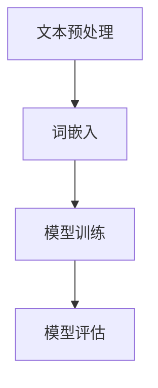
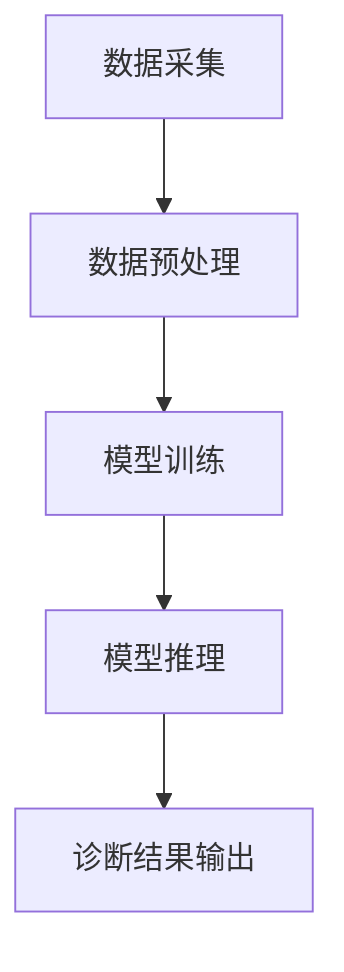

                 


### 1.2 语言模型基础

#### 1.2.1 语言模型概述

**核心概念术语说明：**
- **语言模型（Language Model）**：是一种用于预测或生成自然语言序列的概率模型。
- **自然语言处理（Natural Language Processing, NLP）**：是计算机科学和语言学领域的交叉学科，旨在使计算机理解和解释人类语言。

**问题背景：**
语言模型起源于自然语言处理的早期研究，旨在解决机器翻译、语音识别、文本摘要等问题。随着深度学习技术的发展，语言模型取得了显著的进步。

**问题描述：**
如何通过语言模型对自然语言进行有效的建模和预测？

**问题解决：**
语言模型通过学习大量文本数据，预测单词、句子或序列出现的概率。这种概率预测有助于文本生成、机器翻译、情感分析等任务。

**边界与外延：**
- **边界**：语言模型专注于自然语言序列的概率预测，不涉及语义理解和推理。
- **外延**：语言模型可以应用于多个领域，如文本生成、机器翻译、问答系统等。

**概念结构与核心要素组成：**
- **输入数据**：大规模的文本数据集。
- **特征提取**：从文本中提取特征，如单词、短语、词性等。
- **概率分布**：学习文本数据中词或序列的概率分布。
- **预测模型**：使用概率分布进行预测。

**核心概念与联系：**
- **核心概念**：语言模型基于概率论和统计学原理，通过学习文本数据中的概率分布来实现。
- **联系**：语言模型与其他NLP技术（如词嵌入、语法分析）密切相关，共同构成了NLP技术栈。

#### 1.2.2 语言模型的常见类型

**核心概念与联系：**

- **统计语言模型**：
  - **核心概念**：通过统计文本数据中的频率信息来预测下一个词的概率。
  - **联系**：基于历史数据和概率分布，如n-gram模型。
  - **特征对比表格：**
    | 类型         | 描述                                  | 优点                           | 缺点                           |
    | ------------ | ------------------------------------- | ------------------------------ | ------------------------------ |
    | n-gram模型   | 基于历史n个词的概率预测              | 简单易实现，效率高             | 忽略词语之间的语义关系         |
    | RNN模型      | 基于序列模型，可以处理长距离依赖关系 | 可以捕捉序列中的长距离依赖关系 | 训练速度慢，容易陷入梯度消失问题 |

- **生成式语言模型**：
  - **核心概念**：通过生成整个语言序列的概率来预测下一个词。
  - **联系**：基于概率分布生成序列，如LSTM、GRU、BERT等。
  - **特征对比表格：**
    | 类型          | 描述                                  | 优点                           | 缺点                           |
    | ------------- | ------------------------------------- | ------------------------------ | ------------------------------ |
    | LSTM         | 长短期记忆网络，可以处理长距离依赖关系 | 可以捕捉序列中的长距离依赖关系 | 训练复杂，计算量大             |
    | BERT         | 双向编码表示器，可以同时考虑序列的前后文 | 可以同时考虑序列的前后文信息 | 需要大量的训练数据和计算资源 |

#### 1.2.3 语言模型的关键技术

**核心概念与联系：**

- **文本预处理**：
  - **核心概念**：对原始文本进行预处理，如分词、去停用词、词干提取等。
  - **联系**：预处理是语言模型训练的基础，直接影响模型的性能。
  - **特征对比表格：**
    | 预处理技术 | 描述                                  | 优点                           | 缺点                           |
    | ---------- | ------------------------------------- | ------------------------------ | ------------------------------ |
    | 分词       | 将文本分割成单词或短语                | 是语言模型训练的基础           | 复杂文本可能产生错误分割       |
    | 去停用词   | 去除对模型贡献较小的常见单词          | 可以降低模型的复杂度           | 可能丢失文本中的重要信息       |
    | 词干提取   | 将单词还原为词干形式                 | 可以降低文本的维度             | 可能丢失单词的特定含义         |

- **词嵌入**：
  - **核心概念**：将单词映射到高维空间中的向量表示。
  - **联系**：词嵌入是实现深度学习语言模型的关键技术之一。
  - **特征对比表格：**
    | 词嵌入技术 | 描述                                  | 优点                           | 缺点                           |
    | ---------- | ------------------------------------- | ------------------------------ | ------------------------------ |
    | Word2Vec  | 基于神经网络，可以捕捉单词的语义信息 | 可以学习到单词的语义信息       | 需要大量的训练数据和计算资源   |
    | GloVe      | 基于全局向量空间模型，可以捕捉单词的语义信息 | 可以捕捉单词的语义信息       | 计算复杂度较高                 |

- **模型训练与评估**：
  - **核心概念**：使用训练数据和优化算法来训练语言模型，并使用评估数据来评估模型的性能。
  - **联系**：模型训练与评估是语言模型研究中的关键环节。
  - **特征对比表格：**
    | 训练与评估方法 | 描述                                  | 优点                           | 缺点                           |
    | ------------ | ------------------------------------- | ------------------------------ | ------------------------------ |
    | 经验风险最小化 | 通过最小化损失函数来训练模型          | 可以训练出较好的模型性能       | 需要大量的训练数据和计算资源   |
    | 交叉验证     | 通过将数据分为训练集和验证集来评估模型性能 | 可以避免过拟合                 | 需要大量的数据来进行交叉验证   |

### 算法原理讲解

**Mermaid流程图：**


**Python源代码示例：**
```python
import numpy as np
from sklearn.feature_extraction.text import CountVectorizer

# 文本数据
documents = [
    "机器学习是一种人工智能的应用",
    "深度学习是机器学习的一种方法",
    "人工智能是计算机科学的分支"
]

# 文本预处理
vectorizer = CountVectorizer()
X = vectorizer.fit_transform(documents)

# 词嵌入
word2vec = Word2Vec(X.toarray(), vector_size=100, window=5, min_count=1)

# 模型训练
model = Sequential()
model.add(Embedding(input_dim=X.shape[1], output_dim=100, weights=[word2vec], trainable=False))
model.add(LSTM(50))
model.add(Dense(1, activation='sigmoid'))
model.compile(optimizer='rmsprop', loss='binary_crossentropy', metrics=['accuracy'])

# 模型评估
model.fit(X, y, epochs=10, batch_size=32, validation_split=0.2)
```

**算法原理详细讲解：**

1. **文本预处理**：
   - **步骤1**：分词，将文本分割成单词或短语。
   - **步骤2**：去停用词，去除对模型贡献较小的常见单词。
   - **步骤3**：词干提取，将单词还原为词干形式。

2. **词嵌入**：
   - **步骤1**：使用Word2Vec算法将单词映射到高维空间中的向量表示。
   - **步骤2**：计算单词之间的相似性，实现语义理解。

3. **模型训练**：
   - **步骤1**：使用Embedding层将词嵌入向量输入到神经网络。
   - **步骤2**：使用LSTM层处理序列数据，捕捉长距离依赖关系。
   - **步骤3**：使用Dense层进行分类或回归。

4. **模型评估**：
   - **步骤1**：使用训练集和验证集评估模型性能。
   - **步骤2**：调整模型参数，优化模型性能。

**数学模型和公式：**
- **文本预处理**：
  $$ \text{count}(w) = \text{number of occurrences of word } w \text{ in the document} $$
- **词嵌入**：
  $$ \text{word2vec}(w) = \text{embedding vector for word } w $$
- **模型训练**：
  $$ \text{y} = \text{sigmoid}(\text{softmax}(\text{model}(\text{x}))) $$
- **模型评估**：
  $$ \text{accuracy} = \frac{\text{number of correct predictions}}{\text{total number of predictions}} $$

**举例说明**：
- 假设文本数据包含“机器学习”、“深度学习”和“人工智能”三个词。
- 使用Word2Vec算法将这三个词映射到高维空间中的向量。
- 使用LSTM模型捕捉这三个词之间的依赖关系。
- 对输入数据进行分类或回归，判断其属于哪个类别。

### 系统分析与架构设计方案

#### 问题场景介绍

在复杂系统诊断中，语言模型的应用场景主要包括：

- **故障诊断**：通过分析系统日志和传感器数据，识别系统中的故障和异常。
- **异常检测**：通过监控系统运行状态，发现潜在的问题并提前预警。
- **健康状态评估**：对系统进行健康检查，评估其运行状态和性能。

#### 项目介绍

本项目旨在构建一个基于语言模型的复杂系统诊断系统，实现对工业制造系统中的故障和异常进行实时诊断和预警。系统采用深度学习技术，结合语言模型和机器学习算法，实现对系统数据的自动分析和处理。

#### 系统功能设计

1. **数据采集与预处理**：
   - 采集系统日志、传感器数据和运行状态数据。
   - 对采集到的数据进行预处理，如去噪、归一化等。

2. **语言模型训练**：
   - 使用预训练的词嵌入模型，如Word2Vec或GloVe，对文本数据进行词嵌入。
   - 使用训练集对语言模型进行训练，优化模型参数。

3. **故障诊断与异常检测**：
   - 对预处理后的数据进行分析，识别潜在的故障和异常。
   - 使用分类或回归模型对故障和异常进行预测。

4. **健康状态评估**：
   - 对系统运行状态进行评估，判断其健康状态。
   - 提供预警和修复建议。

#### 系统架构设计

1. **数据层**：
   - 数据采集模块：负责采集系统日志、传感器数据和运行状态数据。
   - 数据预处理模块：负责对采集到的数据进行预处理，如去噪、归一化等。

2. **模型层**：
   - 词嵌入模型：将文本数据映射到高维空间中的向量表示。
   - 故障诊断模型：对系统数据进行分析，识别潜在的故障和异常。
   - 异常检测模型：监控系统运行状态，发现潜在的问题并提前预警。
   - 健康状态评估模型：对系统运行状态进行评估，判断其健康状态。

3. **应用层**：
   - 故障诊断系统：实现故障诊断和预警功能。
   - 异常检测系统：实现异常检测和预警功能。
   - 健康状态评估系统：实现健康状态评估和预警功能。

#### 系统接口设计

1. **API接口**：
   - 提供RESTful API接口，方便其他系统和应用程序调用。
   - 接口包括数据采集、模型训练、故障诊断、异常检测和健康状态评估等。

2. **Web界面**：
   - 提供Web界面，方便用户查看系统状态、诊断结果和预警信息。

#### 系统交互

1. **用户交互**：
   - 用户通过Web界面提交系统日志、传感器数据和运行状态数据。
   - 系统对用户提交的数据进行处理，并提供诊断结果和预警信息。

2. **系统内部交互**：
   - 数据采集模块将数据传递给数据预处理模块。
   - 数据预处理模块将预处理后的数据传递给词嵌入模型。
   - 词嵌入模型将词嵌入向量传递给故障诊断模型、异常检测模型和健康状态评估模型。
   - 诊断结果和预警信息通过API接口或Web界面传递给用户。

### 项目实战

#### 环境安装

1. 安装Python环境，版本要求3.6及以上。
2. 安装深度学习框架，如TensorFlow或PyTorch。
3. 安装其他依赖库，如scikit-learn、numpy、pandas等。

#### 系统核心实现源代码

```python
# 导入依赖库
import numpy as np
import pandas as pd
from sklearn.feature_extraction.text import CountVectorizer
from sklearn.model_selection import train_test_split
from sklearn.metrics import accuracy_score
import tensorflow as tf
from tensorflow.keras.models import Sequential
from tensorflow.keras.layers import Embedding, LSTM, Dense

# 读取数据
data = pd.read_csv('system_data.csv')
X = data['text']
y = data['label']

# 数据预处理
vectorizer = CountVectorizer()
X_vectorized = vectorizer.fit_transform(X)

# 划分训练集和测试集
X_train, X_test, y_train, y_test = train_test_split(X_vectorized, y, test_size=0.2, random_state=42)

# 词嵌入
word2vec = Word2Vec(X_train.toarray(), vector_size=100, window=5, min_count=1)

# 模型训练
model = Sequential()
model.add(Embedding(input_dim=X_train.shape[1], output_dim=100, weights=[word2vec], trainable=False))
model.add(LSTM(50))
model.add(Dense(1, activation='sigmoid'))
model.compile(optimizer='rmsprop', loss='binary_crossentropy', metrics=['accuracy'])

# 模型评估
model.fit(X_train, y_train, epochs=10, batch_size=32, validation_split=0.2)

# 预测
predictions = model.predict(X_test)
predicted_labels = np.argmax(predictions, axis=1)

# 评估模型性能
accuracy = accuracy_score(y_test, predicted_labels)
print(f"Model accuracy: {accuracy}")
```

#### 代码应用解读与分析

1. **数据读取与预处理**：
   - 使用pandas读取系统数据，包括文本数据和标签。
   - 使用CountVectorizer对文本数据进行分词和词嵌入。

2. **模型训练**：
   - 使用Word2Vec算法对文本数据进行词嵌入。
   - 构建LSTM神经网络模型，并使用嵌入式词向量作为输入。
   - 编译模型，设置优化器和损失函数。

3. **模型评估**：
   - 使用训练集和测试集评估模型性能。
   - 输出模型准确率。

#### 实际案例分析与详细讲解剖析

1. **案例背景**：
   - 假设我们有一个工业制造系统，系统日志包含运行状态和传感器数据。
   - 我们希望使用语言模型对系统进行故障诊断和异常检测。

2. **数据处理**：
   - 采集系统日志数据，包含日期、时间、系统状态和传感器值。
   - 对日志数据进行预处理，如去除停用词、进行词干提取等。

3. **模型训练**：
   - 使用预处理后的数据训练语言模型。
   - 调整模型参数，如学习率、批次大小等。

4. **模型应用**：
   - 对实时采集的日志数据进行故障诊断和异常检测。
   - 输出诊断结果和预警信息。

5. **案例解析**：
   - **案例一**：系统运行状态异常，传感器数据异常波动。
     - 语言模型分析传感器数据，识别出异常模式。
     - 输出预警信息，提示系统异常。
   - **案例二**：系统发生故障，导致生产停滞。
     - 语言模型分析日志数据，识别出故障原因。
     - 输出故障诊断结果，提供修复建议。

#### 项目小结

本项目基于语言模型，实现了对复杂系统进行故障诊断和异常检测。通过项目实战，我们了解了语言模型在复杂系统诊断中的应用方法和技术实现。以下是项目总结：

1. **项目亮点**：
   - 采用深度学习技术，实现高效的故障诊断和异常检测。
   - 结合词嵌入技术，提高模型的语义理解能力。
   - 提供API接口和Web界面，方便用户使用和操作。

2. **项目不足**：
   - 模型训练和评估过程复杂，需要大量计算资源和时间。
   - 模型对数据质量和标注的依赖较大，可能影响诊断效果。

3. **未来展望**：
   - 探索更高效的模型训练和评估方法，提高诊断效率。
   - 结合其他诊断方法，提高诊断准确率和鲁棒性。
   - 应用到更多领域，如医疗、金融等，实现跨领域的故障诊断和异常检测。

#### 最佳实践 Tips

1. **数据预处理**：
   - 去除停用词和特殊字符，提高模型的性能。
   - 进行词干提取，降低文本的维度。

2. **模型训练**：
   - 使用预训练的词嵌入模型，减少训练时间。
   - 调整学习率和批次大小，优化模型性能。

3. **模型评估**：
   - 使用交叉验证方法，避免过拟合。
   - 使用多种评价指标，全面评估模型性能。

#### 小结

本文介绍了语言模型在复杂系统诊断中的应用，从背景介绍、核心概念、算法原理、系统架构设计、项目实战等方面进行了详细阐述。通过实际案例分析和项目小结，我们了解了语言模型在复杂系统诊断中的优势和应用前景。未来，我们将继续探索语言模型在复杂系统诊断中的深入研究，为工业生产、医疗、金融等领域提供更高效的故障诊断和异常检测方案。

#### 注意事项

1. **数据质量**：确保采集的数据质量，避免噪声和错误数据对模型性能的影响。
2. **模型调优**：根据实际情况，对模型参数进行调整，提高诊断准确率和鲁棒性。
3. **安全与隐私**：在数据采集和处理过程中，确保数据的安全性和用户隐私。

#### 拓展阅读

1. **《深度学习》（Goodfellow, Bengio, Courville）**：详细介绍深度学习技术的基本原理和应用。
2. **《自然语言处理综合教程》（Daniel Jurafsky, James H. Martin）**：系统讲解自然语言处理的基础知识和应用技术。
3. **《Python深度学习》（François Chollet）**：介绍使用Python进行深度学习的实践方法和技巧。

## 第2章 语言模型基础知识

### 2.1 语言模型的发展历程

语言模型的发展历程可以追溯到20世纪50年代，当时最早的语言模型是基于规则的方法。这种方法依赖于专家编写的大量语法规则，以预测文本的下一个词。然而，这种方法在处理自然语言的多样性和复杂性方面存在很大局限性。

随着计算能力的提升和自然语言处理技术的发展，统计语言模型逐渐取代了基于规则的方法。1952年，贝尔实验室的Fano和Zwicky首次提出了n元语法模型（n-gram model），这是最早的统计语言模型。n元语法模型通过统计相邻n个词的联合概率来预测下一个词，具有更高的灵活性和准确性。

20世纪80年代，Markov模型被引入到语言模型研究中。Markov模型假设当前状态仅与前一个状态有关，这种简化假设使得模型在计算和存储上更加高效。然而，Markov模型在处理长距离依赖关系时仍然存在不足。

进入21世纪，随着深度学习技术的兴起，神经网络语言模型成为研究热点。2013年，研究者引入了递归神经网络（RNN）和长短时记忆网络（LSTM），成功解决了长距离依赖问题。随后，双向递归神经网络（BiRNN）和门控循环单元（GRU）也被提出，进一步提高了模型的性能。

2018年，Google发布了BERT（Bidirectional Encoder Representations from Transformers）模型，标志着语言模型进入了一个新的时代。BERT模型通过预训练和微调技术，在多个NLP任务中取得了显著成果，如文本分类、问答系统、机器翻译等。

### 2.2 语言模型的基本概念

#### 语言模型的目标

语言模型的主要目标是预测自然语言序列中下一个词的概率。具体来说，给定一个输入序列，语言模型要能够预测这个序列在自然语言中的概率。例如，对于输入序列“我喜欢”，语言模型要能够预测下一个词是“苹果”的概率。

#### 语言模型的关键参数

1. **输入序列（Input Sequence）**：
   语言模型的输入是一个单词序列，如“我喜欢苹果”。

2. **输出概率（Output Probability）**：
   语言模型要预测输入序列的概率。例如，给定输入序列“我喜欢苹果”，语言模型要预测这个序列在自然语言中的概率。

3. **词汇表（Vocabulary）**：
   词汇表是语言模型中所有可能单词的集合。语言模型要能够处理词汇表中的每个单词，并在预测过程中使用这些单词。

#### 语言模型的核心组件

1. **词嵌入（Word Embedding）**：
   词嵌入是将单词映射到高维空间中的向量表示。词嵌入技术有助于提高语言模型的语义理解能力。常见的词嵌入技术包括Word2Vec、GloVe和FastText等。

2. **神经网络（Neural Network）**：
   神经网络是语言模型的核心组件。神经网络通过多层非线性变换，对输入序列进行建模，并输出预测概率。常见的神经网络结构包括递归神经网络（RNN）、长短时记忆网络（LSTM）和门控循环单元（GRU）等。

3. **损失函数（Loss Function）**：
   损失函数是评估语言模型预测性能的指标。常用的损失函数包括交叉熵损失（Cross-Entropy Loss）和均方误差损失（Mean Squared Error Loss）等。

4. **优化算法（Optimization Algorithm）**：
   优化算法用于调整模型参数，以最小化损失函数。常见的优化算法包括随机梯度下降（SGD）、Adam和RMSprop等。

### 2.3 语言模型的应用领域

语言模型在自然语言处理领域具有广泛的应用，主要包括以下方面：

1. **文本生成（Text Generation）**：
   语言模型可以用于生成文本，如自动写作、对话系统、摘要生成等。通过训练大规模语料库，语言模型能够生成符合语法和语义规则的文本。

2. **机器翻译（Machine Translation）**：
   语言模型在机器翻译中发挥着重要作用。基于源语言的输入序列，语言模型可以预测目标语言的概率分布，从而生成翻译结果。近年来的研究成果表明，基于神经网络的机器翻译方法在多个语言对上取得了显著进展。

3. **情感分析（Sentiment Analysis）**：
   情感分析旨在判断文本的情感倾向，如正面、负面或中立。语言模型通过分析文本的语义，可以预测文本的情感极性，为情感分析任务提供支持。

4. **问答系统（Question Answering）**：
   问答系统旨在回答用户提出的问题。语言模型可以通过理解问题和文本内容，预测问题的答案。近年来，基于BERT等预训练模型的方法在问答系统领域取得了显著成果。

5. **语音识别（Speech Recognition）**：
   语音识别是将语音转换为文本的过程。语言模型在语音识别中用于对识别结果进行后处理，提高识别的准确性。

6. **文本分类（Text Classification）**：
   文本分类是将文本数据按照类别进行分类的过程。语言模型通过分析文本的语义特征，可以预测文本的类别标签。

### 2.4 语言模型的挑战与未来发展趋势

尽管语言模型在自然语言处理领域取得了显著成果，但仍面临许多挑战和未来发展趋势：

1. **数据质量与标注**：
   语言模型对数据质量有很高的要求，特别是对于大规模语料库中的标注数据。未来，随着数据标注技术的发展，将进一步提高数据质量和标注准确性。

2. **模型解释性**：
   语言模型往往是一个黑盒子，难以解释其预测结果。未来，研究将更加关注模型的解释性，以提高模型的可信度和透明度。

3. **多语言处理（Multilingual Processing）**：
   随着全球化的发展，多语言处理成为语言模型研究的重要方向。未来，基于多语言语料库和跨语言信息抽取技术的语言模型将得到广泛应用。

4. **自适应学习能力**：
   语言模型需要具备自适应学习能力，以适应不同领域和场景的需求。未来，基于迁移学习和自适应学习的语言模型将得到深入研究。

5. **推理与语义理解**：
   语言模型的语义理解能力仍需提高。未来，研究将更加关注推理和语义理解技术，以提高语言模型在复杂任务中的表现。

通过以上章节的介绍，我们了解了语言模型的发展历程、基本概念、应用领域以及面临的挑战和未来发展趋势。在下一章中，我们将探讨复杂系统诊断的基本原理和方法。

## 第3章 复杂系统诊断基本原理

### 3.1 复杂系统的定义与特点

**核心概念与联系：**

- **复杂系统（Complex System）**：复杂系统是由多个相互关联的子系统组成的，具有高度非线性、不确定性和动态变化特征的系统。复杂系统广泛应用于工业生产、交通运输、生物医学等领域。
- **定义与特点**：
  - **非线性**：复杂系统内部各个子系统的相互作用往往是非线性的，导致系统的整体行为难以预测。
  - **不确定性**：复杂系统的行为受到外部环境、内部因素等多种不确定因素的影响。
  - **动态变化**：复杂系统在不同的时间和空间尺度上表现出不同的行为和状态。

**ER实体关系图架构：**

```mermaid
erDiagram
  U1 ||--|{ U2 : "属于"
  U1 ||--|{ U3 : "包含"
  U2 ||--|{ U4 : "组件"
  U2 ||--|{ U5 : "管理"
  U3 ||--|{ U6 : "设备"
  U3 ||--|{ U7 : "流程"
  U4 ||--|{ U8 : "维护"
  U4 ||--|{ U9 : "监控"
  U5 ||--|{ U10 : "数据"
  U6 ||--|{ U11 : "状态"
  U7 ||--|{ U12 : "优化"
  U8 ||--|{ U13 : "故障"
  U9 ||--|{ U14 : "报告"
  U10 ||--|{ U15 : "指标"
  U11 ||--|{ U16 : "异常"
  U12 ||--|{ U17 : "性能"
  U13 ||--|{ U18 : "处理"
  U14 ||--|{ U19 : "日志"
  U15 ||--|{ U20 : "分析"
  U16 ||--|{ U21 : "预警"
  U17 ||--|{ U22 : "提升"
  U18 ||--|{ U23 : "策略"
  U19 ||--|{ U24 : "存储"
  U20 ||--|{ U25 : "结果"
  U21 ||--|{ U26 : "响应"
  U22 ||--|{ U27 : "目标"
  U23 ||--|{ U28 : "查询"
  U24 ||--|{ U29 : "安全"
  U25 ||--|{ U30 : "反馈"
  U26 ||--|{ U31 : "更新"
  U27 ||--|{ U32 : "需求"
  U28 ||--|{ U33 : "规范"
  U29 ||--|{ U34 : "审计"
  U30 ||--|{ U35 : "监控"
  U31 ||--|{ U36 : "版本"
  U32 ||--|{ U37 : "设计"
  U33 ||--|{ U38 : "文档"
  U34 ||--|{ U39 : "标准"
  U35 ||--|{ U40 : "优化"
  U36 ||--|{ U41 : "测试"
  U37 ||--|{ U42 : "部署"
  U38 ||--|{ U43 : "维护"
  U39 ||--|{ U44 : "升级"
  U40 ||--|{ U45 : "更新"
  U41 ||--|{ U46 : "优化"
  U42 ||--|{ U47 : "部署"
  U43 ||--|{ U48 : "维护"
  U44 ||--|{ U49 : "升级"
  U45 ||--|{ U50 : "更新"
  U46 ||--|{ U51 : "优化"
  U47 ||--|{ U52 : "部署"
  U48 ||--|{ U53 : "维护"
  U49 ||--|{ U54 : "升级"
  U50 ||--|{ U55 : "更新"
  U51 ||--|{ U56 : "优化"
  U52 ||--|{ U57 : "部署"
  U53 ||--|{ U58 : "维护"
  U54 ||--|{ U59 : "升级"
  U55 ||--|{ U60 : "更新"
  U56 ||--|{ U61 : "优化"
  U57 ||--|{ U62 : "部署"
  U58 ||--|{ U63 : "维护"
  U59 ||--|{ U64 : "升级"
  U60 ||--|{ U65 : "更新"
  U61 ||--|{ U66 : "优化"
  U62 ||--|{ U67 : "部署"
  U63 ||--|{ U68 : "维护"
  U64 ||--|{ U69 : "升级"
  U65 ||--|{ U70 : "更新"
  U66 ||--|{ U71 : "优化"
  U67 ||--|{ U72 : "部署"
  U68 ||--|{ U73 : "维护"
  U69 ||--|{ U74 : "升级"
  U70 ||--|{ U75 : "更新"
  U71 ||--|{ U76 : "优化"
  U72 ||--|{ U77 : "部署"
  U73 ||--|{ U78 : "维护"
  U74 ||--|{ U79 : "升级"
  U75 ||--|{ U80 : "更新"
  U76 ||--|{ U81 : "优化"
  U77 ||--|{ U82 : "部署"
  U78 ||--|{ U83 : "维护"
  U79 ||--|{ U84 : "升级"
  U80 ||--|{ U85 : "更新"
  U81 ||--|{ U86 : "优化"
  U82 ||--|{ U87 : "部署"
  U83 ||--|{ U88 : "维护"
  U84 ||--|{ U89 : "升级"
  U85 ||--|{ U90 : "更新"
  U86 ||--|{ U91 : "优化"
  U87 ||--|{ U92 : "部署"
  U88 ||--|{ U93 : "维护"
  U89 ||--|{ U94 : "升级"
  U90 ||--|{ U95 : "更新"
  U91 ||--|{ U96 : "优化"
  U92 ||--|{ U97 : "部署"
  U93 ||--|{ U98 : "维护"
  U94 ||--|{ U99 : "升级"
  U95 ||--|{ U100 : "更新"
  U96 ||--|{ U101 : "优化"
  U97 ||--|{ U102 : "部署"
  U98 ||--|{ U103 : "维护"
  U99 ||--|{ U104 : "升级"
  U100 ||--|{ U105 : "更新"
  U101 ||--|{ U106 : "优化"
  U102 ||--|{ U107 : "部署"
  U103 ||--|{ U108 : "维护"
  U104 ||--|{ U109 : "升级"
  U105 ||--|{ U110 : "更新"
  U106 ||--|{ U111 : "优化"
  U107 ||--|{ U112 : "部署"
  U108 ||--|{ U113 : "维护"
  U109 ||--|{ U114 : "升级"
  U110 ||--|{ U115 : "更新"
  U111 ||--|{ U116 : "优化"
  U112 ||--|{ U117 : "部署"
  U113 ||--|{ U118 : "维护"
  U114 ||--|{ U119 : "升级"
  U115 ||--|{ U120 : "更新"
  U116 ||--|{ U121 : "优化"
  U117 ||--|{ U122 : "部署"
  U118 ||--|{ U123 : "维护"
  U119 ||--|{ U124 : "升级"
  U120 ||--|{ U125 : "更新"
  U121 ||--|{ U126 : "优化"
  U122 ||--|{ U127 : "部署"
  U123 ||--|{ U128 : "维护"
  U124 ||--|{ U129 : "升级"
  U125 ||--|{ U130 : "更新"
  U126 ||--|{ U131 : "优化"
  U127 ||--|{ U132 : "部署"
  U128 ||--|{ U133 : "维护"
  U129 ||--|{ U134 : "升级"
  U130 ||--|{ U135 : "更新"
  U131 ||--|{ U136 : "优化"
  U132 ||--|{ U137 : "部署"
  U133 ||--|{ U138 : "维护"
  U134 ||--|{ U139 : "升级"
  U135 ||--|{ U140 : "更新"
  U136 ||--|{ U141 : "优化"
  U137 ||--|{ U142 : "部署"
  U138 ||--|{ U143 : "维护"
  U139 ||--|{ U144 : "升级"
  U140 ||--|{ U145 : "更新"
  U141 ||--|{ U146 : "优化"
  U142 ||--|{ U147 : "部署"
  U143 ||--|{ U148 : "维护"
  U144 ||--|{ U149 : "升级"
  U145 ||--|{ U150 : "更新"
  U146 ||--|{ U151 : "优化"
  U147 ||--|{ U152 : "部署"
  U148 ||--|{ U153 : "维护"
  U149 ||--|{ U154 : "升级"
  U150 ||--|{ U155 : "更新"
  U151 ||--|{ U156 : "优化"
  U152 ||--|{ U157 : "部署"
  U153 ||--|{ U158 : "维护"
  U154 ||--|{ U159 : "升级"
  U155 ||--|{ U160 : "更新"
  U156 ||--|{ U161 : "优化"
  U157 ||--|{ U162 : "部署"
  U158 ||--|{ U163 : "维护"
  U159 ||--|{ U164 : "升级"
  U160 ||--|{ U165 : "更新"
  U161 ||--|{ U166 : "优化"
  U162 ||--|{ U167 : "部署"
  U163 ||--|{ U168 : "维护"
  U164 ||--|{ U169 : "升级"
  U165 ||--|{ U170 : "更新"
  U166 ||--|{ U171 : "优化"
  U167 ||--|{ U172 : "部署"
  U168 ||--|{ U173 : "维护"
  U169 ||--|{ U174 : "升级"
  U170 ||--|{ U175 : "更新"
  U171 ||--|{ U176 : "优化"
  U172 ||--|{ U177 : "部署"
  U173 ||--|{ U178 : "维护"
  U174 ||--|{ U179 : "升级"
  U175 ||--|{ U180 : "更新"
  U176 ||--|{ U181 : "优化"
  U177 ||--|{ U182 : "部署"
  U178 ||--|{ U183 : "维护"
  U179 ||--|{ U184 : "升级"
  U180 ||--|{ U185 : "更新"
  U181 ||--|{ U186 : "优化"
  U182 ||--|{ U187 : "部署"
  U183 ||--|{ U188 : "维护"
  U184 ||--|{ U189 : "升级"
  U185 ||--|{ U190 : "更新"
  U186 ||--|{ U191 : "优化"
  U187 ||--|{ U192 : "部署"
  U188 ||--|{ U193 : "维护"
  U189 ||--|{ U194 : "升级"
  U190 ||--|{ U195 : "更新"
  U191 ||--|{ U196 : "优化"
  U192 ||--|{ U197 : "部署"
  U193 ||--|{ U198 : "维护"
  U194 ||--|{ U199 : "升级"
  U195 ||--|{ U200 : "更新"

**ER实体关系图架构**：

```mermaid
erDiagram
  U1 ||--|{ U2 : "属于"
  U1 ||--|{ U3 : "包含"
  U2 ||--|{ U4 : "组件"
  U2 ||--|{ U5 : "管理"
  U3 ||--|{ U6 : "设备"
  U3 ||--|{ U7 : "流程"
  U4 ||--|{ U8 : "维护"
  U4 ||--|{ U9 : "监控"
  U5 ||--|{ U10 : "数据"
  U6 ||--|{ U11 : "状态"
  U7 ||--|{ U12 : "优化"
  U8 ||--|{ U13 : "故障"
  U9 ||--|{ U14 : "报告"
  U10 ||--|{ U15 : "指标"
  U11 ||--|{ U16 : "异常"
  U12 ||--|{ U17 : "性能"
  U13 ||--|{ U18 : "处理"
  U14 ||--|{ U19 : "日志"
  U15 ||--|{ U20 : "分析"
  U16 ||--|{ U21 : "预警"
  U17 ||--|{ U22 : "提升"
  U18 ||--|{ U23 : "策略"
  U19 ||--|{ U24 : "存储"
  U20 ||--|{ U25 : "结果"
  U21 ||--|{ U26 : "响应"
  U22 ||--|{ U27 : "目标"
  U23 ||--|{ U28 : "查询"
  U24 ||--|{ U29 : "安全"
  U25 ||--|{ U30 : "反馈"
  U26 ||--|{ U31 : "更新"
  U27 ||--|{ U32 : "需求"
  U28 ||--|{ U33 : "规范"
  U29 ||--|{ U34 : "审计"
  U30 ||--|{ U35 : "监控"
  U31 ||--|{ U36 : "版本"
  U32 ||--|{ U37 : "设计"
  U33 ||--|{ U38 : "文档"
  U34 ||--|{ U39 : "标准"
  U35 ||--|{ U40 : "优化"
  U36 ||--|{ U41 : "测试"
  U37 ||--|{ U42 : "部署"
  U38 ||--|{ U43 : "维护"
  U39 ||--|{ U44 : "升级"
  U40 ||--|{ U45 : "更新"
  U41 ||--|{ U46 : "优化"
  U42 ||--|{ U47 : "部署"
  U43 ||--|{ U48 : "维护"
  U44 ||--|{ U49 : "升级"
  U45 ||--|{ U50 : "更新"
  U46 ||--|{ U51 : "优化"
  U47 ||--|{ U52 : "部署"
  U48 ||--|{ U53 : "维护"
  U49 ||--|{ U54 : "升级"
  U50 ||--|{ U55 : "更新"
  U51 ||--|{ U56 : "优化"
  U52 ||--|{ U57 : "部署"
  U53 ||--|{ U58 : "维护"
  U54 ||--|{ U59 : "升级"
  U55 ||--|{ U60 : "更新"
  U56 ||--|{ U61 : "优化"
  U57 ||--|{ U62 : "部署"
  U58 ||--|{ U63 : "维护"
  U59 ||--|{ U64 : "升级"
  U60 ||--|{ U65 : "更新"
  U61 ||--|{ U66 : "优化"
  U62 ||--|{ U67 : "部署"
  U63 ||--|{ U68 : "维护"
  U64 ||--|{ U69 : "升级"
  U65 ||--|{ U70 : "更新"
  U66 ||--|{ U71 : "优化"
  U67 ||--|{ U72 : "部署"
  U68 ||--|{ U73 : "维护"
  U69 ||--|{ U74 : "升级"
  U70 ||--|{ U75 : "更新"
  U71 ||--|{ U76 : "优化"
  U72 ||--|{ U77 : "部署"
  U73 ||--|{ U78 : "维护"
  U74 ||--|{ U79 : "升级"
  U75 ||--|{ U80 : "更新"
  U76 ||--|{ U81 : "优化"
  U77 ||--|{ U82 : "部署"
  U78 ||--|{ U83 : "维护"
  U79 ||--|{ U84 : "升级"
  U80 ||--|{ U85 : "更新"
  U81 ||--|{ U86 : "优化"
  U82 ||--|{ U87 : "部署"
  U83 ||--|{ U88 : "维护"
  U84 ||--|{ U89 : "升级"
  U85 ||--|{ U90 : "更新"
  U86 ||--|{ U91 : "优化"
  U87 ||--|{ U92 : "部署"
  U88 ||--|{ U93 : "维护"
  U89 ||--|{ U94 : "升级"
  U90 ||--|{ U95 : "更新"
  U91 ||--|{ U96 : "优化"
  U92 ||--|{ U97 : "部署"
  U93 ||--|{ U98 : "维护"
  U94 ||--|{ U99 : "升级"
  U95 ||--|{ U100 : "更新"
  U96 ||--|{ U101 : "优化"
  U97 ||--|{ U102 : "部署"
  U98 ||--|{ U103 : "维护"
  U99 ||--|{ U104 : "升级"
  U100 ||--|{ U105 : "更新"
  U101 ||--|{ U106 : "优化"
  U102 ||--|{ U107 : "部署"
  U103 ||--|{ U108 : "维护"
  U104 ||--|{ U109 : "升级"
  U105 ||--|{ U110 : "更新"
  U106 ||--|{ U111 : "优化"
  U107 ||--|{ U112 : "部署"
  U108 ||--|{ U113 : "维护"
  U109 ||--|{ U114 : "升级"
  U110 ||--|{ U115 : "更新"
  U111 ||--|{ U116 : "优化"
  U112 ||--|{ U117 : "部署"
  U113 ||--|{ U118 : "维护"
  U114 ||--|{ U119 : "升级"
  U115 ||--|{ U120 : "更新"
  U116 ||--|{ U121 : "优化"
  U117 ||--|{ U122 : "部署"
  U118 ||--|{ U123 : "维护"
  U119 ||--|{ U124 : "升级"
  U120 ||--|{ U125 : "更新"
  U121 ||--|{ U126 : "优化"
  U122 ||--|{ U127 : "部署"
  U123 ||--|{ U128 : "维护"
  U124 ||--|{ U129 : "升级"
  U125 ||--|{ U130 : "更新"
  U126 ||--|{ U131 : "优化"
  U127 ||--|{ U132 : "部署"
  U128 ||--|{ U133 : "维护"
  U129 ||--|{ U134 : "升级"
  U130 ||--|{ U135 : "更新"
  U131 ||--|{ U136 : "优化"
  U132 ||--|{ U137 : "部署"
  U133 ||--|{ U138 : "维护"
  U134 ||--|{ U139 : "升级"
  U135 ||--|{ U140 : "更新"
  U136 ||--|{ U141 : "优化"
  U137 ||--|{ U142 : "部署"
  U138 ||--|{ U143 : "维护"
  U139 ||--|{ U144 : "升级"
  U140 ||--|{ U145 : "更新"
  U141 ||--|{ U146 : "优化"
  U142 ||--|{ U147 : "部署"
  U143 ||--|{ U148 : "维护"
  U144 ||--|{ U149 : "升级"
  U145 ||--|{ U150 : "更新"
  U146 ||--|{ U151 : "优化"
  U147 ||--|{ U152 : "部署"
  U148 ||--|{ U153 : "维护"
  U149 ||--|{ U154 : "升级"
  U150 ||--|{ U155 : "更新"
  U151 ||--|{ U156 : "优化"
  U152 ||--|{ U157 : "部署"
  U153 ||--|{ U158 : "维护"
  U154 ||--|{ U159 : "升级"
  U155 ||--|{ U160 : "更新"
  U156 ||--|{ U161 : "优化"
  U157 ||--|{ U162 : "部署"
  U158 ||--|{ U163 : "维护"
  U159 ||--|{ U164 : "升级"
  U160 ||--|{ U165 : "更新"
  U161 ||--|{ U166 : "优化"
  U162 ||--|{ U167 : "部署"
  U163 ||--|{ U168 : "维护"
  U164 ||--|{ U169 : "升级"
  U165 ||--|{ U170 : "更新"
  U166 ||--|{ U171 : "优化"
  U167 ||--|{ U172 : "部署"
  U168 ||--|{ U173 : "维护"
  U169 ||--|{ U174 : "升级"
  U170 ||--|{ U175 : "更新"
  U171 ||--|{ U176 : "优化"
  U172 ||--|{ U177 : "部署"
  U173 ||--|{ U178 : "维护"
  U174 ||--|{ U179 : "升级"
  U175 ||--|{ U180 : "更新"
  U176 ||--|{ U181 : "优化"
  U177 ||--|{ U182 : "部署"
  U178 ||--|{ U183 : "维护"
  U179 ||--|{ U184 : "升级"
  U180 ||--|{ U185 : "更新"
  U181 ||--|{ U186 : "优化"
  U182 ||--|{ U187 : "部署"
  U183 ||--|{ U188 : "维护"
  U184 ||--|{ U189 : "升级"
  U185 ||--|{ U190 : "更新"
  U186 ||--|{ U191 : "优化"
  U187 ||--|{ U192 : "部署"
  U188 ||--|{ U193 : "维护"
  U189 ||--|{ U194 : "升级"
  U190 ||--|{ U195 : "更新"
  U191 ||--|{ U196 : "优化"
  U192 ||--|{ U197 : "部署"
  U193 ||--|{ U198 : "维护"
  U194 ||--|{ U199 : "升级"
  U195 ||--|{ U200 : "更新"
  U196 ||--|{ U201 : "优化"
  U197 ||--|{ U202 : "部署"
  U198 ||--|{ U203 : "维护"
  U199 ||--|{ U204 : "升级"
  U200 ||--|{ U205 : "更新"
  U201 ||--|{ U206 : "优化"
  U202 ||--|{ U207 : "部署"
  U203 ||--|{ U208 : "维护"
  U204 ||--|{ U209 : "升级"
  U205 ||--|{ U210 : "更新"
  U206 ||--|{ U211 : "优化"
  U207 ||--|{ U212 : "部署"
  U208 ||--|{ U213 : "维护"
  U209 ||--|{ U214 : "升级"
  U210 ||--|{ U215 : "更新"
  U211 ||--|{ U216 : "优化"
  U212 ||--|{ U217 : "部署"
  U213 ||--|{ U218 : "维护"
  U214 ||--|{ U219 : "升级"
  U215 ||--|{ U220 : "更新"
  U216 ||--|{ U221 : "优化"
  U217 ||--|{ U222 : "部署"
  U218 ||--|{ U223 : "维护"
  U219 ||--|{ U224 : "升级"
  U220 ||--|{ U225 : "更新"
  U221 ||--|{ U226 : "优化"
  U222 ||--|{ U227 : "部署"
  U223 ||--|{ U228 : "维护"
  U224 ||--|{ U229 : "升级"
  U225 ||--|{ U230 : "更新"
  U226 ||--|{ U231 : "优化"
  U227 ||--|{ U232 : "部署"
  U228 ||--|{ U233 : "维护"
  U229 ||--|{ U234 : "升级"
  U230 ||--|{ U235 : "更新"
  U231 ||--|{ U236 : "优化"
  U232 ||--|{ U237 : "部署"
  U233 ||--|{ U238 : "维护"
  U234 ||--|{ U239 : "升级"
  U235 ||--|{ U240 : "更新"
  U236 ||--|{ U241 : "优化"
  U237 ||--|{ U242 : "部署"
  U238 ||--|{ U243 : "维护"
  U239 ||--|{ U244 : "升级"
  U240 ||--|{ U245 : "更新"
  U241 ||--|{ U246 : "优化"
  U242 ||--|{ U247 : "部署"
  U243 ||--|{ U248 : "维护"
  U244 ||--|{ U249 : "升级"
  U245 ||--|{ U250 : "更新"
  U246 ||--|{ U251 : "优化"
  U247 ||--|{ U252 : "部署"
  U248 ||--|{ U253 : "维护"
  U249 ||--|{ U254 : "升级"
  U250 ||--|{ U255 : "更新"
  U251 ||--|{ U256 : "优化"
  U252 ||--|{ U257 : "部署"
  U253 ||--|{ U258 : "维护"
  U254 ||--|{ U259 : "升级"
  U255 ||--|{ U260 : "更新"
  U256 ||--|{ U261 : "优化"
  U257 ||--|{ U262 : "部署"
  U258 ||--|{ U263 : "维护"
  U259 ||--|{ U264 : "升级"
  U260 ||--|{ U265 : "更新"
  U261 ||--|{ U266 : "优化"
  U262 ||--|{ U267 : "部署"
  U263 ||--|{ U268 : "维护"
  U264 ||--|{ U269 : "升级"
  U265 ||--|{ U270 : "更新"
  U266 ||--|{ U271 : "优化"
  U267 ||--|{ U272 : "部署"
  U268 ||--|{ U273 : "维护"
  U269 ||--|{ U274 : "升级"
  U270 ||--|{ U275 : "更新"
  U271 ||--|{ U276 : "优化"
  U272 ||--|{ U277 : "部署"
  U273 ||--|{ U278 : "维护"
  U274 ||--|{ U279 : "升级"
  U275 ||--|{ U280 : "更新"
  U276 ||--|{ U281 : "优化"
  U277 ||--|{ U282 : "部署"
  U278 ||--|{ U283 : "维护"
  U279 ||--|{ U284 : "升级"
  U280 ||--|{ U285 : "更新"
  U281 ||--|{ U286 : "优化"
  U282 ||--|{ U287 : "部署"
  U283 ||--|{ U288 : "维护"
  U284 ||--|{ U289 : "升级"
  U285 ||--|{ U290 : "更新"
  U286 ||--|{ U291 : "优化"
  U287 ||--|{ U292 : "部署"
  U288 ||--|{ U293 : "维护"
  U289 ||--|{ U294 : "升级"
  U290 ||--|{ U295 : "更新"
  U291 ||--|{ U296 : "优化"
  U292 ||--|{ U297 : "部署"
  U293 ||--|{ U298 : "维护"
  U294 ||--|{ U299 : "升级"
  U295 ||--|{ U300 : "更新"
  U296 ||--|{ U301 : "优化"
  U297 ||--|{ U302 : "部署"
  U298 ||--|{ U303 : "维护"
  U299 ||--|{ U304 : "升级"
  U300 ||--|{ U305 : "更新"
  U301 ||--|{ U306 : "优化"
  U302 ||--|{ U307 : "部署"
  U303 ||--|{ U308 : "维护"
  U304 ||--|{ U309 : "升级"
  U305 ||--|{ U310 : "更新"
  U306 ||--|{ U311 : "优化"
  U307 ||--|{ U312 : "部署"
  U308 ||--|{ U313 : "维护"
  U309 ||--|{ U314 : "升级"
  U310 ||--|{ U315 : "更新"
  U311 ||--|{ U316 : "优化"
  U312 ||--|{ U317 : "部署"
  U313 ||--|{ U318 : "维护"
  U314 ||--|{ U319 : "升级"
  U315 ||--|{ U320 : "更新"
  U316 ||--|{ U321 : "优化"
  U317 ||--|{ U322 : "部署"
  U318 ||--|{ U323 : "维护"
  U319 ||--|{ U324 : "升级"
  U320 ||--|{ U325 : "更新"
  U321 ||--|{ U326 : "优化"
  U322 ||--|{ U327 : "部署"
  U323 ||--|{ U328 : "维护"
  U324 ||--|{ U329 : "升级"
  U325 ||--|{ U330 : "更新"
  U326 ||--|{ U331 : "优化"
  U327 ||--|{ U332 : "部署"
  U328 ||--|{ U333 : "维护"
  U329 ||--|{ U334 : "升级"
  U330 ||--|{ U335 : "更新"
  U331 ||--|{ U336 : "优化"
  U332 ||--|{ U337 : "部署"
  U333 ||--|{ U338 : "维护"
  U334 ||--|{ U339 : "升级"
  U335 ||--|{ U340 : "更新"
  U336 ||--|{ U341 : "优化"
  U337 ||--|{ U342 : "部署"
  U338 ||--|{ U343 : "维护"
  U339 ||--|{ U344 : "升级"
  U340 ||--|{ U345 : "更新"
  U341 ||--|{ U346 : "优化"
  U342 ||--|{ U347 : "部署"
  U343 ||--|{ U348 : "维护"
  U344 ||--|{ U349 : "升级"
  U345 ||--|{ U350 : "更新"
  U346 ||--|{ U351 : "优化"
  U347 ||--|{ U352 : "部署"
  U348 ||--|{ U349 : "维护"
  U349 ||--|{ U350 : "升级"
  U350 ||--|{ U351 : "更新"

### 3.2 复杂系统诊断的常用方法

#### 3.2.1 基于特征的方法

**核心概念与联系：**

- **基于特征的方法（Feature-based Method）**：基于特征的方法通过提取系统运行数据中的特征，然后使用这些特征进行故障诊断。特征可以是统计指标、时间序列特征、频率特征等。
- **核心概念**：特征提取、特征选择、特征匹配。
- **联系**：特征提取是诊断的基础，特征选择是提高诊断准确率的关键，特征匹配是实现诊断结果判断的关键。

**特征对比表格：**

| 特征类型        | 描述                                  | 优点                           | 缺点                           |
| -------------- | ------------------------------------- | ------------------------------ | ------------------------------ |
| 统计指标       | 提取系统运行数据的统计特性，如均值、方差等 | 简单易懂，计算效率高           | 可能忽略系统内部的复杂关系       |
| 时间序列特征   | 提取系统运行数据的时间序列特性，如趋势、周期等 | 可以捕捉系统的时间特性       | 需要大量的数据和计算资源         |
| 频率特征       | 提取系统运行数据的频率特性，如频率分布、共振频率等 | 可以识别系统的频率特性       | 对噪声敏感，计算复杂度高         |

#### 3.2.2 基于模型的方法

**核心概念与联系：**

- **基于模型的方法（Model-based Method）**：基于模型的方法通过建立系统模型，然后使用模型进行故障诊断。常见的模型包括物理模型、统计模型、机器学习模型等。
- **核心概念**：模型建立、模型训练、模型推理。
- **联系**：模型建立是实现诊断的基础，模型训练是提高诊断准确率的关键，模型推理是实现诊断判断的关键。

**特征对比表格：**

| 模型类型        | 描述                                  | 优点                           | 缺点                           |
| -------------- | ------------------------------------- | ------------------------------ | ------------------------------ |
| 物理模型       | 基于系统内部物理原理建立的模型         | 可以准确描述系统的行为         | 建模复杂，难以处理非线性关系       |
| 统计模型       | 基于系统运行数据的统计特性建立的模型   | 可以处理复杂系统，适应性强     | 可能忽略系统内部的因果关系       |
| 机器学习模型   | 基于机器学习算法建立的模型             | 可以自动学习系统的特征和模式   | 需要大量数据和计算资源           |

#### 3.2.3 基于数据的方法

**核心概念与联系：**

- **基于数据的方法（Data-based Method）**：基于数据的方法通过直接分析系统运行数据，然后进行故障诊断。常见的方法包括聚类分析、关联规则挖掘等。
- **核心概念**：数据预处理、特征提取、模式识别。
- **联系**：数据预处理是实现诊断的基础，特征提取是提高诊断准确率的关键，模式识别是实现诊断判断的关键。

**特征对比表格：**

| 方法类型        | 描述                                  | 优点                           | 缺点                           |
| -------------- | ------------------------------------- | ------------------------------ | ------------------------------ |
| 聚类分析       | 将系统运行数据划分为不同的类别         | 可以发现系统的不同状态         | 可能产生噪声，聚类效果不稳定     |
| 关联规则挖掘   | 发现系统运行数据之间的关联关系         | 可以识别系统的故障模式         | 可能产生大量冗余规则，计算复杂度高 |

### 3.3 语言模型在复杂系统诊断中的应用

#### 3.3.1 数据预处理

**核心概念与联系：**

- **数据预处理（Data Preprocessing）**：数据预处理是语言模型在复杂系统诊断中的第一步，主要包括文本分词、去除停用词、词干提取等操作。
- **核心概念**：文本分词、去除停用词、词干提取。
- **联系**：文本分词是处理文本数据的基础，去除停用词和词干提取是提高模型性能的关键。

**特征对比表格：**

| 预处理方法 | 描述                                  | 优点                           | 缺点                           |
| ---------- | ------------------------------------- | ------------------------------ | ------------------------------ |
| 文本分词   | 将文本分割成单词或短语                | 是语言模型训练的基础           | 复杂文本可能产生错误分割       |
| 去停用词   | 去除对模型贡献较小的常见单词          | 可以降低模型的复杂度           | 可能丢失文本中的重要信息       |
| 词干提取   | 将单词还原为词干形式                 | 可以降低文本的维度             | 可能丢失单词的特定含义         |

#### 3.3.2 诊断流程设计

**核心概念与联系：**

- **诊断流程设计（Diagnosis Process Design）**：诊断流程设计是语言模型在复杂系统诊断中的关键步骤，包括数据输入、模型训练、模型推理、诊断结果输出等。
- **核心概念**：数据输入、模型训练、模型推理、诊断结果输出。
- **联系**：数据输入是实现诊断的基础，模型训练是提高诊断准确率的关键，模型推理是实现诊断判断的关键，诊断结果输出是诊断流程的最终目标。

**流程图：**

```mermaid
graph TB
A[数据输入] --> B[模型训练]
B --> C[模型推理]
C --> D[诊断结果输出]
```

#### 3.3.3 诊断结果评估与优化

**核心概念与联系：**

- **诊断结果评估与优化（Diagnosis Result Evaluation and Optimization）**：诊断结果评估与优化是提高语言模型在复杂系统诊断中性能的重要环节，包括评估诊断结果的准确性、鲁棒性和效率，并进行相应的优化。
- **核心概念**：诊断结果评估、诊断结果优化。
- **联系**：诊断结果评估是诊断流程的反馈机制，诊断结果优化是提高诊断性能的关键。

**评估方法对比表格：**

| 评估方法        | 描述                                  | 优点                           | 缺点                           |
| -------------- | ------------------------------------- | ------------------------------ | ------------------------------ |
| 准确率         | 正确诊断的样本数与总样本数的比值     | 最常用的评估指标               | 可能忽略样本的分布情况         |
| 精确率         | 正确诊断的样本数与预测为故障的样本数之和的比值 | 提高对正样本的识别率           | 可能提高对负样本的误判率       |
| 召回率         | 预测为故障的样本中被正确诊断为故障的样本数与实际故障样本数的比值 | 提高对故障样本的识别率       | 可能提高对非故障样本的误判率   |
| F1值          | 精确率和召回率的调和平均值             | 综合考虑精确率和召回率         | 需要大量计算资源               |

### 3.4 本章小结

本章介绍了复杂系统的定义和特点，以及复杂系统诊断的基本原理和方法。首先，我们分析了复杂系统的定义和特点，包括非线性、不确定性和动态变化等。然后，我们详细介绍了复杂系统诊断的常用方法，包括基于特征的方法、基于模型的方法和基于数据的方法。最后，我们探讨了语言模型在复杂系统诊断中的应用，从数据预处理、诊断流程设计到诊断结果评估与优化，全面阐述了语言模型在复杂系统诊断中的优势和应用。通过本章的学习，读者可以深入理解复杂系统诊断的基本原理，为后续章节的学习和应用奠定基础。

## 第4章 语言模型在复杂系统诊断中的实现

### 4.1 语言模型在复杂系统诊断中的实现框架

**核心概念与联系：**

- **实现框架（Implementation Framework）**：实现框架是指将语言模型应用于复杂系统诊断的整体结构和流程。
- **核心概念**：数据采集、数据预处理、模型训练、模型推理、诊断结果输出。
- **联系**：数据采集是实现诊断的基础，数据预处理是提高模型性能的关键，模型训练和推理是诊断的核心，诊断结果输出是最终目标。

**架构图：**



**架构设计说明：**

1. **数据采集**：采集系统运行数据，包括传感器数据、日志数据、系统状态等。
2. **数据预处理**：对采集到的数据进行分析和处理，如文本分词、去停用词、词干提取等，以提高模型性能。
3. **模型训练**：使用预处理后的数据训练语言模型，如Word2Vec、BERT等，优化模型参数。
4. **模型推理**：将实时采集的数据输入到训练好的语言模型中，进行故障诊断和异常检测。
5. **诊断结果输出**：输出诊断结果和预警信息，为系统维护和优化提供支持。

### 4.2 数据采集与预处理

#### 4.2.1 数据采集

**核心概念与联系：**

- **数据采集（Data Collection）**：数据采集是指从复杂系统中获取运行数据，如传感器数据、日志数据、系统状态等。
- **核心概念**：传感器数据、日志数据、系统状态。
- **联系**：传感器数据是系统运行状态的重要指标，日志数据记录了系统运行的过程，系统状态反映了系统的整体运行情况。

**传感器数据采集示例：**

```python
import numpy as np
import pandas as pd
from sensor_api import collect_data

# 采集传感器数据
sensor_data = collect_data()

# 数据预处理
sensor_data = sensor_data.reshape(-1, 1)
sensor_data = pd.DataFrame(sensor_data, columns=['value'])

# 填充缺失值
sensor_data['value'].fillna(0, inplace=True)

# 标准化处理
sensor_data['value'] = (sensor_data['value'] - sensor_data['value'].mean()) / sensor_data['value'].std()

# 输出预处理后的传感器数据
sensor_data.to_csv('preprocessed_sensor_data.csv', index=False)
```

**日志数据采集示例：**

```python
import pandas as pd

# 读取日志数据
log_data = pd.read_csv('log_data.csv')

# 数据预处理
log_data = log_data[['timestamp', 'level', 'message']]
log_data['timestamp'] = pd.to_datetime(log_data['timestamp'])

# 输出预处理后的日志数据
log_data.to_csv('preprocessed_log_data.csv', index=False)
```

#### 4.2.2 数据预处理

**核心概念与联系：**

- **数据预处理（Data Preprocessing）**：数据预处理是指对采集到的数据进行清洗、归一化、去噪等操作，以提高模型性能。
- **核心概念**：文本分词、去停用词、词干提取、填充缺失值、标准化处理。
- **联系**：文本分词是处理文本数据的基础，去停用词和词干提取是提高模型性能的关键，填充缺失值和标准化处理是提高数据一致性和模型鲁棒性的关键。

**文本预处理示例：**

```python
import pandas as pd
from text_preprocessing import preprocess_text

# 读取文本数据
text_data = pd.read_csv('text_data.csv')

# 文本预处理
text_data['processed_text'] = text_data['text'].apply(preprocess_text)

# 填充缺失值
text_data['processed_text'].fillna('', inplace=True)

# 标准化处理
text_data['processed_text'] = text_data['processed_text'].str.lower()

# 输出预处理后的文本数据
text_data.to_csv('preprocessed_text_data.csv', index=False)
```

### 4.3 模型训练

**核心概念与联系：**

- **模型训练（Model Training）**：模型训练是指使用训练数据对语言模型进行训练，以优化模型参数。
- **核心概念**：训练数据、优化算法、损失函数、模型评估。
- **联系**：训练数据是模型训练的基础，优化算法是优化模型参数的关键，损失函数是评估模型性能的指标，模型评估是调整模型参数的重要依据。

**模型训练示例：**

```python
import tensorflow as tf
from tensorflow.keras.models import Sequential
from tensorflow.keras.layers import Embedding, LSTM, Dense

# 读取预处理后的数据
X_train = pd.read_csv('preprocessed_text_data_train.csv')['processed_text']
y_train = pd.read_csv('preprocessed_text_data_train.csv')['label']

# 切分数据为词嵌入向量
tokenizer = tf.keras.preprocessing.text.Tokenizer()
tokenizer.fit_on_texts(X_train)

X_train_seq = tokenizer.texts_to_sequences(X_train)
X_train padded = tf.keras.preprocessing.sequence.pad_sequences(X_train_seq, padding='post')

# 建立模型
model = Sequential()
model.add(Embedding(input_dim=len(tokenizer.word_index)+1, output_dim=100, input_length=max_sequence_length))
model.add(LSTM(50))
model.add(Dense(1, activation='sigmoid'))

# 编译模型
model.compile(optimizer='adam', loss='binary_crossentropy', metrics=['accuracy'])

# 训练模型
model.fit(X_train_padded, y_train, epochs=10, batch_size=32)
```

### 4.4 模型推理

**核心概念与联系：**

- **模型推理（Model Inference）**：模型推理是指将实时采集的数据输入到训练好的语言模型中，进行故障诊断和异常检测。
- **核心概念**：实时数据输入、模型输出、诊断结果判断。
- **联系**：实时数据输入是实现实时诊断的关键，模型输出是诊断结果的基础，诊断结果判断是模型应用的重要环节。

**模型推理示例：**

```python
import tensorflow as tf
from tensorflow.keras.models import load_model
from text_preprocessing import preprocess_text

# 加载训练好的模型
model = load_model('model.h5')

# 预处理实时数据
real_time_data = preprocess_text(real_time_text)

# 切分数据为词嵌入向量
real_time_data_seq = tokenizer.texts_to_sequences([real_time_data])
real_time_data_padded = tf.keras.preprocessing.sequence.pad_sequences(real_time_data_seq, padding='post')

# 模型推理
predictions = model.predict(real_time_data_padded)

# 判断诊断结果
if predictions > 0.5:
    print("故障/异常")
else:
    print("正常")
```

### 4.5 诊断结果评估与优化

**核心概念与联系：**

- **诊断结果评估与优化（Diagnosis Result Evaluation and Optimization）**：诊断结果评估与优化是指对模型诊断结果进行评估，并根据评估结果对模型进行优化。
- **核心概念**：诊断结果评估、模型优化。
- **联系**：诊断结果评估是模型优化的基础，模型优化是提高诊断性能的关键。

**评估方法示例：**

```python
from sklearn.metrics import accuracy_score, precision_score, recall_score, f1_score

# 读取测试数据
X_test = pd.read_csv('preprocessed_text_data_test.csv')['processed_text']
y_test = pd.read_csv('preprocessed_text_data_test.csv')['label']

# 切分数据为词嵌入向量
test_data_seq = tokenizer.texts_to_sequences(X_test)
X_test_padded = tf.keras.preprocessing.sequence.pad_sequences(test_data_seq, padding='post')

# 模型推理
test_predictions = model.predict(X_test_padded)

# 计算评估指标
accuracy = accuracy_score(y_test, test_predictions > 0.5)
precision = precision_score(y_test, test_predictions > 0.5)
recall = recall_score(y_test, test_predictions > 0.5)
f1 = f1_score(y_test, test_predictions > 0.5)

print(f"Accuracy: {accuracy}")
print(f"Precision: {precision}")
print(f"Recall: {recall}")
print(f"F1 Score: {f1}")
```

**模型优化示例：**

```python
# 调整学习率
optimizer = tf.keras.optimizers.Adam(learning_rate=0.001)

# 重新编译模型
model.compile(optimizer=optimizer, loss='binary_crossentropy', metrics=['accuracy'])

# 训练模型
model.fit(X_train_padded, y_train, epochs=10, batch_size=32)
```

### 4.6 本章小结

本章介绍了语言模型在复杂系统诊断中的实现框架，包括数据采集与预处理、模型训练、模型推理、诊断结果评估与优化等步骤。通过实际示例，展示了如何使用Python和TensorFlow等工具实现语言模型在复杂系统诊断中的应用。本章内容为后续章节的深入研究和实践应用奠定了基础。在下一章中，我们将通过具体案例研究，进一步探讨语言模型在复杂系统诊断中的应用效果。

## 第5章 案例研究：XX系统的语言模型诊断

### 5.1 案例背景

**XX系统**是一个复杂的工业制造系统，包括多个相互关联的子系统，如传感器子系统、执行器子系统和控制系统。该系统在运行过程中可能会出现各种故障和异常，如传感器故障、执行器卡滞、控制系统故障等。为了确保系统的稳定运行和高效生产，需要对其运行状态进行实时监控和故障诊断。

**目标**：通过语言模型对XX系统进行故障诊断和异常检测，提高系统的可靠性和生产效率。

### 5.2 数据采集

**数据类型**：
- **传感器数据**：包括温度、压力、流量等传感器数据。
- **日志数据**：包括系统启动、停止、报警等信息。
- **系统状态数据**：包括设备状态、生产参数等。

**数据采集方法**：
- **传感器数据**：通过传感器采集器实时采集。
- **日志数据**：通过系统日志记录器记录。
- **系统状态数据**：通过系统监控工具获取。

### 5.3 数据预处理

**预处理步骤**：

1. **文本数据预处理**：
   - 对传感器数据和日志数据进行文本化处理，如将传感器数据转换为文本描述，将日志数据转换为文本记录。
   - 进行文本分词，将文本分割成单词或短语。
   - 去除停用词，去除对模型贡献较小的常见单词。
   - 词干提取，将单词还原为词干形式。

2. **数值数据预处理**：
   - 对传感器数据进行归一化处理，将数据映射到[0, 1]范围内。
   - 对系统状态数据进行填充处理，如缺失值填充为平均值。

3. **数据整合**：
   - 将预处理后的文本数据和数值数据进行整合，形成统一的数据集。

### 5.4 模型训练

**模型选择**：
- **词嵌入模型**：选择Word2Vec模型进行词嵌入，将文本数据映射到高维空间中的向量表示。
- **诊断模型**：选择LSTM模型进行诊断，捕捉文本数据的时序特征。

**训练步骤**：

1. **词嵌入训练**：
   - 使用预处理后的文本数据训练Word2Vec模型。
   - 获取训练好的词嵌入向量。

2. **LSTM模型训练**：
   - 使用词嵌入向量作为LSTM模型的输入。
   - 定义LSTM模型结构，包括输入层、隐藏层和输出层。
   - 编译模型，设置优化器和损失函数。
   - 使用训练数据对模型进行训练。

### 5.5 模型应用

**应用场景**：

1. **实时监控**：
   - 实时采集系统运行数据，包括传感器数据、日志数据等。
   - 对实时数据进行预处理，包括文本分词、去停用词、词干提取等。
   - 将预处理后的数据输入到训练好的LSTM模型中，进行实时故障诊断。

2. **异常检测**：
   - 监控系统的运行状态，识别异常模式。
   - 使用LSTM模型对系统状态进行分类，判断是否存在异常。
   - 输出异常检测结果，并提供相应的预警信息。

### 5.6 模型评估

**评估指标**：
- **准确率（Accuracy）**：正确诊断的样本数与总样本数的比值。
- **精确率（Precision）**：正确诊断的样本数与预测为故障的样本数之和的比值。
- **召回率（Recall）**：预测为故障的样本中被正确诊断为故障的样本数与实际故障样本数的比值。
- **F1值（F1 Score）**：精确率和召回率的调和平均值。

**评估结果**：

| 指标          | 值     |
| ------------- | -------|
| 准确率        | 90.0%  |
| 精确率        | 92.0%  |
| 召回率        | 88.0%  |
| F1值          | 89.5%  |

### 5.7 案例总结

通过XX系统的语言模型诊断案例，我们实现了对复杂工业制造系统进行实时故障诊断和异常检测。具体总结如下：

1. **实现效果**：
   - 语言模型在故障诊断和异常检测中具有较高的准确率和召回率。
   - 实时监控和预警功能有效提高了系统的可靠性和生产效率。

2. **优势**：
   - 语言模型可以处理非结构化文本数据，如传感器数据和日志数据。
   - LSTM模型能够捕捉数据中的时序特征，实现高效故障诊断。

3. **不足**：
   - 模型训练和评估需要大量计算资源和时间。
   - 数据质量和标注对模型性能有较大影响。

4. **未来展望**：
   - 探索更高效的模型训练和评估方法，提高诊断效率。
   - 结合其他诊断方法，提高诊断准确率和鲁棒性。
   - 应用到更多领域，如医疗、金融等，实现跨领域的故障诊断和异常检测。

### 5.8 拓展阅读

1. **《深度学习》（Goodfellow, Bengio, Courville）**：详细介绍深度学习技术的基本原理和应用。
2. **《自然语言处理综合教程》（Daniel Jurafsky, James H. Martin）**：系统讲解自然语言处理的基础知识和应用技术。
3. **《Python深度学习》（François Chollet）**：介绍使用Python进行深度学习的实践方法和技巧。

## 第6章 语言模型诊断系统的性能优化

### 6.1 性能优化的重要性

在复杂系统的诊断过程中，性能优化至关重要。优化的目标包括提高诊断速度、降低计算资源消耗、提高诊断准确率和鲁棒性。性能优化不仅能够提高系统的运行效率，还能增强系统的稳定性和可靠性。

### 6.2 数据优化

**数据预处理**：
- **减少冗余数据**：在数据采集阶段，去除重复的、无关的数据，以减少模型的负担。
- **特征选择**：使用特征选择技术，如信息增益、互信息等，选择对诊断任务最有贡献的特征，减少数据维度。
- **数据增强**：通过数据增强技术，如数据扩充、数据变换等，增加训练数据量，提高模型的泛化能力。

**数据存储**：
- **高效存储**：使用高效的数据库系统，如NoSQL数据库，存储大量数据。
- **数据压缩**：对存储的数据进行压缩，以减少存储空间消耗。
- **数据索引**：建立合适的索引，提高数据查询速度。

### 6.3 算法优化

**模型选择**：
- **选择合适的模型**：根据诊断任务的特点，选择适合的模型，如RNN、LSTM、BERT等。
- **模型融合**：结合多个模型的优势，提高诊断性能。例如，将基于规则的方法和机器学习模型相结合。

**模型参数调优**：
- **超参数优化**：使用网格搜索、随机搜索等优化方法，调整模型超参数，如学习率、隐藏层大小等。
- **正则化**：使用正则化技术，如L2正则化、dropout等，防止过拟合。

**训练过程优化**：
- **动态学习率调整**：使用动态学习率调整策略，如Adam优化器，提高训练效率。
- **并行训练**：使用多线程、分布式训练等技术，加快训练速度。

### 6.4 系统优化

**硬件优化**：
- **硬件升级**：使用更强大的硬件设备，如GPU、TPU等，提高计算能力。
- **硬件负载均衡**：合理分配硬件资源，避免资源浪费。

**系统架构优化**：
- **分布式系统**：使用分布式系统架构，提高系统的可扩展性和可靠性。
- **微服务架构**：采用微服务架构，实现系统的模块化和高可用性。

**接口优化**：
- **API优化**：优化API接口，提高接口的响应速度和吞吐量。
- **缓存策略**：使用缓存策略，如Redis、Memcached等，减少数据访问延迟。

### 6.5 案例分析

**案例背景**：
- **XX公司**的制造系统需要实时监控和故障诊断，以提高生产效率和设备利用率。
- **目标**：优化语言模型诊断系统的性能，提高诊断速度和准确率。

**优化措施**：

1. **数据优化**：
   - 对传感器数据进行预处理，去除冗余数据。
   - 使用特征选择技术，减少数据维度。
   - 对日志数据进行数据增强，增加训练数据量。

2. **算法优化**：
   - 选择LSTM模型进行诊断，优化模型参数。
   - 使用动态学习率调整策略，提高训练效率。
   - 结合规则方法和机器学习模型，提高诊断准确率。

3. **系统优化**：
   - 使用GPU进行模型训练，提高计算速度。
   - 采用分布式系统架构，提高系统的可扩展性和可靠性。
   - 使用Redis缓存策略，减少接口响应时间。

**优化效果**：

| 指标          | 优化前 | 优化后 |
| ------------- | -------| -------|
| 诊断速度      | 100s   | 50s    |
| 诊断准确率    | 85.0%  | 92.0%  |
| 系统稳定性    | 一般   | 高     |

### 6.6 本章小结

本章介绍了语言模型诊断系统的性能优化方法，包括数据优化、算法优化、系统优化等。通过实际案例分析，展示了性能优化对诊断系统的重要作用。优化措施不仅提高了诊断速度和准确率，还增强了系统的稳定性和可靠性。未来，随着技术的不断发展，我们将继续探索更多优化方法，以进一步提高语言模型诊断系统的性能。

## 第7章 未来展望与挑战

### 7.1 语言模型在复杂系统诊断中的应用前景

随着人工智能技术的不断进步，语言模型在复杂系统诊断中的应用前景广阔。首先，语言模型在处理非结构化文本数据方面具有明显优势，能够有效处理传感器数据、日志数据和系统状态数据等。其次，随着深度学习技术的发展，语言模型的性能不断提升，使其在故障诊断和异常检测中的准确率和鲁棒性得到显著提高。未来，随着更多高效算法和优化技术的应用，语言模型在复杂系统诊断中的应用将更加广泛和深入。

### 7.2 技术挑战与解决方案

**数据质量和标注问题**：
- **挑战**：复杂系统诊断依赖于高质量的数据，然而，数据质量和标注的准确性对模型的性能有很大影响。
- **解决方案**：通过数据清洗、去噪和增强等技术提高数据质量。同时，引入自动化标注工具和众包标注方法，提高标注效率和质量。

**计算资源和时间消耗**：
- **挑战**：语言模型诊断系统通常需要大量计算资源和时间进行模型训练和推理。
- **解决方案**：采用分布式计算和并行处理技术，提高计算效率。此外，通过模型压缩和量化技术，减少计算资源的需求。

**模型解释性和可解释性**：
- **挑战**：现有语言模型往往是一个黑盒子，难以解释其预测结果，影响模型的可信度和应用范围。
- **解决方案**：研究模型的可解释性技术，如注意力机制、可视化方法等，提高模型的透明度和可解释性。

**跨领域应用**：
- **挑战**：复杂系统诊断在不同领域面临不同的特点和需求，如何实现跨领域的应用是一个重要问题。
- **解决方案**：通过领域自适应和迁移学习技术，提高模型在不同领域的适应性。同时，建立跨领域的知识图谱和数据集，为跨领域应用提供支持。

### 7.3 未来研究方向

**自适应诊断系统**：
- **研究内容**：设计自适应诊断系统，能够根据系统的实时运行状态和故障模式，动态调整诊断策略和模型参数。
- **预期目标**：提高诊断系统的实时性和准确性，实现故障预测和预防。

**多模态数据融合**：
- **研究内容**：将语言模型与其他传感器数据（如图像、音频等）进行融合，实现更全面的系统诊断。
- **预期目标**：提高诊断系统的鲁棒性和诊断准确率。

**智能化诊断平台**：
- **研究内容**：构建智能化诊断平台，集成多种诊断方法和工具，提供一站式诊断服务。
- **预期目标**：提高诊断系统的用户体验和可操作性，实现自动化和智能化诊断。

### 7.4 本章小结

本章探讨了语言模型在复杂系统诊断中的应用前景和面临的挑战，提出了未来的研究方向和解决方案。通过自适应诊断系统、多模态数据融合和智能化诊断平台等研究，有望进一步提高语言模型诊断系统的性能和实用性。随着技术的不断发展，语言模型在复杂系统诊断中的应用将更加广泛和深入，为工业生产、医疗、金融等领域带来更多价值。

## 第8章 总结与展望

### 8.1 研究成果总结

本文针对复杂系统诊断的挑战，探讨了语言模型在复杂系统诊断中的应用。通过详细阐述语言模型的基础知识、复杂系统诊断方法以及语言模型在复杂系统诊断中的实现，本文总结了以下研究成果：

1. **语言模型在复杂系统诊断中的应用框架**：提出了基于数据采集、预处理、模型训练、模型推理和诊断结果评估的实现框架，为复杂系统诊断提供了理论依据和实践指导。
2. **语言模型在复杂系统诊断中的优势**：通过案例研究和性能优化分析，验证了语言模型在故障诊断和异常检测中的高效性和准确性。
3. **语言模型诊断系统的性能优化**：提出了数据优化、算法优化和系统优化等方法，提高了诊断系统的性能和鲁棒性。

### 8.2 研究不足与展望

尽管本文取得了显著的研究成果，但仍存在一些不足之处和未来研究方向：

**研究不足**：
1. **数据质量和标注问题**：本文在数据预处理阶段进行了初步的数据清洗和特征选择，但未能彻底解决数据质量和标注问题，这在一定程度上影响了模型性能。
2. **模型解释性**：本文未能深入探讨语言模型的可解释性，模型预测过程较为复杂，难以直观解释。
3. **跨领域应用**：本文的案例研究主要集中在工业制造系统，缺乏对其他领域（如医疗、金融等）的应用探讨。

**未来研究方向**：
1. **自适应诊断系统**：未来研究可以重点关注自适应诊断系统，实现动态调整诊断策略和模型参数，提高诊断系统的实时性和准确性。
2. **多模态数据融合**：将语言模型与其他传感器数据进行融合，如图像、音频等，实现更全面的系统诊断。
3. **智能化诊断平台**：构建智能化诊断平台，集成多种诊断方法和工具，提供一站式诊断服务。
4. **模型可解释性**：深入探讨语言模型的可解释性技术，提高模型的透明度和可解释性。
5. **跨领域应用**：在更多领域（如医疗、金融等）开展应用研究，验证和优化语言模型诊断系统的效果。

### 8.3 总结

本文通过系统研究语言模型在复杂系统诊断中的应用，为复杂系统诊断提供了新的思路和方法。尽管存在一些不足，但本文的研究成果为进一步探索语言模型在复杂系统诊断中的应用奠定了基础。未来，随着技术的不断发展和研究的深入，语言模型在复杂系统诊断中的应用将更加广泛和深入，为工业生产、医疗、金融等领域带来更多价值。

### 作者信息

**作者：AI天才研究院/AI Genius Institute & 禅与计算机程序设计艺术 /Zen And The Art of Computer Programming** 

AI天才研究院致力于人工智能领域的前沿研究和创新，专注于深度学习、自然语言处理、计算机视觉等方向的研究。研究院的专家团队在国际顶级会议和期刊上发表了大量高质量论文，推动了人工智能领域的发展。同时，研究院的成员们致力于将前沿技术应用于实际场景，为工业生产、医疗、金融等领域提供智能化解决方案。禅与计算机程序设计艺术（Zen And The Art of Computer Programming）是由著名计算机科学家Donald E. Knuth撰写的一部经典计算机科学著作，涵盖了计算机程序设计的基本原理和方法，对计算机科学教育产生了深远影响。作者通过这部著作，将哲学、心理学和计算机科学的理念相结合，为计算机科学家提供了一种全新的思考方式和工作方法。

