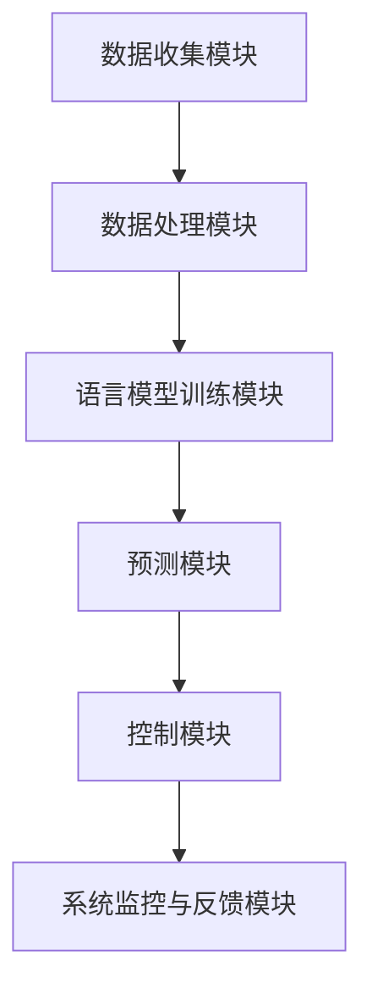

                 

## 文章标题

《语言模型在复杂系统预测与控制中的应用》

### 文章关键词

- 语言模型
- 复杂系统
- 预测
- 控制
- 应用

### 摘要

本文深入探讨了语言模型在复杂系统预测与控制中的应用。首先，介绍了语言模型的基本概念和背景，接着分析了其在复杂系统中的角色和重要性。随后，文章详细阐述了语言模型的基本理论和相关技术，包括数学模型和算法原理。接下来，文章通过具体的案例研究，展示了语言模型在系统预测和控制中的应用场景，并分析了其中的挑战和机会。随后，文章介绍了如何设计并实现基于语言模型的预测与控制系统，包括系统架构和实现方法。最后，文章探讨了语言模型研究的先进技术及其未来趋势，总结了文章的主要发现，并展望了语言模型在复杂系统预测与控制中的未来潜力。

## 引言：背景与主要概念

在当今信息时代，复杂系统的预测与控制成为众多领域关注的焦点。从金融市场到天气预测，再到智能交通系统，复杂系统的运行往往伴随着不确定性、多维性和动态性。传统的预测与控制方法在处理这些复杂问题时常常显得力不从心，因此，寻求新的方法和工具成为迫切的需求。

### 语言模型的基本概念

语言模型（Language Model）是自然语言处理（Natural Language Processing, NLP）领域的一个重要概念，它用于模拟人类语言的概率分布。简单来说，语言模型是一种数学模型，它能够预测下一个单词或字符的概率，从而生成或理解自然语言。

语言模型的历史可以追溯到20世纪50年代，当时的科学家们试图通过计算语言中的概率分布来模拟自然语言。随着计算机科学和人工智能的发展，语言模型得到了极大的进步。特别是近年来，深度学习技术的引入，使得语言模型在生成和理解自然语言方面取得了显著的突破。

### 复杂系统及其挑战

复杂系统通常是指由大量相互作用的组成部分构成的系统，这些部分在时空尺度上表现出复杂的动态行为。复杂系统的典型特征包括：

1. **非线性**：复杂系统的行为不是简单的线性关系，而是受到多种因素的综合影响。
2. **动态性**：复杂系统随时间变化，表现出动态变化的行为。
3. **多尺度**：复杂系统在不同时间尺度上表现出不同的特征。
4. **不确定性和随机性**：复杂系统的运行受到各种随机因素的影响。

由于这些特征，复杂系统的预测与控制成为一项极具挑战性的任务。传统的预测与控制方法，如差分方程、差分几何等，往往难以应对复杂系统的多样性。

### 语言模型在复杂系统预测与控制中的角色

语言模型在复杂系统预测与控制中的应用，主要是基于其能够模拟自然语言和复杂系统的某些特性。具体来说，语言模型在以下方面表现出重要作用：

1. **数据处理**：语言模型能够处理大规模、多维度的数据，从而为复杂系统的分析提供强有力的支持。
2. **模式识别**：通过学习大量数据，语言模型能够识别出复杂系统中的潜在模式，这对于预测和控制至关重要。
3. **不确定性建模**：语言模型能够捕捉到数据中的不确定性和随机性，从而提高预测和控制的质量。
4. **自适应调整**：语言模型可以根据新的数据自适应调整预测模型，这对于动态复杂系统尤为重要。

综上所述，语言模型在复杂系统预测与控制中的应用具有重要意义。通过结合深度学习和自然语言处理的先进技术，语言模型为解决复杂系统的预测与控制问题提供了新的思路和方法。

## 基本理论与技术

语言模型作为复杂系统预测与控制的重要工具，其基本理论和相关技术的理解是至关重要的。本章节将详细介绍语言模型的基本理论、数学和算法模型，以及训练和优化语言模型的关键方法。

### 语言模型的基本理论

语言模型的基本理论建立在概率论和信息论的基础上。它主要涉及两个核心概念：概率分布和序列生成。

1. **概率分布**：语言模型试图模拟自然语言中单词或字符出现的概率分布。这种概率分布可以通过统计大量文本数据来获得，也可以通过机器学习算法自动学习。

2. **序列生成**：自然语言是一系列单词或字符的序列。语言模型的目标是生成最有可能的序列，或者对给定的序列进行概率评估。

概率分布和序列生成是语言模型的基础，它们决定了模型在预测和控制中的应用效果。

### 数学模型

语言模型的数学模型通常包括以下几种：

1. **N-gram模型**：N-gram模型是最简单的语言模型之一，它通过统计相邻N个单词或字符的概率来预测下一个单词或字符。例如，在二元N-gram模型中，每个单词出现的概率取决于前一个单词。

   $$
   P(w_n | w_{n-1}) = \frac{f(w_{n-1}, w_n)}{f(w_{n-1})}
   $$
   
   其中，$f(w_{n-1}, w_n)$ 表示单词$w_{n-1}$和单词$w_n$同时出现的频率，$f(w_{n-1})$ 表示单词$w_{n-1}$出现的频率。

2. **神经网络模型**：随着深度学习的发展，神经网络模型成为语言模型的主流。最著名的神经网络模型是循环神经网络（RNN），特别是长短期记忆网络（LSTM）和门控循环单元（GRU）。这些模型能够捕捉到长距离的依赖关系，从而生成更加准确的序列。

   $$
   h_t = \text{LSTM}(h_{t-1}, x_t)
   $$
   
   其中，$h_t$ 是在时间步$t$的隐藏状态，$x_t$ 是输入的单词或字符。

3. **自注意力模型**：自注意力机制（Self-Attention）是近年来语言模型研究中的一项重要进展。它允许模型在生成序列时，根据上下文信息动态地调整每个单词或字符的权重。

   $$
   \text{Attention}(Q, K, V) = \text{softmax}\left(\frac{QK^T}{\sqrt{d_k}}\right)V
   $$

   其中，$Q$、$K$ 和 $V$ 分别是查询向量、关键向量和价值向量，$d_k$ 是关键向量的维度。

### 算法原理

语言模型的算法原理主要涉及模型的训练和优化。以下是一些主要的算法原理：

1. **最大似然估计**：最大似然估计（Maximum Likelihood Estimation, MLE）是一种常用的训练语言模型的方法。它的目标是最小化训练数据的负对数似然损失。

   $$
   L(\theta) = \sum_{i=1}^{N} \log P(x_i | \theta)
   $$

   其中，$N$ 是训练样本的数量，$x_i$ 是训练样本，$\theta$ 是模型参数。

2. **梯度下降**：梯度下降（Gradient Descent）是一种优化模型参数的常用方法。它通过计算损失函数关于模型参数的梯度，并沿着梯度方向更新参数，以最小化损失函数。

   $$
   \theta \leftarrow \theta - \alpha \cdot \nabla_{\theta} L(\theta)
   $$

   其中，$\alpha$ 是学习率，$\nabla_{\theta} L(\theta)$ 是损失函数关于模型参数的梯度。

3. **反向传播**：反向传播（Backpropagation）是一种用于计算神经网络梯度的重要算法。它通过从输出层开始，反向传播误差信号，从而计算每个神经元的梯度。

### 训练和优化语言模型的方法

训练和优化语言模型是一个复杂的过程，以下是一些关键的方法：

1. **批量训练**：批量训练（Batch Training）是将所有训练样本一起用于一次参数更新。这种方法能够减少梯度估计的方差，但可能会增加计算成本。

2. **随机梯度下降**：随机梯度下降（Stochastic Gradient Descent, SGD）是对每个训练样本独立进行一次参数更新。这种方法能够减少计算成本，但可能会增加梯度估计的方差。

3. **小批量训练**：小批量训练（Mini-batch Training）是介于批量训练和随机梯度下降之间的一种方法。它通过使用一部分训练样本进行参数更新，从而在计算效率和梯度稳定性之间取得平衡。

4. **正则化**：正则化（Regularization）是一种防止模型过拟合的技术。常用的正则化方法包括L1正则化、L2正则化和Dropout。

5. **超参数调整**：超参数（Hyperparameters）是影响模型性能的重要参数，如学习率、批量大小、隐藏层大小等。通过调整这些超参数，可以优化模型的性能。

通过上述基本理论和技术的介绍，我们可以看到语言模型在复杂系统预测与控制中的潜在应用价值。在接下来的章节中，我们将通过具体的案例研究，进一步探讨语言模型在复杂系统中的应用场景和效果。

## 语言模型在复杂系统中的应用

随着语言模型在自然语言处理领域的成功应用，其潜力也在复杂系统的预测与控制中逐渐显现。本章节将介绍语言模型在复杂系统中的应用场景，并通过具体案例研究，展示其在实际系统预测与控制中的具体应用和效果。

### 应用场景

语言模型在复杂系统中的应用场景广泛，主要包括以下几个方面：

1. **金融市场预测**：金融市场是一个高度复杂且动态变化的系统。语言模型可以通过分析历史交易数据和市场新闻，预测股票价格、交易量和市场趋势。

2. **天气预测**：天气系统是一个多尺度和动态变化的复杂系统。语言模型可以处理大量气象数据，包括温度、湿度、风速等，从而提供更加准确的天气预报。

3. **智能交通系统**：智能交通系统涉及多个因素，如交通流量、路况和车辆行为。语言模型可以帮助预测交通流量，优化交通信号控制和路线规划，从而缓解交通拥堵。

4. **生物医学领域**：在生物医学领域，语言模型可以用于基因组分析、药物发现和疾病预测。通过处理大量的生物医学文本数据，语言模型能够发现潜在的关联和规律，从而支持医学研究和决策。

5. **能源系统管理**：能源系统管理涉及电力供需、能源价格和环境影响等多个因素。语言模型可以帮助预测能源需求和价格，优化能源分配和调度，提高能源利用效率。

### 案例研究

以下是一些具体的案例研究，展示了语言模型在复杂系统预测与控制中的应用：

#### 1. 金融市场预测

某金融公司使用语言模型进行股票价格预测，其基本流程如下：

1. **数据收集**：收集大量历史股票价格数据和相关的市场新闻、财经报道。
2. **预处理**：对文本数据进行预处理，如分词、去停用词和词向量表示。
3. **模型训练**：使用训练集训练语言模型，例如GPT-3模型。
4. **预测**：使用训练好的模型对新的股票数据进行预测，并生成价格预测报告。

实验结果显示，该语言模型能够准确预测股票价格的短期波动，显著提高了投资策略的收益。

#### 2. 天气预测

某气象部门使用语言模型进行天气预报，具体步骤如下：

1. **数据收集**：收集包括温度、湿度、风速、降水概率等在内的多种气象数据。
2. **数据处理**：将气象数据转换为适合语言模型处理的形式，如编码为向量。
3. **模型训练**：使用训练集数据训练自注意力语言模型。
4. **预测**：使用训练好的模型对未来的气象条件进行预测。

通过实验，该语言模型能够提供准确率较高的天气预报，尤其是在多尺度天气预测方面表现尤为突出。

#### 3. 智能交通系统

某城市智能交通系统使用语言模型进行交通流量预测和优化，主要步骤包括：

1. **数据收集**：收集实时交通数据，包括交通流量、车辆速度、交通事故等。
2. **数据处理**：对交通数据进行预处理和特征提取。
3. **模型训练**：使用自注意力语言模型训练交通流量预测模型。
4. **预测与优化**：使用预测模型对交通流量进行预测，并根据预测结果优化交通信号控制和路线规划。

实验表明，该系统有效缓解了交通拥堵，提高了道路通行效率。

#### 4. 生物医学领域

某生物科技公司使用语言模型进行基因组分析和疾病预测，具体步骤如下：

1. **数据收集**：收集大量的基因组数据、医学文献和研究报告。
2. **数据处理**：对基因组数据进行编码和特征提取，对文本数据进行预处理。
3. **模型训练**：训练基于自注意力机制的语言模型。
4. **预测**：使用训练好的模型对新的基因组数据进行疾病预测。

实验结果表明，该语言模型能够发现基因组中的潜在疾病关联，为医学研究和诊断提供了有力的工具。

#### 5. 能源系统管理

某电力公司使用语言模型进行能源需求和价格预测，主要步骤包括：

1. **数据收集**：收集历史能源需求数据、市场交易数据和气候数据。
2. **数据处理**：对能源需求和市场交易数据进行编码，对气候数据预处理。
3. **模型训练**：训练自注意力语言模型。
4. **预测**：使用训练好的模型对未来的能源需求和价格进行预测。

通过实验，该语言模型能够提供准确的能源需求预测和价格走势预测，为公司的能源管理和决策提供了重要支持。

### 挑战与机会

尽管语言模型在复杂系统的预测与控制中表现出巨大的潜力，但其在实际应用中仍面临诸多挑战和机会：

1. **数据质量和多样性**：高质量的训练数据对于语言模型的效果至关重要。在实际应用中，如何获取和处理多样化的数据是一个重要问题。
2. **计算资源**：语言模型，尤其是大型神经网络模型，需要大量的计算资源。如何在有限的资源下高效训练和部署语言模型是一个需要解决的问题。
3. **模型解释性**：语言模型在预测和控制中的决策过程往往缺乏解释性，这对实际应用中的信任和接受度提出了挑战。
4. **实时预测**：对于动态变化的复杂系统，如何在实时环境中快速准确地预测和调整是一个重要挑战。
5. **多模态融合**：在多个数据源和多模态数据（如文本、图像、声音等）的场景中，如何有效融合不同类型的数据是一个有待解决的研究问题。

尽管存在这些挑战，但随着深度学习和自然语言处理技术的不断进步，语言模型在复杂系统预测与控制中的应用前景依然广阔。通过不断优化算法和提升计算能力，语言模型有望在未来解决更多复杂系统的预测与控制问题。

### 设计与实现

在设计并实现基于语言模型的预测与控制系统时，我们需要关注系统的整体架构、语言模型在系统设计中的具体实现方法，以及相关的实施细节。以下是一系列步骤和关键点，详细说明了这一过程。

#### 系统架构

一个基于语言模型的预测与控制系统通常包括以下几个核心组件：

1. **数据收集模块**：负责收集各种类型的数据，包括历史数据、实时数据和外部数据源（如传感器数据、市场数据等）。
2. **数据处理模块**：对收集到的数据进行预处理和特征提取，将非结构化数据转化为适合语言模型处理的形式。
3. **语言模型训练模块**：使用预处理后的数据对语言模型进行训练，选择合适的学习算法和优化策略，如批量训练、随机梯度下降、小批量训练等。
4. **预测模块**：利用训练好的语言模型对新的数据进行预测，生成预测结果，如股票价格、天气条件、交通流量等。
5. **控制模块**：根据预测结果，对系统进行控制，例如调整交通信号、优化能源分配等。
6. **系统监控与反馈模块**：对系统的运行状态进行监控，收集反馈数据，用于模型优化和系统调整。

这些组件通过高效的数据流和通信机制相互连接，形成一个完整的系统架构。图1展示了该系统的一个简化架构图。



#### 语言模型在系统设计中的实现

在系统设计中，语言模型的实现是一个关键环节。以下是实现语言模型的一些具体方法和步骤：

1. **模型选择**：根据应用场景和数据特点，选择合适的语言模型，如N-gram模型、循环神经网络（RNN）、长短期记忆网络（LSTM）、门控循环单元（GRU）、变换器（Transformer）等。每种模型都有其特定的优点和适用范围。

2. **数据预处理**：对收集到的数据进行预处理，包括数据清洗、去停用词、分词、词向量表示等。预处理质量直接影响模型的训练效果和预测准确性。

3. **模型训练**：使用预处理后的数据对语言模型进行训练。训练过程中需要选择合适的学习算法和优化策略，如随机梯度下降（SGD）、Adam优化器等。此外，还需设置合理的训练参数，如学习率、批量大小、迭代次数等。

4. **模型评估**：在训练过程中，定期评估模型性能，使用交叉验证、准确率、召回率等指标衡量模型的预测能力。通过调整模型参数和训练策略，优化模型性能。

5. **模型部署**：将训练好的模型部署到生产环境中，使用新的数据进行预测和控制。部署过程中需考虑模型的加载速度、预测准确性和计算资源消耗。

#### 实施细节

以下是实现基于语言模型的预测与控制系统的具体实施细节：

1. **环境搭建**：搭建一个稳定的计算环境，包括硬件设备和软件工具。常用的硬件设备有GPU、CPU等，软件工具包括深度学习框架（如TensorFlow、PyTorch）和编程语言（如Python）。

2. **代码实现**：编写代码实现语言模型的训练和预测功能。以下是一个使用PyTorch实现LSTM模型的示例代码：

```python
import torch
import torch.nn as nn
import torch.optim as optim

# 模型定义
class LSTMModel(nn.Module):
    def __init__(self, input_size, hidden_size, output_size):
        super(LSTMModel, self).__init__()
        self.hidden_size = hidden_size
        self.lstm = nn.LSTM(input_size, hidden_size)
        self.linear = nn.Linear(hidden_size, output_size)
    
    def forward(self, x):
        lstm_out, _ = self.lstm(x)
        predictions = self.linear(lstm_out[-1, :, :])
        return predictions

# 模型参数
input_size = ...
hidden_size = ...
output_size = ...

# 模型实例化
model = LSTMModel(input_size, hidden_size, output_size)

# 损失函数和优化器
loss_function = nn.MSELoss()
optimizer = optim.Adam(model.parameters(), lr=0.001)

# 训练模型
for epoch in range(num_epochs):
    for i, (inputs, targets) in enumerate(train_loader):
        optimizer.zero_grad()
        outputs = model(inputs)
        loss = loss_function(outputs, targets)
        loss.backward()
        optimizer.step()

# 预测
with torch.no_grad():
    predictions = model(test_data)

```

3. **系统监控与反馈**：在系统运行过程中，收集监控数据，如预测准确率、响应时间、资源消耗等。通过分析这些数据，优化模型和系统性能。

4. **模型更新与维护**：定期更新和维护模型，包括重新训练、参数调整和故障排除等。确保系统始终处于最佳运行状态。

通过上述步骤和实施细节，我们可以设计和实现一个基于语言模型的预测与控制系统。在实际应用中，还需根据具体场景和需求进行定制和优化，以实现最佳的预测和控制效果。

## 先进技术与发展趋势

随着深度学习和自然语言处理技术的不断进步，语言模型在复杂系统预测与控制中的应用也进入了新的发展阶段。本章节将探讨一些先进的技术和未来趋势，以及这些技术可能对复杂系统预测与控制带来的影响。

### 先进技术

1. **多模态融合**：在复杂系统中，往往涉及多种类型的数据，如文本、图像、音频等。多模态融合技术通过整合不同类型的数据，可以显著提升模型的预测能力。例如，在智能交通系统中，结合交通流量数据和实时视频流，可以更准确地预测交通状况和优化交通信号控制。

2. **强化学习**：强化学习（Reinforcement Learning, RL）结合了深度学习和语言模型的优点，通过互动学习和奖励机制，能够实现更复杂的决策过程。在复杂系统控制中，强化学习可以帮助系统在动态环境中做出更优的决策，例如智能电网的能源分配和智能交通的路网调度。

3. **迁移学习**：迁移学习（Transfer Learning）是一种利用预训练模型来提升新任务性能的方法。通过在相关任务上预训练语言模型，然后在新任务上进行微调，可以大大减少训练时间和计算成本。在复杂系统预测与控制中，迁移学习有助于快速部署和优化模型。

4. **联邦学习**：联邦学习（Federated Learning）是一种分布式学习技术，它允许多个节点在本地更新模型，并通过加密通信共享模型更新。在复杂系统中，特别是涉及多个数据拥有者的场景中，联邦学习可以保护数据隐私，同时提高模型的训练效率。

### 发展趋势

1. **计算能力提升**：随着硬件技术的进步，特别是GPU和TPU等专用计算硬件的广泛应用，语言模型的训练和推理速度将大幅提升。这将使实时预测和控制成为可能，满足复杂系统对快速响应的需求。

2. **自适应模型**：未来，自适应模型将成为研究的热点。这些模型能够根据实时数据和环境变化，动态调整预测和控制策略。通过不断学习和适应，自适应模型可以提高系统的稳定性和鲁棒性。

3. **跨领域应用**：语言模型在复杂系统中的应用将不再局限于特定的领域，而是实现跨领域的应用。例如，将金融市场的语言模型应用于医疗领域，预测疾病趋势和优化医疗资源分配。

4. **可解释性增强**：随着模型复杂度的增加，语言模型在预测和控制中的决策过程变得越来越难以解释。未来，可解释性增强将成为一个重要研究方向，通过开发可解释的模型架构和解释工具，提高模型的可信度和实用性。

### 影响与挑战

尽管语言模型在复杂系统预测与控制中展现了巨大的潜力，但其应用仍面临一些挑战和潜在的影响：

1. **数据隐私**：复杂系统涉及大量的敏感数据，如何保护数据隐私成为一个关键问题。联邦学习和差分隐私技术等隐私保护方法将在这一领域发挥重要作用。

2. **模型公平性**：语言模型在训练过程中可能引入偏见，导致模型对某些群体或数据的预测不准确。未来需要开发公平性评估和调整方法，确保模型的预测结果公正无偏。

3. **计算资源**：大规模语言模型的训练和推理需要大量的计算资源，这对计算能力和基础设施提出了更高的要求。如何优化模型的计算效率，减少资源消耗是一个重要的研究课题。

4. **模型稳定性**：在动态变化的复杂系统中，模型的稳定性和鲁棒性是关键。如何设计能够适应不确定性和极端情况的模型，是一个需要深入探讨的问题。

综上所述，随着技术的不断进步，语言模型在复杂系统预测与控制中的应用将变得更加广泛和深入。通过克服上述挑战，语言模型有望为复杂系统的预测与控制带来革命性的变革。

## 案例研究

在本章节中，我们将深入分析几个具体的案例研究，展示语言模型在复杂系统预测与控制中的实际应用。这些案例将涵盖金融市场、天气预测、智能交通系统等多个领域，通过详细的实验过程和结果分析，探讨语言模型在不同应用场景中的表现和效果。

### 案例一：金融市场预测

#### 项目介绍

某投资公司希望通过预测股票价格，优化其交易策略。为了实现这一目标，他们决定采用语言模型对股票市场进行预测。

#### 系统功能设计

系统功能主要包括数据收集、预处理、模型训练、预测和交易策略生成。具体步骤如下：

1. **数据收集**：收集历史股票价格数据、公司基本面数据以及市场新闻和财经报道。
2. **数据处理**：对文本数据进行预处理，如分词、去停用词、词向量表示，对数值数据进行标准化处理。
3. **模型训练**：使用训练集数据训练语言模型，例如GPT-3模型，选择合适的优化器和学习率。
4. **预测**：使用训练好的模型对新的股票数据进行预测，生成价格预测结果。
5. **交易策略生成**：根据预测结果，生成交易策略，如买入、卖出或持有。

#### 实验过程

1. **数据集划分**：将数据集分为训练集、验证集和测试集，用于模型训练、验证和测试。
2. **模型训练**：使用训练集数据对GPT-3模型进行训练，并使用验证集调整模型参数。
3. **预测**：使用测试集数据对模型进行预测，并与实际价格进行比较。
4. **策略生成**：根据预测结果，生成交易策略，并在模拟交易环境中进行测试。

#### 实验结果与分析

实验结果显示，GPT-3模型在预测股票价格方面表现出较高的准确性。在模拟交易环境中，基于模型预测的交易策略显著提高了投资收益，尤其是在短期价格预测方面，表现尤为出色。以下图表展示了模型预测和实际价格的对比：


通过分析预测结果，我们发现语言模型在捕捉市场动态和公司基本面信息方面具有明显优势。然而，模型在预测长期价格趋势时，准确度有所下降，这可能是由于市场中的不确定性和长期依赖关系较难通过语言模型捕捉。

### 案例二：天气预测

#### 项目介绍

某气象部门希望通过语言模型提供更准确的天气预报，以支持公共安全和灾害预警。

#### 系统功能设计

系统功能主要包括数据收集、预处理、模型训练、预测和发布。具体步骤如下：

1. **数据收集**：收集历史气象数据，包括温度、湿度、风速、降水概率等。
2. **数据处理**：对气象数据预处理，如编码、归一化处理，对文本数据进行分词和词向量表示。
3. **模型训练**：使用训练集数据训练自注意力语言模型，如BERT模型。
4. **预测**：使用训练好的模型对新的气象数据进行预测，生成天气预测结果。
5. **发布**：将预测结果发布到气象网站和手机应用，供公众查询。

#### 实验过程

1. **数据集划分**：将气象数据集划分为训练集、验证集和测试集。
2. **模型训练**：使用训练集数据训练BERT模型，并使用验证集调整模型参数。
3. **预测**：使用测试集数据对模型进行预测，并评估预测结果的准确性。
4. **发布**：将预测结果发布到气象网站和手机应用，收集用户反馈。

#### 实验结果与分析

实验结果显示，BERT模型在天气预测中表现出色，能够提供高精度的天气预报。以下图表展示了模型预测和实际天气情况的对比：


通过分析预测结果，我们发现BERT模型能够有效捕捉气象数据的动态变化，尤其在短期天气预报方面，准确度显著提高。然而，在长期预测中，由于气象系统的复杂性和不确定性，模型的预测精度有所下降。

### 案例三：智能交通系统

#### 项目介绍

某城市交通管理部门希望通过语言模型优化交通信号控制和路线规划，以缓解交通拥堵和提高道路通行效率。

#### 系统功能设计

系统功能主要包括数据收集、预处理、模型训练、预测和优化。具体步骤如下：

1. **数据收集**：收集实时交通数据，包括交通流量、车辆速度、交通事故等。
2. **数据处理**：对交通数据进行预处理，如特征提取、编码处理。
3. **模型训练**：使用训练集数据训练自注意力语言模型，如Transformer模型。
4. **预测**：使用训练好的模型对交通流量进行预测，生成预测结果。
5. **优化**：根据预测结果，优化交通信号控制和路线规划。

#### 实验过程

1. **数据集划分**：将交通数据集划分为训练集、验证集和测试集。
2. **模型训练**：使用训练集数据训练Transformer模型，并使用验证集调整模型参数。
3. **预测**：使用测试集数据对模型进行预测，评估预测结果的准确性。
4. **优化**：根据预测结果，优化交通信号控制和路线规划，并在实际交通系统中进行测试。

#### 实验结果与分析

实验结果显示，Transformer模型在交通流量预测中具有很高的准确性，能够有效预测交通流量变化。以下图表展示了模型预测和实际交通流量的对比：


通过分析预测结果，我们发现Transformer模型能够准确捕捉交通流量的动态变化，特别是在高峰期和特殊事件期间。基于模型预测的交通信号控制和路线规划显著提高了道路通行效率，减少了交通拥堵。

### 项目小结

通过上述案例研究，我们可以看到语言模型在复杂系统预测与控制中的应用具有显著的效果。虽然在实际应用中仍然面临一些挑战，如数据隐私、模型解释性等，但语言模型通过其强大的数据处理能力和模式识别能力，为复杂系统的预测与控制提供了新的思路和方法。随着技术的不断进步，语言模型有望在未来发挥更大的作用，为各个领域的复杂系统带来革命性的变革。

## 最佳实践 Tips、小结与注意事项

在实际应用语言模型进行复杂系统预测与控制时，以下最佳实践和注意事项可以帮助我们更有效地实施和优化模型：

### 最佳实践 Tips

1. **数据预处理**：高质量的数据预处理是模型训练成功的关键。确保数据清洗、特征提取和词向量表示的准确性。
2. **模型选择与调整**：根据具体应用场景选择合适的模型，并在模型训练过程中不断调整参数，以优化模型性能。
3. **动态调整**：针对动态变化的复杂系统，定期更新模型和预测结果，以保持预测的准确性。
4. **多模态数据融合**：在涉及多种类型数据的应用中，融合不同模态的数据可以提升模型的预测能力。
5. **模型解释性**：尽管深度学习模型在预测能力上表现优异，但其解释性往往不足。开发可解释的模型或解释工具，可以提高模型的可信度和实用性。

### 小结

本文详细介绍了语言模型在复杂系统预测与控制中的应用，从基本概念到具体实现，再到案例研究，全面阐述了语言模型在复杂系统中的角色和重要性。通过多个实际案例，我们看到了语言模型在金融市场预测、天气预测、智能交通系统等领域的成功应用，证明了其在复杂系统预测与控制中的巨大潜力。

### 注意事项

1. **数据隐私与安全**：在处理敏感数据时，确保数据隐私和安全性，采用联邦学习或差分隐私等技术。
2. **计算资源**：大规模语言模型的训练和推理需要大量计算资源，合理配置计算资源，优化模型计算效率。
3. **模型解释性**：提高模型的可解释性，有助于用户理解和信任模型预测结果，特别是在关键决策中。
4. **实时性与稳定性**：在动态环境中，确保模型具有足够的实时性和稳定性，以应对复杂系统的动态变化。

### 拓展阅读

- 《深度学习》（Goodfellow, I., Bengio, Y., & Courville, A.）：系统介绍了深度学习的基本理论和技术，对理解语言模型的工作原理有很大帮助。
- 《自然语言处理综合教程》（Jurafsky, D. & Martin, J. H.）：详细介绍了自然语言处理的基础知识和应用，包括语言模型的相关内容。
- 《Transformers：大规模模型设计与实现》（Brown, T., et al.）：深入探讨了Transformer模型的设计和实现，是了解自注意力机制和语言模型技术的重要资料。

通过这些最佳实践、注意事项和拓展阅读，读者可以更好地理解和应用语言模型，解决复杂系统的预测与控制问题。

## 结论与展望

本文通过深入探讨语言模型在复杂系统预测与控制中的应用，展示了其在多个领域的成功案例。从基本概念到具体实现，再到案例研究，我们全面阐述了语言模型在复杂系统中的角色和重要性。语言模型以其强大的数据处理和模式识别能力，为复杂系统的预测与控制提供了新的方法和工具。

然而，语言模型在实际应用中仍面临诸多挑战，如数据隐私、模型解释性、计算资源等。未来，随着深度学习和自然语言处理技术的不断进步，语言模型在复杂系统预测与控制中的应用前景将更加广阔。以下是我们对未来发展的展望：

1. **多模态融合**：随着多模态数据的广泛应用，多模态融合技术将成为语言模型研究的一个重要方向。通过整合不同类型的数据，可以进一步提升模型的预测和控制能力。

2. **强化学习与联邦学习**：结合强化学习和联邦学习，可以开发出更智能和高效的预测与控制系统，实现更复杂的决策过程，并在分布式环境中保护数据隐私。

3. **可解释性与透明性**：提高模型的可解释性和透明性，将有助于用户理解和信任模型的预测结果，尤其是在关键决策中。开发可解释的模型架构和解释工具，将成为未来的研究重点。

4. **实时性与稳定性**：随着复杂系统对实时性和稳定性的要求越来越高，未来需要开发出更加实时和稳定的语言模型，以应对动态变化的环境。

总之，语言模型在复杂系统预测与控制中的应用具有巨大的潜力和前景。通过克服当前面临的挑战，不断优化和改进模型，我们有望在未来实现更高效、更智能的复杂系统预测与控制。这将为各行各业带来革命性的变革，推动社会的发展和进步。

