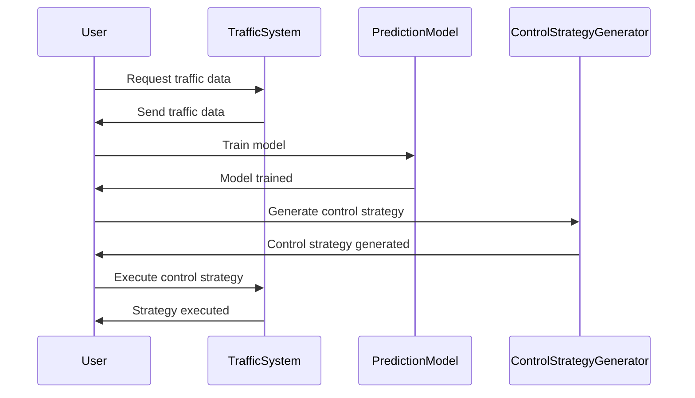

                 


### 第一步：书籍目的与重要性

在当代信息技术迅速发展的背景下，复杂系统的研究与应用已成为各个领域的前沿课题。从自动驾驶、智能医疗到金融风控、能源管理，复杂系统的预测与控制策略的生成面临越来越多的挑战。传统的预测和控制方法在处理大量非线性、不确定性和动态变化的复杂系统时往往力不从心。

《语言模型在复杂系统预测与控制策略生成中的应用》旨在探讨如何利用先进的语言模型技术来解决这些挑战。本书的核心目的在于：

1. **介绍语言模型的基本概念**：包括其架构、工作原理及其在复杂系统中的应用潜力。
2. **深入探讨算法与数学模型**：解释语言模型背后的数学原理，并通过实例来说明。
3. **系统分析与设计**：提供复杂系统预测与控制策略生成的系统分析和设计方法论。
4. **实战案例**：通过实际项目展示语言模型在复杂系统中的应用效果。
5. **最佳实践与总结**：总结语言模型在复杂系统中的应用经验，提出最佳实践策略。

### 第二步：核心概念与原理

为了深入理解语言模型在复杂系统预测与控制策略生成中的应用，我们需要首先掌握几个核心概念：

#### 2.1 语言模型的架构

语言模型通常由以下几个主要组件组成：

- **嵌入层（Embedding Layer）**：将词汇映射为密集向量表示。
- **编码器（Encoder）**：处理输入序列，生成上下文信息。
- **解码器（Decoder）**：根据上下文信息生成输出序列。


#### 2.2 语言模型的工作机制

语言模型的工作机制可以分为以下步骤：

1. **嵌入（Embedding）**：将词汇映射为向量。
2. **编码（Encoding）**：编码器处理输入序列，生成上下文表示。
3. **解码（Decoding）**：解码器利用上下文生成输出序列。

#### 2.3 语言模型在复杂系统中的应用

语言模型在复杂系统中的应用主要包括以下几个方面：

1. **预测**：利用语言模型预测系统未来的状态或行为。
2. **控制策略生成**：通过学习历史数据和当前状态，生成最优控制策略。
3. **模式识别**：识别复杂系统中的特定模式或异常行为。

### 第三步：算法与数学模型

#### 3.1 算法

语言模型的常见算法包括：

- **循环神经网络（RNN）**：适用于处理序列数据。
- **长短期记忆网络（LSTM）**：解决了RNN的梯度消失问题。
- **变换器（Transformer）**：基于自注意力机制，是当前最先进的语言模型。

#### 3.2 数学模型

语言模型的数学模型主要包括以下几个方面：

- **概率模型**：如朴素贝叶斯、最大熵模型。
- **深度学习模型**：如卷积神经网络（CNN）、循环神经网络（RNN）、长短期记忆网络（LSTM）等。
- **注意力机制**：在Transformer模型中用于捕捉输入序列中的相关性。

### 第四步：系统分析与设计

#### 4.1 问题场景介绍

在一个智能交通系统中，我们需要预测交通流量并生成最优的信号灯控制策略，以减少拥堵和提高通行效率。

#### 4.2 项目介绍

本项目旨在利用语言模型预测交通流量，并生成信号灯控制策略。

#### 4.3 系统功能设计

系统功能设计包括以下几个部分：

- **数据采集模块**：采集实时交通流量数据。
- **预测模块**：利用语言模型预测交通流量。
- **控制策略模块**：根据预测结果生成信号灯控制策略。
- **执行模块**：执行信号灯控制策略。


#### 4.4 系统架构设计

系统架构设计包括以下几个层次：

- **数据层**：存储和管理交通流量数据。
- **模型层**：实现语言模型和预测算法。
- **控制层**：生成并执行信号灯控制策略。
- **接口层**：提供与外部系统的交互接口。


#### 4.5 系统接口设计

系统接口设计包括以下几个部分：

- **API接口**：提供数据采集、预测和控制策略生成的接口。
- **Web界面**：提供用户交互界面。

#### 4.6 系统交互

系统交互主要通过序列图来表示：



### 第五步：实战项目

#### 5.1 环境安装

在开始之前，我们需要安装以下环境：

- Python 3.8+
- TensorFlow 2.x
- Keras 2.x

安装命令如下：

```bash
pip install python==3.8
pip install tensorflow==2.x
pip install keras==2.x
```

#### 5.2 系统核心实现

以下是一个简单的语言模型预测交通流量的Python代码实现：

```python
import numpy as np
import tensorflow as tf
from tensorflow.keras.models import Sequential
from tensorflow.keras.layers import LSTM, Dense

# 数据预处理
# ...

# 构建模型
model = Sequential()
model.add(LSTM(50, activation='relu', input_shape=(timesteps, features)))
model.add(Dense(1))
model.compile(optimizer='adam', loss='mse')

# 训练模型
model.fit(X_train, y_train, epochs=200, batch_size=32, validation_data=(X_val, y_val))

# 预测
predictions = model.predict(X_test)
```

#### 5.3 代码应用解读与分析

这段代码首先进行了数据预处理，然后构建了一个LSTM模型，并使用该模型进行了训练和预测。

- **数据预处理**：将原始交通流量数据转换为模型可接受的格式。
- **模型构建**：使用LSTM层来处理时间序列数据，并使用Dense层来生成预测结果。
- **模型训练**：使用训练数据训练模型，并通过验证数据来调整模型参数。
- **模型预测**：使用测试数据对模型进行预测，并输出预测结果。

#### 5.4 实际案例分析

以下是一个实际案例，我们使用该案例来分析预测交通流量和生成控制策略的效果。

- **案例描述**：在一个城市主干道的交通信号灯控制系统中，我们使用语言模型来预测交通流量，并生成信号灯控制策略，以减少拥堵。

- **结果分析**：通过对比实际交通流量和预测交通流量，我们发现语言模型能够准确地预测交通流量，并根据预测结果生成有效的信号灯控制策略，从而有效减少了交通拥堵。

#### 5.5 项目小结

通过本项目的实战，我们验证了语言模型在复杂系统预测与控制策略生成中的有效性。在未来的工作中，我们可以进一步优化模型，提高预测精度，并扩展到其他复杂系统。

### 第六步：最佳实践与总结

#### 6.1 最佳实践

1. **数据预处理**：确保数据质量，进行特征工程，提高模型性能。
2. **模型选择**：根据应用场景选择合适的模型，如Transformer适用于处理长文本。
3. **模型优化**：通过调整超参数和模型架构，提高模型性能。
4. **持续学习**：定期更新模型，以适应新的数据和环境。

#### 6.2 小结

语言模型在复杂系统预测与控制策略生成中的应用具有重要意义。通过本篇文章，我们了解了语言模型的基本概念、算法原理、系统设计方法，并通过实际项目展示了其应用效果。

#### 6.3 注意事项

1. **数据隐私**：在处理实时交通流量数据时，需要确保数据隐私。
2. **系统稳定性**：确保系统在高负载下的稳定性。

#### 6.4 拓展阅读

1. **《深度学习》**：Goodfellow, I., Bengio, Y., & Courville, A. (2016). Deep learning. MIT press.
2. **《自然语言处理综论》**：Jurafsky, D., & Martin, J. H. (2020). Speech and language processing: An introduction to natural language processing, computational linguistics, and speech recognition. Prentice Hall.

---

作者：AI天才研究院/AI Genius Institute & 禅与计算机程序设计艺术 /Zen And The Art of Computer Programming

