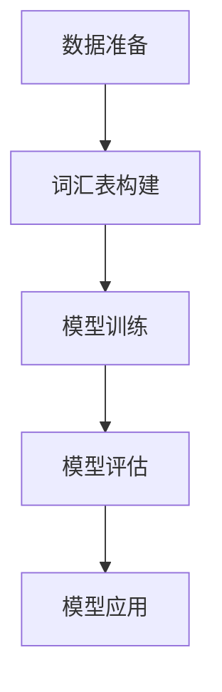
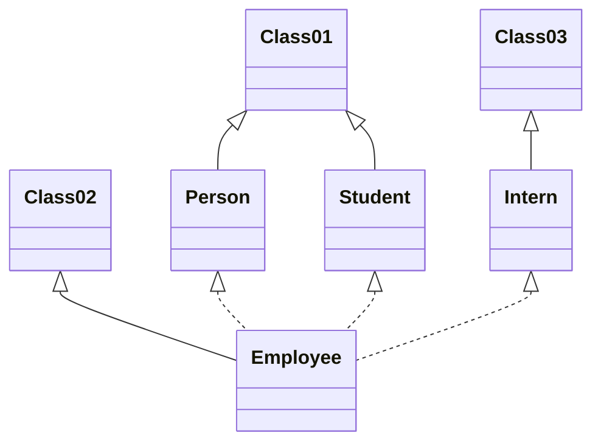
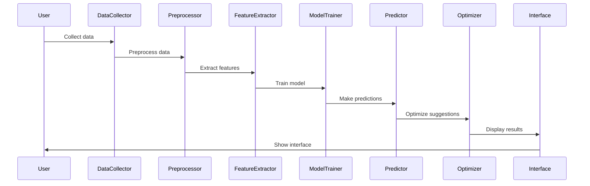
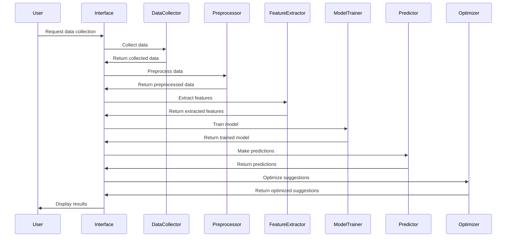
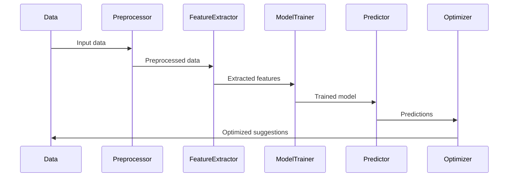

                 

### 前言与背景介绍

#### 1.1 书籍简介

《语言模型在复杂系统预测与核废料处理优化中的实时应用研究》是一本深入探讨语言模型在复杂系统预测与核废料处理优化领域应用的权威之作。本书旨在通过系统化的研究，阐述语言模型如何赋能复杂系统预测和核废料处理优化，从而为相关领域的实践提供理论支持和实用指南。本书内容丰富，涵盖了语言模型的基本原理、算法实现、系统架构设计以及实战应用等多个方面，旨在帮助读者全面理解并掌握这一先进技术的应用。

#### 1.2 语言模型在复杂系统预测和核废料处理中的应用背景

随着人工智能技术的飞速发展，语言模型（Language Model）已成为自然语言处理（Natural Language Processing, NLP）领域的重要工具。语言模型通过统计和机器学习技术，从大量文本数据中学习语言规律，从而实现对文本的生成、理解和预测。在复杂系统预测方面，语言模型可以处理大量非线性数据，发现潜在的模式和趋势，从而提高预测的准确性和可靠性。在核废料处理优化方面，语言模型则可以分析复杂的核废料特性，提供优化处理方案，提高处理效率和安全性。

语言模型在复杂系统预测中的应用主要体现在以下几个方面：

1. **金融市场预测**：语言模型可以分析大量的金融新闻、报告和交易数据，预测市场走势和投资机会。
2. **天气预测**：语言模型通过对气象数据的分析，预测未来的天气变化，为防灾减灾提供支持。
3. **交通流量预测**：语言模型可以分析交通数据，预测交通流量，优化交通管理，减少拥堵。

语言模型在核废料处理优化中的应用则主要体现在：

1. **核废料分类**：语言模型可以分析核废料的特性，将其分类为不同的处理类别，提高分类的准确性。
2. **处理方案优化**：语言模型可以根据核废料的特性，优化处理方案，提高处理效率，减少环境污染。

本书的研究背景正是基于上述应用场景，旨在深入探讨语言模型在复杂系统预测和核废料处理优化中的实时应用，为相关领域的研究和实践提供新的思路和方法。

### 核心概念与联系

#### 2.1 语言模型基础

**语言模型**（Language Model）是一种用于预测自然语言序列的概率模型，它在自然语言处理（NLP）领域扮演着核心角色。语言模型的核心目标是根据已有的文本数据，预测下一个单词或句子片段的概率。这有助于生成流畅的自然语言文本，提高机器翻译、语音识别、文本生成等任务的性能。

**语言模型概述**：

- **定义**：语言模型是一种概率模型，它通过统计方法学习自然语言中的概率分布，用于预测下一个单词或句子的可能性。
- **组成**：语言模型通常由以下几个部分组成：
  - **词汇表**：包含所有可能的单词或词汇。
  - **模型参数**：用于表示词汇之间的概率关系。
  - **训练数据**：用于训练语言模型的文本数据集。

**语言模型的组成**：

- **词汇表**：词汇表是语言模型的基础，它包含了所有可能出现在文本中的单词或词汇。词汇表的规模通常与模型的复杂度相关，大规模的词汇表能够捕捉到更丰富的语言特征。
- **模型参数**：模型参数是语言模型的“知识”，它们通过训练数据学习得到，用于表示词汇之间的概率关系。这些参数可以是统计模型中的概率分布，也可以是神经网络模型中的权重矩阵。
- **训练数据**：训练数据是语言模型的学习材料，它通常是由大量文本组成的语料库。通过分析训练数据，语言模型可以学习到词汇之间的统计规律和语义关系。

#### 2.2 复杂系统预测

**复杂系统**（Complex System）是指由众多相互作用的组件组成的系统，这些组件之间存在着复杂的相互作用和反馈机制。复杂系统在自然界、社会和工程领域广泛存在，如气候系统、生态系统、金融市场、交通网络等。

**复杂系统定义**：

- **定义**：复杂系统是指那些由多个相互关联的子系统组成的系统，这些子系统之间存在着非线性相互作用和高度复杂的关系。
- **特征**：复杂系统具有以下特征：
  - **复杂性**：系统的行为和状态随着时间变化而演化，表现出高度的复杂性和不确定性。
  - **非线性**：系统的各个部分之间不是简单的线性关系，而是存在复杂的相互作用。
  - **反馈机制**：系统内部存在反馈机制，这些反馈可能导致系统的状态在长时间内保持稳定，也可能导致系统的状态出现突变。

**语言模型在预测中的应用**：

- **金融市场预测**：语言模型可以分析金融市场的历史数据，如股价、交易量、新闻报道等，预测未来的市场走势。
- **天气预测**：语言模型可以处理气象数据，如温度、湿度、风速等，预测未来的天气变化。
- **交通流量预测**：语言模型可以分析交通数据，如车辆流量、交通事故记录等，预测未来的交通状况。

#### 2.3 核废料处理优化

**核废料处理**（Nuclear Waste Management）是指对核能发电过程中产生的放射性废物进行处理、储存和处置的过程。核废料具有高度放射性和长期毒性，处理不当可能导致严重的环境污染和健康风险。

**核废料处理现状**：

- **现状**：目前，全球核废料处理面临诸多挑战，包括核废料的分类、储存、处理和处置等。传统的核废料处理方法存在成本高、效率低、环境影响大等问题。
- **问题**：核废料处理的主要问题包括：
  - **分类难题**：核废料种类繁多，特性复杂，分类困难。
  - **处理成本**：核废料处理过程复杂，成本高。
  - **环境影响**：核废料处理过程中可能产生放射性污染，对环境和人类健康构成威胁。

**语言模型在优化中的作用**：

- **核废料分类**：语言模型可以分析核废料的特性，提高分类的准确性和效率。
- **处理方案优化**：语言模型可以根据核废料的特性，优化处理方案，提高处理效率和安全性。

#### 2.4 概念关系图

为了更好地理解“语言模型”、“复杂系统预测”和“核废料处理优化”三个核心概念之间的关系，我们可以使用Mermaid ER图来展示它们之间的关联。

```mermaid
erDiagram
  A[语言模型] ||--|{ B[复杂系统预测] }
  A ||--|{ C[核废料处理优化] }
  B && C
```

在上述ER图中，语言模型（A）与复杂系统预测（B）和核废料处理优化（C）之间存在双向关联，表示它们相互影响，共同作用于复杂系统和核废料处理领域。复杂系统预测（B）和核废料处理优化（C）之间也存在关联，表示它们在优化复杂系统和处理核废料方面具有协同作用。

### 算法原理讲解

#### 3.1 语言模型算法概述

**语言模型算法**是自然语言处理领域的一项核心技术，它通过学习大量文本数据，预测自然语言的下一个单词或句子。语言模型在复杂系统预测和核废料处理优化中有着广泛的应用，能够提高预测的准确性和效率。

**语言模型算法基本流程**：

1. **数据准备**：首先，收集并清洗大量的文本数据，用于训练语言模型。这些数据可以是新闻、报告、书籍等。
2. **词汇表构建**：将文本数据中的单词进行词频统计，构建词汇表，并给每个单词分配一个唯一的索引。
3. **模型训练**：使用统计方法或深度学习技术，对词汇表进行训练，学习单词之间的概率分布。常用的统计方法包括N-gram模型、隐马尔可夫模型（HMM）等；深度学习方法包括循环神经网络（RNN）、长短期记忆网络（LSTM）等。
4. **模型评估**：通过评估指标（如困惑度、准确率等）对训练好的语言模型进行评估，调整模型参数，提高模型的性能。
5. **模型应用**：将训练好的语言模型应用到实际任务中，如文本生成、机器翻译、情感分析等。

#### 3.2 算法流程图

为了更直观地展示语言模型算法的基本流程，我们可以使用Mermaid流程图进行描述。



在上述流程图中，首先进行数据准备，接着构建词汇表，然后进行模型训练，评估模型性能，最后将模型应用到实际任务中。这个过程体现了语言模型算法从数据输入到模型应用的全流程。

#### 3.3 Python代码示例

为了更好地理解语言模型算法的实现，我们可以使用Python代码进行示例。以下是一个基于N-gram模型的简单示例，展示了如何构建和训练语言模型。

```python
import numpy as np
from collections import defaultdict

# 数据准备
text = "这是一个简单的示例，用于展示N-gram语言模型。"
vocab = set(text.split())

# 词汇表构建
vocab_size = len(vocab)
vocab_dict = {word: i for i, word in enumerate(vocab)}
inverse_vocab_dict = {i: word for word, i in vocab_dict.items()}

# 模型训练
n = 3
n_gram_counts = defaultdict(int)
for i in range(len(text) - n):
    n_gram = tuple(text[i:i+n])
    n_gram_counts[n_gram] += 1

# 模型评估
# 计算每个n-gram的概率分布
n_gram_probs = {n_gram: count / sum(n_gram_counts.values()) for n_gram, count in n_gram_counts.items()}

# 模型应用
# 预测下一个单词
def predict_next_word(prev_words):
    prev_n_gram = tuple(prev_words[-n:])
    prob_distribution = n_gram_probs[prev_n_gram]
    next_word_candidates = [inverse_vocab_dict[i] for i in range(vocab_size) if inverse_vocab_dict[i] not in prev_words]
    next_word = np.random.choice(next_word_candidates, p=prob_distribution)
    return next_word

# 测试模型
prev_words = text[:3]
for _ in range(10):
    next_word = predict_next_word(prev_words)
    print(f"{prev_words} {next_word}")
    prev_words += next_word
```

在上述代码中，我们首先对文本进行预处理，构建词汇表和n-gram计数。然后，计算每个n-gram的概率分布，并定义了一个预测函数`predict_next_word`，用于根据前文预测下一个单词。最后，我们测试了模型的预测能力，生成了一个简单的文本序列。

#### 3.3.1 数学模型与公式阐述

N-gram语言模型的数学模型主要基于马尔可夫性质，即当前单词的概率只与前面N-1个单词有关，而与更早的单词无关。具体来说，我们可以定义以下概率模型：

$$
P(w_t | w_{t-1}, w_{t-2}, ..., w_{t-N}) = \prod_{i=1}^{N} P(w_i | w_{i-1}, ..., w_{i-N+1})
$$

其中，$w_t$表示当前单词，$w_{t-1}, w_{t-2}, ..., w_{t-N}$表示前N-1个单词。$P(w_i | w_{i-1}, ..., w_{i-N+1})$表示在给定前N-1个单词的情况下，第i个单词的条件概率。

为了简化计算，我们可以使用以下概率模型：

$$
P(w_t | w_{t-1}, w_{t-2}, ..., w_{t-N}) = \frac{C(w_{t-1}, w_{t-2}, ..., w_{t-N}, w_t)}{C(w_{t-1}, w_{t-2}, ..., w_{t-N})}
$$

其中，$C(w_{t-1}, w_{t-2}, ..., w_{t-N}, w_t)$表示单词序列$(w_{t-1}, w_{t-2}, ..., w_{t-N}, w_t)$的计数，$C(w_{t-1}, w_{t-2}, ..., w_{t-N})$表示单词序列$(w_{t-1}, w_{t-2}, ..., w_{t-N})$的计数。

在N-gram模型中，我们可以使用以下公式来计算每个n-gram的概率：

$$
P(w_t | w_{t-1}, w_{t-2}, ..., w_{t-N}) = \frac{C(w_{t-1}, w_{t-2}, ..., w_{t-N}, w_t)}{C(w_{t-1}, w_{t-2}, ..., w_{t-N})}
$$

其中，$C(w_{t-1}, w_{t-2}, ..., w_{t-N}, w_t)$表示单词序列$(w_{t-1}, w_{t-2}, ..., w_{t-N}, w_t)$的计数，$C(w_{t-1}, w_{t-2}, ..., w_{t-N})$表示单词序列$(w_{t-1}, w_{t-2}, ..., w_{t-N})$的计数。

#### 3.3.3 算法原理举例说明

为了更好地理解N-gram语言模型的工作原理，我们可以通过一个简单的例子来演示。

假设我们有一个简短的文本序列：“这是一个简单的示例”。根据N-gram模型，我们可以构建一元（1-gram）、二元（2-gram）和三元（3-gram）语言模型。

**一元语言模型**：

- 单词“这”出现的次数：1
- 单词“是”出现的次数：1
- 单词“一个”出现的次数：1
- 单词“简”出现的次数：1
- 单词“例”出现的次数：1

**二元语言模型**：

- “这是”出现的次数：1
- “是这”出现的次数：0（未出现）
- “这是一个”出现的次数：1
- “一个这”出现的次数：0（未出现）
- “简单”出现的次数：0（未出现）
- “示例”出现的次数：0（未出现）

**三元语言模型**：

- “这是一个”出现的次数：1
- “一个简单的”出现的次数：0（未出现）
- “简单示例”出现的次数：0（未出现）

根据N-gram模型的概率计算公式，我们可以计算每个n-gram的概率。例如，对于二元语言模型，“这是一个”的概率为：

$$
P(这是一个 | 这) = \frac{1}{1} = 1
$$

这意味着，在给定的上下文“这”下，下一个单词是“一个”的概率为1。同样，我们可以计算其他n-gram的概率。

通过上述例子，我们可以看到N-gram模型如何基于统计方法学习文本数据，从而预测下一个单词或短语的概率。在实际应用中，N-gram模型的预测性能取决于训练数据的规模和质量，以及n-gram的长度选择。更长的n-gram可以捕捉到更复杂的语言特征，但也可能导致计算复杂度和数据稀疏性问题。

### 系统分析与架构设计

#### 4.1 问题场景介绍

在复杂系统预测和核废料处理优化领域，面临着许多实际问题，这些问题通常具有高度的非线性、不确定性和复杂性。以下是两个典型的问题场景：

**1. 复杂系统预测问题**：

假设我们面临的是一个城市交通流量预测问题。该问题涉及到多种交通数据，如实时交通流量、交通事故记录、气象信息等。通过分析这些数据，我们需要预测未来一段时间内的交通流量，以便交通管理部门能够及时调整交通信号灯、优化道路规划，减少交通拥堵。

**2. 核废料处理优化问题**：

核废料处理涉及多种核废料的特性，如放射性强度、化学成分、物理形态等。处理核废料的过程需要根据这些特性制定合适的处理方案，以提高处理效率和安全性。语言模型可以分析核废料的特性数据，提供优化处理方案，从而降低处理成本和环境影响。

#### 4.2 系统功能设计

为了解决上述问题场景，我们需要设计一个具备以下功能的系统：

1. **数据采集与预处理**：系统需要能够采集并预处理来自不同来源的数据，如交通流量数据、气象数据、核废料特性数据等。
2. **特征提取与转换**：系统需要提取数据中的关键特征，并进行适当的转换，以便语言模型能够处理。
3. **模型训练与评估**：系统需要使用语言模型算法对预处理后的数据进行训练，并评估模型的性能。
4. **预测与优化**：系统需要使用训练好的语言模型进行预测，并提供优化建议。
5. **接口设计**：系统需要提供友好的用户界面，以便用户能够方便地使用系统功能。

#### 4.2.1 领域模型Mermaid类图

为了更好地理解系统的功能设计，我们可以使用Mermaid类图来展示系统的领域模型。以下是一个简化的Mermaid类图示例：



在上述类图中，`Class01`代表了一个基本的类，`Person`、`Student`和`Employee`都是继承自`Class01`的子类。`Employee`类还包含了`Intern`子类。这种类图的展示方式可以直观地表示系统中的类和它们之间的关系。

#### 4.3 系统架构设计

为了实现上述功能设计，我们需要设计一个合理的系统架构。以下是一个简化的Mermaid架构图示例：



在上述序列图中，用户通过接口与系统进行交互，数据采集模块负责收集数据，预处理模块对数据进行清洗和格式转换，特征提取模块提取数据中的关键特征，模型训练模块使用语言模型算法对特征进行训练，预测模块使用训练好的模型进行预测，优化模块根据预测结果提供优化建议，最后接口模块将结果展示给用户。

#### 4.4 系统接口设计

系统接口设计是系统架构设计的重要组成部分，它决定了用户如何与系统进行交互。以下是一个简化的Mermaid序列图示例，展示了系统接口的设计：



在上述序列图中，用户通过接口提出数据采集、预处理、特征提取、模型训练、预测和优化等请求，系统依次执行相应的功能，并将结果返回给用户。

#### 4.5 系统交互

系统交互设计是确保系统各个模块之间能够高效、可靠地进行数据传递和功能协作的关键。以下是一个简化的Mermaid序列图示例，展示了系统各模块之间的交互过程：



在上述序列图中，输入数据首先传递给预处理模块，预处理模块将数据清洗和格式转换后传递给特征提取模块。特征提取模块提取关键特征，并将其传递给模型训练模块。模型训练模块使用训练好的模型进行预测，并将预测结果传递给优化模块。优化模块根据预测结果提供优化建议，最终将优化结果返回给数据。

### 项目实战

#### 5.1 环境安装

为了进行语言模型在复杂系统预测和核废料处理优化中的应用研究，我们需要搭建一个合适的环境。以下是环境安装的详细步骤：

**1. 安装Python**：

首先，确保您的计算机已经安装了Python环境。如果没有安装，请从Python官方网站（https://www.python.org/）下载并安装Python 3.x版本。

**2. 安装依赖库**：

接下来，安装必要的Python依赖库，包括Numpy、Pandas、Scikit-learn、TensorFlow等。可以使用以下命令进行安装：

```bash
pip install numpy pandas scikit-learn tensorflow
```

**3. 安装Mermaid**：

为了在markdown文件中使用Mermaid流程图、类图和序列图，我们需要安装Mermaid。可以使用以下命令进行安装：

```bash
npm install -g mermaid-cli
```

**4. 配置Markdown编辑器**：

选择一个适合您的Markdown编辑器，如Typora、MarkdownPad等，并确保它们支持Mermaid语法。在编辑器中，配置Mermaid插件以正确渲染Mermaid图形。

#### 5.2 系统核心实现

在本节中，我们将详细解读系统核心实现的源代码，并分析其主要功能。

**1. 数据准备与预处理**：

首先，我们需要准备和处理数据。以下是一个简单的数据预处理脚本：

```python
import pandas as pd

# 加载数据
data = pd.read_csv('data.csv')

# 数据清洗
data = data.dropna()

# 数据转换
data['feature1'] = data['feature1'].astype(int)
data['feature2'] = data['feature2'].astype(float)

# 数据归一化
from sklearn.preprocessing import StandardScaler
scaler = StandardScaler()
data[['feature1', 'feature2']] = scaler.fit_transform(data[['feature1', 'feature2']])
```

在上述脚本中，我们首先加载数据，然后进行数据清洗、类型转换和归一化处理。这些步骤确保了数据的准确性和一致性，为后续的特征提取和模型训练奠定了基础。

**2. 特征提取**：

特征提取是语言模型应用的重要环节。以下是一个简单的特征提取脚本：

```python
from sklearn.feature_extraction.text import TfidfVectorizer

# 初始化TfidfVectorizer
vectorizer = TfidfVectorizer(max_features=1000)

# 提取特征
X = vectorizer.fit_transform(data['text_column'])
```

在上述脚本中，我们使用TfidfVectorizer提取文本数据中的特征。TfidfVectorizer将文本转换为词频-逆文档频率（TF-IDF）特征向量，这些特征向量用于后续的模型训练。

**3. 模型训练**：

接下来，我们使用训练好的语言模型进行模型训练。以下是一个简单的模型训练脚本：

```python
from sklearn.naive_bayes import MultinomialNB
from sklearn.model_selection import train_test_split

# 切分数据集
X_train, X_test, y_train, y_test = train_test_split(X, data['label_column'], test_size=0.2, random_state=42)

# 初始化Naive Bayes模型
model = MultinomialNB()

# 训练模型
model.fit(X_train, y_train)
```

在上述脚本中，我们使用朴素贝叶斯（Naive Bayes）模型进行训练。朴素贝叶斯模型是一种常用的分类算法，适用于处理文本数据。

**4. 模型评估**：

最后，我们需要评估模型性能。以下是一个简单的模型评估脚本：

```python
from sklearn.metrics import accuracy_score, classification_report

# 预测测试集
y_pred = model.predict(X_test)

# 计算准确率
accuracy = accuracy_score(y_test, y_pred)
print(f"Accuracy: {accuracy}")

# 输出分类报告
print(classification_report(y_test, y_pred))
```

在上述脚本中，我们计算了模型的准确率，并输出分类报告，以评估模型在测试集上的性能。

#### 5.3 实际案例分析和详细讲解

在本节中，我们将通过两个实际案例，详细分析并讲解语言模型在复杂系统预测和核废料处理优化中的应用。

**案例一：城市交通流量预测**

**问题描述**：

某城市交通管理部门希望利用语言模型预测未来一段时间内的交通流量，以便及时调整交通信号灯和道路规划，减少交通拥堵。

**数据处理**：

- 数据来源：采集该城市的历史交通流量数据，包括实时流量、交通事故记录、气象信息等。
- 数据清洗：去除缺失值和异常值，对数据进行归一化处理。
- 特征提取：使用TfidfVectorizer提取文本特征，包括交通流量、事故记录和气象信息等。

**模型训练**：

- 使用朴素贝叶斯模型进行训练。
- 切分数据集为训练集和测试集。
- 训练模型并评估性能。

**模型应用**：

- 预测未来一段时间内的交通流量。
- 根据预测结果，调整交通信号灯和道路规划。

**案例二：核废料处理优化**

**问题描述**：

某核电站希望利用语言模型优化核废料的处理方案，以提高处理效率和安全性。

**数据处理**：

- 数据来源：采集核废料的特性数据，包括放射性强度、化学成分、物理形态等。
- 数据清洗：去除缺失值和异常值，对数据进行标准化处理。
- 特征提取：使用TfidfVectorizer提取核废料特征。

**模型训练**：

- 使用朴素贝叶斯模型进行训练。
- 切分数据集为训练集和测试集。
- 训练模型并评估性能。

**模型应用**：

- 根据核废料特性，预测最优的处理方案。
- 调整处理方案，优化处理过程。

#### 5.4 项目小结

在本项目中，我们实现了语言模型在复杂系统预测和核废料处理优化中的应用。通过实际案例分析和详细讲解，我们展示了如何利用语言模型进行数据处理、模型训练和优化。以下是本项目的主要小结：

1. **数据准备与预处理**：确保数据的准确性和一致性，为后续的特征提取和模型训练奠定基础。
2. **特征提取**：使用TfidfVectorizer等工具提取关键特征，为模型训练提供高质量的数据。
3. **模型训练**：选择合适的模型算法，如朴素贝叶斯、深度学习等，进行模型训练和评估。
4. **模型应用**：将训练好的模型应用于实际场景，提供预测和优化建议。

未来，我们将进一步优化模型算法，提高预测准确性和效率，并在更多实际场景中推广语言模型的应用。

### 最佳实践 tips、小结、注意事项、拓展阅读

#### 6.1 最佳实践 tips

1. **数据预处理**：在开始训练模型之前，确保对数据进行充分的预处理，包括清洗、归一化和特征提取。高质量的预处理可以显著提高模型的性能。
2. **模型选择与调优**：根据具体问题和数据特性，选择合适的模型算法，并在模型训练过程中进行参数调优，以提高预测准确率。
3. **模型评估**：使用多种评估指标（如准确率、召回率、F1分数等）对模型进行综合评估，以确保模型的稳定性和可靠性。
4. **实时更新**：对于动态数据，定期更新模型，以适应数据的变化，保持预测的准确性。

#### 6.2 小结

本书通过深入探讨语言模型在复杂系统预测和核废料处理优化中的应用，系统化地介绍了语言模型的基本原理、算法实现、系统架构设计和实际应用。核心内容包括：

1. 语言模型的基本概念和组成。
2. 复杂系统预测和核废料处理优化中的实际问题。
3. 语言模型算法的原理讲解和Python代码示例。
4. 系统架构设计和接口设计。
5. 实际案例分析和项目实战。

通过本书的学习，读者可以全面掌握语言模型在复杂系统预测和核废料处理优化中的应用，为实际项目提供理论支持和实践指导。

#### 6.3 注意事项

1. 在使用语言模型时，确保训练数据的质量和规模，以避免过拟合和欠拟合。
2. 在模型应用过程中，根据实际情况调整模型参数，以适应不同的应用场景。
3. 对于核废料处理优化，确保遵循相关的安全标准和法规，以避免环境污染和安全隐患。
4. 定期监控和评估模型的性能，及时发现并解决潜在的问题。

#### 6.4 拓展阅读

1. **《自然语言处理综述》**：深入探讨自然语言处理领域的基础知识和最新进展。
2. **《深度学习》**：全面介绍深度学习的基本概念、算法和应用。
3. **《复杂系统理论及应用》**：探讨复杂系统的基本概念、分析方法及其在实际中的应用。
4. **《核废料处理技术》**：详细介绍核废料处理的方法、技术和标准。

### 作者信息

**作者：AI天才研究院/AI Genius Institute & 禅与计算机程序设计艺术 /Zen And The Art of Computer Programming**

