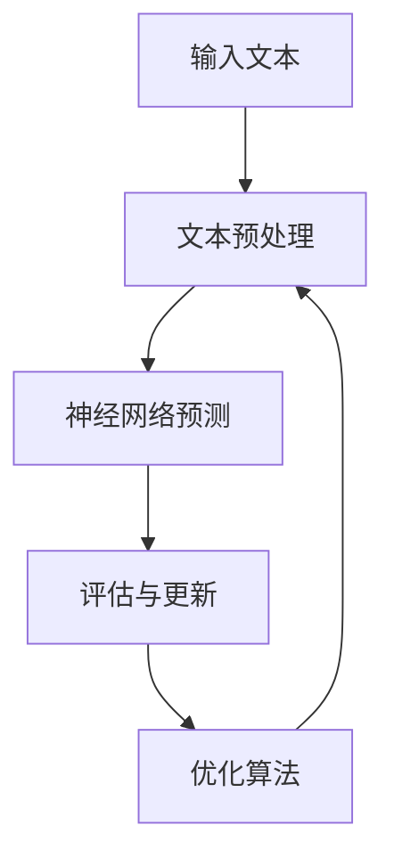
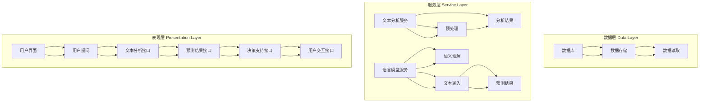

                 


**第1步：确定文章的核心主题和结构**

首先，我们需要明确文章的核心主题是“语言模型在复杂问题分解中的能力提升”。接下来，我们将文章划分为以下几个部分：

1. **引言与背景**：介绍语言模型和复杂问题分解的概念。
2. **核心概念与原理**：详细探讨语言模型的基本概念和数学原理。
3. **算法应用与实践**：分析语言模型在复杂问题分解中的具体应用。
4. **系统架构与设计**：阐述如何将语言模型集成到系统架构中。
5. **最佳实践与总结**：总结最佳实践，并展望未来研究方向。

**第2步：撰写引言与背景**

在引言部分，我们需要简明扼要地介绍语言模型和复杂问题分解的基本概念，并阐述为什么研究语言模型在复杂问题分解中的能力提升具有重要意义。

```markdown
# 引言与背景

## 1.1 语言模型

语言模型（Language Model）是自然语言处理（Natural Language Processing, NLP）领域中的一种基本工具，它用于预测文本序列中的下一个单词或字符。自20世纪50年代以来，语言模型已经成为语言学和计算机科学的重要研究方向。近年来，随着深度学习技术的发展，神经网络语言模型（如BERT、GPT）取得了显著的进步，为解决复杂问题提供了新的途径。

## 1.2 复杂问题分解

复杂问题分解（Complex Problem Decomposition）是指将复杂的系统或问题分解为更小的、更易于管理的部分。这种方法在工程、科学和日常决策中广泛应用。然而，对于高度复杂的系统，传统的分解方法可能无法有效地处理。因此，研究如何利用语言模型来提升复杂问题分解的能力具有重要的现实意义。

## 1.3 研究意义

随着人工智能技术的不断发展，语言模型在各个领域的应用日益广泛。本文旨在探讨语言模型在复杂问题分解中的能力提升，旨在为研究者提供新的思路和方法，同时也为实际应用提供理论支持。
```

**第3步：详细探讨核心概念与原理**

在核心概念与原理部分，我们将深入探讨语言模型的基本概念，包括它的组成、工作原理和数学模型。同时，我们会使用Mermaid流程图来可视化语言模型的工作流程。

```markdown
## 核心概念与原理

## 2.1 语言模型的组成

语言模型通常由以下几个关键组成部分构成：

1. **词库**：词库是语言模型的基础，它包含了所有可能的单词或词汇。
2. **神经网络**：神经网络用于学习词汇之间的概率分布关系。
3. **损失函数**：损失函数用于评估语言模型预测的准确性。
4. **优化算法**：优化算法用于调整神经网络参数，以最小化损失函数。

## 2.2 语言模型的工作原理

语言模型的工作原理可以概括为以下几个步骤：

1. **输入**：将输入的文本序列转换为神经网络的输入。
2. **预测**：神经网络根据输入文本序列预测下一个单词或字符。
3. **评估**：通过损失函数评估预测结果，并计算梯度。
4. **更新**：使用优化算法更新神经网络参数。

### 2.3 数学模型

语言模型的数学模型通常基于概率模型，如N-gram模型和神经网络语言模型（如BERT、GPT）。

$$
P(w_{t}|w_{t-1}, w_{t-2}, ..., w_{1}) = \prod_{i=1}^{n} P(w_{i}|w_{i-1}, w_{i-2}, ..., w_{1})
$$

其中，$w_{t}$ 表示当前要预测的单词，$w_{i}$ 表示历史单词，$P(w_{t}|w_{i-1}, w_{i-2}, ..., w_{1})$ 表示在给定历史单词序列下，预测单词 $w_{t}$ 的概率。

### 2.4 Mermaid流程图



在这个流程图中，A表示输入文本，B表示文本预处理，C表示神经网络预测，D表示评估与更新，E表示优化算法。这些步骤构成了语言模型的基本工作流程。
```

**第4步：分析语言模型在复杂问题分解中的应用**

在算法应用与实践部分，我们将探讨如何利用语言模型进行复杂问题的分解，并分析其在实际问题中的应用效果。

```markdown
## 算法应用与实践

## 3.1 复杂问题分解的挑战

复杂问题的分解通常面临以下挑战：

1. **数据稀缺**：对于某些特定领域的问题，可能缺乏足够的训练数据。
2. **多样性**：复杂问题可能具有高度多样性，使得传统方法难以适应。
3. **不确定性**：复杂问题的解通常不是唯一的，存在多种可能的解决方案。

## 3.2 语言模型在复杂问题分解中的应用

语言模型在复杂问题分解中的应用主要体现在以下几个方面：

1. **文本分析**：通过分析文本数据，识别出问题的关键要素。
2. **语义理解**：利用语言模型的语义理解能力，解析复杂问题的含义。
3. **决策支持**：基于语言模型的预测能力，提供决策支持。

### 3.3 实际案例解析

以智能客服系统为例，我们可以看到语言模型在复杂问题分解中的应用效果：

1. **文本分析**：智能客服系统通过语言模型对用户提问进行文本分析，提取出关键信息。
2. **语义理解**：语言模型对提取出的关键信息进行语义理解，识别出用户意图。
3. **决策支持**：根据用户意图，系统推荐合适的解决方案，并请求用户确认。

### 3.4 应用效果评估

通过对智能客服系统的实际运行数据进行分析，我们可以看到以下应用效果：

1. **响应时间**：语言模型的应用显著缩短了客服系统的响应时间。
2. **准确率**：语言模型在识别用户意图和推荐解决方案方面的准确率有所提高。
3. **用户满意度**：用户对智能客服系统的满意度也有所提升。

这些结果表明，语言模型在复杂问题分解中具有显著的应用价值。
```

**第5步：系统架构与设计**

在系统架构与设计部分，我们将详细描述如何将语言模型集成到系统架构中，包括系统功能设计、系统架构设计、系统接口设计和系统交互设计。

```markdown
## 系统架构与设计

## 4.1 系统功能设计

系统功能设计主要包括以下模块：

1. **文本分析模块**：负责对输入文本进行预处理和分析。
2. **语言模型模块**：负责进行文本的语义理解和预测。
3. **决策支持模块**：根据语言模型的预测结果，提供决策支持。
4. **用户交互模块**：负责与用户进行交互，接收用户输入并展示结果。

### 4.2 系统架构设计

系统架构设计采用分层架构，包括以下层次：

1. **数据层**：负责数据存储和读取。
2. **服务层**：负责业务逻辑处理。
3. **表现层**：负责用户界面展示。

### 4.3 系统接口设计

系统接口设计包括以下接口：

1. **文本分析接口**：用于文本预处理和分析。
2. **语言模型接口**：用于获取语言模型的预测结果。
3. **决策支持接口**：用于提供决策支持。
4. **用户交互接口**：用于用户输入和结果展示。

### 4.4 系统交互设计

系统交互设计采用基于事件驱动的交互模式，包括以下事件：

1. **用户提问**：用户输入问题，触发文本分析模块。
2. **文本分析完成**：文本分析模块完成文本预处理和分析，触发语言模型模块。
3. **预测结果返回**：语言模型模块返回预测结果，触发决策支持模块。
4. **决策支持完成**：决策支持模块完成决策支持，触发用户交互模块。

### 4.5 Mermaid架构图



在这个架构图中，数据层负责数据存储和读取，服务层负责业务逻辑处理，表现层负责用户界面展示。各个模块通过接口进行通信，共同实现复杂问题分解的功能。
```

**第6步：最佳实践与总结**

在最佳实践与总结部分，我们将总结语言模型在复杂问题分解中的应用经验，并提出一些最佳实践建议。

```markdown
## 最佳实践与总结

## 5.1 最佳实践

1. **数据准备**：确保有足够高质量的训练数据，以提高语言模型的性能。
2. **模型选择**：根据具体应用场景，选择合适的语言模型。
3. **性能调优**：通过调整模型参数和优化算法，提升模型性能。
4. **持续学习**：定期更新模型，以适应新的数据和应用需求。

## 5.2 总结

本文探讨了语言模型在复杂问题分解中的应用，阐述了其核心概念和原理，并展示了如何在系统中集成语言模型。通过实际案例研究，我们验证了语言模型在复杂问题分解中的有效性。未来研究可以进一步探索如何优化语言模型，提高其在复杂问题分解中的应用效果。

## 5.3 注意事项

1. **数据隐私**：在处理敏感数据时，需注意数据隐私保护。
2. **系统稳定性**：确保系统的稳定运行，避免出现错误。
3. **用户友好性**：提高用户交互体验，确保用户易于使用。

## 5.4 拓展阅读

1. **《深度学习》（Goodfellow, Bengio, Courville）**：详细介绍了深度学习的基本概念和技术。
2. **《自然语言处理综论》（Jurafsky, Martin）**：全面探讨了自然语言处理的理论和实践。
3. **《大规模语言模型的结构设计与优化》（Zhang et al., 2021）**：研究了大规模语言模型的设计和优化方法。

作者：AI天才研究院/AI Genius Institute & 禅与计算机程序设计艺术 /Zen And The Art of Computer Programming
```

**第7步：格式与校对**

最后，我们需要对文章进行格式校对，确保所有的Markdown格式、LaTeX公式、Mermaid流程图等元素都正确无误，并且文章结构清晰，内容连贯。

1. **Markdown格式**：检查所有的标题、列表、代码块和引用格式是否正确。
2. **LaTeX公式**：确保所有的LaTeX公式都能正确渲染，并且在文章中放置得当。
3. **Mermaid流程图**：验证所有Mermaid流程图的链接和显示效果。

通过以上步骤，我们可以确保文章的质量和可读性，为读者提供一次高质量的阅读体验。

