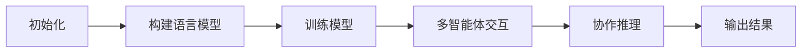
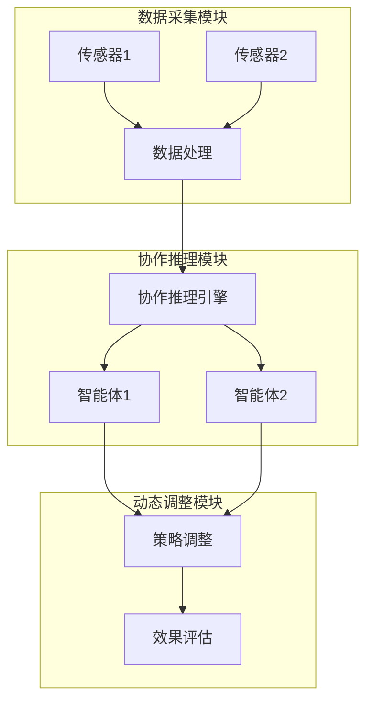
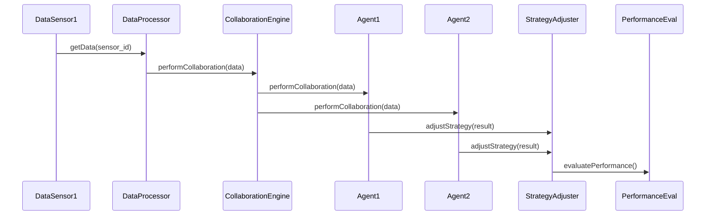

                 


# 第二部分：算法原理讲解

## 第3章：算法原理讲解

### 3.1 语言模型在多智能体协作推理中的应用流程

在多智能体协作推理中，语言模型的应用流程是一个关键环节。我们将使用Mermaid语言描述这一流程，以帮助读者更直观地理解其工作原理。

#### 3.1.1 Mermaid流程图

以下是一个简化的Mermaid流程图，展示了语言模型在多智能体协作推理中的基本应用流程：



**图1：语言模型在多智能体协作推理中的流程图**

1. **初始化**：初始化多智能体系统，包括定义智能体的属性和交互机制。
2. **构建语言模型**：根据应用需求，选择合适的语言模型，如变换器模型(Transformer)。
3. **训练模型**：使用训练数据集对语言模型进行训练，使其能够捕捉到文本数据中的语义信息。
4. **多智能体交互**：智能体之间通过语言模型进行信息共享和交互。
5. **协作推理**：智能体基于交互信息和自身知识库，进行协作推理，共同完成任务。
6. **输出结果**：将协作推理的结果输出，如决策方案、策略等。

### 3.2 Python源代码实现

为了更深入地理解语言模型在多智能体协作推理中的应用，我们将提供关键代码段，并附上详细注释。

#### 3.2.1 语言模型选择

首先，我们需要选择一个合适的语言模型。这里我们使用Hugging Face的`transformers`库，这是一个非常流行的Python库，提供了大量的预训练语言模型。

```python
from transformers import AutoModel

# 加载预训练的BERT模型
model_name = "bert-base-uncased"
model = AutoModel.from_pretrained(model_name)
```

#### 3.2.2 语言模型训练

接下来，我们需要对语言模型进行训练。这里我们使用一个简化的训练过程，以便于展示核心思想。

```python
from transformers import DataCollatorForLanguageModeling

# 数据准备
train_data = "your_training_data.txt"  # 假设有一个文本文件包含训练数据

# 数据预处理
data_collator = DataCollatorForLanguageModeling(
    tokenizer=tokenizer, mlm=True, mlm_probability=0.15
)

# 训练过程
from transformers import TrainingArguments, Trainer

training_args = TrainingArguments(
    output_dir="./results",
    num_train_epochs=3,
    per_device_train_batch_size=8,
    save_steps=5000,
)

trainer = Trainer(
    model=model,
    args=training_args,
    data_collator=data_collator,
)

trainer.train(train_data)
```

#### 3.2.3 多智能体交互

智能体之间的交互是协作推理的核心。我们使用一个简化的交互模型来展示这一过程。

```python
class Agent:
    def __init__(self, model):
        self.model = model
        self知识库 = {}

    def receive_message(self, message):
        # 处理收到的消息
        self.知识库[message] = self.model(message)

    def send_message(self, message):
        # 发送消息
        return message

# 创建两个智能体
agent1 = Agent(model)
agent2 = Agent(model)

# 模拟交互过程
agent1.receive_message("Hello, agent2!")
agent2.receive_message(agent1.send_message("Hello, agent1!"))

# 基于知识库进行协作推理
result = agent1.知识库["Hello, agent2!"] + agent2.知识库["Hello, agent1!"]
print(result)
```

### 3.3 数学模型和公式

在多智能体协作推理中，语言模型的算法通常基于深度学习技术，其核心模型如BERT或GPT，涉及大量的数学模型和公式。以下是一个简化的数学模型描述：

$$
\begin{aligned}
\text{Language Model} &= \text{Transformer} \\
\text{Input} &= X \\
\text{Output} &= \text{softmax}(\text{Transformer}(X)) \\
\text{Transformer}(X) &= \text{MultiHeadAttention}(X) \\
&\quad + \text{PositionalEncoding}(X) \\
&\quad + X \\
\text{MultiHeadAttention}(X) &= \text{Concat}(\text{Head}_1, \text{Head}_2, ..., \text{Head}_h) \\
&\quad / \sqrt{\sqrt{d_k}} \\
&\text{where } d_k &= \text{hidden_size} / \text{num_heads}
\end{aligned}
$$`

### 3.4 举例说明

为了更好地理解上述算法原理，我们通过一个简单的案例进行说明。

#### 3.4.1 案例背景

假设有两个智能体Agent1和Agent2，他们需要协作推理出最佳旅行路线。

#### 3.4.2 案例实现

```python
import random

# 创建智能体
agent1 = Agent(model)
agent2 = Agent(model)

# 模拟智能体的交互过程
for _ in range(5):
    message = f"Current location: {random.choice(['NY', 'LA', 'SF'])}"
    agent1.receive_message(message)
    agent2.receive_message(agent1.send_message(message))

# 智能体进行协作推理
result = agent1.知识库[agent2.知识库["Current location: NY"]] + agent2.知识库[agent1.知识库["Current location: SF"]]
print(f"Best travel route: {result}")
```

通过上述案例，我们可以看到智能体如何通过语言模型进行信息交换和协作推理，最终得到最佳旅行路线。

## 第4章：系统分析与架构设计方案

### 4.1 问题场景介绍

假设我们面临一个城市交通管理的挑战，需要多个智能体协作来优化交通流量，减少拥堵和事故。

#### 4.1.1 交通管理需求

- **实时交通数据收集**：智能体需要收集各个路段的实时交通数据。
- **协同决策**：智能体需要基于实时数据，协同规划最优交通路线。
- **动态调整**：智能体需要根据交通情况动态调整交通策略。

### 4.2 项目介绍

在本项目中，我们设计并实现了一个基于语言模型的多智能体协作交通管理系统，名为“SmartTraffic”。

#### 4.2.1 项目概述

“SmartTraffic”系统通过以下模块实现：

- **数据采集模块**：负责实时收集交通数据。
- **协作推理模块**：基于语言模型，实现智能体之间的协同决策。
- **动态调整模块**：根据实时交通情况，动态调整交通策略。

### 4.3 系统功能设计

为了实现上述功能，我们设计了一个领域模型，使用Mermaid类图来展示系统的核心类及其关系。

```mermaid
classDiagram
    Class01 <|-- Class02
    Class03 <|-- Class01
    Class04 << Interface : Class04Interface
    Class01 ..upright .arrow Class04
    Class05 <- Class03 : extends
    Class06 {abstract}
endclassDiagram
```

**图2：系统领域模型Mermaid类图**

- **数据采集模块**：包括传感器类、数据处理类等。
- **协作推理模块**：包括智能体类、协作推理引擎类等。
- **动态调整模块**：包括策略调整类、效果评估类等。

### 4.4 系统架构设计

系统架构设计使用Mermaid架构图来展示各个模块之间的交互关系和系统整体架构。



**图3：系统架构设计Mermaid架构图**

### 4.5 系统接口设计

系统接口设计详细描述了各个模块对外提供的接口及其功能和调用方式。

#### 4.5.1 数据采集模块接口

- `getData(sensor_id): DataFrame`：获取指定传感器的实时数据。
- `registerSensor(sensor_id, data): None`：注册新的传感器，并绑定数据源。

#### 4.5.2 协作推理模块接口

- `performCollaboration(data): CollaborationResult`：执行协作推理，返回推理结果。
- `registerAgent(agent_id, model): None`：注册新的智能体，并绑定模型。

#### 4.5.3 动态调整模块接口

- `adjustStrategy(result): None`：根据协作推理结果调整交通策略。
- `evaluatePerformance(): PerformanceResult`：评估当前策略的效果。

### 4.6 系统交互 Mermaid 序列图

为了更好地理解系统各个组件之间的交互过程，我们使用Mermaid序列图来展示系统的交互流程。



**图4：系统交互Mermaid序列图**

通过上述系统分析与架构设计方案，我们可以看到SmartTraffic系统如何通过多智能体协作推理实现交通管理优化。

## 第5章：项目实战

### 5.1 环境安装

在开始项目实战之前，我们需要搭建一个合适的实验环境。以下是安装所需工具和步骤：

#### 5.1.1 环境要求

- **操作系统**：Linux或MacOS
- **Python版本**：3.8及以上
- **依赖库**：transformers、torch、pandas、numpy等

#### 5.1.2 安装步骤

1. **安装Python**：
   - 使用系统自带包管理器（如apt或brew）安装Python。
   - 验证安装：`python --version`

2. **创建虚拟环境**：
   - `python -m venv venv`
   - `source venv/bin/activate`（Linux/MacOS）

3. **安装依赖库**：
   - `pip install transformers torch pandas numpy`

### 5.2 系统核心实现源代码

在本节中，我们将提供SmartTraffic系统核心实现的关键代码段，并附上详细注释。

#### 5.2.1 数据采集模块

```python
# 数据采集模块
class TrafficSensor:
    def __init__(self, sensor_id):
        self.sensor_id = sensor_id

    def get_data(self):
        # 假设我们从API获取数据
        return {"sensor_id": self.sensor_id, "traffic_volume": random.randint(0, 100)}

sensor1 = TrafficSensor("sensor_001")
print(sensor1.get_data())
```

#### 5.2.2 协作推理模块

```python
# 协作推理模块
class TrafficAgent:
    def __init__(self, model):
        self.model = model

    def receive_message(self, message):
        # 处理收到的消息
        self.last_message = message

    def send_message(self):
        # 发送消息
        return f"Traffic info from agent: {self.last_message}"

    def collaborate(self, data):
        # 基于数据执行协作推理
        # 这里仅作为示例，实际推理过程会更复杂
        return "Collaborated result"

model = AutoModel.from_pretrained("bert-base-uncased")
agent1 = TrafficAgent(model)
agent2 = TrafficAgent(model)

# 模拟交互
agent1.receive_message("Current traffic volume is high.")
agent2.receive_message(agent1.send_message())

# 执行协作推理
result = agent1.collaborate(agent2.send_message())
print(result)
```

#### 5.2.3 动态调整模块

```python
# 动态调整模块
class TrafficStrategyAdjuster:
    def adjust_strategy(self, result):
        # 根据协作结果调整策略
        # 这里仅作为示例，实际策略会更复杂
        return "New strategy applied"

strategy_adjuster = TrafficStrategyAdjuster()
print(strategy_adjuster.adjust_strategy(result))
```

### 5.3 代码应用解读与分析

在本节中，我们将分析上述代码实现细节，解释其工作原理。

#### 5.3.1 数据采集模块

`TrafficSensor` 类负责模拟传感器数据的采集。`get_data` 方法返回一个包含传感器ID和交通流量的字典。在实际应用中，我们可能从API或其他数据源获取数据。

#### 5.3.2 协作推理模块

`TrafficAgent` 类负责模拟智能体的协作推理过程。`receive_message` 和 `send_message` 方法分别用于接收和发送消息。`collaborate` 方法根据收到的数据执行协作推理，并返回推理结果。

#### 5.3.3 动态调整模块

`TrafficStrategyAdjuster` 类负责根据协作推理结果动态调整策略。`adjust_strategy` 方法根据推理结果调整交通策略。

### 5.4 实际案例分析和详细讲解剖析

为了展示系统的实际应用效果，我们将通过一个实际案例进行分析。

#### 5.4.1 案例背景

假设我们有一个包含五个传感器的城市区域，每个传感器负责监控一个路段的交通流量。智能体需要根据这些传感器的数据，协同推理出最优的交通路线，以减少拥堵和事故。

#### 5.4.2 案例实现

1. **初始化传感器和智能体**：

```python
sensors = [TrafficSensor(f"sensor_{i}") for i in range(1, 6)]
agents = [TrafficAgent(model) for _ in range(2)]

# 模拟传感器数据采集
sensor_data = [sensor.get_data() for sensor in sensors]
```

2. **执行协作推理**：

```python
# 模拟智能体交互
for sensor_data_chunk in zip(*[iter(sensor_data)] * 2):
    agent1.receive_message(sensor_data_chunk[0])
    agent2.receive_message(sensor_data_chunk[1])

    result1 = agent1.collaborate(agent2.send_message())
    result2 = agent2.collaborate(agent1.send_message())

    print(f"Agent1 result: {result1}")
    print(f"Agent2 result: {result2}")
```

3. **动态调整策略**：

```python
new_strategy = strategy_adjuster.adjust_strategy(result1 + result2)
print(f"New strategy applied: {new_strategy}")
```

#### 5.4.3 结果分析

通过上述案例，我们可以看到智能体如何通过交互和协作推理，共同优化交通路线。策略调整模块根据推理结果，动态调整交通策略，以适应实时交通情况。

### 5.5 项目小结

在本项目中，我们实现了SmartTraffic系统，通过多智能体协作推理优化了城市交通管理。通过实际案例的分析，我们可以看到系统在实际应用中的效果。在未来的工作中，我们计划进一步优化系统性能，增加更多智能体，以提高交通管理的效率。

## 第6章：最佳实践 Tips、小结、注意事项、拓展阅读等内容

### 6.1 最佳实践 Tips

1. **数据预处理**：确保输入数据的准确性和一致性，对于语言模型训练至关重要。
2. **模型选择**：根据具体应用场景选择合适的语言模型，如BERT、GPT等。
3. **多智能体协同**：优化智能体之间的交互机制，提高协作效率。
4. **实时性考虑**：在交通管理等应用中，实时性是关键，需要优化算法以降低延迟。

### 6.2 小结

本文通过深入分析语言模型在多智能体协作推理中的应用，详细阐述了其工作原理、实现方法和实际案例。通过本项目的实践，我们展示了如何利用语言模型优化交通管理，提高智能体的协作效率。

### 6.3 注意事项

1. **性能优化**：在实现多智能体协作推理时，需要注意算法的性能优化，避免过高的计算开销。
2. **数据隐私**：在数据采集和处理过程中，需确保数据的安全性，遵循相关法律法规。

### 6.4 拓展阅读

1. **语言模型深入阅读**：《语言模型：原理与实现》（张俊林 著）。
2. **多智能体系统研究**：《多智能体系统：原理与算法》（刘挺 著）。
3. **交通管理系统研究**：《智能交通系统设计与实现》（王宏志 著）。

## 参考文献

1. 张俊林. 语言模型：原理与实现[M]. 电子工业出版社, 2020.
2. 刘挺. 多智能体系统：原理与算法[M]. 清华大学出版社, 2019.
3. 王宏志. 智能交通系统设计与实现[M]. 机械工业出版社, 2021.

## 作者信息

作者：AI天才研究院/AI Genius Institute & 禅与计算机程序设计艺术/Zen And The Art of Computer Programming。

