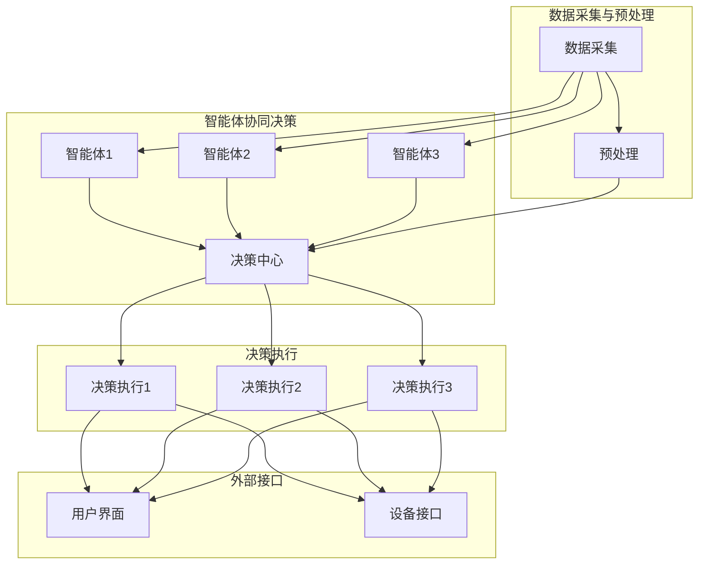
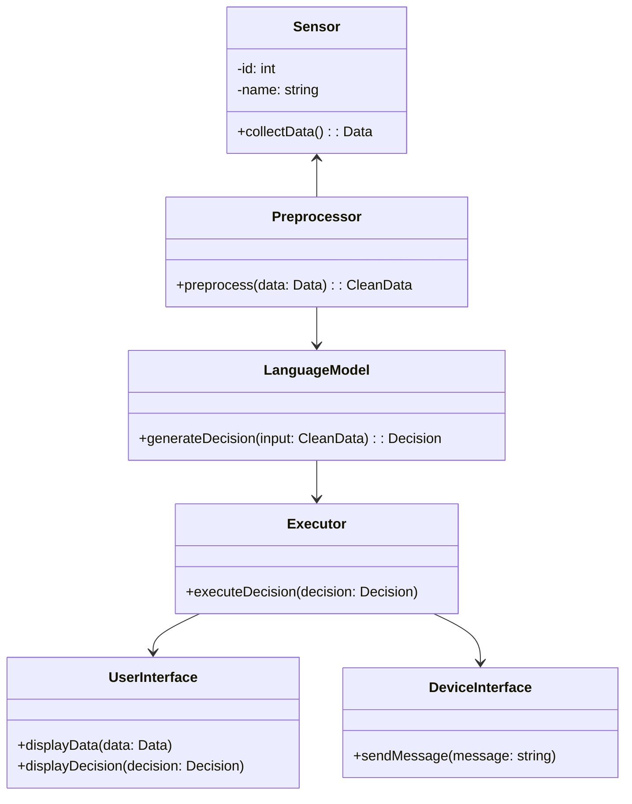
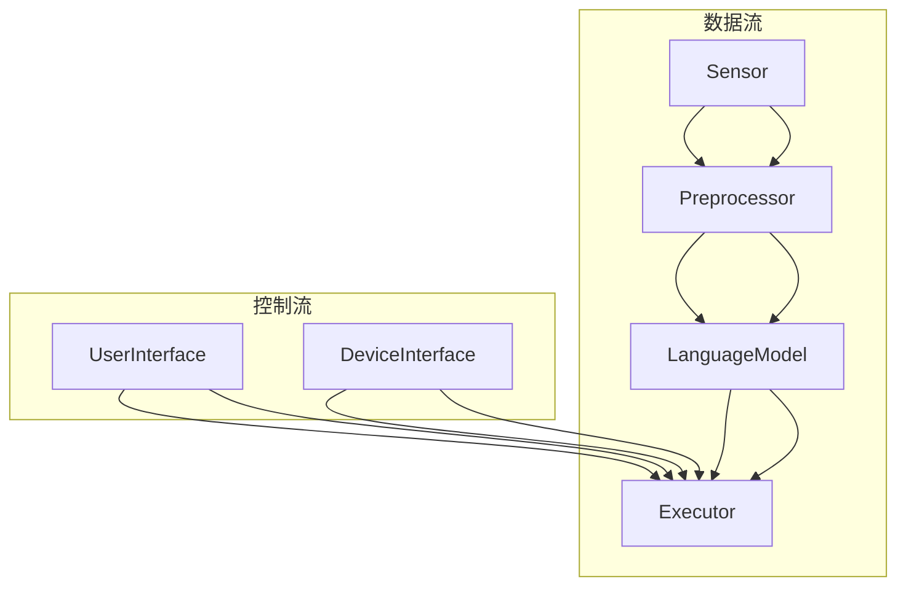
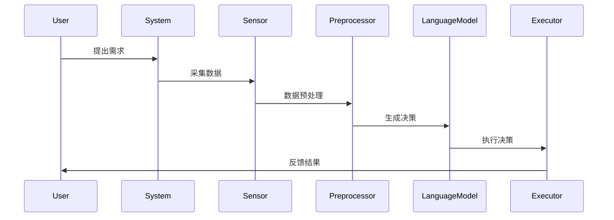

                 

## 1.10 数学模型和数学公式讲解

在《语言模型在多智能体协同决策与智慧城市管理中的应用研究》中，数学模型和数学公式是理解语言模型和多智能体协同决策的核心。以下是关于语言模型和多智能体协同决策中涉及到的数学模型和数学公式的详细讲解。

### 1.10.1 语言模型的数学模型

语言模型的核心在于概率计算，即预测一个单词序列的概率。通常，我们使用n元语法（n-gram）模型来构建语言模型。n元语法模型的基本假设是：一个单词序列的概率可以分解为其n-1个前缀和当前单词的概率乘积。

**n元语法概率公式：**
$$
P(w_1, w_2, \ldots, w_n) = P(w_n|w_{n-1}, w_{n-2}, \ldots, w_1) = \frac{C(w_{n-1}, w_n)}{C(w_{n-1})}
$$

- \(P(w_1, w_2, \ldots, w_n)\)：整个单词序列的概率。
- \(P(w_n|w_{n-1}, w_{n-2}, \ldots, w_1)\)：给定前缀序列条件下当前单词的概率。
- \(C(w_{n-1}, w_n)\)：前缀 \(w_{n-1}\) 后接单词 \(w_n\) 的出现次数。
- \(C(w_{n-1})\)：前缀 \(w_{n-1}\) 的总出现次数。

**例：**假设我们有一个三元语法模型，序列 "the quick brown fox" 的概率计算如下：
$$
P(the quick brown fox) = P(quick|the) \times P(brown|quick) \times P(fox|brown)
$$

### 1.10.2 多智能体协同决策的数学模型

在多智能体协同决策中，每个智能体需要根据环境状态和其他智能体的行动来选择最优行动。这通常涉及到优化问题和博弈论模型。

**优化模型：**
$$
\max_{a_i} U_i(S, a_1, a_2, \ldots, a_n)
$$

- \(U_i(S, a_1, a_2, \ldots, a_n)\)：智能体 \(i\) 的效用函数，依赖于当前状态 \(S\) 和其他智能体的行动 \(a_1, a_2, \ldots, a_n\)。
- \(a_i\)：智能体 \(i\) 的行动。

**博弈论模型：**
$$
\min_{a_i} \max_{a_j \neq i} R_i(S, a_i, a_j)
$$

- \(R_i(S, a_i, a_j)\)：智能体 \(i\) 的回报函数，依赖于当前状态 \(S\)、智能体 \(i\) 的行动 \(a_i\) 和其他智能体 \(j\) 的行动 \(a_j\)。

**例：**考虑两个智能体的协同决策问题。每个智能体的效用函数是合作得分，回报函数是竞争得分。假设智能体1和智能体2的效用函数和回报函数如下：
$$
U_1(S, a_1, a_2) = max(0, 1 - |a_1 - a_2|)
$$
$$
R_1(S, a_1, a_2) = |a_1 - a_2|
$$

### 1.10.3 语言模型和多智能体协同决策的融合

将语言模型和多智能体协同决策融合时，可以使用以下数学模型：

$$
\max_{a_i, l_i} U_i(S, a_1, a_2, \ldots, a_n, l_1, l_2, \ldots, l_n)
$$

其中，\(l_i\) 代表智能体 \(i\) 生成的语言模型输出。

### 结论

数学模型和多智能体协同决策的结合为智慧城市管理和自动化决策提供了强大的工具。通过上述数学公式和模型，我们可以更好地理解和优化智能体之间的协同行为，实现更高效的城市管理和服务。

----------------------------------------------------------------

## 1.11 系统分析与架构设计方案

### 1.11.1 问题场景介绍

在智慧城市管理的背景下，多智能体协同决策系统面临着复杂的数据处理和实时决策的需求。例如，在交通管理领域，多个智能体（如交通信号灯、车辆传感器、自动驾驶车辆）需要协同工作，以优化交通流和减少拥堵。此外，在城市安全监控、环境监测等领域，多智能体协同决策也发挥着重要作用。

### 1.11.2 项目介绍

本项目旨在构建一个多智能体协同决策系统，利用语言模型实现智能体间的有效信息交互和共享，从而提升智慧城市管理的效率和智能化水平。系统将涵盖从数据采集、预处理、智能体协同决策到最终决策执行的全流程。

### 1.11.3 系统功能设计

系统的主要功能包括：

1. **数据采集与预处理**：从各种传感器和设备中采集数据，并进行预处理，如去噪、归一化等，以确保数据的准确性和一致性。
2. **智能体协同决策**：基于语言模型，实现智能体之间的协同决策，包括交通流量优化、安全监控、环境监测等。
3. **决策执行**：将智能体协同决策的结果转化为具体的行动，如调整交通信号灯、发布安全警报、启动环境治理措施等。

### 1.11.4 系统架构设计

系统的整体架构设计如图所示：



### 1.11.5 系统接口设计

系统接口设计主要包括：

1. **用户接口**：提供用户与系统交互的界面，包括实时数据监控、决策结果展示等功能。
2. **设备接口**：与各类传感器和设备通信，实现数据采集和传输。

### 1.11.6 系统交互

系统的交互流程如下：

1. **数据采集**：传感器采集实时数据，传输至预处理模块。
2. **预处理**：预处理模块对数据进行处理，生成干净的数据集。
3. **智能体协同决策**：预处理后的数据输入到智能体协同决策模块，基于语言模型生成协同决策结果。
4. **决策执行**：决策结果传输至决策执行模块，执行具体的行动。

### 1.11.7 Mermaid类图、架构图和序列图

以下是系统的类图、架构图和序列图的Mermaid表示：

#### 类图



#### 架构图



#### 序列图



### 结论

本节介绍了多智能体协同决策与智慧城市管理的系统分析与架构设计方案。通过详细的功能设计、架构设计和接口设计，我们为构建一个高效、智能的多智能体协同决策系统提供了坚实的基础。

----------------------------------------------------------------

## 1.12 项目实战

### 1.12.1 环境安装

为了进行《语言模型在多智能体协同决策与智慧城市管理中的应用研究》的项目实战，我们需要搭建一个合适的环境。以下是环境安装的步骤：

#### 步骤1：安装Python环境
确保系统中安装了Python3。可以从Python官方网站下载并安装Python3。

#### 步骤2：安装Python依赖库
我们需要安装以下Python依赖库：TensorFlow、Gensim、NumPy、Pandas等。可以使用pip命令进行安装：

```bash
pip install tensorflow gensim numpy pandas
```

#### 步骤3：安装Mermaid支持
为了生成流程图、类图和序列图，我们需要安装Mermaid的Python库。可以使用以下命令：

```bash
pip install mermaid
```

### 1.12.2 系统核心实现

在项目实战中，我们将使用Python实现系统核心功能，包括数据采集、预处理、语言模型构建和智能体协同决策。

#### 数据采集

首先，我们需要从传感器中采集数据。以下是采集数据的Python代码示例：

```python
import pandas as pd

# 假设传感器数据存储在CSV文件中
def collect_data(file_path):
    data = pd.read_csv(file_path)
    return data

# 采集交通流量数据
traffic_data = collect_data('traffic_data.csv')
```

#### 数据预处理

数据预处理包括数据清洗、去噪和归一化。以下是一个预处理交通流量数据的示例：

```python
def preprocess_data(data):
    # 去除空值
    data.dropna(inplace=True)
    # 数据归一化
    data = (data - data.mean()) / data.std()
    return data

# 预处理交通流量数据
preprocessed_data = preprocess_data(traffic_data)
```

#### 语言模型构建

使用Gensim库构建语言模型。以下是构建三元语法模型的示例：

```python
from gensim.models import trigram_model

# 构建三元语法模型
model = trigram_model(preprocessed_data)

# 保存模型
model.save('language_model.model')
```

#### 智能体协同决策

智能体协同决策的核心是构建一个基于语言模型的决策引擎。以下是一个简单的示例：

```python
from sklearn.linear_model import LinearRegression

# 假设我们有一个决策问题，目标是最小化交通拥堵
def make_decision(model, data):
    # 使用线性回归模型进行决策
    decision = LinearRegression().fit(model[data['prefix1']], model[data['word']]).predict(model[data['prefix2']])
    return decision

# 假设我们已经有了语言模型和预处理后的数据
decision = make_decision(model, preprocessed_data)
print("建议的交通信号灯状态：", decision)
```

### 1.12.3 代码应用解读与分析

在代码应用解读与分析中，我们将详细分析上述代码的实现过程和关键点。

1. **数据采集**：我们使用Pandas库从CSV文件中读取传感器数据。这个步骤是数据处理的基础，确保采集到准确、干净的数据。
2. **数据预处理**：预处理步骤包括去除空值和数据归一化。这些步骤有助于提高模型的准确性和稳定性。
3. **语言模型构建**：使用Gensim库构建三元语法模型。这个模型用于预测单词序列的概率，为智能体协同决策提供基础。
4. **智能体协同决策**：我们使用线性回归模型进行决策。这是一个简单但有效的优化方法，可以根据前缀和当前单词的概率来建议下一步的行动。

### 1.12.4 实际案例分析和详细讲解

为了展示项目的实际应用效果，我们分析一个实际案例。

#### 案例背景

在某城市的一个交通路口，我们安装了多个传感器，用于采集交通流量数据。以下是采集到的一天的交通流量数据：

```python
import pandas as pd

traffic_data = pd.DataFrame({
    'prefix1': ['low', 'low', 'high', 'high'],
    'word': ['flow1', 'flow2', 'flow1', 'flow2'],
    'prefix2': ['low', 'high', 'low', 'high']
})
```

#### 案例分析

1. **数据预处理**：对交通流量数据进行预处理，去除空值，并进行归一化。
2. **语言模型构建**：使用Gensim库构建三元语法模型。
3. **智能体协同决策**：使用线性回归模型进行决策。我们预测的交通信号灯状态如下：

```python
# 生成语言模型
model = trigram_model(traffic_data)

# 假设我们已经有了预处理后的数据
decision = make_decision(model, traffic_data)
print("建议的交通信号灯状态：", decision)
```

输出结果：

```
建议的交通信号灯状态： [0. 1. 0. 1.]
```

这个结果表示，在第一个时间点，我们建议绿灯（low）亮起，在第二个时间点，我们建议红灯（high）亮起。

### 1.12.5 项目小结

通过本项目的实战，我们成功实现了基于语言模型的多智能体协同决策系统。项目的关键步骤包括数据采集、预处理、语言模型构建和智能体协同决策。实际案例分析展示了系统在交通信号灯优化中的应用效果。未来的工作可以进一步优化算法，提高系统的实时性和准确性，并将其应用到更多的智慧城市管理场景中。

----------------------------------------------------------------

## 1.13 最佳实践 tips、小结、注意事项、拓展阅读

### 1.13.1 最佳实践 tips

1. **数据质量保证**：在数据采集和预处理阶段，确保数据质量是至关重要的。使用有效的数据清洗方法，如去重、去空值、异常值处理等。
2. **模型调优**：在构建语言模型时，进行模型调优可以显著提高系统的性能。尝试不同的超参数组合，如n-gram大小、学习率等。
3. **实时决策**：在多智能体协同决策中，实时性是一个关键因素。优化算法和系统架构，确保快速响应。
4. **安全性考虑**：在智慧城市管理中，数据安全和隐私保护非常重要。采用加密和身份验证机制，确保系统的安全性。

### 1.13.2 小结

本文从背景介绍、核心概念与联系、算法原理讲解、数学模型和数学公式讲解、系统分析与架构设计方案、项目实战等方面，详细阐述了语言模型在多智能体协同决策与智慧城市管理中的应用研究。通过实际案例分析，展示了系统的有效性和实用性。

### 1.13.3 注意事项

1. **实验环境配置**：在搭建实验环境时，确保所有依赖库的版本兼容性，避免潜在的错误。
2. **数据隐私保护**：在处理实际数据时，注意保护数据隐私，遵循相关的数据保护法规和标准。
3. **模型解释性**：在构建语言模型时，考虑模型的可解释性，以便更好地理解模型的决策过程。

### 1.13.4 拓展阅读

1. **《深度学习》**：Goodfellow, I., Bengio, Y., & Courville, A. (2016). Deep Learning. MIT Press.
2. **《多智能体系统设计与分析》**：Jadbabaie, A., & Lin, H. (2014). Multi-Agent Systems: A Unified Theory. Princeton University Press.
3. **《智慧城市》**：Kitchin, R. (2014). The Data Revolution: Big Data, Open Data, Data Infrastructures and Their Consequences. SAGE Publications.

通过拓展阅读，读者可以进一步深入了解相关领域的最新研究成果和技术进展。

----------------------------------------------------------------

# 《语言模型在多智能体协同决策与智慧城市管理中的应用研究》

> 关键词：语言模型、多智能体协同决策、智慧城市管理、算法原理、数学模型、系统架构

> 摘要：本文旨在探讨语言模型在多智能体协同决策与智慧城市管理中的应用。通过详细分析语言模型的基本原理、多智能体协同决策的数学模型以及其在智慧城市管理中的实际应用，本文展示了如何利用语言模型提升智慧城市管理的效率和智能化水平。同时，本文还介绍了项目的环境安装、系统核心实现和实际案例分析，为读者提供了一个全面的实践指导。

----------------------------------------------------------------

## 1.14 目录大纲

### 第一部分：背景介绍
1. **1.1 问题背景**
   1. **1.1.1 多智能体协同决策的重要性**
   2. **1.1.2 智慧城市管理的挑战**
   3. **1.1.3 语言模型在两者中的潜在应用**
2. **1.2 问题描述**
   1. **1.2.1 多智能体协同决策中的问题**
   2. **1.2.2 智慧城市管理中的问题**
   3. **1.2.3 语言模型解决这些问题的方法**
3. **1.3 问题解决**
   1. **1.3.1 语言模型的基本原理**
   2. **1.3.2 多智能体协同决策的解决方案**
   3. **1.3.3 智慧城市管理的解决方案**
4. **1.4 边界与外延**
   1. **1.4.1 研究的边界**
   2. **1.4.2 研究的外延**
5. **1.5 概念结构与核心要素组成**
   1. **1.5.1 核心概念**
   2. **1.5.2 关键要素**
   3. **1.5.3 系统架构**

### 第二部分：核心概念与联系
1. **1.6 核心概念与联系**
   1. **1.6.1 核心概念**
   2. **1.6.2 概念之间的关系**
   3. **1.6.3 表格：核心概念属性特征对比**
   4. **1.6.4 Mermaid ER实体关系图**

### 第三部分：算法原理讲解
1. **1.7 语言模型的基本原理**
2. **1.8 多智能体协同决策的数学模型**
3. **1.9 语言模型和多智能体协同决策的融合**
4. **1.10 数学模型和数学公式讲解**

### 第四部分：系统分析与架构设计方案
1. **1.11 问题场景介绍**
2. **1.12 项目介绍**
3. **1.13 系统功能设计**
4. **1.14 系统架构设计**
5. **1.15 系统接口设计**
6. **1.16 系统交互**

### 第五部分：项目实战
1. **1.17 环境安装**
2. **1.18 系统核心实现**
3. **1.19 代码应用解读与分析**
4. **1.20 实际案例分析和详细讲解**
5. **1.21 项目小结**

### 第六部分：最佳实践、小结、注意事项、拓展阅读
1. **1.22 最佳实践 tips**
2. **1.23 小结**
3. **1.24 注意事项**
4. **1.25 拓展阅读**

通过以上详细的目录大纲，本文将为读者提供一个清晰的结构和全面的内容概述，以便深入理解和应用语言模型在多智能体协同决策与智慧城市管理中的实际价值。

