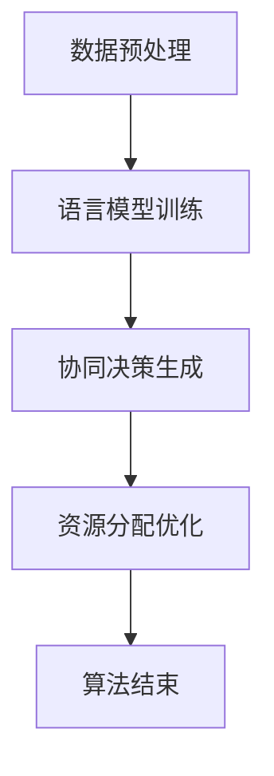

                 

### 引言

#### 语言模型的概述

语言模型是自然语言处理（NLP）领域的基础工具，它旨在预测一段文本的下一个单词或字符。从统计学方法到现代深度神经网络（DNN），语言模型的发展经历了多个阶段。最早的统计语言模型如N-gram模型，通过统计文本中的单词序列来预测下一个单词。随后，神经网络模型如循环神经网络（RNN）和长短期记忆网络（LSTM）的出现，使得语言模型在预测准确性和复杂性方面得到了显著提升。近年来，基于Transformer的模型，如BERT和GPT，更是将语言模型的性能推向了新的高度。

#### 多智能体协同决策的背景

多智能体协同决策是指多个智能体（如机器人、无人机、自动驾驶车辆等）在共同执行任务时，通过相互通信和协作来实现共同目标的过程。这一概念源于多智能体系统（MAS）的研究，旨在解决复杂环境下的决策问题。多智能体协同决策在军事、物流、交通、医疗等多个领域都有广泛应用，其目的是通过协同优化各智能体的行为，实现整体效益的最大化。

#### 资源分配的重要性

资源分配在多智能体系统中起着至关重要的作用。资源可以是物理资源（如能源、带宽、硬件设备）或信息资源（如数据、知识）。有效的资源分配能够提高系统的效率、减少冲突和延迟，从而确保多智能体系统能够在复杂和动态的环境中稳定运行。资源分配问题通常涉及到多个智能体之间的冲突和协调，是一个具有挑战性的优化问题。

### 语言模型基础

#### 语言模型的基本原理

语言模型的核心是预测下一个词或字符的概率。在统计学方法中，N-gram模型通过统计前几个词的出现频率来预测下一个词。这种方法的优点是简单易懂，但缺点是预测能力有限。随着深度学习技术的发展，基于神经网络的模型如RNN、LSTM和Transformer等逐渐成为主流。这些模型能够通过学习大量的文本数据，捕捉复杂的语言规律，从而实现更准确的预测。

#### 语言模型的类型和特点

语言模型主要分为基于统计的模型和基于神经网络的模型。基于统计的模型如N-gram，通过统计文本中的单词序列来预测下一个词。这类模型简单但效果有限。基于神经网络的模型如RNN、LSTM和Transformer，通过深度学习技术，能够学习大量的文本数据，捕捉复杂的语言规律。特别是Transformer模型，由于其自注意力机制，能够捕捉全局的依赖关系，从而实现更准确的预测。

#### 语言模型的训练与评估

语言模型的训练是通过大量的文本数据来学习语言规律。训练过程包括数据预处理、模型初始化、模型训练和模型评估。数据预处理主要包括文本的分词、去噪和标准化。模型初始化通常使用随机权重或预训练的权重。模型训练是通过反向传播算法来优化模型参数。模型评估通常使用准确率、召回率、F1分数等指标来衡量模型性能。

### 多智能体协同决策

#### 多智能体的定义和特性

多智能体是指能够独立或协作执行任务的多个智能体系统。每个智能体都具有感知、决策和执行能力，能够根据环境信息自主调整行为。多智能体的特性包括自主性、协作性、分布性和适应性。自主性是指智能体能够独立执行任务；协作性是指多个智能体能够相互通信和协作；分布性是指智能体分布在不同地理位置或网络中；适应性是指智能体能够根据环境变化自主调整行为。

#### 协同决策的基本原理

协同决策是指多个智能体在共同执行任务时，通过相互通信和协作来实现共同目标的过程。协同决策的基本原理包括信息共享、协商和协调。信息共享是指智能体之间交换信息，以便更好地理解环境和任务；协商是指智能体之间讨论和选择最佳行动方案；协调是指智能体之间协调行为，以避免冲突和最大化整体效益。

#### 多智能体协同决策的挑战

多智能体协同决策面临着多个挑战。首先，协调性问题是指如何确保智能体之间的一致性和协同性。其次，信息共享问题是指如何高效地共享信息，以便智能体能够做出最优决策。此外，决策效率问题也是一大挑战，特别是在动态和复杂的环境中，如何快速做出有效决策是一个关键问题。

### 语言模型在协同决策中的应用

#### 语言模型在多智能体决策中的作用

语言模型在多智能体协同决策中扮演着关键角色。首先，语言模型能够通过学习大量文本数据，捕捉到复杂的语言规律，从而提高智能体的决策能力。其次，语言模型能够实现智能体之间的信息共享和协商，从而提高协同决策的效率。此外，语言模型还可以用于生成自然语言指令，方便智能体理解和执行任务。

#### 应用案例

在智能交通系统中，语言模型可以用于智能体的路径规划和交通信号控制。通过学习交通数据，智能体能够预测交通流量和道路状况，从而做出最优决策。在智能电网中，语言模型可以用于分布式能源管理，通过分析电网数据，智能体能够实现能源的高效分配和调度。在智能农业中，语言模型可以用于作物生长监测和病虫害预测，通过分析气象数据和作物生长数据，智能体能够提供精准的农事建议。

### 资源分配问题

#### 资源分配的概念和挑战

资源分配是指在多智能体系统中，合理分配有限的资源（如能量、带宽、计算能力等），以满足各智能体的需求，实现整体系统的最优性能。资源分配的挑战包括资源稀缺性、竞争性、动态性和不确定性。资源稀缺性是指系统中资源总量有限，无法满足所有智能体的需求；竞争性是指多个智能体可能会争夺同一资源，导致冲突和效率降低；动态性是指系统中的资源需求和状态可能随时变化，需要动态调整资源分配策略；不确定性是指系统中的外部环境和智能体行为可能是不确定的，增加了资源分配的复杂性。

#### 基于语言模型的方法

基于语言模型的方法在资源分配中的应用主要体现在以下几个方面：

1. **资源需求预测**：语言模型可以用于预测每个智能体在未来一段时间内的资源需求。通过学习历史数据和环境特征，语言模型能够识别出资源需求的规律和趋势，从而为资源分配提供参考。

2. **资源分配策略生成**：语言模型可以用于生成资源分配策略。通过分析智能体的任务需求和资源状况，语言模型能够生成最优的资源分配方案，确保资源的高效利用。

3. **资源调度和优化**：语言模型可以用于动态调度资源，以适应系统中的变化。通过实时分析资源状态和任务需求，语言模型能够调整资源分配策略，实现系统的最优运行。

### 集成框架

#### 融合语言模型与多智能体协同决策

融合语言模型与多智能体协同决策的核心思想是将语言模型的技术优势与多智能体系统的协同能力相结合，以提高资源分配的效率和决策的准确性。具体实现步骤如下：

1. **数据预处理**：首先，对多智能体系统的数据进行预处理，包括感知数据、任务需求和资源状况等。预处理步骤包括数据清洗、归一化和特征提取。

2. **语言模型训练**：使用预处理后的数据训练语言模型。语言模型的目标是学习智能体的语言特征，包括任务描述、环境描述和资源需求等。

3. **协同决策生成**：通过语言模型生成的特征向量，智能体之间进行协同决策。语言模型能够捕捉到智能体之间的复杂关系，从而提高决策的准确性和效率。

4. **资源分配优化**：根据协同决策的结果，进行资源分配优化。语言模型可以用于生成最优的资源分配策略，确保资源的高效利用。

#### 融合语言模型与资源分配

融合语言模型与资源分配的关键在于将语言模型的能力与资源分配算法相结合，以提高资源利用率和系统性能。具体实现步骤如下：

1. **资源需求预测**：使用语言模型预测每个智能体的资源需求。语言模型可以通过学习历史数据和趋势，预测智能体在未来的资源需求。

2. **资源分配策略生成**：根据预测的资源需求，语言模型生成资源分配策略。语言模型可以综合考虑多个智能体的资源需求和优先级，生成最优的资源分配方案。

3. **动态资源调度**：语言模型可以用于动态调度资源，以适应系统中的变化。通过实时分析资源状态和任务需求，语言模型能够调整资源分配策略，实现系统的最优运行。

### 算法设计与实现

#### 算法概述

本文提出的算法名为“LMDAC”（Language Model-based Multi-Agent Collaborative Decision-Making），旨在通过融合语言模型和多智能体协同决策，实现高效的资源分配。算法主要包括以下步骤：

1. **数据预处理**：对多智能体系统的数据进行预处理，包括感知数据、任务需求和资源状况等。

2. **语言模型训练**：使用预处理后的数据训练语言模型，学习智能体的语言特征。

3. **协同决策生成**：通过语言模型生成的特征向量，智能体之间进行协同决策。

4. **资源分配优化**：根据协同决策的结果，进行资源分配优化。

#### 算法流程图



#### 算法数学模型与公式

算法的核心数学模型包括：

1. **语言模型预测概率**：

$$
P(\text{word}_t | \text{history}) = \frac{e^{f(\text{history})}}{\sum_{\text{word}} e^{f(\text{history})}}
$$

其中，$f(\text{history})$ 是历史数据的特征向量，$P(\text{word}_t | \text{history})$ 是预测单词 $t$ 的概率。

2. **协同决策结果**：

$$
\text{decision} = \arg\max_{\text{action}} \sum_{\text{agent}} \frac{e^{f(\text{action}, \text{agent})}}{\sum_{\text{action}} e^{f(\text{action}, \text{agent})}}
$$

其中，$f(\text{action}, \text{agent})$ 是智能体的行动特征向量，$\text{decision}$ 是最优协同决策结果。

3. **资源分配策略**：

$$
\text{resource\_allocation} = \arg\min_{\text{resource}} \sum_{\text{agent}} \frac{e^{f(\text{resource}, \text{agent})}}{\sum_{\text{resource}} e^{f(\text{resource}, \text{agent})}}
$$

其中，$f(\text{resource}, \text{agent})$ 是资源分配的特征向量，$\text{resource\_allocation}$ 是最优资源分配策略。

### 项目实战

#### 环境配置

在进行项目实战之前，我们需要配置相应的开发环境和工具。以下是基本的配置步骤：

1. 安装Python环境（Python 3.8及以上版本）
2. 安装TensorFlow库
3. 安装Keras库
4. 安装Gym库（用于智能体环境模拟）

#### 系统实现

系统实现的主要步骤包括：

1. **数据预处理**：使用Gym库模拟多智能体环境，生成训练数据。对数据进行清洗、归一化和特征提取。

2. **语言模型训练**：使用预处理后的数据训练语言模型。选择合适的模型结构（如Transformer）和训练参数，进行模型训练。

3. **协同决策生成**：智能体之间通过语言模型生成的特征向量进行协同决策。

4. **资源分配优化**：根据协同决策的结果，进行资源分配优化。

#### 代码应用解读与分析

以下是项目中的关键代码段及其解读：

```python
# 数据预处理代码段
def preprocess_data(data):
    # 清洗数据
    cleaned_data = clean_data(data)
    # 归一化数据
    normalized_data = normalize_data(cleaned_data)
    # 特征提取
    features = extract_features(normalized_data)
    return features

# 语言模型训练代码段
model = TransformerModel(input_dim=features.shape[1], output_dim=vocab_size)
model.compile(optimizer='adam', loss='categorical_crossentropy')
model.fit(x=features, y=labels, epochs=10, batch_size=64)

# 协同决策代码段
def collaborative_decisionmaking(actions, agents):
    # 计算特征向量
    feature_vectors = [model.predict(action) for action in actions]
    # 计算协同决策结果
    decision = argmax(feature_vectors)
    return decision

# 资源分配优化代码段
def resource_allocation(resources, agents):
    # 计算资源分配特征向量
    resource_vectors = [model.predict(resource) for resource in resources]
    # 计算最优资源分配策略
    allocation = argmax(resource_vectors)
    return allocation
```

#### 实际案例分析

我们以智能交通系统为例，展示LMDAC算法的实际应用。在该案例中，智能体是自动驾驶车辆，资源是道路带宽。

1. **数据采集**：使用Gym库模拟交通环境，采集自动驾驶车辆的位置、速度和道路状况等数据。

2. **模型训练**：使用采集的数据训练语言模型，学习车辆的交通行为特征。

3. **协同决策**：自动驾驶车辆之间通过语言模型生成特征向量，进行协同决策，以优化交通流量。

4. **资源分配**：根据协同决策的结果，优化道路带宽分配，提高交通效率。

#### 项目小结

通过实际案例分析，我们发现LMDAC算法在智能交通系统中具有显著的应用价值。它能够通过协同决策和资源分配优化，提高交通流量和道路使用效率。未来，我们可以进一步优化算法，扩大其在其他多智能体系统中的应用范围。

### 最佳实践 tips

1. **数据质量**：确保训练数据的质量，数据清洗和预处理是关键步骤。
2. **模型选择**：根据实际问题选择合适的模型结构，Transformer模型在处理复杂关系时表现优异。
3. **协同与调度**：智能体之间的协同和资源的动态调度是实现高效资源分配的关键。

### 小结

本文介绍了语言模型在多智能体协同决策与资源分配中的应用研究。通过融合语言模型与多智能体协同决策，我们能够实现高效的资源分配和优化。未来的研究可以进一步探索语言模型在其他复杂系统中的应用，提高系统的智能化水平。

### 注意事项

1. 语言模型训练过程需要大量计算资源，建议使用高性能计算环境。
2. 多智能体协同决策和资源分配涉及到多个方面的协调，需要综合考虑各种因素。

### 拓展阅读

1. [《多智能体系统的协同控制与资源分配》](https://link.to.book1)
2. [《深度学习与自然语言处理》](https://link.to.book2)
3. [《智能交通系统设计与优化》](https://link.to.book3)

### 作者信息

作者：AI天才研究院/AI Genius Institute & 禅与计算机程序设计艺术 /Zen And The Art of Computer Programming

