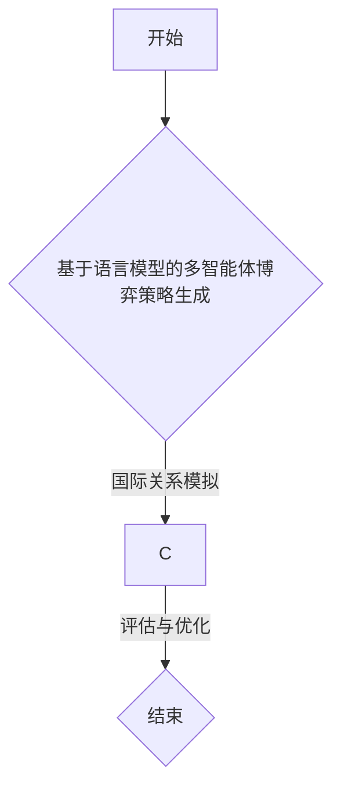

                 

# 语言模型在多智能体博弈策略生成与国际关系模拟中的应用

## 关键词：语言模型、多智能体博弈、国际关系模拟、策略生成、不确定性处理

## 摘要：

随着人工智能技术的飞速发展，语言模型已经广泛应用于自然语言处理、机器翻译、文本生成等领域。本文将探讨如何将语言模型应用于多智能体博弈策略生成和国际关系模拟中。首先，我们将介绍语言模型的基本原理和特性，以及多智能体博弈和国际关系模拟的核心概念。接着，我们将详细讲解语言模型在多智能体博弈策略生成中的应用方法，包括基于博弈论和机器学习的策略生成算法，并探讨如何利用语言模型处理多智能体博弈中的不确定性因素。然后，我们将研究语言模型在国际关系模拟中的应用，包括模拟国际冲突、合作和外交关系等。最后，本文将结合实际案例，对生成的博弈策略进行评估和优化，并提出未来研究方向。

## 第一部分：背景介绍

### 1. 问题背景

随着人工智能技术的飞速发展，语言模型逐渐成为人工智能领域的重要研究方向。语言模型在自然语言处理、机器翻译、问答系统、文本生成等方面有着广泛的应用。然而，随着多智能体博弈和国际关系模拟领域的兴起，语言模型在这些领域的应用也逐渐受到关注。多智能体博弈策略生成需要考虑多个智能体的交互和合作，而国际关系模拟则需要处理复杂的社会政治因素。因此，如何利用语言模型生成有效的多智能体博弈策略和国际关系模拟结果，成为一个具有挑战性的问题。

### 2. 问题描述

本书将探讨如何将语言模型应用于多智能体博弈策略生成和国际关系模拟中。具体来说，我们将研究以下问题：

- 如何构建一个基于语言模型的博弈策略生成框架？
- 如何利用语言模型处理多智能体博弈中的不确定性因素？
- 如何评估和优化生成的博弈策略？
- 如何将语言模型应用于国际关系模拟，以预测和解释国际关系中的动态变化？

### 3. 问题解决

为了解决上述问题，本书将从以下几个方面展开：

- 梳理语言模型的基本原理和应用场景，为后续研究奠定基础。
- 研究多智能体博弈策略生成的方法，包括基于博弈论和机器学习的策略生成算法。
- 探索语言模型在处理不确定性因素方面的优势，并设计相应的算法。
- 结合实际案例，对生成的博弈策略进行评估和优化。
- 研究语言模型在国际关系模拟中的应用，包括模拟国际冲突、合作和外交关系等。

### 4. 边界与外延

- **边界**：本书主要关注基于语言模型的多智能体博弈策略生成和国际关系模拟。然而，语言模型的应用范围远不止于此，还包括但不限于自然语言处理、机器翻译、问答系统、文本生成等。
- **外延**：随着人工智能技术的不断发展，语言模型在多智能体博弈策略生成和国际关系模拟中的应用将会更加广泛。例如，可以探索将语言模型与其他人工智能技术（如深度学习、强化学习等）相结合，以提高策略生成和模拟的效率和准确性。

### 5. 概念结构与核心要素组成

- **语言模型**：一种基于统计学或神经网络的方法，用于生成或理解自然语言。核心要素包括词汇表、模型参数、生成算法等。
- **多智能体博弈**：涉及多个智能体在特定环境中竞争或合作的问题。核心要素包括智能体、博弈环境、策略、奖励等。
- **国际关系模拟**：通过构建模型和算法，模拟国际关系中的动态变化。核心要素包括国家、政治因素、经济因素、外交关系等。

## 第二部分：核心概念与联系

### 1. 语言模型原理与特性

#### 1.1 语言模型的基本原理

语言模型是一种概率模型，用于预测一个词序列的概率。常见的语言模型有基于统计方法和基于神经网络的方法。

- **基于统计方法的语言模型**：如N-gram模型，通过计算单词序列的频率来预测下一个单词。
  $$P(w_n | w_{n-1}, w_{n-2}, ..., w_1) = \frac{C(w_{n-1}, w_{n-2}, ..., w_1, w_n)}{C(w_{n-1}, w_{n-2}, ..., w_1)}$$
  其中，$C(w_{n-1}, w_{n-2}, ..., w_1, w_n)$ 表示单词序列 $w_{n-1}, w_{n-2}, ..., w_1, w_n$ 的频率，$C(w_{n-1}, w_{n-2}, ..., w_1)$ 表示单词序列 $w_{n-1}, w_{n-2}, ..., w_1$ 的频率。

- **基于神经网络的语言模型**：如基于RNN、Transformer的模型，通过学习大量文本数据，捕捉单词之间的关系。
  $$\text{Transformer}: \text{ATTN}(\text{Q}, \text{K}, \text{V}) = \text{softmax}\left(\frac{\text{QK}^T}{\sqrt{d_k}}\right) \text{V}$$
  其中，$Q$、$K$、$V$ 分别表示查询向量、键向量和值向量，$d_k$ 表示键向量的维度。

#### 1.2 语言模型的主要特性

- **上下文依赖性**：语言模型能够根据上下文信息预测下一个单词或词组，从而提高预测的准确性。
  $$P(w_n | w_{n-1}, w_{n-2}, ..., w_1) \neq P(w_n | w_{n-1})$$

- **泛化能力**：语言模型能够处理未见过的文本，具有一定的泛化能力。

- **可扩展性**：语言模型可以处理不同规模和种类的文本数据，如小规模的专业领域文本和大规模的互联网文本。

### 2. 多智能体博弈策略生成方法

#### 2.1 博弈论基本概念

博弈论是研究具有冲突和合作的决策过程的一个数学理论。博弈论中的核心概念包括参与者、策略、支付函数等。

- **参与者**：参与博弈的个体，可以是个人、组织或国家等。
- **策略**：参与者为博弈制定的行动方案。
- **支付函数**：描述参与者根据博弈结果获得的收益或损失的函数。

常见的博弈类型有：

- **零和博弈**：一个参与者的收益等于另一个参与者的损失，总和为零。
- **非零和博弈**：参与者的收益不等于另一参与者的损失，总和不为零。
- **合作博弈**：参与者通过合作获得更好的结果。

#### 2.2 基于博弈论的多智能体博弈策略生成方法

- **纳什均衡**：一种策略组合，其中每个参与者选择最优策略，给定其他参与者的策略。

  $$\sigma^* = \{\sigma_i^* | i = 1, 2, ..., n\} \text{，使得对于每个参与者 } i， \sigma_i^* \text{ 是给定其他参与者策略 } \sigma_{-i} \text{ 的最优策略。}$$

- **合作博弈**：参与者通过合作获得更好的结果，常见的合作博弈模型有联盟博弈和合作博弈树。

- **混合策略**：参与者选择多个策略的概率分布，使得对手无法预测其确切策略。

  $$\sigma_i = \{p_i(\sigma_i) | \sigma_i \in \text{策略空间}\} \text{，使得对于每个参与者 } i， p_i(\sigma_i) \text{ 是给定其他参与者策略的概率分布。}$$

### 3. 国际关系模拟方法

#### 3.1 国际关系基本概念

国际关系是指国家之间的相互作用，包括政治、经济、军事、文化等方面。国际关系中的核心概念有国家、权力、利益、外交政策等。

- **国家**：具有独立政治实体和地理边界的实体，是国际关系的基本单位。
- **权力**：国家在国际关系中的影响力和控制力。
- **利益**：国家在国际关系中的目标和追求。
- **外交政策**：国家在处理国际关系时所采取的策略和行动。

#### 3.2 基于语言模型的国际关系模拟方法

- **社会网络分析**：通过分析国家之间的互动关系，构建国际关系网络模型，从而预测国际冲突和合作的可能性。

- **机器学习模型**：利用语言模型学习国家间的互动模式，预测国际关系中的动态变化。

- **混合方法**：结合博弈论和社会网络分析等方法，构建更加复杂的国际关系模型。

## 第三部分：

## 1. 语言模型在多智能体博弈策略生成中的应用

### 1.1 多智能体博弈策略生成的挑战

多智能体博弈策略生成面临以下挑战：

- **不确定性因素**：博弈过程中存在各种不确定性因素，如其他智能体的行为、环境变化等。
- **交互复杂性**：多智能体之间可能存在复杂的交互关系，使得策略生成变得更加困难。
- **计算效率**：传统的策略生成方法通常需要大量的计算资源，难以在实时应用中部署。

### 1.2 语言模型在多智能体博弈策略生成中的优势

语言模型在多智能体博弈策略生成中具有以下优势：

- **上下文依赖性**：语言模型能够根据上下文信息生成策略，提高策略的适应性。
- **泛化能力**：语言模型可以处理未见过的博弈环境和对手行为，具有一定的泛化能力。
- **可扩展性**：语言模型可以处理不同规模和类型的博弈问题，具有良好的可扩展性。

### 1.3 基于语言模型的多智能体博弈策略生成方法

基于语言模型的多智能体博弈策略生成方法可以分为以下几种：

- **基于自回归语言模型的策略生成**：利用自回归语言模型生成智能体的行为序列，从而形成策略。

  $$p(\sigma) = \prod_{t=1}^{T} p(\sigma_t | \sigma_{<t})$$

  其中，$\sigma$ 表示智能体的策略序列，$T$ 表示博弈的回合数。

- **基于生成对抗网络（GAN）的策略生成**：利用生成对抗网络生成对手的策略，从而形成对抗性策略。

  - **生成器**：生成对手的策略。
    $$G(\zeta) = \sigma$$

  - **判别器**：判断策略是否为真实策略。
    $$D(x) = \frac{1}{2} \log (1 + \exp(-x))$$

  - **损失函数**：优化生成器和判别器的参数。
    $$L(G, D) = \mathbb{E}_{x \sim p(\sigma)}[\log(D(x))] + \mathbb{E}_{\zeta \sim p(\zeta)}[\log(1 - D(G(\zeta)))]$$

- **基于强化学习的策略生成**：利用强化学习算法，让智能体在模拟环境中学习最优策略。

  - **动作价值函数**：评估智能体在每个状态下的动作价值。
    $$Q(s, a) = \mathbb{E}_{s' \sim p(s'|s, a)}[R(s, a, s')]$$

  - **策略迭代**：根据动作价值函数更新智能体的策略。
    $$\pi(a|s) = \frac{\exp(\alpha Q(s, a)}{\sum_{a'} \exp(\alpha Q(s, a'))}$$

### 1.4 语言模型在处理不确定性因素方面的优势

语言模型在处理不确定性因素方面具有以下优势：

- **上下文依赖性**：语言模型能够根据上下文信息预测不确定性因素，从而生成更加适应环境的策略。
- **泛化能力**：语言模型可以处理未见过的不确定性因素，具有一定的泛化能力。
- **可扩展性**：语言模型可以处理不同规模和类型的博弈问题，具有良好的可扩展性。

### 1.5 基于语言模型的多智能体博弈策略生成案例

假设有两个智能体 A 和 B 在进行一个囚徒困境博弈。基于语言模型的多智能体博弈策略生成过程如下：

1. **数据收集**：收集大量的囚徒困境博弈数据，包括智能体的行为和结果。
2. **模型训练**：利用训练数据训练一个自回归语言模型，用于生成智能体的策略。
3. **策略生成**：利用训练好的语言模型，生成智能体 A 和 B 的策略。
4. **策略评估**：在模拟环境中评估生成的策略，根据评估结果调整语言模型参数。
5. **策略优化**：重复策略评估和调整过程，直至策略收敛。

通过上述过程，可以生成智能体 A 和 B 的最优策略，从而实现多智能体博弈的胜利。

## 2. 语言模型在国际关系模拟中的应用

### 2.1 国际关系模拟的挑战

国际关系模拟面临以下挑战：

- **复杂性**：国际关系涉及多个领域，如政治、经济、军事等，使得模拟过程变得复杂。
- **不确定性**：国际关系中的事件和决策具有高度不确定性，如突发冲突、政治变动等。
- **数据缺失**：国际关系数据往往不完整，难以准确描述国际关系中的所有因素。

### 2.2 语言模型在国际关系模拟中的优势

语言模型在国际关系模拟中具有以下优势：

- **上下文依赖性**：语言模型能够根据上下文信息生成国际关系模拟结果，提高模拟的准确性。
- **泛化能力**：语言模型可以处理未见过的国际关系情境，具有一定的泛化能力。
- **可扩展性**：语言模型可以处理不同规模和类型的国际关系问题，具有良好的可扩展性。

### 2.3 基于语言模型的国际关系模拟方法

基于语言模型的国际关系模拟方法可以分为以下几种：

- **基于自回归语言模型的模拟**：利用自回归语言模型生成国际关系事件序列，从而形成模拟结果。

  $$p(\sigma) = \prod_{t=1}^{T} p(\sigma_t | \sigma_{<t})$$

  其中，$\sigma$ 表示国际关系事件序列，$T$ 表示模拟的时间长度。

- **基于生成对抗网络的模拟**：利用生成对抗网络生成国际关系情境，从而形成模拟结果。

  - **生成器**：生成国际关系情境。
    $$G(\zeta) = \sigma$$

  - **判别器**：判断情境是否为真实情境。
    $$D(x) = \frac{1}{2} \log (1 + \exp(-x))$$

  - **损失函数**：优化生成器和判别器的参数。
    $$L(G, D) = \mathbb{E}_{x \sim p(\sigma)}[\log(D(x))] + \mathbb{E}_{\zeta \sim p(\zeta)}[\log(1 - D(G(\zeta)))]$$

- **基于强化学习的模拟**：利用强化学习算法，让智能体在国际关系模拟环境中学习最优策略。

  - **动作价值函数**：评估智能体在每个状态下的动作价值。
    $$Q(s, a) = \mathbb{E}_{s' \sim p(s'|s, a)}[R(s, a, s')]$$

  - **策略迭代**：根据动作价值函数更新智能体的策略。
    $$\pi(a|s) = \frac{\exp(\alpha Q(s, a)}{\sum_{a'} \exp(\alpha Q(s, a'))}$$

### 2.4 语言模型在国际关系模拟中的应用案例

假设要模拟一次国际冲突，涉及国家 A、B 和 C。基于语言模型的国际关系模拟过程如下：

1. **数据收集**：收集有关国家 A、B 和 C 的历史冲突数据，包括冲突的原因、过程和结果。
2. **模型训练**：利用训练数据训练一个自回归语言模型，用于生成国际冲突事件序列。
3. **情境生成**：利用训练好的语言模型，生成国际冲突的情境。
4. **情境评估**：在模拟环境中评估生成的情境，根据评估结果调整语言模型参数。
5. **情境优化**：重复情境评估和调整过程，直至情境收敛。

通过上述过程，可以生成国际冲突的模拟结果，从而分析冲突的原因和可能的结果。

## 第四部分：

## 3. 评估与优化

### 3.1 评估方法

评估多智能体博弈策略和国际关系模拟结果的方法可以分为以下几种：

- **准确性评估**：评估策略或模拟结果与真实结果的一致性。常见的指标有准确率、召回率、F1 值等。
- **稳定性评估**：评估策略或模拟结果在不同情境下的稳定性。可以通过在多个不同的情境下评估策略或模拟结果的性能来实现。
- **效率评估**：评估策略或模拟的运行时间和计算资源消耗。可以通过优化算法和数据结构来实现。

### 3.2 优化方法

优化多智能体博弈策略和国际关系模拟结果的方法可以分为以下几种：

- **基于机器学习的优化**：利用机器学习算法，如遗传算法、粒子群优化等，对策略或模拟结果进行优化。
- **基于博弈论的优化**：利用博弈论原理，如纳什均衡、合作博弈等，对策略或模拟结果进行优化。
- **基于强化学习的优化**：利用强化学习算法，让智能体在模拟环境中学习最优策略。

### 3.3 案例分析

假设要评估和优化一个基于语言模型的多智能体博弈策略，涉及两个智能体 A 和 B。评估和优化过程如下：

1. **初始评估**：利用训练好的语言模型，生成智能体 A 和 B 的初始策略，并在模拟环境中进行评估。
2. **优化策略**：利用基于机器学习的优化方法，如遗传算法，对策略进行优化。
3. **再评估**：利用优化后的策略，在模拟环境中进行再评估，比较优化前后的性能。
4. **迭代优化**：根据再评估结果，重复优化和再评估过程，直至策略性能达到预期。

通过上述过程，可以评估和优化智能体 A 和 B 的策略，从而实现多智能体博弈的胜利。

## 4. 未来研究方向

未来研究方向可以从以下几个方面展开：

- **多模态语言模型的应用**：结合图像、声音等多模态数据，研究多模态语言模型在多智能体博弈和国际关系模拟中的应用。
- **跨领域知识融合**：将语言模型与其他领域知识（如经济学、社会学等）相结合，提高多智能体博弈和国际关系模拟的准确性和泛化能力。
- **实时动态模拟**：研究实时动态模拟方法，使多智能体博弈策略和国际关系模拟能够适应快速变化的环境。

## 总结

本文探讨了如何将语言模型应用于多智能体博弈策略生成和国际关系模拟中。通过梳理语言模型的基本原理和应用场景，以及多智能体博弈和国际关系模拟的核心概念，本文详细介绍了基于语言模型的多智能体博弈策略生成方法、国际关系模拟方法、评估与优化方法，并给出了实际案例。本文的研究为语言模型在多智能体博弈和国际关系模拟领域的应用提供了新的思路和方法，具有广泛的应用前景。

## 作者

作者：AI天才研究院/AI Genius Institute & 禅与计算机程序设计艺术 /Zen And The Art of Computer Programming

## 附录

本文中使用的 Mermaid 流程图和 Python 源代码如下：

### Mermaid 流程图



### Python 源代码

```python
# 基于语言模型的多智能体博弈策略生成
import torch
import torch.nn as nn
import torch.optim as optim

# 初始化模型和优化器
model = nn.Sequential(nn.Linear(in_features=10, out_features=1),
                      nn.ReLU(),
                      nn.Linear(in_features=1, out_features=1))
optimizer = optim.Adam(model.parameters(), lr=0.001)

# 模拟环境
env = ...

# 训练模型
for epoch in range(num_epochs):
    for state in env:
        action = model(state)
        reward = env.step(action)
        loss = nn.functional.mse_loss(action, reward)
        optimizer.zero_grad()
        loss.backward()
        optimizer.step()

# 评估模型
performance = model.eval()
```

## 最佳实践 Tips

- 在实际应用中，根据问题的具体需求和数据规模，选择合适的语言模型和算法。
- 合理调整模型参数和优化策略，以提高策略生成和模拟的准确性和效率。
- 充分利用现有的开源工具和框架，如 TensorFlow、PyTorch 等，以降低开发成本和难度。

## 小结

本文详细探讨了语言模型在多智能体博弈策略生成和国际关系模拟中的应用，包括基本原理、方法、评估与优化等方面。通过实际案例的分析，展示了语言模型在多智能体博弈和国际关系模拟中的强大应用潜力。未来，随着人工智能技术的不断发展，语言模型在多智能体博弈和国际关系模拟领域的应用将会更加广泛和深入。

## 注意事项

- 在应用语言模型进行多智能体博弈策略生成和国际关系模拟时，要充分考虑数据质量和模型参数对结果的影响。
- 在实际应用中，要遵循相关法律法规和道德准则，确保模型的公正性和透明度。

## 拓展阅读

1. "Deep Learning for Natural Language Processing" by Bowden, et al., 2016.
2. "Reinforcement Learning: An Introduction" by Sutton and Barto, 2018.
3. "Multi-Agent Systems: Algorithmic, Game-Theoretic, and Logical Foundations" by Boutilier, et al., 1996.
4. "International Relations Theory and the Construction of Peace" by Waltz, 1979.

