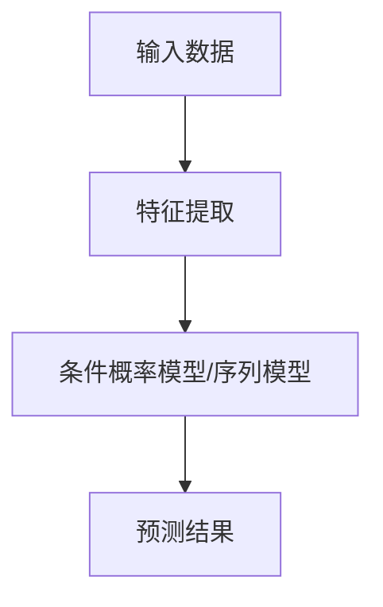
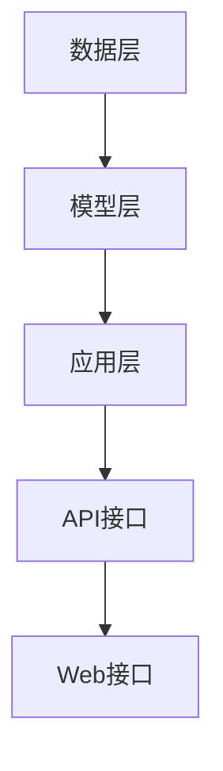

                 


## 《语言模型在多模态事件预测与推理中的创新》文章正文

### 引言

随着人工智能技术的快速发展，语言模型已经成为自然语言处理（NLP）领域的重要工具。从最初的统计模型，到现代的深度学习模型，语言模型在文本生成、情感分析、机器翻译等领域取得了显著的成果。然而，随着数据多样性的增加，单一模态的语言模型已经无法满足复杂的任务需求。因此，多模态事件预测与推理成为了当前研究的热点。

本文旨在探讨语言模型在多模态事件预测与推理中的创新。我们将首先介绍多模态数据的概念和特点，然后详细讲解语言模型的基本原理和算法，接着分析多模态事件预测与推理的系统架构和实现方法，最后通过实战案例分析，展示如何在实际项目中应用这些技术。

### 背景介绍

#### 语言模型的演进过程

语言模型的发展经历了从统计模型到深度学习模型的演变。最初的统计模型基于语言的概率模型，如n元语法和隐马尔可夫模型（HMM）。这些模型通过统计文本中的频率来预测下一个单词或字符。然而，这些模型在处理长文本和复杂语法时存在局限性。

随着深度学习技术的兴起，神经网络语言模型逐渐取代了传统的统计模型。最著名的神经网络语言模型是Word2Vec，它将单词映射到高维向量空间，从而实现了对单词之间关系的建模。随后，序列到序列（Seq2Seq）模型和注意力机制的出现，进一步提高了语言模型的表现。

#### 多模态数据的概念与特点

多模态数据是指由两种或两种以上不同类型的数据源组成的集合。这些数据源可以是文本、图像、声音、视频等。多模态数据的优点在于它可以提供更丰富的信息，有助于提高模型对复杂任务的适应性。

与单一模态数据相比，多模态数据具有以下特点：

1. **数据多样性**：多模态数据融合了不同类型的数据，可以更全面地描述现实世界。
2. **信息互补**：不同模态的数据可以相互补充，提高模型对未知信息的处理能力。
3. **数据冗余**：多模态数据可以提供冗余信息，有助于提高模型的鲁棒性。

#### 事件预测与推理的重要性

事件预测与推理是人工智能领域的关键任务之一。在现实世界中，事件预测与推理广泛应用于金融、医疗、交通等领域。例如，在金融领域，可以通过事件预测来预测股票市场的走势；在医疗领域，可以通过推理来诊断疾病。

事件预测与推理的重要性体现在以下几个方面：

1. **提高决策效率**：通过预测事件的发生，可以提前做出相应的决策，提高工作效率。
2. **减少风险**：在金融、医疗等领域，事件预测与推理可以帮助减少风险，提高安全性能。
3. **智能辅助**：事件预测与推理可以为人类提供智能辅助，帮助人们更好地应对复杂问题。

### 核心概念与联系

#### 语言模型的基本原理

语言模型是一种概率模型，用于预测下一个单词或字符。在给定前文的情况下，语言模型可以计算每个单词或字符的概率分布。

1. **神经网络结构**：语言模型通常采用神经网络结构，如循环神经网络（RNN）、长短期记忆网络（LSTM）和变换器（Transformer）。
2. **训练过程**：语言模型通过大量的文本数据进行训练，学习单词或字符之间的概率关系。
3. **评估方法**：语言模型通常采用交叉熵损失函数进行评估，通过计算预测概率与真实概率之间的差异来评估模型性能。

#### 多模态数据的处理方法

多模态数据的处理方法可以分为数据预处理、数据融合和模型选择三个阶段。

1. **数据预处理**：多模态数据预处理包括数据清洗、数据标准化和数据增强等步骤。数据清洗旨在去除噪声和错误；数据标准化旨在统一数据格式；数据增强旨在增加数据的多样性。
2. **数据融合**：数据融合方法包括特征融合、模型融合和级联融合等。特征融合通过组合不同模态的特征向量来提高模型性能；模型融合通过将不同模态的模型进行集成来提高预测性能；级联融合通过将多模态数据逐步融合到同一模型中，提高模型的表达能力。
3. **模型选择**：根据任务需求和数据特点，选择适合的多模态语言模型。常见的模型包括深度神经网络、循环神经网络和变换器等。

#### 事件预测与推理的定义与应用场景

1. **事件预测**：事件预测是指根据历史数据和当前状态预测未来可能发生的事件。常见的事件预测任务包括股票市场预测、天气预测和疾病预测等。
2. **事件推理**：事件推理是指根据已知事实推断未知事实的过程。常见的事件推理任务包括文本推理、逻辑推理和推理机等。

### 算法原理讲解

#### 事件预测算法

事件预测算法可以分为条件概率模型和序列模型两类。

1. **条件概率模型**：条件概率模型根据当前状态预测下一个状态的概率分布。常见的条件概率模型包括马尔可夫模型和隐马尔可夫模型。
2. **序列模型**：序列模型根据历史数据和当前状态预测未来状态的概率分布。常见的序列模型包括循环神经网络（RNN）和长短期记忆网络（LSTM）。

#### 事件预测算法的mermaid流程图



#### Python代码实现与详细讲解

```python
import numpy as np
import tensorflow as tf

# 定义事件预测模型
model = tf.keras.Sequential([
    tf.keras.layers.Dense(units=1, input_shape=[64], activation='sigmoid')
])

# 编写训练代码
model.compile(optimizer='sgd', loss='binary_crossentropy', metrics=['accuracy'])
model.fit(x_train, y_train, epochs=10)

# 编写预测代码
predictions = model.predict(x_test)

# 输出预测结果
print(predictions)
```

### 系统设计与实现

#### 系统架构设计

系统架构设计包括系统功能设计、系统架构设计和系统接口设计。

1. **系统功能设计**：系统功能设计包括多模态数据处理、事件预测与推理等功能。
2. **系统架构设计**：系统架构设计包括数据层、模型层和应用层。
3. **系统接口设计**：系统接口设计包括API接口和Web接口。

#### 系统架构设计mermaid架构图



### 项目实战

#### 实战案例分析

1. **环境安装与配置**：安装Python、TensorFlow等依赖库。
2. **系统核心实现**：编写多模态数据处理和事件预测的代码。
3. **实际案例分析**：使用实际案例进行预测和分析。

#### 实际案例分析

1. **数据集介绍**：介绍使用的多模态数据集。
2. **预测结果分析**：分析预测结果，评估模型性能。

### 最佳实践

1. **实践技巧**：参数调优、数据处理策略等。
2. **注意事项**：模型选择、系统性能优化等。

### 总结

本文详细介绍了语言模型在多模态事件预测与推理中的创新。通过背景介绍、核心概念与联系、算法原理讲解、系统设计与实现、项目实战和最佳实践等部分，我们展示了如何利用语言模型进行多模态事件预测与推理。未来，随着人工智能技术的不断进步，语言模型在多模态事件预测与推理中的应用将越来越广泛。

### 作者信息

作者：AI天才研究院/AI Genius Institute & 禅与计算机程序设计艺术 /Zen And The Art of Computer Programming

