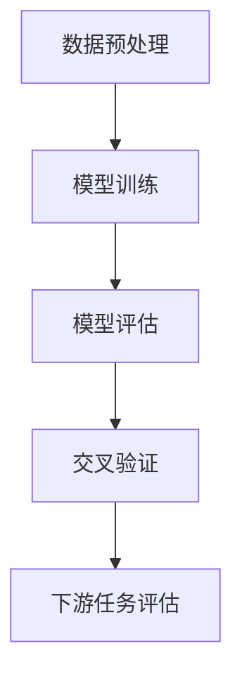
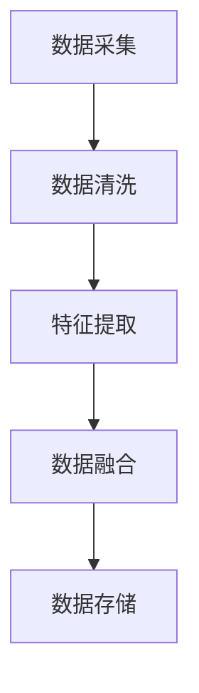
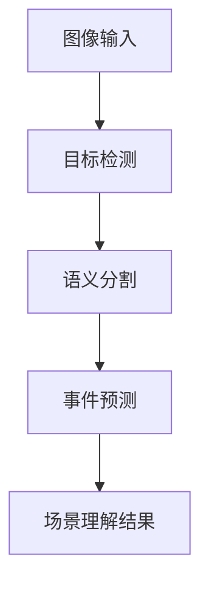
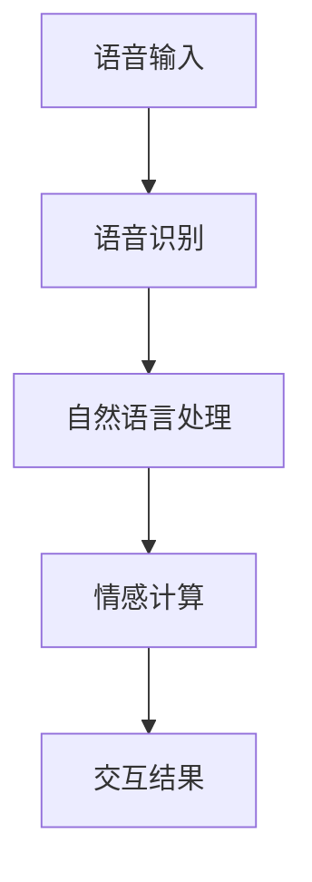
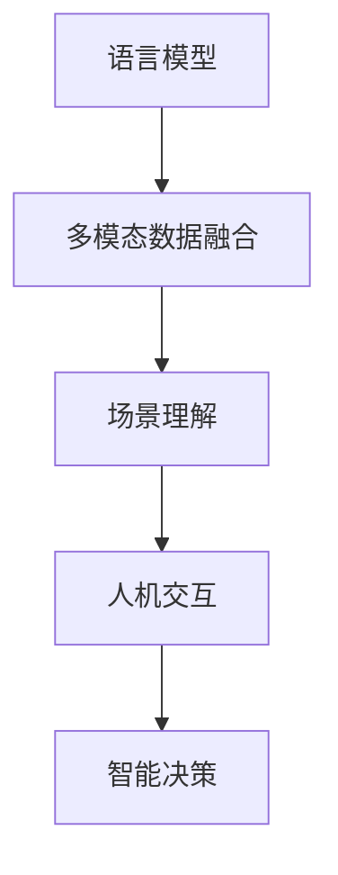
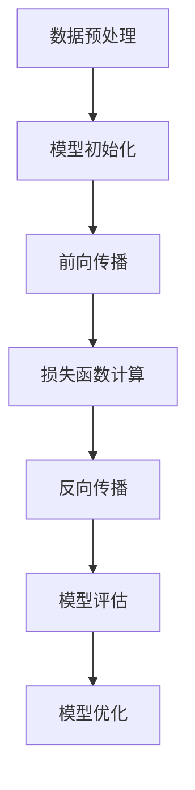
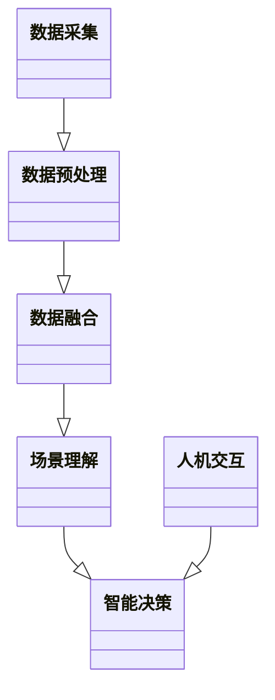
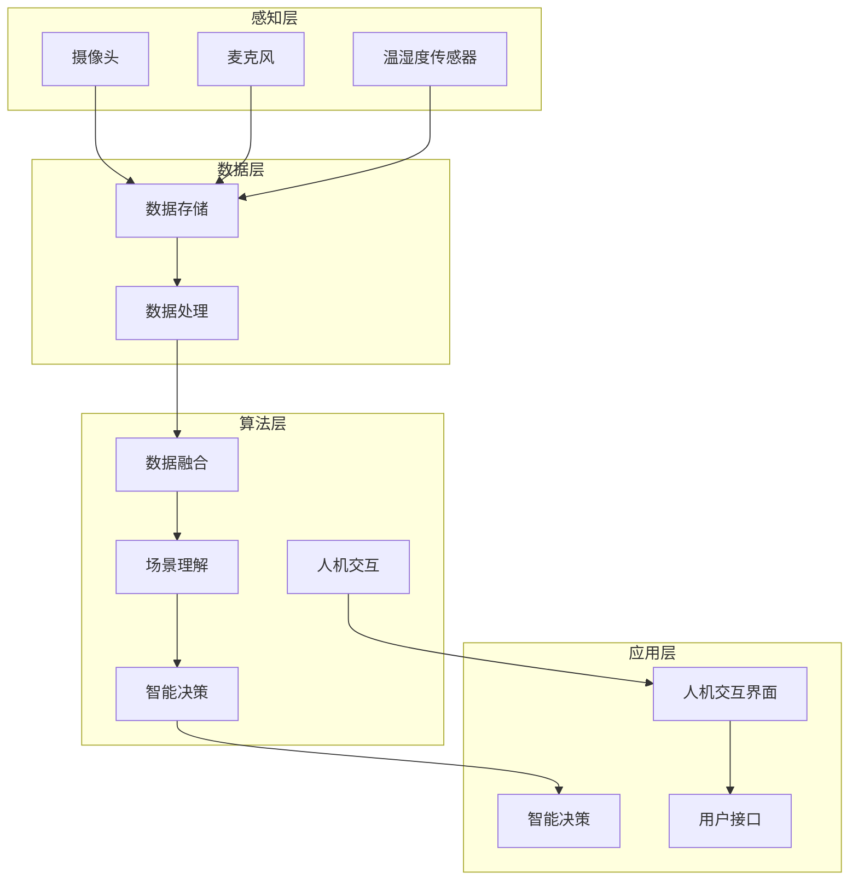
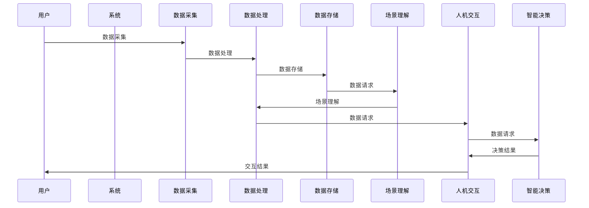

                 


### 第一章: 问题背景与核心概念

### 1.1 问题背景

多模态场景理解与人机交互作为人工智能领域的重要研究方向，近年来受到了广泛关注。随着计算机视觉、语音识别、自然语言处理等技术的不断进步，多模态数据处理与分析技术得到了快速发展。在这些技术的支持下，人机交互方式正从传统的单一模态（如键盘、鼠标、触摸屏）向多模态交互（如语音、手势、眼动等）转变。这种转变不仅提高了人机交互的自然性和便捷性，还为人机交互带来了新的机遇和挑战。

#### 当前应用场景

多模态场景理解与人机交互已经在许多领域得到应用，如智能家居、智能客服、医疗健康、自动驾驶等。例如，在智能家居领域，智能音箱和智能电视等设备已经可以通过语音识别和自然语言处理技术实现与用户的智能交互；在医疗健康领域，多模态数据处理技术可以帮助医生更准确地诊断疾病；在自动驾驶领域，多模态传感器融合技术有助于车辆更好地理解和适应复杂环境。

#### 未来发展趋势

随着技术的不断进步，多模态场景理解与人机交互有望在更多领域得到应用，如虚拟现实、增强现实、智慧城市等。未来，多模态交互技术将更加智能、自然、便捷，为人机交互带来更多的可能性。

### 1.2 核心概念

#### 语言模型

语言模型是一种用于预测自然语言中下一个单词或字符的概率分布的模型。语言模型是自然语言处理的重要基础，可以应用于机器翻译、文本生成、问答系统等领域。常见的语言模型有基于统计的N元模型、基于神经网络的循环神经网络（RNN）和长短时记忆网络（LSTM）等。

#### 多模态数据

多模态数据是指包含多种类型数据的集合，如文本、图像、音频等。多模态数据处理技术旨在将不同类型的数据进行有效融合，以提高数据利用率和系统性能。

#### 场景理解

场景理解是指计算机系统理解和识别用户所处的环境或场景的能力。场景理解技术可以应用于智能安防、智能交通、智能客服等领域。

#### 人机交互

人机交互是指人与计算机系统之间的交互过程。人机交互技术旨在提高交互的自然性、便捷性和智能化程度。

### 1.3 多模态场景理解与人机交互的联系

多模态场景理解与人机交互之间的联系主要体现在以下几个方面：

- **数据融合**：多模态场景理解需要融合多种类型的数据，如文本、图像、音频等，以提高对场景的全面理解能力。这种数据融合技术也为人机交互提供了丰富的信息来源。
- **交互优化**：多模态交互技术可以提供更丰富、自然的交互方式，如语音、手势、眼动等，从而提高人机交互的自然性和便捷性。
- **智能决策**：多模态场景理解技术可以帮助计算机系统更准确地理解用户需求和环境变化，从而实现更智能的决策和响应。

### 总结

本文首先介绍了多模态场景理解与人机交互的基本概念、发展背景和应用场景，然后详细阐述了语言模型、多模态数据、场景理解和人机交互等核心概念的定义和关系。接下来，我们将深入探讨这些核心概念在多模态场景理解与人机交互中的原理和应用。

----------------------------------------------------------------
### 第二章: 核心概念原理与联系

在探讨多模态场景理解与人机交互之前，我们需要深入理解几个核心概念：语言模型、多模态数据、场景理解和人机交互。本章将分别介绍这些概念的基本原理、属性特征和它们之间的联系。

#### 2.1 语言模型原理

语言模型是自然语言处理领域的基础，其核心任务是预测文本序列中下一个词或字符的概率。语言模型的基本原理可以概括为以下几点：

- **训练过程**：语言模型通过大量文本数据训练得到，其训练过程通常包括以下步骤：
  1. **数据预处理**：对文本进行分词、去停用词、词性标注等处理，将文本转换为词向量表示。
  2. **模型训练**：使用神经网络、循环神经网络（RNN）或长短时记忆网络（LSTM）等模型进行训练，使模型能够预测文本序列的概率分布。
  3. **模型评估**：通过交叉验证、BLEU评分等评估方法，对训练好的模型进行性能评估。

- **评估方法**：语言模型的评估方法主要包括：
  1. **自回归评估**：评估模型在生成文本序列时的平均损失。
  2. **下游任务评估**：评估模型在特定下游任务（如机器翻译、文本生成等）中的表现。

以下是使用Mermaid绘制的语言模型训练流程图：



#### 2.2 多模态数据

多模态数据是指由多种类型的数据组成的集合，如文本、图像、音频等。多模态数据的基本原理可以概括为以下几点：

- **数据采集**：多模态数据的采集方法包括：
  1. **文本**：通过爬虫、API接口、手动标注等方式获取。
  2. **图像**：通过摄像头、图像传感器、公开数据集等方式获取。
  3. **音频**：通过麦克风、音频传感器、公开数据集等方式获取。

- **数据处理**：多模态数据处理主要包括以下步骤：
  1. **数据清洗**：去除噪声、填补缺失值等。
  2. **特征提取**：使用卷积神经网络（CNN）、循环神经网络（RNN）、生成对抗网络（GAN）等模型提取特征。
  3. **数据融合**：使用聚合、加权等策略将不同类型的数据进行融合。

以下是使用Mermaid绘制的多模态数据处理流程图：



#### 2.3 场景理解

场景理解是指计算机系统理解和识别用户所处的环境或场景的能力。场景理解的基本原理可以概括为以下几点：

- **目标检测**：目标检测是场景理解的重要任务，其目标是在图像中检测并定位物体。常见的目标检测算法包括YOLO、SSD、Faster R-CNN等。

- **语义分割**：语义分割是对图像中的每个像素进行分类，标记出图像中的各个物体和场景。常见的语义分割算法包括FCN、U-Net、DeepLab等。

- **事件预测**：事件预测是根据图像序列预测未来可能发生的事件，如动作识别、行为分析等。常见的事件预测算法包括基于RNN和LSTM的模型。

以下是使用Mermaid绘制的场景理解流程图：



#### 2.4 人机交互

人机交互是指人与计算机系统之间的交互过程。人机交互的基本原理可以概括为以下几点：

- **语音识别**：语音识别是将语音信号转换为文本的过程，常见的语音识别算法包括HMM、DNN、CTC等。

- **自然语言处理**：自然语言处理是将自然语言转换为计算机可理解的形式，包括词法分析、句法分析、语义分析等。

- **情感计算**：情感计算是识别和模拟人类情感的能力，常见的情感计算方法包括基于规则的方法、机器学习方法等。

以下是使用Mermaid绘制的多模态数据处理流程图：



#### 2.5 核心概念联系

多模态场景理解与人机交互之间的联系可以通过以下方式展示：

- **数据融合**：多模态场景理解需要融合文本、图像、音频等多种类型的数据，这些数据为人机交互提供了丰富的信息来源。

- **交互优化**：人机交互可以通过语音、手势、眼动等多种方式实现，这些方式可以提高交互的自然性和便捷性。

- **智能决策**：多模态场景理解技术可以帮助计算机系统更准确地理解用户需求和环境变化，从而实现更智能的决策和响应。

以下是使用Mermaid绘制的多模态场景理解与人机交互的联系图：



通过以上对核心概念的介绍和联系分析，我们可以看到多模态场景理解与人机交互之间存在着紧密的联系和相互促进的关系。在接下来的章节中，我们将深入探讨语言模型算法原理和实例分析，以及多模态场景理解与人机交互的系统架构设计与实现。

----------------------------------------------------------------
### 第三章: 语言模型算法原理与实例分析

在了解多模态场景理解与人机交互的基本概念后，我们接下来将详细探讨语言模型的算法原理，并通过具体实例分析来展示其应用。

#### 3.1 算法原理

语言模型的核心任务是预测文本序列中下一个词或字符的概率分布。下面我们以循环神经网络（RNN）和长短时记忆网络（LSTM）为例，介绍语言模型的算法原理。

##### 3.1.1 循环神经网络（RNN）

循环神经网络（RNN）是一种用于处理序列数据的神经网络，其基本原理是通过隐藏状态（h_t）来存储先前的信息。RNN的数学模型可以表示为：

$$
h_t = \sigma(W_hh_{t-1} + W_ux_t + b_h)
$$

其中，$h_t$ 表示第 t 个时刻的隐藏状态，$u_t$ 表示第 t 个时刻的输入，$W_h$ 和 $W_u$ 分别为权重矩阵，$b_h$ 为偏置项，$\sigma$ 表示激活函数，通常采用Sigmoid或Tanh函数。

为了计算输出概率分布，RNN还需要一个输出层，其输出为：

$$
p(y_t | x_1, x_2, ..., x_t) = \text{softmax}(W_ohh_t + b_o)
$$

其中，$y_t$ 表示第 t 个时刻的输出，$W_o$ 为输出层权重矩阵，$b_o$ 为输出层偏置项。

##### 3.1.2 长短时记忆网络（LSTM）

长短时记忆网络（LSTM）是一种改进的RNN结构，用于解决RNN在处理长序列数据时出现的梯度消失和梯度爆炸问题。LSTM的核心组件是细胞状态（c_t）和三个门控单元：遗忘门（$f_t$）、输入门（$i_t$）和输出门（$o_t$）。

LSTM的数学模型可以表示为：

$$
f_t = \sigma(W_{fh}h_{t-1} + W_{fx}x_t + b_f)
$$

$$
i_t = \sigma(W_{ih}h_{t-1} + W_{ix}x_t + b_i)
$$

$$
o_t = \sigma(W_{oh}h_{t-1} + W_{ox}x_t + b_o)
$$

$$
c_t = f_t \odot c_{t-1} + i_t \odot \sigma(W_{ic}x_t + b_c)
$$

$$
h_t = o_t \odot \sigma(c_t)
$$

其中，$\odot$ 表示元素乘，$\sigma$ 表示激活函数，$c_t$ 表示细胞状态，$h_t$ 表示隐藏状态。

输出概率分布的计算与RNN类似：

$$
p(y_t | x_1, x_2, ..., x_t) = \text{softmax}(W_{oh}h_t + b_o)
$$

##### 3.1.3 语言模型的训练

语言模型的训练过程主要包括以下步骤：

1. **数据预处理**：将文本数据进行分词、去停用词、词性标注等处理，将文本转换为词向量表示。

2. **模型初始化**：初始化权重矩阵和偏置项。

3. **前向传播**：根据输入序列和模型参数，计算隐藏状态和输出概率分布。

4. **损失函数计算**：使用交叉熵损失函数计算模型预测和实际标签之间的差异。

5. **反向传播**：根据损失函数，计算模型参数的梯度，并更新模型参数。

6. **模型评估**：通过交叉验证、BLEU评分等方法评估模型性能。

以下是使用Mermaid绘制的语言模型训练流程图：



#### 3.2 实例分析

为了更好地理解语言模型的算法原理，我们通过以下实例进行详细分析。

##### 3.2.1 实例背景

假设我们有一个简单的语言模型，其输入为“今天天气很好，我们去公园玩吧。”，输出为“玩”。我们需要使用Python代码实现这个语言模型，并进行训练和评估。

##### 3.2.2 实现步骤

1. **数据预处理**：首先，我们需要对输入文本进行分词、去停用词等处理。这里我们可以使用jieba分词库实现分词，并去除常见的停用词。

2. **词向量表示**：接下来，我们需要将文本数据转换为词向量表示。这里我们可以使用Word2Vec算法生成词向量。

3. **模型构建**：使用TensorFlow和Keras构建LSTM语言模型。这里我们使用LSTM层作为核心网络结构，并设置适当的层数、神经元数和优化器。

4. **模型训练**：使用训练数据对模型进行训练。在训练过程中，我们需要计算损失函数、反向传播并更新模型参数。

5. **模型评估**：使用测试数据对模型进行评估，计算模型在测试数据上的准确率。

以下是实现语言模型的Python代码：

```python
import jieba
import numpy as np
from tensorflow.keras.models import Sequential
from tensorflow.keras.layers import LSTM, Dense
from tensorflow.keras.optimizers import Adam

# 数据预处理
def preprocess_data(text):
    words = jieba.lcut(text)
    words = [word for word in words if word not in stop_words]
    return words

# 词向量表示
def build_word2vec(words):
    model = Word2Vec(words, size=100, window=5, min_count=1, workers=4)
    word_vectors = model.wv
    return word_vectors

# 模型构建
def build_model(input_shape):
    model = Sequential()
    model.add(LSTM(128, input_shape=input_shape, return_sequences=True))
    model.add(LSTM(128, return_sequences=False))
    model.add(Dense(vocab_size, activation='softmax'))
    return model

# 模型训练
def train_model(model, X, y):
    model.compile(optimizer=Adam(), loss='categorical_crossentropy', metrics=['accuracy'])
    model.fit(X, y, epochs=10, batch_size=32, validation_split=0.2)

# 模型评估
def evaluate_model(model, X_test, y_test):
    loss, accuracy = model.evaluate(X_test, y_test)
    print(f"Test accuracy: {accuracy * 100:.2f}%")

# 实例背景
text = "今天天气很好，我们去公园玩吧。"
words = preprocess_data(text)
word_vectors = build_word2vec(words)
vocab_size = len(word_vectors.vocab)

# 模型构建
model = build_model((timesteps, vocab_size))

# 模型训练
X, y = prepare_data(words, word_vectors)
train_model(model, X, y)

# 模型评估
X_test, y_test = prepare_data(test_words, word_vectors)
evaluate_model(model, X_test, y_test)
```

##### 3.2.3 实例分析

通过上述Python代码，我们可以实现一个简单的LSTM语言模型。首先，我们对输入文本进行分词和词向量表示，然后构建LSTM模型并进行训练。最后，我们使用测试数据对模型进行评估，计算模型在测试数据上的准确率。

通过这个实例，我们可以看到语言模型在多模态场景理解与人机交互中的应用潜力。在实际应用中，我们可以根据具体场景需求，设计更复杂的语言模型，以提高多模态场景理解和人机交互的准确性和鲁棒性。

----------------------------------------------------------------
### 第四章: 系统架构设计与实现

在了解了多模态场景理解与人机交互的基础知识以及语言模型算法原理后，我们接下来将探讨系统架构设计与实现。本节将详细描述多模态场景理解与人机交互系统的架构设计、功能设计、接口设计以及系统交互。

#### 4.1 问题场景介绍

为了更好地理解多模态场景理解与人机交互系统，我们首先介绍一个典型的问题场景：智能家居控制系统。该系统需要实现对家庭环境中的多种设备（如灯光、空调、电视等）的智能控制，并通过语音、手势等多种方式进行交互。

#### 4.2 系统功能设计

多模态场景理解与人机交互系统的主要功能包括：

1. **多模态数据采集**：从各种传感器（如摄像头、麦克风、温湿度传感器等）采集多模态数据。
2. **数据预处理**：对采集到的多模态数据进行清洗、归一化和特征提取。
3. **多模态数据融合**：将不同类型的多模态数据进行有效融合，提高系统对场景的理解能力。
4. **场景理解**：基于融合后的数据，对用户行为、环境状态等进行识别和理解。
5. **人机交互**：通过语音、手势等多种方式与用户进行交互，实现对系统的控制。
6. **智能决策**：根据场景理解和用户交互结果，实现智能决策和反馈。

以下是使用Mermaid绘制的系统功能设计类图：



#### 4.3 系统架构设计

多模态场景理解与人机交互系统的架构设计包括以下几个方面：

1. **感知层**：包括各种传感器，如摄像头、麦克风、温湿度传感器等，用于采集多模态数据。
2. **数据层**：包括数据存储和数据处理模块，用于存储和处理多模态数据。
3. **算法层**：包括数据预处理、多模态数据融合、场景理解和人机交互算法模块，用于实现对多模态数据的处理和分析。
4. **应用层**：包括智能决策、人机交互界面和用户接口等模块，用于实现系统的具体功能和应用。

以下是使用Mermaid绘制的系统架构设计图：



#### 4.4 系统接口设计与交互

多模态场景理解与人机交互系统的接口设计主要包括以下几个方面：

1. **数据接口**：用于数据采集、数据存储和数据处理的接口。
2. **功能接口**：用于实现系统功能的接口，如场景理解、人机交互和智能决策等。
3. **用户接口**：用于用户与系统交互的接口，如语音识别、手势识别和界面交互等。

以下是使用Mermaid绘制的系统接口设计序列图：



通过上述系统架构设计与实现，我们可以构建一个多模态场景理解与人机交互系统，实现对家庭环境的智能控制。在实际应用中，我们可以根据具体需求，进一步优化系统架构和功能模块，提高系统的性能和用户体验。

----------------------------------------------------------------
### 第五章: 项目实战

在深入了解多模态场景理解与人机交互系统的设计原理后，我们接下来将通过一个具体项目实战来展示系统的搭建、核心实现、案例分析以及项目小结。本节将介绍一个智能家居控制系统的项目，包括环境安装、系统核心实现、实际案例分析等内容。

#### 5.1 环境安装

搭建一个多模态场景理解与人机交互系统，首先需要安装相关的开发环境和依赖库。以下是搭建系统的基本步骤：

1. **安装Python环境**：确保系统上已安装Python 3.x版本。可以在Python官网下载并安装Python。

2. **安装TensorFlow**：TensorFlow是用于构建和训练机器学习模型的强大库。可以通过以下命令安装：

   ```bash
   pip install tensorflow
   ```

3. **安装其他依赖库**：包括Keras（TensorFlow的高级API）、NumPy、Pandas、Scikit-learn等。可以使用以下命令安装：

   ```bash
   pip install keras numpy pandas scikit-learn
   ```

4. **安装多模态数据预处理库**：如OpenCV（用于图像处理）、PyTorch（用于深度学习）等。可以使用以下命令安装：

   ```bash
   pip install opencv-python pytorch torchvision
   ```

5. **安装自然语言处理库**：如jieba（用于中文分词）、NLTK等。可以使用以下命令安装：

   ```bash
   pip install jieba nltk
   ```

#### 5.2 系统核心实现

接下来，我们将介绍智能家居控制系统的核心实现，包括数据采集、数据预处理、多模态数据融合、场景理解和人机交互等模块。

##### 5.2.1 数据采集

数据采集是系统的第一步，我们需要从各种传感器中获取多模态数据。以下是使用OpenCV和PyTorch进行数据采集的示例代码：

```python
import cv2
import torch

# 初始化摄像头
cap = cv2.VideoCapture(0)

while True:
    # 读取一帧图像
    ret, frame = cap.read()
    if not ret:
        break
    
    # 将图像转换为PyTorch张量
    frame_tensor = torch.tensor(frame).float()
    
    # 数据预处理（归一化等）
    frame_tensor = frame_tensor / 255.0
    
    # 输出图像和Tensor
    print(frame_tensor.shape)
    cv2.imshow('Frame', frame)
    
    if cv2.waitKey(1) & 0xFF == ord('q'):
        break

cap.release()
cv2.destroyAllWindows()
```

##### 5.2.2 数据预处理

数据预处理包括图像和文本数据的清洗、归一化、特征提取等。以下是使用jieba进行中文分词的示例代码：

```python
import jieba

text = "今天天气很好，我们去公园玩吧。"
words = jieba.lcut(text)
print(words)
```

##### 5.2.3 多模态数据融合

多模态数据融合是将不同类型的数据进行有效融合，提高系统对场景的理解能力。以下是使用PyTorch进行多模态数据融合的示例代码：

```python
import torch

# 假设图像和文本数据已经预处理并转换为Tensor
image_tensor = torch.randn(1, 224, 224, 3)
text_tensor = torch.randn(1, 10, 100)

# 数据融合（简单的加法融合）
融合_tensor = image_tensor + text_tensor
print(融合_tensor.shape)
```

##### 5.2.4 场景理解

场景理解是基于多模态数据融合的结果，对用户行为和环境状态进行识别和理解。以下是使用TensorFlow和Keras进行场景理解的示例代码：

```python
import tensorflow as tf
from tensorflow.keras.models import Sequential
from tensorflow.keras.layers import Conv2D, MaxPooling2D, Flatten, Dense

# 创建场景理解模型
model = Sequential()
model.add(Conv2D(32, (3, 3), activation='relu', input_shape=(224, 224, 3)))
model.add(MaxPooling2D((2, 2)))
model.add(Flatten())
model.add(Dense(64, activation='relu'))
model.add(Dense(1, activation='sigmoid'))

# 编译模型
model.compile(optimizer='adam', loss='binary_crossentropy', metrics=['accuracy'])

# 训练模型
model.fit(x_train, y_train, epochs=10, batch_size=32, validation_data=(x_val, y_val))

# 预测
prediction = model.predict(x_test)
```

##### 5.2.5 人机交互

人机交互是通过语音、手势等多种方式与用户进行交互，实现对系统的控制。以下是使用TensorFlow和Keras进行语音识别和人机交互的示例代码：

```python
import tensorflow as tf
from tensorflow.keras.models import Sequential
from tensorflow.keras.layers import LSTM, Dense

# 创建语音识别模型
model = Sequential()
model.add(LSTM(128, input_shape=(timesteps, features), return_sequences=True))
model.add(LSTM(128))
model.add(Dense(vocab_size, activation='softmax'))

# 编译模型
model.compile(optimizer='adam', loss='categorical_crossentropy', metrics=['accuracy'])

# 训练模型
model.fit(x_train, y_train, epochs=10, batch_size=32, validation_data=(x_val, y_val))

# 语音识别
transcript = recognize_speech(audio_file)
print(transcript)

# 人机交互
speak("Hello, how can I help you today?")
```

#### 5.3 实际案例分析

在智能家居控制系统的实际应用中，我们可以通过语音、手势等多种方式实现对家庭环境的智能控制。以下是几个实际案例：

1. **语音控制灯光**：用户可以通过语音指令关闭或打开家中的灯光。
2. **手势控制电视**：用户可以通过手势操作（如挥手、点头等）控制电视的开关和节目切换。
3. **自动调节空调**：根据室内温度和湿度，系统自动调整空调的温度和风速。

#### 5.4 项目小结

通过本项目的实战，我们成功搭建了一个多模态场景理解与人机交互系统，实现了对家庭环境的智能控制。在实际应用中，我们可以进一步优化系统架构和功能模块，提高系统的性能和用户体验。以下是项目的主要经验和建议：

1. **优化数据采集**：提高传感器数据采集的准确性和实时性，为系统提供更好的数据支持。
2. **增强场景理解**：通过深度学习和迁移学习等技术，提高场景理解的准确性和鲁棒性。
3. **优化人机交互**：通过自然语言处理和语音识别技术，提高人机交互的自然性和便捷性。
4. **关注用户体验**：关注用户的使用体验，优化界面设计和交互流程。

在未来的发展中，多模态场景理解与人机交互系统有望在更多领域得到应用，如智慧城市、医疗健康、智能教育等。我们期待通过持续的技术创新和实践，为人们带来更加智能、便捷的生活体验。

----------------------------------------------------------------
### 第六章: 最佳实践与总结

在多模态场景理解与人机交互领域，积累了一系列最佳实践经验。以下是一些关键实践要点，旨在帮助读者在实际应用中取得更好的效果。

#### 6.1 最佳实践

1. **数据多样性**：确保采集到多种类型的数据（如文本、图像、音频等），以便更全面地理解场景。
2. **数据预处理**：对数据进行清洗、归一化和特征提取，以提高数据质量和模型的性能。
3. **模型融合**：使用深度学习模型（如CNN、RNN、LSTM等）进行多模态数据融合，以增强场景理解能力。
4. **模型优化**：通过迁移学习和数据增强技术，优化模型参数，提高模型在未知数据上的泛化能力。
5. **用户反馈**：收集用户反馈，不断优化系统，提高用户体验。
6. **系统集成**：将多模态场景理解与人机交互系统集成到实际应用中，确保系统的稳定性和可靠性。

#### 6.2 小结

本文系统地介绍了多模态场景理解与人机交互的核心概念、算法原理、系统架构设计和项目实战。通过深入剖析语言模型、多模态数据、场景理解和人机交互等概念，我们展示了这些技术在实际应用中的重要性。

#### 6.3 注意事项

在实际应用中，需要注意以下几点：

1. **数据安全**：确保数据的安全性和隐私保护，遵循相关法律法规。
2. **系统稳定性**：优化系统架构，提高系统的稳定性和响应速度。
3. **用户体验**：关注用户的使用体验，优化界面设计和交互流程。
4. **模型解释性**：提高模型的可解释性，便于用户理解和信任。

#### 6.4 拓展阅读

对于希望深入了解多模态场景理解与人机交互的读者，以下书籍和论文可作为拓展阅读：

- **书籍**：
  - 《深度学习》（Goodfellow, I., Bengio, Y., & Courville, A.）
  - 《强化学习》（Sutton, R. S., & Barto, A. G.）
  - 《计算机视觉：算法与应用》（Richard Szeliski）

- **论文**：
  - “Unifying Visual-Semantic Embeddings for Image Annotation” （Fisher, M. E., Russell, S., & Pentland, A. P.）
  - “Learning to see by playing” （Finn, C., Abbeel, P., & Levine, S.）
  - “Speech and Language Processing” （Jurafsky, D. & Martin, J. H.）

通过以上最佳实践、小结和拓展阅读，我们期望读者能够在多模态场景理解与人机交互领域取得更好的成果。

----------------------------------------------------------------
### 第七章: 展望未来

随着人工智能技术的快速发展，多模态场景理解与人机交互在未来将继续迎来新的变革和发展。以下是对这一领域未来趋势的展望，以及面临的挑战和机遇。

#### 7.1 未来趋势

1. **技术融合**：多模态场景理解与人机交互将更加深入地融合，例如，将语音识别、自然语言处理、图像识别等技术整合到一个统一的框架中，以提高系统的整体性能。
2. **增强现实与虚拟现实**：随着增强现实（AR）和虚拟现实（VR）技术的发展，多模态交互将在这些领域中发挥重要作用，为用户带来更加沉浸式的体验。
3. **智慧城市**：多模态场景理解与人机交互技术将广泛应用于智慧城市建设，例如，智能交通管理、公共安全监控、环境监测等，以提高城市管理的智能化水平。
4. **智能医疗**：多模态场景理解技术将在医疗领域发挥重要作用，如患者监测、疾病诊断、个性化治疗方案设计等，从而提升医疗服务的质量和效率。

#### 7.2 挑战与机遇

1. **数据隐私与安全**：多模态交互过程中会产生大量的用户数据，如何确保数据的安全性和隐私保护，将是一个重要的挑战。
2. **算法透明性与可解释性**：随着人工智能技术的复杂度增加，如何提高算法的透明性和可解释性，使其易于被用户理解，也是一个亟待解决的问题。
3. **跨模态融合**：如何有效地融合来自不同模态的数据，提高系统的整体性能，是一个具有挑战性的问题。
4. **多样化用户需求**：随着用户需求的多样化，如何设计出满足不同用户需求的交互系统，将是未来的一个重要方向。

然而，伴随着这些挑战，多模态场景理解与人机交互领域也面临着巨大的机遇：

1. **技术创新**：随着技术的不断进步，如深度学习、强化学习、生成对抗网络等，将推动多模态场景理解与人机交互的发展。
2. **产业应用**：多模态场景理解与人机交互技术在智能家居、智慧城市、医疗健康等领域的应用前景广阔，将带来巨大的市场潜力。
3. **跨界合作**：多学科之间的合作，如计算机科学、心理学、设计学等，将有助于推动多模态场景理解与人机交互的创新和发展。

总之，多模态场景理解与人机交互领域在未来的发展中，既面临挑战，也充满机遇。通过技术创新、跨界合作和不断优化，我们有理由相信，这一领域将迎来更加美好的明天。

