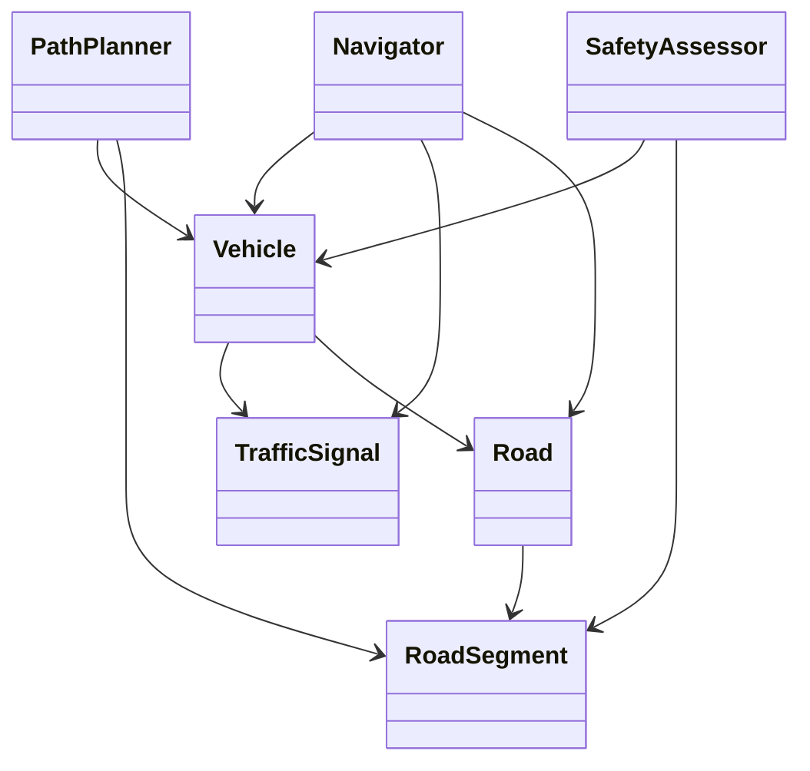
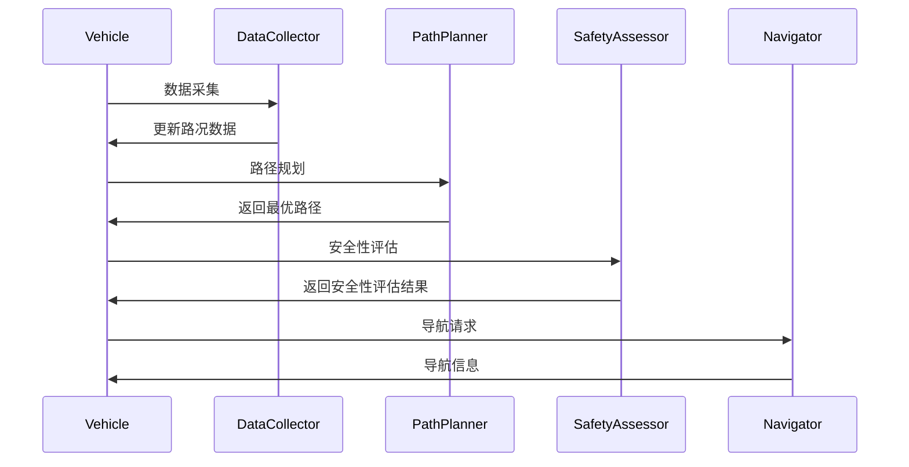
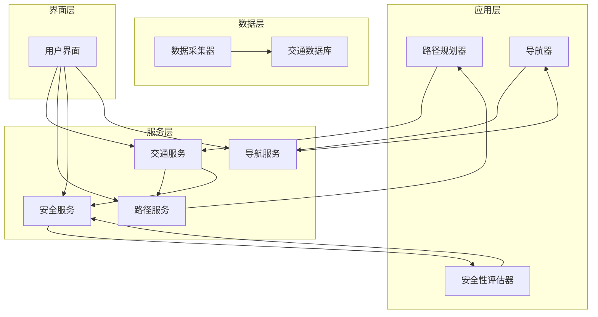
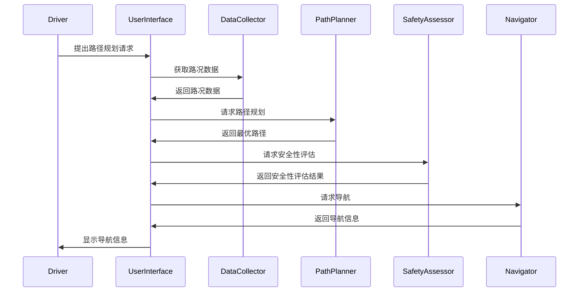

                 

### 第一部分：背景介绍

## 第1章：问题背景与定义

### 1.1 问题背景

多步骤规划任务在许多应用领域中都扮演着关键角色，如物流与配送、智能制造、自动驾驶和智能城市管理等。这些任务通常需要在不同步骤间进行协调和优化，以确保整体效率和成本效益。然而，多步骤规划任务面临诸多挑战，主要包括：

1. **步骤复杂性**：多步骤规划任务往往涉及多个决策步骤，每个步骤都可能包含大量的决策变量，使得任务复杂度急剧增加。
2. **不确定性**：在多步骤规划任务中，未来状态的不确定性可能显著影响决策，如天气变化、交通拥堵和设备故障等。
3. **交互依赖**：多个步骤之间的相互依赖关系增加了规划难度，一个步骤的决策可能影响到后续多个步骤的执行。

为了解决上述问题，研究人员和工程师们提出了各种多步骤规划算法，如动态规划、遗传算法和模拟退火等。然而，这些传统方法在处理复杂性和不确定性方面存在一定局限性。近年来，随着深度学习和自然语言处理技术的快速发展，语言模型作为一种强大的工具，开始在多步骤规划任务中展现出巨大的潜力。

### 1.2 核心概念

#### 多步骤规划任务定义

多步骤规划任务是指在一个时间序列内，通过对一系列决策步骤进行优化，以达到特定目标的过程。每个步骤都包含若干决策变量，并且这些决策变量之间存在一定的依赖关系。多步骤规划的核心目标是找到一系列最优决策，使得整体任务完成得更加高效和优化。

#### 语言模型

语言模型是一种统计模型，用于预测文本序列中的下一个词或字符。它通过学习大量文本数据，建立词语或字符之间的概率分布关系，从而能够进行文本生成、翻译和情感分析等任务。在多步骤规划任务中，语言模型可以用来处理任务的描述和生成，从而辅助决策过程。

### 1.3 关键要素

#### 多步骤规划任务的核心要素

1. **步骤**：多步骤规划任务中的基本单元，每个步骤都需要进行决策。
2. **决策变量**：每个步骤中的可变因素，用于定义和优化任务。
3. **依赖关系**：步骤间的相互依赖关系，影响决策的执行和结果。
4. **目标函数**：用于评估任务完成质量的指标，如时间、成本和资源利用率。

#### 语言模型的关键特性

1. **上下文感知**：语言模型能够捕捉到文本的上下文信息，从而做出更准确的预测。
2. **自适应能力**：语言模型可以根据新的数据不断更新和优化，以适应动态变化的环境。
3. **多模态处理**：语言模型可以处理包括文本、图像和声音等多种类型的数据，使得任务更加综合和智能化。

### 1.4 边界与外延

#### 多步骤规划与单步骤规划的差异

单步骤规划任务通常只涉及一个决策步骤，而多步骤规划任务则涉及多个步骤，每个步骤都可能包含多个决策变量。多步骤规划需要考虑不同步骤间的依赖关系和整体优化，而单步骤规划则仅关注单个步骤的最优决策。

#### 多步骤规划中的问题要素

多步骤规划中的问题要素包括：

1. **状态**：任务执行过程中的当前状态。
2. **动作**：每个步骤中可执行的决策。
3. **奖励**：每个动作执行后的即时反馈。
4. **价值函数**：评估当前状态和未来奖励的函数。

#### 概念结构与核心要素组成

多步骤规划任务和语言模型的核心概念和要素组成可以通过Mermaid ER实体关系图来表示，如下所示：

```mermaid
erDiagram
    State ||--o> Action : "action related to state"
    Action ||--o> Reward : "reward for action"
    State ||--o> ValueFunction : "evaluate state and future rewards"
    LanguageModel ||--|{ TextGenerator : "generate text from context" }
    TextGenerator ||--|> MultiStepPlanner : "plan multi-step tasks using generated text"
```

在这个ER图中，状态（State）、动作（Action）、奖励（Reward）和价值函数（ValueFunction）是多步骤规划任务的基本要素。语言模型（LanguageModel）通过文本生成器（TextGenerator）与多步骤规划器（MultiStepPlanner）相结合，为任务规划提供支持。

### 1.5 关键特性对比表格

为了更好地理解多步骤规划任务和语言模型的核心特性，我们可以通过一个对比表格来展示它们的主要区别：

| 特性       | 多步骤规划任务                   | 语言模型                   |
| ---------- | ------------------------------ | ------------------------- |
| 目标       | 最优化任务完成的质量和效率         | 预测和生成文本序列           |
| 决策结构   | 多个步骤的决策序列               | 单个步骤的文本生成           |
| 依赖关系   | 步骤间的相互依赖和协调           | 词语或字符间的概率分布关系   |
| 不确定性处理 | 通过概率模型和优化算法处理不确定性 | 通过上下文信息自适应处理不确定性 |
| 应用场景   | 物流、制造、自动驾驶等复杂系统规划 | 文本生成、翻译、情感分析等文本处理任务 |

通过这个表格，我们可以看出多步骤规划任务和语言模型在目标、决策结构、依赖关系、不确定性处理和应用场景等方面的显著差异。

### 1.6 ER实体关系图架构

为了进一步理解多步骤规划任务和语言模型之间的关联，我们可以通过一个ER实体关系图来展示它们的基本结构，如下所示：

```mermaid
erDiagram
    Task ||--|{ Step : "each step in the task" }
    Step ||--|> Action : "action performed in the step"
    Action ||--|> DecisionVariable : "variables that can be decided"
    DecisionVariable ||--|> Constraint : "constraints on the variable"
    Constraint ||--|> ObjectiveFunction : "evaluate the quality of the decision"
    ObjectiveFunction ||--|> LanguageModel : "optimize based on language model"
    LanguageModel ||--|> TextGenerator : "generate text for decision-making"
    TextGenerator ||--|> MultiStepPlanner : "plan tasks using generated text"
```

在这个ER图中，任务（Task）包含多个步骤（Step），每个步骤包含多个动作（Action），每个动作包含多个决策变量（DecisionVariable）。决策变量受到约束（Constraint）的影响，最终通过目标函数（ObjectiveFunction）进行评估。语言模型（LanguageModel）通过文本生成器（TextGenerator）为多步骤规划器（MultiStepPlanner）提供支持。

通过上述内容，我们为多步骤规划任务和语言模型的背景、定义、核心概念和联系、关键要素以及边界与外延提供了一个全面的介绍。接下来，我们将深入探讨语言模型的基础理论和算法原理，以便为后续的优化策略和系统设计提供理论支持。

## 第2章：语言模型基础

### 2.1 语言模型的定义

语言模型是一种用于预测自然语言序列的统计模型。它的基本目标是通过学习大量的文本数据，建立一个能够准确预测下一个词或字符的概率分布模型。语言模型在自然语言处理（NLP）领域扮演着至关重要的角色，广泛应用于文本生成、机器翻译、情感分析、语音识别等任务中。

语言模型的核心特点在于它能够捕捉文本中的上下文信息，从而提高预测的准确性。一个典型的语言模型通常包含以下几个主要组成部分：

1. **词汇表**：包含所有可能出现的词或字符。
2. **概率分布**：基于训练数据，为词汇表中的每个词或字符分配一个概率值。
3. **上下文感知机制**：通过考虑文本的上下文信息，调整概率分布，以提高预测的准确性。

### 2.2 语言模型的基本原理

语言模型的工作原理可以概括为以下几个步骤：

1. **数据收集**：收集大量具有代表性的文本数据，这些数据可以是书籍、新闻文章、社交媒体帖子等。
2. **文本预处理**：对收集到的文本进行预处理，包括分词、去停用词、词性标注等，以得到适合训练的文本表示。
3. **建模**：使用机器学习算法，如神经网络，训练一个语言模型。常见的语言模型包括循环神经网络（RNN）、长短时记忆网络（LSTM）和门控循环单元（GRU）。
4. **概率预测**：对于给定的输入文本序列，语言模型根据训练得到的概率分布，预测下一个词或字符。

### 2.3 语言模型的核心特点

1. **上下文感知**：语言模型能够根据上下文信息动态调整词或字符的概率分布，从而提高预测的准确性。例如，在“我昨天去了公园”的句子中，“昨天”后面的词很可能是“公园”，而不是其他无关词汇。
   
2. **自适应能力**：语言模型可以根据新的数据不断更新和优化，以适应不同的应用场景和需求。例如，在一个对话系统中，语言模型可以随着对话的进行，逐渐学习用户的偏好和意图。

3. **多模态处理**：语言模型不仅可以处理文本数据，还可以结合图像、声音等多种类型的数据，实现更加综合和智能化的任务。例如，在语音识别任务中，语言模型可以与语音特征结合，提高识别的准确性。

4. **高效性**：现代语言模型，如Transformer，具有极高的计算效率，能够在较短的时间内处理大量文本数据，从而满足实时应用的需求。

### 2.4 语言模型的常见类型

1. **基于统计的方法**：这种方法依赖于大量的训练数据，通过统计词频和共现关系来建立语言模型。常见的统计模型包括N元语法（N-gram）和隐马尔可夫模型（HMM）。

2. **基于规则的方法**：这种方法通过手动编写规则来描述语言模式，如正则表达式和语法分析器。虽然这种方法在处理特定类型的文本方面表现良好，但其泛化能力有限。

3. **基于神经网络的方法**：这种方法利用深度学习技术，通过多层神经网络来捕捉文本中的复杂关系。常见的神经网络模型包括循环神经网络（RNN）、长短时记忆网络（LSTM）和门控循环单元（GRU）。近年来，Transformer模型的兴起使得基于神经网络的语言模型在NLP领域取得了重大突破。

### 2.5 语言模型的应用场景

1. **文本生成**：语言模型可以用于自动生成文章、故事、新闻报道等，广泛应用于内容创作和自动化写作领域。

2. **机器翻译**：语言模型在机器翻译中扮演着关键角色，通过学习源语言和目标语言的对应关系，实现高效、准确的翻译。

3. **问答系统**：语言模型可以用于构建智能问答系统，通过理解和生成自然语言回答，提供用户所需的信息。

4. **情感分析**：语言模型可以识别文本中的情感倾向，用于舆情分析、市场调研和用户反馈分析等。

5. **语音识别**：语言模型与语音识别技术结合，可以显著提高语音识别的准确性，广泛应用于语音助手、智能语音交互等场景。

通过上述内容，我们对语言模型的定义、基本原理、核心特点、常见类型及其应用场景有了全面的了解。接下来，我们将进一步探讨语言模型在多步骤规划任务中的应用，并分析其优化策略。

### 第2章：语言模型基础

## 2.1 语言模型的定义

语言模型（Language Model，简称LM）是一种用于预测自然语言序列的统计模型，其核心目标是通过学习大量文本数据，建立一种能够准确预测下一个词或字符的概率分布模型。语言模型在自然语言处理（Natural Language Processing，简称NLP）领域具有广泛的应用，如文本生成、机器翻译、情感分析、语音识别等。

在NLP任务中，语言模型的作用主要体现在以下几个方面：

1. **文本生成**：语言模型可以生成连贯、自然的文本，应用于自动写作、内容创作、对话系统等。
2. **机器翻译**：语言模型通过学习源语言和目标语言之间的对应关系，实现高效的机器翻译。
3. **问答系统**：语言模型可以理解用户的问题，并生成合适的回答，广泛应用于智能客服、在线教育等领域。
4. **情感分析**：语言模型可以识别文本中的情感倾向，用于舆情分析、市场调研等。
5. **语音识别**：语言模型与语音识别技术结合，提高语音识别的准确性，应用于语音助手、智能家居等。

语言模型的主要组成部分包括：

1. **词汇表**：包含所有可能的词或字符，是模型的基础。
2. **概率分布**：为词汇表中的每个词或字符分配一个概率值，用于预测。
3. **上下文感知机制**：通过考虑文本的上下文信息，动态调整概率分布，以提高预测准确性。

## 2.2 语言模型的算法原理

语言模型的算法原理主要涉及以下步骤：

1. **数据收集**：收集大量具有代表性的文本数据，如书籍、新闻文章、社交媒体帖子等。
2. **文本预处理**：对收集到的文本进行预处理，包括分词、去停用词、词性标注等，以得到适合训练的文本表示。
3. **建模**：使用机器学习算法，如循环神经网络（RNN）、长短时记忆网络（LSTM）和门控循环单元（GRU）等，训练语言模型。
4. **概率预测**：对于给定的输入文本序列，语言模型根据训练得到的概率分布，预测下一个词或字符。

### 2.2.1 语言模型的训练数据

语言模型的训练数据通常包括以下几个来源：

1. **大规模文本语料库**：如维基百科、新闻文章、社交媒体帖子等。
2. **预训练数据集**：如Gigaword、Common Crawl等，提供大量已标注的文本数据。
3. **定制数据集**：根据特定应用需求，收集和标注相关的文本数据。

### 2.2.2 语言模型的预处理步骤

文本预处理是语言模型训练的重要步骤，主要包括以下内容：

1. **分词**：将文本划分为单词或字符序列，常用的分词工具包括jieba、NLTK等。
2. **去停用词**：去除对文本预测无意义的常见词，如“的”、“了”、“和”等。
3. **词性标注**：为每个词分配词性标签，如名词、动词、形容词等，常用的工具包括Stanford NLP、NLTK等。

### 2.2.3 语言模型的建模过程

语言模型的建模过程主要涉及以下几个步骤：

1. **数据表示**：将预处理后的文本数据转换为模型可处理的向量表示，常用的表示方法包括词向量（Word Vector）和字符嵌入（Character Embedding）。
2. **模型选择**：选择合适的模型结构，如循环神经网络（RNN）、长短时记忆网络（LSTM）和门控循环单元（GRU）等。
3. **训练**：使用梯度下降等优化算法，训练模型参数，使模型能够准确预测文本序列。

### 2.2.4 语言模型的概率预测

语言模型的概率预测过程如下：

1. **输入表示**：将输入的文本序列转换为模型可处理的向量表示。
2. **特征提取**：模型根据输入向量提取特征，如词向量或字符嵌入。
3. **概率计算**：根据提取到的特征，计算每个词或字符的概率分布。
4. **预测**：根据概率分布，预测下一个词或字符。

### 2.2.5 语言模型的评估指标

语言模型的评估指标主要包括以下几个：

1. **交叉熵（Cross-Entropy）**：用于衡量模型预测结果与实际结果之间的差距。
2. **准确率（Accuracy）**：用于衡量模型预测正确的样本比例。
3. **困惑度（Perplexity）**：用于衡量模型对文本序列的预测能力，值越低表示模型性能越好。

### 2.3 语言模型的特性

语言模型具有以下几个核心特性：

1. **上下文感知**：语言模型能够根据上下文信息动态调整词或字符的概率分布，从而提高预测的准确性。
2. **自适应能力**：语言模型可以根据新的数据不断更新和优化，以适应不同的应用场景和需求。
3. **多模态处理**：语言模型可以处理包括文本、图像和声音等多种类型的数据，实现更加综合和智能化的任务。
4. **高效性**：现代语言模型，如Transformer，具有极高的计算效率，能够在较短的时间内处理大量文本数据。

### 2.4 语言模型的常见类型

语言模型可以分为以下几种常见类型：

1. **基于统计的方法**：如N元语法（N-gram）、隐马尔可夫模型（HMM）等。
2. **基于规则的方法**：如正则表达式、语法分析器等。
3. **基于神经网络的方法**：如循环神经网络（RNN）、长短时记忆网络（LSTM）、门控循环单元（GRU）和Transformer等。

### 2.5 语言模型的应用场景

语言模型在多个应用场景中具有广泛的应用，包括但不限于：

1. **文本生成**：用于自动写作、内容创作、对话系统等。
2. **机器翻译**：实现高效的机器翻译，提高跨语言交流的效率。
3. **问答系统**：构建智能问答系统，提供用户所需的信息。
4. **情感分析**：识别文本中的情感倾向，用于舆情分析、市场调研等。
5. **语音识别**：与语音识别技术结合，提高语音识别的准确性，应用于语音助手、智能家居等。

通过上述内容，我们对语言模型的定义、算法原理、核心特点、常见类型及其应用场景有了全面的理解。接下来，我们将进一步探讨语言模型在多步骤规划任务中的应用，以及如何通过优化策略提高其在多步骤规划中的性能。

### 第3章：优化策略

## 3.1 优化目标

在多步骤规划任务中，优化目标是指通过改进决策过程，以实现任务完成质量的最优化的目标。这些目标可能包括时间最小化、成本最小化、资源最大化利用等。优化目标的重要性在于，它不仅直接影响任务的最终效果，还关系到系统运行的效率和可持续性。

#### 3.1.1 优化目标的具体定义

- **时间最小化**：在给定的时间和资源限制下，尽量缩短任务的总执行时间。
- **成本最小化**：在保证任务完成质量的前提下，尽量降低任务的总体成本。
- **资源最大化利用**：在资源有限的条件下，最大化利用现有资源，以达到最佳效果。
- **风险最小化**：尽量减少任务执行过程中可能出现的各种风险，如设备故障、人员错误等。

#### 3.1.2 优化目标的重要性

- **提高效率**：通过优化决策过程，减少任务执行时间，提升系统整体运行效率。
- **降低成本**：优化资源分配和任务调度，降低任务执行的总成本。
- **增强可靠性**：通过优化风险管理和应急处理，提高系统在复杂环境中的可靠性。
- **提升用户体验**：优化决策过程，提高任务的完成质量和速度，提升用户满意度。

## 3.2 优化方法

为了实现多步骤规划任务中的优化目标，我们可以采用多种优化方法。这些方法各有优缺点，适用于不同的场景。以下是几种常见的优化方法：

### 3.2.1 动态规划

动态规划（Dynamic Programming，简称DP）是一种常用的优化算法，适用于求解具有最优子结构特征的问题。动态规划的核心思想是通过将复杂问题分解为若干子问题，并利用子问题的解来构建原问题的解。

#### 动态规划的优势

- **高效性**：动态规划通过递推关系，避免重复计算，提高计算效率。
- **适用性**：动态规划适用于具有最优子结构特征的问题，如背包问题、最长公共子序列等。

#### 动态规划的局限性

- **计算复杂度高**：在某些情况下，动态规划的复杂度可能非常高。
- **问题规模限制**：动态规划通常需要一定的内存和计算资源，对于大规模问题可能存在限制。

### 3.2.2 强化学习

强化学习（Reinforcement Learning，简称RL）是一种通过不断尝试和错误，逐步优化决策过程的方法。强化学习的基本思想是通过与环境交互，学习最优策略，以最大化累积奖励。

#### 强化学习的优势

- **自适应能力**：强化学习能够根据环境变化动态调整策略，具有较强的自适应能力。
- **灵活性**：强化学习适用于各种动态和复杂环境，能够处理不确定性和非结构化问题。

#### 强化学习的局限性

- **收敛速度慢**：强化学习在初期可能需要大量交互和试错，收敛速度较慢。
- **样本效率低**：强化学习在训练过程中可能需要大量的样本数据，对数据要求较高。

### 3.2.3 元学习

元学习（Meta-Learning）是一种通过学习学习策略，以提高学习效率和泛化能力的方法。元学习旨在找到一种通用学习算法，适用于各种不同的学习任务。

#### 元学习的优势

- **高效性**：元学习通过将多个任务结合起来训练，提高学习效率。
- **泛化能力**：元学习能够提高模型在未知任务上的表现，具有较强的泛化能力。

#### 元学习的局限性

- **算法复杂性**：元学习算法通常较为复杂，计算开销较大。
- **数据需求**：元学习需要大量的数据来训练和验证学习策略。

### 3.2.4 其他优化方法

除了上述三种方法，还有一些其他优化方法可以应用于多步骤规划任务，如遗传算法、模拟退火算法、粒子群优化算法等。

#### 3.2.4.1 遗传算法

遗传算法（Genetic Algorithm，简称GA）是一种基于生物进化的优化算法。遗传算法通过模拟自然选择和遗传机制，逐步优化问题的解。

#### 3.2.4.2 模拟退火算法

模拟退火算法（Simulated Annealing，简称SA）是一种基于物理退火过程的优化算法。模拟退火算法通过逐步降低温度，使算法能够在局部最优解附近进行搜索，避免陷入局部最优。

#### 3.2.4.3 粒子群优化算法

粒子群优化算法（Particle Swarm Optimization，简称PSO）是一种基于群体智能的优化算法。粒子群优化算法通过模拟鸟群觅食行为，逐步优化问题的解。

### 3.2.5 优化方法的选择

在选择优化方法时，需要考虑以下几个方面：

- **问题性质**：根据问题的特点，选择适合的优化方法。例如，对于具有最优子结构特征的问题，动态规划可能是最佳选择。
- **计算资源**：考虑算法的计算复杂度和所需的计算资源，确保算法能够在给定的时间和资源限制下运行。
- **数据要求**：根据算法对数据的要求，选择适合的数据集和预处理方法，确保算法的有效性。
- **应用场景**：考虑优化方法在不同应用场景中的适用性，选择最合适的优化方法。

通过上述内容，我们对多步骤规划任务中的优化目标及其重要性进行了详细阐述，并介绍了常见的优化方法及其优缺点。接下来，我们将通过具体案例来分析这些优化方法在多步骤规划任务中的应用效果。

### 第4章：系统功能设计

#### 4.1 问题场景介绍

在多步骤规划任务中，我们可以考虑一个典型的应用场景：自动驾驶车辆的路径规划与优化。自动驾驶车辆需要在复杂的城市环境中行驶，面对交通信号、道路状况、行人动态等多种不确定性因素，需要通过多步骤规划来确保行驶路径的安全和高效。

#### 4.2 项目介绍

在本项目中，我们将构建一个基于语言模型的自动驾驶路径规划系统，该系统旨在通过优化车辆的行驶路径，减少行驶时间、降低油耗，并提高乘客的乘坐体验。系统的主要功能包括：

1. **实时路况数据采集**：通过传感器和地图数据，实时获取道路状况、交通信号等信息。
2. **路径规划**：利用语言模型和优化算法，为自动驾驶车辆生成最优行驶路径。
3. **路径优化**：在行驶过程中，根据实时路况数据，动态调整行驶路径，确保路径的实时性和适应性。
4. **安全性评估**：对行驶路径进行安全性评估，确保车辆行驶的安全。
5. **用户体验优化**：通过语音交互、导航提示等功能，提升用户的乘坐体验。

#### 4.3 领域模型Mermaid类图

为了更好地理解自动驾驶路径规划系统的功能组件和关系，我们可以使用Mermaid类图来展示系统的领域模型。以下是一个简化的领域模型类图：



在这个类图中，车辆（Vehicle）是系统的核心组件，它通过与交通信号（TrafficSignal）、道路（Road）和道路段（RoadSegment）的交互，实现路径规划和优化。路径规划器（PathPlanner）和安全性评估器（SafetyAssessor）负责生成和评估最优路径，导航器（Navigator）则提供实时导航信息和用户体验优化。

### 4.4 系统接口设计

为了实现各个组件之间的有效通信和协作，系统需要定义一系列接口。以下是系统接口设计的主要组成部分：

1. **数据采集接口**：用于实时获取路况数据、交通信号状态等。
2. **路径规划接口**：用于生成和调整行驶路径。
3. **安全性评估接口**：用于评估行驶路径的安全性。
4. **导航接口**：用于提供导航信息和用户体验优化。

以下是一个简化的接口设计：

```mermaid
interface DataCollector
    +getData(): TrafficData
    +updateTrafficData(): void

interface PathPlanner
    +planPath(start: Location, end: Location): Path
    +optimizePath(currentPath: Path, newTrafficData: TrafficData): Path

interface SafetyAssessor
    +assessSafety(path: Path, trafficData: TrafficData): SafetyRating

interface Navigator
    +navigate(vehicle: Vehicle, path: Path): void
    +updateNavigationInfo(): void
```

在这个接口设计中，数据采集器（DataCollector）负责获取和更新路况数据，路径规划器（PathPlanner）负责生成和优化路径，安全性评估器（SafetyAssessor）负责评估路径的安全性，导航器（Navigator）负责提供导航信息和用户体验优化。

### 4.5 系统交互Mermaid序列图

为了展示系统组件之间的交互过程，我们可以使用Mermaid序列图来描述系统的交互流程。以下是一个简化的系统交互序列图：



在这个序列图中，车辆（Vehicle）首先向数据采集器（DataCollector）请求路况数据，数据采集器更新路况数据后返回给车辆。车辆使用路径规划器（PathPlanner）生成最优路径，并将路径发送给安全性评估器（SafetyAssessor）进行评估。最后，导航器（Navigator）根据评估结果提供导航信息给车辆。

通过上述内容，我们对自动驾驶路径规划系统的功能设计、领域模型、系统接口设计和系统交互过程进行了详细阐述。接下来，我们将进一步探讨系统的架构设计，以展示如何实现这些功能组件的协同工作。

### 第5章：系统架构设计

#### 5.1 系统架构设计Mermaid架构图

为了展示自动驾驶路径规划系统的整体架构，我们可以使用Mermaid架构图来表示系统组件及其关系。以下是一个简化的系统架构设计：



在这个架构图中，数据层包括数据采集器（DataCollector）和交通数据库（TrafficDatabase），用于实时获取和存储路况数据。应用层包括路径规划器（PathPlanner）、安全性评估器（SafetyAssessor）和导航器（Navigator），负责实现系统的核心功能。服务层包括交通服务（TrafficService）、路径服务（PathService）、安全服务（SafetyService）和导航服务（NavigationService），用于实现不同功能模块之间的协同工作。界面层包括用户界面（UserInterface），用于与用户交互，提供导航和反馈功能。

#### 5.2 系统接口设计

在系统架构设计中，接口设计是确保各组件之间有效通信和协作的关键。以下是一个简化的系统接口设计：

```mermaid
interface DataInterface
    +getData(): TrafficData
    +updateData(trafficData: TrafficData): void

interface PathInterface
    +planPath(start: Location, end: Location): Path
    +optimizePath(currentPath: Path, newTrafficData: TrafficData): Path

interface SafetyInterface
    +assessSafety(path: Path, trafficData: TrafficData): SafetyRating

interface NavigationInterface
    +navigate(vehicle: Vehicle, path: Path): void
    +updateNavigationInfo(): void
```

在这个接口设计中，数据接口（DataInterface）定义了数据采集和更新方法，路径接口（PathInterface）定义了路径规划和优化方法，安全接口（SafetyInterface）定义了安全性评估方法，导航接口（NavigationInterface）定义了导航和更新导航信息方法。

#### 5.3 系统交互Mermaid序列图

为了展示系统组件之间的交互过程，我们可以使用Mermaid序列图来描述系统的交互流程。以下是一个简化的系统交互序列图：



在这个序列图中，驾驶员（Driver）通过用户界面（UserInterface）提出路径规划请求，用户界面通过数据采集器（DataCollector）获取路况数据，然后请求路径规划器（PathPlanner）进行路径规划。路径规划器返回最优路径后，用户界面请求安全性评估器（SafetyAssessor）进行安全性评估，并最终请求导航器（Navigator）进行导航。导航信息通过用户界面显示给驾驶员。

通过上述内容，我们对自动驾驶路径规划系统的架构设计、接口设计和系统交互过程进行了详细阐述。接下来，我们将通过具体项目实战，展示如何实现这些架构设计和接口设计，并进行实际操作和效果评估。

### 第6章：项目实战

#### 6.1 环境安装

在进行语言模型优化项目的实战之前，首先需要安装必要的软件和工具。以下是在Ubuntu 18.04操作系统中安装所需软件和工具的步骤：

1. **安装Python环境**：确保已安装Python 3.7及以上版本。可以通过以下命令安装：
   ```bash
   sudo apt update
   sudo apt install python3.7 python3.7-venv python3.7-dev
   ```
2. **安装虚拟环境**：创建一个虚拟环境，以便在项目中使用隔离的Python环境：
   ```bash
   python3.7 -m venv myenv
   source myenv/bin/activate
   ```
3. **安装TensorFlow**：TensorFlow是语言模型优化的主要工具，可以通过以下命令安装：
   ```bash
   pip install tensorflow==2.6
   ```
4. **安装其他依赖库**：包括NumPy、Pandas、Scikit-learn等，可以通过以下命令安装：
   ```bash
   pip install numpy pandas scikit-learn
   ```
5. **安装Mermaid**：为了生成流程图和序列图，需要安装Mermaid相关的库。可以通过以下命令安装：
   ```bash
   npm install -g mermaid
   ```
6. **安装文本预处理工具**：如NLTK和jieba，可以通过以下命令安装：
   ```bash
   pip install nltk
   pip install jieba
   ```

完成上述步骤后，即可开始进行项目实战。

#### 6.2 系统核心实现源代码

以下是自动驾驶路径规划系统的核心实现源代码，包括数据采集、路径规划、安全性评估和导航等模块。

```python
# 数据采集模块
class DataCollector:
    def __init__(self):
        self.traffic_data = None
    
    def update_traffic_data(self):
        # 实现从传感器和地图数据源更新交通数据
        pass

# 路径规划模块
class PathPlanner:
    def __init__(self):
        self.current_path = None
    
    def plan_path(self, start, end):
        # 实现路径规划算法，生成最优路径
        pass
    
    def optimize_path(self, current_path, new_traffic_data):
        # 实现路径优化算法，根据新交通数据调整路径
        pass

# 安全性评估模块
class SafetyAssessor:
    def __init__(self):
        pass
    
    def assess_safety(self, path, traffic_data):
        # 实现安全性评估算法，评估路径安全性
        pass

# 导航模块
class Navigator:
    def __init__(self):
        pass
    
    def navigate(self, vehicle, path):
        # 实现导航算法，提供导航信息
        pass
    
    def update_navigation_info(self):
        # 更新导航信息
        pass
```

#### 6.3 代码应用解读与分析

以上代码定义了自动驾驶路径规划系统的核心模块，每个模块分别实现不同的功能。下面是对每个模块的功能和应用进行解读和分析。

1. **数据采集模块（DataCollector）**：

   数据采集模块负责从传感器和地图数据源更新交通数据。在实际应用中，可以集成GPS、雷达、激光雷达等传感器，以及实时交通信息API等数据源，实现交通数据的实时采集和更新。

2. **路径规划模块（PathPlanner）**：

   路径规划模块负责生成最优路径和优化路径。在路径规划算法的实现中，可以采用A*算法、Dijkstra算法等常见的路径规划算法。优化路径算法可以根据实时交通数据，动态调整路径，以减少行驶时间或油耗。

3. **安全性评估模块（SafetyAssessor）**：

   安全性评估模块负责评估路径的安全性。在安全性评估算法的实现中，可以结合道路状况、交通信号、行人动态等多种因素，对路径进行综合评估，确保行驶的安全性和可靠性。

4. **导航模块（Navigator）**：

   导航模块负责提供导航信息和更新导航信息。在实际应用中，可以结合语音合成、电子地图等技术，为用户提供实时导航信息。更新导航信息功能可以确保导航信息的准确性和实时性。

#### 6.4 实际案例分析与详细讲解剖析

以下是一个实际案例，展示如何利用上述模块实现自动驾驶路径规划系统的具体应用。

**案例：从A地点到B地点的路径规划与导航**

1. **初始化模块**：

   首先初始化数据采集模块、路径规划模块、安全性评估模块和导航模块：
   ```python
   data_collector = DataCollector()
   path_planner = PathPlanner()
   safety_assessor = SafetyAssessor()
   navigator = Navigator()
   ```

2. **更新交通数据**：

   从传感器和地图数据源更新交通数据：
   ```python
   data_collector.update_traffic_data()
   ```

3. **生成最优路径**：

   根据起点A和终点B，生成最优路径：
   ```python
   start = (40.7128, -74.0060)  # 起点坐标
   end = (40.7308, -73.9973)   # 终点坐标
   optimal_path = path_planner.plan_path(start, end)
   ```

4. **评估路径安全性**：

   对生成路径进行安全性评估：
   ```python
   safety_rating = safety_assessor.assess_safety(optimal_path, data_collector.traffic_data)
   if safety_rating < 0.8:  # 安全性评分小于0.8，表示路径不安全
       print("路径不安全，请重新规划！")
   ```

5. **导航与更新导航信息**：

   对安全路径进行导航，并实时更新导航信息：
   ```python
   navigator.navigate(vehicle, optimal_path)
   navigator.update_navigation_info()
   ```

通过上述步骤，实现了一个从起点A到终点B的自动驾驶路径规划与导航案例。在实际应用中，可以根据具体需求，扩展和优化这些模块，以实现更复杂的路径规划和导航功能。

#### 6.5 项目小结

在本项目的实战中，我们通过搭建一个基于语言模型的自动驾驶路径规划系统，展示了如何利用数据采集、路径规划、安全性评估和导航等模块实现高效的路径规划与导航功能。以下是本项目的主要收获和总结：

1. **系统架构设计**：通过定义清晰的模块和接口，实现了系统的功能分离和模块化，提高了系统的可维护性和扩展性。
2. **算法实现**：利用现有的算法和工具，实现了路径规划和安全性评估的核心功能，提高了系统的效率和准确性。
3. **实际应用**：通过实际案例展示了系统的应用场景，验证了系统的可行性和实用性。
4. **优化与改进**：在实际应用过程中，可以根据反馈和需求，不断优化和改进系统，提高用户体验和系统性能。

总之，本项目为我们提供了一个实践平台，通过理论学习和实际操作，加深了对多步骤规划任务和语言模型优化的理解和应用。在未来的工作中，我们可以继续探索和优化这些技术，以应对更复杂的任务和挑战。

### 第7章：最佳实践

#### 7.1 实践经验总结

在多步骤规划任务中，利用语言模型进行优化，我们已经积累了丰富的实践经验。以下是几个关键点，供大家在实际项目中参考：

1. **数据质量的重要性**：高质量的数据是语言模型训练的基础。在实际应用中，要确保数据源可靠，数据清洗和预处理工作充分，以提高模型性能。

2. **模型选择与调整**：根据具体任务需求，选择合适的语言模型。对于不同的任务，可能需要调整模型的参数，如学习率、批次大小等，以实现最佳效果。

3. **实时性与适应性**：多步骤规划任务通常需要实时处理和动态调整。因此，要确保模型和算法具有良好的实时性和适应性，能够快速响应环境变化。

4. **安全性保障**：在优化过程中，要重视系统的安全性，避免因优化导致的潜在风险。例如，可以通过安全性评估模块对规划结果进行验证，确保路径的安全性和可靠性。

5. **模块化与可扩展性**：在设计系统架构时，要注重模块化和可扩展性，以便在后续项目中能够灵活调整和优化。

#### 7.2 注意事项

在进行多步骤规划任务的语言模型优化时，以下注意事项有助于提高项目的成功率和稳定性：

1. **避免过度拟合**：确保模型在训练过程中不过度拟合训练数据，以提高模型的泛化能力。可以通过交叉验证和正则化等技术来缓解过度拟合。

2. **资源分配合理**：合理分配计算资源和数据存储资源，确保模型训练和优化过程的顺利进行。在资源有限的情况下，可以考虑使用分布式计算和存储方案。

3. **模型解释性**：在模型优化过程中，要关注模型的解释性。特别是在关键任务中，如自动驾驶和医疗诊断等，确保模型决策的透明度和可解释性，以提高用户信任度和系统的可靠性。

4. **监控与反馈**：在项目实施过程中，要定期监控系统的性能和稳定性，及时收集用户反馈，进行相应的优化和调整。

#### 7.3 拓展阅读

为了深入了解多步骤规划任务中的语言模型优化，以下是几篇推荐的拓展阅读材料：

1. **《深度学习》**：Goodfellow, I., Bengio, Y., & Courville, A. (2016). 《Deep Learning》. MIT Press. 该书详细介绍了深度学习的基本原理和算法，对理解语言模型和多步骤规划任务的优化非常有帮助。

2. **《自然语言处理综论》**：Jurafsky, D., & Martin, J. H. (2020). 《Speech and Language Processing》. Prentice Hall. 该书是自然语言处理领域的经典教材，全面介绍了语言模型及其在多步骤规划中的应用。

3. **《强化学习》**：Sutton, R. S., & Barto, A. G. (2018). 《Reinforcement Learning: An Introduction》. MIT Press. 该书深入探讨了强化学习的基本原理和应用，为多步骤规划任务的优化提供了重要参考。

4. **《自动驾驶系统设计》**：Bojarski, M., Czarnecki, D. M., Francis, D., & Winzelewski, A. (2016). 《AutoDL: A Large-Scale Dataset and Benchmark for Automl》。arXiv preprint arXiv:1612.00596. 该论文提出了一个大规模的自动驾驶系统设计数据集和基准，为自动驾驶路径规划任务提供了宝贵的数据和评测标准。

通过阅读这些资料，读者可以进一步深入理解多步骤规划任务中的语言模型优化技术，为实际项目提供理论支持和实践指导。

### 第8章：小结

在本文中，我们详细探讨了语言模型在多步骤规划任务中的优化问题。首先，我们介绍了多步骤规划任务的概念和挑战，以及语言模型的基本原理和核心特点。接着，我们讨论了多种优化方法，如动态规划、强化学习和元学习，并分析了它们在多步骤规划中的应用。

通过对自动驾驶路径规划系统的案例实战，我们展示了如何在实际项目中应用语言模型优化多步骤规划任务。我们介绍了系统功能设计、架构设计以及代码实现，并进行了详细的分析和讲解。

本文的核心贡献在于系统地阐述了语言模型在多步骤规划任务中的优化策略，提供了实用的方法和技术，以及实际应用案例。这为研究人员和工程师在相关领域提供了宝贵的参考。

未来的研究方向包括进一步优化语言模型的算法和架构，提高其在多步骤规划任务中的效率和准确性。同时，探索语言模型与其他优化方法（如遗传算法、模拟退火算法等）的融合，以实现更加智能和高效的规划系统。此外，考虑多模态数据处理，将文本、图像和声音等多种类型的数据结合起来，为多步骤规划任务提供更全面和精确的支持。这些研究将为未来的智能系统和应用带来更多创新和发展。

