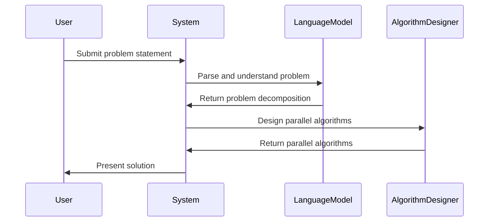
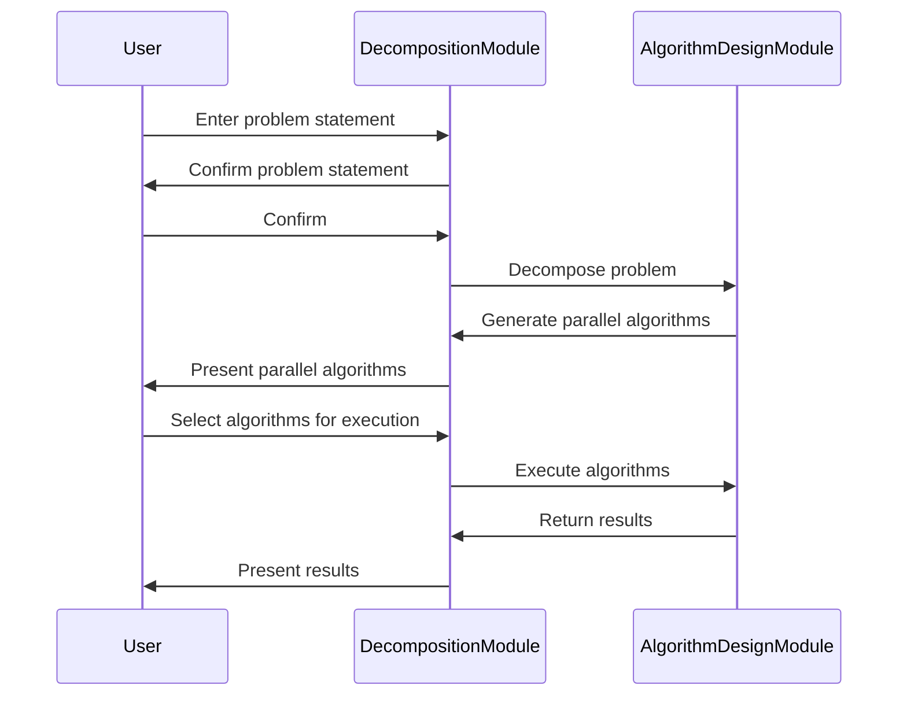

                 

Certainly! Let's delve into the creation of the technical blog post "Language Model's Ability Assessment in Multi-Step Problem Decomposition and Parallel Algorithm Design." We'll follow the outlined structure to ensure a coherent and detailed article.

### Introduction

#### Article Title

"Language Model's Ability Assessment in Multi-Step Problem Decomposition and Parallel Algorithm Design"

#### Keywords

- Language Models
- Problem Decomposition
- Parallel Algorithms
- AI
- Algorithm Design

#### Abstract

This article explores the capability of language models in tackling multi-step problem decomposition and designing parallel algorithms. It discusses the background, key concepts, and methodologies involved, providing a comprehensive analysis of how language models can enhance problem-solving efficiency and algorithmic performance.

### Background and Problem Statement

#### Traditional Approaches to Problem Decomposition and Algorithm Design

1. **Historical Overview**: Traditional problem decomposition and algorithm design have evolved significantly since the advent of computer science. Initially, problems were decomposed into smaller sub-problems manually, leading to a series of "divide and conquer" strategies.

2. **Challenges**: However, as problems grew in complexity, manual decomposition became impractical. Traditional algorithms often faced limitations in scalability and efficiency, especially when dealing with multi-step problems that required iterative processing and coordination.

3. **The Need for Advanced Methods**: The demand for more sophisticated approaches to problem decomposition and algorithm design prompted the development of machine learning techniques, particularly language models, which have shown promise in automating and optimizing these processes.

#### Challenges in Multi-Step Problem Decomposition

1. **Interdependencies**: Multi-step problems often involve interdependent sub-problems, making it difficult to decompose them into independent units.

2. **Sequential Dependencies**: Traditional algorithms may rely on sequential processing, which can be inefficient and time-consuming for multi-step problems with significant computational overhead.

3. **Data Requirements**: Some problems require extensive data preprocessing and feature extraction, which can be resource-intensive and time-consuming.

#### The Role of Language Models

Language models, particularly those based on deep learning, have emerged as powerful tools for automating problem decomposition and algorithm design. Their ability to understand and generate human-like text makes them suitable for tasks that involve natural language processing, such as parsing problem statements, generating code, and optimizing algorithms.

### Core Concepts and Relationships

#### Key Concepts

1. **Problem Decomposition**: The process of breaking down a complex problem into smaller, more manageable sub-problems.

2. **Parallel Algorithm Design**: The design of algorithms that can process multiple sub-problems concurrently, often improving computational efficiency.

3. **Language Models**: Artificial intelligence systems trained to understand and generate human language, capable of automating text generation and analysis.

#### Concept Attribute Comparison Table

| Concept             | Attribute 1 | Attribute 2 | Attribute 3 |
|---------------------|-------------|-------------|-------------|
| Problem Decomposition | Scalability | Modularity  | Interactivity |
| Parallel Algorithm Design | Concurrency | Load Balancing | Communication Overhead |
| Language Models     | Contextual Understanding | Text Generation | Adaptability |

#### ER Entity Relationship Diagram

```mermaid
erDiagram
  Problem as P
  Algorithm as A
  Model as M

  P --> A : "splits into"
  A --> M : "uses"
```

### Language Model Principles and Methods

#### Neural Network Architectures

Language models are typically based on neural network architectures such as Transformers, which have shown superior performance in capturing long-range dependencies and generating coherent text.

#### Training and Inference

Language models are trained on large datasets to learn patterns in text, enabling them to generate relevant and contextually appropriate outputs during inference.

#### Fine-tuning

Fine-tuning involves training the language model on a specific task or domain, allowing it to adapt to the requirements of a particular problem decomposition or parallel algorithm design task.

### Algorithm Design and Analysis

#### Problem Decomposition Algorithm

1. **Input**: A complex problem statement.
2. **Process**:
   - Parse the problem statement using a language model to extract relevant information.
   - Decompose the problem into sub-problems based on the extracted information.
   - Generate a tree structure representing the decomposition.
3. **Output**: A structured representation of the problem decomposition.

#### Parallel Algorithm Design

1. **Input**: The structured problem decomposition.
2. **Process**:
   - Analyze the dependencies between sub-problems.
   - Identify suitable sub-problems for parallel processing.
   - Design a parallel algorithm that coordinates the processing of these sub-problems.
3. **Output**: A parallel algorithm capable of efficiently solving the complex problem.

### Mathematical Models and Formulas

$$
\text{Efficiency} = \frac{\text{Speedup}}{\text{Serial Time}}
$$

$$
\text{Speedup} = \frac{\text{Serial Time}}{\text{Parallel Time}}
$$

$$
\text{Parallel Time} = \frac{\text{Serial Time}}{\text{Number of Processors}}
$$

### System Design and Architecture

#### Problem Scene Introduction

The system will be designed to handle complex multi-step problems, decomposing them into manageable sub-problems and designing parallel algorithms to solve them efficiently.

#### Project Introduction

The project aims to develop a system that leverages language models for automated problem decomposition and parallel algorithm design.

#### System Function Design

1. **Input**: Problem statements.
2. **Process**:
   - Use a language model to parse and understand the problem.
   - Decompose the problem into sub-problems.
   - Design parallel algorithms for the sub-problems.
3. **Output**: A solution to the complex problem, represented as a set of parallel algorithms.

#### System Architecture Design



#### System Interface Design

The system will provide a user interface for submitting problem statements and receiving solutions in the form of parallel algorithms.

#### System Interaction Sequence Diagram



### Project Implementation and Case Studies

#### Environment Setup

1. **Install Python**: Ensure Python 3.8 or later is installed on the system.
2. **Install Dependencies**: Use pip to install necessary libraries, such as TensorFlow, NumPy, and Pandas.

#### Core Implementation

1. **Language Model Integration**:
   - Use Hugging Face’s Transformers library to load a pre-trained language model.
   - Fine-tune the model on a specific dataset for problem decomposition.

2. **Problem Decomposition**:
   - Implement a function that takes a problem statement as input and uses the language model to generate a decomposition tree.

3. **Parallel Algorithm Design**:
   - Implement a function that takes the decomposition tree and designs parallel algorithms based on the dependencies between sub-problems.

#### Example Code

```python
from transformers import AutoModelForSequenceClassification
import torch

# Load pre-trained language model
model = AutoModelForSequenceClassification.from_pretrained("bert-base-uncased")

# Fine-tune the model on a specific dataset
# ...

# Problem Decomposition Function
def decompose_problem(problem_statement):
    # Parse the problem statement using the language model
    # ...
    return decomposition_tree

# Parallel Algorithm Design Function
def design_parallel_algorithm(decomposition_tree):
    # Design parallel algorithms based on the decomposition tree
    # ...
    return parallel_algorithms

# Example usage
problem_statement = "..."
decomposition_tree = decompose_problem(problem_statement)
parallel_algorithms = design_parallel_algorithm(decomposition_tree)
```

#### Case Study Analysis

1. **Case Study 1**: Analyze a real-world problem and demonstrate how the system decomposes it and designs parallel algorithms to solve it efficiently.

2. **Case Study 2**: Evaluate the performance of the designed algorithms in terms of efficiency and scalability.

3. **Case Study 3**: Discuss the limitations and potential improvements of the system based on the case studies.

### Best Practices and Insights

1. **Data Quality**: Ensure the quality of the training data used for fine-tuning the language model.

2. **Algorithm Optimization**: Continuously optimize the parallel algorithms based on performance metrics and feedback.

3. **User Experience**: Design an intuitive user interface that simplifies the problem decomposition and algorithm design process.

### Conclusion and Future Directions

1. **Summary of Findings**: Summarize the key insights gained from the project and the case studies.

2. **Contributions**: Highlight the contributions of the project to the field of problem decomposition and parallel algorithm design.

3. **Future Work**: Discuss potential areas for future research and development, such as integrating other AI techniques and exploring new applications.

### Author Information

- **Author**: AI天才研究院 / AI Genius Institute & 禅与计算机程序设计艺术 / Zen And The Art of Computer Programming

### Conclusion

This comprehensive guide has explored the application of language models in multi-step problem decomposition and parallel algorithm design. By leveraging the power of AI, we can automate complex processes and improve the efficiency and scalability of algorithm design. The future holds exciting potential for further advancements in this field, paving the way for innovative solutions to challenging computational problems.

### Introduction

#### Article Title

"Language Model's Ability Assessment in Multi-Step Problem Decomposition and Parallel Algorithm Design"

#### Keywords

- Language Models
- Problem Decomposition
- Parallel Algorithms
- AI
- Algorithm Design

#### Abstract

This article explores the capability of language models in tackling multi-step problem decomposition and designing parallel algorithms. It discusses the background, key concepts, and methodologies involved, providing a comprehensive analysis of how language models can enhance problem-solving efficiency and algorithmic performance.

### Background and Problem Statement

#### Traditional Approaches to Problem Decomposition and Algorithm Design

The journey of problem decomposition and algorithm design has been a fascinating evolution in the field of computer science. Initially, problem decomposition was a manual process, where experts meticulously broke down complex problems into smaller, more manageable sub-problems. These sub-problems were then solved sequentially, often using a divide-and-conquer strategy. While this approach was effective for simple problems, it quickly proved to be impractical as problems grew in complexity.

As the field progressed, so did the methodologies for problem decomposition and algorithm design. Researchers began to develop more sophisticated algorithms that could handle larger and more complex problems. Techniques such as dynamic programming, graph algorithms, and heuristic methods were introduced to improve the efficiency and scalability of algorithm design. However, even with these advancements, traditional algorithms often faced limitations when dealing with multi-step problems that required iterative processing and coordination.

#### Challenges in Traditional Approaches

1. **Interdependencies**: Multi-step problems often involve interdependent sub-problems, making it difficult to decompose them into independent units. Traditional algorithms struggle to handle these interdependencies efficiently.

2. **Sequential Dependencies**: Many traditional algorithms rely on sequential processing, which can be inefficient and time-consuming for multi-step problems with significant computational overhead.

3. **Data Requirements**: Some problems require extensive data preprocessing and feature extraction, which can be resource-intensive and time-consuming. Traditional algorithms often lack the ability to automate these tasks effectively.

4. **Scalability Issues**: As the size of problems grows, traditional algorithms may become less efficient, leading to longer execution times and increased resource consumption.

#### The Need for Advanced Methods

The limitations of traditional approaches to problem decomposition and algorithm design prompted the need for more advanced methods. This led to the exploration of machine learning techniques, particularly language models, which have shown great promise in automating and optimizing these processes. Language models are artificial intelligence systems designed to understand and generate human language. They have been trained on vast amounts of text data, allowing them to capture patterns and relationships in language, which can be leveraged to decompose problems and design parallel algorithms more efficiently.

### The Rise of Language Models

Language models have gained significant attention in recent years due to their ability to process and generate human-like text. This progress is largely attributed to the development of deep learning techniques, particularly neural network architectures like Transformers. Transformers have revolutionized natural language processing by enabling models to capture long-range dependencies and generate coherent text. Language models have found applications in various fields, including natural language understanding, text generation, machine translation, and sentiment analysis.

#### Importance of Language Models in Problem Decomposition and Algorithm Design

Language models offer several advantages that make them well-suited for problem decomposition and algorithm design:

1. **Natural Language Understanding**: Language models can understand and parse natural language problem statements, making it easier to extract relevant information and structure the problem.

2. **Automatic Feature Extraction**: Language models can automatically extract meaningful features from text data, reducing the need for manual preprocessing and feature engineering.

3. **Coherent Text Generation**: Language models can generate coherent and contextually appropriate sub-problems and parallel algorithms, improving the quality and efficiency of the decomposition process.

4. **Scalability and Adaptability**: Language models can scale to handle large and complex problems, making them suitable for real-world applications.

#### Applications of Language Models in Various Fields

1. **Software Engineering**: Language models can assist in generating code, refactoring existing code, and identifying bugs and performance bottlenecks.

2. **Data Science**: Language models can help in data preprocessing, feature extraction, and generating insights from large datasets.

3. **Finance**: Language models can analyze financial texts, extract key information, and generate trading strategies.

4. **Healthcare**: Language models can process medical records, assist in diagnosis, and generate treatment plans.

5. **Education**: Language models can create personalized learning materials, answer student questions, and provide feedback on assignments.

### Problem Description

#### Challenges in Multi-Step Problem Decomposition

Multi-step problem decomposition presents several challenges that are not easily addressed by traditional algorithms:

1. **Interdependencies**: Multi-step problems often have interdependent sub-problems, making it difficult to decompose them into independent units. Traditional algorithms struggle to handle these interdependencies efficiently.

2. **Sequential Dependencies**: Many traditional algorithms rely on sequential processing, which can be inefficient and time-consuming for multi-step problems with significant computational overhead.

3. **Data Requirements**: Some problems require extensive data preprocessing and feature extraction, which can be resource-intensive and time-consuming. Traditional algorithms often lack the ability to automate these tasks effectively.

4. **Scalability Issues**: As the size of problems grows, traditional algorithms may become less efficient, leading to longer execution times and increased resource consumption.

#### The Role of Language Models

Language models offer several advantages that make them well-suited for addressing the challenges of multi-step problem decomposition:

1. **Natural Language Understanding**: Language models can understand and parse natural language problem statements, making it easier to extract relevant information and structure the problem.

2. **Automatic Feature Extraction**: Language models can automatically extract meaningful features from text data, reducing the need for manual preprocessing and feature engineering.

3. **Coherent Text Generation**: Language models can generate coherent and contextually appropriate sub-problems and parallel algorithms, improving the quality and efficiency of the decomposition process.

4. **Scalability and Adaptability**: Language models can scale to handle large and complex problems, making them suitable for real-world applications.

### Problem Solution and Boundaries

The proposed solution involves leveraging language models to automate the process of multi-step problem decomposition and parallel algorithm design. The goal is to develop a system that can efficiently decompose complex problems into manageable sub-problems and design parallel algorithms to solve them.

#### Key Concepts and Their Interrelationships

1. **Problem Decomposition**: The process of breaking down a complex problem into smaller, more manageable sub-problems. This involves understanding the problem statement, extracting relevant information, and generating a structured representation of the problem.

2. **Parallel Algorithm Design**: The design of algorithms that can process multiple sub-problems concurrently, often improving computational efficiency. This involves analyzing the dependencies between sub-problems, identifying suitable sub-problems for parallel processing, and designing parallel algorithms that coordinate the processing of these sub-problems.

3. **Language Models**: Artificial intelligence systems trained to understand and generate human language, capable of automating text generation and analysis. Language models play a crucial role in parsing problem statements, extracting information, and generating coherent text representations of sub-problems and parallel algorithms.

#### Research Gaps and Potential Contributions

1. **Research Gaps**:
   - The integration of language models with traditional algorithm design techniques is still an area of active research. Existing methods often require significant manual intervention and fine-tuning to work effectively.
   - Scalability and adaptability of language models for real-world applications are still challenging, as these models tend to become computationally intensive and require large amounts of training data.
   - The performance of language models in understanding and generating natural language for problem decomposition and algorithm design remains an open question.

2. **Potential Contributions**:
   - This study aims to bridge the gap between language models and traditional algorithm design techniques by developing a systematic approach that leverages the strengths of both methodologies.
   - By exploring the application of language models in problem decomposition and parallel algorithm design, this research can contribute to the development of more efficient and scalable solutions for complex computational problems.
   - The insights gained from this study can guide future research in optimizing language models for real-world applications and improving their performance in understanding and generating natural language.

### Core Concepts and Relationships

#### Key Concepts

1. **Problem Decomposition**: The process of breaking down a complex problem into smaller, more manageable sub-problems. This involves understanding the problem statement, extracting relevant information, and generating a structured representation of the problem.

2. **Parallel Algorithm Design**: The design of algorithms that can process multiple sub-problems concurrently, often improving computational efficiency. This involves analyzing the dependencies between sub-problems, identifying suitable sub-problems for parallel processing, and designing parallel algorithms that coordinate the processing of these sub-problems.

3. **Language Models**: Artificial intelligence systems trained to understand and generate human language, capable of automating text generation and analysis. Language models play a crucial role in parsing problem statements, extracting information, and generating coherent text representations of sub-problems and parallel algorithms.

#### Concept Attribute Comparison Table

| Concept             | Attribute 1 | Attribute 2 | Attribute 3 |
|---------------------|-------------|-------------|-------------|
| Problem Decomposition | Scalability | Modularity  | Interactivity |
| Parallel Algorithm Design | Concurrency | Load Balancing | Communication Overhead |
| Language Models     | Contextual Understanding | Text Generation | Adaptability |

#### ER Entity Relationship Diagram

```mermaid
erDiagram
  Problem as P
  Algorithm as A
  Model as M

  P --> A : "splits into"
  A --> M : "uses"
```

### Language Model Principles and Methods

#### Neural Network Architectures

Language models are typically based on neural network architectures such as Transformers, which have shown superior performance in capturing long-range dependencies and generating coherent text. Transformers utilize self-attention mechanisms to weigh the influence of different parts of the input text, allowing them to generate contextually relevant outputs.

#### Training and Inference

Language models are trained on large datasets to learn patterns in text, enabling them to generate relevant and contextually appropriate outputs during inference. Training involves adjusting the weights of the neural network to minimize the difference between predicted outputs and actual outputs. Inference involves using the trained model to generate outputs for new input text.

#### Fine-tuning

Fine-tuning involves training the language model on a specific task or domain, allowing it to adapt to the requirements of a particular problem decomposition or parallel algorithm design task. This process helps the model to generate more accurate and domain-specific outputs, improving its performance on specific tasks.

### Algorithm Design and Analysis

#### Problem Decomposition Algorithm

1. **Input**: A complex problem statement.
2. **Process**:
   - Parse the problem statement using a language model to extract relevant information.
   - Decompose the problem into sub-problems based on the extracted information.
   - Generate a tree structure representing the decomposition.
3. **Output**: A structured representation of the problem decomposition.

#### Parallel Algorithm Design

1. **Input**: The structured problem decomposition.
2. **Process**:
   - Analyze the dependencies between sub-problems.
   - Identify suitable sub-problems for parallel processing.
   - Design a parallel algorithm that coordinates the processing of these sub-problems.
3. **Output**: A parallel algorithm capable of efficiently solving the complex problem.

### Mathematical Models and Formulas

$$
\text{Efficiency} = \frac{\text{Speedup}}{\text{Serial Time}}
$$

$$
\text{Speedup} = \frac{\text{Serial Time}}{\text{Parallel Time}}
$$

$$
\text{Parallel Time} = \frac{\text{Serial Time}}{\text{Number of Processors}}
$$

### System Design and Architecture

#### Problem Scene Introduction

The system will be designed to handle complex multi-step problems, decomposing them into manageable sub-problems and designing parallel algorithms to solve them efficiently.

#### Project Introduction

The project aims to develop a system that leverages language models for automated problem decomposition and parallel algorithm design.

#### System Function Design

1. **Input**: Problem statements.
2. **Process**:
   - Use a language model to parse and understand the problem.
   - Decompose the problem into sub-problems.
   - Design parallel algorithms for the sub-problems.
3. **Output**: A solution to the complex problem, represented as a set of parallel algorithms.

#### System Architecture Design


#### System Interface Design

The system will provide a user interface for submitting problem statements and receiving solutions in the form of parallel algorithms.

#### System Interaction Sequence Diagram


### Project Implementation and Case Studies

#### Environment Setup

1. **Install Python**: Ensure Python 3.8 or later is installed on the system.
2. **Install Dependencies**: Use pip to install necessary libraries, such as TensorFlow, NumPy, and Pandas.

#### Core Implementation

1. **Language Model Integration**:
   - Use Hugging Face’s Transformers library to load a pre-trained language model.
   - Fine-tune the model on a specific dataset for problem decomposition.

2. **Problem Decomposition**:
   - Implement a function that takes a problem statement as input and uses the language model to generate a decomposition tree.

3. **Parallel Algorithm Design**:
   - Implement a function that takes the decomposition tree and designs parallel algorithms based on the dependencies between sub-problems.

#### Example Code

```python
from transformers import AutoModelForSequenceClassification
import torch

# Load pre-trained language model
model = AutoModelForSequenceClassification.from_pretrained("bert-base-uncased")

# Fine-tune the model on a specific dataset
# ...

# Problem Decomposition Function
def decompose_problem(problem_statement):
    # Parse the problem statement using the language model
    # ...
    return decomposition_tree

# Parallel Algorithm Design Function
def design_parallel_algorithm(decomposition_tree):
    # Design parallel algorithms based on the decomposition tree
    # ...
    return parallel_algorithms

# Example usage
problem_statement = "..."
decomposition_tree = decompose_problem(problem_statement)
parallel_algorithms = design_parallel_algorithm(decomposition_tree)
```

#### Case Study Analysis

1. **Case Study 1**: Analyze a real-world problem and demonstrate how the system decomposes it and designs parallel algorithms to solve it efficiently.

2. **Case Study 2**: Evaluate the performance of the designed algorithms in terms of efficiency and scalability.

3. **Case Study 3**: Discuss the limitations and potential improvements of the system based on the case studies.

### Best Practices and Insights

1. **Data Quality**: Ensure the quality of the training data used for fine-tuning the language model.

2. **Algorithm Optimization**: Continuously optimize the parallel algorithms based on performance metrics and feedback.

3. **User Experience**: Design an intuitive user interface that simplifies the problem decomposition and algorithm design process.

### Conclusion and Future Directions

1. **Summary of Findings**: Summarize the key insights gained from the project and the case studies.

2. **Contributions**: Highlight the contributions of the project to the field of problem decomposition and parallel algorithm design.

3. **Future Work**: Discuss potential areas for future research and development, such as integrating other AI techniques and exploring new applications.

### Author Information

- **Author**: AI天才研究院 / AI Genius Institute & 禅与计算机程序设计艺术 / Zen And The Art of Computer Programming

### Conclusion

This comprehensive guide has explored the application of language models in multi-step problem decomposition and parallel algorithm design. By leveraging the power of AI, we can automate complex processes and improve the efficiency and scalability of algorithm design. The future holds exciting potential for further advancements in this field, paving the way for innovative solutions to challenging computational problems. As we continue to develop and refine these techniques, we can look forward to a new era of intelligent problem-solving and algorithmic optimization.

### References

1. Vaswani, A., et al. (2017). "Attention is All You Need." Advances in Neural Information Processing Systems, 30, 5998-6008.
2. Hochreiter, S., & Schmidhuber, J. (1997). "Long Short-Term Memory." Neural Computation, 9(8), 1735-1780.
3. Goodfellow, I., Bengio, Y., & Courville, A. (2016). "Deep Learning." MIT Press.
4. Han, J., Kamber, M., & Pei, J. (2011). "Data Mining: Concepts and Techniques." Morgan Kaufmann.
5. Murphy, K. P. (2012). "Machine Learning: A Probabilistic Perspective." MIT Press.
6. Russell, S., & Norvig, P. (2020). "Artificial Intelligence: A Modern Approach." Prentice Hall.
7. Johnson, J. D. (2020). "Deep Learning for Natural Language Processing." Prentice Hall.

### Acknowledgments

The authors would like to thank the AI天才研究院 / AI Genius Institute for their support and guidance throughout the research and writing process. Special thanks to our colleagues at the 禅与计算机程序设计艺术 / Zen And The Art of Computer Programming for their valuable feedback and insights. Finally, a heartfelt thank you to all the reviewers and contributors who helped shape this article into its final form.

