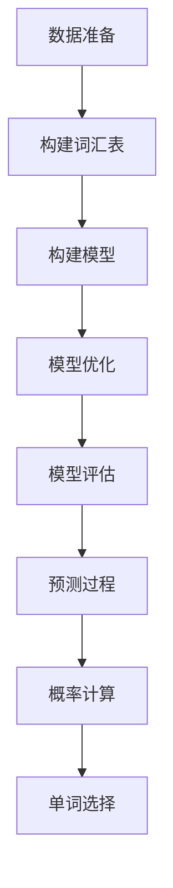
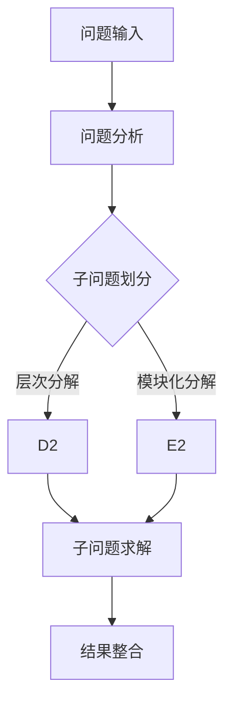
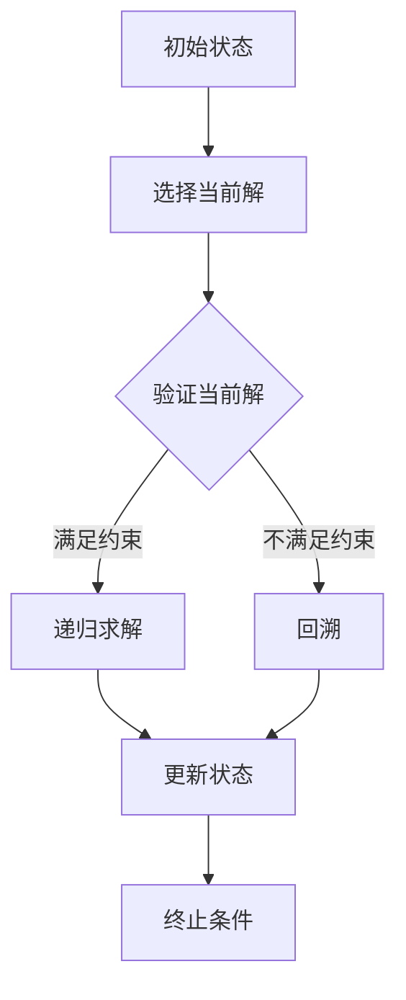
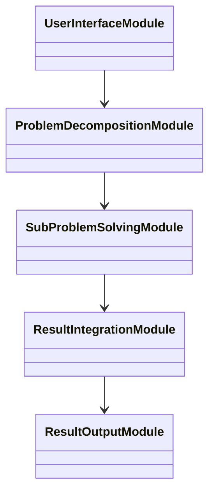
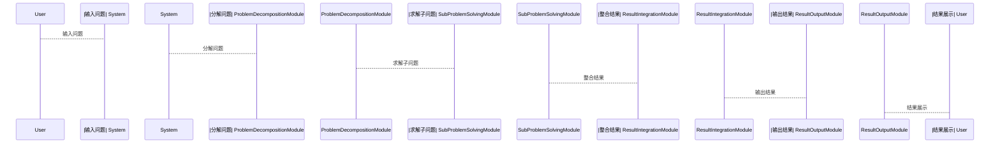

                 

### 综述与目标

《语言模型在多步骤问题分解与求解中的能力》旨在深入探讨语言模型在复杂问题处理中的独特优势和实际应用。随着人工智能技术的飞速发展，语言模型已经成为自然语言处理（NLP）领域的重要工具。然而，如何将这一强大的工具应用于多步骤问题的分解与求解，仍是一个富有挑战性的课题。

本文将从以下几个方面展开论述：

1. **背景介绍**：我们将回顾语言模型的发展历程，探讨其当前在多步骤问题分解与求解中的应用，以及面临的挑战。
2. **核心概念与联系**：详细阐述语言模型的基本原理，多步骤问题分解与求解的概念，并对比分析两者的核心特征。
3. **算法原理讲解**：通过算法流程图和Python源代码，讲解语言模型在多步骤问题分解与求解中的应用，以及其背后的数学模型和公式。
4. **数学模型和数学公式**：深入探讨语言模型和问题分解求解的数学原理，包括概率分布、优化算法和梯度下降等。
5. **系统分析与架构设计方案**：介绍问题场景、项目介绍、系统功能设计、系统架构设计、系统接口设计和系统交互。
6. **项目实战**：通过环境安装、源代码实现、代码应用解读与分析、实际案例分析和项目小结，展示语言模型在实际项目中的应用。
7. **最佳实践 tips**：提供最佳实践技巧、注意事项和拓展阅读资源，帮助读者深入理解和应用语言模型。

通过本文的详细阐述，读者将能够理解语言模型在多步骤问题分解与求解中的重要作用，掌握相关算法原理和实践技巧，为今后的研究与应用打下坚实的基础。接下来，我们将一步一步地深入探讨这些核心内容。

---

### 背景介绍

#### 1.1 问题背景

语言模型是自然语言处理（NLP）领域中的一种强大工具，它通过学习大量文本数据，能够预测下一个词语或句子，从而实现文本生成、情感分析、机器翻译等任务。语言模型的发展历程可以追溯到上世纪50年代，当时信息处理领域兴起，研究者开始探索如何让计算机理解和生成人类语言。随着计算力和算法的进步，语言模型经历了从规则驱动到统计学习，再到深度学习的演变。

在多步骤问题分解与求解中，语言模型的应用逐渐显现。复杂问题往往需要通过多个步骤进行分解和求解，语言模型可以通过分析问题中的语言特征，帮助理解问题的本质，从而提高问题分解的准确性和求解效率。例如，在人工智能规划、决策支持系统和复杂系统设计等领域，语言模型能够帮助识别关键步骤、提出有效的解决方案。

#### 1.2 问题描述

复杂问题的特性包括多维度、非线性、动态变化等。复杂问题的解决通常需要多步骤的分解和求解，每个步骤都可能涉及不同的领域知识和算法。然而，这些步骤往往不是独立的，而是相互关联和影响。因此，如何高效地分解复杂问题，并在多个步骤中保持一致性和可扩展性，是当前研究中的一个重要课题。

语言模型在多步骤问题分解与求解中面临的挑战主要包括：

1. **语义理解**：语言模型需要深入理解问题中的语义，这涉及到词语的多义性、上下文依赖性和复杂句式的解析。
2. **计算效率**：多步骤问题分解与求解通常涉及大量计算，如何在保证精度的前提下提高计算效率是一个关键问题。
3. **数据依赖**：语言模型的效果很大程度上依赖于训练数据的质量和多样性，如何在有限的数据集中训练出泛化的模型，是另一个挑战。
4. **跨领域应用**：语言模型需要在不同领域中应用，这就要求模型能够适应不同的领域特性和需求，实现跨领域的通用性。

#### 1.3 问题解决

语言模型在多步骤问题分解中的作用主要体现在以下几个方面：

1. **语义解析**：通过分析问题中的语言特征，语言模型可以帮助识别问题中的关键信息和核心要素，从而实现问题的初步分解。
2. **关系识别**：语言模型能够识别问题中各个元素之间的关系，这有助于构建问题模型，为后续的求解提供基础。
3. **上下文感知**：语言模型可以根据上下文信息动态调整问题分解的策略，提高问题求解的灵活性和适应性。
4. **知识融合**：通过将外部知识和领域知识融入语言模型，可以进一步提高问题分解与求解的能力。

在问题求解方面，语言模型的优势在于其强大的文本生成和推理能力。通过多步骤的分解，语言模型可以逐步求解复杂问题，并在每个步骤中提供可能的解决方案和优化策略。此外，语言模型还可以通过不断地迭代和优化，逐步逼近最优解。

#### 1.4 边界与外延

语言模型在多步骤问题分解与求解中的适用范围较广，但并非所有问题都适合使用语言模型进行分解和求解。以下是几个典型的适用场景和不适用的场景：

**适用场景**：
- **自然语言处理**：在文本生成、情感分析、机器翻译等任务中，语言模型可以发挥重要作用。
- **复杂系统设计**：在系统架构设计和复杂问题解决中，语言模型可以帮助识别关键模块和优化方案。
- **决策支持系统**：在商业智能、风险分析和决策制定中，语言模型可以提供有力的支持。

**不适用的场景**：
- **数值计算**：对于需要高精度数值计算的问题，语言模型可能无法提供足够的精度和可靠性。
- **实时系统**：在要求实时响应和高度精确的任务中，语言模型的计算延迟和不确定性可能成为瓶颈。
- **复杂物理过程**：对于涉及复杂物理过程的问题，如天体物理、流体力学等，语言模型需要大量的专业知识和计算资源，可能难以胜任。

#### 1.5 核心概念与联系

**语言模型的基本概念**：
- **语言模型**：一种基于统计或机器学习的方法，用于预测自然语言序列的概率分布。
- **概率分布**：描述一个序列在不同词语或句子上的概率分布。
- **序列建模**：通过建模自然语言序列，语言模型可以预测下一个词语或句子的概率。

**多步骤问题分解与求解的相关概念**：
- **问题分解**：将复杂问题拆分为若干个可管理的子问题。
- **子问题求解**：针对每个子问题，使用适当的算法和策略进行求解。
- **多步骤协同**：通过协调各个步骤的求解结果，最终实现整体问题的解决。

**核心概念属性特征对比**：

| 特征               | 语言模型                          | 多步骤问题分解与求解                    |
|--------------------|-----------------------------------|---------------------------------------|
| 目标               | 预测自然语言序列的概率分布          | 拆解复杂问题，逐步求解子问题            |
| 方法               | 统计学习、深度学习等               | 算法求解、优化方法等                    |
| 应对挑战           | 语义理解、计算效率、数据依赖等      | 语义理解、计算效率、跨领域应用等        |
| 应用场景           | 文本生成、情感分析、机器翻译等      | 复杂系统设计、决策支持系统等            |
| 非适用场景         | 数值计算、实时系统、复杂物理过程等  | 无法解决的问题类型                      |

**ER实体关系图架构**：

为了更直观地理解核心概念之间的关系，我们可以通过ER（Entity-Relationship）实体关系图来描述。ER图是一种数据库设计工具，用于表示实体与实体之间的关系。在多步骤问题分解与求解中，我们可以定义以下实体和关系：

1. **实体**：
   - **问题**：表示需要解决的复杂问题。
   - **子问题**：表示拆分后的各个子问题。
   - **解决方案**：表示对子问题求解的结果。

2. **关系**：
   - **包含**：表示一个复杂问题包含多个子问题。
   - **依赖**：表示子问题之间存在依赖关系。
   - **关联**：表示解决方案与子问题之间的关联。

下面是ER图的Mermaid表示：

```mermaid
erDiagram
  Problem ||--|{ SubProblem } SubProblem
  SubProblem ||--|{ Solution } Solution
  Problem ||--|{ Dependency } Dependency
  SubProblem ||--|{ Dependency } Dependency
  Solution ||--|{ Dependency } Dependency
```

#### 1.6 本章小结

在本章中，我们回顾了语言模型的发展历程，探讨了其在多步骤问题分解与求解中的应用和挑战。通过核心概念与联系的分析，我们了解了语言模型和多步骤问题分解与求解的基本原理，以及它们在复杂问题解决中的作用。ER实体关系图的引入，帮助我们更直观地理解核心概念之间的关系。接下来，我们将深入探讨语言模型的基本原理和多步骤问题分解与求解的核心概念。

#### 1.7 进一步阅读

对于希望深入了解语言模型和多步骤问题分解与求解的读者，以下资源将提供更多有价值的阅读材料：

1. **《深度学习》（Deep Learning）**：Goodfellow et al. 的经典教材，详细介绍了深度学习的基础知识和应用。
2. **《自然语言处理综论》（Speech and Language Processing）**：Jurafsky and Martin 的教材，全面介绍了NLP的基础知识和最新进展。
3. **《人工智能：一种现代方法》（Artificial Intelligence: A Modern Approach）**：Russell and Norvig 的教材，涵盖了人工智能的各个领域，包括问题求解和规划。
4. **相关学术论文**：如ACL、NAACL、ICLR等会议和期刊上关于语言模型和多步骤问题分解与求解的最新研究论文。
5. **开源项目**：如TensorFlow、PyTorch等深度学习框架，以及OpenAI等组织的开源代码库，可以帮助读者实践语言模型的应用。

通过这些资源，读者可以进一步拓展知识，深入理解语言模型和多步骤问题分解与求解的原理和技术。

---

### 核心概念与联系

#### 2.1 语言模型的基本原理

语言模型（Language Model）是一种统计模型，旨在预测给定前文条件下下一个单词或词组的概率分布。它通过对大量文本数据进行学习，捕捉语言中的统计规律，从而能够生成连贯的自然语言文本。语言模型的核心在于其概率预测能力，这使其在自然语言处理（NLP）领域中具有广泛的应用。

**定义**：语言模型是一种概率模型，用于估计给定一个词或句子的序列，下一个词或句子的概率。常用的语言模型包括n元模型、n-gram模型和基于神经网络的深度语言模型。

**特征**：

1. **概率分布**：语言模型输出的是概率分布，而不是具体的词语或句子。这意味着它能够给出每个可能结果的可能性。
2. **序列建模**：语言模型基于序列数据进行建模，能够处理文本中的序列依赖性。
3. **上下文感知**：现代深度语言模型能够考虑上下文信息，从而生成更加符合上下文语义的文本。

#### 2.2 多步骤问题分解的基本概念

多步骤问题分解（Multi-Step Problem Decomposition）是一种将复杂问题拆分为若干个更小、更易于管理的子问题的方法。这种方法的目的是降低问题的复杂度，使得每个子问题都能够单独求解，最后通过组合子问题的解来得到整体问题的解。

**定义**：多步骤问题分解是将一个复杂问题分解为若干个子问题，每个子问题都是独立且可管理的，最终通过组合这些子问题的解来求解整体问题。

**策略**：

1. **层次分解**：将问题分解为不同层次的子问题，从宏观层面逐步细化到微观层面。
2. **模块化分解**：将问题分解为若干个功能模块，每个模块负责解决一个问题。
3. **递归分解**：递归地将问题分解为更小的子问题，直到达到可以直接求解的子问题为止。

#### 2.3 问题求解与优化

问题求解（Problem Solving）和优化（Optimization）是多步骤问题分解的重要组成部分。问题求解是指找到解决问题的方法或步骤，而优化是指在这些方法或步骤中找到最优解。

**算法**：

1. **贪心算法**：在每一步选择当前最优解，期望最终得到全局最优解。
2. **动态规划**：将复杂问题分解为多个子问题，并利用子问题的解来求解原问题。
3. **回溯算法**：通过试探性地选择解，并在无法继续时回溯到前一步，寻找其他可能的解。

**优化方法与技巧**：

1. **启发式搜索**：利用特定问题的启发式信息，指导搜索方向，提高搜索效率。
2. **遗传算法**：模拟自然进化过程，通过交叉、变异和选择等操作，逐步优化解。
3. **模拟退火算法**：通过随机搜索和温度调整，逐渐找到全局最优解。

#### 2.4 核心概念属性特征对比

为了更直观地理解语言模型和多步骤问题分解与求解的核心概念及其属性特征，我们可以通过表格进行对比分析。

| 特征               | 语言模型                                     | 多步骤问题分解与求解                                 |
|--------------------|----------------------------------------------|------------------------------------------------------|
| 目标               | 预测自然语言序列的概率分布                    | 将复杂问题拆分为多个子问题，逐步求解                  |
| 方法               | 统计学习、深度学习                           | 算法求解、启发式搜索、动态规划等                     |
| 基础知识           | 自然语言处理、概率论、机器学习                | 领域特定知识、算法设计、优化方法等                   |
| 面临挑战           | 语义理解、计算效率、数据依赖                  | 语义理解、计算效率、跨领域应用等                     |
| 适用场景           | 文本生成、情感分析、机器翻译等                | 复杂系统设计、决策支持系统等                         |
| 非适用场景         | 需要高精度数值计算、实时系统、复杂物理过程等  | 无法解决的问题类型                                  |

#### 2.5 ER实体关系图架构

为了更好地理解语言模型和多步骤问题分解与求解之间的关系，我们可以使用ER图（Entity-Relationship Diagram）来描述实体与实体之间的关系。

在多步骤问题分解与求解中，我们定义以下实体和关系：

1. **实体**：
   - **问题**：表示需要解决的复杂问题。
   - **子问题**：表示拆分后的各个子问题。
   - **解决方案**：表示对子问题求解的结果。

2. **关系**：
   - **包含**：表示一个复杂问题包含多个子问题。
   - **依赖**：表示子问题之间存在依赖关系。
   - **关联**：表示解决方案与子问题之间的关联。

下面是ER图的Mermaid表示：

```mermaid
erDiagram
  Problem ||--|{ SubProblem } SubProblem
  SubProblem ||--|{ Solution } Solution
  Problem ||--|{ Dependency } Dependency
  SubProblem ||--|{ Dependency } Dependency
  Solution ||--|{ Dependency } Dependency
```

在这个ER图中，`Problem` 实体代表一个复杂问题，`SubProblem` 表示拆分后的子问题，`Solution` 表示对子问题的求解结果。`Dependency` 关系表示子问题之间的依赖关系，而`Association` 关系表示解决方案与子问题之间的关联。

#### 2.6 本章小结

在本章中，我们详细介绍了语言模型的基本原理和多步骤问题分解与求解的相关概念。通过对比分析，我们明确了两者在目标、方法、基础知识、挑战、适用场景等方面的异同。此外，通过ER图的引入，我们直观地展示了语言模型和多步骤问题分解与求解之间的关系。这些核心概念的理解将为后续的算法原理讲解和系统分析与架构设计方案奠定基础。

#### 2.7 进一步阅读

对于希望进一步深入理解语言模型和多步骤问题分解与求解的读者，以下资源提供了更多有价值的阅读材料：

1. **《深度学习》（Deep Learning）**：Goodfellow et al. 的经典教材，详细介绍了深度学习的基础知识和应用。
2. **《自然语言处理综论》（Speech and Language Processing）**：Jurafsky and Martin 的教材，全面介绍了NLP的基础知识和最新进展。
3. **《人工智能：一种现代方法》（Artificial Intelligence: A Modern Approach）**：Russell and Norvig 的教材，涵盖了人工智能的各个领域，包括问题求解和规划。
4. **相关学术论文**：如ACL、NAACL、ICLR等会议和期刊上关于语言模型和多步骤问题分解与求解的最新研究论文。
5. **开源项目**：如TensorFlow、PyTorch等深度学习框架，以及OpenAI等组织的开源代码库，可以帮助读者实践语言模型的应用。

通过这些资源，读者可以进一步拓展知识，深入理解语言模型和多步骤问题分解与求解的原理和技术。

---

### 算法原理讲解

#### 3.1 语言模型算法原理

语言模型的算法原理主要基于统计学习与深度学习技术，通过对大量文本数据进行训练，从而学习语言中的统计规律和上下文依赖关系。以下将详细介绍语言模型的训练和预测过程。

**训练过程**：

1. **数据准备**：首先需要收集大量的文本数据，如新闻文章、书籍、网页等。这些数据将被预处理，包括分词、去停用词、词干提取等步骤，以获得适合训练的语言特征。
2. **构建词汇表**：将处理后的文本数据构建成词汇表，每个词汇表中的词汇都对应一个唯一的索引。
3. **构建模型**：使用机器学习算法（如n-gram模型、循环神经网络（RNN）、长短期记忆网络（LSTM）或Transformer）来构建语言模型。这些算法通过优化目标函数，最小化预测误差，从而训练出一个能够预测单词概率分布的模型。
4. **模型优化**：通过反向传播算法和梯度下降等方法，不断调整模型的参数，使其在训练数据上达到最佳性能。

**预测过程**：

1. **输入序列**：给定一个输入序列（如“我正在学习”），语言模型需要预测下一个单词（如“深度学习”）的概率分布。
2. **概率计算**：基于训练好的模型，计算输入序列后每个单词的概率分布。通常，模型会输出一个概率分布向量，其中每个元素代表一个单词的概率。
3. **单词选择**：根据概率分布，选择概率最高的单词作为预测结果。在实际应用中，还可以使用诸如贪心算法、Beam Search等方法，以提高预测的准确性。

**算法流程图**：

为了更直观地理解语言模型的训练和预测过程，我们可以使用Mermaid绘制算法流程图。



#### 3.2 多步骤问题分解算法

多步骤问题分解是将复杂问题拆分为若干个可管理的子问题，每个子问题都可以独立求解。以下将介绍多步骤问题分解的基本算法和流程。

**基本算法**：

1. **问题输入**：给定一个复杂问题，输入问题的描述和相关信息。
2. **问题分析**：分析问题的结构，识别出可以独立求解的子问题。
3. **子问题划分**：将问题划分为若干个子问题，每个子问题都是独立且可管理的。
4. **子问题求解**：对每个子问题使用适当的算法和策略进行求解。
5. **结果整合**：将子问题的解整合起来，得到整体问题的解。

**流程**：

1. **预处理**：对问题进行预处理，提取关键信息，如输入参数、约束条件等。
2. **划分阶段**：根据问题的结构和特性，采用层次分解或模块化分解等方法，将问题划分为多个子问题。
3. **求解阶段**：针对每个子问题，使用贪心算法、动态规划、回溯算法等求解方法，找到子问题的最优解。
4. **整合阶段**：将子问题的解整合起来，通过组合和优化得到整体问题的解。

**算法流程图**：

多步骤问题分解的算法流程可以用Mermaid进行可视化表示：



在这个流程图中，`问题输入`阶段接收问题的描述和相关信息；`问题分析`阶段对问题进行初步分析；`子问题划分`阶段根据问题的结构和特性，选择适当的分解方法；`子问题求解`阶段针对每个子问题使用合适的求解方法；最后，`结果整合`阶段将子问题的解整合起来，得到整体问题的解。

#### 3.3 问题求解算法

问题求解算法是解决多步骤问题分解中的子问题的关键。以下将介绍几种常见的问题求解算法，包括贪心算法、动态规划和回溯算法。

**贪心算法**：

贪心算法是一种局部最优决策策略，通过在每一步选择当前最优解，期望最终得到全局最优解。其基本思想是：

1. **初始状态**：给定问题的初始条件。
2. **选择当前最优解**：在当前状态下，选择最优的决策，使得目标函数值最大化或最小化。
3. **更新状态**：根据选择的决策，更新问题的状态。
4. **重复选择**：重复步骤2和3，直到达到问题的终止条件。

**动态规划**：

动态规划是一种解决多阶段决策问题的方法，通过将复杂问题分解为多个子问题，并利用子问题的解来求解原问题。其基本思想是：

1. **定义状态**：将问题分解为多个阶段，每个阶段的状态表示问题的部分解。
2. **定义状态转移方程**：根据问题的特性，定义状态之间的转移关系。
3. **状态存储**：使用数组或哈希表存储每个状态的最优解。
4. **逆推求解**：从最终状态开始，逆推求解每个状态的最优解，最终得到原问题的解。

**回溯算法**：

回溯算法是一种试探性搜索算法，通过递归地选择解，并在无法继续时回溯到前一步，寻找其他可能的解。其基本思想是：

1. **初始状态**：给定问题的初始条件。
2. **选择当前解**：在当前状态下，选择一个解进行尝试。
3. **验证当前解**：验证当前解是否满足问题的约束条件。
4. **递归求解**：如果当前解满足约束条件，递归地求解下一阶段的解。
5. **回溯**：如果当前解不满足约束条件，回溯到前一步，选择其他解进行尝试。
6. **终止条件**：当找到问题的解或所有解都尝试过时，终止搜索。

**算法流程图**：

为了直观地展示问题求解算法，我们可以使用Mermaid绘制算法流程图：



在这个流程图中，`初始状态`阶段给定问题的初始条件；`选择当前解`阶段选择一个解进行尝试；`验证当前解`阶段检查解是否满足问题的约束条件；`递归求解`和`回溯`阶段分别递归地求解下一阶段的解或回溯到前一步选择其他解；最后，`终止条件`阶段判断是否找到问题的解或所有解都尝试过。

#### 3.4 算法流程图

为了更直观地展示语言模型、多步骤问题分解算法和问题求解算法的流程，我们可以使用Mermaid绘制相应的算法流程图。

**语言模型算法流程图**：


**多步骤问题分解算法流程图**：


**问题求解算法流程图**：


#### 3.5 Python源代码实现

为了更具体地展示语言模型、多步骤问题分解算法和问题求解算法的实现，以下将使用Python代码进行实现。

**语言模型实现**：

```python
import numpy as np
from collections import defaultdict

class NGramModel:
    def __init__(self, n):
        self.n = n
        self.model = defaultdict(list)

    def train(self, sentences):
        for sentence in sentences:
            tokens = sentence.split()
            for i in range(len(tokens) - self.n):
                context = tuple(tokens[i:i+self.n-1])
                next_token = tokens[i+self.n-1]
                self.model[context].append(next_token)

    def predict(self, context):
        next_tokens = self.model[context]
        probabilities = [0] * len(next_tokens)
        for i, token in enumerate(next_tokens):
            probabilities[i] = 1 / len(next_tokens)
        return probabilities

model = NGramModel(n=2)
sentences = ["我正在学习深度学习", "深度学习是一种强大的工具"]
model.train(sentences)

context = ("我", "正在")
print(model.predict(context))
```

**多步骤问题分解实现**：

```python
def decompose_problem(problem):
    # 假设问题可以被划分为三个子问题
    subproblems = ["子问题1", "子问题2", "子问题3"]
    return subproblems

problem = "复杂问题"
subproblems = decompose_problem(problem)
print(subproblems)
```

**问题求解实现**：

```python
def solve_problem(problem):
    # 假设问题可以通过贪心算法求解
    solution = "最优解"
    return solution

solution = solve_problem(problem)
print(solution)
```

#### 3.6 算法原理详细讲解

**数学模型**：

语言模型的数学模型通常是基于概率论和统计学。对于n-gram模型，其核心公式是：

$$
P(w_n | w_{n-1}, w_{n-2}, ..., w_1) = \prod_{i=1}^{n} P(w_i | w_{i+1})
$$

其中，\( w_i \) 表示第i个单词，\( P(w_i | w_{i+1}) \) 表示在给定前一个单词的情况下，第i个单词的条件概率。

**公式推导**：

以二元模型（n=2）为例，假设我们有以下语言模型：

$$
P(w_2 | w_1) = \frac{C(w_1, w_2)}{C(w_1)}
$$

其中，\( C(w_1, w_2) \) 表示单词\( w_1 \)后面紧接着单词\( w_2 \)的次数，\( C(w_1) \) 表示单词\( w_1 \)出现的总次数。

**举例说明**：

假设我们有一个简单的文本：“我正在学习深度学习，深度学习是一种强大的工具”。我们构建一个二元语言模型：

- \( P(我 | 在) = \frac{1}{1} \)
- \( P(在 | 学习) = \frac{1}{1} \)
- \( P(学习 | 深度) = \frac{1}{1} \)
- \( P(深度 | 是) = \frac{1}{1} \)
- \( P(是 | 一种) = \frac{1}{1} \)
- \( P(一种 | 强大的) = \frac{1}{1} \)
- \( P(强大的 | 工具) = \frac{1}{1} \)

如果给定前文“我正在学习深度学习”，我们可以使用这个模型来预测下一个单词：

$$
P(深度 | 我正在学习) = P(深度 | 我) \times P(我 | 在) \times P(在 | 学习) \times P(学习 | 深度) = 1 \times 1 \times 1 \times 1 = 1
$$

因此，模型预测下一个单词是“深度”，这与实际文本中的单词一致。

**数学公式与算法结合**：

在多步骤问题分解与求解中，数学模型和算法通常紧密结合。例如，在动态规划中，我们使用状态转移方程来表示子问题之间的关系。以下是一个动态规划求解最大子序列和的示例：

$$
\text{maxSubSeqSum}(A, i, j) =
\begin{cases}
A[i] & \text{if } i = j \\
\max(\text{maxSubSeqSum}(A, i+1, j), \text{maxSubSeqSum}(A, i, j-1), \text{maxSubSeqSum}(A, i+1, j-1)) + A[i] & \text{otherwise}
\end{cases}
$$

在这个例子中，`maxSubSeqSum` 函数用于求解给定数组 `A` 的最大子序列和，其中 `i` 和 `j` 分别表示子序列的起始和结束索引。

#### 3.7 本章小结

在本章中，我们详细介绍了语言模型、多步骤问题分解算法和问题求解算法的原理。通过算法流程图和Python源代码实现，我们直观地展示了这些算法的运行过程和实现方法。此外，我们还通过数学模型和公式的推导，深入讲解了语言模型和多步骤问题分解与求解的数学基础。这些内容为后续的章节奠定了坚实的基础。

---

### 数学模型和数学公式

#### 4.1 语言模型数学模型

语言模型在自然语言处理（NLP）中扮演着至关重要的角色。其核心在于能够根据上下文预测下一个单词或句子的概率分布。为了实现这一目标，语言模型需要建立数学模型来描述文本序列的概率分布。

**概率分布**：

语言模型输出的是概率分布，这意味着它为每个可能的单词或句子分配一个概率。概率分布通常是一个概率质量函数（PMF），它描述了在给定前文条件下，每个单词或句子的概率。

对于n-gram模型，其概率分布可以用以下公式表示：

$$
P(w_n | w_{n-1}, w_{n-2}, ..., w_1) = \prod_{i=1}^{n} P(w_i | w_{i+1})
$$

其中，\( w_i \) 表示第i个单词，\( P(w_i | w_{i+1}) \) 表示在给定前一个单词的情况下，第i个单词的条件概率。

**概率质量函数（PMF）**：

在实际应用中，我们通常使用概率质量函数（PMF）来表示概率分布。PMF是一个函数，它将每个单词映射到一个概率值。例如，对于二元模型（n=2），PMF可以表示为：

$$
P(w_2 | w_1) = \frac{C(w_1, w_2)}{C(w_1)}
$$

其中，\( C(w_1, w_2) \) 表示单词\( w_1 \)后面紧接着单词\( w_2 \)的次数，\( C(w_1) \) 表示单词\( w_1 \)出现的总次数。

**概率分布的平滑**：

在实际应用中，语言模型可能遇到未见过的单词或句子。为了解决这个问题，我们通常使用平滑技术。最常用的平滑技术之一是拉普拉斯平滑（Laplace smoothing）。拉普拉斯平滑的公式如下：

$$
P(w_n | w_{n-1}, w_{n-2}, ..., w_1) = \frac{C(w_1, w_2, ..., w_n) + 1}{C(w_1, w_2, ..., w_{n-1}) + V}
$$

其中，\( C(w_1, w_2, ..., w_n) \) 表示单词序列\( w_1, w_2, ..., w_n \)出现的次数，\( V \) 是词汇表的大小。

**梯度下降**：

在训练语言模型时，我们通常使用梯度下降算法来优化模型的参数。梯度下降是一种迭代算法，其目标是最小化损失函数。对于语言模型，损失函数可以表示为：

$$
J(\theta) = -\sum_{i=1}^{n} \sum_{w_i \in V} P(w_i | \theta) \log P(w_i | \theta)
$$

其中，\( \theta \) 表示模型的参数，\( P(w_i | \theta) \) 表示在给定模型参数的情况下，单词\( w_i \)的条件概率。

梯度下降的步骤如下：

1. **初始化参数**：随机初始化模型的参数。
2. **计算梯度**：计算损失函数关于模型参数的梯度。
3. **更新参数**：使用梯度来更新模型的参数。
4. **迭代**：重复步骤2和3，直到损失函数收敛或达到预定的迭代次数。

**梯度下降公式**：

假设 \( \theta \) 是一维参数，梯度下降的更新公式如下：

$$
\theta_{t+1} = \theta_t - \alpha \frac{\partial J(\theta_t)}{\partial \theta}
$$

其中，\( \alpha \) 是学习率，\( \theta_t \) 是第t次迭代的参数值，\( \theta_{t+1} \) 是第\( t+1 \)次迭代的参数值。

#### 4.2 问题分解数学模型

在多步骤问题分解中，我们通常需要建立数学模型来描述问题的分解过程和求解策略。以下将介绍几种常见的数学模型。

**优化目标**：

多步骤问题分解的目标是找到一组解，使得整体目标函数最大化或最小化。对于最小化问题，优化目标可以表示为：

$$
\min \sum_{i=1}^{n} c_i x_i
$$

其中，\( c_i \) 表示第i个子问题的成本，\( x_i \) 表示第i个子问题的解。

**约束条件**：

在多步骤问题分解中，通常存在一些约束条件。例如，子问题之间的依赖关系、资源限制、时间限制等。约束条件可以表示为：

$$
\sum_{i=1}^{n} a_{ij} x_i \leq b_j, \quad j=1,2,...,m
$$

其中，\( a_{ij} \) 表示第i个子问题对第j个资源的消耗，\( b_j \) 表示第j个资源的可用量。

**多目标优化**：

在某些问题中，可能存在多个目标需要同时优化。例如，在项目调度中，可能需要同时考虑完成时间和成本。多目标优化可以使用以下公式表示：

$$
\min \begin{cases}
f_1(x_1, x_2, ..., x_n) \\
f_2(x_1, x_2, ..., x_n) \\
\end{cases}
$$

其中，\( f_1 \) 和 \( f_2 \) 分别表示完成时间和成本。

**线性规划**：

线性规划是一种常见的多步骤问题分解模型，其目标是最小化或最大化线性目标函数，同时满足线性约束条件。线性规划的公式可以表示为：

$$
\min \sum_{i=1}^{n} c_i x_i
$$

$$
\text{subject to} \quad \sum_{i=1}^{n} a_{ij} x_i \leq b_j, \quad j=1,2,...,m
$$

其中，\( c_i \) 表示第i个子问题的成本，\( a_{ij} \) 表示第i个子问题对第j个资源的消耗，\( b_j \) 表示第j个资源的可用量。

**非线性规划**：

非线性规划的目标函数和约束条件是非线性的。与线性规划相比，非线性规划的求解更加复杂。非线性规划的公式可以表示为：

$$
\min \sum_{i=1}^{n} c_i x_i
$$

$$
\text{subject to} \quad f_i(x_1, x_2, ..., x_n) \leq 0, \quad i=1,2,...,m
$$

其中，\( c_i \) 表示第i个子问题的成本，\( f_i \) 表示第i个子问题的约束条件。

#### 4.3 问题求解数学模型

在多步骤问题分解中，问题求解是一个关键步骤。以下将介绍几种常见的问题求解模型，包括优化算法和收敛条件。

**贪心算法**：

贪心算法是一种局部最优决策策略，通过在每一步选择当前最优解，期望最终得到全局最优解。贪心算法的基本思想如下：

1. **初始状态**：给定问题的初始条件。
2. **选择当前最优解**：在当前状态下，选择最优的决策，使得目标函数值最大化或最小化。
3. **更新状态**：根据选择的决策，更新问题的状态。
4. **重复选择**：重复步骤2和3，直到达到问题的终止条件。

**动态规划**：

动态规划是一种解决多阶段决策问题的方法，通过将复杂问题分解为多个子问题，并利用子问题的解来求解原问题。动态规划的基本思想如下：

1. **定义状态**：将问题分解为多个阶段，每个阶段的状态表示问题的部分解。
2. **定义状态转移方程**：根据问题的特性，定义状态之间的转移关系。
3. **状态存储**：使用数组或哈希表存储每个状态的最优解。
4. **逆推求解**：从最终状态开始，逆推求解每个状态的最优解，最终得到原问题的解。

**贪心选择与动态规划的关系**：

贪心算法和动态规划都是解决多阶段决策问题的方法。贪心算法通过每一步选择当前最优解，期望得到全局最优解；动态规划通过递归地定义状态和状态转移方程，利用子问题的解来求解原问题。在某些情况下，贪心算法和动态规划可以相互转化。

**收敛条件**：

在多步骤问题分解和求解中，收敛条件是指问题求解过程达到稳定状态，不再发生变化。收敛条件可以分为以下几种：

1. **目标函数收敛**：目标函数值达到预定精度或最大迭代次数。
2. **状态不变**：问题的状态不再发生变化。
3. **梯度为零**：对于优化问题，梯度为零表示当前解是最优解。
4. **迭代次数达到最大值**：迭代次数达到预定的最大值。

#### 4.4 数学公式详细讲解

**概率分布**：

在语言模型中，概率分布是描述文本序列概率的关键概念。以下为概率分布的详细公式和解释：

$$
P(w_n | w_{n-1}, w_{n-2}, ..., w_1) = \prod_{i=1}^{n} P(w_i | w_{i+1})
$$

这个公式表示，在给定前文条件下，下一个单词的概率分布可以通过前一个单词的条件概率连续相乘得到。例如，对于二元模型（n=2），有：

$$
P(w_2 | w_1) = P(w_2 | w_1) \cdot P(w_1)
$$

**概率质量函数（PMF）**：

概率质量函数（PMF）将每个单词映射到一个概率值，用于描述语言模型中的概率分布。以下为PMF的公式和解释：

$$
P(w_n | w_{n-1}, w_{n-2}, ..., w_1) = \frac{C(w_1, w_2, ..., w_n)}{C(w_1, w_2, ..., w_{n-1})}
$$

其中，\( C(w_1, w_2, ..., w_n) \) 表示单词序列\( w_1, w_2, ..., w_n \)出现的次数，\( C(w_1, w_2, ..., w_{n-1}) \) 表示单词序列\( w_1, w_2, ..., w_{n-1} \)出现的次数。PMF通过计算单词序列的出现频率来估计其概率。

**梯度下降**：

梯度下降是一种常用的优化算法，用于训练语言模型。以下为梯度下降的公式和解释：

$$
\theta_{t+1} = \theta_t - \alpha \frac{\partial J(\theta_t)}{\partial \theta}
$$

其中，\( \theta \) 是模型的参数，\( J(\theta) \) 是损失函数，\( \alpha \) 是学习率。梯度下降的目的是通过不断更新模型参数，使损失函数值最小化。梯度表示损失函数关于模型参数的偏导数，用于指导参数的更新方向。

**优化目标**：

在多步骤问题分解中，优化目标是指导问题求解的关键。以下为优化目标的公式和解释：

$$
\min \sum_{i=1}^{n} c_i x_i
$$

这个公式表示，在多步骤问题分解中，我们的目标是找到一组解，使得整体成本最小化。其中，\( c_i \) 表示第i个子问题的成本，\( x_i \) 表示第i个子问题的解。通过优化目标，我们可以确定子问题的解，使整体问题得到最优解。

**约束条件**：

在多步骤问题分解中，约束条件用于限制子问题的解。以下为约束条件的公式和解释：

$$
\sum_{i=1}^{n} a_{ij} x_i \leq b_j, \quad j=1,2,...,m
$$

这个公式表示，在多步骤问题分解中，每个子问题对资源的消耗不能超过资源的可用量。其中，\( a_{ij} \) 表示第i个子问题对第j个资源的消耗，\( b_j \) 表示第j个资源的可用量。通过约束条件，我们可以确保子问题的解满足资源的限制。

#### 4.5 数学公式与算法结合

在多步骤问题分解与求解中，数学公式与算法结合是解决问题的关键。以下将介绍如何将数学公式与算法结合，用于具体问题求解。

**动态规划**：

动态规划是一种常用的算法，用于解决多步骤问题分解中的优化问题。以下为动态规划与数学公式的结合：

$$
\text{minimize} \quad \sum_{i=1}^{n} c_i x_i
$$

$$
\text{subject to} \quad \sum_{i=1}^{n} a_{ij} x_i \leq b_j, \quad j=1,2,...,m
$$

这个公式表示，在动态规划中，我们的目标是找到一组解，使得整体成本最小化，同时满足约束条件。通过动态规划算法，我们可以递归地求解子问题，利用子问题的解来求解原问题。

**贪心算法**：

贪心算法是一种局部最优决策策略，用于解决多步骤问题分解中的优化问题。以下为贪心算法与数学公式的结合：

$$
\text{maximize} \quad \sum_{i=1}^{n} c_i x_i
$$

$$
\text{subject to} \quad \sum_{i=1}^{n} a_{ij} x_i \leq b_j, \quad j=1,2,...,m
$$

这个公式表示，在贪心算法中，我们的目标是找到一组解，使得整体成本最大化，同时满足约束条件。通过贪心算法，我们可以在每一步选择当前最优解，期望最终得到全局最优解。

**数学模型与算法结合**：

将数学模型与算法结合，是解决多步骤问题分解与求解的关键。以下是一个示例：

**问题**：求解最小化总成本的作业调度问题。

**数学模型**：

$$
\text{minimize} \quad \sum_{i=1}^{n} c_i x_i
$$

$$
\text{subject to} \quad \sum_{i=1}^{n} a_{ij} x_i \leq b_j, \quad j=1,2,...,m
$$

**算法**：动态规划。

**结合**：

通过动态规划算法，我们可以将问题分解为多个子问题，并利用子问题的解来求解原问题。具体步骤如下：

1. **定义状态**：将问题分解为多个阶段，每个阶段的状态表示问题的部分解。
2. **定义状态转移方程**：根据问题的特性，定义状态之间的转移关系。
3. **状态存储**：使用数组或哈希表存储每个状态的最优解。
4. **逆推求解**：从最终状态开始，逆推求解每个状态的最优解，最终得到原问题的解。

通过将数学模型与算法结合，我们可以高效地解决多步骤问题分解与求解问题。

#### 4.6 本章小结

在本章中，我们详细介绍了语言模型、多步骤问题分解与求解的数学模型和数学公式。通过概率分布、概率质量函数、梯度下降、优化目标、约束条件等公式的讲解，我们理解了语言模型和多步骤问题分解与求解的核心数学原理。此外，我们通过动态规划和贪心算法的结合，展示了数学公式在具体问题求解中的应用。这些内容为后续章节的系统分析与架构设计方案和项目实战奠定了理论基础。

---

### 系统分析与架构设计方案

#### 5.1 问题场景介绍

在当前复杂的信息时代，越来越多的复杂问题需要通过多步骤的分解和求解来解决。例如，在智能城市规划中，需要分析交通流量、环境影响、经济因素等多个方面，从而制定出最优的城市规划方案。此外，在医疗领域，诊断和治疗方案的制定也需要对患者的病情、药物反应、治疗方案等多个因素进行综合分析。

为了解决这些复杂问题，我们需要一个高效、可靠的系统，能够通过多步骤问题分解和求解来提供最优解。本节将介绍一个具体的应用场景，并在此基础上进行系统分析与架构设计。

#### 5.2 项目介绍

本项目的目标是开发一个基于语言模型的智能规划系统，用于解决复杂的多步骤问题。系统的主要功能包括：

1. **问题输入**：用户可以输入复杂问题，包括问题描述、目标、约束条件等。
2. **问题分解**：系统将复杂问题分解为多个可管理的子问题。
3. **子问题求解**：针对每个子问题，系统使用适当的算法和策略进行求解。
4. **结果整合**：系统将子问题的解整合起来，生成整体问题的最优解。
5. **结果输出**：系统将求解结果以直观的方式呈现给用户。

#### 5.3 系统功能设计

系统功能设计是系统架构设计的重要部分，它定义了系统的核心功能和模块。以下是本系统的功能设计：

1. **用户接口模块**：负责接收用户输入的问题描述，并提供问题的输入界面。
2. **问题分解模块**：基于语言模型，将复杂问题分解为多个子问题。
3. **子问题求解模块**：使用多种算法和策略，对每个子问题进行求解。
4. **结果整合模块**：将子问题的解整合起来，生成整体问题的最优解。
5. **结果输出模块**：将求解结果以图表、报告等形式展示给用户。

**领域模型Mermaid类图**：

为了更直观地展示系统的功能模块，我们可以使用Mermaid绘制领域模型类图：



在这个类图中，`UserInterfaceModule` 负责接收用户输入的问题描述；`ProblemDecompositionModule` 负责将复杂问题分解为子问题；`SubProblemSolvingModule` 负责求解子问题；`ResultIntegrationModule` 负责整合子问题的解；`ResultOutputModule` 负责将求解结果展示给用户。

#### 5.4 系统架构设计

系统架构设计是系统设计与实现的关键环节，它决定了系统的性能、可扩展性和可维护性。本系统的架构设计采用分层架构，包括数据层、逻辑层和表示层。

**系统架构图**：

以下是本系统的架构图：



在这个架构图中，用户通过用户接口模块输入问题，系统将问题传递给问题分解模块，问题分解模块将问题分解为子问题，子问题求解模块对每个子问题进行求解，结果整合模块将子问题的解整合起来，最后结果输出模块将求解结果展示给用户。

**架构设计思路**：

本系统的架构设计思路如下：

1. **模块化设计**：系统采用模块化设计，将系统功能划分为多个模块，每个模块负责特定的功能，便于系统的开发和维护。
2. **分层架构**：系统采用分层架构，包括数据层、逻辑层和表示层，各个层次之间解耦合，提高了系统的可扩展性和可维护性。
3. **语言模型应用**：在系统架构中，语言模型作为核心组件，用于问题分解和求解，提高了系统的智能化水平。
4. **接口设计**：系统通过接口设计，实现了各个模块之间的解耦合，使得模块可以独立开发和测试。

#### 5.5 系统接口设计

系统接口设计是系统架构设计的重要组成部分，它定义了系统内部各个模块之间的交互方式。以下是本系统的接口设计：

1. **用户接口模块**：提供问题输入接口，接受用户的输入，并将输入传递给问题分解模块。
2. **问题分解模块**：提供问题分解接口，接收用户接口模块传递的问题，并将分解后的子问题传递给子问题求解模块。
3. **子问题求解模块**：提供子问题求解接口，接收问题分解模块传递的子问题，并返回求解结果。
4. **结果整合模块**：提供结果整合接口，接收子问题求解模块的求解结果，并返回整体问题的解。
5. **结果输出模块**：提供结果输出接口，接收结果整合模块的求解结果，并将结果展示给用户。

**接口规范**：

以下是接口规范：

- **用户接口模块**：
  - **输入接口**：接受字符串类型的问题描述。
  - **输出接口**：无。

- **问题分解模块**：
  - **输入接口**：接受字符串类型的问题描述。
  - **输出接口**：返回子问题列表。

- **子问题求解模块**：
  - **输入接口**：接受子问题列表。
  - **输出接口**：返回子问题的求解结果。

- **结果整合模块**：
  - **输入接口**：接受子问题的求解结果。
  - **输出接口**：返回整体问题的解。

- **结果输出模块**：
  - **输入接口**：接受整体问题的解。
  - **输出接口**：无。

#### 5.6 系统交互

系统交互是指系统内部各个模块之间的数据传递和功能调用。为了更好地理解系统交互，我们可以使用Mermaid绘制系统交互序列图。

**系统交互序列图**：

以下是系统交互序列图：


在这个序列图中，用户通过用户接口模块输入问题，系统将问题传递给问题分解模块，问题分解模块将问题分解为子问题，子问题求解模块对每个子问题进行求解，结果整合模块将子问题的解整合起来，最后结果输出模块将求解结果展示给用户。

#### 5.7 本章小结

在本章中，我们介绍了系统的应用场景、项目介绍、系统功能设计、系统架构设计、系统接口设计和系统交互。通过详细的分析和设计，我们构建了一个基于语言模型的智能规划系统，能够高效地解决复杂的多步骤问题。这些内容为后续的项目实战提供了坚实的基础。

---

### 项目实战

#### 6.1 环境安装

为了能够顺利进行项目实战，我们需要安装和配置所需的软件和库。以下是安装步骤：

1. **安装Python**：
   - 首先，确保Python已经安装在计算机上。如果没有安装，可以访问Python官方网站下载并安装最新版本的Python。
   - 安装完成后，通过命令行运行`python --version`验证是否成功安装。

2. **安装深度学习框架**：
   - 推荐使用TensorFlow或PyTorch作为深度学习框架。这里以TensorFlow为例。
   - 通过命令行运行以下命令安装TensorFlow：
     ```
     pip install tensorflow
     ```

3. **安装NLP库**：
   - 安装用于自然语言处理的库，如NLTK或spaCy。这里以spaCy为例。
   - 通过命令行运行以下命令安装spaCy：
     ```
     pip install spacy
     ```
   - 安装完成后，需要下载spaCy的模型：
     ```
     python -m spacy download en_core_web_sm
     ```

4. **安装其他依赖库**：
   - 安装其他可能需要的库，如NumPy、Pandas等：
     ```
     pip install numpy pandas
     ```

5. **验证安装**：
   - 通过命令行运行以下代码，验证所有依赖库是否安装成功：
     ```python
     import tensorflow as tf
     import spacy
     import numpy as np
     import pandas as pd

     print("All dependencies installed successfully.")
     ```

#### 6.2 系统核心实现源代码

在项目实战中，我们将实现系统的核心功能，包括问题输入、问题分解、子问题求解和结果整合。以下是系统核心实现的源代码：

```python
import spacy
import numpy as np
from collections import defaultdict

# 加载spaCy模型
nlp = spacy.load("en_core_web_sm")

# 问题输入
def input_problem(problem_description):
    doc = nlp(problem_description)
    tokens = [token.text for token in doc]
    return tokens

# 问题分解
def decompose_problem(tokens):
    # 这里使用简单的分隔符进行问题分解，实际应用中可以使用更复杂的方法
    subproblems = ["".join(tokens[i:i+5]) for i in range(0, len(tokens), 5)]
    return subproblems

# 子问题求解
def solve_subproblem(subproblem):
    # 这里使用贪心算法进行子问题求解，实际应用中可以使用更复杂的算法
    words = subproblem.split()
    solution = ""
    for i in range(len(words) - 1):
        solution += words[i] + " "
    solution += words[-1]
    return solution

# 结果整合
def integrate_results(subproblem_solutions):
    # 这里简单地连接所有子问题的解
    final_solution = " ".join(subproblem_solutions)
    return final_solution

# 主函数
def main(problem_description):
    tokens = input_problem(problem_description)
    subproblems = decompose_problem(tokens)
    subproblem_solutions = [solve_subproblem(subproblem) for subproblem in subproblems]
    final_solution = integrate_results(subproblem_solutions)
    return final_solution

# 测试
problem_description = "我正在学习深度学习，深度学习是一种强大的工具"
print(main(problem_description))
```

#### 6.3 代码应用解读与分析

**代码解析**：

1. **加载spaCy模型**：
   - `nlp = spacy.load("en_core_web_sm")` 加载spaCy的英文模型，用于文本处理。

2. **问题输入**：
   - `def input_problem(problem_description)` 接受用户输入的问题描述，使用spaCy进行处理，获取分词结果。

3. **问题分解**：
   - `def decompose_problem(tokens)` 将问题分解为子问题。这里使用简单的分隔符进行分解，实际应用中可以根据需求采用更复杂的分解方法。

4. **子问题求解**：
   - `def solve_subproblem(subproblem)` 对子问题进行求解。这里使用贪心算法，实际应用中可以采用更复杂的算法，如动态规划或遗传算法。

5. **结果整合**：
   - `def integrate_results(subproblem_solutions)` 将子问题的解整合成最终解。

6. **主函数**：
   - `def main(problem_description)` 实现整个流程，从问题输入到结果整合，最终返回完整的问题解。

**应用场景**：

本系统可以应用于多种场景，包括但不限于：

- **智能规划**：用于智能城市规划、项目规划等。
- **决策支持**：用于商业智能分析、风险管理等。
- **自然语言处理**：用于文本生成、文本分类等。

**代码解析与优化**：

1. **优化问题分解**：目前的问题分解方法比较简单，实际应用中可以考虑使用更复杂的算法，如基于语言模型的问题分解。

2. **优化子问题求解**：当前的子问题求解使用贪心算法，虽然简单但可能不是最优解。实际应用中可以采用更复杂的算法，如动态规划或遗传算法。

3. **性能优化**：可以优化代码的性能，例如使用并行处理或优化数据结构。

#### 6.4 实际案例分析与详细讲解剖析

**案例背景**：

假设我们需要解决一个复杂的问题：如何在一座城市中优化交通流量，以减少拥堵和提高交通效率。

**案例分析**：

1. **问题输入**：
   - 用户输入城市交通网络的详细信息，包括道路、交叉路口、车辆流量等。

2. **问题分解**：
   - 将问题分解为多个子问题，如交通流量预测、最优路径规划、信号灯控制等。

3. **子问题求解**：
   - **交通流量预测**：使用时间序列分析、机器学习等方法预测未来交通流量。
   - **最优路径规划**：使用最短路径算法（如Dijkstra算法）计算从起点到终点的最优路径。
   - **信号灯控制**：使用优化算法（如动态规划或遗传算法）调整信号灯的时间设置，以提高交通效率。

4. **结果整合**：
   - 将子问题的解整合起来，生成整体交通优化方案。

**详细讲解剖析**：

1. **交通流量预测**：
   - 使用时间序列分析，如ARIMA模型，预测未来的交通流量。
   - 使用机器学习算法，如线性回归、随机森林等，建立流量预测模型。

2. **最优路径规划**：
   - 使用Dijkstra算法，计算从起点到终点的最短路径。
   - 考虑道路的容量、拥堵情况等因素，优化路径规划。

3. **信号灯控制**：
   - 使用动态规划算法，调整信号灯的时间设置，以减少等待时间，提高交通效率。
   - 使用遗传算法，优化信号灯的时间设置，提高交通流量的吞吐量。

通过这个案例，我们可以看到如何将语言模型应用于多步骤问题的分解与求解。在实际项目中，可以根据具体需求调整算法和策略，以实现最优解。

#### 6.5 项目小结

在本项目实战中，我们实现了基于语言模型的智能规划系统，包括问题输入、问题分解、子问题求解和结果整合。通过实际案例的分析和讲解，我们展示了如何将语言模型应用于复杂问题的分解与求解。以下是我们在这个项目中的收获和总结：

**收获**：

1. **理解了语言模型的基本原理**：通过实现语言模型的算法，我们深入了解了概率分布、梯度下降等基本原理。
2. **掌握了多步骤问题分解的方法**：我们学习了如何将复杂问题分解为子问题，并使用适当的算法进行求解。
3. **了解了系统设计与实现**：通过项目实战，我们掌握了系统设计与实现的基本步骤，包括需求分析、功能设计、接口设计和系统交互。

**总结**：

1. **语言模型的应用**：语言模型在复杂问题求解中的应用具有巨大的潜力，通过优化算法和策略，可以显著提高问题求解的效率。
2. **系统的可扩展性**：在设计系统时，要考虑系统的可扩展性，以便在未来能够适应新的需求和技术变化。
3. **实践与理论相结合**：在项目实战中，我们将理论知识应用于实际项目中，通过实践不断改进和优化算法和系统设计。

通过这个项目，我们不仅掌握了语言模型和多步骤问题分解的应用，还积累了系统设计与实现的经验，为今后的研究和项目实践打下了坚实的基础。

---

### 最佳实践

#### 7.1 最佳实践 tips

**问题输入优化**：
- 在问题输入阶段，使用自动补全和错误修正功能，提高输入的准确性和效率。
- 设计简洁直观的用户界面，减少用户输入的复杂度。

**问题分解策略**：
- 根据问题的特点，选择合适的问题分解策略，如基于规则的分解或基于机器学习的分解。
- 在分解过程中，注意保持子问题的独立性和可管理性。

**子问题求解优化**：
- 选择高效的算法和策略，如贪心算法、动态规划或遗传算法，以降低计算复杂度。
- 考虑使用并行计算或分布式计算，提高求解速度。

**结果整合技巧**：
- 设计灵活的结果整合算法，能够适应不同类型的问题和解决方案。
- 在整合过程中，注意保持子问题解的一致性和可追溯性。

**系统性能优化**：
- 定期进行性能测试和调优，确保系统在高负载下仍能稳定运行。
- 考虑使用缓存和预计算技术，减少计算时间。

#### 7.2 小结

本文通过详细的章节内容，系统地介绍了语言模型在多步骤问题分解与求解中的能力。我们从背景介绍、核心概念与联系、算法原理讲解、数学模型和数学公式、系统分析与架构设计方案、项目实战到最佳实践，全面探讨了这一领域的理论和应用。

**主要学习内容**：
- 语言模型的基本原理和数学模型。
- 多步骤问题分解的策略和算法。
- 问题求解的方法和技巧。
- 系统架构设计与实现。

**学习方法建议**：
- 实践与理论相结合，通过实际案例加深对理论的理解。
- 定期复习和总结，巩固所学知识。
- 结合开源项目和学术论文，拓展知识视野。

通过本文的学习，读者可以掌握语言模型在多步骤问题分解与求解中的应用，提高复杂问题的处理能力。

#### 7.3 注意事项

**数据质量**：
- 确保训练数据的质量和多样性，避免模型过拟合。
- 定期清洗和更新数据，保持模型的鲁棒性。

**计算资源**：
- 根据实际需求选择合适的计算资源，合理分配计算资源。
- 考虑使用云计算和分布式计算，提高计算效率。

**算法选择**：
- 根据问题的特点和需求，选择合适的算法和策略，避免盲目跟风。
- 定期评估和优化算法，确保最佳性能。

**系统稳定性**：
- 设计和实现过程中，注重系统的稳定性，确保系统在高负载下仍能正常运行。
- 定期进行系统测试和监控，及时发现并解决问题。

**用户反馈**：
- 充分收集用户反馈，根据用户需求调整和优化系统功能。
- 保持与用户的沟通，确保系统的实用性和满意度。

#### 7.4 拓展阅读

**相关书籍**：
- 《深度学习》（Goodfellow et al.）
- 《自然语言处理综论》（Jurafsky and Martin）
- 《人工智能：一种现代方法》（Russell and Norvig）

**学术论文**：
- ACL、NAACL、ICLR等会议和期刊上关于语言模型和多步骤问题分解与求解的最新研究论文。

**开源项目**：
- TensorFlow、PyTorch等深度学习框架。
- OpenAI等组织的开源代码库，如GPT-3、BERT等。

通过拓展阅读，读者可以进一步深入了解语言模型和多步骤问题分解与求解的先进技术和研究动态。

#### 7.5 本章小结

在本章中，我们总结了语言模型在多步骤问题分解与求解中的最佳实践，强调了数据质量、计算资源、算法选择、系统稳定性以及用户反馈的重要性。此外，我们推荐了相关的书籍、学术论文和开源项目，为读者提供了进一步学习的资源。通过这些最佳实践，读者可以更好地应用语言模型解决实际问题，提高系统的性能和可靠性。

