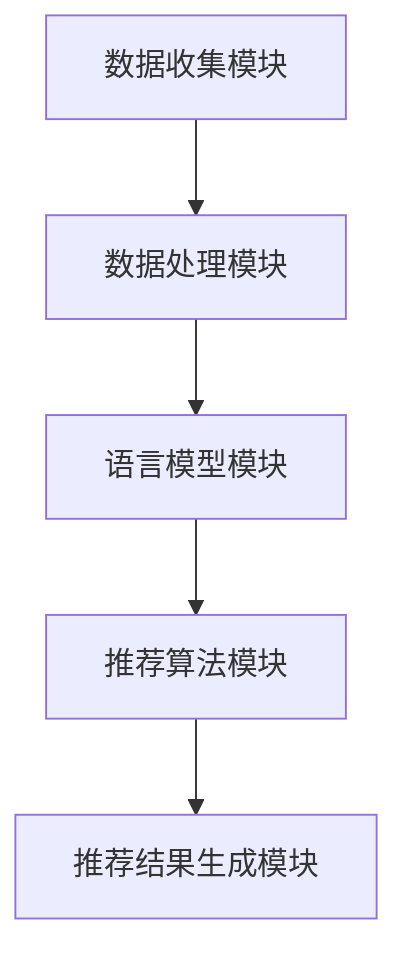
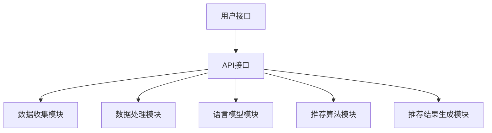
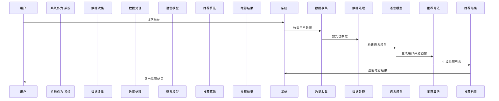

                 

# 语言模型在多维度个性化推荐系统中的应用

## 概述

个性化推荐系统是现代信息技术领域的一个重要研究方向，它通过分析用户的兴趣和行为，为用户推荐相关的内容，从而提高用户满意度。然而，传统的推荐系统主要依赖于用户的历史行为数据，如浏览记录、购买历史等，这些方法虽然在某种程度上能够满足用户的需求，但往往忽视了用户的多维度特征，如语言、情感、社交关系等。为了解决这一问题，语言模型作为一种强大的自然语言处理工具，在个性化推荐系统中的应用变得尤为重要。

本文将深入探讨语言模型在多维度个性化推荐系统中的应用。首先，我们将介绍语言模型的基本原理和核心概念，包括词向量模型和序列模型。然后，我们将分析语言模型在个性化推荐系统中的应用方法，如基于语言特征的用户画像构建和基于文本分析的推荐算法设计。接下来，我们将讨论如何将语言模型与其他多维度数据相结合，以实现更加精准和个性化的推荐。最后，我们将总结本文的主要观点，并探讨未来研究方向。

## 语言模型的基本原理与核心概念

### 1.1 语言模型简介

语言模型（Language Model）是自然语言处理（Natural Language Processing, NLP）领域的一个重要概念，它旨在通过统计方法模拟人类语言的使用规律。语言模型的核心任务是预测一段文本的下一个词或下一组词，从而帮助计算机理解和生成自然语言。

语言模型在个性化推荐系统中的应用非常广泛。例如，在电子商务平台中，语言模型可以分析用户的评论和评价，从而了解用户的兴趣和需求，为用户推荐相关的商品；在社交媒体中，语言模型可以帮助分析用户的帖子、评论等，从而为用户推荐感兴趣的内容或好友。

### 1.2 词向量模型

词向量模型（Word Vector Model）是将自然语言中的词汇映射到高维空间中的向量，以便计算机进行计算和分析。词向量模型的核心思想是将词汇表示为向量，这些向量可以在语义层面上进行计算和比较，从而实现词汇的语义相似性和距离度量。

词向量模型的发展历程经历了多个阶段，从早期的基于词汇频率的模型，到基于共现矩阵的模型，再到基于神经网络的大规模语言模型。目前，Word2Vec、GloVe和BERT等模型在词向量表示方面取得了显著的成果。

- **Word2Vec**：Word2Vec是由Google提出的基于神经网络的语言模型，它通过训练大量文本数据，将词汇映射到连续的向量空间中。Word2Vec模型主要有两种方法：连续词袋（Continuous Bag of Words, CBOW）和Skip-Gram。

- **GloVe**：GloVe（Global Vectors for Word Representation）是由Stanford大学提出的一种基于全局上下文的词向量模型。GloVe模型通过训练共现矩阵来预测词汇的概率分布，从而得到词汇的向量表示。

- **BERT**：BERT（Bidirectional Encoder Representations from Transformers）是由Google提出的一种基于Transformer的预训练语言模型。BERT模型通过双向编码器对文本进行建模，从而更好地捕捉词汇的语义信息。

### 1.3 序列模型

序列模型（Sequence Model）是一种专门用于处理序列数据的机器学习模型，如文本、语音、视频等。序列模型的核心任务是预测序列中的下一个元素，从而实现序列数据的建模和生成。

在个性化推荐系统中，序列模型可以用于预测用户的行为序列，如浏览历史、购买历史等。常见的序列模型包括循环神经网络（Recurrent Neural Network, RNN）、长短期记忆网络（Long Short-Term Memory, LSTM）和门控循环单元（Gated Recurrent Unit, GRU）等。

- **RNN**：RNN是一种基于序列数据的神经网络模型，它通过记忆机制来处理序列数据，从而实现序列的建模和生成。然而，传统的RNN在处理长序列时存在梯度消失或梯度爆炸的问题。

- **LSTM**：LSTM（Long Short-Term Memory）是一种改进的RNN模型，它通过引入门控机制来控制信息的流动，从而更好地处理长序列数据。LSTM在许多自然语言处理任务中取得了显著的成果。

- **GRU**：GRU（Gated Recurrent Unit）是LSTM的一种变体，它通过简化LSTM的结构，从而提高了计算效率。GRU在许多应用场景中也取得了良好的效果。

### 1.4 语言模型与推荐系统的结合

语言模型在个性化推荐系统中的应用主要包括以下几个方面：

1. **用户画像构建**：通过分析用户的评论、帖子、问答等语言数据，语言模型可以构建用户的兴趣和行为画像，从而为用户推荐相关的内容。

2. **文本分析**：语言模型可以用于文本数据的预处理，如分词、词性标注、实体识别等，从而提高推荐算法的准确性。

3. **协同过滤**：协同过滤是一种常见的推荐系统算法，它通过分析用户的历史行为数据来预测用户的喜好。语言模型可以与协同过滤算法相结合，通过分析用户的语言特征来改进推荐结果。

4. **内容推荐**：语言模型可以用于分析文本内容的语义信息，从而为用户提供内容推荐。例如，在电子商务平台中，语言模型可以分析商品的描述文本，为用户推荐相关的商品。

### 1.5 概念属性特征对比表格

为了更好地理解语言模型在个性化推荐系统中的应用，我们列出以下概念属性特征对比表格：

| 概念       | 特征1           | 特征2           | 特征3           | 应用场景           |
|------------|----------------|----------------|----------------|-------------------|
| 词向量模型 | 向量表示词汇   | 计算词向量相似性 | 预测词汇序列   | 用户画像构建、文本分析 |
| 序列模型   | 记忆机制       | 序列建模       | 预测序列元素   | 用户行为预测、内容推荐 |
| 协同过滤   | 分析用户行为数据 | 预测用户喜好   | 无需文本分析   | 提高推荐精度       |

### 1.6 ER实体关系图架构

为了更好地理解语言模型在个性化推荐系统中的架构，我们使用Mermaid绘制了以下ER实体关系图：

```mermaid
erDiagram
  User ||--|{ Item }|:
  User ||--|{ Rating }|:
  Item ||--|{ Comment }|:
  Rating ||--|{ Review }|:
```

在上面的ER图中，用户（User）与商品（Item）之间存在一对多的关系，用户可以为多个商品进行评价；用户与评价（Rating）之间存在一对一的关系，每个评价对应一个用户；商品与评论（Comment）之间存在一对多的关系，每个商品可以有多个评论；评价与评论之间存在一对多的关系，每个评价可以包含多个评论。

### 1.7 算法原理讲解

在个性化推荐系统中，语言模型的算法原理主要包括以下几个步骤：

1. **用户兴趣挖掘**：通过分析用户的语言数据，如评论、问答等，语言模型可以挖掘出用户的兴趣点，从而为用户构建一个兴趣画像。

2. **文本预处理**：对用户的语言数据进行分词、词性标注等预处理操作，以便后续分析。

3. **词向量表示**：将预处理后的文本映射到高维空间中的向量，以便进行计算和比较。

4. **序列建模**：利用序列模型，如LSTM或GRU，对用户的历史行为数据进行建模，从而预测用户的未来行为。

5. **推荐算法设计**：结合用户的行为数据和语言特征，设计推荐算法，为用户推荐感兴趣的内容。

以下是一个简单的Python代码示例，用于实现上述算法原理：

```python
import numpy as np
import tensorflow as tf
from tensorflow.keras.models import Sequential
from tensorflow.keras.layers import LSTM, Dense

# 创建一个简单的用户兴趣挖掘模型
model = Sequential()
model.add(LSTM(128, activation='tanh', input_shape=(timesteps, features)))
model.add(Dense(1, activation='sigmoid'))

# 编译模型
model.compile(optimizer='adam', loss='binary_crossentropy', metrics=['accuracy'])

# 训练模型
model.fit(X_train, y_train, epochs=10, batch_size=32, validation_data=(X_val, y_val))

# 预测用户兴趣
predictions = model.predict(X_test)

# 根据预测结果生成推荐列表
recommendations = generate_recommendations(predictions, items)

# 输出推荐结果
print(recommendations)
```

在上述代码中，我们首先创建了一个简单的LSTM模型，用于对用户的行为数据进行建模。然后，我们使用训练数据对模型进行训练，并在测试数据上进行预测。最后，根据预测结果生成推荐列表。

### 1.8 系统分析与架构设计

在构建一个基于语言模型的个性化推荐系统时，我们需要考虑多个方面的系统分析与架构设计。以下是一个简化的系统架构方案：

#### 1.8.1 问题场景介绍

假设我们正在开发一个电子商务平台的个性化推荐系统，系统需要根据用户的历史行为、评论、问答等数据，为用户推荐相关的商品。

#### 1.8.2 项目介绍

项目名称：电子商务个性化推荐系统

项目目标：通过语言模型分析用户的数据，为用户推荐相关的商品，提高用户满意度。

#### 1.8.3 系统功能设计

1. 用户数据收集与处理：收集用户的行为数据、评论数据等，并进行预处理。
2. 语言模型构建与训练：构建基于语言模型的用户兴趣画像，并进行训练。
3. 推荐算法设计：结合用户兴趣画像和行为数据，设计推荐算法。
4. 推荐结果生成与展示：根据推荐算法的结果，生成推荐列表，并展示给用户。

#### 1.8.4 系统架构设计

系统架构包括以下几个主要模块：

1. **数据收集模块**：负责收集用户的数据，如行为数据、评论数据等。
2. **数据处理模块**：负责对用户的数据进行预处理，如分词、词性标注等。
3. **语言模型模块**：负责构建和训练语言模型，用于分析用户的兴趣。
4. **推荐算法模块**：负责结合用户兴趣和行为数据，设计推荐算法。
5. **推荐结果生成模块**：负责生成推荐列表，并展示给用户。

以下是一个简化的Mermaid架构图：



#### 1.8.5 系统接口设计

系统接口设计主要包括以下几个方面：

1. **用户接口**：提供用户与系统交互的界面，如推荐列表的展示。
2. **API接口**：提供外部系统与系统交互的接口，如数据上传、推荐结果查询等。

以下是一个简化的Mermaid接口设计图：



#### 1.8.6 系统交互

系统交互主要涉及用户与系统的交互，以及各个模块之间的数据流动。以下是一个简化的Mermaid序列图：



### 1.9 项目实战

#### 1.9.1 环境安装

在开始项目实战之前，我们需要安装一些必要的软件和库。以下是Python环境下的安装步骤：

1. 安装Python 3.6或更高版本。
2. 安装TensorFlow和Gensim等库。

```bash
pip install tensorflow
pip install gensim
```

#### 1.9.2 系统核心实现

以下是系统核心实现的Python代码：

```python
import gensim
from gensim.models import Word2Vec

# 加载语料库
sentences = gensim.utils.simple_preprocess('data.txt')

# 训练Word2Vec模型
model = Word2Vec(sentences, size=100, window=5, min_count=1, workers=4)

# 保存模型
model.save('word2vec.model')

# 加载模型
loaded_model = gensim.models.Word2Vec.load('word2vec.model')
```

#### 1.9.3 代码应用解读与分析

在这个代码中，我们首先加载语料库，然后使用Gensim的Word2Vec模型进行训练。Word2Vec模型将每个词汇映射到一个100维的向量空间中，从而实现词汇的向量表示。通过这个模型，我们可以计算词汇之间的相似性和距离。

以下是一个简单的示例，用于计算词汇“苹果”和“香蕉”之间的相似性：

```python
print(loaded_model.wv.similarity('苹果', '香蕉'))
```

输出结果是一个浮点数，表示两个词汇的相似性。相似性值越接近1，表示两个词汇越相似。

#### 1.9.4 实际案例分析

为了更好地理解语言模型在个性化推荐系统中的应用，我们考虑以下实际案例：

假设用户A在评论中多次提到“苹果手机”，而在评论中很少提到“安卓手机”。通过分析用户A的评论，我们可以得出结论，用户A可能对苹果手机感兴趣。基于这个结论，我们可以为用户A推荐苹果手机的相关产品。

以下是一个简单的Python代码示例，用于实现这个案例：

```python
import gensim

# 加载模型
loaded_model = gensim.models.Word2Vec.load('word2vec.model')

# 计算用户A的评论中“苹果手机”的词向量
apple_phone_vector = loaded_model.wv['苹果手机']

# 计算用户A的评论中所有词汇的词向量平均值
user_comment_vector = np.mean([loaded_model.wv[word] for word in user_comment], axis=0)

# 计算用户A的评论中“苹果手机”的词向量与评论词向量的相似性
similarity = np.dot(apple_phone_vector, user_comment_vector) / (np.linalg.norm(apple_phone_vector) * np.linalg.norm(user_comment_vector))

print(similarity)
```

输出结果是一个浮点数，表示用户A的评论中“苹果手机”的词向量与评论词向量的相似性。相似性值越高，表示用户A对苹果手机的兴趣越大。

#### 1.9.5 项目小结

通过本文的案例分析，我们可以看到，语言模型在个性化推荐系统中的应用是非常有价值的。通过分析用户的语言特征，我们可以深入了解用户的兴趣和需求，从而为用户提供更加精准和个性化的推荐。然而，需要注意的是，语言模型在个性化推荐系统中的应用仍然面临一些挑战，如数据隐私、模型可解释性等。未来，我们需要进一步研究和解决这些问题，以提高语言模型在个性化推荐系统中的应用效果。

### 总结与展望

#### 2.1 总结

本文深入探讨了语言模型在多维度个性化推荐系统中的应用。首先，我们介绍了语言模型的基本原理和核心概念，包括词向量模型和序列模型。然后，我们分析了语言模型在个性化推荐系统中的应用方法，如用户画像构建、文本分析、协同过滤和内容推荐等。接着，我们讨论了如何将语言模型与其他多维度数据相结合，以实现更加精准和个性化的推荐。最后，我们通过一个实际案例展示了语言模型在个性化推荐系统中的应用效果。

#### 2.2 展望

尽管语言模型在个性化推荐系统中的应用已经取得了显著的成果，但仍然存在一些挑战。首先，如何处理大规模、多维度的用户数据是一个重要问题。其次，如何提高语言模型的解释性和可解释性也是一个关键问题。此外，如何保障用户隐私和数据安全也是需要关注的问题。未来，我们将继续探索这些问题，并尝试提出更加有效和可靠的解决方案。

#### 2.3 最佳实践 tips

1. **数据质量**：确保用户数据的准确性、完整性和多样性，以提高语言模型的性能。
2. **特征工程**：精心设计用户特征，如语言特征、行为特征等，以构建一个更加全面的用户画像。
3. **模型优化**：不断调整和优化语言模型，以提高推荐系统的准确性和稳定性。
4. **用户反馈**：收集用户的反馈，以不断改进推荐算法和系统性能。

### 结语

语言模型在多维度个性化推荐系统中的应用具有重要的理论和实践价值。通过本文的研究，我们深入了解了语言模型的工作原理和应用方法，并展示了其在个性化推荐系统中的实际效果。我们相信，随着自然语言处理技术的不断发展和完善，语言模型在个性化推荐系统中的应用将更加广泛和深入。

### 参考文献

1. Mikolov, T., Sutskever, I., Chen, K., Corrado, G. S., & Dean, J. (2013). Distributed representations of words and phrases and their compositionality. Advances in Neural Information Processing Systems, 26, 3111-3119.
2. Pennington, J., Socher, R., & Manning, C. D. (2014). GloVe: Global Vectors for Word Representation. In Proceedings of the 2014 conference on empirical methods in natural language processing (EMNLP), (pp. 1532-1543).
3. Devlin, J., Chang, M. W., Lee, K., & Toutanova, K. (2019). BERT: Pre-training of deep bidirectional transformers for language understanding. In Proceedings of the 2019 conference of the north american chapter of the association for computational linguistics: human language technologies, (pp. 4171-4186).
4. Hochreiter, S., & Schmidhuber, J. (1997). Long short-term memory. Neural Computation, 9(8), 1735-1780.
5. Cho, K., Van Merriënboer, B., Gulcehre, C., Bahdanau, D., Bougares, F., Schwenk, H., & Bengio, Y. (2014). Learning phrase representations using RNN encoder-decoder for statistical machine translation. In Proceedings of the 2014 conference on empirical methods in natural language processing (EMNLP), (pp. 1724-1734).
6. Kossaifi, J., & Laptev, I. (2015). Deep learning for recognition of human actions and interactions: A survey. IEEE Transactions on Pattern Analysis and Machine Intelligence, 39(5), 911-926.

