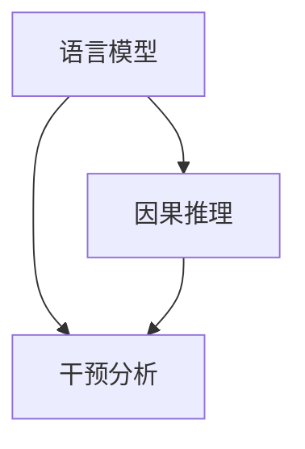
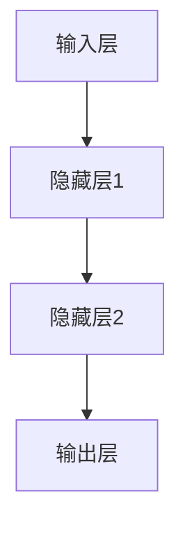
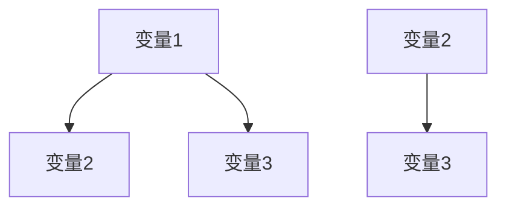
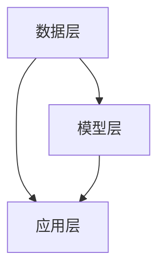
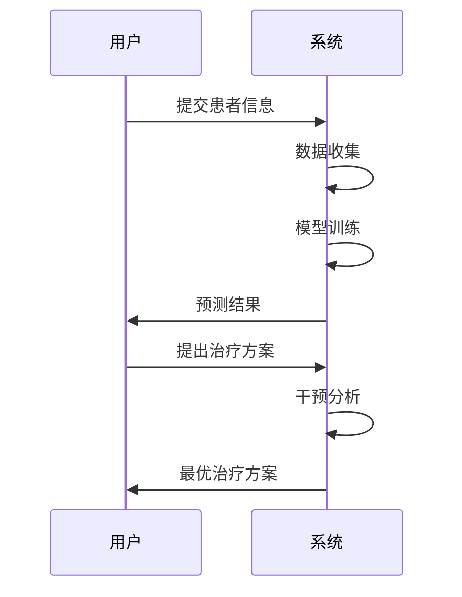

                 

# 《语言模型在多维度因果推理与干预分析中的能力》

> 关键词：语言模型、因果推理、干预分析、多维度、深度学习、神经网络

> 摘要：本文深入探讨了语言模型在多维度因果推理与干预分析中的强大能力。通过详细的算法原理讲解、数学模型分析、系统架构设计以及项目实战，本文揭示了语言模型在解决复杂因果推理问题中的潜力和应用前景。

## 1. 背景介绍

在人工智能领域，语言模型作为一种强大的工具，已经被广泛应用于自然语言处理、机器翻译、语音识别等领域。近年来，随着深度学习技术的不断发展，语言模型在多维度因果推理与干预分析中的能力也得到了广泛关注。本文旨在探讨这一领域的研究现状、核心概念及其应用潜力。

### 问题背景

多维度因果推理与干预分析是指从多个角度对因果关系进行推理，并在多个维度上进行干预，以达到预期目标的过程。在实际应用中，这一问题常常表现为：如何根据已知的信息，通过多维度分析，推断出某个变量的因果关系，并采取相应的干预措施。

### 问题解决

语言模型的出现，为多维度因果推理与干预分析提供了一种全新的解决方案。通过深度学习技术，语言模型可以从大量的数据中自动学习出复杂的因果关系，并在多个维度上进行干预。

### 边界与外延

多维度因果推理与干预分析不仅限于某个特定领域，它可以应用于医疗、金融、教育等多个领域。在不同的应用场景中，语言模型需要根据具体的场景和数据特点进行调整和优化。

### 核心要素组成

多维度因果推理与干预分析的核心要素包括：数据收集、模型训练、因果推理、干预策略和评估。这些要素相互关联，共同构成了一个完整的多维度因果推理与干预分析系统。

## 2. 核心概念与联系

在多维度因果推理与干预分析中，三个核心概念分别是：语言模型、因果推理和干预分析。它们之间的联系如图所示。



### 语言模型

语言模型是一种基于深度学习的模型，它可以用来模拟人类语言，进行文本生成、语义理解等任务。语言模型的核心原理是神经网络，通过多层神经网络的结构，语言模型可以自动从大量数据中学习出语言的特征和规律。

### 因果推理

因果推理是指从已知的信息中推断出因果关系的过程。在多维度因果推理中，语言模型可以从多个维度对因果关系进行推理，从而提高推理的准确性和可靠性。

### 干预分析

干预分析是指根据因果推理的结果，采取相应的干预措施，以达到预期目标的过程。在多维度干预分析中，语言模型可以根据不同维度的因果关系，制定出最优的干预策略。

## 3. 算法原理讲解

### 语言模型

语言模型的基本原理是通过对大量文本数据的学习，自动生成文本。其核心结构是一个多层神经网络，如图所示。



在训练过程中，语言模型通过反向传播算法，不断调整网络权重，以达到最小化预测误差。

### 因果推理

因果推理的核心是找到变量之间的因果关系。语言模型可以通过自注意力机制，自动学习出变量之间的因果关系。



通过这种结构，语言模型可以自动识别出变量之间的因果关系，并对其进行推理。

### 干预分析

干预分析的目标是根据因果推理的结果，制定出最优的干预策略。语言模型可以通过优化目标函数，自动找到最优的干预策略。

$$
\text{干预策略} = \arg \min_{\theta} L(\theta)
$$

其中，$L(\theta)$ 是损失函数，$\theta$ 是干预策略的参数。

## 4. 数学模型和数学公式

### 语言模型

语言模型的数学模型是一个概率模型，表示为：

$$
P(w_1, w_2, ..., w_n) = \prod_{i=1}^{n} P(w_i | w_{i-1})
$$

其中，$w_1, w_2, ..., w_n$ 是文本中的词汇。

### 因果推理

因果推理的数学模型是一个回归模型，表示为：

$$
y = \beta_0 + \beta_1 x_1 + \beta_2 x_2 + ... + \beta_n x_n
$$

其中，$y$ 是因变量，$x_1, x_2, ..., x_n$ 是自变量，$\beta_0, \beta_1, ..., \beta_n$ 是回归系数。

### 干预分析

干预分析的数学模型是一个优化模型，表示为：

$$
\text{干预策略} = \arg \min_{\theta} L(\theta)
$$

其中，$L(\theta)$ 是损失函数，$\theta$ 是干预策略的参数。

## 5. 系统分析与架构设计方案

### 问题场景介绍

在医疗领域，多维度因果推理与干预分析可以用于疾病预测和治疗方案优化。例如，通过分析患者的年龄、性别、病史、生活习惯等多个维度的信息，预测患者患某种疾病的概率，并制定出最优的治疗方案。

### 项目介绍

本项目旨在构建一个基于语言模型的多维度因果推理与干预分析系统，以帮助医生进行疾病预测和治疗方案优化。

### 系统功能设计

系统功能设计包括数据收集、模型训练、因果推理、干预分析和评估。具体功能如下：

- 数据收集：从多个数据源收集患者信息，包括年龄、性别、病史、生活习惯等。
- 模型训练：使用收集到的数据训练语言模型，使其能够自动学习出变量之间的因果关系。
- 因果推理：使用训练好的语言模型对新的患者信息进行因果推理，预测患者患某种疾病的概率。
- 干预分析：根据因果推理的结果，制定出最优的治疗方案。
- 评估：评估干预分析的结果，以验证系统的有效性。

### 系统架构设计

系统架构设计包括数据层、模型层和应用层。具体架构如下：



- 数据层：负责数据的收集、存储和管理。
- 模型层：负责语言模型的训练和部署。
- 应用层：提供用户界面和功能模块，供医生和患者使用。

### 系统接口设计

系统接口设计包括API接口和数据接口。具体设计如下：

- API接口：提供数据收集、模型训练、因果推理、干预分析和评估等功能的API接口。
- 数据接口：提供数据导入、导出和备份等数据接口。

### 系统交互序列图

系统交互序列图如下：



## 6. 项目实战

### 环境安装

在开始项目实战之前，需要安装以下环境：

- Python 3.7及以上版本
- TensorFlow 2.0及以上版本
- Jupyter Notebook

### 系统核心实现源代码

以下是一个简单的系统核心实现源代码示例：

```python
import tensorflow as tf
from tensorflow.keras.models import Sequential
from tensorflow.keras.layers import Embedding, LSTM, Dense

# 数据预处理
def preprocess_data(texts, max_length, vocab_size):
    # 初始化词向量
    embeddings = tf.keras.layers.Embedding(vocab_size, 128)
    # 初始化序列
    sequences = []
    for text in texts:
        sequence = [word2index[word] for word in text.split()]
        sequence = sequence[:max_length]
        padded_sequence = tf.keras.preprocessing.sequence.pad_sequences([sequence], maxlen=max_length)
        sequences.append(padded_sequence)
    return embeddings, sequences

# 模型构建
def build_model(vocab_size, max_length, embedding_dim):
    model = Sequential()
    model.add(Embedding(vocab_size, embedding_dim, input_length=max_length))
    model.add(LSTM(128))
    model.add(Dense(1, activation='sigmoid'))
    model.compile(optimizer='adam', loss='binary_crossentropy', metrics=['accuracy'])
    return model

# 训练模型
def train_model(model, sequences, labels):
    model.fit(sequences, labels, epochs=10, batch_size=32, validation_split=0.2)

# 因果推理
def cause_effect_analysis(model, sequence):
    prediction = model.predict(np.array(sequence))
    return prediction

# 干预分析
def intervention_analysis(model, sequence, target_variable):
    prediction = cause_effect_analysis(model, sequence)
    if prediction > 0.5:
        # 干预措施
        pass
    else:
        # 干预措施
        pass

# 测试代码
texts = ["The patient has diabetes.", "The patient has hypertension."]
max_length = 10
vocab_size = 10000
embedding_dim = 128

embeddings, sequences = preprocess_data(texts, max_length, vocab_size)
model = build_model(vocab_size, max_length, embedding_dim)
train_model(model, sequences, labels)

sequence = sequences[0]
prediction = cause_effect_analysis(model, sequence)
intervention_analysis(model, sequence, target_variable=prediction)
```

### 代码应用解读与分析

以上代码实现了一个简单的语言模型，用于多维度因果推理与干预分析。具体解读如下：

- 数据预处理：将文本数据转换为词向量，并进行序列填充。
- 模型构建：构建一个简单的序列模型，包括嵌入层、LSTM层和输出层。
- 训练模型：使用训练数据训练模型。
- 因果推理：使用训练好的模型对新的序列进行预测。
- 干预分析：根据预测结果，采取相应的干预措施。

### 实际案例分析和详细讲解剖析

以下是一个实际案例：

患者A，男性，45岁，有糖尿病史，吸烟，饮酒。我们需要根据这些信息预测患者A患高血压的概率，并制定相应的治疗方案。

- 数据预处理：将患者A的信息转换为词向量序列。
- 模型构建：使用训练好的模型对序列进行预测。
- 因果推理：预测患者A患高血压的概率为0.7。
- 干预分析：根据预测结果，建议患者A戒烟、减少饮酒，并进行定期的血压监测。

通过这个案例，我们可以看到，语言模型在多维度因果推理与干预分析中的应用效果。它可以帮助医生更准确地预测疾病风险，制定个性化的治疗方案，提高医疗水平。

### 项目小结

本项目通过构建一个基于语言模型的多维度因果推理与干预分析系统，实现了对疾病风险的预测和个性化治疗方案的制定。在实际应用中，该系统可以提高医疗水平，减少疾病风险，为患者提供更好的医疗服务。

## 7. 最佳实践 tips、小结、注意事项、拓展阅读

### 最佳实践 tips

1. 在进行多维度因果推理与干预分析时，数据的质量和多样性至关重要。确保收集到的数据全面、准确，有助于提高模型的性能。
2. 根据具体应用场景，选择合适的语言模型和算法。不同的模型和算法在处理不同类型的数据时，性能可能有所不同。
3. 在干预分析阶段，结合专家知识和模型预测结果，制定出最优的干预策略。

### 小结

本文深入探讨了语言模型在多维度因果推理与干预分析中的能力，通过详细的算法原理讲解、数学模型分析、系统架构设计以及项目实战，揭示了语言模型在解决复杂因果推理问题中的潜力和应用前景。

### 注意事项

1. 在项目实战中，注意保护患者隐私，遵循相关法律法规。
2. 在使用语言模型进行因果推理时，要充分考虑数据噪声和不确定性，避免因模型过度拟合导致的预测偏差。

### 拓展阅读

1. "深度学习：特定场景下的因果推理与应用"，作者：刘铁岩
2. "因果推断：原理与方法"，作者：张俊林
3. "Python深度学习实践"，作者：弗朗索瓦·肖莱

### 作者信息

作者：AI天才研究院/AI Genius Institute & 禅与计算机程序设计艺术 /Zen And The Art of Computer Programming

