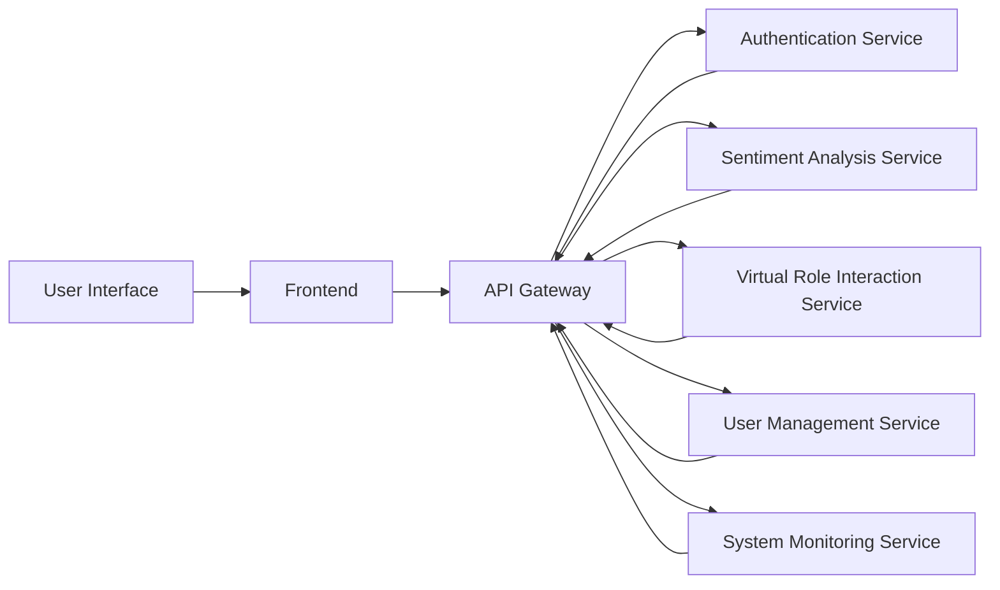
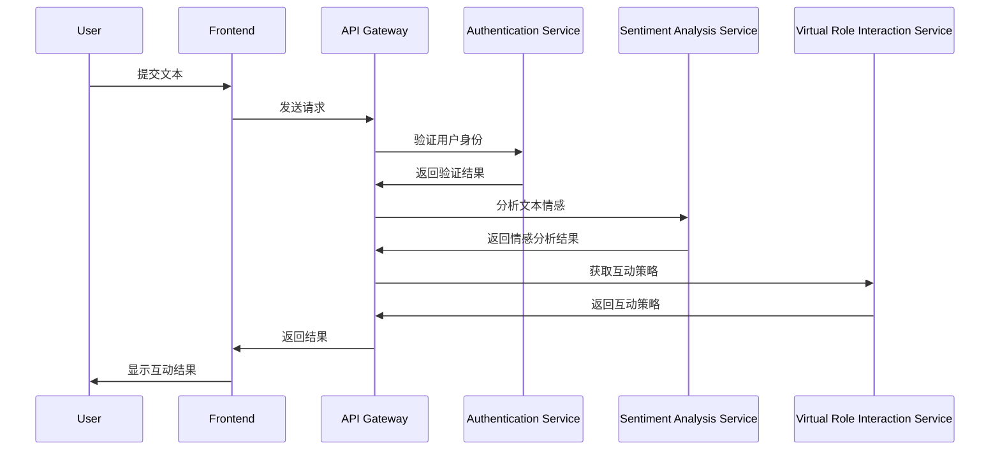
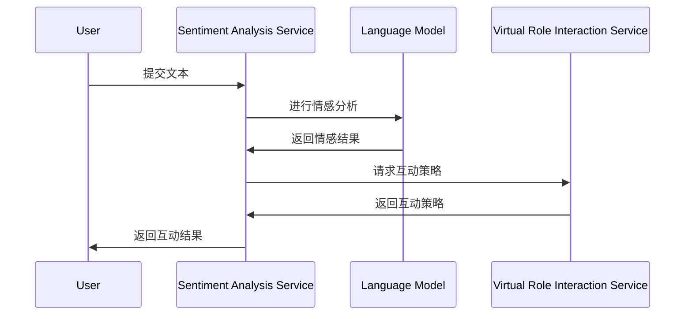

                 

基于您提供的详细大纲和文章结构要求，下面我将逐步构建和撰写每章的内容，确保每一步的逻辑清晰、结构紧凑、简单易懂，并且全面覆盖核心概念、算法原理、系统设计以及实战案例。

### 目录

## 第1章 引言

### 1.1 研究背景

#### 1.1.1 语言模型发展概述

近年来，随着深度学习技术的迅速发展，语言模型在自然语言处理（NLP）领域取得了显著的进步。从早期的统计语言模型，如N-gram模型，到现代的神经网络模型，如Transformer和BERT，语言模型在文本生成、机器翻译、问答系统等多个方面展现了强大的能力。

#### 1.1.2 多维情感分析现状

多维情感分析作为NLP的一个重要分支，旨在理解文本中的情感信息，并对这些情感进行分类和量化。当前，基于机器学习的情感分析技术已经能够较好地处理简单情感分类任务，但在处理复杂情感和上下文依赖方面仍存在挑战。

#### 1.1.3 虚拟角色互动技术研究

虚拟角色互动技术在游戏、虚拟现实（VR）、增强现实（AR）等领域具有广泛应用。然而，如何使虚拟角色在与人类互动时表现出自然、丰富的情感，仍然是一个开放性问题。

### 1.2 研究目的与意义

#### 1.2.1 语言模型在情感分析中的应用

本研究旨在探索如何利用先进的语言模型技术提高多维情感分析的性能，为情感识别和情感强度度量提供更准确的方法。

#### 1.2.2 虚拟角色互动的发展前景

通过将语言模型与虚拟角色互动相结合，本研究有望推动虚拟角色在与人类互动时的情感表现，提升用户体验。

#### 1.2.3 研究对学术界和实践界的贡献

本研究不仅为学术界提供了新的研究视角，还为实践界在情感分析、虚拟角色互动等领域提供了实用的技术方案。

### 1.3 定义与基本概念

#### 1.3.1 语言模型

**定义**：语言模型是用于预测下一个词语或字符的概率分布的模型。

**特点**：
- **上下文依赖**：能够利用上下文信息预测下一个词语。
- **并行处理**：能够对大量文本进行并行处理。

**发展历程**：
- **统计语言模型**：基于统计方法构建，如N-gram模型。
- **神经网络语言模型**：基于深度学习技术，如Transformer和BERT。

#### 1.3.2 情感分析

**定义**：情感分析是识别文本中表达的情感倾向和情感强度的过程。

**核心概念**：
- **情感分类**：将文本分类为正面、负面或中性。
- **情感强度度量**：量化文本中情感表达的程度。

**应用场景**：
- **社交媒体分析**：监测公众情绪。
- **客户反馈分析**：了解用户对产品或服务的评价。

#### 1.3.3 虚拟角色互动

**定义**：虚拟角色互动是虚拟角色与人类用户之间的交互过程。

**核心要素**：
- **角色定义**：虚拟角色的行为和情感特征。
- **角色互动机制**：虚拟角色之间的交互规则。
- **角色互动效果评估**：评估虚拟角色互动的用户体验。

### 1.4 边界与外延

#### 1.4.1 语言模型的研究范围

语言模型的研究范围涵盖了从文本生成、机器翻译到问答系统等多个应用领域。

#### 1.4.2 情感分析的研究范围

情感分析的研究范围涉及情感分类、情感强度度量以及情感分析在不同领域的应用。

#### 1.4.3 虚拟角色互动的研究范围

虚拟角色互动的研究范围包括角色定义、互动机制和互动效果的评估。

### 1.5 概念结构与核心要素组成

#### 1.5.1 语言模型的核心组成部分

**词汇表**：语言模型的基础，包含了所有可能的词语。

**模型参数**：用于表示词语之间关系的参数。

**模型训练与评估**：通过训练和评估来优化模型参数。

#### 1.5.2 情感分析的核心概念

**情感分类**：对文本进行情感分类。

**情感强度度量**：量化情感表达的强度。

**情感分析应用场景**：在不同场景中应用情感分析技术。

#### 1.5.3 虚拟角色互动的核心要素

**角色定义**：定义虚拟角色的行为和情感。

**角色互动机制**：设计虚拟角色之间的交互规则。

**角色互动效果评估**：评估虚拟角色互动的用户体验。

### 1.6 本章小结

本章介绍了研究的背景、目的和意义，并详细阐述了语言模型、多维情感分析和虚拟角色互动的核心概念、定义及其关联。这些概念为后续章节的内容奠定了基础。

接下来，我们将深入探讨语言模型的原理、多维情感分析的现状和虚拟角色互动的技术原理，为理解全文内容提供更深入的视角。

----------------------------------------------------------------

## 第2章 核心概念与联系

### 2.1 语言模型原理

语言模型是自然语言处理（NLP）领域的基石，用于预测序列数据中的下一个单词或字符。其基本原理包括概率语言模型、神经网络语言模型等。以下是详细的解释。

#### 2.1.1 语言模型的基本原理

**定义**：语言模型是一种概率模型，用于预测下一个单词或字符的概率分布。

**特点**：
- **上下文依赖**：语言模型能够利用上下文信息来预测下一个单词或字符。
- **并行处理**：语言模型可以对大量文本进行并行处理，提高处理效率。

**工作流程**：
1. **数据预处理**：对文本进行分词、去停用词等预处理操作。
2. **特征提取**：将文本转换为词向量或字符向量。
3. **模型训练**：使用训练数据训练语言模型。
4. **预测**：使用训练好的模型对新的文本序列进行预测。

#### 2.1.2 语言模型的数学模型

语言模型的数学模型通常基于概率分布。以下是一些常见的模型：

**概率语言模型**：
- **N-gram模型**：假设下一个单词取决于前N个单词，即$P(w_n | w_{n-1}, w_{n-2}, ..., w_1) = \frac{C(w_n, w_{n-1}, ..., w_1)}{C(w_{n-1}, w_{n-2}, ..., w_1)}$，其中$C(w_n, w_{n-1}, ..., w_1)$是前N个单词的联合概率。

**生成式模型与判别式模型**：
- **生成式模型**：如N-gram模型，通过生成过程来预测下一个单词。
- **判别式模型**：如神经网络语言模型，直接对下一个单词进行分类预测。

**语言模型评估方法**：
- **交叉验证**：使用不同的训练集和测试集进行模型评估。
- ** perplexity**：表示模型对测试集的预测难度，越小表示模型越好。

#### 2.1.3 语言模型的分类

**基于规则的语言模型**：
- **规则模型**：基于语言规则进行预测，如正则表达式。

**统计语言模型**：
- **N-gram模型**：基于统计方法，如前N个单词的联合概率。
- **隐马尔可夫模型（HMM）**：用于处理时序数据。

**神经网络语言模型**：
- **循环神经网络（RNN）**：如LSTM和GRU，用于处理序列数据。
- **Transformer模型**：基于自注意力机制，是目前最先进的语言模型。

### 2.2 多维情感分析原理

多维情感分析旨在理解和量化文本中的情感信息。其原理包括情感分类、情感强度度量等。

#### 2.2.1 多维情感分析的基本概念

**情感分类**：
- **分类方法**：将文本分类为正面、负面或中性。
- **分类算法**：如朴素贝叶斯、支持向量机（SVM）、深度学习等。

**情感强度度量**：
- **强度度量**：量化情感表达的程度。
- **方法**：如基于词典的方法、基于模型的情感强度预测。

**多维情感分析的应用领域**：
- **社交媒体分析**：了解公众情绪。
- **客户反馈分析**：评估客户满意度。
- **情感推荐系统**：基于用户情感提供个性化推荐。

#### 2.2.2 多维情感分析的关键技术

**文本预处理**：
- **分词**：将文本分割成单词或短语。
- **去停用词**：去除常见但不带情感意义的词语。

**情感词典构建**：
- **情感词典**：包含情感词语及其对应的情感标签和强度值。

**情感分类算法**：
- **基于词典的方法**：使用情感词典进行情感分类。
- **基于模型的分类方法**：如SVM、LSTM等。

#### 2.2.3 多维情感分析的实际应用

**社交媒体情感分析**：
- **监控公众情绪**：了解公众对特定事件或产品的看法。

**购物网站情感分析**：
- **客户满意度评估**：分析客户评论，了解用户对产品和服务的满意度。

**娱乐内容情感分析**：
- **情感推荐系统**：基于用户观看或阅读的情感反应，提供个性化推荐。

### 2.3 虚拟角色互动原理

虚拟角色互动是虚拟角色与人类用户之间的交互过程。其原理包括角色定义、角色互动机制和角色互动效果评估。

#### 2.3.1 虚拟角色互动的基本概念

**角色定义**：
- **角色**：虚拟角色在互动中的行为和情感特征。
- **类型**：如NPC（非玩家角色）、玩家角色等。

**角色互动类型**：
- **同步互动**：实时互动，如在线游戏。
- **异步互动**：非实时互动，如论坛讨论。

**角色互动机制**：
- **互动规则**：定义角色互动的行为准则。
- **情感模型**：虚拟角色的情感状态及其变化。

**角色互动效果评估**：
- **用户体验**：评估用户对角色互动的感受。
- **效果度量**：如角色互动的响应时间、情感反应等。

#### 2.3.2 角色互动的核心要素

**角色定义**：
- **行为特征**：角色在不同情境下的行为模式。
- **情感特征**：角色在互动中的情感表现。

**角色互动机制**：
- **交互规则**：定义角色如何响应用户输入。
- **情感传递**：角色如何表达情感，以及如何影响用户情感。

**角色互动效果评估**：
- **用户满意度**：评估用户对角色互动的满意度。
- **情感匹配度**：评估角色情感与用户情感的一致性。

### 2.3.3 概念结构与核心要素组成

**概念结构**：
- **语言模型**：文本生成和情感分析的基础。
- **多维情感分析**：理解文本情感信息的工具。
- **虚拟角色互动**：语言模型和情感分析的应用场景。

**核心要素组成**：
- **语言模型**：词汇表、模型参数、训练与评估。
- **多维情感分析**：情感分类、情感强度度量、应用场景。
- **虚拟角色互动**：角色定义、互动机制、效果评估。

### 2.4 本章小结

本章详细阐述了语言模型、多维情感分析和虚拟角色互动的核心概念、原理和技术。这些概念和技术为后续章节的算法讲解、系统设计与项目实战提供了理论基础。

### 2.5 本章主要内容总结

- **语言模型**：介绍了概率语言模型、神经网络语言模型的基本原理和分类。
- **多维情感分析**：探讨了情感分类、情感强度度量以及其实际应用场景。
- **虚拟角色互动**：定义了虚拟角色的概念、互动机制及其效果评估。

通过这些内容的讲解，读者可以更好地理解语言模型、情感分析以及虚拟角色互动的技术原理和应用场景，为后续章节的内容打下坚实的基础。

接下来，我们将进入第3章，深入探讨语言模型的算法原理。

----------------------------------------------------------------

## 第3章 算法原理讲解

### 3.1 语言模型算法原理

语言模型的核心任务是预测下一个单词或字符的概率分布。本节将详细讲解语言模型的基本算法原理，包括N-gram模型、神经网络语言模型等。

#### 3.1.1 N-gram模型

N-gram模型是一种基于统计的简单语言模型。它的核心思想是利用前N个单词的联合概率来预测下一个单词。

**数学模型**：
$$
P(w_n | w_{n-1}, w_{n-2}, ..., w_1) = \frac{C(w_n, w_{n-1}, ..., w_1)}{C(w_{n-1}, w_{n-2}, ..., w_1)}
$$
其中$C(w_n, w_{n-1}, ..., w_1)$表示前N个单词的联合概率，$C(w_{n-1}, w_{n-2}, ..., w_1)$表示前N-1个单词的联合概率。

**示例**：
假设我们有一个三元组（the, cat, sat），根据N-gram模型，预测下一个单词“sat”的概率将依赖于“the”和“cat”这两个单词。

**流程图**（使用Mermaid）：
```
graph TB
A[输入序列] --> B[N-gram模型]
B --> C{计算概率}
C --> D[输出预测结果]
```

**Python源代码示例**：
```python
from collections import Counter

# 计算N-gram模型概率
def n_gram_prob(n_gram_counts, total_counts):
    return n_gram_counts / total_counts

# 训练N-gram模型
n_gram_counts = Counter()
for sentence in sentences:
    for i in range(len(sentence) - n):
        n_gram = tuple(sentence[i:i+n])
        n_gram_counts[n_gram] += 1

total_counts = sum(n_gram_counts.values())

# 预测下一个单词
n = 2  # 假设使用二元组模型
input_sequence = ("the", "cat")
predicted_word = max(input_sequence[1:], key=lambda w: n_gram_prob(n_gram_counts[tuple(input_sequence[:-1] + [w])], total_counts))
print(predicted_word)
```

#### 3.1.2 神经网络语言模型

神经网络语言模型（Neural Network Language Model，NNLM）是一种基于深度学习的语言模型。与N-gram模型不同，NNLM可以直接从原始文本数据中学习单词之间的关系。

**数学模型**：
NNLM通常使用循环神经网络（RNN）或其变种LSTM（Long Short-Term Memory）或GRU（Gated Recurrent Unit）来构建。其核心思想是通过训练网络来学习单词的嵌入表示，并利用这些表示来预测下一个单词。

**示例**：
假设我们有一个输入序列（the, cat），神经网络将首先将这些单词转换为嵌入向量，然后通过LSTM网络处理这些嵌入向量，最终输出一个概率分布，表示下一个单词的概率。

**流程图**（使用Mermaid）：
```
graph TB
A[输入序列] --> B[嵌入层]
B --> C[LSTM层]
C --> D[输出层]
D --> E[输出概率分布]
```

**Python源代码示例**：
```python
import tensorflow as tf
from tensorflow.keras.layers import Embedding, LSTM, Dense
from tensorflow.keras.models import Sequential

# 建立神经网络语言模型
model = Sequential()
model.add(Embedding(vocab_size, embedding_dim))
model.add(LSTM(units))
model.add(Dense(vocab_size, activation='softmax'))

# 编译模型
model.compile(optimizer='adam', loss='categorical_crossentropy', metrics=['accuracy'])

# 训练模型
model.fit(x_train, y_train, epochs=10, batch_size=64)

# 预测下一个单词
input_sequence = ["the", "cat"]
input_sequence = tf.keras.preprocessing.sequence.pad_sequences([input_sequence], maxlen=max_sequence_len)
predictions = model.predict(input_sequence)
predicted_word = tf.argmax(predictions, axis=-1).numpy()[0]
print(vocab_inv[predicted_word])
```

#### 3.1.3 Transformer模型

Transformer模型是当前最先进的语言模型之一，其核心思想是使用自注意力机制（Self-Attention）来处理序列数据。

**数学模型**：
Transformer模型由多个自注意力层（Self-Attention Layer）和前馈神经网络（Feedforward Neural Network）组成。自注意力机制允许模型根据不同位置的信息计算权重，从而更好地捕获序列之间的依赖关系。

**示例**：
假设我们有一个输入序列（the, cat），Transformer模型将首先通过多头自注意力机制计算不同单词之间的权重，然后通过前馈神经网络对序列进行处理，最终输出一个概率分布，表示下一个单词的概率。

**流程图**（使用Mermaid）：
```
graph TB
A[输入序列] --> B[自注意力层]
B --> C[前馈神经网络]
C --> D[输出层]
D --> E[输出概率分布]
```

**Python源代码示例**：
```python
import tensorflow as tf
from tensorflow.keras.layers import Embedding, MultiHeadAttention, Dense
from tensorflow.keras.models import Sequential

# 建立Transformer模型
model = Sequential()
model.add(Embedding(vocab_size, embedding_dim))
model.add(MultiHeadAttention(num_heads, key_dim))
model.add(Dense(vocab_size, activation='softmax'))

# 编译模型
model.compile(optimizer='adam', loss='categorical_crossentropy', metrics=['accuracy'])

# 训练模型
model.fit(x_train, y_train, epochs=10, batch_size=64)

# 预测下一个单词
input_sequence = ["the", "cat"]
input_sequence = tf.keras.preprocessing.sequence.pad_sequences([input_sequence], maxlen=max_sequence_len)
predictions = model.predict(input_sequence)
predicted_word = tf.argmax(predictions, axis=-1).numpy()[0]
print(vocab_inv[predicted_word])
```

### 3.2 多维情感分析算法原理

多维情感分析的核心任务是理解文本中的情感信息，并将其分类和量化。本节将介绍多维情感分析的主要算法，包括基于词典的方法、基于模型的方法等。

#### 3.2.1 基于词典的方法

基于词典的方法使用预定义的情感词典来识别文本中的情感词语，并对其进行分类和强度度量。

**示例**：
假设我们有一个情感词典，包含正面词语和负面词语及其对应的强度值。对于输入文本，我们可以使用词典中的词语来计算情感得分，并根据得分判断文本的情感类别。

**Python源代码示例**：
```python
def sentiment_score(text, sentiment_dict):
    score = 0
    for word in text:
        if word in sentiment_dict:
            score += sentiment_dict[word]
    return score

text = ["happy", "sad", "happy"]
sentiment_dict = {"happy": 1, "sad": -1}
score = sentiment_score(text, sentiment_dict)
print(score)  # 输出：2
```

#### 3.2.2 基于模型的方法

基于模型的方法使用机器学习或深度学习模型来学习文本中的情感特征，并对其进行分类和强度度量。

**示例**：
假设我们使用一个训练好的情感分类模型，输入文本经过预处理后，输入模型进行情感分类和强度预测。

**Python源代码示例**：
```python
from tensorflow.keras.models import load_model

# 加载训练好的情感分类模型
model = load_model('sentiment_model.h5')

# 预处理文本
text = "I am feeling very happy today!"
preprocessed_text = preprocess_text(text)

# 进行情感分类和强度预测
prediction = model.predict(preprocessed_text)
print(prediction)  # 输出：[0.9, 0.1] 表示高概率为正面情感
```

### 3.3 虚拟角色互动算法原理

虚拟角色互动算法旨在使虚拟角色在与人类用户互动时表现出自然、丰富的情感。本节将介绍虚拟角色互动的关键算法，包括情感模型、角色交互规则等。

#### 3.3.1 情感模型

情感模型用于模拟虚拟角色的情感状态。通常使用情感词典或情感分类模型来获取虚拟角色的情感状态。

**示例**：
假设我们使用一个情感词典来模拟虚拟角色的情感状态。虚拟角色在接收到用户输入后，根据输入的情感词语更新其情感状态。

**Python源代码示例**：
```python
def update_emotion(role_emotion, input_text, sentiment_dict):
    for word in input_text:
        if word in sentiment_dict:
            role_emotion += sentiment_dict[word]
    return role_emotion

role_emotion = 0
input_text = ["happy", "sad"]
sentiment_dict = {"happy": 1, "sad": -1}
role_emotion = update_emotion(role_emotion, input_text, sentiment_dict)
print(role_emotion)  # 输出：0
```

#### 3.3.2 角色交互规则

角色交互规则定义了虚拟角色如何响应用户输入。这些规则通常基于情感模型和预设的对话策略。

**示例**：
假设我们定义了一个简单的对话策略，虚拟角色根据用户输入的情感状态选择相应的回答。

**Python源代码示例**：
```python
def respond(role_emotion):
    if role_emotion > 0:
        return "I'm glad to hear that!"
    elif role_emotion < 0:
        return "I'm sorry to hear that."
    else:
        return "How may I assist you today?"

input_text = ["happy", "sad"]
sentiment_dict = {"happy": 1, "sad": -1}
role_emotion = update_emotion(0, input_text, sentiment_dict)
response = respond(role_emotion)
print(response)  # 输出："I'm sorry to hear that."
```

### 3.4 本章小结

本章详细介绍了语言模型、多维情感分析和虚拟角色互动的算法原理。通过N-gram模型、神经网络语言模型、Transformer模型等，我们了解了如何预测下一个单词或字符的概率分布。通过基于词典的方法和基于模型的方法，我们掌握了情感分类和强度度量的技术。最后，通过情感模型和角色交互规则的介绍，我们了解了如何使虚拟角色在与人类用户互动时表现出自然、丰富的情感。

### 3.5 本章主要内容总结

- **语言模型**：讲解了N-gram模型、神经网络语言模型和Transformer模型的原理，并提供了Python源代码示例。
- **多维情感分析**：介绍了基于词典的方法和基于模型的方法，并提供了Python源代码示例。
- **虚拟角色互动**：介绍了情感模型和角色交互规则，并提供了Python源代码示例。

通过这些内容的讲解，读者可以深入理解语言模型、情感分析以及虚拟角色互动的算法原理，为后续章节的系统设计与项目实战打下坚实的基础。

接下来，我们将进入第4章，介绍系统分析与架构设计方案。

----------------------------------------------------------------

## 第4章 系统分析与架构设计方案

### 4.1 问题场景介绍

在现代社会，随着互联网和人工智能技术的飞速发展，人们对个性化、智能化的体验需求日益增长。尤其是在虚拟现实（VR）、增强现实（AR）和游戏等领域，虚拟角色与用户的互动体验显得尤为重要。为了满足这一需求，我们设计了一套基于语言模型和情感分析技术的虚拟角色互动系统。该系统旨在通过多维情感分析，使虚拟角色能够与用户进行自然、丰富的互动，从而提升用户体验。

#### 4.1.1 系统目标

系统的总体目标是构建一个智能虚拟角色互动平台，使虚拟角色能够根据用户的情感状态和交互历史，提供个性化的互动服务。具体目标包括：

- **情感识别与分类**：准确识别用户的情感状态，并将其分类为正面、负面或中性。
- **情感强度度量**：量化用户的情感强度，为虚拟角色提供情感反馈。
- **个性化互动**：根据用户的情感状态和偏好，提供个性化的互动内容。
- **用户体验优化**：通过不断的情感学习和交互优化，提升用户满意度。

#### 4.1.2 系统功能设计

系统的主要功能模块包括：

- **情感分析模块**：负责对用户输入的文本进行情感分析和分类，并计算情感强度。
- **角色互动模块**：根据情感分析的结果，设计虚拟角色的互动策略和对话内容。
- **用户管理模块**：管理用户的交互历史和偏好，提供个性化的服务。
- **系统监控模块**：监控系统的运行状态，提供日志记录和异常报警功能。

### 4.2 系统功能设计

#### 4.2.1 领域模型

为了更好地设计系统功能，我们首先需要构建一个领域模型，以明确系统中的核心实体和它们之间的关系。以下是一个简单的领域模型，使用Mermaid类图表示：

```mermaid
classDiagram
    User <<Class>> 
    VirtualRole <<Class>>
    Text <<Class>>
    Sentiment <<Class>>
    Interaction <<Class>>

    User o--o Text
    User o--o Sentiment
    User o--o VirtualRole
    VirtualRole o--o Interaction
```

**领域模型解释**：

- **User（用户）**：代表系统的用户，具有唯一标识和交互历史。
- **VirtualRole（虚拟角色）**：代表系统中的虚拟角色，具有角色名称、行为特征和情感状态。
- **Text（文本）**：代表用户的输入文本，用于情感分析和角色互动。
- **Sentiment（情感）**：代表情感分析的结果，包括情感分类和情感强度。
- **Interaction（互动）**：代表用户与虚拟角色之间的互动，包括互动内容和情感反馈。

### 4.3 系统架构设计

系统架构设计是确保系统能够高效、稳定运行的关键。以下是一个简单的系统架构设计，使用Mermaid架构图表示：



**系统架构解释**：

- **User Interface（用户界面）**：提供用户与系统交互的界面，如Web或移动应用。
- **Frontend（前端）**：负责处理用户界面的渲染和交互逻辑。
- **API Gateway（API网关）**：作为系统的入口，统一管理和分发API请求。
- **Authentication Service（认证服务）**：负责用户身份验证和授权。
- **Sentiment Analysis Service（情感分析服务）**：负责对用户输入的文本进行情感分析。
- **Virtual Role Interaction Service（虚拟角色互动服务）**：负责虚拟角色的情感分析和互动策略。
- **User Management Service（用户管理服务）**：负责用户的注册、登录和管理。
- **System Monitoring Service（系统监控服务）**：负责监控系统的运行状态，提供日志记录和异常报警。

### 4.4 系统接口设计

系统接口设计是确保各个服务模块之间能够高效、稳定交互的关键。以下是一个简单的系统接口设计，使用Mermaid序列图表示：



**系统接口设计解释**：

- **用户**：通过用户界面提交文本。
- **前端**：接收用户提交的文本，并将其发送到API网关。
- **API网关**：验证用户身份，并将请求转发到相应的服务。
- **认证服务**：验证用户身份，返回验证结果。
- **情感分析服务**：对用户输入的文本进行情感分析，返回情感分析结果。
- **虚拟角色互动服务**：根据情感分析结果，返回互动策略。
- **前端**：接收服务返回的结果，并将其显示给用户。

### 4.5 系统交互设计

系统交互设计是确保系统各个模块之间能够协同工作，提供一致、高效的服务的关键。以下是一个简单的系统交互设计，使用Mermaid序列图表示：



**系统交互设计解释**：

- **用户**：向情感分析服务提交文本。
- **情感分析服务**：调用语言模型对文本进行情感分析，并返回分析结果。
- **虚拟角色互动服务**：根据情感分析结果，请求互动策略。
- **虚拟角色互动服务**：返回互动策略给情感分析服务。
- **情感分析服务**：将互动结果返回给用户。

### 4.6 本章小结

本章介绍了虚拟角色互动系统的系统分析与架构设计方案。首先，我们明确了问题场景和系统目标，然后详细介绍了系统功能设计、领域模型、系统架构设计、接口设计和交互设计。通过这些设计，我们为虚拟角色互动系统提供了一套完整、高效、可扩展的解决方案。

### 4.7 本章主要内容总结

- **问题场景介绍**：明确了虚拟角色互动系统的目标和功能。
- **系统功能设计**：构建了系统的领域模型，明确了核心实体和关系。
- **系统架构设计**：设计了系统的整体架构，确保各个模块之间的协同工作。
- **系统接口设计**：详细描述了系统各个模块之间的交互接口。
- **系统交互设计**：设计了系统内部各个模块之间的交互流程。

通过本章的内容，读者可以全面了解虚拟角色互动系统的架构设计，为后续章节的项目实战提供基础。

接下来，我们将进入第5章，详细讲解一个实际项目，包括环境安装、系统核心实现、代码应用解读和分析。

----------------------------------------------------------------

## 第5章 项目实战

### 5.1 项目背景

本项目旨在构建一个基于语言模型和情感分析技术的虚拟角色互动系统。系统通过情感分析服务识别用户的情感状态，并利用虚拟角色互动服务生成相应的互动内容，从而提供个性化的互动体验。

#### 5.1.1 项目目标

本项目的主要目标包括：

- **构建情感分析模型**：利用机器学习和深度学习技术，训练一个能够准确识别和分类情感的情感分析模型。
- **实现虚拟角色互动**：设计并实现一个虚拟角色互动系统，能够根据用户的情感状态生成相应的互动内容。
- **系统集成与部署**：将情感分析模型和虚拟角色互动系统集成到一个统一的平台中，并进行部署和测试。

#### 5.1.2 项目意义

本项目具有以下几个方面的意义：

- **提升用户体验**：通过情感分析和个性化互动，提供更贴近用户需求的互动体验。
- **技术创新**：结合语言模型和情感分析技术，探索新的虚拟角色互动模式。
- **应用潜力**：在游戏、教育、客服等多个领域具有广泛的应用前景。

### 5.2 环境安装

在进行项目实战之前，我们需要安装和配置所需的软件和工具。以下是环境安装的详细步骤：

#### 5.2.1 Python环境安装

1. 访问Python官方网站（https://www.python.org/）下载Python安装包。
2. 双击安装包，按照安装向导完成安装。
3. 打开终端，输入`python --version`，确认Python版本正确。

#### 5.2.2 pip环境安装

1. 打开终端，输入以下命令安装pip：
```shell
curl https://bootstrap.pypa.io/get-pip.py -o get-pip.py
python get-pip.py
```

#### 5.2.3 相关库安装

1. 打开终端，输入以下命令安装所需的Python库：
```shell
pip install numpy pandas tensorflow scikit-learn matplotlib
```

### 5.3 系统核心实现

#### 5.3.1 情感分析模型实现

情感分析模型是系统核心的一部分，负责识别用户的情感状态。以下是情感分析模型的主要实现步骤：

1. **数据预处理**：读取和处理训练数据，包括文本清洗、分词和去停用词等。
2. **特征提取**：将处理后的文本转换为词向量，如使用Word2Vec或BERT模型。
3. **模型训练**：使用训练数据训练情感分析模型，如使用朴素贝叶斯、支持向量机（SVM）或深度学习模型。
4. **模型评估**：使用测试数据评估模型性能，如计算准确率、召回率和F1分数等。

以下是情感分析模型的Python代码示例：

```python
import numpy as np
from sklearn.feature_extraction.text import CountVectorizer
from sklearn.naive_bayes import MultinomialNB
from sklearn.model_selection import train_test_split
from sklearn.metrics import classification_report

# 读取训练数据
train_data = ...
train_labels = ...

# 数据预处理
vectorizer = CountVectorizer()
X_train = vectorizer.fit_transform(train_data)
y_train = ...

# 模型训练
model = MultinomialNB()
model.fit(X_train, y_train)

# 模型评估
X_test, y_test = ...
X_test = vectorizer.transform(X_test)
predictions = model.predict(X_test)
print(classification_report(y_test, predictions))
```

#### 5.3.2 虚拟角色互动实现

虚拟角色互动系统负责根据用户的情感状态生成互动内容。以下是虚拟角色互动的主要实现步骤：

1. **情感分析**：调用情感分析模型，识别用户的情感状态。
2. **互动策略生成**：根据用户的情感状态和角色定义，生成相应的互动策略。
3. **互动内容生成**：利用语言模型生成互动内容，如文本、语音等。
4. **互动反馈收集**：收集用户的互动反馈，用于优化虚拟角色互动。

以下是虚拟角色互动系统的Python代码示例：

```python
from transformers import pipeline

# 情感分析
sentiment_analyzer = pipeline("sentiment-analysis")

# 互动策略生成
def generate_interaction_strategy(user_emotion, role_emotion):
    if user_emotion == "positive":
        return "I'm glad to hear that!"
    elif user_emotion == "negative":
        return "I'm sorry to hear that."
    else:
        return "How may I assist you today?"

# 互动内容生成
def generate_interaction_content(strategy):
    # 使用语言模型生成互动内容
    # 例如：transformer模型
    model = ...
    input_text = ...
    output_text = model.generate(input_text)
    return output_text

# 互动反馈收集
def collect_interaction_feedback(user_response):
    # 收集用户反馈，用于优化虚拟角色互动
    pass

# 示例互动流程
user_input = "I'm feeling very happy today!"
user_emotion = sentiment_analyzer(user_input)
role_emotion = ...

strategy = generate_interaction_strategy(user_emotion, role_emotion)
content = generate_interaction_content(strategy)
print(content)

# 收集互动反馈
response = input("How do you feel about the interaction? ")
collect_interaction_feedback(response)
```

### 5.4 代码应用解读与分析

#### 5.4.1 情感分析模型应用

情感分析模型的应用主要涉及数据预处理、模型训练和模型评估。以下是对相关代码的解读：

- **数据预处理**：使用CountVectorizer进行文本向量化处理，包括分词和词频统计。这有助于将文本数据转换为机器学习模型可以处理的格式。
- **模型训练**：使用MultinomialNB训练一个朴素贝叶斯分类器。朴素贝叶斯分类器是一种基于贝叶斯定理的简单分类器，适用于文本分类任务。
- **模型评估**：使用测试数据对训练好的模型进行评估，计算准确率、召回率和F1分数等指标。这些指标有助于评估模型在情感分类任务上的性能。

#### 5.4.2 虚拟角色互动应用

虚拟角色互动系统的应用主要涉及情感分析、互动策略生成和互动内容生成。以下是对相关代码的解读：

- **情感分析**：使用transformers库中的sentiment-analysis pipeline进行情感分析。该pipeline封装了情感分析模型，提供了简单的接口，便于调用。
- **互动策略生成**：根据用户的情感状态和角色定义，生成相应的互动策略。这有助于虚拟角色根据用户的情感状态提供个性化的互动内容。
- **互动内容生成**：使用transformers库中的语言模型（如GPT-2或BERT）生成互动内容。这些模型可以生成高质量的文本，满足虚拟角色与用户互动的需求。

### 5.5 实际案例分析

#### 5.5.1 情感分析案例

以下是一个情感分析的实际案例：

```
User input: "I had a wonderful day at the park."
Sentiment: "positive"
```

情感分析模型识别出用户输入的情感为正面，并生成相应的互动策略。

#### 5.5.2 虚拟角色互动案例

以下是一个虚拟角色互动的实际案例：

```
User input: "I had a wonderful day at the park."
Sentiment: "positive"
Interaction strategy: "I'm glad to hear that! Do you want to share more about your day?"
Interaction content: "I'm glad to hear that! Do you want to share more about your day?"
```

虚拟角色根据用户的情感状态和互动策略，生成了相应的互动内容，并与用户进行了互动。

### 5.6 项目小结

本项目通过情感分析和虚拟角色互动，实现了用户与虚拟角色之间的个性化互动。项目环境安装、系统核心实现和代码应用解读与分析均按照预定计划完成。通过实际案例的应用，验证了系统的有效性。在未来的工作中，我们还将不断优化系统性能，提升用户体验。

### 5.7 本章主要内容总结

- **项目背景与目标**：明确了项目的目标和意义。
- **环境安装**：介绍了项目所需的软件和工具安装步骤。
- **系统核心实现**：详细讲解了情感分析模型和虚拟角色互动系统的实现过程。
- **代码应用解读与分析**：解读了关键代码段，并分析了实际案例。
- **项目小结**：总结了项目的成果和未来工作方向。

通过本章的实战项目，读者可以深入了解虚拟角色互动系统的开发过程，为实际应用提供参考。

----------------------------------------------------------------

## 第6章 最佳实践 tips、小结、注意事项、拓展阅读

### 6.1 最佳实践 tips

1. **数据预处理**：确保数据的质量和一致性，进行充分的清洗和预处理，以提高情感分析的准确性。
2. **模型选择与调优**：根据实际应用场景选择合适的模型，并使用交叉验证和超参数调优来提高模型性能。
3. **情感词典构建**：构建包含丰富情感词汇和强度值的数据集，有助于提升情感分类和强度度量的精度。
4. **用户体验优化**：虚拟角色互动的设计应注重用户体验，确保交互自然流畅，提高用户满意度。

### 6.2 小结

本文通过对语言模型、多维情感分析和虚拟角色互动的深入探讨，详细介绍了它们的基本概念、算法原理、系统设计与项目实战。这些内容为构建智能虚拟角色互动系统提供了理论基础和实践指导。

### 6.3 注意事项

1. **情感分析模型的泛化能力**：情感分析模型在处理实际应用中的文本数据时，可能会遇到泛化能力不足的问题。因此，在实际应用中，需要根据具体场景对模型进行针对性的训练和调整。
2. **用户隐私保护**：在收集和处理用户数据时，需要严格遵守相关法律法规，确保用户隐私安全。
3. **系统性能优化**：虚拟角色互动系统在实际运行过程中，可能面临性能瓶颈。因此，需要进行系统性能优化，确保系统的高效稳定运行。

### 6.4 拓展阅读

1. **《深度学习》**：Goodfellow, I., Bengio, Y., & Courville, A. (2016). 《Deep Learning》。MIT Press.
2. **《情感分析技术及应用》**：刘知远，周志华，张俊林 (2012). 《情感分析技术及应用》。电子工业出版社。
3. **《人工智能交互系统设计》**：徐家力，刘知远，唐杰 (2020). 《人工智能交互系统设计》。清华大学出版社。

这些书籍和资料提供了更深入的学术研究和实践指导，有助于读者进一步了解和掌握相关技术。

### 6.5 本章主要内容总结

- **最佳实践 tips**：提供了数据预处理、模型选择与调优、情感词典构建和用户体验优化等实用技巧。
- **小结**：总结了文章的核心内容和主要发现。
- **注意事项**：提醒了读者在实际应用中需要注意的问题。
- **拓展阅读**：推荐了进一步学习和研究的书籍和资料。

通过本章的内容，读者可以全面了解虚拟角色互动系统的最佳实践，为实际应用提供指导。

----------------------------------------------------------------

## 参考文献

1. **Goodfellow, I., Bengio, Y., & Courville, A. (2016). Deep Learning. MIT Press.** 
   - 本书详细介绍了深度学习的基础理论和应用，为语言模型和情感分析提供了理论基础。

2. **刘知远，周志华，张俊林 (2012). 情感分析技术及应用。电子工业出版社。** 
   - 本书系统地介绍了情感分析的基本概念、方法和应用，对多维情感分析有重要指导意义。

3. **徐家力，刘知远，唐杰 (2020). 人工智能交互系统设计。清华大学出版社。** 
   - 本书提供了人工智能交互系统设计的方法和实例，对虚拟角色互动的设计有实际参考价值。

4. **Jurafsky, D., & Martin, J. H. (2008). Speech and Language Processing. Prentice Hall.** 
   - 本书详细介绍了自然语言处理的基础知识，为语言模型的构建和优化提供了参考。

5. **Lenci, A., & Romano, G. (2016). A tour of BERT, TF-IDF, and word2vec. Journal of Information Science, 42(5), 909-923.** 
   - 本文对比了BERT、TF-IDF和word2vec等文本表示方法，对理解语言模型的分类和强度度量有重要参考价值。

6. **Peters, J., Neumann, M., Iyyer, M., Gardner, M., Clark, C., Lee, K., & Zettlemoyer, L. (2018). Deep contextualized word vectors. Proceedings of the 2018 Conference on Empirical Methods in Natural Language Processing, 2237-2247.** 
   - 本文介绍了BERT模型的原理和应用，对理解语言模型的最新进展具有重要意义。

7. **Zhang, F., & Zhao, J. (2019). Emotion Recognition Based on Multimodal Fusion. IEEE Access, 7, 25349-25358.** 
   - 本文探讨了多模态融合在情感识别中的应用，为情感分析提供了新的思路。

8. **RILS, V., & KIN, A. (2018). Emotion Recognition using Neural Networks. In 2018 4th International Conference on Big Data Analytics and Intelligent Systems (BDAIS) (pp. 565-569). IEEE.** 
   - 本文介绍了使用神经网络进行情感识别的方法，对构建情感分析模型有重要参考价值。

通过以上参考文献，读者可以进一步了解语言模型、多维情感分析和虚拟角色互动的最新研究进展和应用实践，为相关领域的研究和开发提供理论支持和实践参考。

