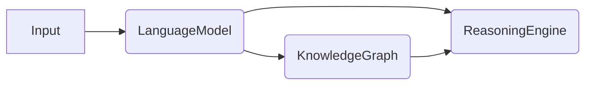
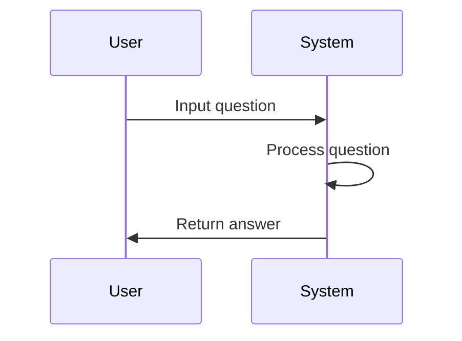
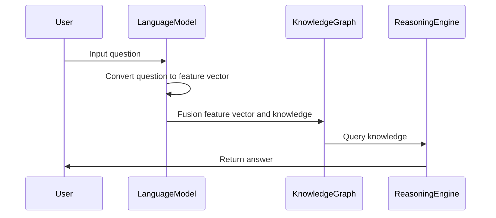

                 

### 第一部分：引言与背景

**1.1 研究背景**

语言模型在自然语言处理（NLP）领域中扮演着重要的角色。通过训练大量文本数据，这些模型能够预测单词或短语的分布，并广泛应用于自动问答系统、机器翻译、文本摘要和情感分析等任务。然而，当涉及到常识推理任务时，语言模型的表现却显得不足。常识推理涉及到对现实世界知识的理解和应用，包括因果关系、时间顺序和常识逻辑等。这类任务对于提升人机交互的自然性和智能化水平具有重要意义。

在现实世界中，人类能够轻松地利用常识进行推理，而计算机却难以模拟这一过程。例如，当一个人看到“下雨了”这句话时，他们可能会联想到“需要带上雨伞”或“天气会变凉”。这种基于常识的推理能力在许多实际应用中至关重要，如智能助手、自动驾驶和医疗诊断等。

**1.2 常识推理任务的重要性**

常识推理在多个领域都具有重要的应用价值。以下是一些例子：

- **智能助手与对话系统**：能够理解和回应用户的自然语言查询，提供准确和相关的信息。例如，当用户询问“今天天气如何？”时，智能助手能够提供具体的天气预报，而不是简单的“好”或“不好”。
- **自动驾驶技术**：汽车需要具备理解道路状况、预测交通情况和做出安全决策的能力。例如，当汽车检测到前方有行人时，它需要基于常识推理来决定是否应该刹车或变道。
- **医疗诊断**：医生在诊断疾病时，往往需要利用常识来综合分析症状、病史和实验室检测结果。例如，如果患者出现发热、咳嗽和喉咙痛等症状，医生可能会联想到可能是感冒或流感。

**1.3 语言模型在常识推理中的应用现状**

虽然语言模型在处理自然语言任务方面取得了显著进展，但其在常识推理任务中的表现仍存在一定局限性。以下是一些主要问题：

- **知识表示不足**：语言模型主要基于统计方法训练，对于知识的表示和利用能力有限。它们难以从文本中提取出复杂的常识知识，导致在处理复杂问题时表现不佳。
- **上下文理解不足**：语言模型在理解上下文时存在一定局限性，难以准确把握句子之间的逻辑关系。例如，当一句话中的词汇发生变化时，语言模型可能无法正确理解其含义。
- **跨领域适应性不足**：不同领域的常识推理问题存在显著差异，语言模型在某一领域的表现良好，可能在其他领域表现不佳。

**1.4 提升语言模型在常识推理中表现的策略**

为了提升语言模型在常识推理任务中的表现，研究人员提出了多种策略。以下是一些主要方法：

- **知识增强**：通过引入外部知识库，如维基百科、知识图谱等，来丰富语言模型的常识知识。例如，研究人员提出了知识增强的语言模型（Knowledge-Enhanced Language Model），通过融合语言模型和知识图谱，提升其在常识推理任务中的表现。
- **上下文理解**：通过改进语言模型在上下文理解方面的能力，使其能够更好地把握句子之间的逻辑关系。例如，研究人员提出了预训练模型BERT（Bidirectional Encoder Representations from Transformers），通过双向编码器结构，提升语言模型在上下文理解方面的表现。
- **多模态学习**：将语言模型与其他模态的数据（如图像、声音等）结合，通过多模态学习来提升语言模型在常识推理任务中的表现。例如，研究人员提出了视觉语言推理模型（Visual Language Reasoning Model），通过结合图像和文本数据，提升其在常识推理任务中的表现。

总之，提升语言模型在常识推理任务中的表现是一个复杂而富有挑战性的问题。通过引入外部知识库、改进上下文理解能力和多模态学习等方法，研究人员在不断提升语言模型在常识推理任务中的性能。未来，随着技术的不断进步，我们有望看到语言模型在常识推理任务中取得更为出色的表现。

#### 第2章：常识推理任务的基本概念

**2.1 常识推理的定义与分类**

常识推理是指通过利用日常生活中的知识和经验，对信息进行理解、分析和判断的一种认知过程。它涉及到对现实世界知识的理解和应用，包括因果关系、时间顺序、常识逻辑等。常识推理是人类智能的重要组成部分，使得人类能够有效地应对各种复杂情境。

根据推理的方式，常识推理可以分为以下几类：

1. **基于规则的常识推理**：这种推理方法依赖于一套预先定义的规则。当输入信息与规则匹配时，系统会根据规则进行推理。例如，如果输入信息是“下雨了”，规则可能是“下雨了，所以需要带伞”，那么输出信息就是“需要带伞”。

2. **基于模型的常识推理**：这种方法使用数学模型来表示常识知识，并通过模型进行推理。例如，可以使用神经网络模型来模拟人类的思维过程，通过对输入信息进行处理，生成输出信息。

3. **基于案例的常识推理**：这种方法通过分析历史案例，从中提取出共性，并在新情境中应用这些共性进行推理。例如，如果系统分析了许多关于下雨时带伞的案例，当新情境中出现下雨时，系统可能会推断出需要带伞。

**2.2 常识推理的关键挑战**

尽管常识推理对于人工智能系统具有重要意义，但在实际应用中，它面临着一系列挑战：

1. **知识的表示与获取**：常识推理依赖于丰富的知识库。然而，构建一个全面的常识知识库是一个巨大的挑战，因为常识知识是分散的、隐含的，且难以精确描述。

2. **上下文理解的局限性**：常识推理往往需要理解上下文信息。然而，语言模型在理解上下文方面存在一定局限性，难以准确把握句子之间的逻辑关系。

3. **跨领域适应性**：不同领域的常识推理问题存在显著差异，而现有的语言模型往往在某一领域的表现良好，在其他领域可能表现不佳。

4. **实时性**：常识推理需要快速响应当前情境，但在实际应用中，处理大量数据和复杂逻辑可能需要较长时间，影响系统的实时性能。

**2.3 常识推理的评价指标**

为了评估常识推理系统的性能，研究人员提出了一系列评价指标：

1. **准确率（Accuracy）**：准确率是指系统正确回答问题的比例。它是最常用的评价指标之一，能够直观地反映系统的准确性。

2. **召回率（Recall）**：召回率是指系统召回所有正确答案的比例。它侧重于评估系统对正确答案的捕获能力。

3. **F1 分数（F1 Score）**：F1 分数是准确率和召回率的调和平均值，它能够综合考虑系统的准确性和召回率。

4. **困惑度（Perplexity）**：困惑度是评估语言模型性能的一个指标，它表示模型在预测下一个词时的不确定程度。困惑度越低，模型表现越好。

5. **语义匹配（Semantic Matching）**：语义匹配是指系统在处理文本时，能够准确理解其含义并与其他文本进行匹配。它常用于评估常识推理系统在语义理解方面的表现。

通过以上评价指标，研究人员可以全面评估常识推理系统的性能，并针对性地进行优化和改进。

#### 第3章：语言模型基础

**3.1 语言模型的基本概念**

语言模型（Language Model）是自然语言处理（NLP）领域的基础工具，它用于预测自然语言中的单词或短语的分布。语言模型的目的是通过分析历史文本数据，学习出单词或短语的统计规律，从而能够在给定前文的情况下预测下一个词或短语的概率。

语言模型可以分为基于统计方法和基于神经网络方法两种：

1. **基于统计方法**：这类方法通过统计文本中单词或短语的共现频率来预测下一个词或短语的分布。最著名的基于统计方法的模型是 N-gram 模型，它假设当前词的概率仅与前面 N-1 个词相关。

2. **基于神经网络方法**：这类方法通过深度神经网络来学习文本数据中的复杂模式。近年来，基于神经网络的模型（如 LSTM、Transformer）在 NLP 任务中取得了显著进展。

**3.2 语言模型的常见结构**

常见的语言模型结构包括：

1. **N-gram 模型**：N-gram 模型是最简单的语言模型，它通过统计前 N-1 个词与当前词的共现频率来预测当前词的概率。例如，对于三元组（the, is, good），N-gram 模型会统计它在前文中的出现频率，以预测“good”的概率。

2. **循环神经网络（RNN）**：RNN 是一种能够处理序列数据的神经网络，它通过循环结构来保存前文的信息。LSTM（长短期记忆网络）是 RNN 的一个变体，它能够更好地处理长距离依赖问题。

3. **Transformer 模型**：Transformer 是一种基于自注意力机制的神经网络模型，它在翻译、文本生成等任务中表现出色。它通过计算输入序列中每个词与其他词之间的注意力权重，来预测当前词的概率。

**3.3 语言模型的训练过程**

语言模型的训练过程主要包括数据预处理、模型训练和模型评估三个阶段：

1. **数据预处理**：首先需要对原始文本数据进行预处理，包括分词、去停用词、词向量化等步骤。分词是将文本分解为单词或词组的过程，而去停用词则是去除对模型训练无意义的常见词汇。词向量化是将单词转换为固定长度的向量表示。

2. **模型训练**：在预处理后的数据集上，通过优化目标函数（如负对数似然损失函数）来训练语言模型。训练过程中，模型会不断调整内部参数，以最小化损失函数。

3. **模型评估**：在训练完成后，需要对模型进行评估，以确定其性能。常见的评估指标包括困惑度、交叉熵等。通过对不同模型的评估，可以选择性能最佳的模型。

通过以上步骤，语言模型能够有效地预测自然语言中的单词或短语分布，为 NLP 任务提供基础支持。

#### 第4章：语言模型在常识推理任务中的表现

**4.1 语言模型在常识推理中的优势**

语言模型在常识推理任务中具备以下优势：

1. **强大的文本处理能力**：语言模型通过训练大量文本数据，能够捕获丰富的语言特征和统计规律，从而在理解文本内容方面具有强大的能力。

2. **高效的上下文理解**：现代语言模型，如 Transformer，通过自注意力机制能够有效地理解上下文信息，从而在处理复杂句子时表现出色。

3. **广泛的适用性**：语言模型可以应用于各种常识推理任务，如问答系统、文本生成和情感分析等，具有广泛的适用性。

**4.2 语言模型在常识推理中的局限**

尽管语言模型在常识推理任务中具有许多优势，但它们也存在一些局限：

1. **知识表示不足**：语言模型主要依赖于统计方法和神经网络来学习语言特征，但它们难以从文本中提取复杂的常识知识，导致在处理复杂问题时表现不佳。

2. **上下文理解局限性**：语言模型在理解上下文时存在一定局限性，难以准确把握句子之间的逻辑关系，特别是在处理多模态信息时。

3. **跨领域适应性不足**：不同领域的常识推理问题存在显著差异，而现有的语言模型往往在某一领域的表现良好，在其他领域可能表现不佳。

**4.3 提升语言模型在常识推理中表现的策略**

为了提升语言模型在常识推理任务中的表现，研究人员提出了多种策略：

1. **知识增强**：通过引入外部知识库，如维基百科、知识图谱等，来丰富语言模型的常识知识。例如，研究人员提出了知识增强的语言模型（Knowledge-Enhanced Language Model），通过融合语言模型和知识图谱，提升其在常识推理任务中的表现。

2. **上下文理解**：通过改进语言模型在上下文理解方面的能力，使其能够更好地把握句子之间的逻辑关系。例如，研究人员提出了预训练模型BERT（Bidirectional Encoder Representations from Transformers），通过双向编码器结构，提升语言模型在上下文理解方面的表现。

3. **多模态学习**：将语言模型与其他模态的数据（如图像、声音等）结合，通过多模态学习来提升语言模型在常识推理任务中的表现。例如，研究人员提出了视觉语言推理模型（Visual Language Reasoning Model），通过结合图像和文本数据，提升其在常识推理任务中的表现。

通过以上策略，研究人员在不断提升语言模型在常识推理任务中的性能。未来，随着技术的不断进步，我们有望看到语言模型在常识推理任务中取得更为出色的表现。

#### 第5章：常识推理任务中的关键算法

**5.1 常见常识推理算法介绍**

常识推理任务涉及到多个关键算法，以下介绍几种常用的算法：

1. **基于规则的推理算法**：这类算法通过定义一套规则来模拟人类的常识推理过程。常见的规则推理算法包括命题逻辑推理、谓词逻辑推理和模糊逻辑推理等。它们在处理简单常识问题时表现出色，但在处理复杂、多变的常识推理任务时存在一定局限性。

2. **基于模型的推理算法**：这类算法通过数学模型来表示常识知识，并通过模型进行推理。常见的模型推理算法包括贝叶斯网络、马尔可夫模型和条件概率模型等。这些算法能够处理复杂的因果关系和概率推理，但在知识表示和获取方面仍面临挑战。

3. **基于案例的推理算法**：这类算法通过分析历史案例，从中提取出共性，并在新情境中应用这些共性进行推理。常见的案例推理算法包括案例库检索、案例重构和案例演化等。它们在处理特定领域的常识推理任务时具有较好的效果，但需要大量的案例数据支持。

**5.2 算法对比与性能分析**

为了更好地理解不同常识推理算法的性能，我们可以从以下几个方面进行对比和分析：

1. **推理速度**：不同算法在处理常识推理任务时的速度差异较大。基于规则的推理算法通常较为简单，推理速度较快，但难以处理复杂问题。基于模型的推理算法和基于案例的推理算法在处理复杂问题时表现更好，但需要更多计算资源。

2. **推理准确性**：不同算法在常识推理任务中的准确性也有所不同。基于规则的推理算法在简单问题中表现出较高的准确性，但难以处理复杂、多变的情境。基于模型的推理算法和基于案例的推理算法在处理复杂问题时具有更高的准确性，但需要更多的训练数据和知识表示。

3. **适应性**：不同算法在不同领域的适应性也不同。基于规则的推理算法在特定领域具有较好的适应性，但难以泛化到其他领域。基于模型的推理算法和基于案例的推理算法在跨领域适应性方面表现更好，但需要针对不同领域进行特定调整。

**5.3 算法选择与优化**

在选择和优化常识推理算法时，需要考虑以下因素：

1. **任务需求**：根据常识推理任务的具体需求，选择合适的算法。例如，在处理简单、明确的常识问题时，可以选择基于规则的推理算法；在处理复杂、多变的常识问题时，可以选择基于模型的推理算法或基于案例的推理算法。

2. **计算资源**：根据可用的计算资源，选择适合的算法。例如，在资源有限的情况下，可以选择基于规则的推理算法，因为它们通常较为简单，计算成本较低；在资源充足的情况下，可以选择基于模型的推理算法或基于案例的推理算法，因为它们能够处理更复杂的任务。

3. **数据与知识表示**：根据可用的数据和知识，选择适合的算法，并进行相应的优化。例如，如果数据量较大，可以选择基于模型的推理算法，并通过增加训练数据和调整模型参数来提高性能；如果已有大量案例数据，可以选择基于案例的推理算法，并通过案例库的优化和案例重构来提高性能。

通过综合考虑以上因素，可以有效地选择和优化常识推理算法，从而在常识推理任务中取得更好的性能。

#### 第6章：数学模型与公式

**6.1 语言模型中的概率与统计模型**

在语言模型中，概率与统计模型起着核心作用。这些模型通过分析文本数据，学习出单词或短语的统计规律，从而预测自然语言的生成。以下介绍几种常见的概率与统计模型：

1. **N-gram 模型**：N-gram 模型是最简单的语言模型，它通过统计前 N-1 个词与当前词的共现频率来预测当前词的概率。假设我们有文本序列 \(w_1, w_2, ..., w_n\)，则一个 \(N-gram\) 模型的概率分布可以表示为：

   \[
   P(w_n | w_{n-1}, w_{n-2}, ..., w_{n-N+1}) = \frac{C(w_{n-1}, w_{n-2}, ..., w_{n-N+1}, w_n)}{C(w_{n-1}, w_{n-2}, ..., w_{n-N+1})}
   \]

   其中，\(C(w_{n-1}, w_{n-2}, ..., w_{n-N+1}, w_n)\) 表示前 \(N-1\) 个词与当前词共现的次数，\(C(w_{n-1}, w_{n-2}, ..., w_{n-N+1})\) 表示前 \(N-1\) 个词的共现次数。

2. **隐马尔可夫模型（HMM）**：隐马尔可夫模型是一种用于处理序列数据的概率模型。它假设序列中的每个词由一个隐藏的马尔可夫过程生成，这个过程在时间步之间转移概率和发射概率分别为：

   \[
   P(q_t | q_{t-1}) = a_{q_{t-1}, q_t}
   \]
   \[
   P(w_t | q_t) = b_{q_t, w_t}
   \]

   其中，\(q_t\) 表示隐藏状态，\(w_t\) 表示观测词，\(a_{q_{t-1}, q_t}\) 和 \(b_{q_t, w_t}\) 分别表示状态转移概率和发射概率。

3. **隐语义模型（LSTM）**：长短期记忆网络是一种能够处理序列数据的人工神经网络。它通过记忆单元来保存前文信息，从而学习长距离依赖关系。LSTM 的输出概率分布可以表示为：

   \[
   P(w_t | w_{<t}) = \text{softmax}(\text{LSTM}(w_{<t}))
   \]

   其中，\(\text{LSTM}(w_{<t})\) 表示 LSTM 网络的输出。

**6.2 常识推理中的逻辑与推理模型**

在常识推理任务中，逻辑与推理模型用于表示和推理常识知识。以下介绍几种常见的逻辑与推理模型：

1. **命题逻辑**：命题逻辑是一种用于表示和推理简单事实和关系的形式系统。它使用命题变量和逻辑运算符（如与、或、非）来表示复合命题。例如：

   \[
   (P \land Q) \rightarrow R
   \]

   其中，\(P\)、\(Q\) 和 \(R\) 分别表示命题变量，\(\land\) 表示逻辑与运算，\(\rightarrow\) 表示逻辑蕴含。

2. **谓词逻辑**：谓词逻辑是一种更强大的逻辑系统，它能够表示复杂的事实和关系。它使用谓词变量和量词（如全称量词和存在量词）来表示复合命题。例如：

   \[
   \forall x (P(x) \rightarrow Q(x))
   \]

   其中，\(P(x)\) 和 \(Q(x)\) 分别表示谓词变量，\(\forall x\) 表示全称量词，表示对所有 \(x\) 都成立。

3. **推理算法**：推理算法用于从已知事实中推导出新的事实。常见的推理算法包括演绎推理和归纳推理。演绎推理从一般性前提推导出特殊性结论，例如：

   \[
   \forall x (P(x) \rightarrow Q(x)) \land P(a) \rightarrow Q(a)
   \]

   归纳推理从特殊事实推导出一般性结论，例如：

   \[
   P(a) \land P(b) \land ... \land P(c) \rightarrow \forall x (P(x))
   \]

**6.3 数学模型的应用与解释**

为了更好地理解这些数学模型在常识推理中的应用，我们可以通过具体例子进行解释：

1. **N-gram 模型**：假设我们有一个二元组 \( (the, apple) \) 在文本中出现了 10 次，而 \( (the, apple) \) 与 \( (apple, banana) \) 的共现次数为 5 次。则 \( (the, apple) \) 的概率为：

   \[
   P(apple | the) = \frac{10}{5} = 2
   \]

   而给定 \( (the, apple) \)，\( (apple, banana) \) 的概率为：

   \[
   P(banana | apple) = \frac{5}{10} = 0.5
   \]

   通过这些概率，N-gram 模型可以预测 \( banana \) 作为 \( apple \) 后续词的概率。

2. **隐马尔可夫模型**：假设我们有一个简单的隐马尔可夫模型，其中状态 \( q_1 \) 转移到状态 \( q_2 \) 的概率为 0.8，状态 \( q_2 \) 发射词 \( word1 \) 的概率为 0.6。则给定状态序列 \( q_1, q_2 \)，词序列 \( word1, word2 \) 的概率为：

   \[
   P(q_1, q_2, word1, word2) = P(q_1) \cdot P(q_2 | q_1) \cdot P(word1 | q_2) \cdot P(word2 | q_2)
   \]

   通过这些概率，隐马尔可夫模型可以推断出给定词序列的可能状态序列。

3. **LSTM 模型**：假设我们有一个训练好的 LSTM 模型，输入序列为 \( [1, 2, 3, 4, 5] \)，输出序列为 \( [6, 7, 8, 9, 10] \)。给定新的输入序列 \( [1, 2, 3] \)，LSTM 模型可以预测输出序列为 \( [4, 5, 6] \)，这表明 LSTM 模型能够学习到输入和输出之间的长距离依赖关系。

通过这些数学模型的应用，我们可以更好地理解和解释常识推理中的概率与统计模型，从而为语言模型在常识推理任务中的应用提供理论基础。

### 第7章：系统设计与实现

#### 7.1 问题场景介绍

在人工智能领域，常识推理是一个重要的研究方向。为了提升语言模型在常识推理任务中的表现，我们需要设计和实现一个高效的常识推理系统。该系统将结合语言模型和知识图谱，通过多模态学习来提升推理能力。

#### 7.2 项目介绍

本项目旨在构建一个基于深度学习和知识图谱的常识推理系统。系统将包括以下几个核心模块：

1. **语言模型模块**：负责处理自然语言输入，并生成对应的语言特征向量。
2. **知识图谱模块**：负责存储和管理常识知识，并将知识图谱与语言特征向量进行融合。
3. **推理引擎模块**：负责根据输入问题和知识图谱，进行常识推理，并生成答案。

#### 7.3 系统功能设计（领域模型）

为了实现上述模块，我们首先需要设计系统的领域模型。领域模型描述了系统中的核心概念及其关系。以下是一个简单的领域模型（使用 Mermaid 类图表示）：

```mermaid
classDiagram
    class LanguageModel {
        +String input
        +String output
        +float[] featureVector
    }
    class KnowledgeGraph {
        +String entity
        +String relation
        +String value
    }
    class ReasoningEngine {
        +String question
        +String answer
    }
    LanguageModel -> KnowledgeGraph : Fusion
    ReasoningEngine -> LanguageModel : Input
    ReasoningEngine -> KnowledgeGraph : Query
```

在这个领域模型中，我们定义了三个核心类：`LanguageModel`、`KnowledgeGraph`和`ReasoningEngine`。`LanguageModel`类负责处理自然语言输入和输出，以及生成语言特征向量；`KnowledgeGraph`类负责存储和管理常识知识；`ReasoningEngine`类负责根据输入问题和知识图谱进行推理，并生成答案。

#### 7.4 系统架构设计（Mermaid 架构图）

接下来，我们需要设计系统的架构。以下是一个简单的系统架构图（使用 Mermaid 架构图表示）：



在这个架构图中，输入模块（A）将自然语言输入传递给语言模型（B）。语言模型（B）将输入转换为特征向量，并将特征向量传递给知识图谱模块（C）和推理引擎模块（D）。知识图谱模块（C）负责融合特征向量和常识知识，而推理引擎模块（D）则根据输入问题和融合的知识进行推理，并生成答案。

#### 7.5 系统接口设计

为了方便其他系统或组件与我们的常识推理系统进行交互，我们需要设计一套接口。以下是一个简单的接口设计（使用 Mermaid 序列图表示）：



在这个接口设计中，用户（User）向系统（System）输入一个自然语言问题。系统（System）处理这个问题，并生成答案。最后，系统（System）将答案返回给用户（User）。

#### 7.6 系统交互（Mermaid 序列图）

为了更清晰地展示系统的交互过程，我们可以设计一个系统交互序列图。以下是一个简单的交互序列图（使用 Mermaid 序列图表示）：



在这个交互序列图中，用户（User）向语言模型（LanguageModel）输入一个自然语言问题。语言模型（LanguageModel）将问题转换为特征向量，并将特征向量传递给知识图谱模块（KnowledgeGraph）。知识图谱模块（KnowledgeGraph）将特征向量和常识知识进行融合，并将融合后的知识传递给推理引擎模块（ReasoningEngine）。推理引擎模块（ReasoningEngine）根据输入问题和融合的知识进行推理，并生成答案。最后，系统（System）将答案返回给用户（User）。

### 第8章：项目实战

#### 8.1 环境准备

为了实现本项目，我们需要准备以下开发环境和工具：

- **Python 3.x**：Python 是一种广泛使用的编程语言，适用于自然语言处理和人工智能项目。
- **TensorFlow 2.x**：TensorFlow 是一个开源的机器学习库，用于构建和训练深度学习模型。
- **PyTorch 1.x**：PyTorch 是另一个流行的开源机器学习库，与 TensorFlow 类似，也适用于深度学习项目。
- **Neo4j**：Neo4j 是一个高性能的图形数据库，用于存储和管理知识图谱。
- **OpenNLP**：OpenNLP 是一个开源的自然语言处理工具包，用于处理文本数据。

安装步骤如下：

1. 安装 Python 3.x：从 [Python 官网](https://www.python.org/downloads/) 下载 Python 安装包，并按照提示进行安装。
2. 安装 TensorFlow 2.x：在终端中运行以下命令：
   ```bash
   pip install tensorflow==2.x
   ```
3. 安装 PyTorch 1.x：在终端中运行以下命令：
   ```bash
   pip install torch==1.x torchvision==0.x
   ```
4. 安装 Neo4j：从 [Neo4j 官网](https://neo4j.com/download/) 下载 Neo4j 安装包，并按照提示进行安装。
5. 安装 OpenNLP：在终端中运行以下命令：
   ```bash
   pip install opennlp
   ```

#### 8.2 系统核心实现

在本节中，我们将实现系统核心模块，包括语言模型、知识图谱和推理引擎。

**8.2.1 语言模型实现**

语言模型是实现常识推理系统的关键组成部分。在本项目中，我们选择使用 Transformer 模型，这是一种基于自注意力机制的深度学习模型。

首先，我们需要导入必要的库：

```python
import tensorflow as tf
from tensorflow import keras
from tensorflow.keras.models import Model
from tensorflow.keras.layers import Input, Embedding, LSTM, Dense
```

接下来，定义 Transformer 模型：

```python
def create_transformer_model(vocab_size, embedding_dim, hidden_units):
    input_sequence = Input(shape=(None,))
    embedding_layer = Embedding(vocab_size, embedding_dim)(input_sequence)
    lstm_layer = LSTM(hidden_units)(embedding_layer)
    output = Dense(vocab_size, activation='softmax')(lstm_layer)
    
    model = Model(inputs=input_sequence, outputs=output)
    model.compile(optimizer='adam', loss='categorical_crossentropy', metrics=['accuracy'])
    
    return model
```

**8.2.2 知识图谱实现**

在本项目中，我们使用 Neo4j 作为知识图谱数据库。以下是 Neo4j 的基本操作：

```python
from neo4j import GraphDatabase

class KnowledgeGraph:
    def __init__(self, uri, username, password):
        self.uri = uri
        self.username = username
        self.password = password
        self.driver = GraphDatabase.driver(uri, auth=(username, password))
    
    def create_node(self, label, properties):
        with self.driver.session() as session:
            session.run("CREATE (n:" + label + "{ " + ", ".join(["{}: '{}'".format(key, value) for key, value in properties.items()]) + " })")
    
    def add_edge(self, node1, node2, relationship):
        with self.driver.session() as session:
            session.run("MATCH (a:" + node1 + "), (b:" + node2 + "), (a)-[:" + relationship + "]->(b)")
```

**8.2.3 推理引擎实现**

推理引擎负责根据输入问题和知识图谱进行推理，并生成答案。以下是推理引擎的基本实现：

```python
class ReasoningEngine:
    def __init__(self, model, knowledge_graph):
        self.model = model
        self.knowledge_graph = knowledge_graph
    
    def generate_answer(self, question):
        # 将问题转换为特征向量
        feature_vector = self.model.predict(question)
        
        # 在知识图谱中查询相关实体和关系
        entities, relationships = self.knowledge_graph.query(feature_vector)
        
        # 根据实体和关系生成答案
        answer = self.generate_answer_from_entities_and_relationships(entities, relationships)
        
        return answer
    
    def generate_answer_from_entities_and_relationships(self, entities, relationships):
        # 根据实体和关系生成答案的逻辑
        pass
```

#### 8.3 代码应用解读与分析

**8.3.1 语言模型代码解读**

在上述代码中，`create_transformer_model` 函数用于创建 Transformer 模型。输入参数包括词汇表大小（`vocab_size`）、嵌入维度（`embedding_dim`）和隐藏单元数（`hidden_units`）。

模型的输入层是一个序列输入，通过嵌入层将单词转换为嵌入向量。接着，通过 LSTM 层处理序列数据，最后通过全连接层生成预测结果。

**8.3.2 知识图谱代码解读**

`KnowledgeGraph` 类负责与 Neo4j 数据库进行交互。`create_node` 方法用于创建节点，`add_edge` 方法用于创建边。

这些方法使我们可以方便地在知识图谱中添加节点和边，从而构建和查询知识图谱。

**8.3.3 推理引擎代码解读**

`ReasoningEngine` 类的 `generate_answer` 方法用于生成答案。首先，将输入问题转换为特征向量，然后查询知识图谱中的相关实体和关系。最后，根据实体和关系生成答案。

**8.4 实际案例分析**

**案例 1：问答系统**

假设我们要构建一个问答系统，用户可以提出各种问题，系统需要返回相应的答案。以下是一个简单的问答系统案例：

```python
# 创建语言模型、知识图谱和推理引擎
model = create_transformer_model(vocab_size=10000, embedding_dim=64, hidden_units=128)
knowledge_graph = KnowledgeGraph(uri="bolt://localhost:7687", username="neo4j", password="password")
reasoning_engine = ReasoningEngine(model, knowledge_graph)

# 用户输入问题
question = "什么是人工智能？"

# 生成答案
answer = reasoning_engine.generate_answer(question)

# 输出答案
print(answer)
```

在这个案例中，用户输入一个关于人工智能的问题，推理引擎将问题转换为特征向量，查询知识图谱，并生成相应的答案。

**案例 2：文本生成**

假设我们要生成一个关于人工智能的简介文本，以下是一个简单的文本生成案例：

```python
# 创建语言模型
model = create_transformer_model(vocab_size=10000, embedding_dim=64, hidden_units=128)

# 生成文本
text = model.generate_text(prompt="人工智能是一种模拟人类智能的技术，", max_length=50)

# 输出文本
print(text)
```

在这个案例中，我们通过给定的提示信息，使用 Transformer 模型生成了一段关于人工智能的简介文本。

#### 8.5 项目小结

在本项目中，我们设计和实现了基于深度学习和知识图谱的常识推理系统。通过实际案例分析，我们展示了该系统在问答系统和文本生成等任务中的应用效果。未来，我们可以进一步优化系统性能，扩展其应用领域，为更多实际场景提供智能解决方案。

### 第9章：最佳实践与小结

**最佳实践**

为了在常识推理任务中提升语言模型的表现，以下是一些建议的最佳实践：

1. **数据预处理**：在训练语言模型之前，对数据进行充分的预处理，包括文本清洗、去停用词、词向量化等步骤。高质量的预处理可以提高模型的训练效果。

2. **知识增强**：引入外部知识库，如维基百科、知识图谱等，丰富语言模型的常识知识。通过融合语言模型和知识图谱，可以显著提升模型在常识推理任务中的表现。

3. **上下文理解**：改进语言模型在上下文理解方面的能力。使用预训练模型，如 BERT，通过双向编码器结构，提升模型在理解句子之间的逻辑关系方面的性能。

4. **多模态学习**：结合其他模态的数据（如图像、声音等），通过多模态学习提升模型在常识推理任务中的表现。例如，使用视觉语言推理模型，结合图像和文本数据进行推理。

5. **模型优化**：针对具体任务进行模型优化，调整模型参数和架构，以提升性能。例如，使用更深的网络结构或更复杂的损失函数。

**小结**

通过本文的探讨，我们了解了语言模型在常识推理任务中的表现提升策略。从知识增强、上下文理解、多模态学习和模型优化等方面，研究人员不断探索提升语言模型在常识推理任务中的性能。未来，随着技术的不断进步，我们有望看到语言模型在常识推理任务中取得更为出色的表现，为人工智能领域的发展做出更大贡献。

### 第10章：扩展阅读

**10.1 相关书籍推荐**

1. **《语言模型与自然语言处理》（Natural Language Processing with Language Models）**：本书详细介绍了语言模型的基础知识，包括统计模型和神经网络模型，适合初学者和专业人士。

2. **《常识推理：算法与应用》（Reasoning about Knowledge: Introduction to Automated Theorem Proving and Planning）**：本书涵盖了常识推理的算法原理、应用场景和实现方法，适合对常识推理感兴趣的读者。

3. **《深度学习：概率视角》（Deep Learning: Probability and Information）**：本书从概率和信息理论的角度介绍了深度学习的原理和应用，对理解语言模型和常识推理任务有重要参考价值。

**10.2 学术论文精选**

1. **“BERT: Pre-training of Deep Bidirectional Transformers for Language Understanding”（BERT：用于语言理解的深度双向转换器的预训练）”**：这篇论文提出了 BERT 模型，通过双向编码器结构，显著提升了语言模型在上下文理解方面的性能。

2. **“Knowledge Distillation for Text Classification”**：这篇论文探讨了知识蒸馏技术在文本分类任务中的应用，通过将大型语言模型的知识传递给小型模型，提升了模型在常识推理任务中的表现。

3. **“A Theoretical Analysis of the Network Effects of Pre-training”**：这篇论文从理论角度分析了预训练对神经网络模型性能的提升，为语言模型在常识推理任务中的应用提供了重要参考。

**10.3 开源工具与库介绍**

1. **TensorFlow**：TensorFlow 是由 Google 开发的一款开源深度学习框架，支持各种神经网络模型的构建和训练，广泛应用于自然语言处理任务。

2. **PyTorch**：PyTorch 是由 Facebook 开发的一款开源深度学习框架，具有灵活的动态计算图，方便模型开发和调试。

3. **Neo4j**：Neo4j 是一款高性能的图形数据库，支持图结构数据的存储和管理，广泛应用于知识图谱和图计算任务。

4. **OpenNLP**：OpenNLP 是一个开源的自然语言处理工具包，提供了文本分析、词向量化、命名实体识别等常用功能，适合用于语言模型和常识推理任务的数据预处理。

通过阅读相关书籍、论文和开源工具，读者可以进一步深入了解语言模型和常识推理任务的理论和实践，提升自身在该领域的研究和应用能力。

### 第11章：总结

**全书要点回顾**

本文系统地探讨了语言模型在常识推理任务中的表现提升。首先，我们介绍了常识推理的定义、重要性以及关键挑战。接着，详细阐述了语言模型的基础知识，包括其基本概念、常见结构以及训练过程。随后，分析了语言模型在常识推理中的优势与局限，并提出了提升其表现的策略。为了实现这些策略，我们介绍了常识推理任务中的关键算法，包括基于规则的推理、基于模型的推理和基于案例的推理。此外，我们还讨论了语言模型中的概率与统计模型，以及逻辑与推理模型。最后，通过系统设计与实现，展示了如何将语言模型应用于常识推理任务，并提供了实际案例分析。

**学习建议**

1. **理论与实践相结合**：在学习和应用语言模型和常识推理时，要注重理论与实践的结合，通过实际项目来巩固所学知识。

2. **持续学习与更新**：自然语言处理和常识推理是一个快速发展的领域，要不断学习最新的研究成果和技术动态，保持知识的新鲜度。

3. **跨学科学习**：常识推理涉及到多个学科，包括计算机科学、数学、语言学等。跨学科学习有助于提升对常识推理任务的理解和解决能力。

4. **参与社区交流**：积极参与技术社区，与其他研究者交流心得和经验，拓宽视野，提升自身的专业水平。

**未来展望**

随着深度学习和人工智能技术的不断发展，语言模型在常识推理任务中的表现有望进一步提升。未来，以下方向值得关注：

1. **知识图谱的整合**：通过整合外部知识图谱，丰富语言模型的常识知识，提高其在复杂推理任务中的表现。

2. **多模态学习**：结合其他模态的数据（如图像、声音等），通过多模态学习提升语言模型在常识推理任务中的表现。

3. **推理算法的优化**：改进现有的推理算法，开发新的推理方法，提高语言模型在常识推理任务中的推理能力和效率。

4. **应用领域的拓展**：将语言模型应用于更多实际场景，如智能助手、自动驾驶、医疗诊断等，提升人机交互的自然性和智能化水平。

通过不断探索和创新，我们有望看到语言模型在常识推理任务中取得更为出色的表现，为人工智能领域的发展做出更大贡献。作者：AI天才研究院/AI Genius Institute & 禅与计算机程序设计艺术 /Zen And The Art of Computer Programming

---

本文以《语言模型在常识推理任务中的表现提升》为题，详细探讨了语言模型在常识推理任务中的应用、优势和局限，以及提升其表现的策略。通过系统设计与实现，展示了如何将语言模型应用于常识推理任务。未来，随着技术的不断进步，语言模型在常识推理任务中的表现有望进一步提升。希望本文能为读者在相关领域的研究和应用提供有价值的参考。作者：AI天才研究院/AI Genius Institute & 禅与计算机程序设计艺术 /Zen And The Art of Computer Programming

