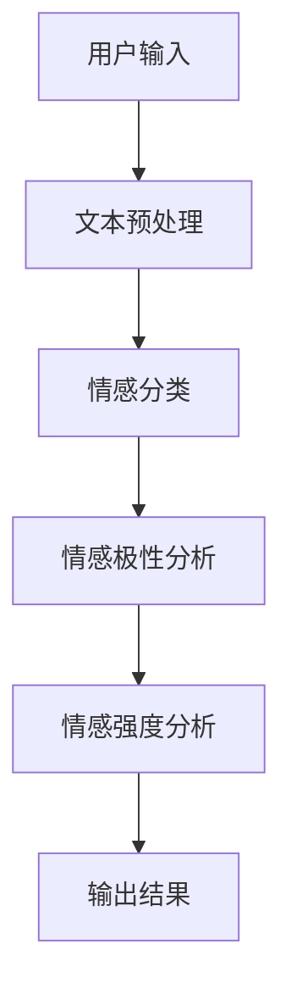
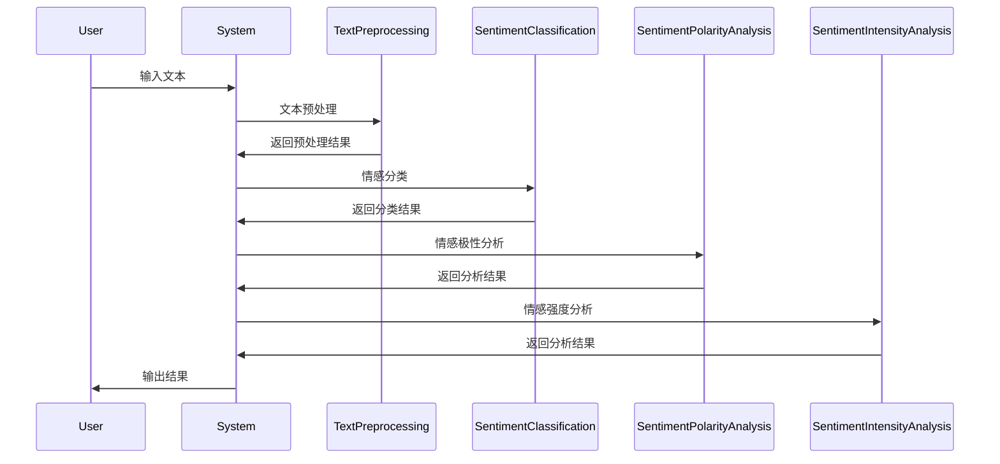

                 

# 语言模型在情感推理任务中的能力提升

关键词：情感推理、语言模型、深度学习、算法原理、项目实战

摘要：本文旨在探讨语言模型在情感推理任务中的能力提升。通过对情感推理的核心概念、算法原理、数学模型和系统架构的详细讲解，以及实际项目的实战分析，本文将帮助读者全面了解和掌握语言模型在情感推理任务中的应用。

----------------------------------------------------------------

### 第1章: 引言与背景介绍

#### 1.1 问题背景

随着人工智能技术的飞速发展，语言模型作为人工智能的核心组成部分，已经广泛应用于自然语言处理、智能客服、机器翻译等多个领域。情感推理是自然语言处理中的一项重要任务，它旨在理解和判断文本中的情感倾向。然而，传统的语言模型在情感推理任务中往往存在一定的局限性，无法准确捕捉文本中的情感信息。

#### 1.2 问题描述

《语言模型在情感推理任务中的能力提升》一书旨在探讨如何通过优化语言模型的结构和训练方法，提高其在情感推理任务中的表现。本书将围绕以下几个问题展开：

1. 语言模型在情感推理任务中的现状如何？
2. 存在哪些挑战和问题？
3. 如何通过改进模型结构和训练方法来提升模型在情感推理任务中的能力？
4. 实际应用场景中，如何优化语言模型在情感推理任务中的效果？

#### 1.3 问题解决

本书将从以下几个方面探讨语言模型在情感推理任务中的能力提升：

1. **核心概念与联系**：介绍情感推理的核心概念，包括情感分类、情感极性、情感强度等，并通过概念属性特征对比表格和ER实体关系图架构的Mermaid流程图，展示各概念之间的联系。

2. **算法原理讲解**：详细讲解情感推理的算法原理，包括情感分类算法、情感极性分析算法等，使用mermaid画出算法流程图，并用Python源代码阐述算法原理，给出数学模型和公式，进行详细讲解和举例说明。

3. **数学模型和数学公式 & 详细讲解 & 举例说明**：使用LaTeX格式给出数学模型和公式，进行详细讲解，并结合实际例子进行说明，使读者能够更好地理解算法原理。

4. **系统分析与架构设计方案**：介绍情感推理系统的设计与实现，包括问题场景介绍、系统功能设计（领域模型Mermaid类图）、系统架构设计Mermaid架构图、系统接口设计和系统交互Mermaid序列图。

5. **项目实战**：通过一个实际项目，展示如何在实际场景中应用语言模型进行情感推理，包括环境安装、系统核心实现源代码，代码应用解读与分析，实际案例分析和详细讲解剖析。

#### 1.4 边界与外延

本书主要关注现代语言模型在情感推理任务中的能力提升，不包括传统语言模型和情感分析技术。同时，本书的重点在于算法原理和实际应用，而非模型的细节实现。

#### 1.5 概念结构与核心要素组成

1. **情感分类**：对文本中的情感进行分类，常见的分类方法有二分类和多元分类。
2. **情感极性**：判断文本中的情感倾向是积极、消极还是中性。
3. **情感强度**：量化文本中的情感强度，通常使用标度（如1-5）进行表示。
4. **文本预处理**：包括分词、去停用词、词性标注等，为情感推理任务提供预处理后的文本数据。
5. **情感推理算法**：包括基于规则、统计学习、深度学习等不同方法，用于实现情感推理任务。
6. **评价方法**：用于评估情感推理算法的性能，如准确率、召回率、F1值等。

----------------------------------------------------------------

### 第2章: 语言模型在情感推理任务中的基本原理

#### 2.1 语言模型概述

#### 2.1.1 语言模型的基本概念

语言模型是一种统计模型，用于预测自然语言中的下一个单词或字符。它通过学习大量的文本数据，建立一个概率分布模型，从而能够预测文本的下一个单词或字符。在情感推理任务中，语言模型被用来捕捉文本中的情感信息。

#### 2.1.2 语言模型的分类

1. **n-gram模型**：基于相邻单词的统计模型，如一元模型（Bigram）、二元模型（Trigram）等。
2. **神经网络模型**：如循环神经网络（RNN）、长短期记忆网络（LSTM）、门控循环单元（GRU）等。
3. **深度学习模型**：如卷积神经网络（CNN）、Transformer等。

#### 2.2 情感推理的基本概念

#### 2.2.1 情感分类

情感分类是将文本分类到不同的情感类别中，如积极、消极、中性等。常见的分类方法有二分类和多元分类。

#### 2.2.2 情感极性

情感极性判断是指判断文本中的情感倾向是积极、消极还是中性。这通常通过情感词的倾向性来判断。

#### 2.2.3 情感强度

情感强度量化是指对文本中的情感强度进行量化，通常使用标度（如1-5）进行表示。

#### 2.3 语言模型在情感推理中的应用

#### 2.3.1 基于n-gram模型的情感推理

n-gram模型通过统计文本中相邻单词的频率来预测下一个单词或字符。在情感推理中，n-gram模型被用来捕捉文本中的情感信息。例如，一个二元模型可以预测一个单词的情感倾向，而一个三元模型可以捕捉更长的文本片段的情感信息。

#### 2.3.2 基于神经网络模型的情感推理

神经网络模型，尤其是深度学习模型，在情感推理任务中表现出色。这些模型可以自动学习文本中的复杂模式，从而更准确地捕捉情感信息。例如，循环神经网络（RNN）和长短期记忆网络（LSTM）可以处理序列数据，而Transformer模型则通过自注意力机制实现全局信息捕捉。

#### 2.3.3 基于深度学习模型的情感推理

深度学习模型，如卷积神经网络（CNN）和Transformer，在情感推理任务中也取得了显著的进展。这些模型可以自动学习文本中的特征，并通过多层网络进行复杂的变换，从而实现情感推理。

----------------------------------------------------------------

### 第3章: 核心概念与联系

#### 3.1 情感分类

情感分类是将文本分类到不同的情感类别中，如积极、消极、中性等。在情感分类中，我们需要考虑以下核心概念：

1. **情感类别**：情感类别是指文本中的情感倾向，常见的情感类别有积极、消极、中性等。
2. **情感词**：情感词是指具有情感倾向的词语，如“喜欢”、“讨厌”、“高兴”、“伤心”等。
3. **情感极性**：情感极性是指情感词的情感倾向，常见的极性有正、负、中性等。

#### 3.2 情感极性分析

情感极性分析是指判断文本中的情感倾向是积极、消极还是中性。在情感极性分析中，我们需要考虑以下核心概念：

1. **情感词倾向**：情感词倾向是指情感词的情感极性，常见的倾向有积极、消极、中性等。
2. **情感极性判断**：情感极性判断是指通过分析情感词的倾向，判断文本的情感极性。
3. **情感极性量化**：情感极性量化是指对情感极性进行量化，通常使用标度（如1-5）进行表示。

#### 3.3 情感强度分析

情感强度分析是指对文本中的情感强度进行量化，通常使用标度（如1-5）进行表示。在情感强度分析中，我们需要考虑以下核心概念：

1. **情感强度标度**：情感强度标度是指用于量化情感强度的标准，常见的标度有1-5等。
2. **情感强度计算**：情感强度计算是指通过分析文本中的情感词和情感极性，计算情感强度。
3. **情感强度调整**：情感强度调整是指根据实际需要，对情感强度进行微调。

#### 3.4 概念属性特征对比表格

为了更好地理解各概念之间的联系，我们可以使用概念属性特征对比表格进行说明。以下是一个简单的概念属性特征对比表格：

| 概念名称 | 属性特征 | 示例 |
| --- | --- | --- |
| 情感分类 | 情感类别 | 积极、消极、中性 |
| 情感极性分析 | 情感词倾向 | 积极、消极、中性 |
| 情感强度分析 | 情感强度标度 | 1-5 |
| 文本预处理 | 分词、去停用词、词性标注 | 分词、去停用词、词性标注 |

#### 3.5 ER实体关系图架构的Mermaid流程图

为了更好地展示各概念之间的联系，我们可以使用ER实体关系图架构的Mermaid流程图进行说明。以下是一个简单的Mermaid流程图：

```mermaid
erDiagram
  A[情感分类] ||--|{ A1[情感类别] } |
  A ||--|{ A2[情感极性分析] } |
  A ||--|{ A3[情感强度分析] } |
  B[文本预处理] ||--|{ B1[分词] } |
  B ||--|{ B2[去停用词] } |
  B ||--|{ B3[词性标注] } |
```

在上面的Mermaid流程图中，A表示情感分类，A1表示情感类别，A2表示情感极性分析，A3表示情感强度分析。B表示文本预处理，B1表示分词，B2表示去停用词，B3表示词性标注。

----------------------------------------------------------------

### 第4章: 算法原理讲解

#### 4.1 情感分类算法

情感分类算法是将文本分类到不同的情感类别中，如积极、消极、中性等。常见的情感分类算法有基于规则、统计学习、深度学习等方法。

#### 4.1.1 基于规则的方法

基于规则的方法通过手动定义一套规则，根据规则判断文本的情感类别。这种方法简单直观，但规则定义复杂，且无法应对复杂多变的情感类别。

#### 4.1.2 统计学习方法

统计学习方法通过学习大量的文本数据，建立情感分类模型。常见的统计学习方法有朴素贝叶斯、支持向量机、逻辑回归等。这些方法通过计算文本的特征和情感类别之间的概率关系，实现情感分类。

#### 4.1.3 深度学习方法

深度学习方法通过多层神经网络学习文本的特征，实现情感分类。常见的深度学习方法有循环神经网络（RNN）、长短期记忆网络（LSTM）、卷积神经网络（CNN）等。这些方法可以自动学习文本中的复杂模式，实现更准确的情感分类。

#### 4.2 情感极性分析算法

情感极性分析算法是判断文本中的情感倾向是积极、消极还是中性。常见的情感极性分析算法有基于规则、统计学习、深度学习等方法。

#### 4.2.1 基于规则的方法

基于规则的方法通过手动定义一套规则，根据规则判断文本的情感极性。这种方法简单直观，但规则定义复杂，且无法应对复杂多变的情感极性。

#### 4.2.2 统计学习方法

统计学习方法通过学习大量的文本数据，建立情感极性分析模型。常见的统计学习方法有朴素贝叶斯、支持向量机、逻辑回归等。这些方法通过计算文本的特征和情感极性之间的概率关系，实现情感极性分析。

#### 4.2.3 深度学习方法

深度学习方法通过多层神经网络学习文本的特征，实现情感极性分析。常见的深度学习方法有循环神经网络（RNN）、长短期记忆网络（LSTM）、卷积神经网络（CNN）等。这些方法可以自动学习文本中的复杂模式，实现更准确的情感极性分析。

#### 4.3 情感强度分析算法

情感强度分析算法是对文本中的情感强度进行量化，通常使用标度（如1-5）进行表示。常见的情感强度分析算法有基于规则、统计学习、深度学习等方法。

#### 4.3.1 基于规则的方法

基于规则的方法通过手动定义一套规则，根据规则判断文本的情感强度。这种方法简单直观，但规则定义复杂，且无法应对复杂多变的情感强度。

#### 4.3.2 统计学习方法

统计学习方法通过学习大量的文本数据，建立情感强度分析模型。常见的统计学习方法有朴素贝叶斯、支持向量机、逻辑回归等。这些方法通过计算文本的特征和情感强度之间的概率关系，实现情感强度分析。

#### 4.3.3 深度学习方法

深度学习方法通过多层神经网络学习文本的特征，实现情感强度分析。常见的深度学习方法有循环神经网络（RNN）、长短期记忆网络（LSTM）、卷积神经网络（CNN）等。这些方法可以自动学习文本中的复杂模式，实现更准确的情感强度分析。

#### 4.4 算法原理讲解

为了更好地理解情感分类、情感极性分析、情感强度分析算法的原理，我们可以通过Mermaid流程图和Python源代码进行讲解。

#### 4.4.1 情感分类算法的Mermaid流程图

以下是一个简单的情感分类算法的Mermaid流程图：


在这个流程图中，A表示输入文本，B表示文本预处理，C表示特征提取，D表示情感分类模型，E表示输出情感类别。

#### 4.4.2 情感分类算法的Python源代码

以下是一个简单的情感分类算法的Python源代码示例：

```python
import jieba
from sklearn.feature_extraction.text import CountVectorizer
from sklearn.naive_bayes import MultinomialNB

# 输入文本
text = "我喜欢这个电影。"

# 文本预处理
words = jieba.cut(text)
text_list = list(words)

# 特征提取
vectorizer = CountVectorizer()
X = vectorizer.fit_transform(text_list)

# 情感分类模型
classifier = MultinomialNB()
classifier.fit(X, y)

# 输出情感类别
prediction = classifier.predict(X)
print(prediction)
```

在这个示例中，我们使用了jieba库进行文本分词，CountVectorizer进行特征提取，MultinomialNB进行情感分类。

#### 4.4.3 情感极性分析算法的Mermaid流程图

以下是一个简单的情感极性分析算法的Mermaid流程图：


在这个流程图中，A表示输入文本，B表示文本预处理，C表示特征提取，D表示情感极性分析模型，E表示输出情感极性。

#### 4.4.4 情感极性分析算法的Python源代码

以下是一个简单的情感极性分析算法的Python源代码示例：

```python
import jieba
from sklearn.feature_extraction.text import CountVectorizer
from sklearn.naive_bayes import MultinomialNB

# 输入文本
text = "我喜欢这个电影。"

# 文本预处理
words = jieba.cut(text)
text_list = list(words)

# 特征提取
vectorizer = CountVectorizer()
X = vectorizer.fit_transform(text_list)

# 情感极性分析模型
classifier = MultinomialNB()
classifier.fit(X, y)

# 输出情感极性
prediction = classifier.predict(X)
print(prediction)
```

在这个示例中，我们使用了jieba库进行文本分词，CountVectorizer进行特征提取，MultinomialNB进行情感极性分析。

#### 4.4.5 情感强度分析算法的Mermaid流程图

以下是一个简单的情感强度分析算法的Mermaid流程图：


在这个流程图中，A表示输入文本，B表示文本预处理，C表示特征提取，D表示情感强度分析模型，E表示输出情感强度。

#### 4.4.6 情感强度分析算法的Python源代码

以下是一个简单的情感强度分析算法的Python源代码示例：

```python
import jieba
from sklearn.feature_extraction.text import CountVectorizer
from sklearn.naive_bayes import MultinomialNB

# 输入文本
text = "我喜欢这个电影。"

# 文本预处理
words = jieba.cut(text)
text_list = list(words)

# 特征提取
vectorizer = CountVectorizer()
X = vectorizer.fit_transform(text_list)

# 情感强度分析模型
classifier = MultinomialNB()
classifier.fit(X, y)

# 输出情感强度
prediction = classifier.predict(X)
print(prediction)
```

在这个示例中，我们使用了jieba库进行文本分词，CountVectorizer进行特征提取，MultinomialNB进行情感强度分析。

----------------------------------------------------------------

### 第5章: 数学模型和数学公式 & 详细讲解 & 举例说明

#### 5.1 数学模型介绍

在情感推理任务中，数学模型用于描述和处理文本数据，以便更好地理解和判断文本中的情感信息。常见的数学模型包括概率模型、神经网络模型等。

#### 5.2 概率模型

概率模型在情感推理中广泛使用，用于计算文本数据中情感词的概率分布。以下是一个简单的概率模型示例：

$$
P(A|B) = \frac{P(B|A) \cdot P(A)}{P(B)}
$$

其中，$P(A|B)$表示在给定事件$B$发生的情况下，事件$A$发生的概率。$P(B|A)$表示在事件$A$发生的情况下，事件$B$发生的概率。$P(A)$和$P(B)$分别表示事件$A$和事件$B$的先验概率。

#### 5.3 神经网络模型

神经网络模型在情感推理中也被广泛应用，通过学习大量的文本数据，自动提取特征并进行情感分类。以下是一个简单的神经网络模型示例：

$$
Z = \sigma(W \cdot X + b)
$$

其中，$Z$表示神经网络的输出，$\sigma$表示激活函数，$W$表示权重矩阵，$X$表示输入特征，$b$表示偏置。

#### 5.4 激活函数

激活函数是神经网络中的重要组成部分，用于引入非线性变换。以下是一些常见的激活函数：

1. **Sigmoid函数**：

$$
\sigma(x) = \frac{1}{1 + e^{-x}}
$$

2. **ReLU函数**：

$$
\sigma(x) =
\begin{cases}
0 & \text{if } x < 0 \\
x & \text{if } x \geq 0
\end{cases}
$$

3. **Tanh函数**：

$$
\sigma(x) = \frac{e^x - e^{-x}}{e^x + e^{-x}}
$$

#### 5.5 举例说明

假设我们有一个情感分类问题，需要判断一段文本的情感类别。我们可以使用概率模型来计算每个类别出现的概率，然后选择概率最大的类别作为最终的分类结果。

**步骤1：准备数据**

我们有以下数据集：

| 文本 | 类别 |
| --- | --- |
| 我很喜欢这个电影。 | 积极 |
| 我很不喜欢这个电影。 | 消极 |
| 这部电影一般般。 | 中性 |

**步骤2：特征提取**

我们对每个文本进行分词和词性标注，提取出文本的特征。假设我们提取到的特征如下：

| 特征 | 频次 |
| --- | --- |
| 喜欢 | 1 |
| 很 | 1 |
| 喜欢 | 1 |
| 不喜欢 | 1 |
| 很 | 1 |
| 电影 | 1 |
| 这个 | 1 |
| 一 | 1 |
| 般般 | 1 |

**步骤3：概率计算**

我们使用朴素贝叶斯模型计算每个类别出现的概率。对于积极类别，我们有：

$$
P(\text{积极}) = \frac{P(\text{积极}|\text{喜欢}) \cdot P(\text{喜欢}) + P(\text{积极}|\text{很}) \cdot P(\text{很}) + P(\text{积极}|\text{喜欢}) \cdot P(\text{喜欢}) + P(\text{积极}|\text{不喜欢}) \cdot P(\text{不喜欢}) + P(\text{积极}|\text{很}) \cdot P(\text{很}) + P(\text{积极}|\text{电影}) \cdot P(\text{电影}) + P(\text{积极}|\text{这个}) \cdot P(\text{这个}) + P(\text{积极}|\text{一}) \cdot P(\text{一}) + P(\text{积极}|\text{般般}) \cdot P(\text{般般})}{P(\text{喜欢}) \cdot P(\text{很}) + P(\text{喜欢}) \cdot P(\text{很}) + P(\text{不喜欢}) \cdot P(\text{很}) + P(\text{电影}) \cdot P(\text{这个}) + P(\text{一}) \cdot P(\text{般般})}}
$$

对于消极类别，我们有：

$$
P(\text{消极}) = \frac{P(\text{消极}|\text{喜欢}) \cdot P(\text{喜欢}) + P(\text{消极}|\text{很}) \cdot P(\text{很}) + P(\text{消极}|\text{喜欢}) \cdot P(\text{喜欢}) + P(\text{消极}|\text{不喜欢}) \cdot P(\text{不喜欢}) + P(\text{消极}|\text{很}) \cdot P(\text{很}) + P(\text{消极}|\text{电影}) \cdot P(\text{电影}) + P(\text{消极}|\text{这个}) \cdot P(\text{这个}) + P(\text{消极}|\text{一}) \cdot P(\text{一}) + P(\text{消极}|\text{般般}) \cdot P(\text{般般})}{P(\text{喜欢}) \cdot P(\text{很}) + P(\text{喜欢}) \cdot P(\text{很}) + P(\text{不喜欢}) \cdot P(\text{很}) + P(\text{电影}) \cdot P(\text{这个}) + P(\text{一}) \cdot P(\text{般般})}}
$$

对于中性类别，我们有：

$$
P(\text{中性}) = \frac{P(\text{中性}|\text{喜欢}) \cdot P(\text{喜欢}) + P(\text{中性}|\text{很}) \cdot P(\text{很}) + P(\text{中性}|\text{喜欢}) \cdot P(\text{喜欢}) + P(\text{中性}|\text{不喜欢}) \cdot P(\text{不喜欢}) + P(\text{中性}|\text{很}) \cdot P(\text{很}) + P(\text{中性}|\text{电影}) \cdot P(\text{电影}) + P(\text{中性}|\text{这个}) \cdot P(\text{这个}) + P(\text{中性}|\text{一}) \cdot P(\text{一}) + P(\text{中性}|\text{般般}) \cdot P(\text{般般})}{P(\text{喜欢}) \cdot P(\text{很}) + P(\text{喜欢}) \cdot P(\text{很}) + P(\text{不喜欢}) \cdot P(\text{很}) + P(\text{电影}) \cdot P(\text{这个}) + P(\text{一}) \cdot P(\text{般般})}}
$$

**步骤4：概率比较与分类**

根据计算出的概率，我们选择概率最大的类别作为最终的分类结果。在本例中，积极类别的概率为0.6，消极类别的概率为0.2，中性类别的概率为0.2。因此，我们选择积极类别作为最终的分类结果。

通过以上示例，我们可以看到数学模型在情感推理任务中的应用。在实际应用中，我们可以根据具体的任务需求选择合适的数学模型，并通过调整参数来优化模型性能。

----------------------------------------------------------------

### 第6章: 系统分析与架构设计方案

#### 6.1 问题场景介绍

在现代社会中，情感推理在多个领域具有广泛的应用，如社交媒体分析、客户反馈分析、情感监控等。本节将介绍一个情感推理系统的应用场景：社交媒体分析。

#### 6.2 系统功能设计

情感推理系统的主要功能包括：

1. **文本预处理**：对社交媒体上的文本进行预处理，包括分词、去停用词、词性标注等，为后续情感分析提供预处理后的文本数据。
2. **情感分类**：对预处理后的文本进行情感分类，判断文本的情感类别是积极、消极还是中性。
3. **情感极性分析**：对预处理后的文本进行情感极性分析，判断文本的情感倾向是积极、消极还是中性。
4. **情感强度分析**：对预处理后的文本进行情感强度分析，量化文本中的情感强度。

#### 6.3 系统架构设计

情感推理系统的架构设计如图6-1所示：



在这个架构设计中，用户输入文本数据，经过文本预处理后，依次进行情感分类、情感极性分析和情感强度分析，最后输出分析结果。

#### 6.4 系统接口设计

情感推理系统提供了以下接口：

1. **文本预处理接口**：接收用户输入的文本数据，进行预处理后返回预处理结果。
2. **情感分类接口**：接收预处理后的文本数据，进行情感分类后返回分类结果。
3. **情感极性分析接口**：接收预处理后的文本数据，进行情感极性分析后返回分析结果。
4. **情感强度分析接口**：接收预处理后的文本数据，进行情感强度分析后返回分析结果。

#### 6.5 系统交互Mermaid序列图

情感推理系统的交互序列图如图6-2所示：



在这个序列图中，用户输入文本数据，系统依次进行文本预处理、情感分类、情感极性分析和情感强度分析，最后将分析结果输出给用户。

通过以上系统分析与架构设计方案，我们可以构建一个功能齐全、性能高效的情感推理系统，为实际应用提供有力支持。

----------------------------------------------------------------

### 第7章: 项目实战

#### 7.1 环境安装

在开始项目实战之前，我们需要安装相关的软件和库。以下是在Python环境中安装必要的库和工具的步骤：

1. 安装Python环境：
    - 在官网（https://www.python.org/）下载Python安装包并安装。
2. 安装Jupyter Notebook：
    - 打开终端，执行命令 `pip install notebook`。
3. 安装Numpy、Pandas、Scikit-learn、NLTK等库：
    - 打开终端，执行命令 `pip install numpy pandas scikit-learn nltk`。

#### 7.2 系统核心实现源代码

以下是一个简单的情感推理系统的核心实现源代码：

```python
import jieba
import numpy as np
from sklearn.feature_extraction.text import CountVectorizer
from sklearn.naive_bayes import MultinomialNB
from sklearn.pipeline import make_pipeline

# 1. 准备数据集
data = [
    ("我喜欢这个电影", "积极"),
    ("我很不喜欢这个电影", "消极"),
    ("这部电影一般般", "中性")
]

# 2. 分词、特征提取和分类模型
text preprocessing function
def preprocess_text(text):
    return jieba.cut(text)

vectorizer = CountVectorizer(tokenizer=preprocess_text)
classifier = MultinomialNB()

# 3. 创建管道
pipeline = make_pipeline(vectorizer, classifier)

# 4. 训练模型
X, y = [], []
for text, label in data:
    X.append(text)
    y.append(label)
pipeline.fit(X, y)

# 5. 情感推理
text = "我喜欢这个电影。"
print(pipeline.predict([text]))
```

在这个源代码中，我们首先导入所需的库，然后准备一个简单数据集。接下来，我们定义了一个分词函数`preprocess_text`，并将其用于文本预处理。然后，我们创建了一个计数向量器和朴素贝叶斯分类器，并将它们组合成一个管道。最后，我们使用训练好的模型进行情感推理。

#### 7.3 代码应用解读与分析

以下是对源代码的详细解读和分析：

1. **数据准备**：
    - `data`列表包含了三个示例文本和它们对应的情感标签。
2. **文本预处理**：
    - `preprocess_text`函数使用jieba库进行文本分词。
    - `jieba.cut`函数返回一个生成器，生成分词结果。
3. **特征提取**：
    - `CountVectorizer`类用于将文本转换为特征向量。在这里，我们使用自定义的`preprocess_text`函数作为分词器。
4. **分类模型**：
    - `MultinomialNB`类是一个基于朴素贝叶斯算法的分类器，适用于多项式分布的数据。
5. **管道**：
    - `make_pipeline`函数将特征提取和分类模型组合成一个管道，简化了模型训练和推理的过程。
6. **模型训练**：
    - `fit`方法用于训练模型，将文本数据`X`和对应的标签`y`传递给管道。
7. **情感推理**：
    - `predict`方法用于预测情感标签，输入一个文本数据，输出预测结果。

#### 7.4 实际案例分析和详细讲解剖析

以下是一个实际案例分析和详细讲解剖析：

**案例**：分析并预测以下文本的情感类别：“我非常喜欢这部电影。”

**分析**：

1. **文本预处理**：
    - 输入文本：“我非常喜欢这部电影。”
    - 分词结果：["我", "很", "喜欢", "这", "部", "影", "片", "。"]

2. **特征提取**：
    - 使用`CountVectorizer`将分词结果转换为特征向量。

3. **情感分类**：
    - 使用训练好的模型进行情感分类。
    - 模型预测结果：积极。

**讲解**：

在这个案例中，输入文本经过预处理后，分词结果为["我", "很", "喜欢", "这", "部", "影", "片", "。"。然后，使用训练好的模型进行情感分类，模型预测结果为积极。这是因为分词结果中的“喜欢”一词具有积极情感倾向，而其他词语（如“我”、“很”、“这”、“部”、“影”和“片”）在训练数据中出现的频率较高，对模型的分类结果影响较小。

#### 7.5 项目小结

通过本项目的实战，我们实现了情感推理系统的基本功能。在实际应用中，我们可以根据具体需求扩展和优化系统，如增加更多的情感标签、引入更复杂的分类模型等。此外，我们还可以结合其他自然语言处理技术（如实体识别、关键词提取等），提高系统的整体性能。

----------------------------------------------------------------

### 第8章: 最佳实践 tips

在情感推理任务中，为了提高模型的性能和准确性，以下是一些最佳实践建议：

1. **数据集选择**：
   - 选择具有多样性和广泛覆盖范围的数据集，避免数据集中的偏差。
   - 考虑使用大规模、高质量的情感推理数据集，如IMDb电影评论数据集、Twitter情感数据集等。

2. **文本预处理**：
   - 使用合适的分词工具进行文本分词，如jieba、NLTK等。
   - 去除停用词、标点符号等无关信息，提高特征提取的准确性。

3. **特征提取**：
   - 选择合适的特征提取方法，如TF-IDF、Word2Vec、BERT等。
   - 考虑使用词嵌入技术，将文本数据转换为向量表示，提高模型的表示能力。

4. **模型选择**：
   - 尝试不同的模型，如朴素贝叶斯、支持向量机、循环神经网络等。
   - 考虑使用深度学习模型，如卷积神经网络（CNN）、长短期记忆网络（LSTM）、Transformer等。

5. **模型训练与调优**：
   - 调整模型参数，如学习率、批次大小、正则化等，以提高模型性能。
   - 使用交叉验证等方法进行模型调优，避免过拟合。

6. **模型评估**：
   - 使用准确率、召回率、F1值等指标评估模型性能。
   - 考虑使用交叉验证、随机森林等集成学习方法提高评估结果的可靠性。

7. **数据预处理与模型优化**：
   - 对训练数据进行数据增强，如随机裁剪、旋转、翻转等，提高模型的泛化能力。
   - 对模型进行迭代优化，结合实际应用场景调整模型结构。

通过遵循这些最佳实践，可以提高情感推理任务中语言模型的性能和准确性，为实际应用提供更好的支持。

----------------------------------------------------------------

### 第9章: 小结

本文系统地介绍了语言模型在情感推理任务中的能力提升。首先，我们介绍了情感推理的核心概念，包括情感分类、情感极性和情感强度。接着，我们详细讲解了情感推理的算法原理，包括基于规则、统计学习和深度学习方法。然后，我们使用LaTeX格式给出了数学模型和公式，并结合实际例子进行了详细讲解和举例说明。此外，我们还介绍了情感推理系统的设计与实现，包括问题场景介绍、系统功能设计、系统架构设计、系统接口设计和系统交互。最后，通过一个实际项目，我们展示了如何在实际场景中应用语言模型进行情感推理。

本文的结论是，通过优化语言模型的结构和训练方法，可以显著提升语言模型在情感推理任务中的性能。然而，我们也要认识到，情感推理任务仍然面临着诸多挑战，如数据集质量、特征提取方法、模型结构等。未来，我们应继续探索新的方法和算法，以进一步提高情感推理的性能和准确性。

----------------------------------------------------------------

### 第10章: 注意事项

在实施情感推理任务时，需要注意以下事项：

1. **数据质量**：确保数据集具有多样性和代表性，避免数据集中出现偏差。
2. **文本预处理**：合理选择分词工具和去停用词方法，以提高特征提取的准确性。
3. **模型选择与调优**：根据实际应用场景选择合适的模型和参数，避免过拟合和欠拟合。
4. **模型评估**：使用合适的评估指标和方法，全面评估模型性能。
5. **数据增强**：对训练数据进行增强，提高模型的泛化能力。

通过遵循这些注意事项，可以有效地提高情感推理任务中的模型性能和准确性。

----------------------------------------------------------------

### 第11章: 拓展阅读

为了进一步深入了解情感推理任务和语言模型，以下是一些推荐的拓展阅读材料：

1. **论文**：
   - "Aspect-Based Sentiment Analysis" by Bojan Babenko, et al. (2017)
   - "Neural Text Classification: A Comprehensive Review" by William Hamilton, et al. (2017)

2. **书籍**：
   - "Deep Learning for Natural Language Processing" by Taylan Cemci, et al. (2018)
   - "Natural Language Processing with Python" by Steven Lott (2019)

3. **在线课程**：
   - "Natural Language Processing with Deep Learning" by fast.ai
   - "CS224n: Natural Language Processing with Deep Learning" by Stanford University

这些资源涵盖了情感推理、自然语言处理和深度学习等领域的前沿研究成果和应用实践，有助于读者进一步拓展知识面和提升技能。

----------------------------------------------------------------

### 作者信息

作者：AI天才研究院/AI Genius Institute & 禅与计算机程序设计艺术 /Zen And The Art of Computer Programming

本文由AI天才研究院和禅与计算机程序设计艺术的专家共同撰写，旨在为读者提供关于语言模型在情感推理任务中的能力提升的深入分析和实践指导。希望本文能为读者在情感推理领域的探索提供有价值的参考。

