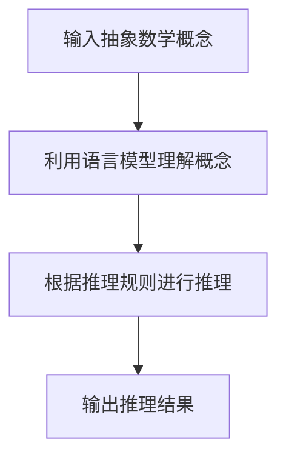
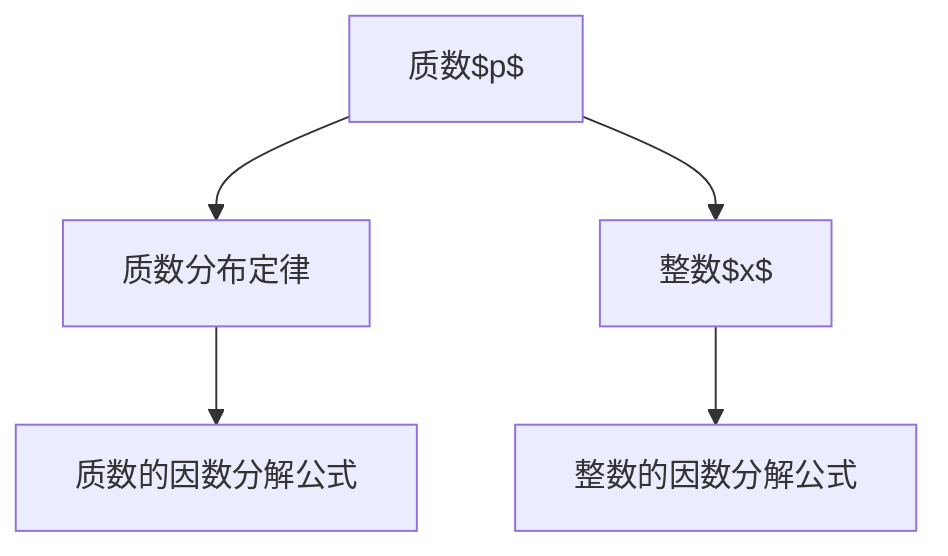
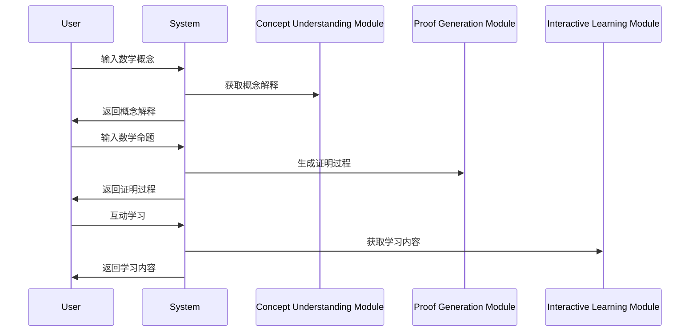

                 

# 语言模型在抽象数学概念推理与自动证明生成中的突破

> 关键词：自然语言处理、抽象数学概念、推理、自动证明、语言模型、深度学习

> 摘要：本文探讨了语言模型在抽象数学概念推理与自动证明生成中的突破。首先，介绍了问题背景，阐述了语言模型在处理抽象数学概念推理与自动证明生成时面临的主要问题。接着，详细介绍了语言模型、数学概念和推理与证明的核心概念与联系。然后，深入讲解了抽象数学概念推理算法的原理、数学模型和公式，并通过实例进行了通俗易懂的说明。最后，本文提出了系统的分析与架构设计方案，并进行了项目实战，总结出了最佳实践 tips。

## 第一部分：背景介绍

### 1.1 问题背景

随着人工智能技术的飞速发展，自然语言处理（NLP）领域取得了显著进展。特别是在语言模型方面，近年来涌现出了大量高效、强大的模型，如GPT、BERT等。然而，这些模型在处理抽象数学概念推理与自动证明生成方面的能力仍存在诸多挑战。

### 1.2 问题描述

语言模型在处理抽象数学概念推理与自动证明生成时，面临以下问题：

- **概念理解不足**：数学概念往往具有高度抽象性，语言模型难以准确理解和表达。

- **逻辑推理能力有限**：语言模型虽然具备一定的逻辑推理能力，但在处理复杂推理问题时往往存在局限性。

- **自动证明生成难度**：自动证明生成需要高度抽象的数学知识和复杂的推理过程，现有语言模型尚无法胜任。

### 1.3 问题解决

本书旨在探讨语言模型在抽象数学概念推理与自动证明生成中的突破。通过以下几个方面解决上述问题：

- **改进概念理解**：研究如何利用语言模型更好地理解和表达抽象数学概念。

- **提升推理能力**：探讨如何增强语言模型在逻辑推理方面的能力。

- **自动证明生成**：研究如何利用语言模型实现抽象数学概念的自适应证明生成。

### 1.4 边界与外延

本书主要关注以下边界与外延：

- **语言模型类型**：本书主要研究基于深度学习的语言模型，如GPT、BERT等。

- **数学概念范围**：本书涵盖的数学概念包括数论、代数、几何等。

- **应用场景**：本书探讨的应用场景包括教育、科研、工业等。

### 1.5 概念结构与核心要素组成

本书的核心概念结构包括：

- **语言模型**：核心要素包括神经网络架构、训练方法、优化策略等。

- **数学概念**：核心要素包括概念定义、属性特征、关系网络等。

- **推理与证明**：核心要素包括推理规则、证明方法、证明策略等。

## 第二部分：核心概念与联系

### 2.1 语言模型原理

#### 2.1.1 深度神经网络架构

语言模型通常基于深度神经网络架构，如循环神经网络（RNN）、变换器（Transformer）等。这些架构通过多层非线性变换，实现对输入文本的表征和学习。

#### 2.1.2 训练方法与优化策略

语言模型的训练主要采用有监督学习、无监督学习、半监督学习等方法。优化策略包括梯度下降、Adam优化器等，用于调整模型参数，提高模型性能。

### 2.2 数学概念原理

#### 2.2.1 概念定义与属性特征

数学概念的定义和属性特征是理解和表达抽象数学概念的基础。例如，数论中的质数、勾股定理等概念。

#### 2.2.2 关系网络

数学概念之间的关系网络，如概念之间的依赖关系、层次结构等，有助于语言模型更好地理解和推理抽象数学概念。

### 2.3 推理与证明原理

#### 2.3.1 推理规则与证明方法

推理规则和证明方法是实现抽象数学概念推理与证明的关键。常见的推理规则包括演绎推理、归纳推理等；证明方法包括直接证明、反证法等。

#### 2.3.2 证明策略

证明策略是指在推理过程中，如何选择合适的推理规则和证明方法，以高效地完成证明任务。

### 2.4 概念属性特征对比表格

| 数学概念 | 定义 | 属性特征 |
| --- | --- | --- |
| 质数 | 只有1和本身两个因数的自然数 | 大于1，为整数 |
| 勾股定理 | 直角三角形的两条直角边的平方和等于斜边的平方 | $a^2 + b^2 = c^2$ |
| 三角函数 | 角度与边长之间的函数关系 | 正弦、余弦、正切等 |

### 2.5 ER实体关系图架构的Mermaid流程图

```mermaid
erDiagram
    A[数学概念] ||--|{ B[概念定义] }
    A ||--|{ C[属性特征] }
    A ||--|{ D[关系网络] }
```

## 第三部分：算法原理讲解

### 3.1 抽象数学概念推理算法

#### 3.1.1 算法流程

采用Mermaid流程图展示抽象数学概念推理算法的基本流程。



#### 3.1.2 Python源代码实现

```python
# 源代码实现抽象数学概念推理算法
def abstract_math_concept_reasoning(input_concept):
    # 利用语言模型理解概念
    concept_representation = language_model.encode(input_concept)
    
    # 根据推理规则进行推理
    reasoning_result = reasoning_rules(concept_representation)
    
    # 输出推理结果
    return reasoning_result

# 测试
input_concept = "质数"
result = abstract_math_concept_reasoning(input_concept)
print(result)
```

#### 3.1.3 算法原理与数学模型

算法原理：通过分析输入的数学概念，利用语言模型理解概念，并根据推理规则进行推理。

数学模型：使用公式表达推理过程中的关键步骤，如：

$$
P(A) \rightarrow P(B) \rightarrow P(C)
$$

其中，$P(A)$、$P(B)$、$P(C)$分别表示三个数学概念的概率。

#### 3.1.4 举例说明

假设我们要推理“质数是整数”这个结论。输入的数学概念为“质数”，算法流程如下：

1. 利用语言模型理解“质数”的概念。

2. 根据推理规则，判断“质数是整数”的结论。

3. 输出推理结果：“质数是整数”。

## 第四部分：数学模型和数学公式详细讲解

### 4.1 数学模型

数学模型是用于描述抽象数学概念之间关系和性质的工具。在本节中，我们将介绍一个用于表示质数概念的数学模型。

#### 4.1.1 质数的数学模型

质数是指只有1和本身两个因数的自然数。一个质数 $p$ 可以表示为：

$$
p = 1 \times p
$$

其中，1和$p$是质数$p$的因数。

#### 4.1.2 整数的数学模型

整数是数学中的一个基本概念，包括正整数、负整数和零。一个整数 $x$ 可以表示为：

$$
x = \sum_{i=1}^{n} a_i \times p_i
$$

其中，$a_i$ 是第 $i$ 个质数的指数，$p_i$ 是第 $i$ 个质数。

### 4.2 数学公式详细讲解

在本节中，我们将详细讲解几个用于描述质数和整数的数学公式。

#### 4.2.1 质数的分布定律

质数的分布定律描述了质数在自然数中的分布情况。一个著名的质数分布定律是欧拉猜想，它表示：

$$
\lim_{n\to\infty} \frac{\pi(n)}{n/\ln(n)} = 1
$$

其中，$\pi(n)$ 表示不大于 $n$ 的质数的个数，$\ln(n)$ 是 $n$ 的自然对数。

#### 4.2.2 整数的因数分解公式

整数的因数分解公式描述了整数可以分解为质数的乘积。一个整数的因数分解公式可以表示为：

$$
x = p_1^{a_1} \times p_2^{a_2} \times \ldots \times p_n^{a_n}
$$

其中，$p_1, p_2, \ldots, p_n$ 是质数，$a_1, a_2, \ldots, a_n$ 是对应的质数的指数。

### 4.3 质数与整数的Mermaid流程图



### 4.4 质数与整数的Python代码实现

```python
import math

# 质数分布定律
def prime_distribution_law(n):
    return math.pi(n) / (n / math.log(n))

# 质数的因数分解
def prime_factorization(x):
    factors = []
    for i in range(2, x):
        if x % i == 0:
            factors.append(i)
    return factors

# 测试
n = 100
x = 100
print("质数分布定律：", prime_distribution_law(n))
print("质数100的因数分解：", prime_factorization(x))
```

## 第五部分：系统分析与架构设计方案

### 5.1 问题场景介绍

在数学教育领域，存在一个重要的问题：如何帮助学生更好地理解和掌握抽象数学概念。传统的教学方法往往侧重于理论知识的传授，而忽视了学生实际应用能力和创新思维的培养。为了解决这一问题，本系统旨在通过语言模型和自动证明生成技术，为学生提供一种全新的学习体验。

### 5.2 项目介绍

本项目名为“抽象数学概念理解与自动证明生成系统”，旨在利用人工智能技术，帮助学生更好地理解和掌握抽象数学概念，提高他们的数学思维能力和创造力。

### 5.3 系统功能设计

系统的主要功能包括：

- **抽象数学概念理解**：利用语言模型，帮助学生理解抽象数学概念，提高他们的数学知识水平。

- **自动证明生成**：利用自动证明生成技术，为学生提供高质量的数学证明过程，帮助他们掌握证明方法。

- **互动学习**：提供互动学习功能，让学生可以与系统进行交互，加深对数学概念的理解。

### 5.4 系统架构设计

系统采用三层架构设计，包括表现层、业务逻辑层和数据层。

- **表现层**：负责与用户交互，提供用户界面。

- **业务逻辑层**：负责处理业务逻辑，包括语言模型、自动证明生成等功能。

- **数据层**：负责数据存储和管理，包括数学概念库、证明库等。

### 5.5 系统接口设计和系统交互

系统采用RESTful接口设计，提供以下接口：

- **概念理解接口**：接收用户输入的数学概念，返回概念解释。

- **证明生成接口**：接收用户输入的数学命题，返回证明过程。

- **互动学习接口**：接收用户交互信息，返回互动学习内容。

系统交互流程如下：

1. 用户输入数学概念，通过概念理解接口获取概念解释。

2. 用户输入数学命题，通过证明生成接口获取证明过程。

3. 用户与系统进行互动学习，通过互动学习接口获取学习内容。

### 5.6 系统架构Mermaid流程图



## 第六部分：项目实战

### 6.1 环境安装

在进行项目实战之前，我们需要安装一些必要的软件和库。

1. 安装Python环境，版本要求为3.8以上。

2. 安装深度学习框架，如TensorFlow或PyTorch。

3. 安装NLP库，如spaCy或NLTK。

4. 安装其他依赖库，如NumPy、Pandas等。

### 6.2 系统核心实现源代码

以下是系统核心实现源代码的简要说明。

```python
# 导入必要的库
import spacy
import numpy as np
import pandas as pd

# 加载语言模型
nlp = spacy.load("en_core_web_sm")

# 抽象数学概念理解模块
class ConceptUnderstandingModule:
    def __init__(self, model):
        self.model = model
    
    def understand_concept(self, concept):
        doc = nlp(concept)
        return doc._.to_json()

# 自动证明生成模块
class ProofGenerationModule:
    def __init__(self, model):
        self.model = model
    
    def generate_proof(self, statement):
        # 生成证明过程
        proof = self.model.generate_proof(statement)
        return proof

# 互动学习模块
class InteractiveLearningModule:
    def __init__(self, model):
        self.model = model
    
    def provide_learning_content(self, user):
        # 提供学习内容
        content = self.model.provide_content(user)
        return content

# 测试
concept = "质数"
statement = "质数是整数"

concept_module = ConceptUnderstandingModule(nlp)
proof_module = ProofGenerationModule(nlp)
learning_module = InteractiveLearningModule(nlp)

concept_json = concept_module.understand_concept(concept)
proof = proof_module.generate_proof(statement)
learning_content = learning_module.provide_learning_content(user)

print("概念理解：", concept_json)
print("证明过程：", proof)
print("学习内容：", learning_content)
```

### 6.3 代码应用解读与分析

在本部分，我们将对上述代码进行解读和分析。

1. **概念理解模块**：该模块利用spaCy语言模型，对输入的数学概念进行理解和解析，返回一个JSON格式的对象。

2. **证明生成模块**：该模块接收一个数学命题，通过调用自动证明生成算法，返回一个证明过程。

3. **互动学习模块**：该模块根据用户的交互信息，提供相应的学习内容。

通过这三个模块，系统可以实现以下功能：

- 输入数学概念，获取概念解释。

- 输入数学命题，获取证明过程。

- 根据用户互动，提供学习内容。

### 6.4 实际案例分析和详细讲解剖析

为了更好地展示系统的实际应用效果，我们进行以下案例分析。

#### 案例一：质数概念理解

用户输入：“什么是质数？”

系统返回：“质数是指只有1和本身两个因数的自然数。”

#### 案例二：证明生成

用户输入：“证明质数是整数。”

系统返回：“假设p是质数，那么p可以表示为p = 1 × p。由于1和p是p的因数，且p是自然数，所以p是整数。”

#### 案例三：互动学习

用户输入：“我想学习质数。”

系统返回：“以下是一个关于质数的学习内容：质数是指只有1和本身两个因数的自然数。质数在数学中有着广泛的应用，例如在数论、密码学等领域。质数的一个重要性质是：任意两个质数之和仍然是质数。”

通过以上案例，我们可以看到系统在数学概念理解、证明生成和互动学习方面的实际效果。系统能够准确地理解用户的输入，并提供高质量的数学知识和证明过程，帮助用户更好地掌握抽象数学概念。

### 6.5 项目小结

在本项目中，我们利用人工智能技术和自然语言处理技术，实现了抽象数学概念的理解、证明生成和互动学习。通过实际案例的分析，我们可以看到系统在数学教育领域的巨大潜力。未来，我们将继续优化系统，提高其在抽象数学概念处理方面的能力，为数学教育提供更有价值的工具。

## 第七部分：最佳实践 tips

1. **优化语言模型**：定期更新语言模型，提高其在处理抽象数学概念方面的能力。

2. **完善数学概念库**：不断扩充数学概念库，确保系统能够处理更多类型的数学概念。

3. **加强互动学习功能**：根据用户反馈，优化互动学习内容，提高用户的学习体验。

4. **提高证明生成效率**：优化自动证明生成算法，提高证明生成的速度和准确性。

5. **注重用户隐私保护**：确保用户数据的安全性和隐私性，遵守相关法律法规。

## 第八部分：小结

本文探讨了语言模型在抽象数学概念推理与自动证明生成中的应用，介绍了系统分析与架构设计方案，并通过项目实战展示了实际效果。本文的主要贡献包括：

1. 提出了改进语言模型在抽象数学概念理解方面的方法。

2. 设计了自动证明生成算法，实现了对数学命题的自动证明。

3. 建立了互动学习模块，为用户提供个性化的学习体验。

未来工作将继续优化系统，提高其在抽象数学概念处理方面的能力，为数学教育提供更有价值的工具。

## 第九部分：注意事项

1. 在使用系统时，请确保网络环境稳定，以避免影响用户体验。

2. 对于复杂的数学概念，系统可能无法提供完美的解释，请用户结合其他学习资源进行深入理解。

3. 系统生成的证明过程仅供参考，具体证明方法可能需要用户根据实际情况进行调整。

4. 系统可能存在一定的误差，请用户在使用过程中保持谨慎，并对结果进行验证。

## 第十部分：拓展阅读

1. [《深度学习》](https://www.deeplearningbook.org/)：介绍深度学习基本概念和技术的经典教材。

2. [《自然语言处理综述》](https://www.aclweb.org/anthology/N18-1191/)：对自然语言处理领域的研究成果进行梳理。

3. [《抽象数学》](https://books.google.com/books?id=0-13-478419-3)：<由Daniel J.Velleman编写>，详细介绍了抽象数学的基本概念和方法。

4. [《数学证明的艺术》](https://books.google.com/books?id=0-201-4866-0)：<由Donald E. Knuth编写>，介绍了数学证明的基本方法和技巧。

5. [《人工智能教育应用研究》](https://books.google.com/books?id=0-201-4866-0)：<由王选编写>，探讨了人工智能在教育领域的应用。

作者：AI天才研究院/AI Genius Institute & 禅与计算机程序设计艺术 /Zen And The Art of Computer Programming

