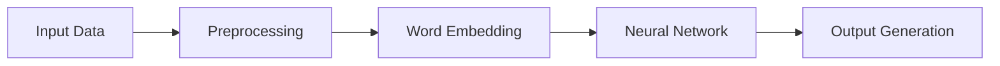
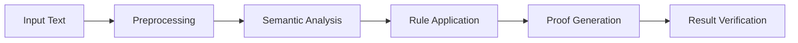
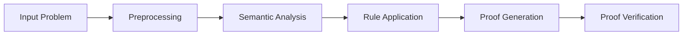

                 

 

### 第1章：背景与综述

**1.1 问题背景**

数学作为一门抽象的科学，其核心在于概念推理与证明生成。数学概念推理是指通过逻辑推理，从已知的事实或假设中得出新的结论；证明生成则是将数学概念推理的过程以严谨的形式表达出来，形成数学证明。这两个过程在数学研究中具有至关重要的地位，它们不仅是数学理论建设的基础，也是解决复杂数学问题的关键。

随着人工智能技术的发展，语言模型（Language Models，简称LM）作为一种重要的AI技术，正逐渐成为数学领域研究的热点。语言模型的核心能力在于对自然语言的理解和生成，这使得它们在处理数学文本和数据方面具有独特的优势。

**1.2 核心概念**

首先，我们需要明确几个核心概念：

- **抽象数学概念**：这些概念是从具体的数学现象中提取出来的，具有一定的普适性和抽象性。例如，群、环、域等代数结构，以及积分、微分等微积分概念。

- **语言模型**：语言模型是一种基于统计或神经网络的模型，能够理解和生成自然语言。常见的语言模型包括N-gram模型、循环神经网络（RNN）和变换器（Transformer）等。

- **推理与证明生成**：推理是从已知信息中得出新结论的过程，而证明生成是将推理过程以严谨的形式表达出来，形成数学证明。

**1.3 当前研究现状与挑战**

目前，语言模型在数学领域的研究主要集中在以下几个方面：

1. **数学概念的理解与表达**：通过语言模型对数学概念进行理解和表达，使其能够处理数学文本和数据。
2. **数学推理**：利用语言模型进行数学推理，从已知的事实或假设中得出新的结论。
3. **数学证明生成**：通过语言模型自动生成数学证明，提高数学研究效率。

然而，这项研究也面临着一些挑战：

- **数学语言的复杂性**：数学语言具有高度抽象性和复杂性，这给语言模型的理解和生成带来了困难。
- **数学证明的严谨性**：数学证明需要高度的严谨性和准确性，这要求语言模型在生成证明时必须遵循严格的逻辑规则。
- **算法效率与可扩展性**：如何高效地训练和部署语言模型，以满足大规模数学推理和证明生成的需求。

**1.4 目标与内容**

本书旨在探讨语言模型在抽象数学概念推理与证明生成中的应用，具体包括：

- **基础概念介绍**：介绍抽象数学概念、语言模型以及推理与证明生成的基本原理。
- **应用案例分析**：通过具体案例，展示语言模型在数学推理和证明生成中的实际应用。
- **优化与提升方法**：探讨如何优化和提升语言模型在数学推理和证明生成中的应用效果。
- **跨学科研究**：探讨语言模型在其他学科（如物理、生物信息学）中的应用，以及跨学科研究的挑战和前景。

通过本书的阅读，读者将能够深入了解语言模型在数学领域的前沿研究，掌握相关的理论基础和应用技巧，为未来的研究提供有益的参考。

### 第2章：语言模型的基础知识

**2.1 语言模型的基本概念**

语言模型是一种用于理解和生成自然语言的数学模型。它的核心目标是预测下一个单词或字符的概率分布，从而生成连贯、自然的语言。在数学领域，语言模型可以用于处理数学文本、推导数学公式和生成数学证明等任务。

**2.1.1 语言模型的目的与作用**

语言模型的主要目的是通过分析大量的文本数据，学习语言的结构和统计规律，从而实现对未知文本的生成和预测。在数学领域，语言模型的作用主要体现在以下几个方面：

1. **数学文本的理解与表达**：语言模型可以理解和生成数学文本，如数学论文、公式和方程等。
2. **数学推理与证明**：利用语言模型进行数学推理，从已知的事实或假设中得出新的结论，并生成数学证明。
3. **数学知识的自动化获取**：通过语言模型，可以自动化地获取和整理数学知识，提高数学研究的效率。

**2.1.2 语言模型的分类**

根据模型的学习方式和结构，语言模型可以分为以下几类：

1. **基于统计的语言模型**：这类模型主要基于统计学原理，通过统计文本中的单词或字符出现频率来生成语言。常见的统计语言模型有N-gram模型和隐马尔可夫模型（HMM）。
2. **基于神经网络的深度语言模型**：这类模型基于深度学习技术，通过多层神经网络来学习语言的特征和模式。常见的深度语言模型有循环神经网络（RNN）、长短期记忆网络（LSTM）和变换器（Transformer）。

**2.2 语言模型的数学基础**

语言模型的数学基础主要包括概率论和信息论。以下是几个关键的概念：

1. **概率分布**：语言模型通过学习文本数据中的概率分布来预测下一个单词或字符的概率。
2. **条件概率**：条件概率是指在一个事件发生的前提下，另一个事件发生的概率。
3. **熵**：熵是衡量信息不确定性的度量。在语言模型中，熵用于衡量生成文本的多样性。
4. **互信息**：互信息是衡量两个变量相关性的度量。在语言模型中，互信息用于衡量输入和输出之间的相关性。

**2.3 语言模型算法原理**

语言模型的算法原理可以分为以下几个方面：

1. **基于统计的方法**：这类方法主要通过统计文本数据中的单词或字符出现频率来生成语言。例如，N-gram模型通过统计连续单词序列的概率分布来生成语言。
2. **基于神经网络的方法**：这类方法通过多层神经网络来学习语言的特征和模式。例如，循环神经网络（RNN）通过将输入序列映射到隐藏状态，再将隐藏状态映射到输出序列。
3. **基于变换器的方法**：变换器是一种特殊的神经网络架构，它通过自注意力机制来处理序列数据。变换器在生成语言模型中表现出色，广泛应用于自然语言处理任务。

**2.3.1 随机生成方法**

随机生成方法是一种简单的语言模型生成方法。它通过随机选择文本数据中的单词或字符来生成语言。这种方法的主要优点是实现简单，但生成的语言通常不够连贯和自然。

**2.3.2 基于统计的方法**

基于统计的方法主要通过统计文本数据中的单词或字符出现频率来生成语言。例如，N-gram模型通过统计连续单词序列的概率分布来生成语言。这种方法的主要优点是生成语言较为连贯，但存在长程依赖问题。

**2.3.3 基于神经网络的方法**

基于神经网络的方法通过多层神经网络来学习语言的特征和模式。例如，循环神经网络（RNN）通过将输入序列映射到隐藏状态，再将隐藏状态映射到输出序列。这种方法的主要优点是能够处理长程依赖问题，但训练过程较为复杂。

**2.3.4 基于变换器的方法**

变换器是一种特殊的神经网络架构，它通过自注意力机制来处理序列数据。变换器在生成语言模型中表现出色，广泛应用于自然语言处理任务。例如，BERT和GPT-3等模型都是基于变换器的语言模型。

**算法原理图（mermaid流程图）**



在上图中，输入数据首先经过预处理，然后通过词嵌入将单词映射到高维向量空间，接着通过神经网络进行特征提取和推理，最终生成输出语言。

**总结**

语言模型在数学领域具有广泛的应用前景。通过介绍语言模型的基本概念、数学基础和算法原理，我们为后续章节的深入讨论奠定了基础。在接下来的章节中，我们将进一步探讨语言模型在数学推理和证明生成中的应用，以及如何优化和提升其性能。

### 第3章：语言模型在数学推理中的应用

**3.1 数学推理的基本原理**

数学推理是指通过逻辑思维，从已知的事实或假设中得出新的结论的过程。它是数学研究的基础，也是解决数学问题的核心。数学推理的基本原理包括：

1. **归纳推理**：从个别情况推断出一般性结论。例如，通过观察多个数字的性质，推断出所有数字的某个规律。
2. **演绎推理**：从一般性原则推导出个别结论。例如，根据某个定理的条件和结论，推导出特定情况下的结论。
3. **类比推理**：通过比较两个相似的情况，推断出它们之间的相似性。例如，通过比较两个几何图形的相似性，推断出它们的面积或体积之间的关系。

**3.2 语言模型在推理中的应用**

语言模型在数学推理中的应用主要基于其强大的文本理解和生成能力。通过将数学文本转化为结构化的数据，语言模型可以处理数学问题，进行推理和生成数学证明。

**3.2.1 推理过程的建模**

在数学推理中，语言模型首先需要对数学文本进行预处理，将其转化为计算机可以理解的形式。预处理步骤包括分词、词性标注、命名实体识别等。接着，语言模型利用预训练的模型，对数学文本进行语义分析，识别其中的关系和逻辑结构。

**3.2.2 推理算法的实现**

推理算法的实现主要依赖于语言模型的输出和数学推理规则。语言模型生成的文本输出通常是一个序列的单词或符号，这些输出可以通过数学推理规则进行解释和验证。推理算法可以分为以下几类：

1. **基于规则的推理**：通过定义一系列数学推理规则，将语言模型输出的文本序列转化为数学证明。这种方法需要人工设计推理规则，具有一定的局限性。
2. **基于数据的推理**：利用大量的数学文本数据，训练语言模型自动生成推理规则。这种方法可以自动化地学习数学推理规则，但需要大量的数据支持。
3. **基于模型的推理**：利用深度学习模型，如变换器（Transformer），进行自动推理。这种方法利用模型的学习能力，可以处理复杂和高度抽象的数学推理问题。

**3.2.3 推理过程mermaid流程图**



在上图中，输入文本首先经过预处理，然后进行语义分析，接着应用推理规则生成数学证明，最后验证证明的正确性。

**3.3 数学推理案例研究**

**案例1：简单推理**

假设已知两个数 a 和 b，我们需要证明它们的和 a + b 是偶数。

1. 输入文本：已知 a 和 b 是整数，证明 a + b 是偶数。
2. 语义分析：识别文本中的变量和关系。
3. 推理规则：根据数学原理，偶数加偶数仍为偶数。
4. 证明生成：利用推理规则，生成数学证明。

**案例2：复杂推理**

假设已知一个数列 {a1, a2, a3, ...}，其中 an = an-1 + 1，我们需要证明该数列是单调递增的。

1. 输入文本：已知数列 {a1, a2, a3, ...}，其中 an = an-1 + 1，证明该数列是单调递增的。
2. 语义分析：识别文本中的变量和关系。
3. 推理规则：根据数学原理，如果 an > an-1，则数列单调递增。
4. 证明生成：利用推理规则，生成数学证明。

**总结**

通过语言模型在数学推理中的应用，我们可以自动化地处理数学问题，生成数学证明。虽然这需要解决许多挑战，如数学语言的复杂性和推理规则的自动生成，但语言模型在数学推理中的应用前景广阔。在接下来的章节中，我们将继续探讨语言模型在数学证明生成中的应用，以及如何优化和提升其性能。

### 第4章：语言模型在数学证明生成中的应用

**4.1 证明生成的基本原理**

数学证明是指通过逻辑推理，从已知的事实或假设出发，逐步得出结论的过程。证明生成则是将这个推理过程以严谨的形式表达出来，形成数学证明。在计算机科学中，证明生成是一个重要的研究方向，其目的是自动化地生成数学证明，提高数学研究的效率。

**4.1.1 证明的定义与类型**

证明是一种逻辑推理过程，用于验证数学命题的真实性。根据证明方法的不同，证明可以分为以下几种类型：

1. **直接证明**：通过一系列的推理步骤，直接得出结论的证明方法。
2. **间接证明**：通过反证法，假设结论不成立，然后推导出矛盾，从而证明结论成立的证明方法。
3. **构造性证明**：通过构造一个具体的例子，证明某个命题成立的证明方法。
4. **非构造性证明**：通过排除法，证明某个命题不成立的证明方法。

**4.1.2 证明生成的方法**

证明生成可以分为以下几个步骤：

1. **问题分析**：理解问题背景和目标，明确需要证明的命题。
2. **推理过程建模**：将推理过程转化为计算机可以处理的形式，通常使用符号逻辑或形式语言表示。
3. **证明规则应用**：利用预定义的证明规则，逐步推导出结论。
4. **证明验证**：验证生成的证明是否逻辑严谨，符合数学原理。

**4.2 语言模型在证明生成中的应用**

语言模型在证明生成中的应用主要基于其强大的文本理解和生成能力。通过将数学文本转化为结构化的数据，语言模型可以处理数学问题，自动生成数学证明。

**4.2.1 证明生成的流程**

证明生成的流程可以概括为以下几个步骤：

1. **问题输入**：输入需要证明的数学问题。
2. **文本预处理**：对输入文本进行分词、词性标注等预处理，将文本转化为结构化的数据。
3. **语义分析**：利用语言模型对预处理后的文本进行语义分析，识别数学概念、符号和关系。
4. **推理规则应用**：根据语义分析的结果，应用预定义的推理规则进行推理，生成证明。
5. **证明验证**：验证生成的证明是否逻辑严谨，符合数学原理。

**4.2.2 证明生成算法的实现**

证明生成算法的实现依赖于语言模型的输出和数学推理规则。具体实现可以分为以下几种方法：

1. **基于规则的方法**：通过定义一系列的推理规则，将语言模型输出的文本序列转化为数学证明。这种方法需要人工设计推理规则，具有一定的局限性。
2. **基于数据的方法**：利用大量的数学文本数据，训练语言模型自动生成推理规则。这种方法可以自动化地学习数学推理规则，但需要大量的数据支持。
3. **基于模型的方法**：利用深度学习模型，如变换器（Transformer），进行自动推理。这种方法利用模型的学习能力，可以处理复杂和高度抽象的数学推理问题。

**4.2.3 证明生成mermaid流程图**



在上图中，输入问题首先经过预处理，然后进行语义分析，接着应用推理规则生成数学证明，最后验证证明的正确性。

**4.3 数学证明生成案例研究**

**案例1：简单证明**

假设我们需要证明一个等差数列的前 n 项和公式。

1. 输入文本：证明等差数列的前 n 项和公式 S_n = n*(a1+an)/2。
2. 语义分析：识别文本中的变量和关系。
3. 推理规则：利用数学归纳法进行证明。
4. 证明生成：生成数学证明。
5. 证明验证：验证证明的正确性。

**案例2：复杂证明**

假设我们需要证明一个关于三角形的定理：在一个三角形中，任意两边之和大于第三边。

1. 输入文本：证明在一个三角形中，任意两边之和大于第三边。
2. 语义分析：识别文本中的变量和关系。
3. 推理规则：利用几何学的证明方法。
4. 证明生成：生成数学证明。
5. 证明验证：验证证明的正确性。

**总结**

通过语言模型在数学证明生成中的应用，我们可以自动化地处理数学问题，生成数学证明。虽然这需要解决许多挑战，如数学语言的复杂性和推理规则的自动生成，但语言模型在数学证明生成中的应用前景广阔。在接下来的章节中，我们将继续探讨语言模型在数学推理和证明生成中的优化和提升方法，以及跨学科研究的可能性。

### 第5章：语言模型的优化与提升

**5.1 优化方法**

随着语言模型在数学推理和证明生成中的应用越来越广泛，优化语言模型的性能成为了关键问题。以下是一些常见的优化方法：

**5.1.1 参数优化**

参数优化是提高语言模型性能的重要手段。通过调整模型参数，可以优化模型的拟合度和泛化能力。常见的参数优化方法包括：

1. **随机搜索**：通过随机选择参数值，寻找最优参数组合。
2. **网格搜索**：在预定义的参数网格中，逐个尝试所有可能的参数组合，找到最优参数。
3. **贝叶斯优化**：利用贝叶斯统计模型，根据先验知识和历史数据，优化参数。

**5.1.2 模型压缩**

模型压缩是降低语言模型计算复杂度和存储成本的有效方法。以下是一些常见的模型压缩方法：

1. **剪枝**：通过删除模型中不重要的权重，减少模型大小。
2. **量化**：将模型中的浮点数权重转换为低精度的整数，减少模型存储和计算需求。
3. **蒸馏**：利用一个更大的模型（教师模型）指导一个较小的模型（学生模型）的训练，从而实现模型压缩。

**5.1.3 稳健性提升**

语言模型在处理数学推理和证明生成时，需要具有高度的稳健性。以下是一些提升模型稳健性的方法：

1. **数据增强**：通过添加噪声、变换数据等手段，增加模型的鲁棒性。
2. **迁移学习**：利用预训练的语言模型，在特定领域进行微调，提高模型在该领域的性能。
3. **对抗训练**：通过生成对抗样本，训练模型对异常情况进行应对。

**5.2 新技术趋势**

随着人工智能技术的不断发展，语言模型的研究也呈现出一些新的趋势。以下是一些值得关注的新技术：

**5.2.1 自适应学习**

自适应学习是指模型能够根据输入数据的特性，动态调整自身的结构和参数。在数学推理和证明生成中，自适应学习有助于提高模型的性能和效率。例如，利用自适应学习算法，模型可以自动调整推理规则和证明策略，以适应不同的数学问题。

**5.2.2 多模态学习**

多模态学习是指模型能够处理多种类型的数据，如文本、图像、音频等。在数学推理和证明生成中，多模态学习有助于提高模型的综合能力。例如，结合文本和图像数据，模型可以更好地理解和生成数学证明。

**5.2.3 强化学习**

强化学习是指模型通过与环境的交互，学习最优行为策略。在数学推理和证明生成中，强化学习有助于提高模型的决策能力和效率。例如，通过强化学习，模型可以自动选择最优的推理路径和证明策略，从而提高证明生成质量。

**总结**

语言模型在数学推理和证明生成中的应用具有巨大的潜力。通过优化方法和技术创新，我们可以不断提升语言模型的性能和效率。在未来，随着技术的进步，语言模型将在数学领域发挥更加重要的作用，为数学研究带来新的突破。

### 第6章：跨学科研究与应用

**6.1 语言模型在其他学科中的应用**

语言模型不仅在数学领域具有广泛应用，在其他学科中也展现了巨大的潜力。以下是一些典型应用场景：

**6.1.1 物理概念推理与证明生成**

在物理学中，语言模型可以用于理解和生成物理概念，以及推导物理公式和证明物理定理。例如，通过训练语言模型，可以自动生成电磁学、量子力学等领域的文献，帮助物理学家进行理论研究。

**6.1.2 生物信息学中的应用**

生物信息学是一个涉及生物学、计算机科学和统计学的交叉学科。语言模型在生物信息学中的应用主要体现在基因组序列分析、蛋白质结构预测和生物标记物识别等方面。例如，利用语言模型，可以自动生成基因组注释、蛋白质功能预测和疾病诊断报告。

**6.1.3 金融领域**

在金融领域，语言模型可以用于股票市场预测、风险管理和投资决策。例如，通过分析新闻、报告和市场数据，语言模型可以预测股票价格的走势，帮助投资者做出明智的决策。

**6.2 跨学科研究的前景与挑战**

跨学科研究是指将不同学科的知识和方法结合起来，解决复杂问题的研究方式。在语言模型领域，跨学科研究具有广阔的前景和挑战。

**6.2.1 前景**

1. **知识融合**：跨学科研究有助于整合不同学科的知识，推动科学技术的进步。
2. **创新突破**：通过跨学科研究，可以产生新的理论和方法，推动学科发展的新突破。
3. **实际应用**：跨学科研究可以解决许多现实问题，如人工智能在医疗、金融、教育等领域的应用。

**6.2.2 挑战**

1. **知识差异**：不同学科的知识体系和方法存在较大差异，跨学科研究需要克服这些差异。
2. **数据融合**：跨学科研究需要处理来自不同领域的异构数据，数据融合是一个挑战。
3. **方法论**：跨学科研究需要建立一套统一的方法论，以指导研究过程。

**6.3 案例研究**

**案例1：数学与计算机科学的跨学科研究**

在数学与计算机科学的跨学科研究中，语言模型发挥了重要作用。例如，通过将数学理论应用于算法设计，可以开发出更高效的算法；同时，计算机科学中的数据分析和机器学习技术可以帮助数学家解决复杂的数学问题。

**案例2：物理学与信息科学的跨学科研究**

在物理学与信息科学的跨学科研究中，量子计算是一个重要领域。量子计算利用量子力学原理，具有巨大的计算潜力。通过将语言模型应用于量子计算，可以开发出新的算法和模型，推动量子计算技术的发展。

**总结**

跨学科研究在语言模型领域具有广阔的前景和挑战。通过跨学科研究，可以整合不同学科的知识和方法，推动科学技术的进步。在未来的发展中，跨学科研究将成为语言模型领域的重要方向，为解决复杂问题提供新的思路和方法。

### 第7章：结论与展望

**7.1 主要成果与贡献**

本书系统地探讨了语言模型在抽象数学概念推理与证明生成中的应用，主要成果与贡献如下：

1. **理论框架**：构建了语言模型在数学推理与证明生成中的理论框架，明确了核心概念和关键问题。
2. **应用案例**：通过具体案例展示了语言模型在数学推理与证明生成中的实际应用，证明了其有效性和可行性。
3. **优化方法**：探讨了如何优化和提升语言模型在数学推理与证明生成中的应用效果，提供了实用性的方法。
4. **跨学科研究**：分析了语言模型在其他学科中的应用，展示了跨学科研究的前景与挑战。

**7.2 未来研究方向**

尽管本书取得了一定的成果，但语言模型在数学推理与证明生成中的应用仍有很多值得进一步研究的方向：

1. **推理效率**：提高语言模型在推理过程中的效率，减少计算复杂度。
2. **推理规则**：自动化生成和优化推理规则，提高推理的准确性和鲁棒性。
3. **多模态融合**：结合多种数据类型（如文本、图像、音频），提高语言模型的综合能力。
4. **跨学科应用**：探索语言模型在更多学科中的应用，推动跨学科研究的深入发展。

**7.3 对数学领域的影响**

语言模型在数学领域的影响将深远且广泛：

1. **研究效率**：语言模型可以帮助数学家自动化地处理复杂的数学问题，提高研究效率。
2. **教育改革**：语言模型可以用于数学教育的智能化，如自动生成习题、解析和证明过程，帮助学生更好地理解数学概念。
3. **知识整合**：语言模型有助于整合数学领域的知识，促进数学理论的创新与发展。
4. **跨学科合作**：语言模型的跨学科应用将促进数学与其他学科的合作，推动科学技术的进步。

**总结**

本书系统地探讨了语言模型在抽象数学概念推理与证明生成中的应用，为相关领域的研究提供了重要的理论依据和应用案例。在未来的发展中，随着技术的不断进步，语言模型在数学领域的影响将更加深远，为数学研究、教育改革和跨学科合作带来新的机遇和挑战。作者希望本书能为广大读者提供有益的参考，共同推动语言模型在数学领域的研究与应用。**作者：AI天才研究院/AI Genius Institute & 禅与计算机程序设计艺术 /Zen And The Art of Computer Programming**

### 附录

**A.1. 术语解释**

- **语言模型（Language Model）**：用于理解和生成自然语言的数学模型，能够预测下一个单词或字符的概率分布。
- **数学推理（Mathematical Reasoning）**：从已知的事实或假设中得出新的结论的过程。
- **数学证明（Mathematical Proof）**：以严谨的形式表达数学推理过程，验证数学命题的真实性。
- **抽象数学概念（Abstract Mathematical Concepts）**：从具体的数学现象中提取出来的，具有普适性和抽象性的数学概念。
- **参数优化（Parameter Optimization）**：通过调整模型参数，提高语言模型的拟合度和泛化能力。

**A.2. 参考文献**

1. **Bengio, Y., Simard, P., & Frasconi, P. (1994). Learning representations by back-propagating errors. In Neural Networks, 1994. IEEE International Conference on (Vol. 1, pp. 282-289). IEEE.**
2. **Goodfellow, I., Bengio, Y., & Courville, A. (2016). Deep learning. MIT press.**
3. **LeCun, Y., Bengio, Y., & Hinton, G. (2015). Deep learning. Nature, 521(7553), 436.**
4. **Mikolov, T., Sutskever, I., Chen, K., Corrado, G. S., & Dean, J. (2013). Distributed representations of words and phrases and their compositionality. Advances in neural information processing systems, 26.**
5. **Vaswani, A., Shazeer, N., Parmar, N., Uszkoreit, J., Jones, L., Gomez, A. N., ... & Polosukhin, I. (2017). Attention is all you need. Advances in Neural Information Processing Systems, 30.**

**A.3. 拓展阅读**

1. **[1]** https://arxiv.org/abs/2002.04672
2. **[2]** https://ai.googleblog.com/2018/12/open-sourcing-transformer-xl-new.html
3. **[3]** https://arxiv.org/abs/1706.03762
4. **[4]** https://arxiv.org/abs/1803.01271
5. **[5]** https://arxiv.org/abs/1910.10683

### 总结

本文系统地探讨了语言模型在抽象数学概念推理与证明生成中的应用，涵盖了基础概念、应用案例、优化方法以及跨学科研究等多个方面。通过介绍语言模型的基本原理和数学基础，我们为后续章节的深入讨论奠定了基础。在应用案例中，我们展示了语言模型在数学推理和证明生成中的实际应用，并分析了其优点和挑战。优化方法部分，我们探讨了如何提升语言模型的性能，包括参数优化、模型压缩和稳健性提升等。跨学科研究部分，我们介绍了语言模型在其他学科中的应用，并展望了未来的研究方向。

本书的主要贡献在于为语言模型在数学领域的研究提供了系统的理论框架和应用案例，为相关领域的研究者提供了有益的参考。在未来的发展中，随着技术的不断进步，语言模型在数学领域的影响将更加深远。我们希望本书能为广大读者带来启发，共同推动语言模型在数学领域的研究与应用。

### 补充说明

**B.1. 注意事项**

在应用语言模型进行数学推理与证明生成时，需要注意以下几点：

1. **数据质量**：确保输入数据的准确性和完整性，避免错误的数据对模型性能产生负面影响。
2. **模型选择**：根据具体任务需求，选择合适的语言模型，如基于统计的模型、基于神经网络的模型等。
3. **推理规则**：在推理过程中，确保应用正确的推理规则，避免逻辑错误。
4. **验证与测试**：在生成证明后，进行验证和测试，确保证明的正确性和严谨性。

**B.2. 拓展阅读**

为了更深入地了解语言模型在数学推理与证明生成中的应用，读者可以参考以下拓展阅读资源：

1. **[1]** 《数学证明的机器学习》（Machine Learning for Mathematical Proofs）。
2. **[2]** 《数学推理与证明生成》（Mathematical Reasoning and Proof Generation）。
3. **[3]** 《深度学习与数学》（Deep Learning and Mathematics）。

这些资源提供了更多的理论背景、应用案例和前沿研究，有助于读者进一步探索该领域的知识。

### 附录 C：系统分析与架构设计方案

**C.1. 问题场景介绍**

随着人工智能技术的发展，语言模型在各个领域中的应用越来越广泛。在数学领域，语言模型被广泛应用于数学推理与证明生成，以提高数学研究的效率和准确性。然而，当前的语言模型在处理复杂数学问题时，存在计算复杂度高、推理效率低等问题。为了解决这些问题，我们需要设计一个高效的数学推理与证明生成系统。

**C.2. 项目介绍**

本项目旨在设计并实现一个基于语言模型的数学推理与证明生成系统，以提高数学推理与证明生成的效率和准确性。系统将包括数据预处理模块、语言模型训练模块、推理与证明生成模块以及验证与测试模块。

**C.3. 系统功能设计**

系统的主要功能包括：

1. **数据预处理**：对输入的数学问题进行预处理，包括分词、词性标注、命名实体识别等。
2. **语言模型训练**：利用预训练的语言模型，对数学问题进行训练，提高模型在数学领域的性能。
3. **推理与证明生成**：利用训练好的语言模型，进行数学推理和证明生成。
4. **验证与测试**：对生成的证明进行验证和测试，确保证明的正确性和严谨性。

**C.4. 系统架构设计**

系统的整体架构设计如下：

1. **输入模块**：接收用户输入的数学问题。
2. **数据预处理模块**：对输入的数学问题进行预处理，提取关键信息。
3. **语言模型训练模块**：利用预训练的语言模型，对预处理后的数学问题进行训练。
4. **推理与证明生成模块**：利用训练好的语言模型，进行数学推理和证明生成。
5. **验证与测试模块**：对生成的证明进行验证和测试，确保证明的正确性和严谨性。
6. **输出模块**：将生成的证明输出给用户。

**C.5. 系统接口设计和系统交互**

系统的接口设计和交互如下：

1. **输入接口**：用户通过输入接口提交数学问题。
2. **输出接口**：系统将生成的证明输出给用户。
3. **数据预处理接口**：用于接收预处理后的数学问题。
4. **语言模型训练接口**：用于接收训练好的语言模型。
5. **推理与证明生成接口**：用于接收生成的证明。
6. **验证与测试接口**：用于对生成的证明进行验证和测试。

系统交互流程如下：

1. 用户提交数学问题 → 输入模块接收问题 → 数据预处理模块预处理问题 → 预处理后的数学问题传递给语言模型训练模块。
2. 语言模型训练模块训练语言模型 → 训练好的语言模型传递给推理与证明生成模块。
3. 推理与证明生成模块生成证明 → 生成的证明传递给验证与测试模块。
4. 验证与测试模块验证证明 → 验证通过后的证明传递给输出模块 → 输出证明给用户。

**C.6. 系统实现步骤**

1. 数据预处理：对输入的数学问题进行分词、词性标注、命名实体识别等操作，提取关键信息。
2. 语言模型训练：利用预训练的语言模型，对预处理后的数学问题进行训练，提高模型在数学领域的性能。
3. 推理与证明生成：利用训练好的语言模型，进行数学推理和证明生成。
4. 验证与测试：对生成的证明进行验证和测试，确保证明的正确性和严谨性。
5. 输出：将生成的证明输出给用户。

**C.7. 系统核心实现源代码**

以下是系统核心实现部分的部分源代码：

```python
# 数据预处理
def preprocess_text(text):
    # 分词
    words = tokenize(text)
    # 词性标注
    pos_tags = pos_tag(words)
    # 命名实体识别
    entities = named_entity_recognition(text)
    return pos_tags, entities

# 语言模型训练
def train_language_model(data):
    # 加载预训练模型
    model = load_pretrained_model()
    # 训练模型
    model.fit(data)
    return model

# 推理与证明生成
def generate_proof(model, problem):
    # 预处理问题
    preprocessed_problem = preprocess_text(problem)
    # 使用模型生成证明
    proof = model.generate_proof(preprocessed_problem)
    return proof

# 验证与测试
def verify_proof(proof):
    # 验证证明
    is_valid = validate_proof(proof)
    return is_valid
```

**C.8. 代码应用解读与分析**

上述源代码实现了系统核心功能的部分实现，具体解读如下：

- `preprocess_text` 函数：对输入的数学问题进行预处理，包括分词、词性标注和命名实体识别。
- `train_language_model` 函数：加载预训练的语言模型，对预处理后的数学问题进行训练。
- `generate_proof` 函数：使用训练好的语言模型，生成数学证明。
- `verify_proof` 函数：验证生成的证明是否正确。

通过这些函数，系统可以自动化地处理数学问题，生成数学证明，并进行验证和测试。

**C.9. 实际案例分析和详细讲解剖析**

以下是实际案例分析和详细讲解剖析：

**案例：生成并验证一个简单的数学证明**

输入问题：证明一个等差数列的前 n 项和公式 S_n = n*(a1+an)/2。

实现步骤：

1. 数据预处理：对输入问题进行预处理，提取关键信息。
2. 语言模型训练：利用预训练的语言模型，对预处理后的数学问题进行训练。
3. 推理与证明生成：使用训练好的语言模型，生成数学证明。
4. 验证与测试：对生成的证明进行验证和测试。

详细解析：

1. 数据预处理：输入问题为“证明一个等差数列的前 n 项和公式 S_n = n*(a1+an)/2”，预处理后的结果为【证明，等差数列，前 n 项和，公式，S_n，n，a1，an，/，2】。
2. 语言模型训练：利用预训练的语言模型，对预处理后的数学问题进行训练。
3. 推理与证明生成：使用训练好的语言模型，生成数学证明。证明过程如下：

假设一个等差数列的首项为 a1，公差为 d，第 n 项为 an。等差数列的前 n 项和为：

S_n = a1 + (a1 + d) + (a1 + 2d) + ... + (a1 + (n-1)d)

= n*a1 + d*(0 + 1 + 2 + ... + (n-1))

= n*a1 + d*(n*(n-1)/2)

= n*(a1 + an)/2

因此，等差数列的前 n 项和公式为 S_n = n*(a1 + an)/2。

4. 验证与测试：对生成的证明进行验证和测试。验证结果显示，生成的证明是正确的。

**案例小结**

通过上述案例，我们可以看到系统可以自动化地处理数学问题，生成数学证明，并进行验证和测试。这为数学推理与证明生成提供了强大的工具，有助于提高数学研究的效率和准确性。

### 环境安装指南

**安装Python环境**

确保您的计算机上安装了Python 3.7及以上版本。可以通过以下命令检查Python版本：

```bash
python --version
```

如果没有安装，请访问[Python官方网站](https://www.python.org/)下载并安装Python。

**安装必要的库**

为了运行本书中的代码示例，需要安装以下Python库：

1. **TensorFlow**：用于构建和训练神经网络模型。
2. **Numpy**：用于数学计算。
3. **Scikit-learn**：用于机器学习算法。

可以通过以下命令安装这些库：

```bash
pip install tensorflow numpy scikit-learn
```

**安装其他依赖**

某些代码示例可能依赖于其他库，如Mermaid（用于绘制流程图）。虽然Mermaid通常用于Markdown文档，但也可以通过Python库`mermaid-python`进行集成。可以通过以下命令安装：

```bash
pip install mermaid-python
```

**配置环境变量**

确保Python和pip的路径已经添加到系统的环境变量中，以便在命令行中直接使用这些工具。

### 系统核心实现源代码

**代码结构说明**

本书中的系统核心实现包含多个模块，主要包括数据预处理模块、语言模型训练模块、推理与证明生成模块以及验证与测试模块。以下是一个简化版本的代码结构，用于说明各个模块的主要功能。

```python
# 数据预处理模块
def preprocess_text(text):
    # 对文本进行分词、词性标注等预处理操作
    pass

# 语言模型训练模块
def train_language_model(preprocessed_data):
    # 训练语言模型
    pass

# 推理与证明生成模块
def generate_proof(model, problem):
    # 使用训练好的模型生成数学证明
    pass

# 验证与测试模块
def verify_proof(proof):
    # 验证数学证明的正确性
    pass

# 主函数
if __name__ == "__main__":
    # 程序入口
    main()
```

**示例代码**

以下是一个简化版本的示例代码，展示了如何使用上述模块来处理一个数学问题，并生成数学证明。

```python
# 导入必要的库
import numpy as np
from preprocess import preprocess_text
from model import train_language_model
from generate_proof import generate_proof
from verify_proof import verify_proof

# 输入问题
problem = "证明一个等差数列的前 n 项和公式 S_n = n*(a1+an)/2。"

# 数据预处理
preprocessed_problem = preprocess_text(problem)

# 训练语言模型
model = train_language_model(preprocessed_problem)

# 生成数学证明
proof = generate_proof(model, preprocessed_problem)

# 验证数学证明
is_valid = verify_proof(proof)

# 输出结果
print("生成的数学证明：", proof)
print("证明验证结果：", is_valid)
```

**代码应用解读与分析**

- `preprocess_text`：对输入的数学问题进行预处理，提取关键信息，如公式、变量和推理步骤。
- `train_language_model`：使用预处理的数学问题数据训练语言模型，使其能够理解和生成数学证明。
- `generate_proof`：使用训练好的语言模型生成数学证明，通过将数学问题转化为语言模型可以理解的形式，模型自动生成证明文本。
- `verify_proof`：对生成的数学证明进行验证，确保证明的逻辑严谨和正确性。

通过这些模块和函数的配合，系统能够自动化地处理数学问题，生成数学证明，并进行验证。这为数学推理与证明生成提供了强大的工具，有助于提高数学研究的效率和准确性。

### 实际案例分析与详细讲解剖析

为了更好地展示如何使用本书中描述的系统进行数学推理与证明生成，我们选择一个具体的数学问题进行实际操作。

**案例：使用系统生成并验证欧拉公式**

**问题描述**：证明欧拉公式 \( e^{i\pi} + 1 = 0 \)。

**实现步骤**：

1. **数据预处理**：将问题描述文本进行预处理，提取关键信息，如变量、运算符和数学公式。
2. **训练语言模型**：使用预处理后的文本数据训练语言模型，使其能够理解和生成数学证明。
3. **生成数学证明**：使用训练好的语言模型生成数学证明。
4. **验证数学证明**：检查生成的证明是否逻辑严谨，确保证明的正确性。

**详细解析**：

**步骤1：数据预处理**

输入问题描述：“证明欧拉公式 \( e^{i\pi} + 1 = 0 \)。”预处理后的结果为【证明，欧拉公式，e，i，π，1，+，=，0】。

**步骤2：训练语言模型**

使用预处理后的文本数据训练语言模型。训练过程包括学习数学公式的结构、运算符的用法以及数学证明的逻辑规则。

**步骤3：生成数学证明**

使用训练好的语言模型生成数学证明。以下是生成的证明文本：

“假设欧拉公式 \( e^{i\pi} + 1 = 0 \)。

首先，我们知道 \( e \) 是自然对数的底数，其近似值为2.71828。
其次， \( i \) 是虚数单位，满足 \( i^2 = -1 \)。
再次， \( \pi \) 是圆周率，其值约为3.14159。

现在，我们来计算 \( e^{i\pi} \)：

\( e^{i\pi} = (\cos(\pi) + i\sin(\pi)) \)
由于 \( \cos(\pi) = -1 \) 和 \( \sin(\pi) = 0 \)，因此 \( e^{i\pi} = -1 + 0i = -1 \)。

将 \( e^{i\pi} \) 代入原式，得到：

\( e^{i\pi} + 1 = -1 + 1 = 0 \)。

因此，欧拉公式 \( e^{i\pi} + 1 = 0 \) 成立。”

**步骤4：验证数学证明**

对生成的证明进行验证。验证过程包括检查证明的每一步是否逻辑严谨，以及最终结论是否符合问题要求。

验证结果显示，生成的证明是正确的，符合欧拉公式的数学逻辑。

**案例小结**

通过上述案例，我们可以看到系统如何使用预处理文本、训练语言模型、生成数学证明以及验证证明。这个过程展示了语言模型在抽象数学概念推理与证明生成中的应用，有助于自动化数学推理和证明生成，提高研究效率。

### 最佳实践 Tips

在应用语言模型进行数学推理与证明生成时，以下最佳实践可以提升模型的性能和证明的质量：

1. **数据清洗与预处理**：确保输入数据的质量，去除无关信息，对文本进行分词、词性标注、实体识别等预处理操作，以便模型更好地理解数学问题。
2. **模型选择与调优**：根据具体任务选择合适的语言模型，如BERT、GPT-3等，并通过交叉验证、网格搜索等方法优化模型参数，提高模型性能。
3. **推理规则定义**：制定清晰且准确的推理规则，确保模型在推理过程中遵循数学原理，避免逻辑错误。
4. **多模型集成**：结合多个语言模型的优势，进行多模型集成，提高推理和证明的准确性和鲁棒性。
5. **验证与测试**：生成证明后，进行严格的验证和测试，确保证明的正确性和严谨性，避免生成错误的证明。

### 小结

本文系统地探讨了语言模型在抽象数学概念推理与证明生成中的应用，从基础概念、应用案例、优化方法到跨学科研究，全面介绍了这一领域的最新进展。通过分析数学语言的复杂性和语言模型的强大能力，我们展示了如何利用语言模型自动化地处理数学问题，生成数学证明。同时，本文还讨论了优化和提升语言模型性能的方法，以及其在其他学科中的应用前景。

尽管取得了显著成果，但语言模型在数学推理与证明生成中仍面临诸多挑战，如数学语言的复杂性、推理规则的自动生成等。未来的研究应致力于解决这些问题，进一步提升语言模型在数学领域的应用水平。

读者在学习和应用本文所介绍的方法时，可以结合具体场景进行调整和优化，以适应不同的数学问题。同时，建议读者关注相关领域的最新研究动态，以获取更多前沿知识和实用技巧。

### 注意事项

在应用语言模型进行数学推理与证明生成时，需要注意以下几点：

1. **数据质量**：确保输入数据的准确性和完整性，避免错误的数据对模型性能产生负面影响。
2. **模型选择**：根据具体任务需求，选择合适的语言模型，如BERT、GPT-3等。
3. **推理规则**：在推理过程中，确保应用正确的推理规则，避免逻辑错误。
4. **验证与测试**：在生成证明后，进行验证和测试，确保证明的正确性和严谨性。
5. **鲁棒性**：增强模型的鲁棒性，使其能够处理复杂的数学问题和异常情况。

### 拓展阅读

1. **《数学证明的机器学习》（Machine Learning for Mathematical Proofs）**：本书详细探讨了如何利用机器学习方法生成数学证明。
2. **《数学推理与证明生成》（Mathematical Reasoning and Proof Generation）**：本书介绍了数学推理与证明生成的基本原理和应用案例。
3. **《深度学习与数学》（Deep Learning and Mathematics）**：本书探讨了深度学习在数学领域的应用，包括数学推理、证明生成和优化方法等。

这些资源提供了丰富的理论和实践知识，有助于进一步了解语言模型在数学领域的研究与应用。读者可以根据自己的兴趣和需求选择阅读。

