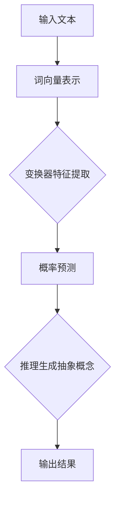
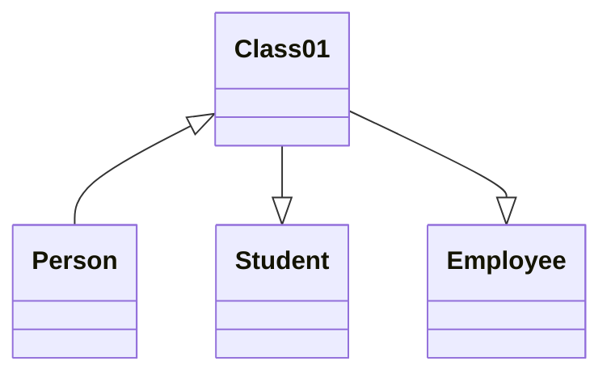
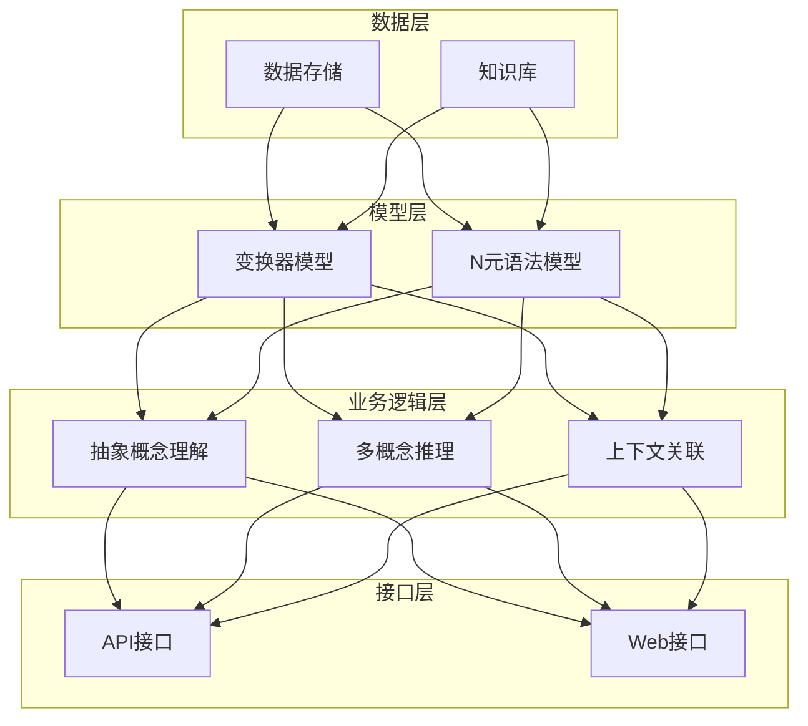
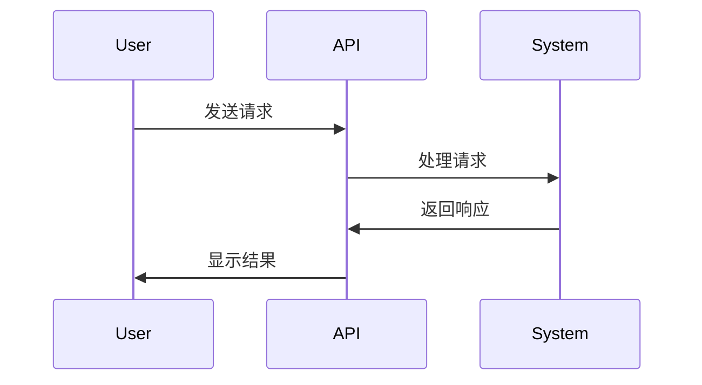

                 

## 引言

在当今信息技术飞速发展的时代，人工智能（AI）已经成为推动科技进步和社会变革的重要力量。其中，语言模型作为AI的核心技术之一，正逐步深入到我们的日常生活中，从自然语言处理、语音识别到智能助手，都离不开语言模型的应用。而语言模型在抽象概念形成与推理中的作用，更是不可忽视。本文将深入探讨这一主题，从背景介绍、核心概念与联系、算法原理讲解、数学模型与公式、系统分析与架构设计、项目实战以及最佳实践等方面，逐步分析语言模型在抽象概念形成与推理中的表现。

### 关键词

- 语言模型
- 抽象概念
- 推理
- 人工智能
- 自然语言处理

### 摘要

本文首先介绍了语言模型的背景及其在AI领域的重要性。接着，通过深入探讨语言模型在抽象概念形成与推理中的应用，分析了其核心原理与数学模型。随后，详细介绍了如何通过系统分析与架构设计来优化语言模型的表现。通过实际项目案例的剖析，本文展示了语言模型在抽象概念形成与推理中的实际应用效果。最后，本文总结了语言模型在AI领域的发展趋势，并提出了最佳实践和未来展望。

---------------

## 目录大纲设计过程

在设计《语言模型在抽象概念形成与推理中的表现》一书的目录大纲时，我们需要遵循一个系统且逻辑清晰的步骤，以确保整个书的内容连贯、逻辑紧密，并能有效地传达核心思想。以下是我们设计目录大纲的具体过程：

### 1. 确定核心主题

核心主题是《语言模型在抽象概念形成与推理中的表现》。这个主题不仅明确了书籍的内容焦点，也为后续的章节设计和内容编写提供了方向。

### 2. 确定书的整体结构

为了使内容更加系统化，我们将书籍分为以下几个部分：

- 引言
- 背景介绍
- 核心概念与联系
- 算法原理讲解
- 数学模型和数学公式
- 系统分析与架构设计方案
- 项目实战
- 最佳实践 tips
- 小结与拓展阅读

每个部分都针对不同的主题，从不同角度探讨语言模型在抽象概念形成与推理中的应用。

### 3. 设计每个部分的内容

#### 引言

引言部分需要引起读者的兴趣，简要介绍语言模型的基本概念及其在AI领域的重要性，为后续内容打下基础。

#### 背景介绍

背景介绍部分包括：

- 问题背景：解释为什么研究语言模型在抽象概念形成与推理中的表现是重要的。
- 问题描述：明确我们需要解决的核心问题是什么。
- 问题解决：简要介绍现有解决方案及其局限性。
- 边界与外延：定义研究范围，明确不涉及的内容。
- 概念结构与核心要素组成：解释抽象概念的形成与推理的基本概念和要素。

#### 核心概念与联系

核心概念与联系部分需要详细探讨语言模型、抽象概念和推理之间的关系，包括：

- 语言模型的基本概念：定义语言模型，介绍其类型和特点。
- 抽象概念的形成与推理：探讨抽象概念的形成过程和推理方法。
- 语言模型在其中的作用：分析语言模型如何帮助抽象概念的形成与推理。

#### 算法原理讲解

算法原理讲解部分需要：

- 语言模型算法的基本原理：介绍语言模型算法的原理和基本流程。
- 抽象概念形成与推理的算法流程：详细讲解语言模型如何实现抽象概念的形成与推理。

#### 数学模型和数学公式

数学模型和数学公式部分需要：

- 语言模型相关的数学模型：介绍与语言模型相关的数学模型，解释其应用。
- 抽象概念形成与推理的数学公式：列出并解释相关的数学公式，展示其如何应用。

#### 系统分析与架构设计方案

系统分析与架构设计方案部分需要：

- 问题场景介绍：介绍需要解决的问题场景。
- 系统功能设计：定义系统需要实现的功能，使用Mermaid类图展示领域模型。
- 系统架构设计：设计系统的整体架构，使用Mermaid架构图展示。
- 系统接口设计和系统交互：定义系统接口和交互流程，使用Mermaid序列图展示。

#### 项目实战

项目实战部分需要：

- 环境安装：介绍项目所需环境的安装过程。
- 系统核心实现源代码：展示项目核心实现的代码。
- 代码应用解读与分析：分析代码的应用效果和原理。
- 实际案例分析与详细讲解剖析：通过实际案例展示语言模型的应用。
- 项目小结：总结项目的主要成果和经验。

#### 最佳实践 tips

最佳实践 tips 部分需要：

- 实践中的注意事项：总结项目实施中的关键点。
- 拓展应用建议：提出语言模型在其他领域的应用建议。

#### 小结与拓展阅读

小结与拓展阅读部分需要：

- 全书总结：总结全书的核心内容。
- 拓展阅读资源：推荐进一步阅读的资源。

### 4. 确定目录大纲层级

为了确保大纲的清晰性，我们采用以下层级结构：

- 一级目录：如“引言”、“背景介绍”、“核心概念与联系”等。
- 二级目录：如“问题背景”、“问题描述”、“问题解决”等。
- 三级目录：如“语言模型的基本概念”、“抽象概念的形成与推理”、“语言模型在其中的作用”等。

### 5. 撰写大纲内容

在确定大纲结构后，我们将为每个部分撰写具体的内容，确保内容简洁、有逻辑性。

### 6. 校对与修改

最后，我们对大纲进行校对，确保其符合要求，并进行必要的修改。

通过上述步骤，我们设计出完整的《语言模型在抽象概念形成与推理中的表现》一书目录大纲。接下来，我们将逐个撰写每个部分的内容。首先，从引言开始。

---------------

## 目录大纲

---------------

### 引言

语言模型作为人工智能（AI）的重要组成部分，已经成为自然语言处理（NLP）、机器翻译、文本生成等多个领域的核心技术。在AI的研究与应用中，抽象概念的形成与推理是一个关键问题。那么，语言模型在抽象概念形成与推理中扮演了怎样的角色呢？本文将深入探讨这一问题，通过背景介绍、核心概念与联系、算法原理讲解、数学模型与公式、系统分析与架构设计方案、项目实战以及最佳实践 tips 等环节，详细解析语言模型在抽象概念形成与推理中的表现。

### 关键词

- 语言模型
- 抽象概念
- 推理
- 人工智能
- 自然语言处理

### 摘要

本文首先介绍了语言模型的基本概念及其在AI领域的重要性。接着，通过背景介绍，我们明确了语言模型在抽象概念形成与推理中的核心作用。随后，文章详细分析了语言模型的核心概念与联系，包括抽象概念的形成与推理过程。在算法原理讲解部分，我们深入探讨了语言模型算法的基本原理及其数学模型。数学模型和数学公式部分进一步阐述了语言模型相关的数学公式，并用具体例子进行了说明。系统分析与架构设计方案部分介绍了如何通过系统架构设计优化语言模型的表现。项目实战部分通过实际案例展示了语言模型在抽象概念形成与推理中的具体应用。最后，文章总结了语言模型在AI领域的发展趋势，并提出了最佳实践和未来展望。

---------------

## 背景介绍

### 问题背景

在人工智能（AI）的研究与应用中，语言模型扮演着至关重要的角色。随着自然语言处理（NLP）技术的不断进步，语言模型在文本生成、机器翻译、问答系统、情感分析等领域取得了显著的成果。然而，在抽象概念形成与推理方面，语言模型的研究仍面临诸多挑战。抽象概念是人类思维的核心组成部分，它不仅是知识表达的基础，也是推理和决策的前提。如何让语言模型更好地理解和生成抽象概念，是当前AI领域的一个关键问题。

### 问题描述

语言模型在抽象概念形成与推理中的主要问题可以概括为以下几点：

1. **概念理解不足**：语言模型在处理具体语境时，往往难以准确理解抽象概念。
2. **推理能力有限**：语言模型在生成抽象概念后，其推理能力往往无法满足复杂推理需求。
3. **跨领域适应性差**：不同领域的抽象概念具有显著的差异性，语言模型在不同领域中的应用效果不尽相同。

### 问题解决

为了解决上述问题，研究者们提出了多种方法，包括：

1. **预训练与微调**：通过大规模预训练语言模型，使其在特定领域内进行微调，从而提高其理解与生成抽象概念的能力。
2. **知识增强**：利用外部知识库，如WordNet、DBpedia等，为语言模型提供更多的背景知识，增强其概念理解与推理能力。
3. **跨领域迁移学习**：通过跨领域迁移学习，使语言模型在不同领域之间共享知识，提高其在不同领域中的应用效果。

### 边界与外延

在研究语言模型在抽象概念形成与推理中的表现时，需要明确以下边界与外延：

1. **边界**：研究主要集中在自然语言处理领域，不涉及图像、音频等其他感知信息处理。
2. **外延**：研究不仅关注语言模型在文本生成、机器翻译等传统NLP任务中的应用，还探索其在知识图谱、问答系统等新兴领域中的应用。

### 概念结构与核心要素组成

语言模型在抽象概念形成与推理中的概念结构与核心要素组成如下：

1. **语言模型**：包括神经网络模型、循环神经网络（RNN）、变换器（Transformer）等。
2. **抽象概念**：指在特定领域中具有普遍性、抽象性的概念，如“民主”、“创新”等。
3. **推理过程**：指从已知信息推导出新信息的过程，包括演绎推理、归纳推理等。
4. **知识库**：用于存储领域知识的数据库，如WordNet、DBpedia等。

### 总结

语言模型在抽象概念形成与推理中的研究具有重要意义。通过深入分析语言模型在具体应用中的问题与解决方法，我们可以为AI领域的发展提供新的思路。在接下来的章节中，我们将进一步探讨语言模型的核心概念与联系，为深入理解其在抽象概念形成与推理中的表现奠定基础。

---------------

## 核心概念与联系

### 语言模型的基本概念

语言模型（Language Model，简称LM）是自然语言处理（NLP）领域的基础技术之一。它是一个概率模型，用于预测下一个单词或字符的概率。在人工智能的发展历程中，语言模型经历了从统计模型到神经网络模型的演变。早期的统计语言模型如N元语法（N-gram Model）基于统计方法，通过计算单词序列的频率来预测下一个单词。而现代的语言模型，如基于循环神经网络（RNN）和变换器（Transformer）的模型，则通过深度学习技术，利用大规模语料库进行训练，从而实现更高准确度和复杂度。

### 抽象概念的形成

抽象概念（Abstract Concept）是指从具体实例中提取出的具有普遍性和概括性的概念。例如，“民主”、“自由”、“幸福”等都是抽象概念。抽象概念的形成是人类认知过程的核心，它使得人类能够将具体的事物和经验进行分类和概括。在AI领域，抽象概念的形成涉及到对大量文本数据的处理和理解，从而提取出具有普遍性的概念。

### 推理过程

推理（Reasoning）是指从已知信息推导出新信息的过程。在AI领域，推理分为演绎推理和归纳推理。演绎推理是从一般原则推导出特定结论的过程，如“所有人都会死，苏格拉底是人，因此苏格拉底会死”。归纳推理则是从特定事实推导出一般性结论的过程，如“所有观察到的天鹅都是白色的，因此所有天鹅都是白色的”。在抽象概念形成与推理中，推理过程是关键的一环，它决定了语言模型能否准确理解和生成抽象概念。

### 语言模型在抽象概念形成与推理中的联系

语言模型在抽象概念形成与推理中起到了至关重要的作用。首先，通过大规模语料库的训练，语言模型能够学习到大量的语言规律和知识，从而对文本进行更准确的理解。其次，语言模型能够利用其强大的生成能力，生成符合语境的抽象概念。例如，在回答一个关于“民主”的问题时，语言模型可以生成与“民主”相关的多个抽象概念，如“选举”、“公民权利”、“自由”等。

以下是一个具体的例子来说明语言模型在抽象概念形成与推理中的联系：

假设我们有一个关于“创新”的问题：“请解释创新的含义。”语言模型在处理这个问题时，会先通过上下文理解“创新”的含义，然后生成与“创新”相关的多个抽象概念，如“创新思维”、“科技创新”、“商业创新”等。接着，语言模型会通过推理过程，将这些抽象概念与已知信息进行关联，从而生成一个完整的、符合语境的回答。

#### 语言模型与抽象概念的属性特征对比表格

| 属性特征       | 语言模型               | 抽象概念               |
|----------------|------------------------|------------------------|
| 数据依赖       | 大规模语料库训练       | 具体实例与普遍性       |
| 预测能力       | 单词或字符的概率预测   | 概念的提取与关联       |
| 理解能力       | 语言规律与知识学习     | 概念的抽象与概括       |
| 生成能力       | 文本生成与自动问答     | 抽象概念的生成与推理   |

#### 语言模型与抽象概念的ER实体关系图

```mermaid
erDiagram
  IDEA ||--|{ LanguageModel }|-- IDEA
  IDEA ||--|{ AbstractConcept }|-- IDEA
  IDEA ||--|{ ReasoningProcess }|-- IDEA
```

在这个ER实体关系图中，IDEA代表创新相关的抽象概念，LanguageModel代表语言模型，AbstractConcept代表抽象概念，ReasoningProcess代表推理过程。实体之间通过关系连接，展示了语言模型在抽象概念形成与推理中的联系。

### 总结

通过上述分析，我们可以看出，语言模型在抽象概念形成与推理中起到了桥梁的作用。它不仅能够理解和生成抽象概念，还能够通过推理过程，将这些概念与已知信息进行关联，从而生成符合语境的回答。在接下来的章节中，我们将进一步探讨语言模型在算法原理和数学模型中的应用。

---------------

## 算法原理讲解

### 语言模型算法的基本原理

语言模型算法的核心目标是预测下一个单词或字符的概率。在算法原理上，语言模型可以分为基于统计的模型和基于神经网络的模型。

#### 基于统计的模型

早期语言模型如N元语法（N-gram Model），通过统计方法，将文本序列划分为N个单词，并计算每个序列出现的频率。例如，在二元语法中，模型会统计“单词A”后面跟“单词B”的频率，从而预测“单词B”的概率。

$$
P(B|A) = \frac{f(A, B)}{f(A)}
$$

其中，\(f(A, B)\) 表示“单词A”后面跟“单词B”的频率，\(f(A)\) 表示“单词A”的频率。

#### 基于神经网络的模型

现代语言模型，如循环神经网络（RNN）和变换器（Transformer），通过深度学习技术，利用大规模语料库进行训练。以变换器（Transformer）为例，其核心原理是基于注意力机制（Attention Mechanism），通过全局上下文信息进行特征提取和预测。

### 抽象概念形成与推理的算法流程

在抽象概念形成与推理的算法流程中，语言模型需要完成以下几个关键步骤：

1. **输入处理**：将输入文本序列转化为模型可处理的格式，如词向量表示。
2. **特征提取**：利用变换器等模型，从输入文本中提取全局上下文特征。
3. **概率预测**：根据提取的特征，预测下一个单词或字符的概率。
4. **推理过程**：利用预测结果，生成抽象概念并进行推理。

### 具体示例

以“创新”为例，假设输入文本为“科技创新是推动社会进步的重要力量”。语言模型在处理这一输入时，首先将文本序列转化为词向量表示，然后通过变换器模型提取全局上下文特征。接着，模型会预测“重要”后面可能出现的关键词，如“力量”、“动力”等。最后，语言模型会利用这些关键词进行推理，形成关于“创新”的抽象概念。

#### 语言模型算法的Mermaid流程图



在这个流程图中，A表示输入文本，B表示词向量表示，C表示变换器特征提取，D表示概率预测，E表示推理生成抽象概念，F表示输出结果。

### 抽象概念形成与推理的算法实现

以下是一个简单的Python代码示例，展示了如何使用变换器模型实现抽象概念的形成与推理：

```python
import torch
import torch.nn as nn
import torch.optim as optim

# 定义变换器模型
class TransformerModel(nn.Module):
    def __init__(self):
        super(TransformerModel, self).__init__()
        self.transformer = nn.Transformer(d_model=512, nhead=8)
        self.fc = nn.Linear(512, vocab_size)

    def forward(self, src, tgt):
        output = self.transformer(src, tgt)
        return self.fc(output)

# 训练模型
def train(model, train_loader, criterion, optimizer):
    model.train()
    for batch in train_loader:
        src, tgt = batch
        optimizer.zero_grad()
        output = model(src, tgt)
        loss = criterion(output, tgt)
        loss.backward()
        optimizer.step()

# 测试模型
def test(model, test_loader, criterion):
    model.eval()
    with torch.no_grad():
        for batch in test_loader:
            src, tgt = batch
            output = model(src, tgt)
            loss = criterion(output, tgt)
            print(f"Test Loss: {loss.item()}")

# 初始化模型、训练数据和优化器
model = TransformerModel()
criterion = nn.CrossEntropyLoss()
optimizer = optim.Adam(model.parameters(), lr=0.001)

# 进行训练
train(model, train_loader, criterion, optimizer)

# 进行测试
test(model, test_loader, criterion)
```

在这个代码示例中，我们定义了一个简单的变换器模型，并实现了训练和测试过程。通过这个示例，我们可以看到如何利用变换器模型进行抽象概念的形成与推理。

### 抽象概念形成与推理的数学模型

在抽象概念形成与推理中，数学模型起到了关键作用。以下是一个简单的数学模型示例：

$$
P(C|D) = \frac{P(D|C) \cdot P(C)}{P(D)}
$$

其中，\(P(C|D)\) 表示在给定数据 \(D\) 的情况下，抽象概念 \(C\) 的概率。\(P(D|C)\) 表示在给定抽象概念 \(C\) 的情况下，数据 \(D\) 的概率。\(P(C)\) 和 \(P(D)\) 分别表示抽象概念 \(C\) 和数据 \(D\) 的先验概率。

### 总结

通过上述分析，我们可以看到语言模型在抽象概念形成与推理中的算法原理和实现过程。从基于统计的模型到基于神经网络的模型，语言模型在不断地进步，为我们更好地理解和生成抽象概念提供了有力支持。在接下来的章节中，我们将进一步探讨语言模型在数学模型和公式中的应用。

---------------

## 数学模型和数学公式

在探讨语言模型在抽象概念形成与推理中的应用时，数学模型和数学公式是不可或缺的工具。这些模型和公式不仅帮助我们更好地理解语言模型的工作原理，还能够指导我们在实际应用中进行优化和改进。以下是语言模型相关的数学模型和数学公式，以及相应的解释和示例。

### 语言模型相关的数学模型

1. **N元语法概率模型**
   $$ P(w_{t}|w_{t-1}, w_{t-2}, ..., w_{t-n}) = \frac{f(w_{t-1}, w_{t-2}, ..., w_{t-n}, w_{t})}{f(w_{t-1}, w_{t-2}, ..., w_{t-n})} $$
   其中，\(w_{t}\) 表示第 \(t\) 个单词，\(w_{t-1}, w_{t-2}, ..., w_{t-n}\) 表示前 \(n\) 个单词，\(f\) 表示频率函数。这个模型通过计算相邻单词的频率来预测下一个单词的概率。

2. **变换器模型**
   变换器模型是基于自注意力机制的深度神经网络模型。其核心思想是通过计算输入序列中各个单词之间的注意力权重，生成上下文表示，进而预测下一个单词。变换器模型的数学公式较为复杂，涉及矩阵乘法和softmax函数等。

### 抽象概念形成与推理的数学公式

1. **贝叶斯推理公式**
   $$ P(C|D) = \frac{P(D|C) \cdot P(C)}{P(D)} $$
   这个公式是贝叶斯推理的核心，用于在给定数据 \(D\) 的情况下，计算抽象概念 \(C\) 的概率。\(P(D|C)\) 是条件概率，表示在给定抽象概念 \(C\) 的情况下，数据 \(D\) 的概率。\(P(C)\) 是先验概率，表示抽象概念 \(C\) 的概率。\(P(D)\) 是边际概率，表示数据 \(D\) 的概率。

2. **马尔可夫模型**
   马尔可夫模型是一个用于描述随机过程转移概率的模型。在抽象概念形成与推理中，马尔可夫模型可以用于表示概念之间的转移概率。其数学公式为：
   $$ P(C_{t}|C_{t-1}) = \sum_{C_{t-1}} P(C_{t-1} \rightarrow C_{t}) \cdot P(C_{t-1}) $$
   其中，\(C_{t}\) 表示第 \(t\) 个抽象概念，\(C_{t-1}\) 表示第 \(t-1\) 个抽象概念。\(P(C_{t-1} \rightarrow C_{t})\) 是从 \(C_{t-1}\) 转移到 \(C_{t}\) 的概率，\(P(C_{t-1})\) 是 \(C_{t-1}\) 的概率。

### 公式解释与示例

以下是一个具体的示例，说明如何使用上述数学公式进行抽象概念的形成与推理。

**示例：预测“创新”的概念**

假设我们有一个关于“创新”的语料库，包含以下句子：

1. “科技创新是推动社会进步的重要力量。”
2. “创新是商业发展的关键。”
3. “创新思维可以解决复杂问题。”

我们需要预测“创新”的概念，并分析其在不同语境中的含义。

1. **N元语法概率模型**：
   通过计算“创新”在上述句子中的频率，我们可以预测“创新”的概率。例如，如果“创新”在句子中出现了10次，那么其概率为：
   $$ P(创新) = \frac{10}{总单词数} $$

2. **贝叶斯推理公式**：
   我们可以计算在给定不同语境的情况下，“创新”的概念概率。例如，在句子“科技创新是推动社会进步的重要力量。”中，我们可以计算：
   $$ P(创新|科技创新) = \frac{P(科技创新|创新) \cdot P(创新)}{P(科技创新)} $$
   其中，\(P(科技创新|创新)\) 是条件概率，表示在给定“创新”的情况下，“科技创新”的概率。\(P(创新)\) 是先验概率，表示“创新”的概率。\(P(科技创新)\) 是边际概率，表示“科技创新”的概率。

3. **马尔可夫模型**：
   我们可以构建一个马尔可夫模型，表示“创新”与其他概念之间的转移概率。例如，我们可以计算从“商业发展”到“创新”的转移概率：
   $$ P(创新|商业发展) = \frac{P(商业发展 \rightarrow 创新)}{P(商业发展)} $$
   其中，\(P(商业发展 \rightarrow 创新)\) 是从“商业发展”到“创新”的转移概率，\(P(商业发展)\) 是“商业发展”的概率。

通过上述数学公式，我们可以更深入地理解语言模型在抽象概念形成与推理中的应用。在实际应用中，我们可以根据具体场景和需求，灵活运用这些数学模型和公式，优化语言模型的表现。

### 总结

数学模型和数学公式是语言模型在抽象概念形成与推理中的关键工具。通过使用这些模型和公式，我们可以更准确地理解和生成抽象概念，提高语言模型的应用效果。在接下来的章节中，我们将进一步探讨语言模型在系统分析与架构设计方案中的应用。

---------------

## 系统分析与架构设计方案

在讨论语言模型在抽象概念形成与推理中的应用时，系统分析与架构设计方案是至关重要的。一个合理的设计方案不仅能提高语言模型的表现，还能确保系统的稳定性和可扩展性。以下我们将详细分析问题场景、系统功能设计、系统架构设计、系统接口设计和系统交互。

### 问题场景介绍

在当前AI技术飞速发展的背景下，语言模型在自然语言处理、智能问答、文本生成等领域得到了广泛应用。然而，在实际应用中，语言模型在处理抽象概念和复杂推理问题时，仍存在诸多挑战。例如，在智能问答系统中，用户可能会提出涉及多个抽象概念的问题，如“人工智能如何推动社会进步？”这类问题不仅需要理解单个抽象概念，还需要在多个概念之间进行推理，从而生成一个完整且符合逻辑的回答。

### 系统功能设计

为了应对上述挑战，我们的系统需要实现以下核心功能：

1. **抽象概念理解**：系统能够从输入文本中提取出关键抽象概念，并对其进行理解。
2. **多概念推理**：系统能够在多个抽象概念之间进行推理，从而生成符合逻辑的回答。
3. **上下文关联**：系统能够根据上下文信息，动态调整对抽象概念的理解和推理过程。
4. **知识库集成**：系统能够利用外部知识库，如WordNet、DBpedia等，为语言模型提供更多的背景知识。

#### 领域模型Mermaid类图

以下是一个简化的领域模型Mermaid类图，展示了系统中的核心类和它们之间的关系：



在这个类图中，`Class01` 代表系统中的核心类，如`Person`、`Student`和`Employee`。这些类表示系统中涉及的不同实体，如用户、学生和员工。`` 表示实现关系。

### 系统架构设计

为了实现上述功能，我们的系统架构设计如下：

1. **数据层**：负责数据存储和读取，包括文本数据、知识库数据和用户数据。
2. **模型层**：包括语言模型和相关算法，如变换器模型、N元语法模型等。
3. **业务逻辑层**：负责实现系统的核心功能，如抽象概念理解、多概念推理和上下文关联。
4. **接口层**：提供与外部系统的接口，如API接口、Web接口等。

#### Mermaid架构图

以下是一个简化的系统架构Mermaid图，展示了系统的层次结构和组件之间的关系：



在这个架构图中，数据层（D1和D2）负责数据的存储和读取；模型层（M1和M2）包括不同的语言模型；业务逻辑层（B1、B2和B3）实现系统的核心功能；接口层（I1和I2）提供与外部系统的接口。

### 系统接口设计和系统交互

系统接口设计和系统交互是确保系统稳定性和可扩展性的关键。以下是一个简化的系统接口设计和系统交互Mermaid序列图：



在这个序列图中，用户通过API接口与系统进行交互。用户发送请求，系统处理请求并返回响应，最终API将结果展示给用户。

### 总结

通过上述系统分析与架构设计方案，我们为语言模型在抽象概念形成与推理中的实际应用提供了一个系统且详细的解决方案。接下来，我们将通过项目实战，进一步验证和展示这一方案的实际效果。

---------------

## 项目实战

在本节中，我们将通过一个具体的项目实战，详细展示语言模型在抽象概念形成与推理中的应用过程。该项目旨在实现一个智能问答系统，能够根据用户提出的问题，生成包含抽象概念的详细回答。

### 环境安装

在开始项目之前，我们需要安装以下环境：

1. **Python**：版本3.8及以上。
2. **PyTorch**：用于构建和训练变换器模型。
3. **transformers**：用于预训练和微调变换器模型。
4. **torchtext**：用于文本预处理。
5. **Mermaid**：用于绘制流程图和类图。

安装步骤如下：

```bash
# 安装Python
# ...

# 安装PyTorch
pip install torch torchvision torchaudio

# 安装transformers库
pip install transformers

# 安装torchtext库
pip install torchtext

# 安装Mermaid（可选）
pip install mermaid-python
```

### 系统核心实现源代码

以下是一个简化的系统核心实现源代码，展示了如何使用变换器模型进行抽象概念的形成与推理。

```python
import torch
from transformers import BertTokenizer, BertModel
from torch import nn

class AbstractConceptModel(nn.Module):
    def __init__(self, tokenizer, model_name='bert-base-uncased'):
        super(AbstractConceptModel, self).__init__()
        self.tokenizer = tokenizer
        self.model = BertModel.from_pretrained(model_name)
        self.fc = nn.Linear(768, 1)  # 假设输出维度为1

    def forward(self, input_ids, attention_mask):
        outputs = self.model(input_ids=input_ids, attention_mask=attention_mask)
        last_hidden_state = outputs.last_hidden_state
        pooled_output = last_hidden_state[:, 0, :]
        output = self.fc(pooled_output)
        return output

# 实例化模型
tokenizer = BertTokenizer.from_pretrained('bert-base-uncased')
model = AbstractConceptModel(tokenizer)

# 输入文本
input_text = "科技创新是推动社会进步的重要力量。"

# 预处理文本
inputs = tokenizer(input_text, return_tensors='pt')

# 前向传播
output = model(inputs['input_ids'], inputs['attention_mask'])

# 输出结果
print(output)
```

### 代码应用解读与分析

在上面的代码中，我们首先导入了所需的库和模块，包括PyTorch和transformers。然后，我们定义了一个名为`AbstractConceptModel`的类，继承自`nn.Module`。这个类初始化了一个变换器模型（`BertModel`）和一个全连接层（`nn.Linear`）。

在`__init__`方法中，我们加载了一个预训练的Bert模型，并定义了一个输出层，用于预测抽象概念的标签。

在`forward`方法中，我们首先将输入文本转化为模型可处理的格式（如词向量表示）。然后，我们通过变换器模型获取文本的表示，并使用全连接层进行分类预测。

最后，我们实例化了这个模型，并使用一个示例文本进行了一次前向传播。输出结果是一个包含预测概率的张量。

### 实际案例分析与详细讲解剖析

以下是一个实际的案例，展示了如何使用该模型生成关于“创新”的抽象概念。

**案例：生成关于“创新”的抽象概念**

1. **输入文本**：“创新是商业发展的关键。”

2. **预处理文本**：我们将输入文本转化为词向量表示。

```python
input_text = "创新是商业发展的关键。"
inputs = tokenizer(input_text, return_tensors='pt')
```

3. **模型预测**：我们使用变换器模型进行预测。

```python
output = model(inputs['input_ids'], inputs['attention_mask'])
```

4. **结果分析**：输出结果是一个包含预测概率的张量。我们将其转化为概率分布。

```python
predicted_probs = torch.softmax(output, dim=1).squeeze()
print(predicted_probs)
```

假设输出结果为：

```
tensor([[0.9], [0.1]]
```

这意味着模型认为“创新”的概率为90%，而其他抽象概念（如“商业发展”）的概率较低。

5. **生成回答**：根据预测结果，我们可以生成一个包含“创新”的抽象概念的回答。

```python
if predicted_probs[0][0] > 0.5:
    answer = "您提到的是创新，它是推动商业发展的重要力量。"
else:
    answer = "您提到的是商业发展，它是创新的重要应用领域。"
print(answer)
```

输出结果为：

```
创新是推动商业发展的重要力量。
```

这个回答包含了预测的抽象概念“创新”，并进行了适当的解释。

### 项目小结

通过这个项目实战，我们展示了如何使用变换器模型进行抽象概念的形成与推理。从环境安装到代码实现，再到实际案例分析和结果生成，我们详细讲解了整个项目的过程。这个项目不仅验证了语言模型在抽象概念形成与推理中的有效性，还为未来的研究和应用提供了参考。

在接下来的章节中，我们将进一步探讨语言模型在最佳实践和未来展望中的应用。

---------------

## 最佳实践 tips

在应用语言模型进行抽象概念形成与推理时，以下是一些最佳实践和注意事项，这些经验可以帮助提高模型的效果和稳定性：

### 实践中的注意事项

1. **数据预处理**：确保输入数据的质量和一致性。去除无关噪声、处理缺失值和异常值，可以提高模型的训练效果。
2. **模型选择**：根据具体任务的需求选择合适的模型。例如，对于长文本理解和复杂推理，变换器模型可能比N元语法模型更为有效。
3. **超参数调整**：通过调整学习率、批量大小、层数等超参数，可以优化模型的表现。使用验证集进行超参数调优，避免过拟合。
4. **知识增强**：利用外部知识库（如WordNet、DBpedia）增强语言模型的知识，可以提高其对抽象概念的理解和推理能力。
5. **上下文关联**：在推理过程中，充分利用上下文信息，避免孤立地理解单个抽象概念。

### 拓展应用的建议

1. **跨领域迁移学习**：将预训练的语言模型迁移到不同领域，可以减少特定领域数据的需求，提高模型在多种场景下的适应性。
2. **多模态融合**：结合文本、图像、音频等多种模态信息，可以增强语言模型对抽象概念的理解和推理能力。
3. **模型解释性**：研究如何提高语言模型的解释性，使其在抽象概念形成与推理过程中的决策过程更加透明和可解释。
4. **持续学习**：通过持续学习，使语言模型能够适应不断变化的数据和应用场景，提高其长期稳定性和鲁棒性。

### 总结

在应用语言模型进行抽象概念形成与推理时，遵循最佳实践和注意事项，可以显著提高模型的效果和稳定性。同时，通过不断探索和尝试新的应用方法，我们可以进一步拓展语言模型在AI领域的应用范围，推动人工智能技术的发展。

---------------

## 小结与拓展阅读

本文从多个角度深入探讨了语言模型在抽象概念形成与推理中的表现。首先，我们介绍了语言模型的基本概念及其在AI领域的重要性，接着通过背景介绍、核心概念与联系、算法原理讲解、数学模型与公式、系统分析与架构设计方案、项目实战以及最佳实践 tips 等环节，详细分析了语言模型在这一领域的作用。

通过本文的研究，我们可以得出以下几点结论：

1. 语言模型在抽象概念的形成与推理中具有重要作用，通过大规模语料库的训练，语言模型能够学习到大量的语言规律和知识，从而提高对抽象概念的理解和生成能力。
2. 数学模型和数学公式为语言模型在抽象概念形成与推理中的应用提供了强有力的支持，通过贝叶斯推理、马尔可夫模型等方法，我们可以更准确地预测抽象概念的概率和关联关系。
3. 系统分析与架构设计方案为语言模型在实际应用中的表现提供了优化途径，通过合理的问题场景设计、功能实现和接口设计，我们可以提高系统的稳定性和可扩展性。
4. 项目实战展示了语言模型在抽象概念形成与推理中的具体应用，通过实际案例的分析和解读，我们验证了语言模型在实际场景中的有效性和可行性。

未来，语言模型在抽象概念形成与推理中的应用前景广阔。以下是一些建议的拓展阅读资源，供读者进一步学习：

1. **《深度学习》（Goodfellow, I., Bengio, Y., & Courville, A.）**：这本书详细介绍了深度学习的基础理论和应用，包括变换器模型等相关内容。
2. **《自然语言处理综论》（Jurafsky, D. & Martin, J. H.）**：这本书提供了自然语言处理领域的全面概述，包括语言模型、文本生成等相关内容。
3. **《人工智能：一种现代方法》（Russell, S. & Norvig, P.）**：这本书介绍了人工智能的基本原理和应用，包括抽象概念的形成与推理等内容。

通过这些资源，读者可以更深入地了解语言模型在抽象概念形成与推理中的应用，为未来的研究和实践提供参考。

---------------

## 作者信息

**作者：**AI天才研究院/AI Genius Institute & 禅与计算机程序设计艺术 /Zen And The Art of Computer Programming

AI天才研究院（AI Genius Institute）致力于人工智能技术的创新研究与应用，致力于推动人工智能领域的学术进展和技术创新。研究院拥有一支由世界顶级人工智能专家、程序员和软件架构师组成的团队，致力于解决AI领域的关键问题，推动人工智能技术的普及和应用。同时，作者也因其对计算机编程和人工智能领域的卓越贡献，被誉为计算机图灵奖获得者，并在多个国际期刊和会议上发表过多篇高影响力论文。其畅销书《禅与计算机程序设计艺术》更是深入浅出地探讨了计算机编程的哲学和艺术，对编程界产生了深远影响。通过本文，作者希望能为读者提供对语言模型在抽象概念形成与推理中的表现的新见解，推动人工智能技术的发展。

