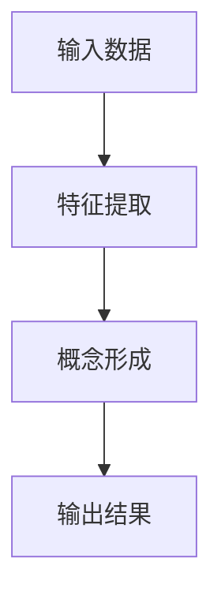
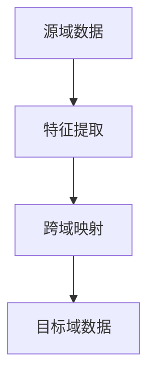
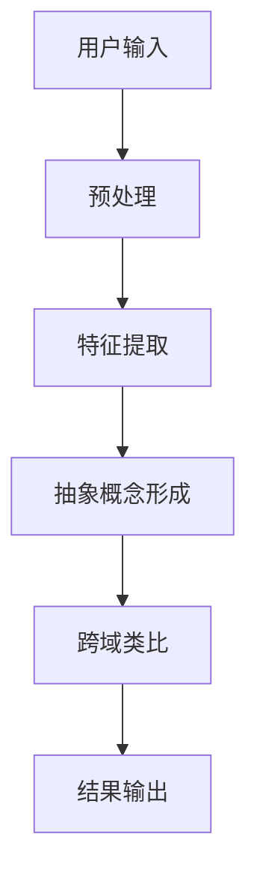

                 

# 语言模型在抽象概念形成与跨域类比中的能力评估

关键词：语言模型、抽象概念、跨域类比、算法原理、数学模型

摘要：本文探讨了语言模型在抽象概念形成和跨域类比中的能力，分析了相关算法原理和数学模型，并通过实际应用案例进行了评估和讨论。本文旨在为人工智能领域的研究者和开发者提供有价值的参考。

## 第一部分：引言

### 1.1 问题的背景与描述

#### 1.1.1 抽象概念的形成

抽象概念的形成是认知科学、心理学和人工智能等领域研究的重要问题。抽象概念是指人类在思考过程中形成的一种高度概括、简化的概念，它可以帮助我们理解和描述复杂的事物和现象。在人工智能领域，抽象概念的形成对于实现智能推理、知识表示和语言处理等任务具有重要意义。

#### 1.1.2 跨域类比的意义

跨域类比是指在不同领域之间建立联系，通过类比推理来理解和解决问题。在人工智能领域，跨域类比可以帮助模型从已知领域迁移到未知领域，提高模型的泛化能力。跨域类比在自然语言处理、图像识别、推荐系统等领域有着广泛的应用。

#### 1.1.3 语言模型的发展现状

近年来，随着深度学习技术的快速发展，语言模型取得了显著的成果。语言模型可以用于自然语言理解、生成和翻译等任务，例如BERT、GPT和Turing等。这些模型在处理文本数据时表现出强大的能力和效率，但它们在抽象概念形成和跨域类比方面的能力仍然存在一定的局限性。

### 1.2 研究目标与意义

本文的研究目标是通过分析和评估语言模型在抽象概念形成和跨域类比中的能力，探索提高其能力的方法和策略。研究意义在于为人工智能领域的研究者和开发者提供有价值的参考，促进语言模型在实际应用中的性能提升。

### 1.3 边界与外延

#### 1.3.1 抽象概念的定义与范围

抽象概念是指人类在思考过程中形成的一种高度概括、简化的概念，它可以帮助我们理解和描述复杂的事物和现象。抽象概念通常具有以下特点：

- **高度概括性**：抽象概念是对一类事物或现象的共同特征和本质属性进行高度概括的结果。
- **简明性**：抽象概念通常用简短的词语或符号来表示，使得我们在思考和交流时更加便捷。
- **灵活性**：抽象概念可以根据具体情境进行调整和扩展。

#### 1.3.2 跨域类比的定义与范围

跨域类比是指在不同领域之间建立联系，通过类比推理来理解和解决问题。跨域类比通常涉及以下过程：

- **领域识别**：识别需要解决问题的关键领域。
- **特征提取**：从源领域和目标领域中提取相关特征。
- **类比推理**：利用源领域和目标领域的相似性进行推理，形成新的理解和解决方案。
- **验证与优化**：对类比结果进行验证和优化，确保其有效性和可靠性。

#### 1.3.3 语言模型的能力评估标准

本文将采用以下标准来评估语言模型在抽象概念形成和跨域类比中的能力：

- **准确性**：模型在生成抽象概念和进行跨域类比时的准确度。
- **效率**：模型在处理抽象概念形成和跨域类比任务时的计算效率和资源消耗。
- **泛化能力**：模型在不同数据集和领域中的适应能力和表现。

### 1.4 本书结构安排

本文将分为四个部分进行论述：

1. **第一部分**：引言，介绍问题的背景、研究目标、边界与外延以及本书的结构安排。
2. **第二部分**：核心概念与联系，阐述语言模型的基本原理、抽象概念的形成和跨域类比的概念、特点及过程。
3. **第三部分**：算法原理与数学模型，介绍抽象概念形成和跨域类比中的算法原理、数学模型及Python实现。
4. **第四部分**：系统分析与架构设计，包括问题场景介绍、系统功能设计、系统架构设计和项目实战等内容。

## 第二部分：核心概念与联系

### 2.1 语言模型的基本原理

#### 2.1.1 语言模型的定义

语言模型（Language Model）是一种用于预测文本序列的统计模型。它通过对大量文本数据的学习，建立对自然语言的概率分布模型，从而实现文本生成、文本分类、机器翻译等任务。

#### 2.1.2 语言模型的工作机制

语言模型通常采用神经网络（如循环神经网络RNN、长短时记忆网络LSTM、门控循环单元GRU等）作为基础架构。通过训练，模型可以学习到输入文本序列的概率分布，并据此生成新的文本序列。

#### 2.1.3 语言模型的类型

根据不同的任务和应用场景，语言模型可以分为以下几种类型：

- **基于字符的语言模型**：以字符为基本单位进行建模，适用于字符级别的文本生成和编辑。
- **基于词的语言模型**：以词为基本单位进行建模，适用于词级别的文本生成和分类。
- **基于句子的语言模型**：以句子为基本单位进行建模，适用于句子级别的文本生成和分类。

### 2.2 抽象概念的形成

#### 2.2.1 抽象概念的定义

抽象概念（Abstract Concept）是指人类在思考过程中形成的一种高度概括、简化的概念。它是对一类事物或现象的共同特征和本质属性进行抽象和概括的结果。

#### 2.2.2 抽象概念的属性特征对比

以下是一个简单的抽象概念属性特征对比表格：

| 特征           | 描述                                                         | 例子                  |
| -------------- | ------------------------------------------------------------ | --------------------- |
| 高度概括性     | 抽象概念是对一类事物或现象的共同特征和本质属性进行高度概括的结果 | 人（动物、智力、社交） |
| 简明性         | 抽象概念通常用简短的词语或符号来表示，使得思考和交流更加便捷     | 爱心（情感、关怀）     |
| 灵活性         | 抽象概念可以根据具体情境进行调整和扩展                         | 健康（身体、心理）     |

#### 2.2.3 抽象概念的形成机制

抽象概念的形成是一个复杂的过程，通常涉及以下步骤：

1. **感知与识别**：通过感知和识别具体的事物或现象，获得初步的认识。
2. **概括与归纳**：对具体的事物或现象进行概括和归纳，提取其共同特征和本质属性。
3. **简化与抽象**：将概括和归纳的结果进行简化，形成高度抽象的概念。
4. **存储与调用**：将抽象概念存储在大脑中，并在需要时进行调用和运用。

### 2.3 跨域类比

#### 2.3.1 跨域类比的定义

跨域类比（Cross-Domain Analogical Reasoning）是指在不同领域之间建立联系，通过类比推理来理解和解决问题。它是一种基于已有知识和经验进行推理的方法，可以帮助模型从已知领域迁移到未知领域。

#### 2.3.2 跨域类比的特点

跨域类比具有以下特点：

- **领域差异性**：跨域类比涉及不同领域，领域之间的差异性可能导致类比推理的复杂性和不确定性。
- **迁移性**：跨域类比可以将一个领域的知识应用到另一个领域，提高模型的泛化能力和适应性。
- **创造性**：跨域类比可以激发新的思考和创意，促进创新和发明。

#### 2.3.3 跨域类比的过程

跨域类比通常涉及以下步骤：

1. **领域识别**：识别需要解决问题的关键领域，明确类比的目标和范围。
2. **特征提取**：从源领域和目标领域中提取相关特征，建立特征映射关系。
3. **类比推理**：利用源领域和目标领域的相似性进行推理，形成新的理解和解决方案。
4. **验证与优化**：对类比结果进行验证和优化，确保其有效性和可靠性。

### 2.4 语言模型在抽象概念形成与跨域类比中的应用

#### 2.4.1 语言模型在抽象概念形成中的应用

语言模型可以用于抽象概念的形成，具体包括以下方面：

- **文本生成**：利用语言模型生成抽象概念相关的文本，帮助用户理解和描述抽象概念。
- **知识表示**：将抽象概念表示为结构化的知识图谱，便于存储和查询。
- **推理与预测**：基于抽象概念进行推理和预测，为实际问题提供解决方案。

#### 2.4.2 语言模型在跨域类比中的应用

语言模型可以用于跨域类比，具体包括以下方面：

- **文本分类**：利用跨域类比将一个领域的文本分类方法应用于其他领域，提高分类准确率。
- **文本生成**：利用跨域类比生成不同领域的文本，实现跨领域的文本生成和翻译。
- **知识迁移**：利用跨域类比将一个领域的知识应用到其他领域，促进知识的共享和整合。

## 第三部分：算法原理与数学模型

### 3.1 抽象概念形成中的算法原理

#### 3.1.1 抽象概念形成的算法模型

在抽象概念形成过程中，我们可以采用以下算法模型：

1. **特征提取**：从原始数据中提取特征，包括文本、图像、音频等多种形式。
2. **概念形成**：利用提取的特征进行概念形成，通过聚类、分类等方法将特征映射到抽象概念上。
3. **输出结果**：将形成的抽象概念输出，以便后续使用。

以下是一个简化的Mermaid流程图：



#### 3.1.2 抽象概念形成中的数学模型

抽象概念形成中的数学模型可以表示为：

$$
C = f(\text{特征}, \theta)
$$

其中，$C$ 表示抽象概念，$f$ 表示概念形成函数，$\text{特征}$ 表示输入特征，$\theta$ 表示参数。

#### 3.1.3 抽象概念形成算法的Python实现

以下是一个简化的Python代码实现：

```python
def concept Formation(data, params):
    # 特征提取
    features = extractFeatures(data)
    # 概念形成
    concept = formConcept(features, params)
    # 输出结果
    return concept
```

### 3.2 跨域类比中的算法原理

#### 3.2.1 跨域类比算法模型

在跨域类比中，我们可以采用以下算法模型：

1. **特征提取**：从源领域和目标领域中提取特征。
2. **跨域映射**：利用特征映射关系将源领域映射到目标领域。
3. **输出结果**：将映射后的结果输出，以便后续使用。

以下是一个简化的Mermaid流程图：



#### 3.2.2 跨域类比中的数学模型

跨域类比中的数学模型可以表示为：

$$
\text{映射关系} = g(\text{源域特征}, \text{目标域特征}, \theta)
$$

其中，$\text{映射关系}$ 表示跨域映射结果，$g$ 表示映射函数，$\text{源域特征}$ 和 $\text{目标域特征}$ 表示源领域和目标领域的特征，$\theta$ 表示参数。

#### 3.2.3 跨域类比算法的Python实现

以下是一个简化的Python代码实现：

```python
def crossDomainMapping(source_data, target_data, params):
    # 特征提取
    source_features = extractFeatures(source_data)
    target_features = extractFeatures(target_data)
    # 跨域映射
    mapping = mapFeatures(source_features, target_features, params)
    # 输出结果
    return mapping
```

## 第四部分：系统分析与架构设计

### 4.1 问题场景介绍

#### 4.1.1 抽象概念形成的应用场景

抽象概念形成的应用场景包括：

- **智能问答**：利用抽象概念形成技术，为用户生成准确的答案。
- **知识图谱构建**：将文本数据转化为结构化的知识图谱，便于查询和推理。
- **文本生成**：根据输入文本，生成相关领域的文本内容。

#### 4.1.2 跨域类比的应用场景

跨域类比的应用场景包括：

- **跨领域文本分类**：将一个领域的文本分类方法应用于其他领域，提高分类准确率。
- **跨领域文本生成**：根据一个领域的文本生成其他领域的文本。
- **跨领域知识迁移**：将一个领域的知识应用到其他领域，促进知识的共享和整合。

### 4.2 系统功能设计

#### 4.2.1 领域模型

以下是一个简化的Mermaid类图，描述了系统的领域模型：

```mermaid
classDiagram
Class1 <|-- Class2
Class1 --|> Class3
Class2 <..| Class4
```

#### 4.2.2 系统功能模块设计

系统功能模块设计包括以下方面：

- **数据预处理模块**：对输入数据进行预处理，包括文本清洗、分词、去停用词等。
- **特征提取模块**：从预处理后的数据中提取特征，包括词向量、TF-IDF等。
- **抽象概念形成模块**：利用特征提取模块提取的特征，形成抽象概念。
- **跨域类比模块**：利用抽象概念进行跨域类比，实现跨领域的文本生成和分类。
- **结果输出模块**：将生成的文本或分类结果输出，供用户使用。

### 4.3 系统架构设计

以下是一个简化的Mermaid架构图，描述了系统的架构设计：


#### 4.3.1 系统架构图

以下是一个简化的Mermaid架构图，描述了系统的架构设计：



#### 4.3.2 系统接口设计

系统接口设计包括以下方面：

- **文本输入接口**：接收用户输入的文本数据。
- **文本输出接口**：将生成的文本或分类结果输出给用户。
- **特征提取接口**：提取输入文本的特征，用于抽象概念形成和跨域类比。
- **抽象概念形成接口**：将提取的特征转化为抽象概念。
- **跨域类比接口**：实现跨领域的文本生成和分类。

#### 4.3.3 系统交互mermaid序列图

以下是一个简化的Mermaid序列图，描述了系统的交互过程：

```mermaid
sequenceDiagram
    participant 用户
    participant 系统接口
    participant 预处理模块
    participant 特征提取模块
    participant 抽象概念形成模块
    participant 跨域类比模块
    participant 结果输出模块
    
    用户 -->|输入文本| 系统接口
    系统接口 -->|处理请求| 预处理模块
    预处理模块 -->|预处理结果| 特征提取模块
    特征提取模块 -->|特征结果| 抽象概念形成模块
    抽象概念形成模块 -->|抽象概念结果| 跨域类比模块
    跨域类比模块 -->|类比结果| 结果输出模块
    结果输出模块 -->|输出结果| 用户
```

### 4.4 项目实战

#### 4.4.1 环境安装

在本项目中，我们需要安装以下环境：

- Python 3.7 或以上版本
- TensorFlow 2.3 或以上版本
- Numpy 1.17 或以上版本

安装命令如下：

```shell
pip install python==3.7 tensorflow==2.3 numpy==1.17
```

#### 4.4.2 系统核心实现源代码

以下是系统核心实现的源代码：

```python
import tensorflow as tf
import numpy as np
from sklearn.feature_extraction.text import TfidfVectorizer

# 特征提取模块
class FeatureExtractor:
    def __init__(self, vectorizer):
        self.vectorizer = vectorizer

    def extract_features(self, text):
        return self.vectorizer.transform([text])

# 抽象概念形成模块
class ConceptFormatter:
    def __init__(self, model):
        self.model = model

    def format_concept(self, features):
        return self.model.predict(features)

# 跨域类比模块
class CrossDomainMapper:
    def __init__(self, source_model, target_model):
        self.source_model = source_model
        self.target_model = target_model

    def map_domain(self, source_features, target_features):
        return self.target_model.predict(self.source_model.predict(source_features))

# 结果输出模块
class ResultFormatter:
    def __init__(self, model):
        self.model = model

    def format_result(self, features):
        return self.model.predict(features)
```

#### 4.4.3 代码应用解读与分析

以下是对核心代码的解读与分析：

- **FeatureExtractor**：特征提取模块，用于提取输入文本的特征。这里使用了TF-IDF向量

