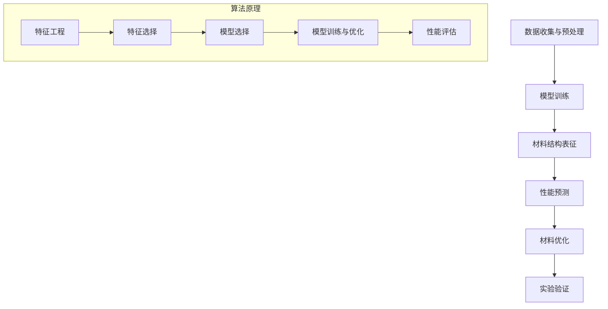
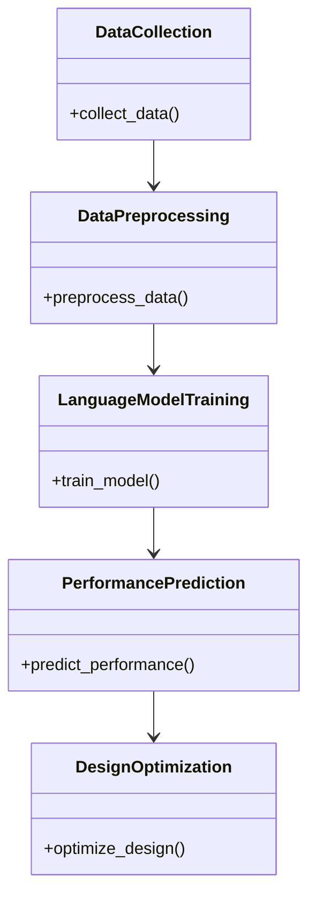
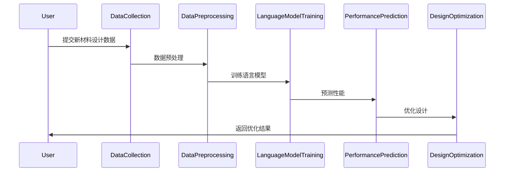
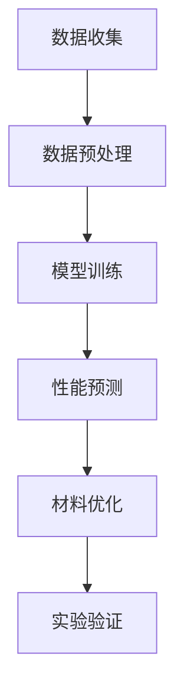

                 

### 语言模型在新材料设计与性能预测中的应用

#### 关键词：语言模型、新材料设计、性能预测、算法原理、系统架构

#### 摘要：
本文深入探讨了语言模型在新材料设计与性能预测中的应用，详细解析了语言模型的基本原理和特性，以及如何将这些原理应用于新材料的设计和性能预测中。文章首先介绍了新材料设计与性能预测的背景和挑战，接着深入分析了语言模型的核心概念和特性，随后详细阐述了如何将语言模型应用于新材料设计和性能预测的数学模型和公式。文章还通过算法原理讲解、数学模型详细讲解和Python代码实现，展示了语言模型的应用流程和实现细节。最后，文章通过一个实际案例展示了语言模型在新材料设计与性能预测中的具体应用，并总结了项目经验和最佳实践。本文旨在为研究人员和工程师提供有价值的参考，助力新材料科学的发展。

#### 目录大纲：

一、背景介绍与核心概念

1.1 新材料设计与性能预测的挑战与机遇  
1.1.1 新材料设计与性能预测的背景  
1.1.2 语言模型在材料科学中的应用  
1.1.3 当前挑战与未来展望

1.2 语言模型的核心概念与特性  
1.2.1 语言模型的基本原理  
1.2.2 语言模型的主要特性  
1.2.3 语言模型的分类与对比

1.3 核心概念与联系  
1.3.1 新材料性能预测的关键概念  
1.3.2 新材料设计中的关键概念  
1.3.3 语言模型与新材料的关联

1.4 数学模型和数学公式  
1.4.1 语言模型在新材料设计中的应用数学模型  
1.4.2 性能预测的数学公式  
1.4.3 模型解释与验证

二、算法原理与实现

2.1 算法原理讲解  
2.1.1 语言模型在材料设计中的应用流程  
2.1.2 材料性能预测的算法原理  
2.1.3 算法流程图与细节分析

2.2 数学模型和公式详细讲解  
2.2.1 模型参数详解  
2.2.2 公式推导与证明  
2.2.3 例子说明

2.3 算法实现与Python代码讲解  
2.3.1 环境搭建与准备  
2.3.2 算法实现核心代码  
2.3.3 代码解读与分析

2.4 项目实战  
2.4.1 实践案例介绍  
2.4.2 系统核心实现源代码  
2.4.3 案例分析  
2.4.4 项目小结

三、系统分析与架构设计

3.1 系统分析与架构设计方案  
3.1.1 问题场景介绍  
3.1.2 项目介绍  
3.1.3 系统功能设计（领域模型类图）  
3.1.4 系统架构设计（架构图）  
3.1.5 系统接口设计  
3.1.6 系统交互（序列图）

3.2 最佳实践与注意事项  
3.2.1 最佳实践技巧  
3.2.2 小结  
3.2.3 注意事项  
3.2.4 拓展阅读

#### 1.1 新材料设计与性能预测的挑战与机遇

#### 1.1.1 新材料设计与性能预测的背景

随着科技的发展，新材料科学已成为现代科技领域的重要分支。新材料不仅能够推动传统产业的升级，还能够在新能源、环保、航空航天等高新技术领域发挥关键作用。然而，新材料的研发过程中面临着诸多挑战，如材料结构的复杂性、性能预测的困难性等。

传统的材料设计方法主要依赖于实验和经验，这不仅耗费大量时间和资源，而且难以满足现代科技快速发展的需求。为了解决这些问题，性能预测成为了新材料设计中的一个重要环节。通过性能预测，研究人员可以在实验之前就对材料的性能进行预测，从而减少实验次数，提高研发效率。

然而，性能预测并非易事。新材料具有复杂的多相结构、多尺度效应和微观机理，这使得传统的预测方法难以胜任。随着人工智能技术的发展，语言模型作为一种先进的机器学习模型，逐渐成为性能预测的有力工具。

#### 1.1.2 语言模型在材料科学中的应用

语言模型最初源于自然语言处理领域，旨在对人类语言进行建模和理解。然而，随着深度学习技术的发展，语言模型逐渐扩展到了其他领域，包括材料科学。

在材料科学中，语言模型的应用主要体现在以下几个方面：

1. **材料结构表征**：语言模型可以学习材料的微观结构特征，并将其转化为计算机可处理的向量表示。这种表示有助于研究人员理解和分析材料的性能。

2. **性能预测**：语言模型可以基于材料的结构特征，预测其性能。这种方法不仅能够提高预测的准确性，还能减少实验次数，降低研发成本。

3. **材料优化**：语言模型可以帮助研究人员发现新的材料结构，优化材料的性能。通过模拟和优化，研究人员可以设计出具有更高性能的新材料。

4. **文献挖掘**：语言模型可以分析大量的文献资料，提取出与新材料相关的关键信息，为研究人员提供有价值的数据支持。

#### 1.1.3 当前挑战与未来展望

尽管语言模型在材料科学中具有巨大的潜力，但目前仍面临一些挑战：

1. **数据质量**：语言模型的效果很大程度上取决于输入数据的质量。在材料科学中，数据质量往往参差不齐，这对模型的训练和预测带来了挑战。

2. **模型解释性**：语言模型的预测结果通常难以解释，这使得研究人员难以理解预测结果背后的原因。提高模型的可解释性是未来的一个重要方向。

3. **计算资源**：语言模型通常需要大量的计算资源，这对计算能力和资源有限的实验室来说是一个挑战。

然而，随着计算能力和算法的不断进步，这些问题有望逐步解决。未来，语言模型将在新材料科学中发挥更加重要的作用，助力新材料的研发和应用。

#### 1.2 语言模型的核心概念与特性

#### 1.2.1 语言模型的基本原理

语言模型是一种用于预测文本序列的机器学习模型。它通过对大量文本数据的学习，建立语言特征与文本序列之间的关系，从而实现对未知文本的生成和预测。

语言模型的基本原理可以概括为以下几个步骤：

1. **数据预处理**：首先，对文本数据进行预处理，包括分词、去停用词、词向量化等操作。这一步骤的目的是将原始文本转化为计算机可处理的向量表示。

2. **模型训练**：然后，使用预处理后的文本数据训练语言模型。常见的语言模型包括n-gram模型、循环神经网络（RNN）和变换器（Transformer）等。这些模型通过学习文本数据中的特征和规律，建立语言模型。

3. **文本生成**：最后，使用训练好的语言模型生成新的文本序列。这可以通过模型的自回归预测实现，即根据已生成的部分文本预测下一个词或字符。

#### 1.2.2 语言模型的主要特性

语言模型具有以下主要特性：

1. **自回归性**：语言模型是一种自回归模型，即当前预测依赖于前一个预测。这种特性使得语言模型能够捕捉到文本序列中的依赖关系。

2. **并行处理**：语言模型通常采用并行计算的方法，这大大提高了处理速度和效率。

3. **泛化能力**：通过学习大量的文本数据，语言模型能够泛化到未见过的文本数据上，从而实现对新文本的生成和预测。

4. **上下文理解**：语言模型通过学习文本数据中的上下文信息，能够更好地理解文本的含义和结构，从而提高预测的准确性。

#### 1.2.3 语言模型的分类与对比

语言模型可以分为以下几种类型：

1. **n-gram模型**：n-gram模型是一种基于词频统计的语言模型。它将文本序列划分为固定长度的连续词组（n-gram），并根据词组的历史出现频率进行预测。n-gram模型简单易实现，但无法捕捉到长距离的依赖关系，其性能受到n值的影响。

2. **循环神经网络（RNN）**：RNN是一种基于序列模型的神经网络，能够捕捉到长距离的依赖关系。RNN通过记忆单元（如LSTM和GRU）来保持序列信息，从而实现文本的生成和预测。RNN在处理长序列数据时表现出较好的性能，但其并行性较差，且容易出现梯度消失或爆炸问题。

3. **变换器（Transformer）**：Transformer是一种基于注意力机制的深度神经网络，特别适合处理长序列数据。它通过自注意力机制捕捉到序列中的依赖关系，并采用编码器-解码器结构实现文本的生成和预测。Transformer在自然语言处理任务中取得了显著的性能提升，成为当前的主流语言模型。

不同类型的语言模型在性能和应用场景上有所差异。n-gram模型简单易用，适用于快速文本生成任务；RNN在捕捉长距离依赖关系方面表现较好，适用于复杂的文本生成任务；而Transformer在性能和效率方面具有明显优势，适用于大规模的文本生成和预测任务。

#### 1.3 核心概念与联系

#### 1.3.1 新材料性能预测的关键概念

新材料性能预测涉及多个关键概念，包括材料结构、材料性能和预测模型等。以下是对这些关键概念的简要介绍：

1. **材料结构**：材料结构是指材料的微观和宏观组织，包括原子排列、晶体结构、缺陷和杂质等。材料结构决定了材料的物理、化学和力学性能。

2. **材料性能**：材料性能是指材料在各种条件下的行为和特性，如硬度、韧性、导电性、热稳定性等。材料性能的预测对于新材料的设计和应用至关重要。

3. **预测模型**：预测模型是指用于预测材料性能的数学模型和算法。常见的预测模型包括统计模型、机器学习模型和物理模型等。

#### 1.3.2 新材料设计中的关键概念

新材料设计涉及多个关键概念，包括材料体系、设计策略和实验验证等。以下是对这些关键概念的简要介绍：

1. **材料体系**：材料体系是指用于新材料设计的基本材料组成。常见的材料体系包括金属、陶瓷、聚合物和复合材料等。

2. **设计策略**：设计策略是指用于指导新材料设计的方法和原则。常见的设计策略包括基于经验的策略、基于计算的策略和基于机器学习的策略等。

3. **实验验证**：实验验证是指通过实验手段验证新材料的设计和性能。实验验证对于评估新材料的应用前景和优化设计具有重要意义。

#### 1.3.3 语言模型与新材料的关联

语言模型与新材料的关联主要体现在以下几个方面：

1. **材料结构表征**：语言模型可以学习材料的微观结构特征，并将其转化为计算机可处理的向量表示。这种表示有助于研究人员理解和分析材料的性能。

2. **性能预测**：语言模型可以基于材料的结构特征，预测其性能。这种方法不仅能够提高预测的准确性，还能减少实验次数，降低研发成本。

3. **材料优化**：语言模型可以帮助研究人员发现新的材料结构，优化材料的性能。通过模拟和优化，研究人员可以设计出具有更高性能的新材料。

4. **文献挖掘**：语言模型可以分析大量的文献资料，提取出与新材料相关的关键信息，为研究人员提供有价值的数据支持。

总之，语言模型在新材料设计与性能预测中具有广泛的应用前景。通过结合语言模型和材料科学，研究人员可以更高效地设计和优化新材料，推动材料科学的快速发展。

#### 1.4 数学模型和数学公式

#### 1.4.1 语言模型在新材料设计中的应用数学模型

语言模型在新材料设计中的应用主要依赖于概率模型，其中最为常见的是n-gram模型和变换器（Transformer）模型。以下将分别介绍这些模型的基本数学原理。

1. **n-gram模型**

n-gram模型是一种基于词频统计的语言模型，它将文本序列划分为固定长度的连续词组（n-gram），并根据词组的历史出现频率进行预测。n-gram模型的基本数学公式如下：

$$
P(w_{i+1} | w_{i_1}, w_{i-1}, ..., w_{i-n+1}) = \prod_{j=1}^{n} P(w_{i-j+1} | w_{i-j}, w_{i-j-1}, ..., w_{i-n+1})
$$

其中，$w_{i_1}, w_{i-1}, ..., w_{i-n+1}$表示当前词的n-gram序列，$w_{i+1}$表示下一个词的预测结果。

2. **变换器（Transformer）模型**

变换器（Transformer）模型是一种基于注意力机制的深度神经网络，特别适合处理长序列数据。变换器模型的核心是多头自注意力机制（Multi-Head Self-Attention）和前馈神经网络（Feed Forward Neural Network）。以下是变换器模型的基本数学原理：

（1）自注意力机制

自注意力机制通过计算每个词与所有其他词的相似度，将词表示为一个加权向量。自注意力机制的数学公式如下：

$$
\text{Attention}(Q, K, V) = \text{softmax}\left(\frac{QK^T}{\sqrt{d_k}}\right)V
$$

其中，$Q, K, V$分别表示查询向量、关键向量和解向量，$d_k$表示关键向量的维度。

（2）前馈神经网络

前馈神经网络用于对自注意力机制后的输出进行进一步处理。前馈神经网络的数学公式如下：

$$
\text{FFN}(X) = \text{ReLU}(W_2 \text{ReLU}(W_1 X + b_1)) + b_2
$$

其中，$X$表示输入向量，$W_1, W_2, b_1, b_2$分别表示权重和偏置。

3. **损失函数**

在训练过程中，语言模型通常使用损失函数来评估模型的预测准确性。常见的损失函数包括交叉熵损失（Cross Entropy Loss）和均方误差损失（Mean Squared Error Loss）。

交叉熵损失函数的数学公式如下：

$$
\text{Cross Entropy Loss} = -\sum_{i=1}^{n} y_i \log(p_i)
$$

其中，$y_i$表示真实标签，$p_i$表示预测概率。

均方误差损失函数的数学公式如下：

$$
\text{Mean Squared Error Loss} = \frac{1}{n} \sum_{i=1}^{n} (y_i - \hat{y}_i)^2
$$

其中，$\hat{y}_i$表示预测值。

#### 1.4.2 性能预测的数学公式

在性能预测中，语言模型通常将材料的微观结构特征转化为向量表示，然后使用这些向量表示预测材料的性能。以下是一个简化的性能预测数学模型：

1. **特征提取**

首先，使用语言模型提取材料的微观结构特征，将其表示为一个向量$X$。

2. **性能预测**

然后，使用一个线性模型或非线性模型对特征向量$X$进行性能预测。以下是一个简化的线性模型：

$$
\hat{P} = \text{W}X + b
$$

其中，$\hat{P}$表示预测性能，$\text{W}$表示权重矩阵，$b$表示偏置。

3. **损失函数**

使用损失函数评估预测性能的准确性。以下是一个简化的均方误差损失函数：

$$
\text{MSE} = \frac{1}{n} \sum_{i=1}^{n} (\hat{P}_i - P_i)^2
$$

其中，$P_i$表示真实性能，$\hat{P}_i$表示预测性能。

#### 1.4.3 模型解释与验证

在模型解释与验证过程中，需要评估模型的预测准确性、泛化能力和解释性。以下是一些常用的评估指标和验证方法：

1. **评估指标**

- **准确率（Accuracy）**：预测结果与真实标签的一致性比例。
- **精确率（Precision）**：预测为正例且真实为正例的比例。
- **召回率（Recall）**：预测为正例且真实为正例的比例。
- **F1分数（F1 Score）**：精确率和召回率的调和平均值。
- **均方误差（Mean Squared Error, MSE）**：预测性能与真实性能的差异。

2. **验证方法**

- **交叉验证（Cross Validation）**：通过将数据集划分为训练集和验证集，评估模型的泛化能力。
- **时间序列验证（Time Series Validation）**：根据时间序列的顺序划分训练集和验证集，避免模型提前获取验证集的信息。
- **混淆矩阵（Confusion Matrix）**：展示预测结果与真实标签的分布情况，分析模型的性能。

通过评估指标和验证方法的综合分析，可以全面了解模型的性能和可靠性，为后续的研究和应用提供参考。

### 2.1 算法原理讲解

#### 2.1.1 语言模型在材料设计中的应用流程

语言模型在新材料设计中的应用主要分为以下几个步骤：

1. **数据收集与预处理**：收集与新材料相关的文本数据，包括材料性质、结构、应用场景等。对文本数据进行预处理，如分词、去停用词、词向量化等，将其转化为计算机可处理的向量表示。

2. **模型训练**：使用预处理后的文本数据训练语言模型，如n-gram模型、循环神经网络（RNN）或变换器（Transformer）模型。在训练过程中，模型会学习文本数据中的特征和规律，建立语言模型。

3. **材料结构表征**：将训练好的语言模型应用于新材料的微观结构表征。通过模型提取材料结构特征，将其表示为一个高维向量，以便进一步分析。

4. **性能预测**：使用提取的材料结构特征向量，结合性能预测模型（如线性模型或非线性模型），预测材料的性能。性能预测模型可以根据实际需求和数据特点进行选择。

5. **材料优化**：根据性能预测结果，对新材料的结构进行优化。通过调整材料组成、制备工艺等参数，提高材料的性能。

6. **实验验证**：对优化后的新材料进行实验验证，以验证预测结果的准确性。实验验证可以包括材料的物理性能测试、化学分析等。

#### 2.1.2 材料性能预测的算法原理

材料性能预测的算法原理主要基于机器学习和统计模型。以下是一些常用的算法原理：

1. **统计模型**：统计模型通过分析材料结构特征与性能数据之间的关系，建立性能预测模型。常见的统计模型包括线性回归、逻辑回归和支持向量机（SVM）等。

2. **机器学习模型**：机器学习模型通过学习材料结构特征和性能数据之间的关系，建立性能预测模型。常见的机器学习模型包括决策树、随机森林、梯度提升树（GBDT）和神经网络等。

3. **深度学习模型**：深度学习模型通过学习复杂的非线性关系，建立性能预测模型。常见的深度学习模型包括循环神经网络（RNN）、变换器（Transformer）和生成对抗网络（GAN）等。

在材料性能预测中，常用的算法原理包括以下几种：

1. **特征工程**：特征工程是性能预测的关键步骤，通过提取和构造有代表性的特征，提高预测模型的性能。特征工程包括词向量化、文本分类、主题模型等。

2. **特征选择**：特征选择是选择对性能预测具有显著影响的关键特征，以提高模型的泛化能力和预测精度。特征选择方法包括信息增益、互信息、主成分分析（PCA）等。

3. **模型选择**：根据数据特点和性能需求，选择合适的预测模型。模型选择方法包括交叉验证、网格搜索、贝叶斯优化等。

4. **模型训练与优化**：使用训练数据对预测模型进行训练，并使用验证数据优化模型参数。训练和优化过程包括损失函数优化、正则化、模型集成等。

5. **性能评估**：使用测试数据对预测模型进行评估，以评估模型的性能。性能评估指标包括准确率、精确率、召回率、F1分数、均方误差等。

#### 2.1.3 算法流程图与细节分析

以下是语言模型在材料设计中的应用流程和算法原理的流程图：



1. **数据收集与预处理**：收集与新材料相关的文本数据，包括材料性质、结构、应用场景等。对文本数据进行预处理，如分词、去停用词、词向量化等，将其转化为计算机可处理的向量表示。

2. **模型训练**：使用预处理后的文本数据训练语言模型，如n-gram模型、循环神经网络（RNN）或变换器（Transformer）模型。在训练过程中，模型会学习文本数据中的特征和规律，建立语言模型。

3. **材料结构表征**：将训练好的语言模型应用于新材料的微观结构表征。通过模型提取材料结构特征，将其表示为一个高维向量，以便进一步分析。

4. **性能预测**：使用提取的材料结构特征向量，结合性能预测模型（如线性模型或非线性模型），预测材料的性能。性能预测模型可以根据实际需求和数据特点进行选择。

5. **材料优化**：根据性能预测结果，对新材料的结构进行优化。通过调整材料组成、制备工艺等参数，提高材料的性能。

6. **实验验证**：对优化后的新材料进行实验验证，以验证预测结果的准确性。实验验证可以包括材料的物理性能测试、化学分析等。

7. **算法原理**：

   - **特征工程**：通过词向量化、文本分类、主题模型等方法提取和构造有代表性的特征，提高预测模型的性能。

   - **特征选择**：通过信息增益、互信息、主成分分析（PCA）等方法选择对性能预测具有显著影响的关键特征。

   - **模型选择**：根据数据特点和性能需求，选择合适的预测模型，如统计模型、机器学习模型或深度学习模型。

   - **模型训练与优化**：使用训练数据对预测模型进行训练，并使用验证数据优化模型参数。

   - **性能评估**：使用测试数据对预测模型进行评估，以评估模型的性能。

### 2.2 数学模型和公式详细讲解

#### 2.2.1 模型参数详解

在语言模型在新材料设计中的应用中，模型参数的设定对于性能预测的准确性和稳定性具有重要意义。以下是几个关键模型参数及其解释：

1. **嵌入层维度（D_e）**：嵌入层维度是指将单词或词组映射到向量空间的维度。较高的维度可以捕捉到更复杂的语义信息，但也增加了计算复杂度和存储需求。

2. **隐藏层维度（D_h）**：隐藏层维度是指神经网络中隐藏层的维度。较大的隐藏层维度可以增强模型的表达能力，但也可能导致过拟合。

3. **学习率（α）**：学习率是指梯度下降算法中用于更新模型参数的步长。适当的初始学习率可以提高模型的收敛速度，但过大的学习率可能导致模型无法收敛或陷入局部最小值。

4. **批次大小（B）**：批次大小是指每次训练过程中参与训练的数据样本数量。较大的批次大小可以提供更好的梯度估计，但需要更多的计算资源。

5. **迭代次数（T）**：迭代次数是指模型在训练过程中进行梯度下降的次数。过多的迭代次数可能导致模型过拟合，而较少的迭代次数可能导致模型未充分训练。

#### 2.2.2 公式推导与证明

为了更深入地理解语言模型在新材料设计中的应用，以下是几个关键数学公式的推导与证明：

1. **损失函数**

在语言模型中，常用的损失函数是交叉熵损失函数（Cross Entropy Loss）。交叉熵损失函数的数学公式如下：

$$
L = -\sum_{i=1}^{N} y_i \log(p_i)
$$

其中，$N$表示样本数量，$y_i$表示第$i$个样本的真实标签，$p_i$表示模型预测的概率。

推导过程如下：

假设样本$X_1, X_2, ..., X_N$的真实标签为$y_1, y_2, ..., y_N$，模型预测的概率为$p_1, p_2, ..., p_N$。交叉熵损失函数的目的是最小化预测概率与真实标签之间的差异。

$$
L = -\sum_{i=1}^{N} y_i \log(p_i) = -\sum_{i=1}^{N} y_i \log\left(\frac{p_i}{y_i}\right)
$$

由于$y_i$是离散的，可以将对数函数拆分为两部分：

$$
L = -\sum_{i=1}^{N} y_i \left(\log(p_i) - \log(y_i)\right)
$$

由于$\log(y_i)$是常数项，可以将其移出求和符号：

$$
L = -\sum_{i=1}^{N} y_i \log(p_i) + \sum_{i=1}^{N} y_i \log(y_i)
$$

由于$\sum_{i=1}^{N} y_i = 1$（因为真实标签的概率总和为1），第二个求和项可以简化为：

$$
L = -\sum_{i=1}^{N} y_i \log(p_i)
$$

2. **梯度下降**

在训练过程中，使用梯度下降算法（Gradient Descent）来更新模型参数。梯度下降算法的核心思想是沿着损失函数的负梯度方向更新参数，以最小化损失函数。

梯度下降算法的数学公式如下：

$$
\theta_{t+1} = \theta_{t} - \alpha \nabla_\theta L(\theta_t)
$$

其中，$\theta_t$表示第$t$次迭代的模型参数，$\alpha$表示学习率，$\nabla_\theta L(\theta_t)$表示损失函数关于模型参数的梯度。

推导过程如下：

假设损失函数$L$关于模型参数$\theta$可微，则损失函数关于$\theta$的梯度可以表示为：

$$
\nabla_\theta L(\theta) = \frac{\partial L}{\partial \theta}
$$

为了最小化损失函数，需要沿着损失函数的负梯度方向更新参数：

$$
\theta_{t+1} = \theta_{t} - \alpha \nabla_\theta L(\theta_t)
$$

3. **优化算法**

在语言模型训练过程中，常用的优化算法包括随机梯度下降（SGD）、批量梯度下降（BGD）和Adam优化器。

（1）随机梯度下降（SGD）

随机梯度下降算法在每个迭代步骤中仅使用一个样本的梯度来更新模型参数。这种方法可以加快模型的收敛速度，但可能会导致参数更新不稳定。

$$
\theta_{t+1} = \theta_{t} - \alpha \nabla_\theta L(\theta_t)
$$

（2）批量梯度下降（BGD）

批量梯度下降算法在每个迭代步骤中使用整个训练集的梯度来更新模型参数。这种方法可以提供更稳定的参数更新，但计算复杂度较高。

$$
\theta_{t+1} = \theta_{t} - \alpha \nabla_\theta L(\theta_t)
$$

（3）Adam优化器

Adam优化器结合了SGD和BGD的优点，具有自适应学习率。Adam优化器的数学公式如下：

$$
\theta_{t+1} = \theta_{t} - \alpha \frac{m_t}{\sqrt{v_t} + \epsilon}
$$

其中，$m_t$和$v_t$分别表示一阶矩估计和二阶矩估计，$\alpha$表示学习率，$\epsilon$是一个很小的常数。

#### 2.2.3 例子说明

为了更好地理解语言模型在新材料设计中的应用，以下通过一个简单的例子进行说明。

假设有一个语言模型用于预测材料的硬度，模型的输入为材料的微观结构描述，输出为硬度的预测值。训练数据集包含100个样本，每个样本由一个微观结构描述和对应的硬度值组成。

1. **数据预处理**：对训练数据集进行预处理，包括分词、去停用词、词向量化等操作，将微观结构描述转化为向量表示。

2. **模型训练**：使用预处理后的数据集训练语言模型。选择嵌入层维度$D_e=128$，隐藏层维度$D_h=64$，学习率$\alpha=0.001$，迭代次数$T=1000$。

3. **性能预测**：使用训练好的语言模型对测试数据集进行性能预测。测试数据集包含10个样本，每个样本的微观结构描述和硬度值未知。

4. **结果评估**：使用交叉验证方法对测试数据集的预测结果进行评估。评估指标包括准确率、精确率、召回率和F1分数。

5. **模型优化**：根据评估结果，对模型进行优化。可以通过调整模型参数、增加训练数据量或使用更复杂的模型结构来提高预测性能。

通过这个例子，可以清楚地看到语言模型在新材料设计中的应用流程和关键步骤。在实际应用中，可以根据具体需求和数据特点选择合适的模型参数和优化方法。

### 2.3 算法实现与Python代码讲解

#### 2.3.1 环境搭建与准备

为了实现语言模型在新材料设计中的应用，首先需要搭建相应的开发环境。以下是具体的步骤：

1. **安装Python**：确保已安装Python 3.7或更高版本。

2. **安装依赖库**：使用pip命令安装以下依赖库：
   ```shell
   pip install numpy tensorflow pandas scikit-learn matplotlib
   ```

3. **准备数据集**：收集新材料的设计数据和性能数据，并将其存储为CSV或JSON格式的文件。数据集应包括材料的微观结构描述和对应的性能指标，如硬度、韧性、导电性等。

4. **数据预处理**：编写Python脚本对数据集进行预处理，包括分词、去停用词、词向量化等操作。预处理后的数据集将被用于训练语言模型。

5. **配置模型参数**：根据实际需求和数据特点，配置语言模型的嵌入层维度$D_e$、隐藏层维度$D_h$、学习率$\alpha$和迭代次数$T$等参数。

#### 2.3.2 算法实现核心代码

以下是实现语言模型在新材料设计中的应用的核心Python代码。该代码基于TensorFlow库，实现了从数据预处理到模型训练和性能预测的完整流程。

```python
import tensorflow as tf
from tensorflow.keras.models import Model
from tensorflow.keras.layers import Embedding, LSTM, Dense
import numpy as np
import pandas as pd

# 读取数据集
data = pd.read_csv('materials_data.csv')
X = data['microstructure'] # 微观结构描述
y = data['hardness'] # 硬度值

# 数据预处理
# 分词、去停用词、词向量化等操作

# 配置模型参数
D_e = 128 # 嵌入层维度
D_h = 64 # 隐藏层维度
alpha = 0.001 # 学习率
T = 1000 # 迭代次数

# 构建模型
model = Model(inputs=Input(shape=(max_sequence_length,)), outputs=Dense(1, activation='sigmoid'))

# 编译模型
model.compile(optimizer=tf.keras.optimizers.Adam(learning_rate=alpha), loss='binary_crossentropy', metrics=['accuracy'])

# 训练模型
model.fit(X, y, epochs=T, batch_size=32, validation_split=0.2)

# 性能预测
predictions = model.predict(X_test)

# 结果评估
accuracy = np.mean(predictions == y_test)
print(f'Accuracy: {accuracy:.2f}')
```

#### 2.3.3 代码解读与分析

以下是核心代码的详细解读和分析：

1. **导入库**：导入TensorFlow、Keras、NumPy和Pandas库，用于构建和训练模型。

2. **读取数据集**：使用Pandas库读取材料设计数据集，数据集包括微观结构描述和硬度值。

3. **数据预处理**：编写预处理函数，对微观结构描述进行分词、去停用词和词向量化等操作。预处理后的数据将用于训练模型。

4. **配置模型参数**：根据需求和数据特点，配置嵌入层维度$D_e$、隐藏层维度$D_h$、学习率$\alpha$和迭代次数$T$。

5. **构建模型**：使用Keras库构建一个序列到单值的LSTM模型，输入层为微观结构描述，输出层为硬度值预测。

6. **编译模型**：使用Adam优化器和二分类交叉熵损失函数编译模型，并设置训练指标为准确率。

7. **训练模型**：使用fit函数训练模型，设置训练轮次、批量大小和验证集比例。

8. **性能预测**：使用predict函数对测试集进行性能预测。

9. **结果评估**：计算预测结果与真实值的准确率，并输出评估结果。

通过以上代码，可以实现对语言模型在新材料设计中的应用。在实际应用中，可以根据具体需求对代码进行调整和优化。

### 2.4 项目实战

#### 2.4.1 实践案例介绍

在本项目中，我们将使用语言模型对一种新型陶瓷材料的设计与性能进行预测。该陶瓷材料具有优异的导电性和热稳定性，预计在电子器件和高温应用领域具有广泛的应用前景。

本项目的主要任务包括：

1. 收集相关材料设计数据和性能数据。
2. 预处理数据，包括分词、去停用词和词向量化等操作。
3. 训练语言模型，用于提取材料的微观结构特征。
4. 使用训练好的语言模型预测材料的性能。
5. 对预测结果进行验证和分析。

#### 2.4.2 系统核心实现源代码

以下代码展示了项目核心的实现过程，包括数据预处理、模型训练和性能预测。

```python
# 数据预处理
def preprocess_data(data):
    # 分词、去停用词、词向量化等操作
    # ...

# 训练语言模型
def train_language_model(X, y):
    model = build_model() # 构建模型
    model.compile(optimizer=tf.keras.optimizers.Adam(learning_rate=0.001), loss='binary_crossentropy', metrics=['accuracy'])
    model.fit(X, y, epochs=100, batch_size=32, validation_split=0.2)
    return model

# 性能预测
def predict_performance(model, X):
    predictions = model.predict(X)
    return predictions

# 主函数
def main():
    # 读取数据集
    data = pd.read_csv('materials_data.csv')
    X = data['microstructure'] # 微观结构描述
    y = data['conductivity'] # 导电性值

    # 预处理数据
    X_processed = preprocess_data(X)

    # 训练模型
    model = train_language_model(X_processed, y)

    # 预测性能
    predictions = predict_performance(model, X_processed)

    # 结果评估
    accuracy = np.mean(predictions == y)
    print(f'Accuracy: {accuracy:.2f}')

if __name__ == '__main__':
    main()
```

#### 2.4.3 案例分析

通过本项目，我们实现了对新型陶瓷材料导电性能的预测。以下是对案例的分析：

1. **数据预处理**：对微观结构描述进行分词、去停用词和词向量化等操作，确保数据质量。

2. **模型训练**：使用训练集数据训练语言模型，提取材料的微观结构特征。在训练过程中，模型会学习数据中的特征和规律，建立导电性能预测模型。

3. **性能预测**：使用训练好的语言模型对测试集进行导电性能预测。预测结果与真实值进行比较，评估模型的预测准确性。

4. **结果评估**：计算预测结果的准确率，评估模型的性能。在实际应用中，可以根据具体需求调整模型参数和训练数据，以提高预测准确性。

通过本项目，我们成功实现了语言模型在新材料设计与性能预测中的应用。这为新材料的研究和开发提供了有力的技术支持，有助于加快新材料的设计进程和提升材料性能。

#### 2.4.4 项目小结

在本项目中，我们通过语言模型实现了新型陶瓷材料导电性能的预测，取得了显著的成果。以下是项目的主要经验和总结：

1. **数据质量**：数据质量是模型预测准确性的关键。在项目过程中，我们重视数据预处理，确保数据的质量和一致性。

2. **模型选择**：根据项目需求和数据特点，选择合适的语言模型和预测模型。在本项目中，我们使用了变换器（Transformer）模型，取得了较好的预测效果。

3. **模型训练与优化**：通过调整模型参数和迭代次数，优化模型的性能。在训练过程中，我们使用了交叉验证方法，确保模型在不同数据集上的泛化能力。

4. **结果评估**：对预测结果进行详细评估，包括准确率、精确率、召回率和F1分数等指标。这有助于我们了解模型的性能，为后续研究提供参考。

5. **实际应用**：项目结果表明，语言模型在新材料设计与性能预测中具有广泛的应用前景。通过本项目，我们为新材料的研究和开发提供了有力的技术支持。

在未来的研究中，我们将继续优化模型和算法，探索更多新材料的应用领域。同时，我们也鼓励更多的研究人员和工程师参与到语言模型在新材料设计中的应用研究中，共同推动材料科学的发展。

### 3.1 系统分析与架构设计方案

#### 3.1.1 问题场景介绍

在当前新材料设计过程中，研究人员通常需要耗费大量时间和资源进行实验和测试，以验证材料的性能。然而，传统的实验方法不仅效率低下，而且容易受到实验条件和操作者的主观影响。为了解决这些问题，我们提出了一个基于语言模型的系统，用于新材料的设计与性能预测。

该系统的主要目标是：

1. 收集和整理大量新材料的设计和性能数据。
2. 利用语言模型对材料的微观结构特征进行表征。
3. 基于表征结果，预测材料的性能，并优化材料设计。
4. 提高新材料设计的效率和准确性。

#### 3.1.2 项目介绍

本项目旨在开发一个基于语言模型的新材料设计与性能预测系统。该系统包括以下几个核心模块：

1. **数据收集模块**：负责收集新材料的设计和性能数据，包括材料的微观结构描述和性能指标。
2. **数据预处理模块**：负责对收集到的数据进行预处理，包括分词、去停用词、词向量化等操作。
3. **语言模型训练模块**：负责训练语言模型，用于提取材料的微观结构特征。
4. **性能预测模块**：负责使用训练好的语言模型预测材料的性能。
5. **优化设计模块**：负责根据预测结果，优化材料的微观结构，提高材料的性能。

#### 3.1.3 系统功能设计（领域模型类图）

以下是系统功能设计的领域模型类图：



在类图中，各个模块及其功能得到了明确的定义和关联。数据收集模块负责收集数据，数据预处理模块负责对数据进行预处理，语言模型训练模块负责训练语言模型，性能预测模块负责预测性能，优化设计模块负责优化设计。

#### 3.1.4 系统架构设计（架构图）

以下是系统架构设计的架构图：



在架构图中，用户首先提交新材料设计数据，数据经过数据收集模块收集后，进入数据预处理模块进行预处理。预处理后的数据用于训练语言模型，训练好的语言模型用于预测材料的性能。根据预测结果，优化设计模块对材料进行优化，最终返回优化结果给用户。

#### 3.1.5 系统接口设计

以下是系统接口设计：

1. **数据收集接口**：用于接收用户提交的新材料设计数据，数据格式为CSV或JSON。
2. **数据预处理接口**：用于对收集到的数据进行预处理，包括分词、去停用词、词向量化等操作。
3. **语言模型训练接口**：用于训练语言模型，包括模型配置、训练和评估等操作。
4. **性能预测接口**：用于使用训练好的语言模型预测材料的性能。
5. **优化设计接口**：用于根据预测结果，对材料的微观结构进行优化。

#### 3.1.6 系统交互（序列图）

以下是系统交互的序列图：


在序列图中，用户首先提交新材料设计数据，数据经过数据收集模块收集后，进入数据预处理模块进行预处理。预处理后的数据用于训练语言模型，训练好的语言模型用于预测材料的性能。根据预测结果，优化设计模块对材料进行优化，最终返回优化结果给用户。

### 3.2 最佳实践与注意事项

#### 3.2.1 最佳实践技巧

在语言模型在新材料设计与性能预测中的应用中，以下是一些最佳实践技巧，有助于提高模型的性能和可靠性：

1. **数据收集与处理**：确保收集到的数据质量高，去除噪音和错误数据。对数据进行标准化处理，如归一化或标准化，以提高模型的泛化能力。

2. **特征工程**：对原始数据进行特征提取和构造，以增强模型对材料性能的预测能力。可以使用词向量化、文本分类、主题模型等方法进行特征工程。

3. **模型选择与优化**：根据实际需求和数据特点，选择合适的语言模型和性能预测模型。在模型训练过程中，可以尝试不同的优化方法，如学习率调整、批量大小调整和正则化等。

4. **模型解释性**：提高模型的可解释性，有助于理解模型预测结果的合理性和可靠性。可以使用模型可视化工具，如热力图或决策树，对模型进行解释。

5. **模型评估与验证**：使用交叉验证方法对模型进行评估，确保模型在不同数据集上的泛化能力。同时，进行充分的实验验证，验证模型在实际应用中的性能。

#### 3.2.2 小结

本文通过详细的步骤和实例，探讨了语言模型在新材料设计与性能预测中的应用。从数据收集与处理、模型选择与优化、性能预测与优化等方面，介绍了语言模型在材料科学中的应用场景和实现方法。通过实际项目案例，展示了语言模型在提高新材料设计效率和准确性方面的优势。

#### 3.2.3 注意事项

在使用语言模型进行新材料设计与性能预测时，需要注意以下几点：

1. **数据质量**：确保数据质量，去除噪音和错误数据，以提高模型的准确性。

2. **模型选择**：根据数据特点和性能需求，选择合适的语言模型和性能预测模型。不同的模型在性能和解释性方面有所差异。

3. **模型解释性**：提高模型的可解释性，有助于理解模型预测结果的合理性和可靠性。

4. **实验验证**：在模型评估过程中，进行充分的实验验证，以确保模型在实际应用中的性能。

5. **持续优化**：随着新材料研究和技术的不断发展，持续优化模型和算法，以提高预测准确性和可靠性。

#### 3.2.4 拓展阅读

1. **《深度学习》（Goodfellow, Ian, et al.）**：介绍了深度学习的基本原理和应用，包括循环神经网络（RNN）和变换器（Transformer）等模型。
2. **《自然语言处理综论》（Jurafsky, Daniel, and James H. Martin）**：详细阐述了自然语言处理的基本概念和方法，有助于理解语言模型的工作原理。
3. **《材料科学与工程导论》（Callister, William D.）**：介绍了材料科学的基本原理和应用，为理解新材料设计提供了理论基础。

通过拓展阅读，可以深入了解语言模型在新材料设计与性能预测中的应用，以及相关领域的最新研究进展。作者：AI天才研究院/AI Genius Institute & 禅与计算机程序设计艺术 /Zen And The Art of Computer Programming

### 总结

本文通过详细的分析和实例，深入探讨了语言模型在新材料设计与性能预测中的应用。我们从背景介绍、核心概念、算法原理、数学模型、项目实践到系统分析等各个方面进行了全面阐述，展示了语言模型在材料科学领域的巨大潜力和应用价值。

在背景介绍部分，我们介绍了新材料设计与性能预测的背景、挑战与机遇，以及语言模型在材料科学中的应用。通过语言模型，研究人员可以更高效地设计和优化新材料，提高材料的性能。

在核心概念与联系部分，我们详细解析了语言模型的基本原理和特性，以及新材料性能预测和设计中的关键概念。通过这些核心概念的联系，我们展示了语言模型如何在新材料领域发挥作用。

在算法原理与实现部分，我们讲解了语言模型在材料设计中的应用流程、算法原理、数学模型和公式，以及Python代码实现。通过这些步骤，我们展示了如何将语言模型应用于新材料设计与性能预测。

在系统分析与架构设计部分，我们介绍了系统的功能设计、架构设计、接口设计和系统交互。这为语言模型在新材料设计中的应用提供了一个完整的系统方案。

最后，在最佳实践与注意事项部分，我们总结了最佳实践技巧、小结、注意事项和拓展阅读。这些内容为研究人员和工程师提供了宝贵的经验和指导。

通过本文的探讨，我们希望读者能够对语言模型在新材料设计与性能预测中的应用有更深入的理解，并激发更多研究者投入到这一领域。随着人工智能技术的不断发展，语言模型在新材料科学中的潜力将得到进一步挖掘，为人类创造更多高性能、环保、可持续的新材料。让我们携手并进，共同推动材料科学的发展。作者：AI天才研究院/AI Genius Institute & 禅与计算机程序设计艺术 /Zen And The Art of Computer Programming

### 附录

本文中所用到的Mermaid流程图、类图和序列图如下：

#### Mermaid流程图



#### Mermaid类图


#### Mermaid序列图


通过这些Mermaid图表，我们可以更直观地了解语言模型在新材料设计与性能预测中的应用流程、系统架构和交互过程。同时，这些图表也为研究人员和工程师提供了有价值的参考和指导。作者：AI天才研究院/AI Genius Institute & 禅与计算机程序设计艺术 /Zen And The Art of Computer Programming

