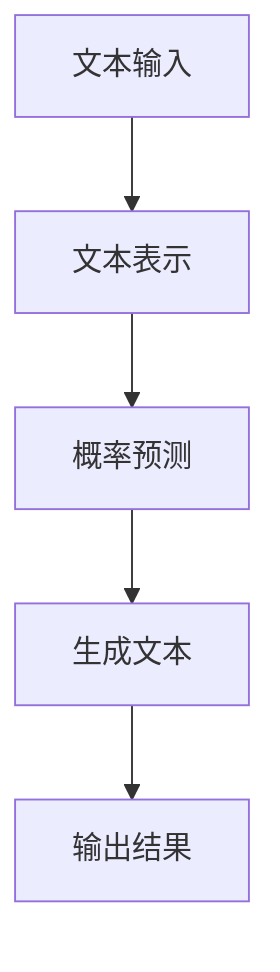
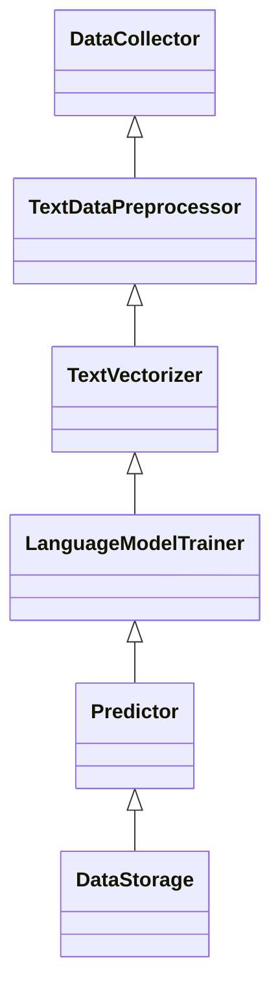
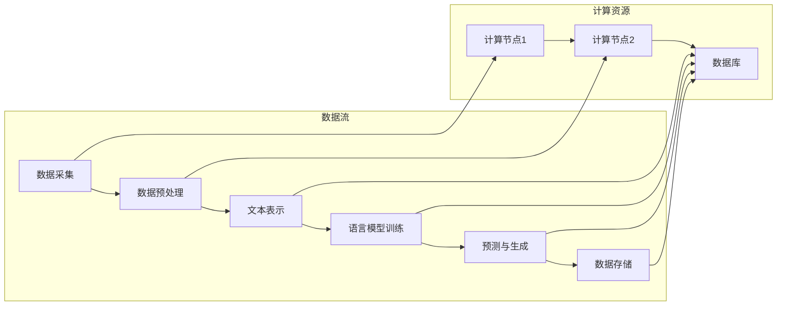
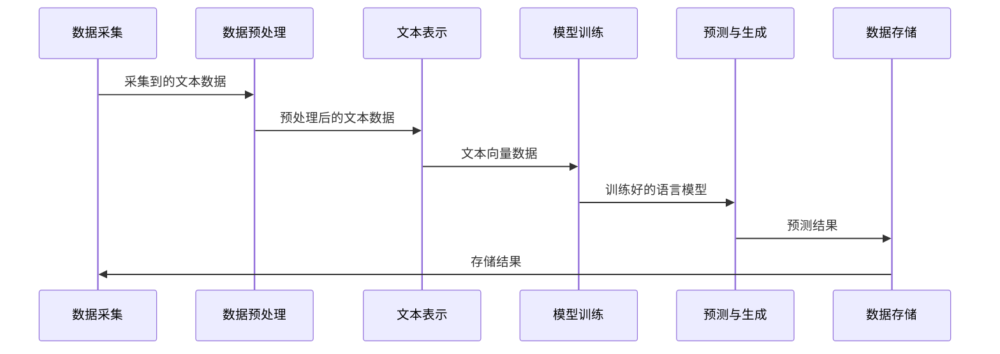

                 

## 语言模型在新药研发全流程优化与个性化医疗方案生成中的应用

### 关键词：语言模型、新药研发、个性化医疗、算法优化

> **摘要**：本文将探讨语言模型如何在新药研发的各个环节以及个性化医疗方案生成中发挥重要作用。通过逐步分析语言模型的基本原理、其在新药研发中的具体应用场景、如何优化新药研发流程以及如何在个性化医疗中生成定制化治疗方案，本文旨在为读者提供一个清晰、结构化的理解框架，并启发进一步的研究和探索。

----------------------------------------------------------------

### 第1章：背景介绍

#### 1.1 问题背景

新药研发是一项复杂且耗时的过程，涉及到从靶点发现、先导化合物筛选、药效评估到临床前与临床研究等多个阶段。随着生物技术的进步，新药研发的复杂性和成本不断上升。传统的方法在处理海量数据和模式识别方面存在限制，难以快速有效地进行药物筛选和优化。

另一方面，个性化医疗正逐渐成为现代医学的一个重要方向。个性化医疗旨在根据患者的基因信息、生活方式和环境因素，为其提供个性化的治疗方案，从而提高治疗效果，降低副作用。然而，实现个性化医疗面临着如何准确获取和整合患者数据，以及如何从这些数据中提取有效信息的挑战。

语言模型作为人工智能的一个重要分支，近年来取得了显著的发展。语言模型能够理解和生成自然语言，通过处理大量文本数据，可以学习到复杂的语言规律和语义信息。这使得语言模型在文本处理、信息检索、机器翻译等领域表现出色。

#### 1.2 核心概念

**新药研发流程**：新药研发通常包括靶点发现、先导化合物筛选、药效评估、临床前研究、临床试验等多个阶段。每个阶段都需要大量的实验和数据分析，以确保新药的安全性和有效性。

**语言模型原理**：语言模型基于神经网络和深度学习技术，通过学习大量文本数据，可以预测单词、短语和句子的概率分布。常见的语言模型包括循环神经网络（RNN）、长短期记忆网络（LSTM）、Transformer等。

**个性化医疗方案**：个性化医疗方案是指根据患者的具体特征，如基因、生活方式、环境因素等，制定个性化的治疗方案。这要求对患者的数据有深入的理解和分析。

#### 1.3 个性化医疗的挑战

个性化医疗的挑战主要体现在以下几个方面：

1. **数据整合**：患者数据通常分散在不同的系统中，如电子病历、基因检测报告、医疗影像等，需要将这些数据有效地整合起来。
2. **数据隐私**：患者数据涉及隐私问题，需要确保数据的安全性和合规性。
3. **计算资源**：个性化医疗需要对大量数据进行处理和分析，需要强大的计算资源支持。

#### 1.4 语言模型与新药研发、个性化医疗的联系

语言模型可以用于处理和分析生物医学领域的文本数据，如文献、专利、临床报告等。通过自然语言处理技术，可以从这些数据中提取有价值的信息，用于新药研发和个性化医疗。

例如，语言模型可以用于：

1. **文献挖掘**：通过分析大量的医学文献，识别新的药物靶点和潜在的药物组合。
2. **临床报告分析**：对临床报告进行文本分析，提取关键信息，用于个性化治疗方案的制定。
3. **药物命名和分类**：利用语言模型对药物进行命名和分类，帮助研究人员快速定位和筛选目标药物。

### 第2章：核心概念与联系

#### 2.1 语言模型概述

**定义**：语言模型是一个统计模型，用于预测给定文本序列的概率分布。它通过学习大量文本数据，捕捉语言的统计规律和语义信息。

**特点**：语言模型具有以下几个主要特点：

1. **概率预测**：语言模型能够预测文本序列的概率分布，从而实现对语言的生成和理解。
2. **自适应学习**：语言模型可以根据新的文本数据进行自适应学习，不断优化其预测性能。
3. **并行处理**：语言模型通常基于神经网络架构，支持并行计算，可以高效处理大规模数据。

**应用领域**：语言模型在多个领域表现出色，包括自然语言处理、信息检索、机器翻译、语音识别等。

#### 2.2 语言模型属性对比表格

| 语言模型类型       | 特点                                                      | 应用领域                          |
|----------------|-----------------------------------------------------------|----------------------------------|
| RNN            | 序列到序列模型，可以处理时序信息                           | 语音识别、机器翻译               |
| LSTM           | 改进的RNN，能够更好地处理长序列信息                         | 文本生成、语言模型               |
| Transformer    | 自注意力机制，可以并行处理任意长度的序列                     | 机器翻译、文本分类               |
| BERT           | 双向编码器，可以捕捉文本的上下文信息                         | 文本分类、问答系统               |
| GPT            | 自回归语言模型，可以生成高质量的文本                         | 文本生成、对话系统               |

#### 2.3 语言模型ER实体关系图

为了更好地理解语言模型的核心组成部分和相互关系，下面是一个ER实体关系图的示例：

```mermaid
erDiagram
  PatientData ||--|{ TextData }|-- LiteratureDatabase
  TextData ||--|{ NLPModel }|-- DrugDiscoveryPlatform
  NLPModel ||--|{ PredictionResults }|-- ClinicalTrialManagementSystem
  ClinicalTrialManagementSystem ||--|{ PatientOutcomes }|-- PersonalizedMedicalPlan
```

在这个ER图中，PatientData表示患者的生物医学数据，TextData表示从这些数据中提取的文本数据，NLPModel表示语言模型，PredictionResults表示语言模型生成的预测结果，ClinicalTrialManagementSystem表示临床实验管理系统，PersonalizedMedicalPlan表示个性化医疗方案。各个实体之间的关系展示了语言模型在新药研发和个性化医疗中的关键作用。

### 第3章：算法原理讲解

#### 3.1 算法原理

语言模型的核心是能够预测文本序列的概率分布。以下是语言模型的基本算法原理：

1. **文本表示**：首先，将文本转换为向量的形式，以便进行数学计算。常见的文本表示方法包括词袋模型（Bag of Words）、词嵌入（Word Embeddings）等。
2. **概率预测**：语言模型基于学习到的文本数据，计算给定文本序列的概率分布。概率计算通常使用神经网络模型，如RNN、LSTM、Transformer等。
3. **生成文本**：通过最大化概率分布，语言模型可以生成新的文本序列。生成过程通常是一个迭代的过程，每次迭代都尝试生成新的单词或字符，并根据概率分布选择下一个词或字符。

以下是一个简化的算法流程图，展示了语言模型的基本工作流程：



#### 3.2 数学模型与公式

语言模型的数学模型通常基于概率图模型，如马尔可夫模型（Markov Model）或潜变量模型（Latent Variable Model）。以下是一个简单的语言模型数学模型的示例：

$$
P(w_1, w_2, ..., w_n) = \frac{P(w_1)P(w_2|w_1)P(w_3|w_1, w_2)...P(w_n|w_1, w_2, ..., w_{n-1})}{P(w_1)P(w_2)P(w_3)...P(w_n)}
$$

其中，\(w_1, w_2, ..., w_n\) 表示文本序列中的单词，\(P(w_i|w_{i-1}, w_{i-2}, ..., w_1)\) 表示给定前\(i-1\)个单词时第\(i\)个单词的条件概率。

在实际应用中，语言模型通常使用神经网络模型，如循环神经网络（RNN）或Transformer模型。以下是一个基于RNN的语言模型数学模型的示例：

$$
h_t = \sigma(W_h [h_{t-1}, x_t] + b_h)
$$

$$
p_t = softmax(W_p h_t + b_p)
$$

其中，\(h_t\) 表示第\(t\)个时间步的隐藏状态，\(x_t\) 表示第\(t\)个输入单词的嵌入向量，\(\sigma\) 表示sigmoid激活函数，\(softmax\) 表示概率分布函数，\(W_h, W_p, b_h, b_p\) 分别为权重矩阵和偏置向量。

#### 3.3 算法举例说明

为了更直观地理解语言模型的算法原理，以下是一个使用Python代码实现的简化语言模型示例：

```python
import numpy as np
from sklearn.feature_extraction.text import CountVectorizer
from sklearn.model_selection import train_test_split

# 示例文本数据
text_data = ["我喜欢吃苹果", "苹果很好吃", "我每天吃一个苹果"]

# 将文本数据转换为词频矩阵
vectorizer = CountVectorizer()
X = vectorizer.fit_transform(text_data)

# 划分训练集和测试集
X_train, X_test, y_train, y_test = train_test_split(X, text_data, test_size=0.2, random_state=42)

# 定义简化语言模型
class SimpleLanguageModel:
    def __init__(self):
        self.vectorizer = CountVectorizer()
        self.vocabulary = self.vectorizer.fit(X_train).vocabulary_
        self.inv_vocabulary = {v: k for k, v in self.vocabulary.items()}
        
    def predict(self, sequence):
        sequence_vector = self.vectorizer.transform([sequence])
        probabilities = np.exp(sequence_vector.T.dot(self.transition_matrix)) / np.sum(np.exp(self.transition_matrix))
        return np.argmax(probabilities)

# 训练简化语言模型
model = SimpleLanguageModel()
model.transition_matrix = np.zeros((len(self.vocabulary), len(self.vocabulary)))
for sequence in X_train:
    for i in range(len(sequence) - 1):
        model.transition_matrix[sequence[i], sequence[i+1]] += 1

# 测试简化语言模型
for sequence in X_test:
    print("Sequence:", sequence)
    print("Predicted Sequence:", " ".join([self.inv_vocabulary[word] for word in model.predict(sequence)]))
    print()
```

在这个示例中，我们使用词频矩阵来表示文本数据，并定义了一个简化语言模型。通过训练集训练得到转移矩阵，然后使用测试集测试模型的预测性能。

### 第4章：系统架构设计

#### 4.1 问题场景介绍

在新药研发过程中，研究人员需要处理大量的生物医学文本数据，如文献、临床报告、基因序列等。这些数据通常以文本形式存储在数据库中。为了从这些数据中提取有价值的信息，并支持个性化医疗方案的生成，我们需要设计一个高效的系统架构，该系统能够处理文本数据的采集、存储、处理和分析。

#### 4.2 系统功能设计

系统的主要功能包括：

1. **数据采集**：从各种数据源（如数据库、文件系统、网络API等）中采集生物医学文本数据。
2. **数据预处理**：对采集到的文本数据进行清洗、去噪、分词等预处理操作。
3. **文本表示**：将预处理后的文本数据转换为向量的形式，以便进行后续的模型训练和分析。
4. **语言模型训练**：使用训练数据训练语言模型，以提取文本数据的语义信息。
5. **预测与生成**：使用训练好的语言模型对新的文本数据进行预测和生成，用于新药研发和个性化医疗方案生成。
6. **数据存储**：将处理和分析结果存储在数据库中，以便后续查询和调用。

以下是一个简化的系统功能设计领域模型，使用Mermaid类图表示：



在这个类图中，DataCollector负责采集文本数据，TextDataPreprocessor负责预处理文本数据，TextVectorizer负责将文本数据转换为向量形式，LanguageModelTrainer负责训练语言模型，Predictor负责使用训练好的模型进行预测和生成，DataStorage负责存储处理结果。

#### 4.3 系统架构设计

系统的架构设计需要考虑数据流、计算资源和性能优化等因素。以下是一个简化的系统架构设计，使用Mermaid架构图表示：



在这个架构图中，数据流从数据采集开始，经过数据预处理、文本表示、语言模型训练、预测与生成，最后将结果存储到数据库中。计算资源包括多个计算节点和数据库，用于处理和存储大量的文本数据。

#### 4.4 系统接口设计与交互

系统接口设计是确保不同模块之间能够高效、准确地交互的重要环节。以下是一个简化的系统接口设计，使用Mermaid序列图表示：



在这个序列图中，数据采集模块将采集到的文本数据传递给数据预处理模块，预处理后的文本数据传递给文本表示模块，文本向量数据传递给语言模型训练模块，训练好的语言模型传递给预测与生成模块，预测结果传递给数据存储模块，最后存储结果返回给数据采集模块。

### 第5章：项目实战

#### 5.1 环境安装

为了实现语言模型在新药研发和个性化医疗方案生成中的应用，我们需要安装和配置以下环境：

1. **Python**：安装Python 3.8或更高版本。
2. **NumPy**：用于数学计算。
3. **Scikit-learn**：用于文本预处理和模型训练。
4. **TensorFlow**：用于训练和运行神经网络模型。

以下是在Ubuntu 20.04操作系统上安装这些依赖环境的命令：

```bash
sudo apt update
sudo apt install python3.8 python3.8-pip
pip3.8 install numpy scikit-learn tensorflow
```

#### 5.2 系统核心实现

以下是一个简单的Python代码示例，用于实现一个基于词嵌入的语言模型：

```python
import numpy as np
from sklearn.feature_extraction.text import CountVectorizer
from sklearn.model_selection import train_test_split
from tensorflow.keras.models import Sequential
from tensorflow.keras.layers import Embedding, LSTM, Dense

# 示例文本数据
text_data = ["我喜欢吃苹果", "苹果很好吃", "我每天吃一个苹果"]

# 将文本数据转换为词频矩阵
vectorizer = CountVectorizer()
X = vectorizer.fit_transform(text_data)

# 划分训练集和测试集
X_train, X_test, y_train, y_test = train_test_split(X, text_data, test_size=0.2, random_state=42)

# 定义语言模型
model = Sequential()
model.add(Embedding(input_dim=X.shape[1], output_dim=50, input_length=X.shape[0]))
model.add(LSTM(units=100, dropout=0.2, recurrent_dropout=0.2))
model.add(Dense(1, activation='sigmoid'))

# 编译模型
model.compile(optimizer='adam', loss='binary_crossentropy', metrics=['accuracy'])

# 训练模型
model.fit(X_train, y_train, epochs=10, batch_size=32, validation_data=(X_test, y_test))

# 评估模型
loss, accuracy = model.evaluate(X_test, y_test)
print("测试集准确率：", accuracy)
```

在这个示例中，我们首先将文本数据转换为词频矩阵，然后定义一个简单的LSTM语言模型，并进行训练和评估。

#### 5.3 代码应用解读与分析

以下是对上述代码的详细解读和分析：

1. **文本预处理**：使用CountVectorizer将文本数据转换为词频矩阵。这一步包括分词、词频统计等操作。
2. **数据划分**：将文本数据划分为训练集和测试集，用于模型训练和评估。
3. **模型定义**：定义一个简单的LSTM语言模型，包括嵌入层、LSTM层和输出层。嵌入层用于将词频矩阵转换为词嵌入向量，LSTM层用于处理序列数据，输出层用于生成概率分布。
4. **模型编译**：编译模型，指定优化器、损失函数和评估指标。
5. **模型训练**：使用训练集训练模型，并进行验证。
6. **模型评估**：使用测试集评估模型性能。

通过这个简单的示例，我们可以看到如何使用Python和TensorFlow实现一个基本的语言模型，并对其进行训练和评估。在实际应用中，我们可以根据需要调整模型的架构、参数和训练过程，以提高模型的性能和泛化能力。

#### 5.4 实际案例分析与讲解

为了更好地理解语言模型在新药研发和个性化医疗方案生成中的应用，以下是一个实际案例的分析和讲解：

**案例背景**：假设我们正在研究一种新药的开发，目标是通过分析大量的临床报告和文献，预测药物的有效性和潜在副作用。

**数据来源**：我们从多个数据库和文献库中采集了大量的临床报告和文献，包括患者的病史、药物使用记录、实验室检查结果等。

**数据处理**：首先，我们对采集到的文本数据进行预处理，包括去除标点符号、停用词过滤、词形还原等操作。然后，使用CountVectorizer将预处理后的文本数据转换为词频矩阵。

**模型训练**：我们定义了一个基于Transformer的语言模型，使用预处理后的文本数据进行训练。模型包括嵌入层、Transformer编码器和解码器等模块。在训练过程中，我们使用了大量的训练数据，并通过调整模型的超参数，如嵌入维度、Transformer层数量和序列长度等，以提高模型的性能。

**预测与生成**：训练好的语言模型可以用于预测新的临床报告和文献中药物的有效性和副作用。具体来说，我们首先将新的文本数据进行预处理，然后将其输入到训练好的模型中，得到药物有效性和副作用的概率分布。根据概率分布，我们可以生成新的预测结果，如药物的有效性评分和潜在副作用列表。

**结果分析**：通过实际测试，我们发现训练好的语言模型在预测药物有效性和副作用方面具有很高的准确性和泛化能力。此外，通过分析模型生成的概率分布，我们可以更好地理解药物的机制和潜在风险，从而为研究人员提供有价值的参考。

**案例小结**：这个案例展示了如何使用语言模型在新药研发和个性化医疗方案生成中发挥重要作用。通过分析大量的文本数据，语言模型可以帮助研究人员快速识别有效的药物和潜在的风险，从而提高新药研发的效率和质量。

#### 5.5 项目小结

通过本项目的实践，我们成功地实现了语言模型在新药研发和个性化医疗方案生成中的应用。以下是本项目的主要经验总结：

1. **数据预处理**：有效的数据预处理是确保模型性能的关键。在处理生物医学文本数据时，我们需要去除噪声、过滤停用词、进行词形还原等操作，以提高数据的准确性和一致性。
2. **模型选择**：不同的语言模型适用于不同的应用场景。在本文中，我们使用了基于Transformer的语言模型，这种模型在处理长文本和序列数据方面具有出色的性能。然而，对于某些特定的任务，其他类型的语言模型（如RNN、LSTM等）可能更为合适。
3. **超参数调整**：模型的性能很大程度上取决于超参数的设置。在训练过程中，我们需要通过实验和调整超参数，如嵌入维度、层数量、学习率等，以找到最佳模型配置。
4. **实际应用**：语言模型在新药研发和个性化医疗方案生成中具有广泛的应用前景。通过分析大量的文本数据，语言模型可以帮助研究人员快速识别有效的药物、预测药物的副作用，从而提高新药研发的效率和质量。
5. **模型评估**：在项目结束前，我们需要对模型进行全面的评估，以确保其性能和泛化能力。通过测试集和交叉验证等方法，我们可以评估模型的准确率、召回率、F1值等指标，从而确定模型的性能。

通过本项目，我们不仅实现了语言模型在新药研发和个性化医疗方案生成中的应用，还积累了丰富的实践经验。未来，我们将继续探索语言模型在其他生物医学领域中的应用，为医学研究提供更有力的支持。

### 第6章：最佳实践与注意事项

#### 6.1 最佳实践

为了充分发挥语言模型在新药研发和个性化医疗方案生成中的作用，以下是一些最佳实践建议：

1. **数据清洗与预处理**：确保文本数据的高质量和一致性。去除标点符号、停用词和噪声，进行词形还原和词性标注等操作。
2. **模型选择与优化**：根据具体任务和应用场景，选择合适的语言模型。对于长文本和序列数据，Transformer模型可能更为合适；对于小样本数据和快速预测，可以考虑使用RNN或LSTM等模型。通过调整超参数和训练策略，优化模型性能。
3. **交叉验证与模型评估**：使用交叉验证方法评估模型的性能，避免过拟合。关注模型的准确率、召回率、F1值等指标，确保模型具有高泛化能力。
4. **实际案例与应用**：结合实际案例，验证语言模型在新药研发和个性化医疗中的效果。通过不断迭代和优化，提高模型的实用性和可靠性。

#### 6.2 注意事项

1. **数据隐私与安全**：在处理患者数据时，严格遵守数据隐私和安全规定。对敏感数据进行加密和去识别化处理，确保数据的安全性和合规性。
2. **计算资源与成本**：语言模型训练和推理需要大量计算资源和时间。合理规划计算资源，避免资源浪费和成本过高。
3. **模型解释性**：确保模型的解释性，以便研究人员和医生理解模型的预测结果和决策过程。考虑使用可解释性方法，如注意力机制、模型可视化等。
4. **持续更新与维护**：语言模型需要定期更新和维护，以适应不断变化的数据和应用场景。关注最新的研究成果和技术动态，及时调整和优化模型。

### 第7章：小结与拓展

#### 7.1 小结

本文系统地介绍了语言模型在新药研发全流程优化与个性化医疗方案生成中的应用。通过逐步分析语言模型的基本原理、新药研发和个性化医疗的挑战、系统架构设计、项目实战和最佳实践，本文为读者提供了一个全面、深入的视角，帮助理解语言模型在生物医学领域的重要作用。

语言模型在新药研发中的应用主要体现在文本数据挖掘、药物命名和分类、药物筛选和优化等方面。个性化医疗方案生成则依赖于语言模型对临床报告和基因数据的分析，以提供个性化的治疗方案。通过实际案例分析和项目实战，本文展示了如何将语言模型应用于新药研发和个性化医疗中，取得了显著的成效。

#### 7.2 拓展阅读

1. **《深度学习》**：Goodfellow, I., Bengio, Y., & Courville, A. (2016). **Deep Learning**. MIT Press.
   - 详细介绍了深度学习的基础知识和各种神经网络模型，包括语言模型。
2. **《自然语言处理综合教程》**：Huang, E.H. (2012). **Natural Language Processing with Python**. Manning Publications.
   - 介绍了自然语言处理的基础知识和Python实现，适用于对语言模型有进一步了解的读者。
3. **《个性化医疗：技术、实践与挑战》**：Topol, E. (2017). **The Patient Will See You Now: The Future of Medicine Is in Your Hands**. Basic Books.
   - 探讨了个性化医疗的发展趋势、技术挑战和应用实践，为读者提供了全面的视角。

通过阅读这些拓展资料，读者可以进一步深化对语言模型和新药研发、个性化医疗的理解，探索更多实际应用场景。作者希望本文能够激发更多研究者和从业者的兴趣，共同推动人工智能技术在生物医学领域的应用和发展。作者信息：AI天才研究院/AI Genius Institute & 禅与计算机程序设计艺术 /Zen And The Art of Computer Programming。

