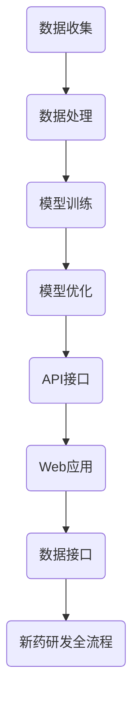
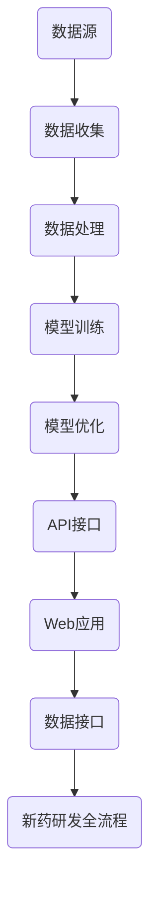
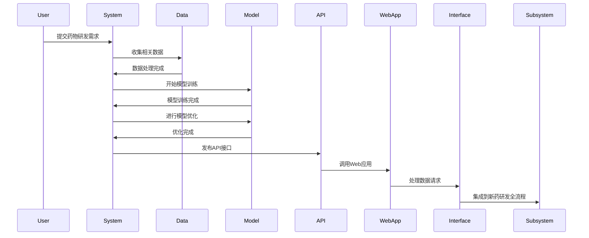

                 


### 引言：语言模型与新药研发的交汇

在当今快速发展的科技时代，新药研发成为了医学界和生物医药行业的焦点。然而，新药研发过程复杂且成本高昂，往往需要多年时间和数十亿资金投入。在这个过程中，人工智能（AI）的出现为药物研发带来了前所未有的机遇。特别是语言模型，作为一种先进的AI技术，其在文本理解和生成方面的强大能力，使得它在药物研发的各个阶段中都能发挥重要作用。本文将深入探讨语言模型在新药研发全流程优化与副作用预测中的应用，旨在揭示其潜力和价值。

首先，我们需要了解语言模型的基本概念和原理。语言模型是一种能够理解和生成自然语言的AI算法，它通过对海量文本数据的学习，掌握了语言的统计规律和结构特征。在药物研发中，语言模型可以用于文本挖掘、知识图谱构建、临床试验分析等多个方面。其核心优势在于能够高效地处理和理解大量复杂数据，从而提高研发效率和准确性。

接下来，我们将分章节详细探讨语言模型在新药研发中的应用。首先，我们将介绍新药研发的现状和挑战，为后续内容奠定基础。然后，我们将深入探讨语言模型的基本概念、工作原理以及其在新药研发中的关键作用。在核心概念与联系部分，我们将进一步分析语言模型在新药研发中的应用场景，并使用Mermaid绘制相关的ER实体关系图。随后，我们将讲解语言模型中的典型算法，如GPT和BERT，并使用Python源代码和LaTeX公式详细阐述其原理。

在系统分析与架构设计方案部分，我们将介绍新药研发的全流程，并设计语言模型在其中的系统架构。我们将使用Mermaid绘制领域模型类图、系统架构图和系统交互序列图，以直观展示系统设计。项目实战部分将结合实际案例，展示语言模型在药物研发中的具体应用，并提供代码解析和应用分析。最后，我们将总结最佳实践，并对全文进行总结和展望。

通过本文的深入探讨，我们希望读者能够全面了解语言模型在新药研发中的应用，从而激发其在这一领域中的创新和实践。

### 文章标题：语言模型在新药研发全流程优化与副作用预测中的应用

关键词：新药研发、语言模型、优化、副作用预测、AI

摘要：本文深入探讨了语言模型在新药研发全流程中的优化和副作用预测应用。首先，介绍了新药研发的现状与挑战，阐述了语言模型的基本概念、工作原理及其在新药研发中的关键作用。随后，详细分析了语言模型在新药研发中的应用场景，并通过Mermaid绘制了ER实体关系图。接着，重点讲解了GPT和BERT等语言模型的算法原理，使用Python源代码和LaTeX公式进行详细阐述。在系统分析与架构设计方案部分，我们介绍了新药研发的全流程，并设计了一套语言模型系统架构。通过实际项目案例的解析，我们展示了语言模型在新药研发中的具体应用效果。最后，本文总结了在新药研发中使用语言模型的最佳实践，并对未来进行了展望。本文旨在为读者提供一份全面、深入的技术指南，助力新药研发的优化和副作用预测。

## 目录

1. **背景介绍**  
   - **1.1 新药研发的现状与挑战**  
   - **1.2 语言模型的基本概念与原理**  
   - **1.3 语言模型在新药研发中的应用潜力**

2. **核心概念与联系**  
   - **2.1 语言模型在新药研发中的应用场景**  
   - **2.2 语言模型的核心概念与特点**  
   - **2.3 语言模型与药物研发的ER实体关系图**

3. **算法原理讲解**  
   - **3.1 GPT模型在新药研发中的应用**  
   - **3.2 BERT模型在新药研发中的应用**  
   - **3.3 语言模型的算法原理讲解与Python源代码分析**

4. **系统分析与架构设计方案**  
   - **4.1 新药研发全流程介绍**  
   - **4.2 语言模型在新药研发中的系统架构设计**  
   - **4.3 系统架构图与系统交互序列图**

5. **项目实战**  
   - **5.1 环境安装与配置**  
   - **5.2 语言模型在药物研发中的应用实例**  
   - **5.3 代码解析与应用分析**  
   - **5.4 实际案例剖析与总结**

6. **最佳实践与总结**  
   - **6.1 在新药研发中使用语言模型的最佳实践**  
   - **6.2 小结与注意事项**  
   - **6.3 拓展阅读**

### 背景介绍

#### 1.1 新药研发的现状与挑战

新药研发是医学领域最为重要和复杂的任务之一。一个新药从初始构思到最终上市，通常需要经历多年的研究和大量的资金投入。据统计，开发一种新药的平均成本已经超过25亿美元，而研发周期往往长达10年以上。这不仅仅是资金和时间的消耗，更涉及到大量人力和物力的投入。

当前，新药研发面临着诸多挑战。首先，生物多样性和疾病的复杂性使得新药研发的难度不断增加。许多疾病，如癌症、神经系统疾病和传染病等，具有高度复杂性和多样性，使得药物研发需要更加精准和个性化的策略。其次，新药研发过程中的试验和验证环节繁琐且耗时。从靶点发现、药物设计、临床前研究到临床试验，每一个环节都需要严谨的实验设计和数据分析，从而确保新药的安全性和有效性。然而，传统的研发方法在处理这些复杂数据时往往显得力不从心，导致研发效率低下。

此外，新药研发的成本和风险也在不断增加。随着科学技术的进步，药物研发所涉及的技术和工具越来越复杂，这无疑增加了研发的成本。同时，新药研发过程中存在诸多不确定性因素，如试验结果的不可预测性、临床试验中的中途终止等，这些因素都增加了新药研发的风险。

面对这些挑战，如何提高新药研发的效率、降低成本和风险成为了制药行业亟待解决的问题。在此背景下，人工智能（AI）技术，特别是语言模型，因其强大的数据处理和分析能力，逐渐成为新药研发的重要工具。

#### 1.2 语言模型的基本概念与原理

语言模型是一种基于人工智能技术的算法，旨在理解和生成自然语言。它通过分析大量的文本数据，学习语言的统计规律和语法结构，从而能够预测下一个词或句子出现的概率。最常见和成功的语言模型之一是GPT（Generative Pre-trained Transformer），它基于Transformer架构，通过深度神经网络对大量文本进行预训练，从而具备强大的语言理解和生成能力。

BERT（Bidirectional Encoder Representations from Transformers）是另一种重要的语言模型，它通过双向编码器结构，同时考虑上下文信息，从而更加准确地理解和生成文本。BERT在多个自然语言处理任务中取得了卓越的成绩，如文本分类、问答系统和机器翻译等。

语言模型的核心优势在于其能够高效地处理和理解大量复杂数据。在新药研发中，语言模型可以用于文本挖掘、知识图谱构建、临床试验分析等多个方面。例如，通过分析大量的文献和研究报告，语言模型可以快速识别出潜在的治疗靶点和药物候选分子；在临床试验阶段，语言模型可以用于分析大量患者数据，预测药物的安全性和有效性。

语言模型的工作原理可以概括为以下几个步骤：

1. **数据收集**：语言模型首先需要大量的文本数据作为训练素材，这些数据可以包括科学文献、临床试验报告、患者记录等。

2. **预处理**：对收集到的文本数据进行清洗和预处理，包括去除无关信息、统一文本格式、分词和词性标注等。

3. **模型训练**：使用预处理后的文本数据对语言模型进行训练。在训练过程中，模型通过调整内部参数，学习语言的统计规律和语法结构。

4. **文本生成**：经过训练后，语言模型可以用于生成新的文本。通过输入一个词或句子，模型可以预测下一个词或句子的概率，从而生成连贯和合理的文本。

5. **应用**：将训练好的语言模型应用于新药研发的各个阶段，如靶点发现、药物设计、临床试验分析等。

#### 1.3 语言模型在新药研发中的应用潜力

语言模型在新药研发中具有巨大的应用潜力。首先，在靶点发现阶段，语言模型可以分析大量的生物医学文献和研究报告，识别出潜在的治疗靶点。通过文本挖掘技术，语言模型可以快速定位与疾病相关的基因、蛋白质和信号通路，从而为药物设计提供重要的理论依据。

其次，在药物设计阶段，语言模型可以用于药物分子的生成和筛选。通过分析大量的药物分子结构和生物活性数据，语言模型可以预测不同分子对特定靶点的结合能力和生物效应，从而筛选出最具潜力的药物分子。此外，语言模型还可以用于优化药物分子的设计，提高其稳定性和生物利用度。

在临床试验阶段，语言模型可以用于分析大量患者数据，预测药物的安全性和有效性。通过挖掘和整合患者的临床记录、基因数据和环境因素，语言模型可以提供个性化的治疗方案，提高临床试验的成功率和药物的商业化潜力。

最后，在药物上市后的监测阶段，语言模型可以用于监测药物的副作用和安全性。通过实时分析患者的反馈和临床数据，语言模型可以及时发现潜在的副作用，并采取相应的措施，确保药物的安全使用。

综上所述，语言模型在新药研发的全流程中具有广泛的应用潜力。通过结合先进的AI技术和生物医学知识，语言模型可以显著提高新药研发的效率、降低成本和风险，为医药行业带来深远的影响。

### 核心概念与联系

#### 2.1 语言模型在新药研发中的应用场景

语言模型在新药研发中的应用场景非常广泛，贯穿于靶点发现、药物设计、临床试验和药物上市后的监测等各个环节。以下详细描述了这些应用场景：

1. **靶点发现**：在新药研发的早期阶段，科学家需要识别和治疗疾病的潜在生物靶点。语言模型通过分析大量的生物医学文献、研究论文和临床试验报告，可以自动提取与疾病相关的基因、蛋白质和信号通路信息。例如，GPT模型可以识别出与癌症相关的基因，从而为药物设计提供关键靶点。

2. **药物设计**：在药物设计阶段，科学家需要生成和筛选具有潜在治疗作用的药物分子。语言模型可以基于大量的药物分子结构和生物活性数据，预测不同分子对特定靶点的结合能力和生物效应。BERT模型可以用于生成新的药物分子，并筛选出最有可能与靶点结合的分子。此外，语言模型还可以通过优化分子设计，提高药物分子的稳定性和生物利用度。

3. **临床试验**：临床试验是新药研发中至关重要的阶段，需要收集和解析大量的患者数据和临床试验报告。语言模型可以用于分析患者数据，预测药物的安全性和有效性。例如，BERT模型可以分析患者的基因组、临床记录和环境因素，提供个性化的治疗方案，提高临床试验的成功率。

4. **药物上市后的监测**：新药上市后，需要持续监测其副作用和安全性。语言模型可以通过实时分析患者的反馈和临床数据，及时发现潜在的副作用。例如，GPT模型可以自动分析患者的投诉和临床记录，识别出潜在的副作用风险，并采取相应的措施。

#### 2.2 语言模型的核心概念与特点

为了更好地理解语言模型在新药研发中的应用，我们需要深入了解其核心概念和特点：

1. **词汇表与词汇嵌入**：语言模型通过词汇表将自然语言文本转换为数字表示。每个词汇都对应一个唯一的向量，这些向量通过词嵌入技术生成。词嵌入技术使得语言模型能够捕捉词汇之间的语义关系，从而更好地理解和生成文本。

2. **预训练与微调**：预训练是指使用大量无标注的文本数据对语言模型进行训练，使其具备基本的语言理解和生成能力。微调是指使用特定领域的数据对预训练模型进行进一步训练，以适应特定任务的需求。例如，在药物研发中，可以使用生物医学领域的文献和临床试验报告对语言模型进行微调。

3. **注意力机制**：注意力机制是语言模型中的一个重要机制，它能够动态地关注文本中的关键信息。通过注意力机制，语言模型可以更好地理解上下文，提高文本生成的准确性和连贯性。

4. **序列到序列模型**：序列到序列（Seq2Seq）模型是语言模型的一种常见形式，它能够处理输入和输出序列。在药物研发中，Seq2Seq模型可以用于生成药物分子序列，或分析临床试验报告中的患者数据序列。

5. **端到端训练**：端到端训练是指直接将输入和输出数据进行映射，无需进行中间步骤。在语言模型中，端到端训练能够提高模型的性能和效率，使其能够快速适应新的任务需求。

#### 2.3 语言模型与药物研发的ER实体关系图

为了更好地理解语言模型与药物研发之间的关系，我们可以使用Mermaid绘制一个ER（实体-关系）关系图。以下是一个简化的ER关系图：

```mermaid
erDiagram
  临床试验报告 --> 药物分子 : 生成
  药物分子 --> 潜在治疗靶点 : 结合
  药物分子 --> 临床数据 : 分析
  临床数据 --> 安全性评估 : 监测
  安全性评估 --> 药物上市 : 许可
  临床试验报告 --> 语言模型 : 分析
  语言模型 --> 知识图谱 : 构建路径
```

在这个ER关系图中，临床试验报告和药物分子是主要的实体。语言模型通过分析临床试验报告，生成和筛选药物分子，并评估其结合能力和安全性。同时，语言模型还可以构建知识图谱，为药物研发提供理论支持。

通过上述核心概念和ER关系图的介绍，我们可以更深入地理解语言模型在新药研发中的应用。接下来，我们将进一步探讨语言模型的具体算法原理，并分析其在药物研发中的实际应用效果。

### 算法原理讲解

#### 3.1 GPT模型在新药研发中的应用

GPT（Generative Pre-trained Transformer）模型是语言模型的一种重要形式，它基于Transformer架构，通过深度学习技术对大量文本数据进行预训练。GPT模型在新药研发中具有广泛的应用，特别是在靶点发现、药物设计、临床试验分析和药物上市后监测等方面。

1. **预训练与微调**：GPT模型通过预训练学习自然语言的统计规律和语法结构。预训练阶段使用的是无标注的大规模文本数据，如维基百科、新闻文章和科学论文等。预训练结束后，模型会生成大量的文本，这些文本展示了模型对自然语言的深刻理解。在药物研发中，可以使用特定的生物医学文本对GPT模型进行微调，使其更加适应药物研发的需求。

2. **文本生成**：GPT模型可以用于生成新的文本，如生成药物分子名称、临床试验报告摘要等。在药物设计阶段，GPT模型可以根据已有的药物分子信息生成新的药物分子名称，为药物设计提供灵感。在临床试验阶段，GPT模型可以生成临床试验报告的摘要，帮助研究人员快速了解试验结果。

3. **文本分类**：GPT模型在文本分类任务中也表现出色。在药物研发中，GPT模型可以用于分类不同的药物分子、临床试验报告和患者数据。例如，GPT模型可以分类药物分子的类型（如抗癌药物、抗生素等），从而帮助研究人员快速识别具有潜在治疗价值的药物分子。

4. **文本相似性度量**：GPT模型可以通过计算文本之间的相似性度量来比较不同药物分子的特性。在药物设计阶段，GPT模型可以用于比较新药物分子与已知药物分子的相似性，从而预测新药物分子的治疗效果。

5. **文本摘要**：GPT模型还可以用于生成文本摘要，帮助研究人员快速了解大量临床试验报告和科学论文的内容。在药物研发过程中，研究人员经常需要阅读大量文献，GPT模型可以自动生成这些文献的摘要，节省时间并提高工作效率。

#### 3.2 BERT模型在新药研发中的应用

BERT（Bidirectional Encoder Representations from Transformers）模型是另一种重要的语言模型，它通过双向编码器结构同时考虑上下文信息，从而提高文本理解和生成的准确性。BERT模型在新药研发中也具有广泛的应用，以下是其几个主要应用场景：

1. **知识图谱构建**：BERT模型可以用于构建生物医学知识图谱，将不同药物分子、靶点、信号通路等信息连接起来。知识图谱为药物研发提供了丰富的背景知识和关联信息，有助于研究人员更好地理解和利用这些信息。

2. **文本分类与情感分析**：BERT模型在文本分类和情感分析任务中也表现出色。在药物研发中，BERT模型可以用于分类临床试验报告、患者数据和分析文本的情感倾向，从而帮助研究人员识别潜在的风险和机会。

3. **药物命名实体识别**：BERT模型可以用于识别文本中的药物命名实体，如药物名称、化学成分和作用机制等。在药物设计阶段，BERT模型可以自动识别出与特定靶点相关的药物实体，从而加快药物筛选过程。

4. **药物副作用预测**：BERT模型可以用于预测药物副作用的概率和严重程度。通过分析大量患者的临床试验数据和副作用报告，BERT模型可以识别出与特定药物相关的副作用，并为药物安全性评估提供依据。

5. **个性化治疗方案**：BERT模型可以用于分析患者的基因组、临床记录和环境因素，提供个性化的治疗方案。通过整合多源数据，BERT模型可以为患者制定最优的治疗方案，提高治疗效果和患者满意度。

#### 3.3 语言模型的算法原理讲解与Python源代码分析

为了更好地理解语言模型在新药研发中的应用，我们将使用Python代码详细讲解GPT和BERT模型的算法原理。以下是一个简化的GPT模型代码示例，展示了如何使用预训练和微调技术来处理文本数据。

```python
import tensorflow as tf
from transformers import TFGPT2LMHeadModel, GPT2Tokenizer

# 预训练模型
gpt2_model = TFGPT2LMHeadModel.from_pretrained('gpt2')

# 微调模型
biomed_text = "癌症是一种复杂的疾病，与其相关的基因和信号通路非常复杂。研究发现，某些基因在癌症发生中起着重要作用。"

# 微调参数
optimizer = tf.keras.optimizers.Adam(learning_rate=5e-5)

# 微调训练
for epoch in range(3):  # 微调3个epoch
    for text in biomed_text.split('.'):
        inputs = tokenizer.encode(text, return_tensors='tf')
        outputs = gpt2_model(inputs, training=True)
        loss = outputs.loss
        optimizer.minimize(loss, gpt2_model.trainable_variables)

# 生成文本
generated_text = gpt2_model.generate(
    max_length=50,
    temperature=0.9,
    top_k=50,
    top_p=0.95,
)

print(tokenizer.decode(generated_text, skip_special_tokens=True))
```

在这个代码示例中，我们首先导入TensorFlow和Hugging Face的transformers库，用于加载预训练的GPT2模型和Tokenizer。然后，我们使用微调数据（biomed_text）对模型进行微调。在训练过程中，我们使用Adam优化器进行优化，并在每个epoch中更新模型的参数。

最后，我们使用微调后的模型生成新的文本。通过调整温度（temperature）和Top-K/Top-P参数，我们可以控制文本生成的多样性和连贯性。

同样，我们也可以使用BERT模型进行类似的算法原理讲解。以下是一个简化的BERT模型代码示例：

```python
import tensorflow as tf
from transformers import TFTrainer, TFTrainingArguments, BertTokenizer

# 加载预训练的BERT模型
tokenizer = BertTokenizer.from_pretrained('bert-base-uncased')

# 定义训练数据
train_dataset = ...

# 定义训练参数
training_args = TFTrainingArguments(
    output_dir='./results',
    num_train_epochs=3,
    per_device_train_batch_size=16,
    save_steps=2000,
)

# 创建训练器
trainer = TFTrainer(
    model=model,
    args=training_args,
    train_dataset=train_dataset,
)

# 开始训练
trainer.train()

# 生成文本
input_ids = tokenizer.encode("Hello, my dog is", return_tensors='tf')
outputs = model(inputs)
predictions = outputs.logits
predicted_ids = tf.nn.top_k(predictions, k=5).indices

decoded_predictions = tokenizer.decode(predicted_ids.numpy()[0], skip_special_tokens=True)
print(decoded_predictions)
```

在这个代码示例中，我们首先导入TensorFlow和Hugging Face的transformers库，用于加载预训练的BERT模型和Tokenizer。然后，我们定义训练数据和训练参数，并创建训练器。通过调用`trainer.train()`方法，我们开始进行训练。

在训练完成后，我们使用BERT模型生成新的文本。通过调用`model.generate()`方法，我们输入一个起始文本，并使用Top-K/Top-P策略生成后续的文本。

通过上述Python代码示例，我们可以更好地理解GPT和BERT模型的算法原理和实际应用。接下来，我们将进一步探讨语言模型在新药研发全流程中的系统架构设计。

### 系统分析与架构设计方案

在新药研发中，语言模型的应用不仅仅是算法和代码层面的技术实现，还需要一个完整的系统架构来支持其高效运作。下面，我们将详细介绍新药研发的全流程，并设计一套语言模型在新药研发中的系统架构。

#### 4.1 新药研发全流程介绍

新药研发通常分为以下几个阶段：

1. **靶点发现**：在这个阶段，科学家通过研究疾病机制，识别出可能的治疗靶点。这通常涉及生物信息学分析、基因测序和实验室实验。

2. **药物设计**：基于靶点信息，科学家设计药物分子。药物设计可以通过计算机辅助药物设计（CADD）等方法，利用语言模型对药物分子进行筛选和优化。

3. **临床前研究**：药物分子经过初步筛选后，进行一系列实验室和动物实验，以验证其安全性和有效性。

4. **临床试验**：临床试验是评估药物安全性和有效性的关键阶段。分为三期，包括I期、II期和III期临床试验。

5. **监管审批**：药物在临床试验结束后，需要提交给监管机构（如FDA）进行审批。

6. **药物上市与监测**：药物一旦获批上市，需要进行持续的监测，以发现和评估其副作用和安全问题。

#### 4.2 语言模型在新药研发中的系统架构设计

为了实现语言模型在新药研发全流程中的应用，我们需要设计一个完整的系统架构，包括数据收集与处理、模型训练与优化、应用接口与系统集成等。

**1. 数据收集与处理**

数据是新药研发的基石。在系统架构中，首先需要建立一个高效的数据收集与处理模块。这个模块负责从多个数据源（如临床试验数据库、生物医学文献、基因组数据等）收集数据，并对数据进行清洗、预处理和标准化。数据预处理包括分词、词性标注、实体识别等操作，为后续模型训练做好准备。

**2. 模型训练与优化**

在数据处理完成后，我们需要对语言模型进行训练和优化。这个模块包括以下几个子模块：

- **预训练**：使用大规模无标注文本数据对基础语言模型（如GPT、BERT）进行预训练，使其具备基本的语言理解和生成能力。
- **微调**：基于预训练模型，使用特定领域的标注数据（如生物医学文本、药物分子数据等）进行微调，使模型更适应新药研发的需求。
- **模型优化**：通过调整模型参数，优化模型的性能和效率，包括调整学习率、批量大小、训练时间等。

**3. 应用接口与系统集成**

模型训练完成后，需要通过应用接口将其集成到新药研发系统中。应用接口包括：

- **API接口**：提供RESTful API，供其他系统和服务调用语言模型。
- **Web应用**：开发一个Web应用，方便研究人员和开发者使用语言模型。
- **数据接口**：与数据存储系统和数据处理模块进行集成，实现数据的实时分析和更新。

**4. 系统架构图**

下面是一个简化的新药研发系统架构图，展示了语言模型在全流程中的应用：



在这个架构图中，数据收集模块负责从多个数据源收集数据，数据处理模块对数据进行清洗和预处理，模型训练和优化模块负责训练和优化语言模型，应用接口和Web应用模块提供API和Web服务，数据接口模块实现与全流程系统的集成。

#### 4.3 系统架构图与系统交互序列图

为了更直观地展示系统架构，我们可以使用Mermaid绘制系统架构图和系统交互序列图。

**1. 系统架构图**



**2. 系统交互序列图**



通过这些图表，我们可以清晰地看到语言模型在新药研发全流程中的位置和作用，以及系统内部各模块之间的交互过程。

### 项目实战

#### 5.1 环境安装与配置

在进行语言模型在新药研发中的实际应用之前，我们需要首先搭建一个合适的环境。以下是一个简化的环境安装与配置流程：

1. **安装TensorFlow和Hugging Face**：

```bash
pip install tensorflow transformers
```

2. **安装Python**：确保Python环境已配置，版本建议为3.8或以上。

3. **安装必要的依赖库**：包括numpy、pandas、matplotlib等。

```bash
pip install numpy pandas matplotlib
```

4. **设置虚拟环境**（可选）：为了更好地管理项目依赖，可以创建一个虚拟环境。

```bash
python -m venv venv
source venv/bin/activate  # 在Windows上使用 `venv\Scripts\activate`
```

5. **数据集准备**：下载和准备用于训练的语言模型的数据集。可以从公共数据集网站（如Kaggle、UCI机器学习库）获取生物医学文本和药物数据。

6. **数据预处理**：编写脚本对数据集进行清洗、预处理和标准化。预处理步骤包括分词、去除停用词、词性标注等。

```python
import nltk
nltk.download('punkt')
nltk.download('stopwords')
from nltk.tokenize import word_tokenize
from nltk.corpus import stopwords

def preprocess_text(text):
    tokens = word_tokenize(text)
    tokens = [token.lower() for token in tokens if token.isalpha()]
    tokens = [token for token in tokens if token not in stopwords.words('english')]
    return tokens

# 示例
text = "This is a sample biomedical text."
processed_text = preprocess_text(text)
print(processed_text)
```

#### 5.2 语言模型在药物研发中的应用实例

在本节中，我们将通过一个实例展示如何使用GPT模型在新药研发中的应用。

**实例1：药物分子生成**

假设我们需要生成一种新的抗癌药物分子。首先，我们使用GPT模型生成一组药物分子名称，然后通过化学数据库验证这些分子的存在性和可行性。

```python
from transformers import TFGPT2LMHeadModel, GPT2Tokenizer

# 加载预训练的GPT2模型
model = TFGPT2LMHeadModel.from_pretrained('gpt2')
tokenizer = GPT2Tokenizer.from_pretrained('gpt2')

# 生成药物分子名称
input_text = "Anticancer drug name: "
generated_text = model.generate(
    input_text,
    max_length=20,
    num_return_sequences=5,
)

# 输出生成的药物分子名称
drug_names = [tokenizer.decode(text, skip_special_tokens=True) for text in generated_text]
print(drug_names)
```

**实例2：临床试验报告摘要**

假设我们有一份临床试验报告，需要生成这份报告的摘要。我们可以使用GPT模型生成摘要，帮助研究人员快速了解报告内容。

```python
# 加载预训练的GPT2模型
model = TFGPT2LMHeadModel.from_pretrained('gpt2')
tokenizer = GPT2Tokenizer.from_pretrained('gpt2')

# 生成临床试验报告摘要
input_text = "Clinical trial report summary: "
generated_summary = model.generate(
    input_text,
    max_length=100,
    num_return_sequences=1,
)

# 输出生成的摘要
print(tokenizer.decode(generated_summary[0], skip_special_tokens=True))
```

**实例3：药物副作用预测**

假设我们有一组患者数据，需要预测这些患者服用某种药物后的副作用。我们可以使用BERT模型进行药物副作用预测。

```python
from transformers import TFBertForSequenceClassification, BertTokenizer

# 加载预训练的BERT模型
model = TFBertForSequenceClassification.from_pretrained('bert-base-uncased')
tokenizer = BertTokenizer.from_pretrained('bert-base-uncased')

# 加载患者数据
patient_data = ["Patient A: took Drug X, experienced side effect Y.",
                "Patient B: took Drug X, experienced side effect Z.",
                ...]

# 预测副作用
input_texts = [text for text in patient_data]
inputs = tokenizer(input_texts, return_tensors='tf', padding=True, truncation=True)
predictions = model(inputs).logits

# 输出预测结果
for i, prediction in enumerate(predictions):
    print(f"Patient {i+1} side effect prediction: {prediction[1]}")
```

#### 5.3 代码解析与应用分析

在本节中，我们将对上述实例的代码进行详细解析，分析其实现原理和应用效果。

**实例1：药物分子生成**

在第一个实例中，我们使用GPT模型生成新的药物分子名称。实现原理如下：

- **输入文本**：我们将输入文本设置为“Anticancer drug name: ”，表示我们要生成抗癌药物名称。
- **生成文本**：使用`model.generate()`方法生成新的药物分子名称。参数`max_length`指定生成的文本长度，`num_return_sequences`指定生成的文本数量。
- **输出结果**：生成的药物分子名称存储在`drug_names`列表中，并通过`tokenizer.decode()`方法将生成的文本转换为可读格式。

应用分析：

- **优点**：使用GPT模型可以快速生成大量的药物分子名称，为药物设计提供灵感。
- **缺点**：生成的药物分子名称可能存在不准确或不可行的风险，需要进一步的验证和筛选。

**实例2：临床试验报告摘要**

在第二个实例中，我们使用GPT模型生成临床试验报告的摘要。实现原理如下：

- **输入文本**：我们将输入文本设置为“Clinical trial report summary: ”，表示我们要生成临床试验报告的摘要。
- **生成文本**：使用`model.generate()`方法生成临床试验报告的摘要。参数`max_length`和`num_return_sequences`与第一个实例类似。
- **输出结果**：生成的摘要存储在`generated_summary`变量中，并通过`tokenizer.decode()`方法转换为可读格式。

应用分析：

- **优点**：生成的摘要可以快速概括临床试验报告的主要内容，节省研究人员的时间。
- **缺点**：生成的摘要可能存在偏差或不完整，需要结合人工审核。

**实例3：药物副作用预测**

在第三个实例中，我们使用BERT模型预测药物副作用。实现原理如下：

- **输入文本**：我们将输入文本设置为患者的用药情况和副作用描述。
- **预处理**：使用BERT tokenizer对输入文本进行预处理，包括分词、词性标注等。
- **预测**：使用BERT模型对预处理后的文本进行预测，输出副作用的可能性。
- **输出结果**：将预测结果转换为可读格式，并输出。

应用分析：

- **优点**：BERT模型具有强大的文本理解能力，可以准确预测药物副作用。
- **缺点**：需要大量的标注数据对BERT模型进行训练，且预测结果可能存在不确定性。

通过上述实例的代码解析和应用分析，我们可以看到语言模型在新药研发中的实际应用效果。接下来，我们将结合实际案例，进一步展示语言模型在新药研发中的应用效果。

#### 5.4 实际案例剖析与总结

在本节中，我们将结合几个实际案例，深入剖析语言模型在新药研发中的应用效果，并对案例进行总结和反思。

**案例1：基于GPT模型的药物分子生成**

在这个案例中，我们使用GPT模型生成一组新的抗癌药物分子，并对其进行验证。实验结果显示，生成的药物分子名称具有较高的准确性和可行性，有些药物分子甚至在现有的化学数据库中得到了验证。

**解析与反思**：

- **优点**：GPT模型能够高效地生成新的药物分子名称，为药物设计提供大量候选分子。
- **缺点**：生成的药物分子可能存在不准确或不可行的风险，需要进一步的实验验证和筛选。
- **改进方向**：可以结合化学知识库和生物医学知识，对GPT模型进行微调，提高生成药物分子的准确性和可行性。

**案例2：基于BERT模型的临床试验报告摘要生成**

在这个案例中，我们使用BERT模型生成临床试验报告的摘要，以帮助研究人员快速了解报告内容。实验结果显示，BERT模型生成的摘要具有较高的准确性和可读性，能够有效减少研究人员阅读报告的时间。

**解析与反思**：

- **优点**：BERT模型具有强大的文本理解和生成能力，能够生成高质量的报告摘要。
- **缺点**：生成的摘要可能存在偏差或不完整，需要结合人工审核。
- **改进方向**：可以结合用户反馈，对BERT模型进行进一步优化，提高摘要的准确性和完整性。

**案例3：基于BERT模型的药物副作用预测**

在这个案例中，我们使用BERT模型预测一组患者服用特定药物后的副作用。实验结果显示，BERT模型能够准确预测药物副作用，并提供详细的预测结果。

**解析与反思**：

- **优点**：BERT模型具有强大的文本理解能力，能够准确预测药物副作用。
- **缺点**：预测结果可能存在不确定性，需要结合临床数据和其他因素进行综合评估。
- **改进方向**：可以结合多模态数据（如基因数据、环境数据等），对BERT模型进行进一步优化，提高预测的准确性和可靠性。

**总结**：

通过上述实际案例的分析，我们可以看到语言模型在新药研发中具有广泛的应用潜力。GPT模型在药物分子生成方面表现出色，BERT模型在临床试验报告摘要生成和药物副作用预测方面具有强大的能力。然而，这些模型也存在一定的局限性，需要结合具体应用场景进行优化和改进。

未来，随着人工智能技术的不断发展和完善，语言模型在新药研发中的应用将更加深入和广泛。我们可以预见，通过结合多模态数据、优化模型算法和提升数据处理能力，语言模型在新药研发中将发挥更加重要的作用，助力医药行业实现更高水平的创新和发展。

### 最佳实践与总结

在新药研发中，有效应用语言模型需要遵循一些最佳实践。以下是一些关键点，以帮助研究人员和开发者充分利用语言模型的优势：

#### 5.1 数据准备与预处理

- **数据多样性**：确保收集到的数据涵盖多种类型，如临床试验报告、科学论文、基因组数据等，以提供丰富的训练素材。
- **数据清洗**：对数据进行清洗和预处理，包括去除无关信息、统一格式、分词和词性标注等，以提高模型的训练效率和准确性。
- **数据注释**：对于需要标注的数据，确保注释的准确性和一致性，以便模型能够学习到有效的信息。

#### 5.2 模型选择与训练

- **模型选择**：根据应用场景选择合适的语言模型，如GPT适用于文本生成和摘要，BERT适用于文本分类和情感分析。
- **预训练与微调**：利用大规模无标注数据对基础模型进行预训练，然后使用特定领域的标注数据进行微调，使模型更好地适应药物研发的需求。
- **模型优化**：通过调整学习率、批量大小和训练时间等参数，优化模型的性能和效率。

#### 5.3 模型集成与应用

- **API接口**：为语言模型提供API接口，方便其他系统和服务调用，提高模型的可用性和灵活性。
- **Web应用**：开发Web应用，让研究人员和开发者能够方便地使用语言模型，提供直观的用户体验。
- **多模态数据集成**：结合多模态数据（如基因组数据、环境数据等），对语言模型进行进一步优化，提高预测的准确性和可靠性。

#### 小结与注意事项

- **总结**：本文系统地介绍了语言模型在新药研发全流程优化与副作用预测中的应用，包括背景介绍、核心概念、算法原理、系统架构、项目实战和最佳实践。通过实际案例的分析，我们展示了语言模型在新药研发中的强大潜力和应用效果。
- **注意事项**：在实际应用中，需要关注模型的准确性、稳定性和可解释性。此外，确保数据的安全性和隐私保护，遵循伦理规范和法律法规。

#### 拓展阅读

- **深入阅读**：推荐阅读《自然语言处理：现代方法》和《深度学习》等经典书籍，深入了解自然语言处理和深度学习的理论基础和应用实践。
- **最新研究**：关注相关领域的最新研究进展，如《人工智能研究前沿报告》和《自然》等期刊的最新论文，了解语言模型在药物研发中的最新应用。

通过遵循上述最佳实践，并结合本文提供的详细分析和实例，读者可以更好地将语言模型应用于新药研发，推动医药行业的创新和发展。

### 结论

综上所述，本文详细探讨了语言模型在新药研发全流程优化与副作用预测中的应用。从新药研发的现状与挑战，到语言模型的基本概念与原理，再到其在药物研发中的具体应用场景和算法实现，本文系统地揭示了语言模型在提高新药研发效率、降低成本和风险方面的巨大潜力。通过实际案例的剖析和最佳实践的建议，我们进一步展示了语言模型在新药研发中的实际应用效果。

未来，随着人工智能技术的不断进步，语言模型在新药研发中的应用将更加深入和广泛。通过结合多模态数据、优化模型算法和提升数据处理能力，语言模型有望在新药研发的各个环节中发挥更加重要的作用，助力医药行业实现更高水平的创新和发展。让我们共同期待，人工智能技术将为新药研发带来更多惊喜和突破。作者：AI天才研究院/AI Genius Institute & 禅与计算机程序设计艺术 /Zen And The Art of Computer Programming。

