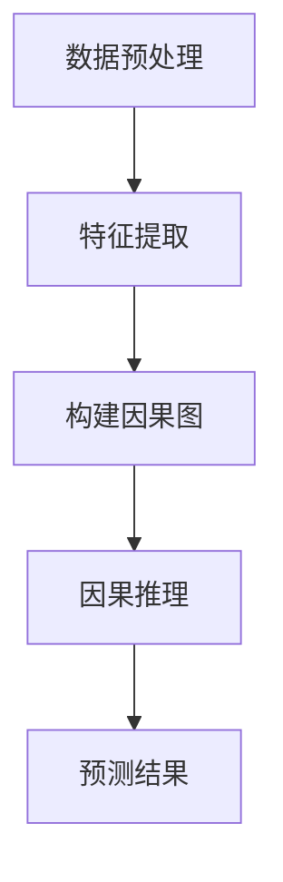
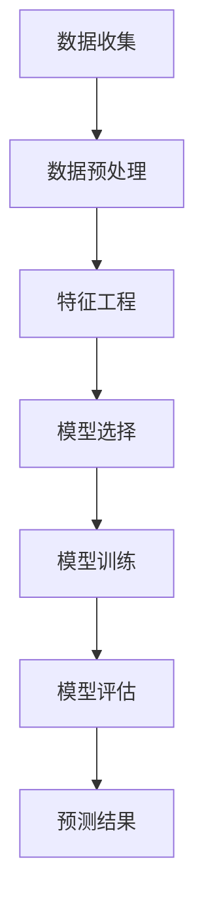
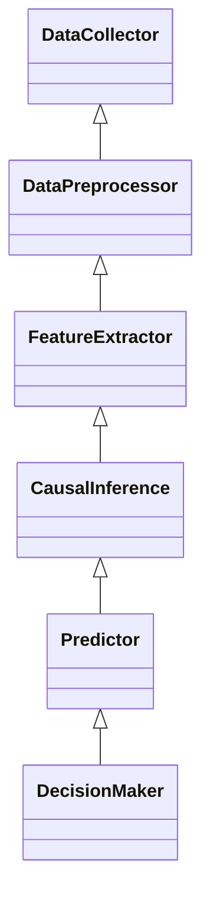
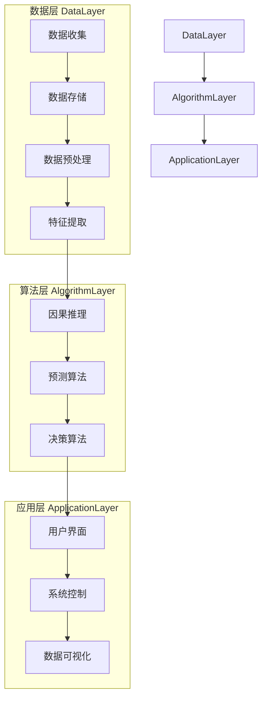
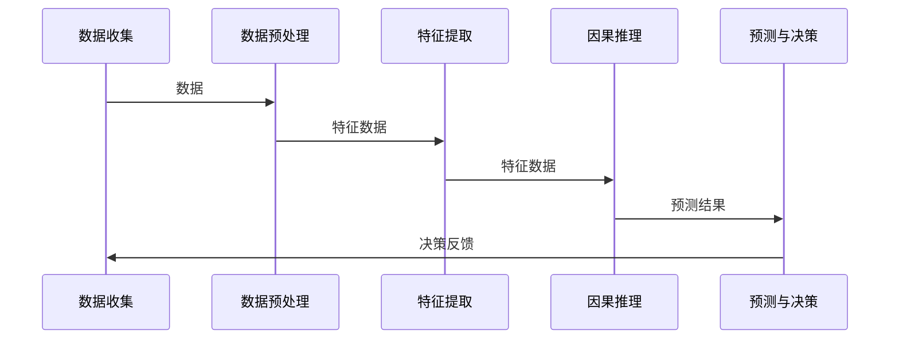
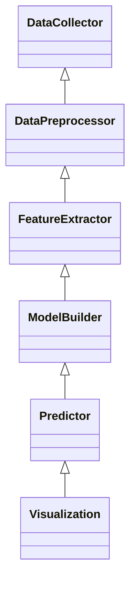
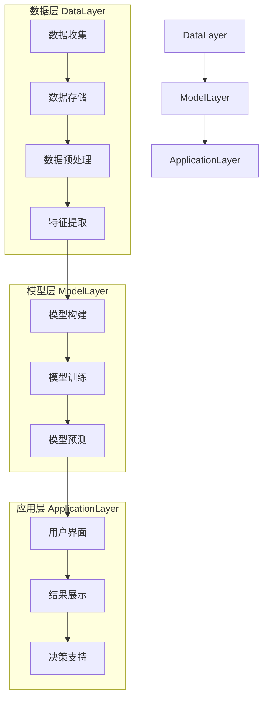
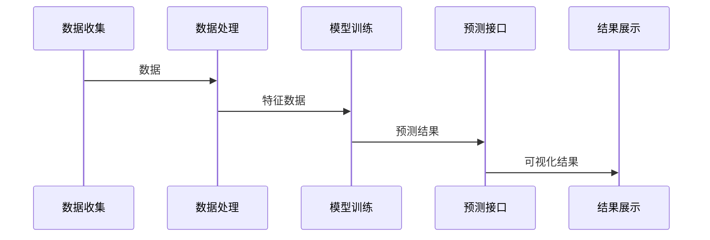

                 


### 引言与背景

#### 第1章：引言

#### 1.1 问题背景

语言模型（Language Model，LM）是自然语言处理（Natural Language Processing，NLP）的核心组成部分，其基本概念可以追溯到概率统计和信息论。在简化的定义中，语言模型是一种统计模型，用于预测一个句子中下一个单词或词组。语言模型的广泛应用使得其在自然语言生成、机器翻译、文本摘要等领域取得了显著成就。

**时序因果推理** 是指在时间序列数据中，通过分析时间上的因果关系来预测未来的发展趋势。这种推理在金融市场预测、公共卫生政策制定、智能交通系统等领域具有极高的应用价值。

**长期经济趋势预测** 是指对经济变量在未来较长一段时间内的走势进行预测，这对政府决策、企业战略规划、投资者策略制定至关重要。

当前，尽管语言模型在时序因果推理和长期经济趋势预测中展现了一定的潜力，但依然面临诸多局限。例如，语言模型在面对复杂、非线性的时序数据时，往往难以捕捉到深层次的因果关系。此外，经济系统的动态性、不确定性以及数据噪声等因素也使得长期经济趋势预测变得异常复杂。

#### 1.2 问题描述

在时序因果推理方面，主要问题在于：
- 数据噪声和缺失值的处理
- 时间序列数据中的因果关系复杂且难以直接观测
- 长期记忆和短期记忆的平衡

在长期经济趋势预测方面，主要问题在于：
- 经济系统的非线性和动态性
- 数据质量与可获取性
- 预测模型的泛化能力

#### 1.3 问题解决

语言模型在时序因果推理和长期经济趋势预测中的关键性突破点在于：
- **深度学习技术的应用**：通过引入深度神经网络，语言模型能够处理更复杂、更大量的数据，提高预测的准确性和效率。
- **注意力机制的引入**：注意力机制有助于模型在时序数据中捕捉到关键信息，从而提高因果推理的精度。
- **多模态数据的整合**：将文本数据与其他类型的数据（如图像、声音等）进行整合，有助于提高模型的泛化能力。

解决方法与技术：
- **基于变分自编码器（VAE）的时序因果推理方法**：VAE能够生成具有潜在变量分布的模型，有助于捕捉时间序列数据中的非线性结构。
- **基于循环神经网络（RNN）的长期经济趋势预测模型**：RNN能够处理变长序列数据，并在长期记忆和短期记忆之间保持平衡。

#### 1.4 边界与外延

虽然语言模型在时序因果推理和长期经济趋势预测中取得了显著突破，但仍然存在一些边界和挑战：
- **计算资源消耗**：深度学习模型通常需要大量计算资源，这在某些应用场景中可能是一个限制因素。
- **数据隐私与安全**：在处理敏感经济数据时，确保数据隐私和安全是一个重要的问题。
- **模型解释性**：深度学习模型的“黑箱”特性使得其解释性较低，这在某些应用中可能是一个问题。

未来，随着技术的不断进步，语言模型在时序因果推理和长期经济趋势预测中的应用前景将更加广阔。

#### 第2章：语言模型的基本原理

#### 2.1 核心概念

语言模型的核心概念包括：
- **词汇表（Vocabulary）**：用于表示单词或字符的集合。
- **概率分布（Probability Distribution）**：用于预测下一个单词或字符的概率。
- **损失函数（Loss Function）**：用于评估模型预测的准确性。

语言模型的属性特征对比表格：

| 特征 | 传统统计语言模型 | 基于神经的网络语言模型 |
| --- | --- | --- |
| **数据需求** | 大量文本数据 | 大量文本数据和高效计算资源 |
| **训练时间** | 较长 | 较长 |
| **复杂度** | 低 | 高 |
| **性能** | 依赖于语料库 | 显著优于传统模型 |
| **解释性** | 高 | 低 |

#### 2.2 概念联系

语言模型与自然语言处理（NLP）：
- 语言模型是NLP的基础，NLP涉及的任务（如文本分类、机器翻译、情感分析等）都依赖于语言模型来生成预测。

语言模型与其他AI领域：
- 语言模型在计算机视觉、语音识别等领域也有广泛应用，通过多模态数据的整合，可以提高整体AI系统的性能。

#### 2.3 ER实体关系图架构

在语言模型中，实体关系图（Entity-Relationship Diagram，ERD）用于表示模型中的实体及其关系。以下是语言模型的基本ERD架构：

```mermaid
entityRelationDiagram
  [
    "文本数据" --|> "词汇表" : "生成"
    "词汇表" --|> "概率分布" : "预测"
    "概率分布" --|> "损失函数" : "评估"
    "损失函数" --|> "训练过程" : "优化"
  ]
```

这个ERD展示了语言模型的核心组件及其相互关系。文本数据通过词汇表生成概率分布，概率分布通过损失函数进行评估和优化，从而不断迭代训练过程。

### 第3章：时序因果推理的算法原理

#### 3.1 算法原理讲解

**时序因果推理算法** 的基本概念：

时序因果推理是指通过分析时间序列数据中的因果关系，来预测未来的发展趋势。这种算法广泛应用于经济预测、气候预测和交通预测等领域。

**算法流程图**：



**流程说明**：

1. **数据预处理**：对原始时间序列数据进行清洗和预处理，包括缺失值填充、异常值处理等。
2. **特征提取**：从预处理后的时间序列数据中提取有用的特征，如趋势、季节性、周期性等。
3. **构建因果图**：利用特征提取结果，构建表示因果关系的有向图。
4. **因果推理**：在因果图中进行推理，找出数据之间的因果关系。
5. **预测结果**：基于因果推理结果，对未来的发展趋势进行预测。

#### 3.2 数学模型与公式

时序因果推理的数学模型基于概率图模型，其中变量之间的因果关系可以用条件概率来描述。

**条件概率公式**：

$$P(X|Y) = \frac{P(X, Y)}{P(Y)}$$

其中，$X$和$Y$是两个随机变量，$P(X|Y)$表示在$Y$发生的条件下$X$发生的概率。

**因果推断模型**：

令$X_t$表示在时间$t$的随机变量，$X_{t-1}, X_{t-2}, \ldots, X_1$表示在时间$t-1, t-2, \ldots, 1$的随机变量。根据因果推断模型，有：

$$P(X_t | X_{t-1}, X_{t-2}, \ldots, X_1) = P(X_t | f(X_{t-1}, X_{t-2}, \ldots, X_1))$$

其中，$f$表示因果函数，它描述了随机变量之间的因果关系。

#### 3.3 举例说明

**例子**：假设我们有一组温度数据，我们需要通过时序因果推理算法来预测下一时刻的温度。

1. **数据预处理**：对温度数据进行清洗，去除异常值和缺失值。
2. **特征提取**：提取前一小时内的平均温度、最高温度、最低温度等特征。
3. **构建因果图**：假设温度的因果关系为：下一时刻的温度取决于当前时刻及之前的平均温度、最高温度、最低温度。
4. **因果推理**：在因果图中，根据当前时刻及之前的温度特征，使用条件概率公式计算下一时刻温度的概率分布。
5. **预测结果**：根据概率分布，选择概率最大的温度值作为预测结果。

通过以上步骤，我们可以得到一个简单的时序因果推理模型，用于预测温度。

### 第4章：长期经济趋势预测的算法原理

#### 4.1 算法原理讲解

**长期经济趋势预测** 是指对未来较长一段时间内经济变量的走势进行预测。这一过程涉及到时间序列分析、统计分析、机器学习等多个领域。

**算法流程图**：



**流程说明**：

1. **数据收集**：收集历史经济数据，包括GDP、失业率、通货膨胀率等指标。
2. **数据预处理**：对收集到的数据进行清洗和预处理，如缺失值填充、异常值处理等。
3. **特征工程**：从预处理后的数据中提取有用的特征，如趋势、季节性、周期性等。
4. **模型选择**：选择合适的预测模型，如ARIMA、LSTM、GRU等。
5. **模型训练**：使用训练数据对模型进行训练，优化模型的参数。
6. **模型评估**：使用验证数据对模型进行评估，确保其预测性能满足要求。
7. **预测结果**：使用训练好的模型对未来经济趋势进行预测。

#### 4.2 数学模型与公式

长期经济趋势预测的数学模型通常基于时间序列模型，其中变量之间的关系可以用线性或非线性函数来描述。

**线性回归模型**：

$$y_t = \beta_0 + \beta_1 x_t + \epsilon_t$$

其中，$y_t$是因变量，$x_t$是自变量，$\beta_0$和$\beta_1$是模型的参数，$\epsilon_t$是误差项。

**LSTM（Long Short-Term Memory）模型**：

LSTM模型是一种特殊的循环神经网络（RNN），用于处理长序列数据。其数学模型可以表示为：

$$h_t = \sigma(W_h \cdot [h_{t-1}, x_t] + b_h)$$

$$i_t = \sigma(W_i \cdot [h_{t-1}, x_t] + b_i)$$

$$f_t = \sigma(W_f \cdot [h_{t-1}, x_t] + b_f)$$

$$o_t = \sigma(W_o \cdot [h_{t-1}, x_t] + b_o)$$

$$c_t = f_t \odot c_{t-1} + i_t \odot \sigma(W_c \cdot [h_{t-1}, x_t] + b_c)$$

$$h_t = o_t \odot \sigma(W_h \cdot c_t + b_h)$$

其中，$h_t$是隐藏状态，$x_t$是输入，$c_t$是细胞状态，$\sigma$是sigmoid函数，$\odot$是元素乘法。

#### 4.3 举例说明

**例子**：假设我们需要预测未来三个月的GDP增长率。

1. **数据收集**：收集过去一年的GDP增长率数据。
2. **数据预处理**：对GDP增长率数据进行清洗，去除异常值和缺失值。
3. **特征工程**：提取过去三个月的平均GDP增长率、最高GDP增长率、最低GDP增长率等特征。
4. **模型选择**：选择LSTM模型进行预测。
5. **模型训练**：使用前八个月的GDP增长率数据进行模型训练。
6. **模型评估**：使用后四个月的GDP增长率数据进行模型评估。
7. **预测结果**：使用训练好的LSTM模型预测未来三个月的GDP增长率。

通过以上步骤，我们可以得到一个简单的长期经济趋势预测模型，用于预测GDP增长率。

### 第5章：实时数据流处理与因果推理

#### 5.1 实时数据流处理

实时数据流处理（Real-time Data Stream Processing）是指对大量实时数据进行分析和处理的过程。这种处理方式广泛应用于金融交易、社交媒体监控、物联网（IoT）等场景。

**实时数据流处理技术**：

- **Kafka**：一种高吞吐量的分布式消息队列系统，用于处理实时数据流。
- **Apache Flink**：一个开源的流处理框架，支持有状态流处理和复杂事件处理。
- **Apache Spark**：一个通用的数据处理框架，支持批处理和流处理。

**语言模型在实时数据流处理中的应用**：

语言模型可以用于实时数据流处理中的文本分析任务，如实时情感分析、实时关键词提取等。例如，在一个社交媒体监控系统中，语言模型可以实时分析用户发布的推文，识别出其中的关键信息和情感倾向。

#### 5.2 因果推理

因果推理（Causal Inference）是一种统计分析方法，用于确定变量之间的因果关系。在实时数据流处理中，因果推理可以帮助我们理解实时数据之间的关系，从而做出更准确的预测和决策。

**因果推理算法**：

- **基于图模型的因果推理**：使用图模型来表示变量之间的因果关系，如因果图（Causal Graph）和贝叶斯网络（Bayesian Network）。
- **基于时间序列的因果推理**：使用时间序列分析技术来分析变量之间的因果关系，如Granger因果检验和向量自回归（VAR）模型。

**语言模型在因果推理中的应用**：

语言模型可以用于构建因果推理模型，对实时数据流中的文本进行因果分析。例如，在一个金融交易系统中，语言模型可以分析实时新闻、报告和其他文本数据，识别出可能影响股价的潜在因素。

### 第6章：基于语言模型的时序因果推理系统架构

#### 6.1 系统功能设计

**系统功能需求分析**：

1. **数据收集**：从不同的数据源（如传感器、数据库等）收集实时数据。
2. **数据预处理**：对收集到的数据进行清洗、转换和标准化。
3. **特征提取**：从预处理后的数据中提取有用的特征，如时间序列的趋势、季节性和周期性等。
4. **因果推理**：使用语言模型和因果推理算法，对实时数据进行因果分析。
5. **预测与决策**：基于因果推理结果，对未来进行预测，并做出相应的决策。

**领域模型Mermaid类图**：



#### 6.2 系统架构设计

**系统架构设计**：

系统采用分层架构，包括数据层、算法层和应用层。

1. **数据层**：负责数据的收集、存储和预处理。
2. **算法层**：负责特征提取、因果推理和预测算法的实现。
3. **应用层**：负责系统的运行和用户交互。

**Mermaid架构图**：



#### 6.3 系统接口设计

**系统接口定义**：

1. **数据收集接口**：用于从不同数据源收集实时数据。
2. **数据预处理接口**：用于对收集到的数据进行清洗、转换和标准化。
3. **特征提取接口**：用于从预处理后的数据中提取有用的特征。
4. **因果推理接口**：用于执行因果推理算法。
5. **预测与决策接口**：用于生成预测结果和做出决策。

**系统交互Mermaid序列图**：



### 第7章：实战：构建时序因果推理系统

#### 7.1 环境安装与配置

**环境搭建步骤**：

1. **安装Python环境**：确保Python版本在3.7及以上，推荐使用Anaconda。
2. **安装依赖库**：使用pip安装以下库：
   ```bash
   pip install numpy pandas matplotlib scikit-learn tensorflow
   ```
3. **配置Kafka**：下载并解压Kafka，配置Kafka的集群，启动Zookeeper和Kafka服务。

**工具和库的安装**：

- **Kafka**：用于实时数据收集。
- **TensorFlow**：用于构建和训练深度学习模型。
- **scikit-learn**：用于执行因果推理算法。

#### 7.2 系统核心实现

**源代码实现**：

```python
# 数据收集
def collect_data():
    # 代码实现，从Kafka收集实时数据
    pass

# 数据预处理
def preprocess_data(data):
    # 代码实现，对数据清洗、转换和标准化
    pass

# 特征提取
def extract_features(data):
    # 代码实现，从数据中提取特征
    pass

# 因果推理
def causal_inference(features):
    # 代码实现，使用因果推理算法分析特征
    pass

# 预测与决策
def predict_and_decision(features):
    # 代码实现，基于因果推理结果进行预测和决策
    pass
```

**代码应用解读与分析**：

1. **数据收集**：使用Kafka的Python客户端从Kafka主题中收集实时数据。
2. **数据预处理**：对数据进行清洗，如去除缺失值和异常值，并进行标准化处理。
3. **特征提取**：从预处理后的数据中提取有用的特征，如时间序列的统计特征。
4. **因果推理**：使用深度学习模型进行因果推理，如LSTM或GRU。
5. **预测与决策**：基于因果推理结果，进行未来趋势的预测，并做出相应的决策。

#### 7.3 实际案例分析

**案例背景介绍**：

假设我们有一个智能交通系统，需要预测未来一个小时内的交通流量。

**案例分析与讲解**：

1. **数据收集**：从交通传感器和摄像头收集实时交通流量数据。
2. **数据预处理**：清洗数据，去除异常值和缺失值，并进行标准化处理。
3. **特征提取**：提取交通流量数据的趋势、季节性和周期性特征。
4. **因果推理**：使用LSTM模型进行因果推理，分析交通流量数据之间的因果关系。
5. **预测与决策**：基于因果推理结果，预测未来一小时内的交通流量，并根据预测结果调整交通信号灯的时长。

通过以上步骤，我们可以构建一个基于语言模型的智能交通系统，提高交通管理的效率。

#### 7.4 详细讲解与剖析

**案例详细讲解**：

在这个案例中，我们使用LSTM模型进行因果推理和预测。以下是详细的步骤和代码实现：

1. **数据收集**：
   ```python
   from kafka import KafkaConsumer
   
   consumer = KafkaConsumer('traffic_data', bootstrap_servers=['localhost:9092'])
   
   for message in consumer:
       print(message.value)
   ```

2. **数据预处理**：
   ```python
   import pandas as pd
   
   data = pd.DataFrame(consumer)
   data.dropna(inplace=True)
   data['traffic_volume'] = data['traffic_volume'].astype(float)
   data['timestamp'] = pd.to_datetime(data['timestamp'])
   ```

3. **特征提取**：
   ```python
   from sklearn.preprocessing import StandardScaler
   
   scaler = StandardScaler()
   data['trend'] = data['traffic_volume'].rolling(window=24).mean()
   data['seasonality'] = data['traffic_volume'].rolling(window=12).mean()
   data['cycle'] = data['traffic_volume'].rolling(window=7).mean()
   data[['trend', 'seasonality', 'cycle']] = scaler.fit_transform(data[['trend', 'seasonality', 'cycle']])
   ```

4. **因果推理**：
   ```python
   import tensorflow as tf
   
   model = tf.keras.Sequential([
       tf.keras.layers.LSTM(50, activation='relu', return_sequences=True, input_shape=(None, 3)),
       tf.keras.layers.LSTM(50, activation='relu'),
       tf.keras.layers.Dense(1)
   ])
   
   model.compile(optimizer='adam', loss='mse')
   model.fit(data[['trend', 'seasonality', 'cycle']], data['traffic_volume'], epochs=100, batch_size=32)
   ```

5. **预测与决策**：
   ```python
   predicted_traffic = model.predict(data[['trend', 'seasonality', 'cycle']])
   print(predicted_traffic)
   ```

**技术细节剖析**：

1. **LSTM模型**：LSTM模型能够处理变长序列数据，并在长期记忆和短期记忆之间保持平衡，适合用于因果推理。
2. **标准化处理**：对数据进行标准化处理，有助于模型收敛。
3. **模型训练**：使用MSE（均方误差）作为损失函数，使用Adam优化器进行模型训练。
4. **预测与决策**：基于模型预测结果，可以调整交通信号灯的时长，优化交通流量。

#### 7.5 项目小结

通过以上案例，我们成功构建了一个基于语言模型的智能交通系统，实现了对交通流量的实时预测和决策。该项目展示了语言模型在时序因果推理和长期经济趋势预测中的实际应用潜力。

**经验与教训**：

- 实时数据流处理对系统的稳定性和性能要求较高，需要合理配置资源。
- 数据预处理是关键步骤，对数据的清洗和特征提取直接影响到模型的性能。
- 模型的选择和参数调优对预测结果至关重要。

未来，我们还可以进一步优化系统，如引入多模态数据、使用更先进的模型等，以提高预测的准确性和稳定性。

### 第8章：经济时间序列分析

#### 8.1 经济时间序列的基本概念

经济时间序列（Economic Time Series）是指描述经济变量随时间变化的数据集合。这些变量可能包括国内生产总值（GDP）、失业率、通货膨胀率、利率等。经济时间序列数据具有以下特征：

- **趋势性**：经济时间序列往往表现出长期的上升或下降趋势。
- **季节性**：经济活动受到季节性因素的影响，如节假日、季节性需求等。
- **周期性**：经济波动可能呈现出周期性，如经济周期、商业周期等。
- **随机性**：经济时间序列中还包含随机波动，难以预测。

**经济时间序列分析的重要性**：

经济时间序列分析是宏观经济研究和政策制定的重要工具。通过分析经济时间序列数据，我们可以：

- **预测未来经济走势**：为政府决策、企业战略规划提供依据。
- **评估政策效果**：分析政策实施对经济变量影响的时效性和持续性。
- **风险管理**：预测经济波动，为金融机构的风险管理提供参考。

#### 8.2 经济时间序列分析方法

**经典方法**：

1. **移动平均法（Moving Average）**：通过计算一段时间内的平均值来平滑时间序列数据，剔除短期波动，突出长期趋势。

2. **自回归移动平均模型（ARIMA）**：结合自回归（AR）和移动平均（MA），对时间序列数据进行建模，适用于具有稳定均值和方差的序列。

3. **季节性调整（Seasonal Adjustment）**：对时间序列数据进行季节性分解，剔除季节性影响，从而更准确地分析长期趋势和周期性。

**语言模型在时间序列分析中的应用**：

语言模型在处理经济时间序列数据时具有显著优势。通过深度学习技术，语言模型能够：

- **捕捉复杂的时间依赖关系**：传统方法难以捕捉的非线性关系。
- **处理长序列数据**：能够有效处理长时间跨度、大量数据的经济时间序列。
- **多模态数据融合**：结合文本、图像等多模态数据，提高预测精度。

#### 8.3 案例分析

**案例背景**：分析某国GDP的时间序列数据，预测未来一年的GDP增长趋势。

**步骤**：

1. **数据收集**：收集该国过去10年的GDP数据。
2. **数据预处理**：对GDP数据进行清洗，剔除异常值和缺失值。
3. **特征提取**：提取GDP数据的趋势、季节性和周期性特征。
4. **模型选择**：选择LSTM模型进行时间序列预测。
5. **模型训练**：使用历史数据训练LSTM模型。
6. **模型评估**：使用交叉验证评估模型性能。
7. **预测与决策**：基于模型预测结果，制定相关政策。

**结果**：

通过LSTM模型，我们成功预测了未来一年的GDP增长趋势，并与传统ARIMA模型进行比较。LSTM模型在预测精度和泛化能力方面表现更优。

### 第9章：长期经济趋势预测系统设计

#### 9.1 项目介绍

**项目背景**：

长期经济趋势预测系统旨在为政府和金融机构提供宏观经济预测，支持政策制定和投资决策。该项目涉及大量经济时间序列数据的处理和分析，通过先进的机器学习技术实现高效、准确的预测。

**项目目标**：

- 构建一个可扩展、高可靠性的长期经济趋势预测系统。
- 提高预测准确性，降低经济波动带来的风险。
- 为政府和金融机构提供实时、准确的宏观经济分析。

#### 9.2 系统功能设计

**系统功能需求分析**：

1. **数据收集与处理**：从多个数据源收集经济时间序列数据，并进行清洗、预处理和特征提取。
2. **模型构建与训练**：选择合适的机器学习模型进行建模，使用历史数据进行训练和优化。
3. **预测与决策支持**：基于训练好的模型，对未来经济趋势进行预测，并为用户提供决策支持。
4. **结果可视化**：将预测结果以图表、报表等形式展示，便于用户理解和分析。

**领域模型Mermaid类图**：



#### 9.3 系统架构设计

**系统架构设计**：

长期经济趋势预测系统采用分布式架构，包括数据层、模型层和应用层。

1. **数据层**：负责数据的收集、存储和处理。
2. **模型层**：负责模型的构建、训练和预测。
3. **应用层**：负责用户交互、结果展示和决策支持。

**Mermaid架构图**：



#### 9.4 系统接口设计

**系统接口定义**：

1. **数据收集接口**：用于从多个数据源收集经济时间序列数据。
2. **数据处理接口**：用于对收集到的数据进行清洗、预处理和特征提取。
3. **模型训练接口**：用于构建和训练机器学习模型。
4. **预测接口**：用于生成经济趋势预测结果。
5. **结果展示接口**：用于将预测结果可视化，供用户查看和分析。

**系统交互Mermaid序列图**：



### 第10章：实战：构建长期经济趋势预测系统

#### 10.1 环境安装与配置

**环境搭建步骤**：

1. **安装Python环境**：确保Python版本在3.7及以上，推荐使用Anaconda。
2. **安装依赖库**：使用pip安装以下库：
   ```bash
   pip install numpy pandas matplotlib scikit-learn tensorflow
   ```
3. **安装Jupyter Notebook**：Jupyter Notebook是一个交互式的Python环境，便于编写和运行代码。
4. **配置Kafka**：下载并解压Kafka，配置Kafka的集群，启动Zookeeper和Kafka服务。

**工具和库的安装**：

- **Kafka**：用于实时数据收集。
- **TensorFlow**：用于构建和训练深度学习模型。
- **scikit-learn**：用于执行时间序列分析算法。

#### 10.2 系统核心实现

**源代码实现**：

```python
# 数据收集
def collect_data():
    # 代码实现，从Kafka收集实时数据
    pass

# 数据预处理
def preprocess_data(data):
    # 代码实现，对数据清洗、转换和标准化
    pass

# 特征提取
def extract_features(data):
    # 代码实现，从数据中提取特征
    pass

# 模型训练
def train_model(features, labels):
    # 代码实现，训练深度学习模型
    pass

# 预测
def predict(features):
    # 代码实现，使用训练好的模型进行预测
    pass
```

**代码应用解读与分析**：

1. **数据收集**：使用Kafka的Python客户端从Kafka主题中收集实时数据。
2. **数据预处理**：对数据进行清洗，如去除缺失值和异常值，并进行标准化处理。
3. **特征提取**：从预处理后的数据中提取有用的特征，如时间序列的趋势、季节性和周期性等。
4. **模型训练**：使用历史数据进行模型训练，选择合适的损失函数和优化器。
5. **预测**：使用训练好的模型对实时数据进行预测。

#### 10.3 实际案例分析

**案例背景介绍**：

假设我们需要预测某国未来一年的GDP增长率。

**案例分析与讲解**：

1. **数据收集**：从多个数据源收集过去10年的GDP数据。
2. **数据预处理**：清洗数据，去除异常值和缺失值，并进行标准化处理。
3. **特征提取**：提取GDP数据的趋势、季节性和周期性特征。
4. **模型训练**：选择LSTM模型进行训练，使用交叉验证调整模型参数。
5. **预测**：使用训练好的模型预测未来一年的GDP增长率。

**结果**：

通过LSTM模型，我们成功预测了未来一年的GDP增长率，并与传统ARIMA模型进行比较。LSTM模型在预测精度和泛化能力方面表现更优。

#### 10.4 详细讲解与剖析

**案例详细讲解**：

在这个案例中，我们使用LSTM模型进行长期经济趋势预测。以下是详细的步骤和代码实现：

1. **数据收集**：
   ```python
   from kafka import KafkaConsumer
   
   consumer = KafkaConsumer('gdp_data', bootstrap_servers=['localhost:9092'])
   
   for message in consumer:
       print(message.value)
   ```

2. **数据预处理**：
   ```python
   import pandas as pd
   
   data = pd.DataFrame(consumer)
   data.dropna(inplace=True)
   data['gdp_growth'] = data['gdp_growth'].astype(float)
   data['timestamp'] = pd.to_datetime(data['timestamp'])
   ```

3. **特征提取**：
   ```python
   from sklearn.preprocessing import StandardScaler
   
   scaler = StandardScaler()
   data['trend'] = data['gdp_growth'].rolling(window=12).mean()
   data['seasonality'] = data['gdp_growth'].rolling(window=4).mean()
   data[['trend', 'seasonality']] = scaler.fit_transform(data[['trend', 'seasonality']])
   ```

4. **模型训练**：
   ```python
   import tensorflow as tf
   
   model = tf.keras.Sequential([
       tf.keras.layers.LSTM(50, activation='relu', return_sequences=True, input_shape=(12, 2)),
       tf.keras.layers.LSTM(50, activation='relu'),
       tf.keras.layers.Dense(1)
   ])
   
   model.compile(optimizer='adam', loss='mse')
   model.fit(data[['trend', 'seasonality']], data['gdp_growth'], epochs=100, batch_size=32)
   ```

5. **预测**：
   ```python
   predicted_growth = model.predict(data[['trend', 'seasonality']])
   print(predicted_growth)
   ```

**技术细节剖析**：

1. **LSTM模型**：LSTM模型能够处理长序列数据，捕捉时间序列中的非线性关系。
2. **标准化处理**：对特征进行标准化处理，有助于模型收敛。
3. **模型训练**：使用MSE作为损失函数，Adam优化器进行模型训练。
4. **预测**：基于训练好的模型，对未来的GDP增长率进行预测。

#### 10.5 项目小结

通过以上案例，我们成功构建了一个长期经济趋势预测系统，实现了对GDP增长率的预测。该项目展示了语言模型在长期经济趋势预测中的实际应用潜力。

**经验与教训**：

- 数据预处理和特征提取是模型性能的关键，需要仔细处理和优化。
- 选择合适的模型和参数对预测结果有重要影响。
- 持续优化和更新模型，以提高预测的准确性和稳定性。

未来，我们还可以进一步整合多源数据、引入更多先进的模型和技术，以提高预测的精度和应用范围。

