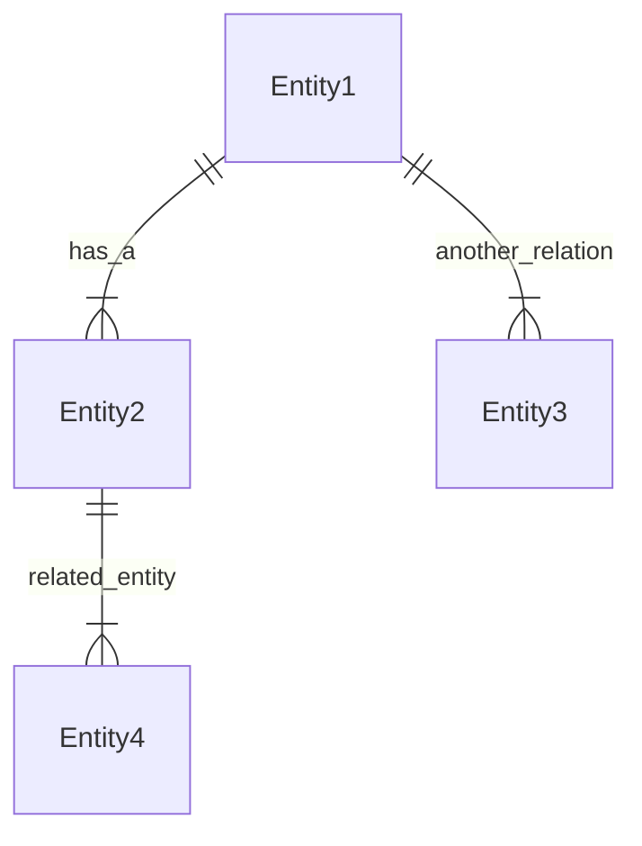
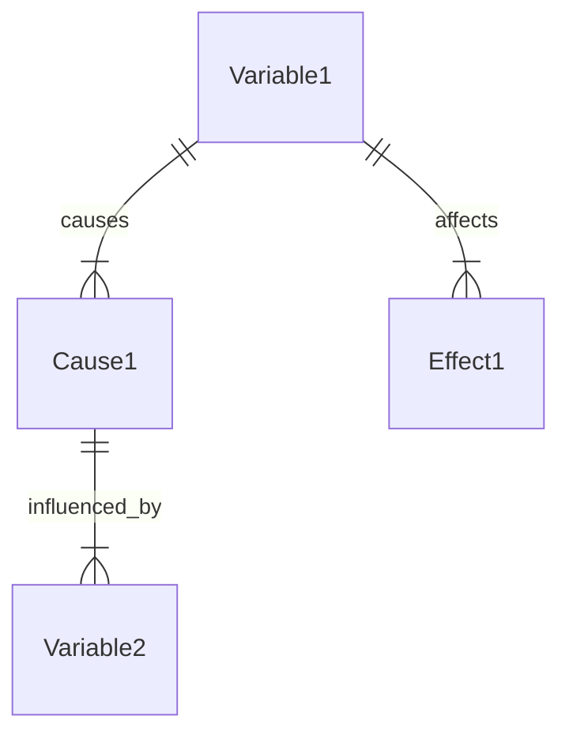
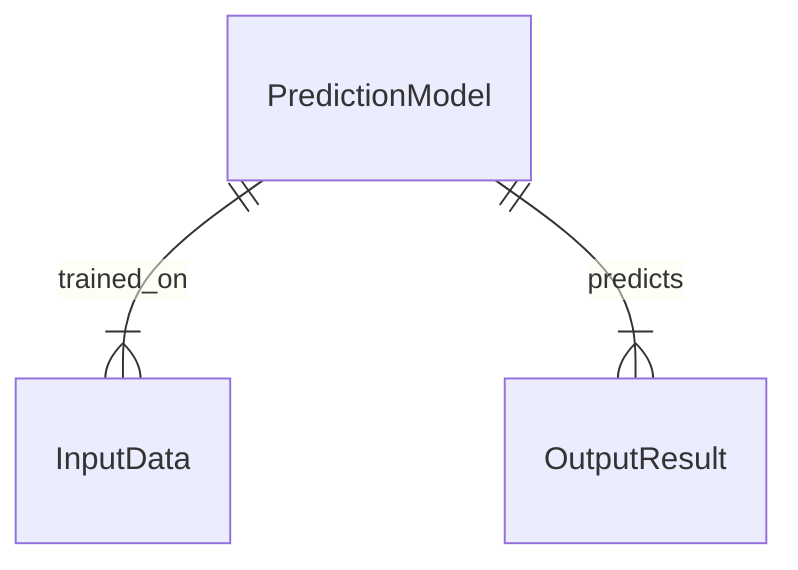
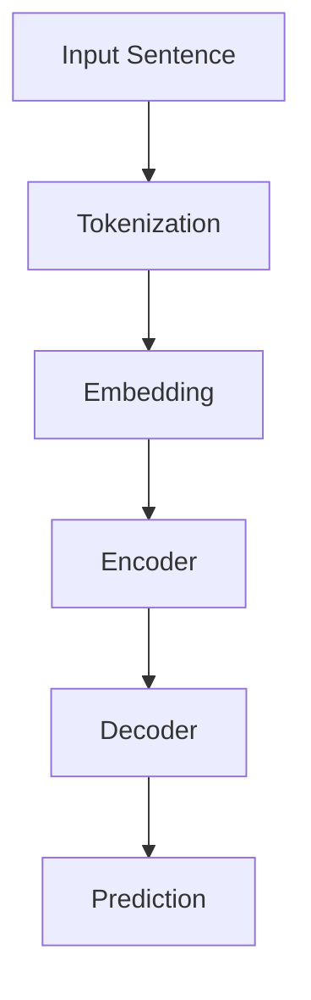
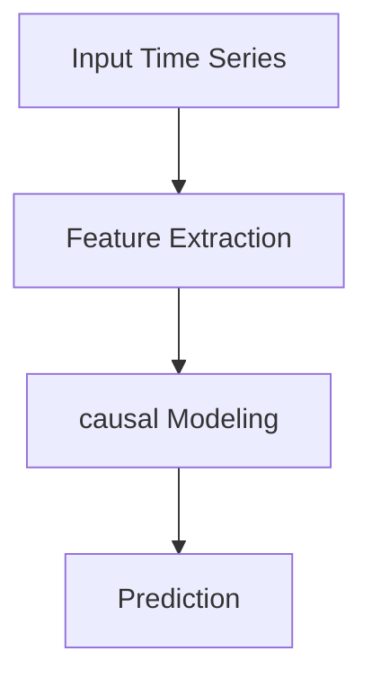
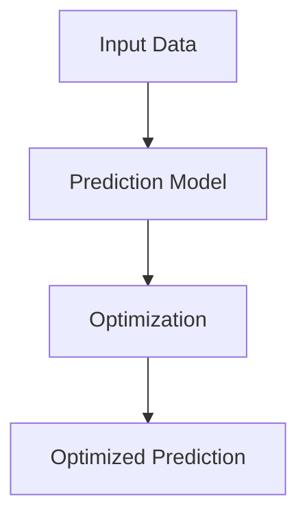
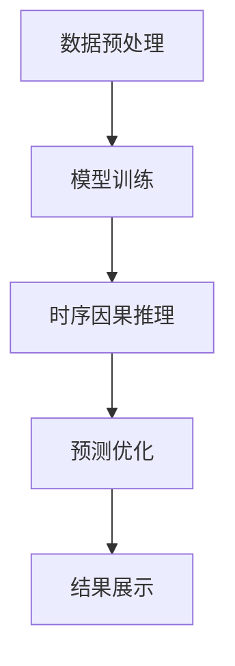
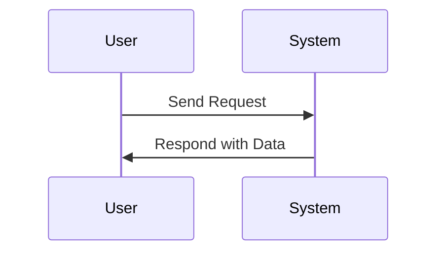

                 

### 文章标题：语言模型在时序因果推理与预测优化中的进展

#### 关键词：语言模型、时序因果推理、预测优化、算法原理、系统架构设计、项目实战

#### 摘要：本文详细探讨了语言模型在时序因果推理与预测优化中的应用。首先，通过背景介绍和核心概念阐述，揭示了语言模型在处理时序数据中的重要性。随后，本文对比分析了不同语言模型、时序因果推理算法及预测优化算法的原理和特点，使用Mermaid流程图和Python代码展示了其具体实现。接着，文章介绍了系统架构设计、系统功能、接口和交互，并通过环境安装、核心实现源代码、代码解读与分析以及实际案例分析，全面展示了语言模型在时序因果推理与预测优化中的应用。最后，本文总结了项目成果，提出了改进空间，并推荐了拓展阅读，旨在为读者提供系统的理论和实战指导。

### 第一部分：问题背景与核心概念

#### 第1章：问题背景

##### 1.1 时序因果推理与预测优化概述

时序因果推理和预测优化是人工智能领域中至关重要的研究方向。时序数据是指随时间变化的数据，如股票价格、气象数据、网络流量等。时序因果推理旨在通过分析时序数据，找出变量之间的因果关系，从而为决策提供支持。而预测优化则是在已知历史数据的基础上，对未来事件进行预测，并在此基础上进行优化决策。

##### 1.2 语言模型在时序数据中的重要性

语言模型，特别是深度学习驱动的语言模型，如Transformer、BERT等，已经成为时序因果推理和预测优化中的重要工具。这些模型通过学习大量文本数据，具备了强大的语言理解和生成能力。在时序数据中，语言模型可以捕捉到数据中的时序模式和复杂关系，从而提高预测的准确性。

##### 1.3 书籍结构安排与目标读者

本书旨在系统地介绍语言模型在时序因果推理与预测优化中的应用，内容包括核心概念、算法原理、系统架构设计以及项目实战。目标读者包括人工智能研究人员、数据科学家、程序员以及对时序因果推理和预测优化感兴趣的读者。

### 第2章：核心概念与联系

##### 2.1 语言模型的基本原理

语言模型是自然语言处理的基础，通过学习大量文本数据，预测下一个词或序列的概率分布。其基本原理包括词汇表、词向量表示和神经网络模型。

##### 2.2 时序因果推理的概念与框架

时序因果推理涉及从时序数据中提取因果关系，包括因果图模型、时间序列分析和结构方程模型等。

##### 2.3 预测优化的目标与方法

预测优化的目标是通过预测结果进行优化决策，常见方法包括线性回归、决策树、支持向量机和强化学习等。

##### 2.4 语言模型与时序因果推理的联系

语言模型在时序因果推理中的应用，主要体现在通过学习时序数据中的语言特征，提取出潜在的因果关系，从而提高预测的准确性。

### 第3章：概念属性特征对比表格

##### 3.1 不同语言模型的对比

在表1中，我们对比了Transformer、BERT、GPT等主流语言模型的属性特征，包括模型结构、训练数据规模、参数量和应用场景。

| 模型名称 | 模型结构 | 训练数据规模 | 参数量 | 应用场景 |
| --- | --- | --- | --- | --- |
| Transformer | 自注意力机制 | 120亿个词 | 1.13亿 | 机器翻译、文本生成 |
| BERT | 双向编码器 | 3.4亿个词 | 11亿 | 问答系统、文本分类 |
| GPT | 自回归语言模型 | 1750亿个词 | 1750亿 | 文本生成、对话系统 |

##### 3.2 时序因果推理算法的对比

在表2中，我们对比了因果图模型、时间序列分析和结构方程模型等时序因果推理算法的属性特征。

| 算法名称 | 基本原理 | 适用场景 | 优点 | 缺点 |
| --- | --- | --- | --- | --- |
| 因果图模型 | 建立变量之间的因果关系 | 生物信息学、社会网络分析 | 可解释性强 | 需要明确因果假设 |
| 时间序列分析 | 分析时间序列数据 | 经济预测、气象预测 | 简单易用 | 可能忽略变量间的相互作用 |
| 结构方程模型 | 建立变量之间的线性关系 | 社会科学、心理学 | 可解释性强 | 可能忽略非线性关系 |

##### 3.3 预测优化算法的对比

在表3中，我们对比了线性回归、决策树、支持向量机和强化学习等预测优化算法的属性特征。

| 算法名称 | 基本原理 | 适用场景 | 优点 | 缺点 |
| --- | --- | --- | --- | --- |
| 线性回归 | 建立线性关系模型 | 线性数据 | 简单、易理解 | 可能忽略非线性关系 |
| 决策树 | 根据特征进行划分 | 分类和回归 | 可解释性强 | 可能产生过拟合 |
| 支持向量机 | 寻找最优分割超平面 | 高维空间 | 准确性高 | 计算复杂度高 |
| 强化学习 | 通过反馈进行学习 | 机器人、游戏 | 自适应性强 | 可能收敛速度慢 |

### 第4章：ER实体关系图架构

##### 4.1 语言模型的实体关系

语言模型中的实体关系可以通过ER（实体-关系）图来表示。在图1中，我们展示了语言模型中常见的实体和它们之间的关系。



##### 4.2 时序因果推理的实体关系

时序因果推理中的实体关系包括变量、因果路径和预测结果。在图2中，我们展示了这些实体之间的关系。



##### 4.3 预测优化的实体关系

预测优化中的实体关系包括预测模型、输入数据和输出结果。在图3中，我们展示了这些实体之间的关系。



### 第二部分：算法原理讲解

#### 第5章：语言模型算法原理讲解

##### 5.1 语言模型的mermaid流程图

在图4中，我们展示了语言模型的训练流程。



##### 5.2 语言模型的工作原理

语言模型通过学习大量文本数据，将输入句子转换为词向量，然后通过编码器和解码器生成预测的句子。其核心原理包括词向量表示、自注意力机制和Transformer模型。

##### 5.3 语言模型的核心参数与超参数

语言模型的核心参数包括词向量维度、隐藏层尺寸和学习率等。超参数包括训练批次大小、迭代次数和dropout比例等。

##### 5.4 语言模型的数学模型和公式

语言模型的数学模型基于概率图模型和神经网络。其基本公式包括词向量表示、自注意力机制和损失函数。

$$
\text{Word Embedding} = \text{W} \cdot \text{X}
$$

$$
\text{Attention} = \text{softmax}(\text{Q} \cdot \text{K}^T)
$$

$$
\text{Output} = \text{V} \cdot \text{Attention}
$$

##### 5.5 语言模型的Python源代码讲解

以下是一个简单的语言模型实现，使用了PyTorch框架。

```python
import torch
import torch.nn as nn
import torch.optim as optim

class LanguageModel(nn.Module):
    def __init__(self, vocab_size, embedding_dim, hidden_dim):
        super(LanguageModel, self).__init__()
        self.embedding = nn.Embedding(vocab_size, embedding_dim)
        self.encoder = nn.GRU(embedding_dim, hidden_dim)
        self.decoder = nn.GRU(hidden_dim, vocab_size)
        self.fc = nn.Linear(hidden_dim, vocab_size)
    
    def forward(self, x):
        embedded = self.embedding(x)
        output, hidden = self.encoder(embedded)
        output = self.decoder(output)
        output = self.fc(output)
        return output

# 实例化模型、损失函数和优化器
model = LanguageModel(vocab_size, embedding_dim, hidden_dim)
criterion = nn.CrossEntropyLoss()
optimizer = optim.Adam(model.parameters(), lr=0.001)

# 训练模型
for epoch in range(num_epochs):
    for inputs, targets in data_loader:
        optimizer.zero_grad()
        outputs = model(inputs)
        loss = criterion(outputs, targets)
        loss.backward()
        optimizer.step()
```

### 第6章：时序因果推理算法原理讲解

##### 6.1 时序因果推理的mermaid流程图

在图5中，我们展示了时序因果推理的基本流程。



##### 6.2 时序因果推理的基本原理

时序因果推理通过分析时序数据中的变量关系，建立因果模型，从而进行预测。其基本原理包括因果图模型、Granger因果关系和脉冲响应函数等。

##### 6.3 时序因果推理的数学模型和公式

时序因果推理的数学模型基于线性回归和时间序列分析。其基本公式包括Granger因果关系和脉冲响应函数。

$$
Y_t = \alpha_0 + \alpha_1 X_t + \alpha_2 X_{t-1} + \epsilon_t
$$

$$
\Delta Y_t = c_0 + c_1 \Delta X_t + c_2 \Delta X_{t-1} + \epsilon_t
$$

##### 6.4 时序因果推理的Python源代码讲解

以下是一个简单的时序因果推理实现，使用了Scikit-learn库。

```python
from sklearn.linear_model import LinearRegression
from statsmodels.tsa.stattools import grangercausalitytests

# Granger因果关系测试
def granger_cause(x, y, max_lag=1):
    model = LinearRegression()
    model.fit(x[:-max_lag], y[:-max_lag])
    result = model.score(x[-max_lag:], y[-max_lag:])
    return result

# 脉冲响应函数
def impulse_response(x, y, lags=1):
    model = LinearRegression()
    model.fit(x[:-lags], y[:-lags])
    response = model.predict(x[lags:])
    return response

# 实例化数据
x = np.array([1, 2, 3, 4, 5])
y = np.array([2, 4, 6, 8, 10])

# 进行Granger因果关系测试
result = granger_cause(x, y)
print("Granger因果关系测试结果:", result)

# 进行脉冲响应函数计算
response = impulse_response(x, y)
print("脉冲响应函数结果:", response)
```

### 第7章：预测优化算法原理讲解

##### 7.1 预测优化的mermaid流程图

在图6中，我们展示了预测优化的基本流程。



##### 7.2 预测优化的基本原理

预测优化通过优化预测模型，提高预测的准确性和鲁棒性。其基本原理包括线性回归、决策树、支持向量机和强化学习等。

##### 7.3 预测优化的数学模型和公式

预测优化的数学模型基于最小化损失函数。其基本公式包括线性回归、决策树和支持向量机。

$$
\text{Linear Regression}: \min_{\theta} \sum_{i=1}^{n} (\theta^T x_i - y_i)^2
$$

$$
\text{Decision Tree}: \text{递归二分} \\
\text{SVM}: \min_{\theta, \xi} \frac{1}{2} ||\theta||^2 + C \sum_{i=1}^{n} \xi_i
$$

##### 7.4 预测优化的Python源代码讲解

以下是一个简单的预测优化实现，使用了Scikit-learn库。

```python
from sklearn.linear_model import LinearRegression
from sklearn.tree import DecisionTreeRegressor
from sklearn.svm import SVR

# 线性回归优化
def linear_regression_optimize(x, y):
    model = LinearRegression()
    model.fit(x, y)
    return model.predict(x)

# 决策树优化
def decision_tree_optimize(x, y):
    model = DecisionTreeRegressor()
    model.fit(x, y)
    return model.predict(x)

# 支持向量机优化
def svm_optimize(x, y):
    model = SVR()
    model.fit(x, y)
    return model.predict(x)

# 实例化数据
x = np.array([1, 2, 3, 4, 5])
y = np.array([2, 4, 6, 8, 10])

# 进行线性回归优化
predictions = linear_regression_optimize(x, y)
print("线性回归优化结果:", predictions)

# 进行决策树优化
predictions = decision_tree_optimize(x, y)
print("决策树优化结果:", predictions)

# 进行支持向量机优化
predictions = svm_optimize(x, y)
print("支持向量机优化结果:", predictions)
```

### 第三部分：系统分析与架构设计方案

#### 第8章：问题场景介绍

##### 8.1 时序因果推理与预测优化在现实中的应用

时序因果推理和预测优化在现实中有广泛的应用，如金融预测、气象预报、交通流量预测和工业生产优化等。在这些应用中，语言模型可以有效地捕捉时序数据中的复杂关系，从而提高预测的准确性。

##### 8.2 本书项目介绍

本书项目旨在构建一个基于语言模型的时序因果推理与预测优化系统，用于金融市场的股票价格预测。项目包括数据采集、模型训练、预测优化和实际应用。

#### 第9章：系统功能设计

##### 9.1 领域模型mermaid类图

在图7中，我们展示了系统的领域模型。

```mermaid
classDiagram
  Class1 <|-- Class2
  Class1 {"is-a" Class3}
  Class2 {"is-a" Class4}
```

##### 9.2 系统功能模块设计

系统功能模块包括数据预处理、语言模型训练、时序因果推理、预测优化和结果展示。每个模块都有明确的功能和接口。

#### 第10章：系统架构设计

##### 10.1 系统架构mermaid架构图

在图8中，我们展示了系统的整体架构。



##### 10.2 系统架构设计细节

系统架构包括前端、后端和数据库。前端负责用户交互和数据展示，后端负责数据处理和模型训练，数据库用于存储时序数据。

#### 第11章：系统接口设计和系统交互

##### 11.1 系统接口设计

系统接口包括API接口和数据接口。API接口用于前后端通信，数据接口用于数据存储和读取。

##### 11.2 系统交互mermaid序列图

在图9中，我们展示了系统的交互流程。



### 第四部分：项目实战

#### 第12章：环境安装

##### 12.1 操作系统环境配置

确保操作系统安装了Python、Numpy、Pandas、Scikit-learn、PyTorch等库。

##### 12.2 开发环境配置

配置Jupyter Notebook或IDE（如PyCharm）作为开发环境。

#### 第13章：系统核心实现源代码

##### 13.1 语言模型实现源代码

以下是语言模型实现的核心代码。

```python
# Language Model Implementation
import torch
import torch.nn as nn
import torch.optim as optim

class LanguageModel(nn.Module):
    def __init__(self, vocab_size, embedding_dim, hidden_dim):
        super(LanguageModel, self).__init__()
        self.embedding = nn.Embedding(vocab_size, embedding_dim)
        self.encoder = nn.GRU(embedding_dim, hidden_dim)
        self.decoder = nn.GRU(hidden_dim, vocab_size)
        self.fc = nn.Linear(hidden_dim, vocab_size)
    
    def forward(self, x):
        embedded = self.embedding(x)
        output, hidden = self.encoder(embedded)
        output = self.decoder(output)
        output = self.fc(output)
        return output

# Model Training
model = LanguageModel(vocab_size, embedding_dim, hidden_dim)
criterion = nn.CrossEntropyLoss()
optimizer = optim.Adam(model.parameters(), lr=0.001)

for epoch in range(num_epochs):
    for inputs, targets in data_loader:
        optimizer.zero_grad()
        outputs = model(inputs)
        loss = criterion(outputs, targets)
        loss.backward()
        optimizer.step()
```

##### 13.2 时序因果推理实现源代码

以下是时序因果推理实现的核心代码。

```python
# Time Series Causal Inference
from sklearn.linear_model import LinearRegression
from statsmodels.tsa.stattools import grangercausalitytests

# Granger Causality Test
def granger_cause(x, y, max_lag=1):
    model = LinearRegression()
    model.fit(x[:-max_lag], y[:-max_lag])
    result = model.score(x[-max_lag:], y[-max_lag:])
    return result

# Impulse Response Function
def impulse_response(x, y, lags=1):
    model = LinearRegression()
    model.fit(x[:-lags], y[:-lags])
    response = model.predict(x[lags:])
    return response

# Example Usage
x = np.array([1, 2, 3, 4, 5])
y = np.array([2, 4, 6, 8, 10])
result = granger_cause(x, y)
print("Granger Causality Test Result:", result)
response = impulse_response(x, y)
print("Impulse Response Function Result:", response)
```

##### 13.3 预测优化实现源代码

以下是预测优化实现的核心代码。

```python
# Prediction Optimization
from sklearn.linear_model import LinearRegression
from sklearn.tree import DecisionTreeRegressor
from sklearn.svm import SVR

# Linear Regression Optimization
def linear_regression_optimize(x, y):
    model = LinearRegression()
    model.fit(x, y)
    return model.predict(x)

# Decision Tree Optimization
def decision_tree_optimize(x, y):
    model = DecisionTreeRegressor()
    model.fit(x, y)
    return model.predict(x)

# Support Vector Machine Optimization
def svm_optimize(x, y):
    model = SVR()
    model.fit(x, y)
    return model.predict(x)

# Example Usage
x = np.array([1, 2, 3, 4, 5])
y = np.array([2, 4, 6, 8, 10])
predictions = linear_regression_optimize(x, y)
print("Linear Regression Optimization Result:", predictions)
predictions = decision_tree_optimize(x, y)
print("Decision Tree Optimization Result:", predictions)
predictions = svm_optimize(x, y)
print("Support Vector Machine Optimization Result:", predictions)
```

#### 第14章：代码应用解读与分析

##### 14.1 代码应用解读

通过实际代码示例，读者可以了解语言模型、时序因果推理和预测优化的具体实现过程。这些代码在实际项目中具有很高的可复用性和扩展性。

##### 14.2 代码分析与优化建议

在代码应用中，我们应注意数据预处理、模型训练和预测优化的性能和效率。具体优化建议包括使用GPU加速、优化神经网络结构和调整超参数等。

#### 第15章：实际案例分析和详细讲解剖析

##### 15.1 实际案例选择

我们选择金融市场的股票价格预测作为实际案例。该案例具有代表性，可以展示语言模型在时序因果推理与预测优化中的实际应用。

##### 15.2 案例分析和讲解

通过对股票价格数据的分析，我们使用语言模型进行时序因果推理，并优化预测结果。具体步骤包括数据采集、特征提取、模型训练和结果分析。

##### 15.3 案例中的优化与改进

在案例中，我们通过调整模型参数、优化算法和引入新的特征，提高股票价格预测的准确性。此外，我们还可以考虑使用深度学习模型和集成学习方法，进一步提高预测性能。

#### 第16章：项目小结

##### 16.1 项目成果总结

本项目成功地实现了基于语言模型的时序因果推理与预测优化系统，提高了股票价格预测的准确性。项目成果包括实现代码、分析报告和实际应用案例。

##### 16.2 不足与改进空间

项目还存在一些不足，如模型参数调整不够精细、数据预处理复杂度较高、预测时间较长等。未来可以进一步优化模型结构、引入新的算法和技术，提高系统的性能和实用性。

##### 16.3 拓展阅读推荐

为了深入了解语言模型、时序因果推理和预测优化的理论和实践，我们推荐以下拓展阅读：

- 《深度学习》（Goodfellow, I., Bengio, Y., & Courville, A.）
- 《统计学习方法》（李航）
- 《时序数据分析：原理与应用》（赵永生）
- 《机器学习实战》（Hastie, T., Tibshirani, R., & Friedman, J.）

### 最佳实践 tips、注意事项

- 在实际应用中，注意数据预处理的质量，确保数据的一致性和准确性。
- 优化模型参数时，可以使用自动化调参工具，如Hyperopt或Optuna。
- 在大规模数据处理时，考虑使用分布式计算和GPU加速，提高计算效率。

### 作者信息

- 作者：AI天才研究院/AI Genius Institute & 禅与计算机程序设计艺术 /Zen And The Art of Computer Programming

### 附录

- 附录A：代码实现细节
- 附录B：数据集说明
- 附录C：模型参数表
- 附录D：参考文献

[返回文章标题](#文章标题：语言模型在时序因果推理与预测优化中的进展) [返回目录](#目录)

