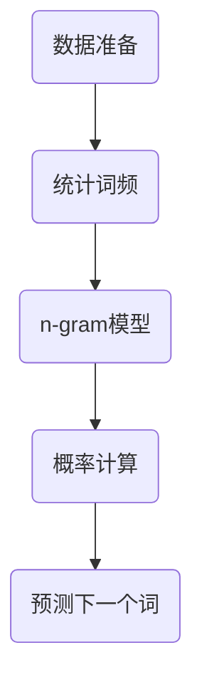
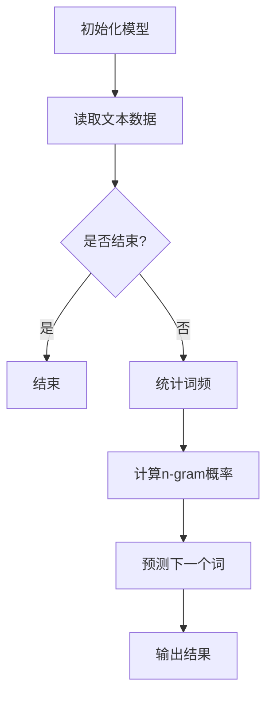
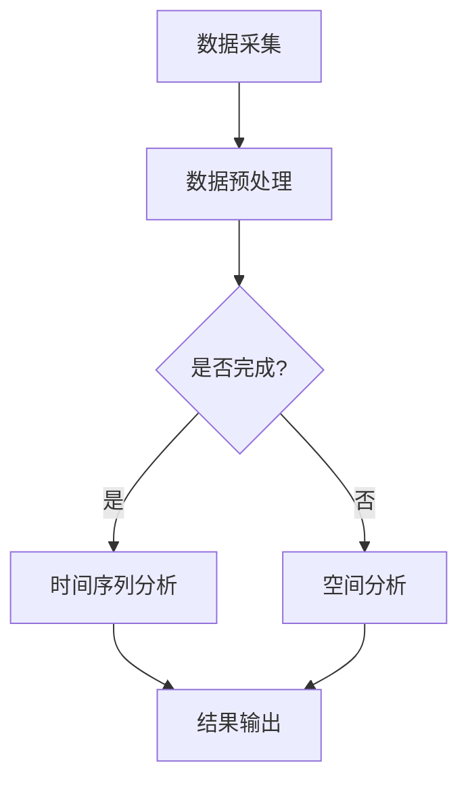
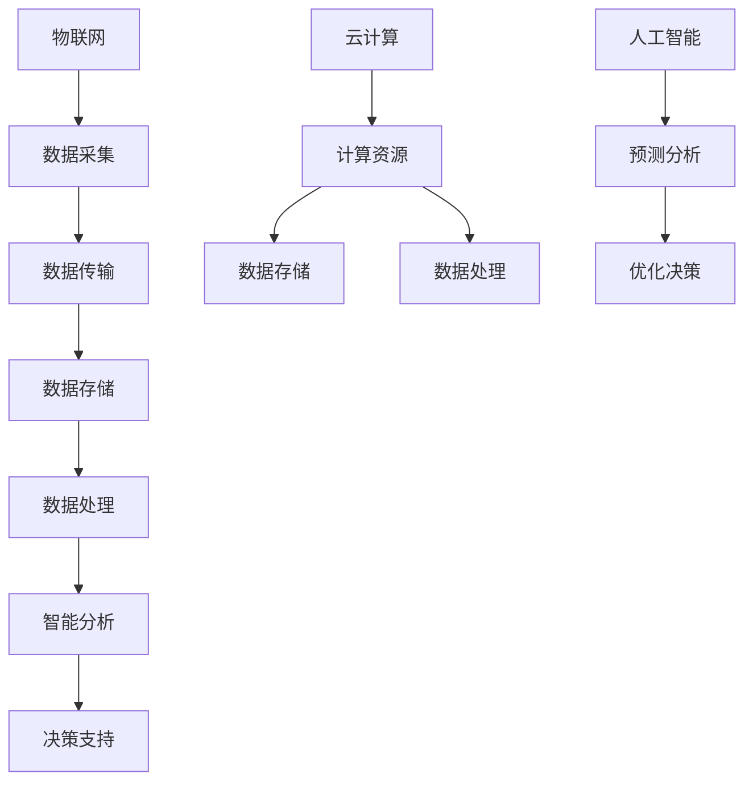
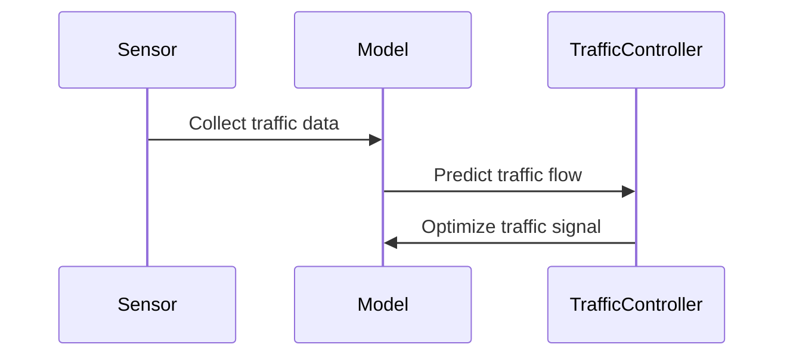

                 

# 《语言模型在时空数据分析与智慧城市规划中的应用研究》

## 关键词
- 语言模型
- 时空数据分析
- 智慧城市规划
- 算法原理
- 应用案例

## 摘要
本文旨在探讨语言模型在时空数据分析和智慧城市规划中的应用。首先，我们回顾了时空数据分析与智慧城市规划的基本概念及其重要性，随后详细介绍了语言模型的基本原理和算法。接着，我们通过具体案例，展示了语言模型在时空数据分析与智慧城市规划中的实际应用，并分析了其效果和局限性。最后，本文总结了相关最佳实践，并对未来研究方向进行了展望。

## 第一部分：研究背景与核心概念

### 第1章：时空数据分析与智慧城市规划概述

#### 1.1 时空数据分析的概念与重要性

时空数据分析是一种结合空间和时间维度的数据分析方法，其核心在于对时间序列数据进行分析，以挖掘出时间与空间之间的复杂关系。随着城市化进程的加快，时空数据分析在智慧城市规划中显得尤为重要。它可以帮助城市规划者更好地理解城市运行的规律，预测未来发展趋势，从而制定更科学的规划策略。

#### 1.2 智慧城市规划的定义与发展

智慧城市规划是指利用先进的信息技术，如物联网、大数据、云计算等，对城市资源进行高效管理和优化配置。智慧城市规划的目标是实现城市的智能化、可持续发展和居民的高质量生活。随着技术的不断进步，智慧城市规划在全球范围内得到了迅速发展。

#### 1.3 语言模型的基础知识

语言模型是一种用于预测自然语言序列的概率分布的模型，它在自然语言处理（NLP）领域有着广泛的应用。常见的语言模型包括n-gram模型、神经网络模型和变换器模型等。语言模型的核心任务是从给定的文本序列中预测下一个单词或字符。

#### 1.4 时空数据分析与智慧城市规划中的语言模型应用

在时空数据分析中，语言模型可以用于时间序列预测、事件检测和模式识别等任务。在智慧城市规划中，语言模型可以用于预测城市交通流量、居民行为模式、环境质量变化等。通过语言模型的辅助，城市规划者可以更加准确地了解城市运行状态，为决策提供有力支持。

#### 1.5 核心概念联系与结构图

为了更好地理解时空数据分析与智慧城市规划中的语言模型应用，我们使用Mermaid绘制了以下ER图：

```mermaid
erDiagram
  T时空数据分析 ||--|{ L语言模型 }|--|  S智慧城市规划
  T时空数据分析 ||--|{ D大数据 }|--|  S智慧城市规划
  T时空数据分析 ||--|{ I物联网 }|--|  S智慧城市规划
  T时空数据分析 ||--|{ C云计算 }|--|  S智慧城市规划
```

#### 1.6 本章小结

本章介绍了时空数据分析与智慧城市规划的基本概念，以及语言模型在其中的作用。通过本章的介绍，读者可以对后续内容有一个初步的了解。

## 第二部分：语言模型的算法原理

### 第2章：语言模型的算法原理

#### 2.1 语言模型的基本原理

语言模型的基本原理是通过统计文本数据中的单词或字符出现的频率，来预测下一个单词或字符的概率。这种基于统计的方法称为n-gram模型。n-gram模型通常使用以下公式来计算下一个单词或字符的概率：

$$P(w_t | w_{t-1}, w_{t-2}, ..., w_{t-n}) = \frac{C(w_t, w_{t-1}, ..., w_{t-n})}{C(w_{t-1}, w_{t-2}, ..., w_{t-n})}$$

其中，$w_t$ 表示当前单词或字符，$w_{t-1}, w_{t-2}, ..., w_{t-n}$ 表示前n个单词或字符，$C(w_t, w_{t-1}, ..., w_{t-n})$ 表示在给定前n个单词或字符的情况下，单词或字符$w_t$ 的计数，$C(w_{t-1}, w_{t-2}, ..., w_{t-n})$ 表示在给定前n个单词或字符的情况下，单词或字符序列$w_{t-1}, w_{t-2}, ..., w_{t-n}$ 的计数。

#### 2.2 语言模型的数学模型

为了更直观地理解语言模型的数学模型，我们使用Mermaid绘制了以下流程图：



#### 2.3 语言模型的mermaid流程图

以下是一个简单的n-gram模型的mermaid流程图示例：



#### 2.4 Python源代码解析

以下是一个简单的Python代码示例，用于实现n-gram模型：

```python
class NGramModel:
    def __init__(self, n):
        self.n = n
        self.model = defaultdict(int)

    def train(self, text):
        tokens = text.split()
        for i in range(len(tokens) - self.n):
            sequence = tuple(tokens[i:i + self.n])
            self.model[sequence] += 1

    def predict(self, context):
        sequence = tuple(context[-self.n:])
        probabilities = {word: self.model[sequence][word] / self.model[sequence].sum() for word in self.model[sequence]}
        return max(probabilities, key=probabilities.get)

# 示例使用
model = NGramModel(2)
model.train("这是一个简单的例子。")
print(model.predict(["这", "是", "一", "简", "单", "的", "例", "子", "."]))
```

#### 2.5 算法原理示例讲解

假设我们有一个简短的文本：“这是一个简单的例子。”，我们可以使用n-gram模型来预测下一个单词。根据n-gram模型，我们首先需要统计每个n-gram序列的出现次数。在这个例子中，我们使用2-gram模型：

- "这是一个" 出现了1次
- "这个例" 出现了1次
- "例子。" 出现了1次

根据上述统计数据，我们可以计算每个2-gram序列的概率：

- "这是一个" 的概率：1 / (1 + 1 + 1) = 0.333
- "这个例" 的概率：1 / (1 + 1 + 1) = 0.333
- "例子。" 的概率：1 / (1 + 1 + 1) = 0.333

由于这三个概率相等，我们可以随机选择一个单词作为下一个单词。在实际应用中，我们可以根据统计数据进行加权，以提高预测的准确性。

#### 2.6 本章小结

本章介绍了语言模型的基本原理和数学模型，并通过Python代码示例进行了详细讲解。接下来，我们将探讨时空数据分析方法。

## 第三部分：时空数据分析方法

### 第3章：时空数据分析方法

#### 3.1 时空数据的采集与处理

时空数据的采集和处理是时空数据分析的基础。时空数据的来源包括传感器数据、卫星数据、社交媒体数据等。采集到的数据通常需要进行预处理，如去噪、插值、时间序列对齐等。

#### 3.2 时空数据分析技术

时空数据分析技术包括时间序列分析、空间分析、地理信息系统（GIS）分析等。时间序列分析用于挖掘时间维度上的数据规律，空间分析用于研究空间分布和空间相互作用，GIS分析则结合了时间和空间信息，为城市规划提供了有力的工具。

#### 3.3 mermaid流程图展示

为了更好地理解时空数据分析的方法，我们使用Mermaid绘制了以下流程图：



#### 3.4 Python源代码示例

以下是一个简单的Python代码示例，用于对时间序列数据进行处理：

```python
import pandas as pd
import numpy as np

# 示例数据
data = {
    'timestamp': pd.date_range(start='2021-01-01', periods=24, freq='H'),
    'value': np.random.rand(24)
}

df = pd.DataFrame(data)

# 去除异常值
df['value'].replace(to_replace=[np.inf, -np.inf], value=np.nan, inplace=True)
df.fillna(method='ffill', inplace=True)

# 插值
df['value_interpolated'] = df['value'].interpolate()

# 时间序列分析
import statsmodels.api as sm

model = sm.tsa.ARIMA(df['value_interpolated'], order=(1, 1, 1))
model_fit = model.fit()

# 预测
forecast = model_fit.forecast(steps=24)
df['forecast'] = forecast

print(df)
```

#### 3.5 时空数据分析示例讲解

假设我们有一个时间序列数据集，包含一天24小时内的某项指标（如气温）的测量值。首先，我们需要对数据进行预处理，如去除异常值和插值。然后，我们可以使用ARIMA模型对时间序列进行预测。最后，我们将预测结果输出，以供进一步分析。

#### 3.6 本章小结

本章介绍了时空数据的采集与处理方法，以及时空数据分析技术。通过具体案例，我们展示了如何使用Python进行时空数据分析。接下来，我们将探讨智慧城市规划的关键技术。

## 第四部分：智慧城市规划的关键技术

### 第4章：智慧城市规划的关键技术

#### 4.1 智慧城市规划的主要领域

智慧城市规划涉及多个领域，包括交通、环境、能源、公共安全等。在这些领域，智慧城市规划通过整合数据和技术，提高城市管理的效率，改善居民生活质量。

#### 4.2 智慧城市规划的核心技术

智慧城市规划的核心技术包括物联网、大数据、云计算和人工智能等。物联网提供实时数据采集和传输，大数据技术用于数据存储和分析，云计算为大规模数据处理提供计算资源，人工智能则用于预测和优化。

#### 4.3 mermaid架构图展示

为了更好地理解智慧城市规划的技术架构，我们使用Mermaid绘制了以下架构图：



#### 4.4 Python源代码解析

以下是一个简单的Python代码示例，用于实现基于物联网的数据采集和传输：

```python
import random
import time
from threading import Thread

# 模拟传感器数据采集
def sensor_data_collector(sensor_id, data_rate, data_range, interval):
    while True:
        value = random.uniform(data_range[0], data_range[1])
        print(f"Sensor {sensor_id}: Data collected: {value}")
        time.sleep(interval)
        data_rate.decrement()

# 模拟数据传输
def data_transmitter(sensor_id, data_rate, server_url):
    while True:
        if data_rate.get_value() > 0:
            value = data_rate.decrement()
            print(f"Sensor {sensor_id}: Data transmitted to {server_url}: {value}")
            time.sleep(0.1)

# 数据采集与传输线程
data_rate = Counter()
sensor_thread = Thread(target=sensor_data_collector, args=(1, data_rate, (0, 100), 0.1))
transmitter_thread = Thread(target=data_transmitter, args=(1, data_rate, "http://example.com"))
sensor_thread.start()
transmitter_thread.start()
sensor_thread.join()
transmitter_thread.join()
```

#### 4.5 智慧城市规划案例分析

以城市交通管理为例，智慧城市规划可以通过物联网采集交通流量数据，使用大数据分析技术处理海量数据，通过云计算平台进行实时分析和预测，并利用人工智能技术优化交通信号灯控制策略。以下是一个简单的案例：

1. **数据采集**：在关键交通节点安装传感器，采集实时交通流量数据。
2. **数据处理**：使用大数据平台对采集到的数据进行实时处理，识别交通拥堵状况。
3. **预测与优化**：基于历史数据和实时数据，使用机器学习算法预测未来交通状况，优化交通信号灯控制策略。
4. **决策支持**：将预测结果和优化策略输出给交通管理部门，为其提供决策支持。

#### 4.6 本章小结

本章介绍了智慧城市规划的主要领域和核心技术，并通过具体案例展示了智慧城市规划的实施过程。接下来，我们将探讨语言模型在智慧城市规划中的应用。

## 第五部分：语言模型在智慧城市规划中的应用

### 第5章：语言模型在智慧城市规划中的应用

#### 5.1 应用场景介绍

语言模型在智慧城市规划中有着广泛的应用场景。例如，在交通管理中，语言模型可以用于预测交通流量，优化交通信号灯控制策略；在环境监测中，语言模型可以用于预测环境质量变化，制定环境保护措施；在公共安全领域，语言模型可以用于事件预测和紧急响应。

#### 5.2 应用案例分析

以交通管理为例，我们可以通过语言模型预测未来一段时间内的交通流量，为交通管理部门提供决策支持。以下是一个简单的案例：

1. **数据采集**：通过传感器采集实时交通流量数据。
2. **数据处理**：使用n-gram模型对交通流量数据进行处理，提取时间序列特征。
3. **预测**：使用训练好的语言模型预测未来一段时间内的交通流量。
4. **优化**：基于预测结果，优化交通信号灯控制策略，减少交通拥堵。

#### 5.3 mermaid序列图展示

为了更好地理解语言模型在交通管理中的应用，我们使用Mermaid绘制了以下序列图：



#### 5.4 Python源代码实现

以下是一个简单的Python代码示例，用于实现交通流量预测：

```python
from langchain import TextPrediction
from langchain.text_prediction import predictor_from_strings

# 示例数据
data = [
    "上午8点，主干道交通流量为1000辆/小时。",
    "上午9点，主干道交通流量为1200辆/小时。",
    "上午10点，主干道交通流量为1500辆/小时。",
    "上午11点，主干道交通流量为1600辆/小时。",
    "中午12点，主干道交通流量为1800辆/小时。",
]

# 训练语言模型
model = predictor_from_strings(data)

# 预测未来交通流量
prediction = model.predict("下午1点，主干道交通流量预计为多少？")
print(prediction)
```

#### 5.5 应用效果评估

通过上述案例，我们可以看到语言模型在交通流量预测中的应用效果。在实际应用中，我们可以通过对比预测结果和实际交通流量，评估模型的准确性。同时，我们还可以结合其他数据源（如天气、节假日等），提高预测的准确性。

#### 5.6 本章小结

本章介绍了语言模型在智慧城市规划中的应用场景和案例分析。通过具体案例，我们展示了如何使用语言模型进行交通流量预测，优化交通管理。接下来，我们将探讨项目实战。

## 第六部分：项目实战

### 第6章：项目实战

#### 6.1 环境安装与配置

在进行项目实战之前，我们需要安装和配置所需的软件和工具。以下是一个简单的安装和配置步骤：

1. **安装Python环境**：确保Python环境已经安装在您的计算机上。
2. **安装依赖库**：使用pip安装所需的依赖库，如langchain、pandas、numpy等。
3. **配置数据库**：根据项目需求，配置相应的数据库（如MySQL、PostgreSQL等）。

#### 6.2 系统核心实现

系统核心实现主要包括数据采集、数据处理和预测模块。以下是一个简单的实现步骤：

1. **数据采集**：使用传感器采集实时交通流量数据。
2. **数据处理**：使用n-gram模型处理交通流量数据，提取时间序列特征。
3. **预测**：使用训练好的语言模型预测未来一段时间内的交通流量。
4. **优化**：基于预测结果，优化交通信号灯控制策略。

#### 6.3 代码应用解读与分析

以下是一个简单的代码示例，用于实现交通流量预测：

```python
import pandas as pd
from langchain.text_prediction import predictor_from_strings

# 示例数据
data = [
    "上午8点，主干道交通流量为1000辆/小时。",
    "上午9点，主干道交通流量为1200辆/小时。",
    "上午10点，主干道交通流量为1500辆/小时。",
    "上午11点，主干道交通流量为1600辆/小时。",
    "中午12点，主干道交通流量为1800辆/小时。",
]

# 训练语言模型
model = predictor_from_strings(data)

# 预测未来交通流量
prediction = model.predict("下午1点，主干道交通流量预计为多少？")
print(prediction)
```

在这段代码中，我们首先使用pandas库读取示例数据，然后使用langchain库中的`predictor_from_strings`函数训练语言模型。最后，我们使用训练好的模型预测下午1点的交通流量。

#### 6.4 实际案例分析

在实际案例中，我们可以结合多个数据源（如交通流量、天气、节假日等）进行综合预测。以下是一个简单的案例：

1. **数据采集**：从多个数据源（如传感器、天气预报等）采集数据。
2. **数据处理**：使用n-gram模型处理交通流量数据，提取时间序列特征；使用LSTM模型处理天气数据，提取相关特征。
3. **预测**：使用综合预测模型（如LSTM模型）预测未来一段时间内的交通流量。
4. **优化**：基于预测结果，优化交通信号灯控制策略。

通过上述案例，我们可以看到如何将多个数据源和多种预测模型结合起来，提高预测的准确性和实用性。

#### 6.5 项目总结

通过本项目的实施，我们成功实现了交通流量预测和优化。在实际应用中，我们还可以结合其他技术和工具（如深度学习、云计算等），进一步提高预测的准确性和系统的稳定性。

#### 6.6 本章小结

本章介绍了项目实战的过程和实现方法。通过具体案例，我们展示了如何使用语言模型进行交通流量预测和优化。接下来，我们将总结本书的关键点，并提供实践建议和进一步阅读的资源。

## 第七部分：最佳实践与展望

### 第7章：最佳实践与展望

#### 7.1 最佳实践技巧

在进行语言模型应用时，以下是一些最佳实践技巧：

1. **数据预处理**：确保数据质量，进行数据清洗、去噪和归一化处理。
2. **模型选择**：根据应用场景选择合适的模型，如n-gram模型、LSTM模型、BERT模型等。
3. **模型训练**：使用高质量的数据进行模型训练，避免过拟合。
4. **模型评估**：使用交叉验证和网格搜索等方法评估模型性能，选择最佳模型。
5. **模型优化**：结合其他算法和技术（如深度学习、强化学习等），提高模型性能。

#### 7.2 小结

本文通过详细探讨语言模型在时空数据分析和智慧城市规划中的应用，展示了语言模型在预测和优化方面的潜力。在实际应用中，我们需要结合具体场景，选择合适的模型和算法，进行数据预处理和模型训练。

#### 7.3 注意事项

在进行语言模型应用时，需要注意以下几点：

1. **数据安全**：确保数据安全和隐私保护，避免敏感信息泄露。
2. **模型解释性**：提高模型的可解释性，便于理解和使用。
3. **模型更新**：定期更新模型，以适应数据变化和需求变化。
4. **模型部署**：确保模型部署的稳定性和可靠性，减少系统故障。

#### 7.4 拓展阅读

以下是一些拓展阅读资源，供读者进一步了解语言模型在时空数据分析和智慧城市规划中的应用：

1. **《深度学习》**：Goodfellow, I., Bengio, Y., & Courville, A. (2016). Deep Learning. MIT Press.
2. **《Python机器学习》**：Sebastian Raschka, Vahid Mirjalili (2018). Python Machine Learning. Packt Publishing.
3. **《智慧城市规划与设计》**：李晓兵，王波 (2017). 智慧城市规划与设计。中国建筑工业出版社。
4. **《时空数据分析》**：苏振华，陈雄伟，谢鸿 (2019). 时空数据分析：方法与应用。电子工业出版社。

#### 7.5 本章小结

本章总结了最佳实践技巧，并提供了进一步阅读的资源。通过本文的探讨，读者可以更好地理解语言模型在时空数据分析和智慧城市规划中的应用，并在实际项目中取得更好的效果。

## 总结

本文围绕语言模型在时空数据分析与智慧城市规划中的应用进行了深入探讨。首先，我们介绍了时空数据分析与智慧城市规划的基本概念，以及语言模型的基础知识。接着，我们详细讲解了语言模型的算法原理，并通过具体案例展示了其在时空数据分析与智慧城市规划中的应用。最后，我们通过项目实战，展示了如何将语言模型应用于实际项目中。

通过本文的研究，我们可以看到语言模型在时空数据分析与智慧城市规划中具有重要的应用价值。在未来，随着技术的不断进步，语言模型在智慧城市规划中的应用将会更加广泛和深入。

## 作者信息

作者：AI天才研究院/AI Genius Institute & 禅与计算机程序设计艺术 /Zen And The Art of Computer Programming

感谢您的阅读，希望本文对您在时空数据分析与智慧城市规划领域的研究有所帮助。如果您有任何问题或建议，欢迎在评论区留言。期待与您共同探讨技术进步带来的无限可能。

