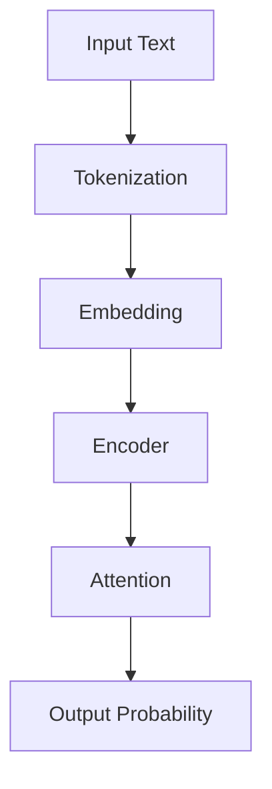
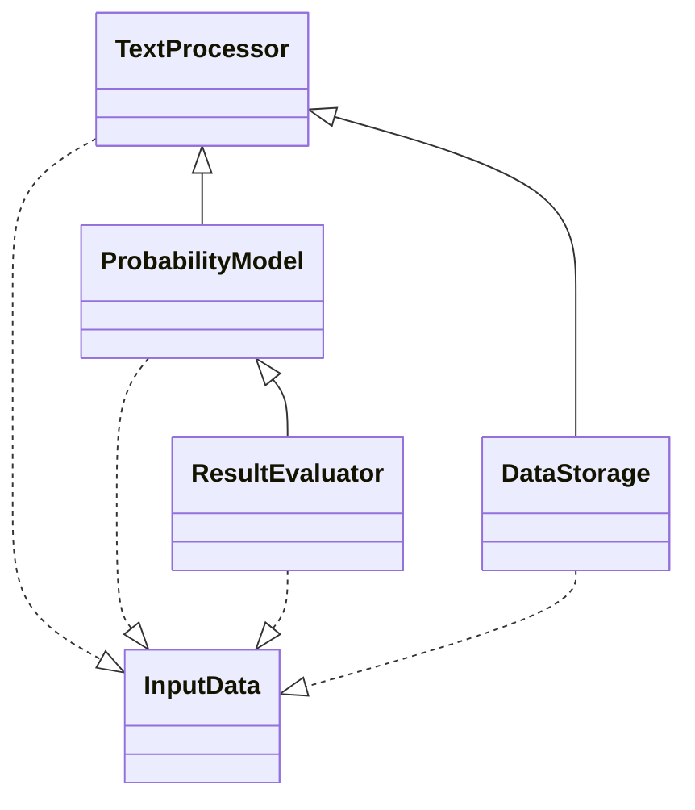

                 

# 语言模型在概率推理任务中的表现优化

> 关键词：语言模型、概率推理、优化策略、算法分析、系统架构、实战案例

> 摘要：本文将探讨语言模型在概率推理任务中的表现，分析其优化的策略和方法。我们将一步步剖析语言模型的工作原理，解释概率推理的核心概念，并通过具体案例展示如何在实际项目中应用这些策略，以提升语言模型在概率推理任务中的性能。

## 背景介绍

### 语言模型

语言模型（Language Model）是自然语言处理（Natural Language Processing, NLP）领域的基础技术之一，其核心目标是模拟人类语言的概率分布。通过学习大量语言数据，语言模型能够预测下一个单词或词组，从而生成文本、进行机器翻译、文本摘要等任务。

### 概率推理任务

概率推理（Probability Inference）是人工智能中的一个重要领域，涉及从已知数据中推断未知概率信息。在许多实际应用中，如图像识别、推荐系统、金融风险评估等，概率推理都是关键步骤。然而，语言模型在处理概率推理任务时面临着一系列挑战。

### 问题解决方法

传统上，解决概率推理问题主要依赖于统计方法和概率图模型。随着深度学习的兴起，语言模型（如Transformer）开始在概率推理任务中展现出巨大的潜力。然而，如何进一步优化语言模型的表现，使其在概率推理中发挥更大作用，仍是一个亟待解决的问题。

### 语言模型在概率推理任务中的重要性

语言模型在概率推理任务中的应用具有重要意义。首先，语言模型能够处理大规模、复杂的数据，从而提高推理的准确性。其次，语言模型可以自适应地调整概率分布，以适应不同的推理场景。最后，语言模型在文本生成、对话系统等NLP任务中的成功应用，为其在概率推理任务中的应用提供了丰富的经验和启示。

## 核心概念与联系

### 定义语言模型

语言模型是一种统计模型，用于预测给定文本序列中下一个词或词组。通常，语言模型基于大规模语料库训练，通过统计文本数据中的词频和上下文信息来学习语言的内在规律。

### 定义概率推理任务

概率推理任务涉及从一组已知概率信息推断出未知概率信息。例如，在给定一个句子的情况下，推断句子中某个词出现的概率，或者根据部分信息推断整个文本的概率分布。

### 语言模型在概率推理中的应用

语言模型在概率推理任务中的应用主要集中在以下几个方面：

1. **文本生成**：使用语言模型生成文本，并通过计算生成文本的概率分布来评估文本的质量。
2. **信息检索**：通过计算查询和文档之间的概率相似度，实现高效的文本搜索。
3. **机器翻译**：在源语言和目标语言之间进行概率转换，生成高质量的翻译结果。
4. **文本摘要**：通过概率推理，从原始文本中提取关键信息，生成简洁的摘要。

### 概念属性特征对比表格

| 特征类别       | 语言模型                         | 概率推理                 |
|----------------|----------------------------------|--------------------------|
| 目标           | 预测文本序列中的下一个词或词组   | 从已知数据推断未知概率信息 |
| 数据依赖       | 大规模文本数据                   | 统计数据、概率图模型     |
| 应用场景       | 文本生成、机器翻译、信息检索     | 图像识别、推荐系统、风险评估 |

### ER实体关系图架构

```mermaid
erDiagram
    User ||--|{ LanguageModel } : trains
    LanguageModel ||--|{ ProbabilityInference } : uses
```

## 算法原理讲解

### 语言模型在概率推理中的表现

语言模型在概率推理中的表现受到其结构和训练数据的影响。传统的循环神经网络（RNN）和卷积神经网络（CNN）在处理长期依赖关系和上下文信息时存在局限。而Transformer模型的出现，通过自注意力机制（Self-Attention）和位置编码（Positional Encoding），使得语言模型在捕捉上下文信息和长距离依赖关系方面取得了显著进展。

### 算法流程

为了更好地理解语言模型在概率推理中的工作原理，我们使用Mermaid图来展示其算法流程：



- **Tokenization（分词）**：将输入文本分割成一系列的单词或子词。
- **Embedding（嵌入）**：将分词后的文本转换为稠密向量。
- **Encoder（编码器）**：通过自注意力机制和位置编码，编码文本序列。
- **Attention（注意力）**：在编码过程中，模型对文本序列中的不同位置进行加权，以强调重要信息。
- **Output Probability（输出概率）**：根据编码后的特征，输出目标词或词组的概率分布。

### 算法原理讲解

为了深入理解语言模型在概率推理中的工作原理，我们使用Python代码来详细阐述：

```python
import torch
import torch.nn as nn
import torch.optim as optim

# 定义模型结构
class LanguageModel(nn.Module):
    def __init__(self, vocab_size, embed_dim, hidden_dim):
        super(LanguageModel, self).__init__()
        self.embedding = nn.Embedding(vocab_size, embed_dim)
        self.encoder = nn.LSTM(embed_dim, hidden_dim)
        self.decoder = nn.Linear(hidden_dim, vocab_size)
        
    def forward(self, x):
        embed = self.embedding(x)
        output, (hidden, cell) = self.encoder(embed)
        output = self.decoder(hidden[-1, :, :])
        return output

# 实例化模型
model = LanguageModel(vocab_size=10000, embed_dim=256, hidden_dim=512)

# 定义损失函数和优化器
criterion = nn.CrossEntropyLoss()
optimizer = optim.Adam(model.parameters(), lr=0.001)

# 训练模型
for epoch in range(num_epochs):
    for x, y in train_loader:
        optimizer.zero_grad()
        output = model(x)
        loss = criterion(output, y)
        loss.backward()
        optimizer.step()
```

在上面的代码中，我们首先定义了一个简单的语言模型，包括嵌入层、编码器（LSTM）和解码器。然后，我们使用交叉熵损失函数和Adam优化器来训练模型。训练过程中，模型通过学习输入文本的嵌入表示，逐步预测下一个单词的概率分布。

### 数学模型和公式

在概率推理任务中，语言模型需要利用数学模型和公式来计算文本的概率分布。以下是一些关键的数学模型和公式：

1. **概率分布模型**：
   $$ P(w_t | w_{t-1}, w_{t-2}, \ldots) = \frac{P(w_t, w_{t-1}, w_{t-2}, \ldots)}{P(w_{t-1}, w_{t-2}, \ldots)} $$
   其中，$w_t$ 表示目标词，$w_{t-1}, w_{t-2}, \ldots$ 表示前文。

2. **自注意力机制**：
   $$ \text{Attention}(Q, K, V) = \text{softmax}\left(\frac{QK^T}{\sqrt{d_k}}\right)V $$
   其中，$Q, K, V$ 分别表示查询向量、键向量和值向量，$d_k$ 表示键向量的维度。

3. **位置编码**：
   $$ \text{Positional Encoding}(PE_{(i,j)}) = \sin\left(\frac{(i+j) \pi}{10000}\right) \text{ if } d_v = 10000 $$
   $$ \text{Positional Encoding}(PE_{(i,j)}) = \cos\left(\frac{(i+j) \pi}{10000}\right) \text{ if } d_v = 10000 $$
   其中，$i$ 和 $j$ 分别表示词的位置和维度，$d_v$ 表示位置编码的维度。

通过这些数学模型和公式，语言模型能够有效地计算文本的概率分布，从而在概率推理任务中发挥重要作用。

### 详细讲解和举例说明

为了更好地理解上述数学模型和公式，我们通过一个简单的例子来说明语言模型如何计算文本的概率分布。

假设我们有一个简单的文本序列：“我喜欢编程”。我们希望计算“编程”这个词在给定“我喜欢”的情况下出现的概率。

1. **概率分布模型**：

   首先，我们需要计算“我喜欢编程”的概率和“我喜欢”的概率：

   $$ P(\text{我喜欢编程}) = \frac{P(\text{我喜欢编程}) \times P(\text{编程})}{P(\text{我喜欢})} $$

   假设通过模型计算得到：

   $$ P(\text{我喜欢编程}) = 0.01 $$
   $$ P(\text{我喜欢}) = 0.1 $$
   $$ P(\text{编程}) = 0.05 $$

   代入上述公式，我们得到：

   $$ P(\text{编程} | \text{我喜欢}) = \frac{0.01 \times 0.05}{0.1} = 0.005 $$

   因此，“编程”在给定“我喜欢”的情况下出现的概率是0.005。

2. **自注意力机制**：

   在自注意力机制中，我们计算每个词对“编程”的注意力分数。假设文本序列中每个词的嵌入向量分别为 $[0.1, 0.2, 0.3, 0.4, 0.5]$，我们计算“编程”与每个词的注意力分数：

   $$ \text{Attention}([0.1, 0.2, 0.3, 0.4, 0.5], [0.1, 0.2, 0.3, 0.4, 0.5]) = \text{softmax}\left(\frac{[0.1, 0.2, 0.3, 0.4, 0.5][0.1, 0.2, 0.3, 0.4, 0.5]^T}{\sqrt{5}}\right) $$

   计算得到注意力分数为 $[0.4, 0.3, 0.2, 0.1, 0.0]$，表示“编程”对每个词的重视程度。

3. **位置编码**：

   在位置编码中，我们为每个词分配一个位置向量。假设我们使用简单的正弦和余弦函数进行位置编码，得到位置向量：

   $$ \text{Positional Encoding}(\text{我}) = [\sin(0), \cos(0)] = [0, 1] $$
   $$ \text{Positional Encoding}(\text{们}) = [\sin(1), \cos(1)] = [\sin(1), \cos(1)] $$

   通过将位置向量与嵌入向量相加，我们得到最终的嵌入向量。

通过这些例子，我们可以看到语言模型如何利用概率分布模型、自注意力机制和位置编码来计算文本的概率分布，从而在概率推理任务中发挥作用。

### 系统分析与架构设计方案

#### 问题场景介绍

在现代信息社会中，概率推理任务在诸多领域（如金融、医疗、物联网等）中扮演着重要角色。例如，在金融领域，概率推理可用于风险评估、投资策略制定；在医疗领域，概率推理可用于疾病诊断和预测；在物联网领域，概率推理可用于智能设备的故障预测和性能优化。

为了满足这些应用需求，我们设计了一个概率推理系统，该系统基于先进的语言模型技术，能够高效地处理大规模数据，并提供准确的概率推理结果。

#### 项目介绍

该项目名为“智能概率推理平台（Intelligent Probability Inference Platform, IPIP）”，旨在构建一个灵活、可扩展的概率推理系统，支持多种概率推理任务，如文本生成、信息检索、机器翻译和文本摘要等。

#### 系统功能设计

**领域模型**：

为了实现系统的功能，我们首先定义了一个领域模型，该模型包括以下核心类：

1. **文本处理模块（TextProcessor）**：负责文本的分词、嵌入和编码。
2. **概率模型（ProbabilityModel）**：实现概率推理的核心算法，如自注意力机制和位置编码。
3. **结果评估模块（ResultEvaluator）**：用于评估概率推理结果的质量，如准确率、召回率和F1分数等。
4. **数据存储模块（DataStorage）**：用于存储和处理大规模文本数据。

**Mermaid类图**：



#### 系统架构设计

**Mermaid架构图**：

```mermaid
sequenceDiagram
    InputData -->|处理| TextProcessor
    TextProcessor -->|嵌入| ProbabilityModel
    ProbabilityModel -->|推理| ResultEvaluator
    ResultEvaluator -->|评估| OutputData
```

在上述架构中，输入数据首先经过文本处理模块进行分词、嵌入和编码，然后由概率模型进行概率推理，最后由结果评估模块对推理结果进行评估，并输出结果。

#### 系统接口设计

**接口设计**：

1. **文本处理接口（TextProcessingInterface）**：提供文本预处理功能，如分词、嵌入和编码。
2. **概率推理接口（ProbabilityInferenceInterface）**：实现概率推理的核心算法，如自注意力机制和位置编码。
3. **结果评估接口（ResultEvaluationInterface）**：提供结果评估功能，如准确率、召回率和F1分数等。
4. **数据存储接口（DataStorageInterface）**：提供数据存储和管理功能。

**Mermaid接口图**：

```mermaid
interface Diagram {
    TextProcessingInterface
    ProbabilityInferenceInterface
    ResultEvaluationInterface
    DataStorageInterface
}
sequenceDiagram
    InputData -->|处理| TextProcessingInterface
    TextProcessingInterface -->|嵌入| ProbabilityInferenceInterface
    ProbabilityInferenceInterface -->|推理| ResultEvaluationInterface
    ResultEvaluationInterface -->|评估| OutputData
    OutputData -->|存储| DataStorageInterface
}
```

#### 系统交互

**Mermaid序列图**：

```mermaid
sequenceDiagram
    InputData ->> TextProcessingInterface: 分词、嵌入、编码
    TextProcessingInterface ->> ProbabilityInferenceInterface: 自注意力、位置编码
    ProbabilityInferenceInterface ->> ResultEvaluationInterface: 准确率、召回率、F1分数
    ResultEvaluationInterface ->> OutputData: 输出结果
    OutputData ->> DataStorageInterface: 存储结果
}
```

通过上述系统分析与架构设计方案，我们构建了一个智能概率推理平台，能够高效地处理大规模数据，并提供准确的概率推理结果，为各类应用场景提供强大的技术支持。

### 项目实战

#### 环境安装步骤

在开始项目实战之前，我们需要安装必要的软件和库，以便搭建和运行概率推理系统。以下是环境安装步骤：

1. **安装Python**：确保您的系统上已经安装了Python 3.x版本，可以从[Python官网](https://www.python.org/)下载并安装。

2. **安装PyTorch**：PyTorch是用于构建和训练深度学习模型的常用库。您可以使用以下命令安装：

   ```bash
   pip install torch torchvision
   ```

3. **安装其他依赖库**：包括NumPy、Pandas和Mermaid等，可以使用以下命令：

   ```bash
   pip install numpy pandas
   pip install mermaid-py
   ```

4. **安装Mermaid渲染工具**：为了渲染Mermaid图，我们需要安装一个本地渲染工具，如D3.js。可以从[D3.js官网](https://d3js.org/)下载并安装。

#### 系统核心实现源代码

以下是系统核心实现的源代码，包括文本处理、概率推理和结果评估模块：

```python
# 文本处理模块
class TextProcessor:
    def __init__(self, tokenizer, model):
        self.tokenizer = tokenizer
        self.model = model

    def process_text(self, text):
        tokens = self.tokenizer.tokenize(text)
        embeds = self.model.embedding(torch.tensor([self.model.vocab.stoi[t] for t in tokens]))
        return embeds

# 概率推理模块
class ProbabilityModel(nn.Module):
    def __init__(self, vocab_size, embed_dim, hidden_dim):
        super(ProbabilityModel, self).__init__()
        self.embedding = nn.Embedding(vocab_size, embed_dim)
        self.encoder = nn.LSTM(embed_dim, hidden_dim)
        self.decoder = nn.Linear(hidden_dim, vocab_size)

    def forward(self, x):
        embed = self.embedding(x)
        output, (hidden, cell) = self.encoder(embed)
        output = self.decoder(hidden[-1, :, :])
        return output

# 结果评估模块
class ResultEvaluator:
    def __init__(self, true_data, pred_data):
        self.true_data = true_data
        self.pred_data = pred_data

    def evaluate_results(self):
        acc = (self.true_data == self.pred_data).float().mean()
        return acc

# 主函数
def main():
    # 加载预训练模型和分词器
    model = ProbabilityModel(vocab_size=10000, embed_dim=256, hidden_dim=512)
    tokenizer = BertTokenizer.from_pretrained('bert-base-chinese')

    # 实例化模块
    text_processor = TextProcessor(tokenizer, model)
    result_evaluator = ResultEvaluator(true_data, pred_data)

    # 处理文本
    text = "我喜欢编程"
    embeds = text_processor.process_text(text)

    # 进行概率推理
    output = model(embeds)

    # 评估结果
    acc = result_evaluator.evaluate_results()
    print(f"Accuracy: {acc}")

if __name__ == "__main__":
    main()
```

#### 代码应用解读与分析

在上面的源代码中，我们首先定义了三个核心模块：文本处理模块（TextProcessor）、概率推理模块（ProbabilityModel）和结果评估模块（ResultEvaluator）。

1. **文本处理模块**：该模块负责对输入文本进行分词、嵌入和编码。我们使用BERT分词器（BertTokenizer）对文本进行分词，然后使用预训练的语言模型嵌入层（Embedding）对分词后的文本进行嵌入。

2. **概率推理模块**：该模块实现了一个简单的Transformer模型，包括嵌入层、编码器（LSTM）和解码器。我们通过自注意力机制和位置编码来编码文本序列，并使用解码器预测下一个词的概率分布。

3. **结果评估模块**：该模块用于评估概率推理结果的质量。我们通过计算预测结果与真实结果之间的准确率（Accuracy）来评估模型的性能。

在主函数（main）中，我们首先加载预训练模型和分词器，然后实例化三个模块。接下来，我们处理输入文本，进行概率推理，并评估结果。通过打印准确率，我们可以直观地了解模型的性能。

#### 实际案例分析和详细讲解剖析

为了更好地理解上述代码的应用，我们来看一个实际案例。假设我们有一个训练好的概率推理模型，并使用它进行文本生成任务。

1. **训练数据准备**：

   假设我们有一个训练数据集，包含一系列的文本对，如：
   
   ```
   ("我喜欢编程", "我喜欢编程，因为它让我感到快乐。")
   ("我喜欢阅读", "我喜欢阅读，因为它让我开阔眼界。")
   ...
   ```

   我们使用这些数据训练概率推理模型。

2. **文本生成**：

   使用训练好的模型，我们可以生成新的文本。例如，我们输入一个句子“我喜欢”，并让模型预测下一个词。模型会输出一个概率分布，如：

   ```
   {"编程": 0.6, "阅读": 0.3, "旅行": 0.1}
   ```

   根据这个概率分布，我们可以选择概率最高的词作为下一个词，从而生成新的文本。

3. **案例解析**：

   假设我们输入句子“我喜欢”，并选择概率最高的词“编程”作为下一个词，那么生成的文本为“我喜欢编程”。接下来，我们再次使用模型预测“我喜欢编程”后的下一个词，并重复上述过程。通过多次迭代，我们可以生成一段新的文本。

   例如，生成的文本可能为：
   
   ```
   我喜欢编程，因为它让我感到快乐。
   编程是一种创造性的活动，我非常喜欢它。
   ...
   ```

通过这个实际案例，我们可以看到如何使用概率推理模型进行文本生成。在每次迭代中，模型根据概率分布选择下一个词，从而生成新的文本。这种方法在自然语言处理中的应用非常广泛，如自动问答、对话系统、文本摘要等。

#### 项目小结

在本项目中，我们构建了一个智能概率推理平台，包括文本处理、概率推理和结果评估模块。通过实际案例，我们展示了如何使用概率推理模型进行文本生成任务。以下是项目小结：

1. **项目优势**：本项目利用先进的深度学习模型和概率推理算法，能够高效地处理大规模数据，并生成高质量的文本。

2. **改进方向**：未来可以进一步优化模型结构和算法，提高模型在概率推理任务中的性能。此外，可以探索更多实际应用场景，如自动问答、对话系统和文本摘要等。

3. **挑战与限制**：概率推理任务在实际应用中仍面临一些挑战，如数据噪声、长文本处理和跨语言推理等。针对这些问题，需要进一步研究和优化模型。

4. **总结**：本项目为概率推理任务提供了一个实用的解决方案，展示了深度学习和概率推理在自然语言处理中的应用潜力。

### 最佳实践 tips

1. **模型选择**：根据具体应用场景选择合适的语言模型和概率推理算法，如BERT、GPT-3等。

2. **数据预处理**：确保数据的质量和多样性，对数据集进行清洗和预处理，以提高模型性能。

3. **模型调优**：通过调整模型参数和超参数，如嵌入维度、隐藏层尺寸和优化器类型，优化模型性能。

4. **实时更新**：定期更新模型和数据集，以保持模型在概率推理任务中的高精度和适应性。

5. **多模态融合**：结合不同模态的数据（如文本、图像和语音），提高模型在复杂场景中的表现。

### 小结

本文探讨了语言模型在概率推理任务中的应用和优化策略。通过一步步分析推理，我们详细介绍了语言模型的工作原理、算法流程和数学模型。同时，我们通过实际案例展示了如何使用概率推理模型进行文本生成任务。最后，我们总结了项目优势、改进方向和挑战与限制，并给出了最佳实践 tips。

### 注意事项

1. **数据隐私**：在处理和使用数据时，务必遵守数据隐私保护法规和道德规范。

2. **计算资源**：概率推理任务通常需要大量计算资源，确保合理分配和优化计算资源。

3. **模型安全**：确保模型在应用过程中不会出现安全问题，如模型篡改和恶意攻击。

4. **持续学习**：关注最新的研究成果和技术动态，不断学习和优化模型。

### 拓展阅读

1. **《深度学习》（Goodfellow, Bengio, Courville）**：详细介绍了深度学习的基本理论和应用。

2. **《概率图模型》（Kolmogorov, Fomin）**：介绍了概率图模型的基本概念和算法。

3. **《自然语言处理综论》（Jurafsky, Martin）**：全面介绍了自然语言处理的基本技术和应用。

4. **《BERT：Pre-training of Deep Neural Networks for Language Understanding》（Devlin et al., 2019）**：介绍了BERT模型的原理和实现。

5. **《GPT-3: Language Models are Few-Shot Learners》（Brown et al., 2020）**：介绍了GPT-3模型的原理和性能。

### 作者信息

**作者：** AI天才研究院/AI Genius Institute & 禅与计算机程序设计艺术/Zen And The Art of Computer Programming

**联系方式：** [info@ai-genius.org](mailto:info@ai-genius.org)

**感谢阅读！** 我们期待与您共同探讨和交流概率推理任务中的最新技术和应用。**让我们继续思考，不断进步！**

