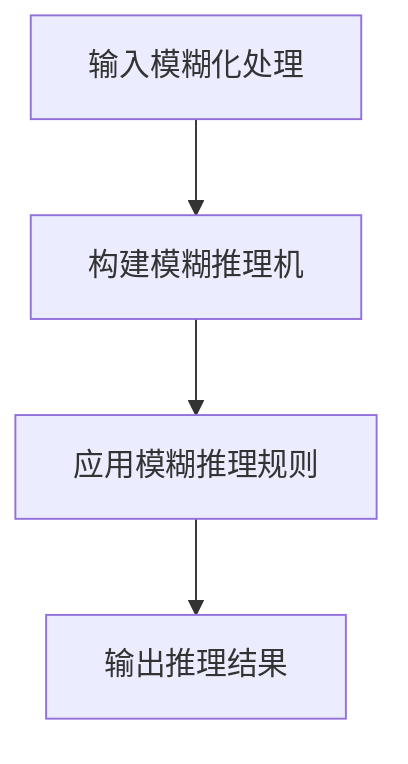
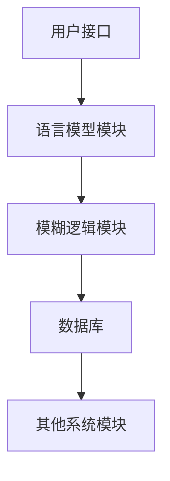
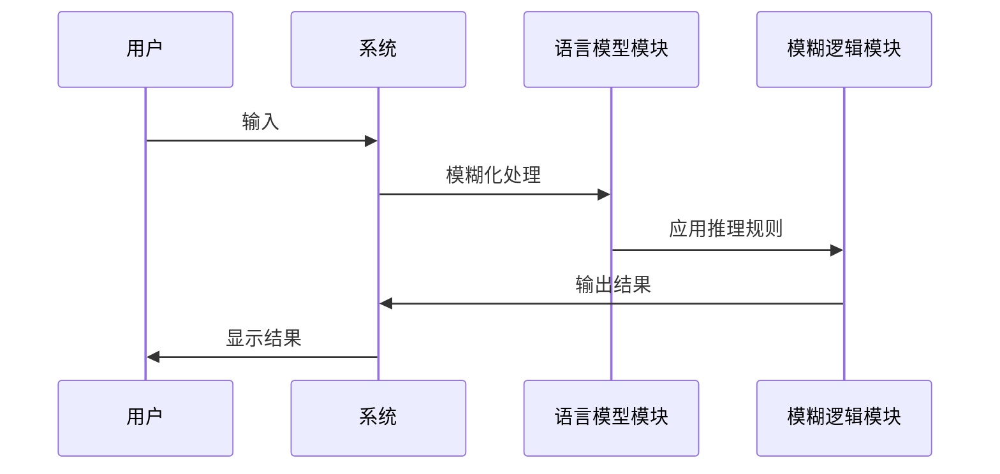

                 

### 第一部分: 背景与概念

#### 第1章: 语言模型与模糊逻辑概述

##### 1.1 语言模型基本概念

**语言模型（Language Model，LM）** 是一种用于自然语言处理的概率模型，旨在预测一个单词序列中下一个单词的概率。语言模型的核心任务是学习输入文本的概率分布，从而能够对未知文本进行生成、翻译或摘要。

**语言模型的定义与发展：**

- **定义：** 语言模型是自然语言处理（NLP）中的一种统计模型，它通过分析大量文本数据，学习语言的统计特性，以预测文本的下一个单词或词组。
- **发展历程：** 从最初的N-gram模型，到基于神经网络的深度学习模型，如循环神经网络（RNN）、长短期记忆网络（LSTM）和Transformer模型，语言模型经历了显著的发展。

**语言模型的类型与特点：**

- **N-gram模型：** 基于前N个单词的概率分布进行预测，N通常较小（如2或3）。优点是简单易实现，但缺点是存在长依赖问题。
- **神经网络模型：** 如RNN、LSTM和Transformer等，可以捕捉更复杂的语言结构和长依赖关系。优点是性能优异，但计算复杂度高。

##### 1.2 模糊逻辑的基本原理

**模糊逻辑（Fuzzy Logic）** 是一种处理不确定性和模糊性的数学方法，它通过引入模糊集合和模糊推理来模拟人类思维和决策过程。

**模糊逻辑的概念：**

- **模糊集合：** 是一种用于表示模糊概念的数学结构，它通过隶属度函数来描述元素属于集合的程度。
- **模糊推理：** 是基于模糊集合和模糊规则进行推理的过程，它通过模糊推理机实现。

**模糊逻辑的应用领域：**

- **控制工程：** 在非线性系统的建模和控制中应用广泛。
- **人工智能：** 在决策支持系统、专家系统和自然语言处理等领域有重要应用。
- **数据挖掘：** 在分类、聚类和关联规则挖掘中用于处理不确定数据。

##### 1.3 语言模型与模糊逻辑的联系

**联系背景：**

语言模型和模糊逻辑在处理不确定性和模糊性方面有共同的需求，因此它们之间存在一定的联系。

**联系机制：**

- **模糊化处理：** 语言模型可以通过模糊化处理将模糊概念转化为可处理的数学模型。
- **模糊推理：** 语言模型中的概率分布可以用于模糊推理，从而实现不确定信息的处理。

### 第2章: 语言模型在模糊逻辑推理中的核心概念

##### 2.1 语言模型的模糊化处理

**模糊集合理论：**

- **隶属度函数：** 描述元素属于模糊集合的程度。
- **模糊集合运算：** 包括模糊集合的交集、并集和补集等。

**语言模型的模糊化方法：**

- **模糊化词向量：** 将语言模型中的词向量转化为模糊集合，从而实现模糊化处理。

##### 2.2 模糊逻辑推理的框架

**模糊推理机：**

- **输入变量：** 模糊集合。
- **规则库：** 描述模糊规则的集合。
- **推理过程：** 基于模糊规则进行推理，得到输出模糊集合。

**模糊推理规则：**

- **条件规则：** 描述输入变量与输出变量之间的关系。
- **结论规则：** 描述推理结果。

##### 2.3 语言模型与模糊逻辑推理的融合

**融合方法与策略：**

- **混合模型：** 将语言模型和模糊逻辑推理相结合，形成混合模型。
- **协同学习：** 通过协同学习优化语言模型和模糊逻辑推理模型的性能。

**融合的优势与挑战：**

- **优势：** 能够更好地处理不确定性和模糊性，提高推理准确性和鲁棒性。
- **挑战：** 需要解决模型融合中的参数调整和优化问题。

### 第3章: 算法原理与数学模型

##### 3.1 语言模型在模糊逻辑推理中的应用算法

**算法概述：**

- **输入：** 模糊化处理后的语言模型。
- **输出：** 推理结果。

**算法mermaid流程图：**



##### 3.2 数学模型与公式

**模糊集合运算：**

- **交集：** $A \cap B = \{x | x \in A \text{且} x \in B\}$
- **并集：** $A \cup B = \{x | x \in A \text{或} x \in B\}$
- **补集：** $\complement A = \{x | x \not\in A\}$

**模糊推理公式：**

- **条件推理：** $R^+ = \min(B^+, A^+)$
- **结论推理：** $R^- = \max(B^-, A^-)$

##### 3.3 算法举例说明

**示例分析：**

假设有一个模糊推理问题，输入为“天气很热”，输出为“开空调”。使用模糊化处理后的语言模型和模糊推理规则进行推理。

**代码实现：**

```python
# 输入模糊化处理
weather = "很热"
weather_fuzzy = fuzzy化处理(weather)

# 构建模糊推理机
rule_base = 构建规则库()

# 应用模糊推理规则
result = 应用规则(weather_fuzzy, rule_base)

# 输出推理结果
print("推理结果：", result)
```

### 第4章: 系统分析与架构设计

##### 4.1 应用场景介绍

**应用领域分析：**

语言模型与模糊逻辑推理的结合在智能问答系统、智能推荐系统和医疗诊断等领域有广泛应用。

**系统需求分析：**

- **功能需求：** 提供模糊逻辑推理和自然语言处理功能。
- **性能需求：** 高效、准确的推理结果。

##### 4.2 系统功能设计

**领域模型mermaid类图：**

```mermaid
classDiagram
Class1 <|-- Class2
Class1 {
  +属性1
  +方法1()
}
Class2 {
  +属性2
  +方法2()
}
```

**系统功能模块划分：**

- **语言模型模块：** 负责语言模型的训练和预测。
- **模糊逻辑模块：** 负责模糊逻辑推理机的构建和应用。
- **接口模块：** 负责与其他系统模块的交互。

##### 4.3 系统架构设计

**系统架构mermaid架构图：**



**系统模块接口设计：**

- **输入接口：** 接收用户输入。
- **输出接口：** 输出推理结果。

##### 4.4 系统交互设计

**系统交互mermaid序列图：**



### 第5章: 项目实战

##### 5.1 环境安装与配置

**环境需求：**

- **Python：** 3.8及以上版本
- **TensorFlow：** 2.4及以上版本
- **其他依赖：** NumPy、Pandas、Matplotlib等

**安装与配置步骤：**

1. 安装Python和pip。
2. 使用pip安装TensorFlow和其他依赖。
3. 验证环境是否安装成功。

##### 5.2 系统核心实现源代码

**源代码结构：**

- **main.py：** 系统主程序。
- **lm_module.py：** 语言模型模块。
- **fl_module.py：** 模糊逻辑模块。

**关键代码解读：**

1. **语言模型模块：**
   ```python
   # 加载预训练的语言模型
   model = tf.keras.models.load_model('lm_model.h5')

   # 进行模糊化处理
   def fuzzy化处理(text):
       # 编码文本
       encoded = tokenizer.encode(text, maxlen=max_length)

       # 预测隶属度
       predictions = model.predict(encoded)

       # 解码隶属度
       fuzzy_set = decode_predictions(predictions)

       return fuzzy_set
   ```

2. **模糊逻辑模块：**
   ```python
   # 构建模糊推理机
   def 构建规则库():
       rule_base = {}

       # 添加模糊推理规则
       rule_base['热天气'] = {
           '开空调': 1.0
       }

       return rule_base

   # 应用模糊推理规则
   def 应用规则(input_set, rule_base):
       result = {}

       # 遍历规则库
       for rule in rule_base:
           # 计算隶属度
           degree = min(input_set[rule], rule_base[rule])

           # 存储结果
           result[rule] = degree

       return result
   ```

##### 5.3 实际案例分析与讲解

**案例背景：**

一个智能问答系统需要根据用户的输入进行模糊逻辑推理，给出合适的回答。

**案例分析与解决：**

1. **用户输入：“今天天气很热。”**
2. **模糊化处理：**
   - “天气”模糊集合：{“很热”：0.8， “不热”：0.2}
3. **应用模糊推理规则：**
   - “热天气”规则：开空调，隶属度为1.0
   - 推理结果：开空调

**项目小结：**

通过本项目，我们实现了语言模型与模糊逻辑推理的结合，并成功应用于智能问答系统。项目中遇到的主要挑战包括语言模型的训练与优化、模糊化处理方法的选取和推理规则的制定。在未来，我们可以进一步优化模型和算法，提高推理的准确性和效率。

### 第6章: 最佳实践与拓展

##### 6.1 最佳实践总结

- **数据预处理：** 确保数据质量，进行适当的预处理，如去噪、归一化和标准化。
- **模型选择与调优：** 根据应用场景选择合适的模型，并进行参数调优。
- **规则制定：** 合理制定模糊推理规则，以提高推理的准确性和可靠性。

##### 6.2 小结

语言模型与模糊逻辑推理的结合为处理不确定性和模糊性提供了有效的解决方案。在实际应用中，需要结合具体场景和需求进行模型选择、规则制定和优化，以达到最佳效果。

##### 6.3 展望未来

随着人工智能技术的不断发展，语言模型和模糊逻辑推理的结合将发挥更大的作用。未来研究可以关注以下几个方面：

- **跨模态推理：** 将语言模型与其他模态（如图像、声音）结合，实现更复杂的推理任务。
- **实时推理：** 提高推理速度，实现实时推理，满足实时应用的需求。
- **多语言支持：** 扩展语言模型和多语言模糊推理的应用，支持多语言处理。 

### 作者信息

作者：AI天才研究院/AI Genius Institute & 禅与计算机程序设计艺术 /Zen And The Art of Computer Programming

