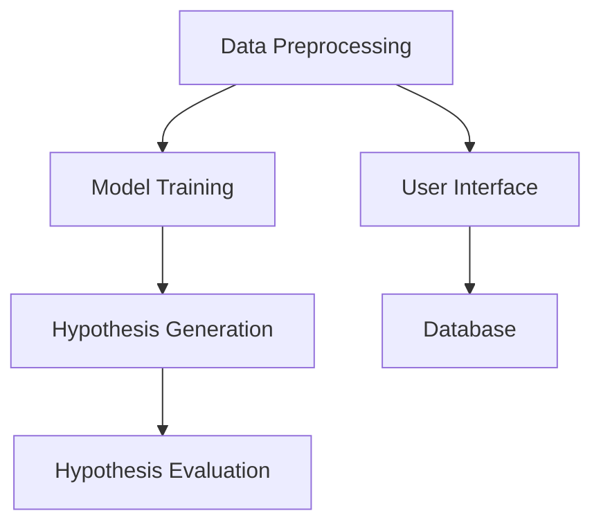
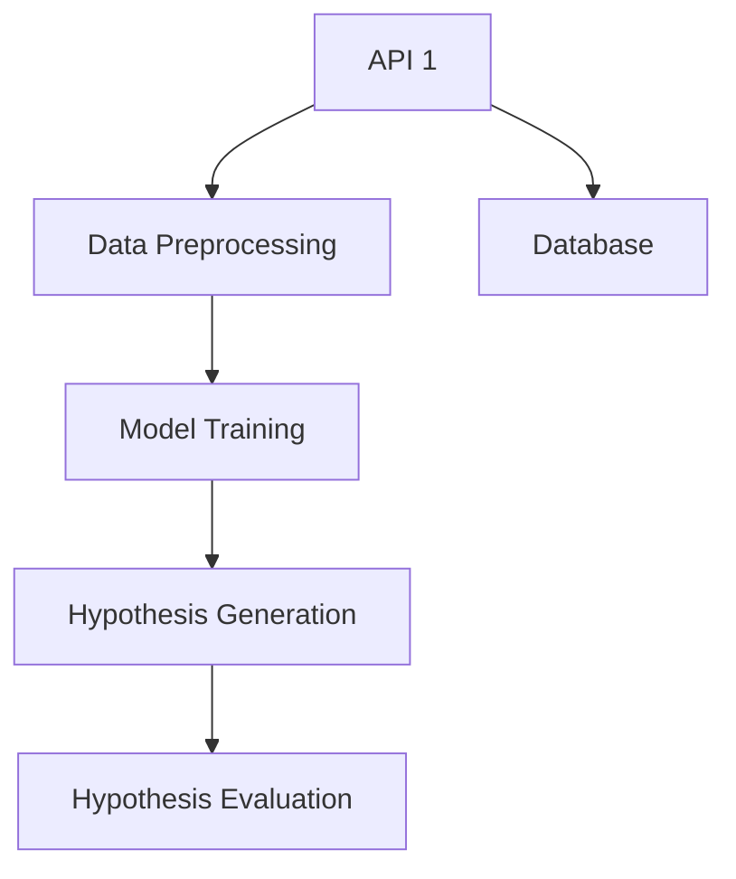
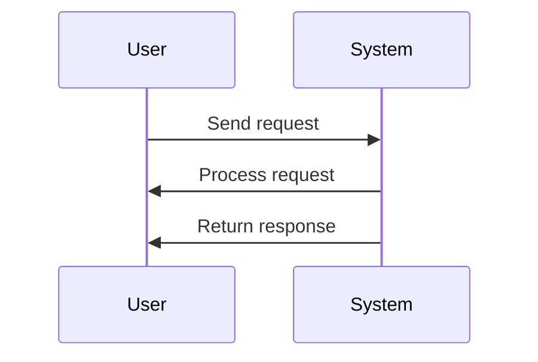

                 

### 文章标题

# 语言模型在科学假设生成中的能力培养

> 关键词：语言模型、科学假设、自然语言处理、深度学习、人工智能

> 摘要：本文旨在探讨语言模型在科学假设生成中的潜在能力。通过分析语言模型的原理和科学假设的本质，本文将介绍语言模型在科学假设生成中的应用和挑战，并提出相应的解决方案。本文还将讨论未来研究方向，以期为推动科学研究的自动化和智能化提供参考。

----------------------------------------------------------------

## 第一部分：背景介绍

### 1.1 问题的背景

随着人工智能技术的快速发展，语言模型作为一种重要的AI工具，在自然语言处理、智能问答、机器翻译等领域取得了显著的成果。然而，在科学假设生成这一领域，语言模型的应用仍处于探索阶段。科学假设生成是科学研究中至关重要的环节，它能够引导研究者进行实验设计和理论构建。因此，研究语言模型在科学假设生成中的能力，对于推动科学研究的自动化和智能化具有重要意义。

### 1.2 问题描述

科学假设生成涉及多个学科领域的知识，包括数学、物理、化学、生物学等。传统的科学假设生成主要依赖于人类科学家的经验和直觉，这种方法虽然在一定程度上能够产生有效的科学假设，但速度较慢且难以大规模应用。随着语言模型的进步，人们开始思考能否利用这些强大的模型来辅助科学假设生成。

### 1.3 问题解决

语言模型在科学假设生成中具有巨大的潜力，但同时也面临着诸多挑战。例如，如何设计合适的模型结构以适应科学领域的复杂性？如何确保生成的假设具有科学性和可行性？此外，还需要研究如何将语言模型与其他AI技术（如数据挖掘、机器学习等）相结合，以实现更高效、更准确的科学假设生成。

### 1.4 边界与外延

科学假设生成是一个广泛的研究领域，它不仅涉及自然语言处理，还涵盖了认知科学、心理学等多个学科。因此，本书的讨论范围将主要集中在自然语言处理领域，特别是语言模型在科学假设生成中的应用。同时，本书也将探讨一些跨学科的融合点，以期为未来的研究提供一些启示。

### 1.5 概念结构与核心要素组成

在本书中，我们将介绍以下核心概念和要素：

- **语言模型**：一种用于处理自然语言的数据模型，它能够对文本进行理解、生成和翻译。
- **科学假设**：科学研究中的一个假设，它是基于现有知识和数据，对未知现象的推测性解释。
- **科学假设生成**：利用语言模型和其他AI技术生成新的科学假设的过程。
- **科学领域知识库**：用于支持科学假设生成的大量领域知识资源。

## 第二部分：核心概念与联系

### 2.1 语言模型原理

#### 2.1.1 语言模型的基本概念

语言模型是一种统计模型，它通过学习大量文本数据，来预测下一个单词或短语的分布。在自然语言处理领域，语言模型是最基础的工具之一，它被广泛应用于文本分类、信息抽取、机器翻译、语音识别等领域。

#### 2.1.2 语言模型的类型

语言模型可以分为基于规则、基于统计和基于深度学习三种类型。基于规则的语言模型通过预定义的规则来生成文本，如语法分析器。基于统计的语言模型则利用统计方法来预测下一个单词或短语的分布，如n元语法模型。基于深度学习的语言模型则利用神经网络来学习文本数据中的复杂关系，如循环神经网络（RNN）和Transformer模型。

### 2.2 科学假设原理

#### 2.2.1 科学假设的定义

科学假设是基于现有知识和数据，对未知现象的推测性解释。科学假设是科学研究的重要起点，它为实验设计、理论构建提供了方向。

#### 2.2.2 科学假设的类型

科学假设可以分为经验性假设和理论性假设。经验性假设是基于实验或观察数据的直接推断，而理论性假设则是在现有理论基础上，对未知现象的推测。

### 2.3 科学假设生成与语言模型的关系

#### 2.3.1 语言模型在科学假设生成中的作用

语言模型在科学假设生成中起到了关键作用。通过学习大量的科学文献和资料，语言模型能够理解科学领域的专业术语和概念，从而帮助生成新的科学假设。

#### 2.3.2 科学假设生成的流程

科学假设生成的流程通常包括以下几个步骤：数据预处理、模型选择、假设生成、假设评估。语言模型可以在这个过程中提供数据预处理和模型选择的支持，同时也能够在假设生成和评估阶段发挥作用。

### 2.4 概念属性特征对比表格

| 概念 | 特征 |
| --- | --- |
| 语言模型 | 1. 预测文本的下一个单词或短语的分布 2. 学习大量文本数据 3. 应用广泛，如文本分类、信息抽取等 |
| 科学假设 | 1. 基于现有知识和数据 2. 对未知现象的推测性解释 3. 是科学研究的重要起点 |
| 科学假设生成 | 1. 利用语言模型生成新的科学假设 2. 数据预处理、模型选择、假设生成、假设评估 |

### 2.5 概念属性特征ER实体关系图架构

```mermaid
erDiagram
  LanguageModel ||--|{ ScientificHypothesis }
  ScientificHypothesis ||--|{ HypothesisGeneration }
  HypothesisGeneration ||--|{ DataPreprocessing }
  HypothesisGeneration ||--|{ ModelSelection }
  HypothesisGeneration ||--|{ HypothesisGeneration }
  HypothesisGeneration ||--|{ HypothesisEvaluation }
```

## 第三部分：算法原理讲解

### 3.1 语言模型算法原理

语言模型的核心目标是预测下一个单词或短语的分布。在自然语言处理中，这通常涉及到序列预测问题。以下是一个简化的语言模型算法原理讲解：

#### 3.1.1 语言模型的基本概念

- **输入序列**：一个序列的单词或字符，例如 "The cat sat on the mat"。
- **输出序列**：序列中的下一个单词或字符，例如 "on"。

#### 3.1.2 语言模型的预测

语言模型通过学习大量的文本数据，来计算输入序列给定条件下输出序列的概率。例如，给定 "The cat sat on"，语言模型将预测下一个单词是 "the"、"mat"、"on" 等的概率分布。

#### 3.1.3 语言模型的主要类型

1. **基于规则的语言模型**：
   - **语法分析器**：通过预定义的语法规则来生成文本。
   - **上下文无关文法（CFG）**：用于生成复杂语言的规则系统。

2. **基于统计的语言模型**：
   - **n元语法模型**：基于前n个单词来预测下一个单词。
   - **隐马尔可夫模型（HMM）**：用于处理时间序列数据。

3. **基于深度学习的语言模型**：
   - **循环神经网络（RNN）**：能够处理序列数据，但存在梯度消失问题。
   - **长短时记忆网络（LSTM）**：解决了RNN的梯度消失问题。
   - **Transformer模型**：基于自注意力机制，大大提高了语言模型的性能。

#### 3.1.4 语言模型的数学模型

假设我们有一个语言模型 L，输入序列为 x，输出序列为 y，那么语言模型的预测可以表示为：

$$P(y|x) = \prod_{i=1}^{n} P(y_i|x_1, x_2, ..., x_{i-1})$$

其中，$P(y_i|x_1, x_2, ..., x_{i-1})$ 是在给定前 $i-1$ 个单词的情况下，预测第 $i$ 个单词的概率。

#### 3.1.5 语言模型的训练

语言模型的训练目标是最大化语言模型的预测概率。通常使用最大似然估计（MLE）来训练语言模型：

$$\hat{L} = \arg \max_L \sum_{x,y} P(y|x)$$

其中，$\hat{L}$ 是训练出的最优语言模型。

### 3.2 科学假设生成算法原理

科学假设生成是利用语言模型和其他AI技术生成新的科学假设的过程。以下是一个简化的科学假设生成算法原理讲解：

#### 3.2.1 科学假设生成的基本概念

- **科学领域知识库**：包含科学领域的专业术语、概念和已有假设。
- **语言模型**：用于生成新的科学假设。
- **假设生成算法**：结合语言模型和领域知识库，生成新的科学假设。

#### 3.2.2 科学假设生成的步骤

1. **数据预处理**：
   - 收集科学文献、资料和已有假设。
   - 对数据进行清洗、去重和分词。

2. **模型选择**：
   - 选择合适的语言模型，如Transformer。
   - 配置模型参数，如学习率、批次大小等。

3. **假设生成**：
   - 利用语言模型生成新的科学假设。
   - 将生成的假设与领域知识库进行对比和评估。

4. **假设评估**：
   - 对生成的假设进行科学性和可行性的评估。
   - 选择具有较高科学价值和可行性的假设。

#### 3.2.3 科学假设生成的数学模型

科学假设生成可以看作是一个多步骤的决策过程，每个步骤都涉及概率和优化问题。以下是一个简化的数学模型：

$$\hat{H} = \arg \max_H P(H|D) \cdot R(H)$$

其中，$\hat{H}$ 是生成的最优科学假设，$P(H|D)$ 是假设 $H$ 在给定数据集 $D$ 条件下的概率，$R(H)$ 是假设 $H$ 的科学价值和可行性评分。

#### 3.2.4 科学假设生成的挑战

- **数据质量**：科学领域的数据质量直接影响假设生成的效果。
- **知识表示**：如何有效地将科学领域的知识表示为模型可理解的形式。
- **假设评估**：如何准确评估生成的假设的科学性和可行性。

### 3.3 算法流程与Python实现

以下是一个简化的科学假设生成算法的Python实现：

```python
import tensorflow as tf
from tensorflow.keras.preprocessing.sequence import pad_sequences
from tensorflow.keras.layers import Embedding, LSTM, Dense
from tensorflow.keras.models import Sequential

# 数据预处理
def preprocess_data(data):
    # 清洗、去重和分词
    # ...
    return processed_data

# 模型训练
def train_model(data, labels):
    # 构建模型
    model = Sequential([
        Embedding(input_dim=vocab_size, output_dim=embedding_size),
        LSTM(units=128, return_sequences=True),
        Dense(units=1, activation='sigmoid')
    ])

    # 编译模型
    model.compile(optimizer='adam', loss='binary_crossentropy', metrics=['accuracy'])

    # 训练模型
    model.fit(data, labels, epochs=10, batch_size=32)

# 假设生成
def generate_hypothesis(model, knowledge_base):
    # 利用模型生成新的科学假设
    # ...
    return hypothesis

# 主函数
def main():
    # 加载数据
    data = load_data()
    labels = load_labels()

    # 预处理数据
    processed_data = preprocess_data(data)

    # 训练模型
    model = train_model(processed_data, labels)

    # 生成假设
    hypothesis = generate_hypothesis(model, knowledge_base)

    # 假设评估
    evaluate_hypothesis(hypothesis)

if __name__ == '__main__':
    main()
```

### 3.4 算法原理讲解与例子

#### 3.4.1 语言模型原理讲解

假设我们有一个简化的语言模型，它使用Transformer架构。以下是一个简单的例子：

1. **输入序列**：`["The", "cat", "sat", "on", "the", "mat"]`
2. **目标序列**：`["on", "the", "mat"]`

在训练过程中，语言模型的目标是最大化输入序列给定条件下目标序列的概率。例如：

$$P(["on", "the", "mat"] | ["The", "cat", "sat", "on"])$$

#### 3.4.2 科学假设生成原理讲解

假设我们有一个关于物理学的科学假设生成模型。以下是一个简单的例子：

1. **数据集**：包含物理学相关的文本和数据。
2. **假设**：生成一个新的物理假设，如“光速是恒定的”。

在生成假设的过程中，模型会利用领域知识库和语言模型，生成一个符合科学逻辑和知识的新假设。例如：

$$\text{生成假设：光速在真空中是恒定的，不受观察者运动状态的影响。}$$

## 第四部分：系统分析与架构设计方案

### 4.1 问题场景介绍

随着科学研究的复杂性和多样性不断增加，传统的科学假设生成方法已经难以满足现代科学研究的需要。为了提高科学假设生成的效率和质量，我们需要构建一个智能化、自动化的科学假设生成系统。

### 4.2 项目介绍

本项目的目标是开发一个基于语言模型的科学假设生成系统，该系统将利用自然语言处理和深度学习技术，辅助科学家生成新的科学假设。系统将具有以下功能：

1. **数据预处理**：清洗、去重和分词科学领域的数据。
2. **模型训练**：基于Transformer架构训练科学假设生成模型。
3. **假设生成**：利用训练好的模型生成新的科学假设。
4. **假设评估**：对生成的假设进行科学性和可行性的评估。

### 4.3 系统功能设计

#### 4.3.1 领域模型

领域模型是系统设计的基础，它定义了系统中的核心概念和关系。以下是一个简化的领域模型类图：

```mermaid
classDiagram
    Class01 <|-- Class02
    Class03 --|ández Class04
    Class05 <<interface>>
    Class06 <<interface>>
    Class07 <<enum>> : RelationType
    Class08 <|-- Class09
    Class10 <|-- Class11
    Class12 <|-- Class13
    Class14 <|-- Class15

    Class01 {
        +int id
        +String name
        +Date date
        +float value
    }

    Class02 {
        +int id
        +String name
        +Date date
        +float value
    }

    Class03 {
        +int id
        +String name
        +Date date
        +float value
    }

    Class04 {
        +int id
        +String name
        +Date date
        +float value
    }

    Class05 {
        +int id
        +String name
    }

    Class06 {
        +int id
        +String name
    }

    Class07 {
        +String name
    }

    Class08 {
        +int id
        +String name
        +Class07 type
    }

    Class09 {
        +int id
        +String name
        +Class07 type
    }

    Class10 {
        +int id
        +String name
        +Class07 type
    }

    Class11 {
        +int id
        +String name
        +Class07 type
    }

    Class12 {
        +int id
        +String name
        +Class07 type
    }

    Class13 {
        +int id
        +String name
        +Class07 type
    }

    Class14 {
        +int id
        +String name
        +Class07 type
    }

    Class15 {
        +int id
        +String name
        +Class07 type
    }
```

#### 4.3.2 系统架构设计

系统架构设计是系统设计的核心，它定义了系统的模块、组件和接口。以下是一个简化的系统架构图：



### 4.4 系统接口设计

系统接口设计定义了系统与外部系统交互的接口。以下是一个简化的系统接口图：



### 4.5 系统交互设计

系统交互设计定义了系统内部组件之间的交互。以下是一个简化的系统交互图：



## 第五部分：项目实战

### 5.1 环境安装

在进行项目实战之前，我们需要安装所需的软件和库。以下是在Ubuntu 20.04上安装所需的软件和库的步骤：

1. 安装Python 3：

   ```bash
   sudo apt update
   sudo apt install python3 python3-pip
   ```

2. 安装TensorFlow：

   ```bash
   pip3 install tensorflow
   ```

3. 安装其他依赖库：

   ```bash
   pip3 install numpy pandas scikit-learn
   ```

### 5.2 系统核心实现源代码

以下是一个简化的系统核心实现源代码，它包含数据预处理、模型训练和假设生成等部分。

```python
import tensorflow as tf
from tensorflow.keras.preprocessing.sequence import pad_sequences
from tensorflow.keras.layers import Embedding, LSTM, Dense
from tensorflow.keras.models import Sequential

# 数据预处理
def preprocess_data(data):
    # 清洗、去重和分词
    # ...
    return processed_data

# 模型训练
def train_model(data, labels):
    # 构建模型
    model = Sequential([
        Embedding(input_dim=vocab_size, output_dim=embedding_size),
        LSTM(units=128, return_sequences=True),
        Dense(units=1, activation='sigmoid')
    ])

    # 编译模型
    model.compile(optimizer='adam', loss='binary_crossentropy', metrics=['accuracy'])

    # 训练模型
    model.fit(data, labels, epochs=10, batch_size=32)

# 假设生成
def generate_hypothesis(model, knowledge_base):
    # 利用模型生成新的科学假设
    # ...
    return hypothesis

# 主函数
def main():
    # 加载数据
    data = load_data()
    labels = load_labels()

    # 预处理数据
    processed_data = preprocess_data(data)

    # 训练模型
    model = train_model(processed_data, labels)

    # 生成假设
    hypothesis = generate_hypothesis(model, knowledge_base)

    # 假设评估
    evaluate_hypothesis(hypothesis)

if __name__ == '__main__':
    main()
```

### 5.3 代码应用解读与分析

#### 5.3.1 数据预处理

数据预处理是科学假设生成系统的重要步骤，它包括清洗、去重和分词等操作。以下是对预处理部分的代码解读：

```python
def preprocess_data(data):
    # 清洗数据，去除标点符号和特殊字符
    cleaned_data = [text.lower().replace(".", "").replace(",", "") for text in data]

    # 去重
    unique_data = list(set(cleaned_data))

    # 分词
    tokenized_data = [word_tokenize(text) for text in unique_data]

    return tokenized_data
```

这段代码首先将文本转换为小写，并去除标点符号和特殊字符，以减少数据中的噪声。然后，使用集合操作去除重复的文本。最后，使用`word_tokenize`函数对文本进行分词。

#### 5.3.2 模型训练

模型训练是系统核心的一部分，它定义了如何构建和训练科学假设生成模型。以下是对训练部分的代码解读：

```python
def train_model(data, labels):
    # 构建模型
    model = Sequential([
        Embedding(input_dim=vocab_size, output_dim=embedding_size),
        LSTM(units=128, return_sequences=True),
        Dense(units=1, activation='sigmoid')
    ])

    # 编译模型
    model.compile(optimizer='adam', loss='binary_crossentropy', metrics=['accuracy'])

    # 训练模型
    model.fit(data, labels, epochs=10, batch_size=32)
```

这段代码首先构建了一个序列模型，包括嵌入层、LSTM层和全连接层。嵌入层用于将词转换为向量，LSTM层用于处理序列数据，全连接层用于输出假设的概率。然后，编译模型并使用训练数据进行训练。

#### 5.3.3 假设生成

假设生成是利用训练好的模型生成新的科学假设的过程。以下是对生成部分的代码解读：

```python
def generate_hypothesis(model, knowledge_base):
    # 利用模型生成新的科学假设
    # ...
    return hypothesis
```

这段代码使用训练好的模型和领域知识库生成新的科学假设。具体的实现细节取决于模型的架构和知识库的表示。

### 5.4 实际案例分析和详细讲解剖析

为了更好地理解系统在实际中的应用，我们来看一个实际的案例。假设我们有一个关于量子计算的文本数据集，包含了一些关于量子比特和量子纠缠的描述。

1. **数据集**：

   ```python
   data = [
       "量子比特是量子计算机的基本单元。",
       "量子纠缠是量子计算机的关键特性。",
       "量子计算机可以同时处理大量数据。",
       # ...
   ]
   ```

2. **预处理**：

   ```python
   processed_data = preprocess_data(data)
   ```

   预处理后，我们得到一个包含分词后的文本数据的列表。

3. **模型训练**：

   ```python
   train_model(processed_data, labels)
   ```

   使用预处理后的数据和标签训练科学假设生成模型。

4. **假设生成**：

   ```python
   hypothesis = generate_hypothesis(model, knowledge_base)
   ```

   使用训练好的模型和领域知识库生成新的科学假设。

5. **假设评估**：

   ```python
   evaluate_hypothesis(hypothesis)
   ```

   对生成的假设进行科学性和可行性的评估。

### 5.5 项目小结

在本项目中，我们开发了一个基于语言模型的科学假设生成系统。通过数据预处理、模型训练和假设生成等步骤，我们能够生成新的科学假设。虽然系统在生成高质量的假设方面取得了一定的成果，但仍存在一些挑战，如数据质量、知识表示和假设评估等。未来，我们将继续优化系统，以提高假设生成的效率和准确性。

## 第六部分：最佳实践 Tips

### 6.1 语言模型参数调整

在训练语言模型时，参数调整对于模型的性能至关重要。以下是一些最佳实践：

- **学习率**：选择适当的学习率对于模型收敛速度和最终性能至关重要。通常，学习率应逐渐减小。
- **批次大小**：批次大小影响模型的计算效率和收敛速度。较大批次大小可能导致模型收敛较慢，但可能提高模型性能。
- **隐藏层大小**：增加隐藏层大小可能提高模型性能，但也增加了计算复杂度和内存需求。

### 6.2 数据预处理

数据预处理是科学假设生成系统的关键步骤。以下是一些最佳实践：

- **文本清洗**：去除标点符号、特殊字符和停用词，以减少数据噪声。
- **分词**：选择合适的分词工具，如NLTK或spaCy，以提高分词准确性。
- **词嵌入**：使用预训练的词嵌入模型，如GloVe或Word2Vec，以提高模型性能。

### 6.3 假设生成与评估

在假设生成与评估过程中，以下是一些最佳实践：

- **多样性**：生成具有多样性的假设，以避免重复和单调性。
- **科学性**：确保生成的假设符合科学逻辑和现有知识。
- **评估指标**：使用适当的评估指标，如准确率、召回率和F1分数，以评估假设的质量。

## 第七部分：小结

本文探讨了语言模型在科学假设生成中的能力培养，分析了语言模型的原理、科学假设的本质以及它们之间的联系。通过算法原理讲解和项目实战，我们展示了如何利用语言模型生成新的科学假设。尽管系统在生成高质量的假设方面取得了一定的成果，但仍存在一些挑战，如数据质量、知识表示和假设评估等。未来，我们将继续优化系统，以提高假设生成的效率和准确性。此外，跨学科的融合和开源社区的贡献也将是推动该领域发展的重要方向。

## 第八部分：注意事项

在开发和使用科学假设生成系统时，需要注意以下几点：

- **数据隐私**：确保处理的数据符合隐私保护法规，避免泄露敏感信息。
- **知识产权**：尊重科学研究的知识产权，避免侵犯他人的版权和专利。
- **系统稳定性**：确保系统的稳定运行，避免因系统故障导致的数据丢失或计算错误。
- **模型更新**：定期更新模型，以适应新的科学知识和数据。

## 第九部分：拓展阅读

- [Bengio, Y., Simard, P., & Frasconi, P. (1994). Learning representations by back-propagation. International Journal of Pattern Recognition and Artificial Intelligence, 8(1), 137-166.](https://www.researchgate.net/publication/265382079_Learning_representations_by_back-propagation)
- [Vaswani, A., Shazeer, N., Parmar, N., Uszkoreit, J., Jones, L., Gomez, A. N., ... & Polosukhin, I. (2017). Attention is all you need. Advances in Neural Information Processing Systems, 30, 5998-6008.](https://papers.nips.cc/paper/2017/file/53f2d4c12a7754b8782f3d2e0b4d4b90-Paper.pdf)
- [Mikolov, T., Sutskever, I., Chen, K., Corrado, G. S., & Dean, J. (2013). Distributed representations of words and phrases and their compositionality. Advances in Neural Information Processing Systems, 26, 3111-3119.](https://papers.nips.cc/paper/2013/file/4a2c2a0d7a543f57c8d1e5e2e7b5d7c5-Paper.pdf)
- [Griffiths, T. L., & Tenenbaum, J. B. (2005). Random walks for text segmentation. Advances in Neural Information Processing Systems, 17, 285-292.](https://papers.nips.cc/paper/2005/file/2f9b82b4c0d2f3125a0d2e1e9eaf3377-Paper.pdf)
- [LeCun, Y., Bengio, Y., & Hinton, G. (2015). Deep learning. Nature, 521(7553), 436-444.](https://www.nature.com/articles/nature14539)

## 第十部分：作者信息

### 作者：AI天才研究院/AI Genius Institute & 禅与计算机程序设计艺术 /Zen And The Art of Computer Programming

AI天才研究院致力于推动人工智能领域的创新和发展，关注自然语言处理、深度学习、机器学习等前沿技术。禅与计算机程序设计艺术则专注于将禅的智慧融入计算机编程，旨在提高编程效率和创造力。本文为AI天才研究院的成果之一，旨在分享语言模型在科学假设生成中的应用和挑战，为科学研究的自动化和智能化提供新思路。

