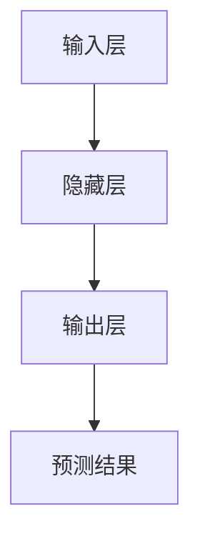
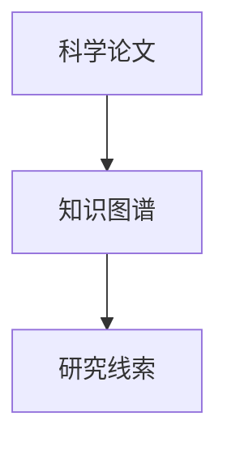

                 

### 第1章 问题背景

#### 1.1.1 科学发现的过程与挑战

科学发现是一个复杂的过程，需要科学家们进行大量的实验、数据分析以及理论推导。然而，这一过程往往面临数据量庞大、实验条件复杂、推理难度高等挑战。

**问题描述**：

1. **数据量庞大**：科学领域的数据量通常非常庞大，比如天文观测数据、生物基因序列数据、化学实验数据等。这些数据往往需要高效的处理和分析方法。
   
2. **实验条件复杂**：很多科学实验需要控制复杂的实验条件，例如高温、高压、真空等，实验结果往往受到多种因素的影响。

3. **推理难度高**：科学发现往往需要科学家们进行复杂的逻辑推理，例如从实验数据中提取规律、从理论推导中验证假设等。

**问题解决**：

随着人工智能技术的发展，语言模型作为一种强大的工具，可以自动分析文本数据、理解科学论文的内容，并在一定程度上模拟科学家的思维过程，为科学发现提供支持。

**边界与外延**：

本章节主要探讨语言模型在科学发现过程中的应用，包括但不限于文本分析、知识图谱构建、跨学科研究等。

#### 1.1.2 语言模型的定义与分类

**概念定义**：

语言模型是一种基于统计学方法，通过大量文本数据学习语言规律的算法。

**分类**：

根据训练数据的来源和算法的不同，语言模型可分为以下几种类型：

1. **基于统计的模型**：这类模型通常使用概率统计方法，如N元语法（N-gram）等，通过计算词语的联合概率分布来预测下一个词。

2. **基于神经网络的模型**：这类模型通常使用深度学习技术，如循环神经网络（RNN）、长短时记忆网络（LSTM）等，通过学习文本数据中的复杂特征和关系来进行预测。

**核心要素组成**：

语言模型的要素主要包括以下几部分：

1. **输入层**：接收文本数据，将其转换为模型可以处理的特征表示。

2. **隐藏层**：负责处理输入数据的复杂关系，学习文本数据中的统计规律和语义信息。

3. **输出层**：生成预测结果，如下一个词或短语的概率分布。

以下是语言模型的简单Mermaid流程图：



下面是一个简单的Python代码示例，展示了如何使用训练好的语言模型进行预测：

```python
import numpy as np
# 假设训练好的语言模型
input_vector = np.array([1, 0, 0, 0, 0])
# 预测下一个词的概率分布
output_distribution = language_model.predict(input_vector)
print(output_distribution)
```

在接下来的章节中，我们将进一步探讨语言模型的原理及其在科学发现中的应用。

### 1.2 语言模型在科学发现中的应用

**应用实例**：

利用语言模型自动阅读和分析科学论文，提取关键信息，构建知识图谱，辅助科学家发现新的研究线索。

**Mermaid ER实体关系图**：



在这个应用场景中，语言模型的作用可以概括为以下几点：

1. **文本分析**：语言模型可以自动阅读和理解科学论文的文本内容，提取出关键信息，如关键词、句子、段落等。

2. **知识图谱构建**：通过分析科学论文的内容，语言模型可以帮助构建一个结构化的知识图谱，将论文中的知识信息进行组织和关联。

3. **研究线索发现**：基于知识图谱，语言模型可以辅助科学家发现新的研究线索，探索未知领域。

**Python代码示例**：

```python
import spacy
# 加载训练好的语言模型
nlp = spacy.load("en_core_web_sm")
# 分析一篇科学论文
doc = nlp("This is a sample scientific paper.")
# 提取关键词和句子
keywords = [token.text for token in doc if token.is_alpha]
sentences = [sent.text for sent in doc.sents]
print("Keywords:", keywords)
print("Sentences:", sentences)
```

通过这个例子，我们可以看到语言模型在科学发现中的应用是如何实现的。在接下来的章节中，我们将深入探讨语言模型的原理及其在科学发现中的应用。

### 1.3 语言模型在科学发现中的应用原理

**3.1 语言模型的数学基础**

为了深入理解语言模型在科学发现中的应用原理，我们需要先掌握一些基本的数学知识。

**3.1.1 概率论基础**

概率论是研究随机事件及其规律性的数学分支。在语言模型中，概率论被广泛应用于计算词语的联合概率分布。

**贝叶斯定理**：

贝叶斯定理是一个关于条件概率和边缘概率的公式，其数学表达式如下：

$$
P(A|B) = \frac{P(B|A)P(A)}{P(B)}
$$

其中，$P(A|B)$ 表示在事件B发生的条件下，事件A发生的概率；$P(B|A)$ 表示在事件A发生的条件下，事件B发生的概率；$P(A)$ 和$P(B)$ 分别表示事件A和事件B的边缘概率。

**马尔可夫性质**：

马尔可夫性质是指一个随机过程，其未来状态只依赖于当前状态，而与过去状态无关。在语言模型中，马尔可夫性质被广泛应用于序列模型的构建。

**3.1.2 概率论基础**

概率论是研究随机事件及其规律性的数学分支。在语言模型中，概率论被广泛应用于计算词语的联合概率分布。

**贝叶斯定理**：

贝叶斯定理是一个关于条件概率和边缘概率的公式，其数学表达式如下：

$$
P(A|B) = \frac{P(B|A)P(A)}{P(B)}
$$

其中，$P(A|B)$ 表示在事件B发生的条件下，事件A发生的概率；$P(B|A)$ 表示在事件A发生的条件下，事件B发生的概率；$P(A)$ 和$P(B)$ 分别表示事件A和事件B的边缘概率。

**马尔可夫性质**：

马尔可夫性质是指一个随机过程，其未来状态只依赖于当前状态，而与过去状态无关。在语言模型中，马尔可夫性质被广泛应用于序列模型的构建。

**3.2 语言模型在科学发现中的应用**

**3.2.1 语言模型在科学发现中的应用**

语言模型在科学发现中的应用非常广泛，主要体现在以下几个方面：

**1. 文本分析**

语言模型可以自动阅读和理解科学论文的文本内容，提取出关键信息，如关键词、句子、段落等。这对于科学家来说是一个非常有用的工具，可以帮助他们快速了解相关领域的研究进展。

**2. 知识图谱构建**

通过分析科学论文的内容，语言模型可以帮助构建一个结构化的知识图谱，将论文中的知识信息进行组织和关联。知识图谱可以用于发现新的研究线索，探索未知领域。

**3. 研究线索发现**

基于知识图谱，语言模型可以辅助科学家发现新的研究线索，探索未知领域。例如，通过分析多个相关领域的论文，语言模型可以识别出潜在的研究空白和交叉点，为科学家提供新的研究方向。

**3.2.2 语言模型在科学发现中的应用实例**

下面我们通过一个实例来具体说明语言模型在科学发现中的应用。

假设我们有一个科学领域，主要研究人工智能在医疗领域的应用。我们希望通过语言模型分析大量的医学论文，发现潜在的研究线索。

首先，我们使用语言模型对医学论文进行文本分析，提取出关键词和句子。例如，我们可能会提取到以下关键词：“人工智能”、“医疗诊断”、“机器学习”、“数据分析”等。

接下来，我们使用这些关键词构建一个知识图谱，将相关论文进行组织和关联。通过分析知识图谱，我们可以发现一些潜在的研究线索，如：

- “人工智能在癌症诊断中的应用”是一个研究热点。
- “机器学习在医疗图像分析中的应用”是一个新兴领域。
- “数据分析在个性化医疗中的应用”是一个有待进一步研究的方向。

基于这些研究线索，科学家可以进一步展开研究，探索人工智能在医疗领域的更多应用。

**3.2.3 语言模型在科学发现中的应用挑战**

尽管语言模型在科学发现中具有很大的潜力，但仍然面临一些挑战：

**1. 数据质量问题**

科学论文的质量参差不齐，数据质量也可能存在问题。这可能会影响语言模型的分析结果。

**2. 知识图谱构建难度**

构建一个结构化、高质量的知

