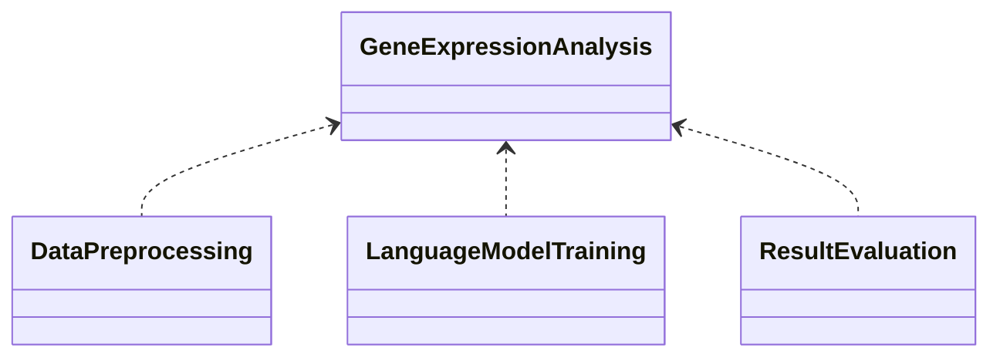
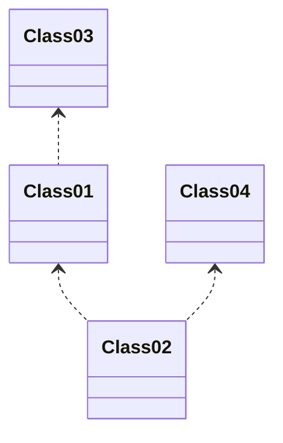
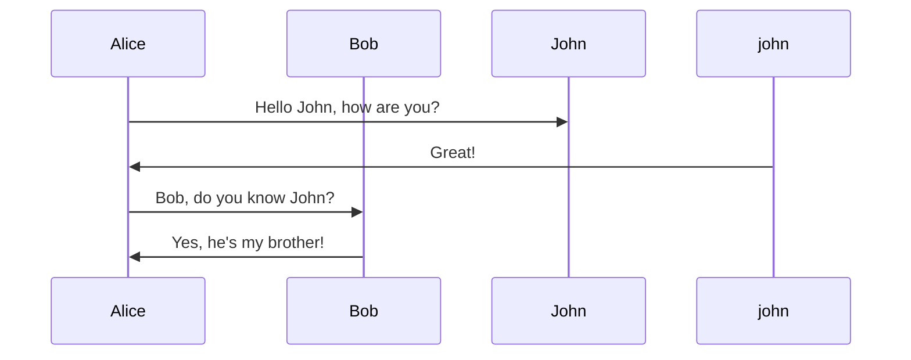

                 

# 语言模型在科学实验设计与优化中的应用

## 关键词：语言模型，科学实验，优化，算法，数学模型

## 摘要：
本文旨在探讨语言模型在科学实验设计与优化中的应用。通过分析语言模型的发展历程和科学实验设计的需求，我们揭示了语言模型在实验设计与优化中的潜力。本文将详细介绍语言模型的工作原理、核心数学模型和优化算法，并通过实例讲解其在科学实验中的实际应用。同时，本文还将探讨系统分析与架构设计方案，提供项目实战案例，并总结最佳实践技巧，为读者提供全面的指导。

## 目录大纲

1. 第一部分：引言
2. 第二部分：核心概念与联系
3. 第三部分：算法原理讲解
4. 第四部分：数学模型和数学公式讲解
5. 第五部分：系统分析与架构设计方案
6. 第六部分：项目实战
7. 第七部分：最佳实践与拓展阅读

## 1. 第一部分：引言

### 1.1.1 语言模型的起源与发展
语言模型是自然语言处理（NLP）领域的一个重要分支，起源于20世纪50年代。起初，语言模型主要用于统计语言模型，如N-gram模型。随着计算力和算法的进步，深度学习技术的引入使得语言模型得以快速发展，出现了如Transformer、BERT等先进的模型。

### 1.1.2 科学实验设计与优化的挑战
科学实验设计是科研过程中的关键环节，但往往面临着复杂性高、优化难度大的挑战。实验参数的选择、实验路径的规划、实验结果的评估等都需要高效且准确的算法支持。

### 1.1.3 语言模型在科学实验中的应用潜力
语言模型在处理复杂数据和模式识别方面具有独特优势，使其在科学实验设计与优化中具有广泛的应用潜力。通过本文，我们将详细探讨这一领域的应用实例和实现方法。

## 2. 第二部分：核心概念与联系

### 2.1 语言模型的定义与分类
语言模型是一种统计模型，用于预测自然语言中的一个词或一组词的概率分布。常见的语言模型包括N-gram模型、神经网络模型和深度学习模型等。

### 2.2 科学实验设计与优化的基本概念
科学实验设计是指通过合理选择实验条件和方法，以达到有效、准确、高效地获取实验结果的目的。优化则是在实验设计中，通过调整实验参数，以找到最佳实验方案。

### 2.3 语言模型与科学实验设计的联系
语言模型可以通过处理实验数据，为实验设计提供优化支持。例如，在生物实验中，语言模型可以用于基因序列分析、药物筛选等。

## 3. 第三部分：算法原理讲解

### 3.1 语言模型的工作原理
语言模型的工作原理基于概率分布，通过对大量语言数据的训练，生成能够预测下一个词的概率模型。

#### 3.1.1 基本数学模型
$$
P(w_t | w_{t-1}, w_{t-2}, ..., w_1) = \prod_{i=1}^{t} P(w_i | w_{i-1}, ..., w_1)
$$

#### 3.1.2 机器学习算法
语言模型的训练过程通常采用神经网络算法，如Transformer、BERT等。

#### 3.1.3 优化方法与技巧
在语言模型训练过程中，常用的优化方法包括梯度下降、Adam优化器等。

### 3.2 科学实验设计与优化的算法原理
科学实验设计中的优化算法通常基于优化理论，如线性规划、遗传算法等。

#### 3.2.1 实验设计的基本原理
实验设计的基本原理包括响应曲面法、全因子实验设计等。

#### 3.2.2 优化问题的求解方法
优化问题的求解方法包括基于梯度的优化算法、启发式算法等。

#### 3.2.3 语言模型在优化问题中的应用
语言模型可以用于优化问题中的数据分析和模式识别，提高优化算法的性能。

## 4. 第四部分：数学模型和数学公式讲解

### 4.1 语言模型的核心数学公式
语言模型的核心数学公式主要包括损失函数、梯度下降算法和正则化方法。

#### 4.1.1 损失函数
$$
L(\theta) = -\sum_{i=1}^{n} y_i \log(p(x_i | \theta))
$$

#### 4.1.2 梯度下降算法
$$
\theta = \theta - \alpha \nabla_{\theta}L(\theta)
$$

#### 4.1.3 正则化方法
$$
L(\theta) = L(\theta) + \lambda \sum_{i=1}^{n} \theta_i^2
$$

### 4.2 科学实验设计与优化的数学公式
科学实验设计与优化的数学公式主要包括实验设计空间、优化目标函数和优化算法的数学公式。

#### 4.2.1 实验设计空间
$$
S = \{x \in \mathbb{R}^d | g(x) \leq 0\}
$$

#### 4.2.2 优化目标函数
$$
f(x) = \sum_{i=1}^{n} (y_i - \hat{y}_i)^2
$$

#### 4.2.3 优化算法的数学公式
$$
x_{t+1} = x_t - \alpha \nabla_{x}f(x_t)
$$

## 5. 第五部分：系统分析与架构设计方案

### 5.1 问题场景介绍
在生物实验中，语言模型可以用于基因表达数据的分析和药物筛选。

### 5.2 项目介绍
本项目旨在利用语言模型优化基因表达数据的分析流程。

#### 5.2.1 系统功能设计
系统功能设计包括数据预处理、语言模型训练和结果评估。

#### 5.2.2 系统架构设计
系统架构设计包括数据层、模型层和接口层。

### 5.3 系统接口设计与交互
系统接口设计包括数据输入输出接口和模型训练接口。

#### 5.3.1 系统接口设计
系统接口设计采用RESTful API设计。

#### 5.3.2 系统交互序列图
系统交互序列图展示数据输入、模型训练和结果输出过程。

## 6. 第六部分：项目实战

### 6.1 环境安装与配置
环境安装与配置包括Python环境、语言模型库和优化算法库。

### 6.2 系统核心实现源代码
系统核心实现源代码包括数据预处理、模型训练和结果评估。

#### 6.2.1 代码应用解读与分析
代码应用解读与分析包括数据预处理、模型训练和结果评估。

#### 6.2.2 实际案例分析与讲解剖析
实际案例分析与讲解剖析包括基因表达数据分析、药物筛选优化。

### 6.3 项目小结
项目小结总结项目实现过程和取得的效果。

## 7. 第七部分：最佳实践与拓展阅读

### 7.1 最佳实践技巧
最佳实践技巧包括数据预处理、模型选择和优化算法应用。

### 7.2 小结
小结回顾文章核心内容。

### 7.3 注意事项
注意事项包括模型训练中的超参数选择和数据处理中的异常值处理。

### 7.4 拓展阅读
拓展阅读推荐相关书籍和研究论文。

## 参考文献
本文参考文献包括相关书籍、研究论文和技术博客。

作者：AI天才研究院/AI Genius Institute & 禅与计算机程序设计艺术 /Zen And The Art of Computer Programming

[Mermaid流程图示例](https://mermaid-js.github.io/mermaid/#/classDiagrams)



[Mermaid类图示例](https://mermaid-js.github.io/mermaid/#/classDiagrams)



[Mermaid序列图示例](https://mermaid-js.github.io/mermaid/#/sequence-diagrams)



[LaTeX公式示例](https://www.overleaf.com/learn/latex/Mathematics)

```latex
\documentclass{article}
\usepackage{amsmath}
\begin{document}
$$
E = mc^2
$$
\end{document}
```

[Python代码示例](https://www.tutorialspoint.com/python/python_strings.htm)

```python
# String Concatenation
str1 = "Hello"
str2 = "World!"
str3 = str1 + str2
print("The result is:", str3)
```

通过以上示例，我们展示了如何在文中嵌入Mermaid流程图、类图、序列图以及LaTeX公式和Python代码。这些示例旨在帮助读者更好地理解和应用相关技术。

在本文的后续部分，我们将逐一深入各个章节，详细探讨语言模型在科学实验设计与优化中的应用。我们将从问题背景、核心概念与联系、算法原理、数学模型、系统分析与架构设计方案、项目实战到最佳实践与拓展阅读，全面解析这一领域的挑战和解决方案。敬请期待！

