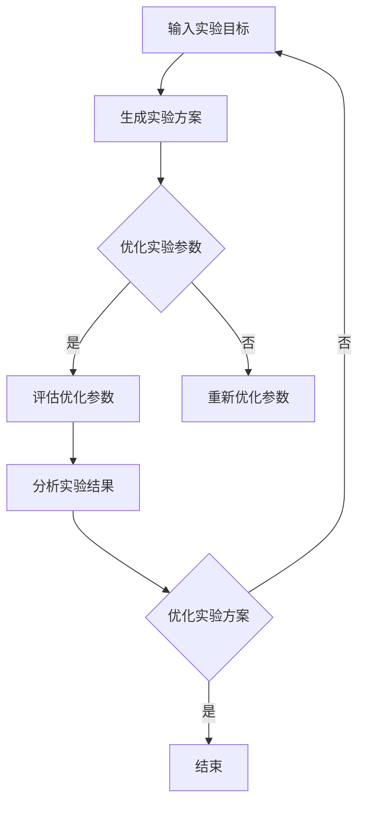
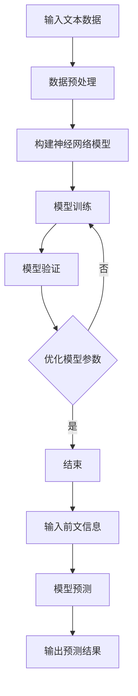
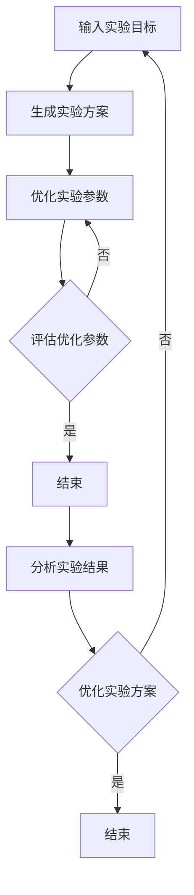

                 

# 引言

## 语言模型与科学实验设计

在当今快速发展的科技时代，科学实验设计在推动科学研究和技术进步中扮演着至关重要的角色。然而，传统的实验设计过程通常依赖大量的手动操作和反复的试验，这不仅费时费力，而且容易受到人为因素的影响。为了提高实验设计的效率和质量，自动化与优化技术逐渐成为研究的热点。语言模型作为人工智能领域的一项核心技术，其在自然语言处理、文本生成和机器翻译等方面取得了显著成果，同时也逐渐被应用于科学实验设计的自动化与优化中。

语言模型能够理解、生成和处理自然语言，这种能力使其在科学实验设计中具有巨大的潜力。通过语言模型，研究人员可以自动生成实验方案，优化实验参数，预测实验结果，甚至可以辅助设计复杂的实验流程。本篇文章将探讨语言模型在科学实验设计自动化与优化中的前沿研究，旨在为读者提供一个全面且深入的理解。

本文将分为以下几个部分：

1. **背景介绍**：介绍科学实验设计自动化的必要性，语言模型在实验设计中的潜在应用，以及自动化与优化的核心目标。
2. **核心概念与联系**：详细解释语言模型的基本概念和特点，科学实验设计自动化与优化的核心概念，以及两者之间的联系。
3. **算法原理讲解**：讲解语言模型的基本算法原理，实验设计自动化的算法原理，以及算法mermaid流程图展示。
4. **数学模型和数学公式**：介绍语言模型的数学模型和实验设计优化的数学模型，以及Python代码示例。
5. **系统分析与架构设计方案**：介绍问题场景、项目介绍、系统功能设计、系统架构设计和系统接口设计。
6. **项目实战**：包括环境安装、系统核心实现源代码、代码应用解读与分析、实际案例分析和项目小结。
7. **最佳实践 tips、小结、注意事项、拓展阅读**：总结文章内容，提供实践建议，指出注意事项，并推荐拓展阅读。

通过这篇文章，我们希望能够为读者提供一个新的视角，理解语言模型在科学实验设计自动化与优化中的应用，以及如何将这些技术应用于实际的科研工作中。

## 背景介绍

### 1.1 科学实验设计自动化的必要性

科学实验设计自动化是指利用计算机技术、算法和自动化工具，对科学实验的设计、执行和结果分析进行自动化处理，从而提高实验效率、减少人为错误并加速科学研究的进展。在传统实验设计中，实验者需要根据实验目的和理论假设，手动设计实验方案、设置实验参数、执行实验操作，并分析实验结果。这种方法不仅耗时耗力，而且容易受到实验者主观意识和操作技能的影响，导致实验结果的不确定性和偏差。

随着科学研究的复杂性和规模不断扩大，传统的实验设计方法已经无法满足现代科学研究的需求。自动化实验设计技术应运而生，其核心目标是通过计算机技术实现实验设计的自动化，使实验者能够专注于实验的科学性和创新性，而将繁琐的实验操作交给计算机系统完成。自动化实验设计技术不仅能够显著提高实验效率，减少人为错误，还能提供更加精确和可靠的实验数据。

### 1.2 语言模型在实验设计中的潜在应用

语言模型是一种基于统计和学习方法的自然语言处理技术，能够对自然语言进行建模，从而理解和生成自然语言文本。语言模型在许多领域已经取得了显著的成果，包括文本生成、机器翻译、情感分析等。然而，语言模型在科学实验设计中的应用仍然是一个相对较新的研究领域，但其潜力巨大。

首先，语言模型可以用于自动生成实验方案。实验方案通常包括实验目标、实验设计、实验步骤、实验结果预期等。语言模型能够根据预先定义的实验目标和理论假设，自动生成符合逻辑和科学原则的实验方案。这种自动生成的实验方案不仅能够提高实验设计的效率，还能减少人为设计失误。

其次，语言模型可以用于优化实验参数。在科学实验中，实验参数的选择对实验结果具有重要影响。语言模型可以通过对大量实验数据的分析和学习，自动调整和优化实验参数，从而提高实验的准确性和可靠性。例如，在生物实验中，语言模型可以自动选择最佳的培养条件、药物浓度等参数。

此外，语言模型还可以用于预测实验结果。通过分析实验数据和文献资料，语言模型可以预测实验的潜在结果，为实验者提供有价值的参考。这种预测不仅能够帮助实验者提前判断实验的可行性和有效性，还能为后续实验的设计和优化提供依据。

### 1.3 自动化与优化：科学实验设计的核心目标

自动化与优化是科学实验设计的两个核心目标。自动化旨在通过计算机技术和算法，实现实验设计的自动化处理，从而提高实验效率和减少人为错误。优化则旨在通过算法和数据分析，自动调整和优化实验参数，提高实验的准确性和可靠性。

自动化与优化在科学实验设计中具有重要作用。首先，自动化能够减少实验者的工作量，使实验者能够将更多的时间和精力投入到实验的科学性和创新性上。其次，优化能够提高实验结果的准确性和可靠性，减少实验误差，为科学研究提供更加可靠的依据。此外，自动化与优化还能够加快科学研究的进展，缩短研究周期，提高研究成果的转化和应用速度。

然而，自动化与优化在科学实验设计中也存在一定的挑战。首先，实验数据的多样性和复杂性使得自动化处理变得更加困难。不同实验领域的数据特征和实验需求差异较大，如何设计通用的自动化算法和工具成为关键问题。其次，优化算法的选择和参数设置对实验结果具有决定性影响，如何选择合适的优化算法和参数设置需要深入研究和验证。

总之，自动化与优化是现代科学实验设计不可或缺的重要手段。通过引入语言模型等先进技术，科学实验设计的自动化和优化水平将得到显著提升，为科学研究和技术进步提供更加有力的支持。

### 1.4 边界与外延：语言模型在科学实验设计中的适用范围

虽然语言模型在科学实验设计自动化与优化中具有巨大的潜力，但其适用范围仍然受到一定的限制。首先，语言模型主要依赖于大量的数据和强大的计算能力。在实验数据缺乏或计算资源有限的情况下，语言模型的性能和效果可能受到较大影响。因此，语言模型在科学实验设计中的应用需要充分的数据支持和高效的计算资源。

其次，语言模型在实验设计中的应用场景也受到一定的限制。一些高度专业化的实验领域，如纳米材料合成、分子生物学等，对实验方案和参数的设置要求非常高，需要具备深厚的专业知识和经验。在这种情况下，语言模型可能难以完全替代人类专家的作用，而需要与人类专家共同协作。

此外，语言模型的通用性和适应性也是一个重要问题。虽然语言模型在自然语言处理领域取得了显著成果，但其对特定领域的知识理解和应用能力仍然有限。在科学实验设计中，语言模型需要具备对特定实验领域的深入理解和知识库，才能有效地辅助实验设计。

总之，语言模型在科学实验设计自动化与优化中的适用范围具有明显的边界。在实际应用中，需要根据实验领域的特点和需求，合理选择和设计语言模型，并与其他技术手段相结合，以充分发挥其在实验设计中的作用。

### 2.1.1 语言模型的概念解释

语言模型（Language Model，LM）是自然语言处理（Natural Language Processing，NLP）的核心技术之一，它旨在对自然语言进行建模，以理解和生成自然语言文本。语言模型的核心目标是预测下一个单词或词组，基于前文的信息生成连贯、自然的语言。

#### 2.1.1.1 语言模型的定义

语言模型是一种概率模型，它通过统计和学习方法，对自然语言中的词汇和语法结构进行建模，从而预测下一个单词或词组。语言模型的主要目的是提高文本生成的质量和效率，使生成的文本更加自然、流畅。

语言模型通常由以下几部分组成：

1. **词汇表**：包含模型所使用的所有单词和词组。
2. **概率分布**：描述每个单词或词组在给定前文条件下的概率分布。
3. **上下文信息**：包括单词或词组的顺序、上下文中的语法结构等。

#### 2.1.1.2 语言模型的特点

1. **概率性**：语言模型基于概率统计方法，通过大量文本数据训练得到，能够对文本中的词汇和语法进行概率预测。
2. **上下文依赖性**：语言模型能够根据上下文信息生成合适的单词或词组，使生成的文本更加自然和连贯。
3. **可扩展性**：语言模型可以通过添加新的词汇和调整参数，适应不同的应用场景和需求。

#### 2.1.1.3 语言模型的基本组成

1. **单词级别语言模型**：基于单个单词的统计信息进行建模，如N-gram模型。
2. **字符级别语言模型**：基于字符序列的统计信息进行建模，如基于RNN（递归神经网络）或LSTM（长短期记忆网络）的模型。
3. **深度神经网络语言模型**：如Transformer模型，通过多层神经网络结构对上下文信息进行建模，具有强大的表达能力和上下文依赖性。

### 2.1.2 科学实验设计自动化与优化

科学实验设计自动化与优化是指利用计算机技术和算法，对科学实验的设计、执行和结果分析进行自动化处理，以提高实验效率和准确性。自动化与优化技术在科学实验设计中的应用具有重要意义，不仅能够减少人为错误，提高实验可靠性，还能加速科学研究的进展。

#### 2.1.2.1 自动化实验设计的定义

自动化实验设计是指通过计算机程序和算法，自动生成实验方案、设置实验参数和执行实验操作。自动化实验设计的目标是减少实验者的手动操作，提高实验设计的效率和准确性，使实验者能够专注于实验的科学性和创新性。

自动化实验设计的主要内容包括：

1. **实验方案生成**：根据实验目标，自动生成符合逻辑和科学原则的实验方案。
2. **实验参数设置**：自动调整实验参数，如温度、时间、浓度等，以优化实验结果。
3. **实验流程管理**：自动化管理实验的各个环节，如实验设备控制、数据采集、结果分析等。

#### 2.1.2.2 优化实验设计的目标与方法

优化实验设计的目标是提高实验结果的准确性和可靠性，减少实验误差。优化实验设计的方法主要包括以下几个方面：

1. **参数优化**：通过算法和数据分析，自动调整实验参数，找到最优参数组合。
2. **实验方案优化**：根据实验结果，自动调整和优化实验方案，提高实验的可行性和有效性。
3. **结果分析优化**：利用机器学习和统计分析方法，对实验结果进行分析和优化，提高实验结果的解释力和应用价值。

#### 2.1.2.3 自动化与优化之间的关系

自动化与优化在科学实验设计中具有密切的关系。自动化是优化实验设计的基础，通过自动化技术，可以实现实验设计的快速迭代和优化。而优化则是自动化的目的，通过优化算法和数据分析，不断提高实验设计的效率和准确性。

在实际应用中，自动化与优化通常是相互结合的。例如，在实验设计中，可以通过自动化工具快速生成实验方案，然后利用优化算法对实验参数进行调整和优化，从而得到更准确的实验结果。同时，优化过程也可以不断反馈给自动化工具，进一步提高实验设计的自动化水平。

### 2.1.3 ER实体关系图架构

ER实体关系图（Entity-Relationship Diagram，ERD）是数据库设计中常用的一种图形表示方法，用于描述实体之间的关系。在科学实验设计自动化与优化中，ER图可以帮助我们清晰地表示各个实体及其之间的关系，从而更好地理解和设计自动化系统。

#### 2.1.3.1 ER图的基本概念

ER图主要由以下几部分组成：

1. **实体（Entity）**：表示数据的基本对象，如实验方案、实验参数、实验结果等。
2. **属性（Attribute）**：表示实体的具体特征，如实验方案包含的步骤、实验参数的值、实验结果的数据等。
3. **关系（Relationship）**：表示实体之间的关联，如实验方案与实验参数之间的关系、实验结果与实验参数之间的关系等。

#### 2.1.3.2 语言模型与实验设计自动化的ER图架构

在科学实验设计自动化与优化中，ER图可以帮助我们理解和设计一个完整的自动化系统。以下是一个简化的ER图架构：

```
实体：实验方案、实验参数、实验结果、语言模型

属性：实验目标、实验步骤、参数值、结果数据、模型参数

关系：
- 实验方案与实验参数之间存在关联关系，表示实验参数是实验方案的一部分。
- 实验结果与实验参数之间存在关联关系，表示实验结果是由实验参数生成的。
- 实验方案与语言模型之间存在关联关系，表示语言模型可以用于生成和优化实验方案。
```

通过ER图，我们可以清楚地看到各个实体之间的关系，从而更好地设计自动化系统。例如，在实验方案生成过程中，语言模型可以根据实验目标生成初步的实验方案，然后通过实验参数优化，得到最优的实验方案。同时，实验结果也可以反馈给语言模型，用于进一步优化实验方案。

### 2.1.4 算法原理讲解

在科学实验设计自动化与优化中，算法原理的讲解至关重要。以下将详细解释语言模型的基本算法原理、实验设计自动化的算法原理，以及算法mermaid流程图的展示。

#### 3.1.1 语言模型的基本算法原理

语言模型的核心任务是根据前文信息预测下一个单词或词组。其基本算法原理可以分为以下几个步骤：

1. **数据预处理**：将原始文本数据清洗、分词和标记，形成可用于训练的数据集。
2. **模型训练**：利用训练数据集，通过神经网络或其他机器学习算法训练语言模型。
3. **预测**：在给定前文信息的情况下，使用训练好的模型预测下一个单词或词组。

以下是语言模型的基本算法流程：

```
输入：前文信息（如句子或段落）
输出：预测的下一个单词或词组

1. 数据预处理：
   - 清洗文本数据：去除特殊符号、停用词等
   - 分词：将文本分割为单词或词组
   - 标记：将每个单词或词组标记为对应的词性或标签

2. 模型训练：
   - 构建神经网络模型：如RNN、LSTM、Transformer等
   - 训练模型：使用训练数据集，通过反向传播算法和优化器训练模型参数
   - 验证和调整：使用验证数据集对模型进行验证和调整，以提高预测准确性

3. 预测：
   - 输入前文信息到训练好的模型
   - 通过模型预测下一个单词或词组的概率分布
   - 根据概率分布选择概率最大的单词或词组作为预测结果
```

#### 3.1.2 实验设计自动化的算法原理

实验设计自动化的算法原理主要包括实验方案的生成、实验参数的优化和实验结果的分析。以下是实验设计自动化的一般算法流程：

1. **实验方案生成**：
   - 输入实验目标
   - 利用语言模型生成初步的实验方案
   - 根据实验目标和现有资源，调整和优化实验方案

2. **实验参数优化**：
   - 输入实验方案
   - 利用优化算法，自动调整实验参数，如温度、时间、浓度等
   - 评估优化后的参数组合，选择最优参数组合

3. **实验结果分析**：
   - 输入实验参数和实验结果
   - 利用统计分析方法，分析实验结果，评估实验效果
   - 根据实验结果，进一步优化实验方案和参数

以下是实验设计自动化的算法mermaid流程图：



#### 3.1.3 算法mermaid流程图展示

为了更好地理解语言模型和实验设计自动化的算法原理，以下将展示具体的mermaid流程图。

##### 3.1.3.1 语言模型算法mermaid流程图



##### 3.1.3.2 实验设计自动化算法mermaid流程图



通过mermaid流程图的展示，我们可以更直观地理解语言模型和实验设计自动化的算法原理，从而更好地设计和实现相关系统。

### 4.1.1 语言模型数学模型

语言模型在自然语言处理中发挥着重要作用，其核心在于对文本数据中的词汇和语法结构进行概率建模。以下是语言模型中常用的两种数学模型：概率模型和生成模型。

#### 4.1.1.1 语言模型概率模型

概率模型是语言模型中最基础的形式，它通过统计文本数据中的词汇和语法模式，为每个单词或词组生成概率分布。其中，N-gram模型是最常见的概率模型之一。

1. **N-gram模型**：

N-gram模型是一种基于单词序列的统计模型，它将文本划分为长度为N的连续单词序列，并为每个序列计算概率。N-gram模型的概率计算公式如下：

$$
P(w_n | w_{n-1}, ..., w_1) = \frac{C(w_{n-1}, ..., w_n)}{C(w_{n-1}, ..., w_1)}
$$

其中，$P(w_n | w_{n-1}, ..., w_1)$ 表示在给定前文 $w_{n-1}, ..., w_1$ 的情况下，下一个单词 $w_n$ 的概率。$C(w_{n-1}, ..., w_n)$ 和 $C(w_{n-1}, ..., w_1)$ 分别表示单词序列 $w_{n-1}, ..., w_n$ 和 $w_{n-1}, ..., w_1$ 在文本中出现的次数。

2. **平滑技术**：

由于N-gram模型在遇到未知单词或稀疏单词时容易出现概率为零的情况，因此需要引入平滑技术来解决这个问题。常用的平滑方法包括：

- **拉格朗日平滑**：通过为每个单词赋予一个基线概率，避免零概率问题。
- **Kneser-Ney平滑**：通过调整概率分布，使高频单词对低频单词的影响更小。

#### 4.1.1.2 语言模型生成模型

生成模型是一类基于概率分布的语言模型，它通过生成文本数据中的词汇和语法结构，来预测下一个单词或词组。生成模型的核心在于构建一个概率分布函数，用于生成文本。

1. **神经网络生成模型**：

神经网络生成模型是近年来语言模型研究的重要方向，它通过多层神经网络结构，对文本数据中的上下文信息进行建模。常见的神经网络生成模型包括：

- **RNN（递归神经网络）**：通过递归操作，保留前文信息，生成下一个单词的概率分布。
- **LSTM（长短期记忆网络）**：通过门控机制，对长距离依赖信息进行建模，提高模型的记忆能力。
- **GPT（生成预训练模型）**：通过大规模预训练，学习文本中的语言模式和上下文关系，生成高质量的文本。

2. **变分自编码器（VAE）**：

变分自编码器（VAE）是一种基于概率生成模型的框架，它通过编码器和解码器结构，生成文本数据中的词汇和语法结构。VAE的核心思想是学习一个潜在分布，用于生成新的文本数据。

生成模型概率计算公式如下：

$$
P(w_1, w_2, ..., w_n) = \prod_{i=1}^{n} P(w_i | w_{i-1}, ..., w_1)
$$

其中，$P(w_1, w_2, ..., w_n)$ 表示生成整个文本的概率分布。

通过这些数学模型，语言模型能够有效地对自然语言进行建模，为文本生成、机器翻译、问答系统等应用提供基础。

### 4.1.2 实验设计优化数学模型

在科学实验设计中，优化实验参数是提高实验结果准确性和可靠性的关键步骤。优化数学模型通过建立目标函数和约束条件，指导实验参数的调整过程，以达到最优的实验效果。以下将详细介绍实验设计优化数学模型的基本概念和具体应用。

#### 4.1.2.1 目标函数

目标函数是优化过程中需要最小化或最大化的函数，它反映了实验结果的质量和效果。在实验设计中，目标函数通常与实验指标和评估标准相关。例如，在生物实验中，目标函数可以是细胞增殖率、蛋白质表达量等；在化学实验中，目标函数可以是产率、纯度等。

目标函数的数学表示如下：

$$
\min_{x} f(x)
$$

其中，$x$ 表示实验参数向量，$f(x)$ 表示目标函数。最小化目标函数意味着在约束条件下，寻找最优的实验参数组合，以最大化实验结果的优化程度。

#### 4.1.2.2 约束条件

约束条件是优化过程中需要满足的限制条件，它确保实验参数在实际操作中符合物理、化学或生物规律。约束条件通常与实验设备的操作范围、实验资源的限制等相关。

约束条件的数学表示如下：

$$
g_i(x) \leq 0, \quad i = 1, 2, ..., m
$$

其中，$g_i(x)$ 表示第 $i$ 个约束条件，$m$ 表示约束条件的数量。每个约束条件都为实验参数的取值范围设定了限制，确保实验设计在实际操作中可行。

常见的约束条件包括：

- **设备限制**：如温度、压力、反应时间等设备的操作范围。
- **资源限制**：如试剂、溶剂、设备数量等实验资源的限制。
- **安全性限制**：如反应物的毒性、实验环境的安全标准等。

#### 4.1.2.3 优化算法

优化算法是用于求解优化问题的一类算法，它通过迭代搜索方法，逐步调整实验参数，找到最优解。常见的优化算法包括：

- **梯度下降算法**：基于目标函数的梯度信息，逐步调整实验参数，找到局部最优解。
- **遗传算法**：模拟自然进化过程，通过交叉、变异等操作，寻找全局最优解。
- **粒子群优化算法**：模拟鸟群觅食行为，通过群体信息共享，找到最优解。

优化算法的数学流程如下：

1. **初始化**：随机生成初始实验参数 $x_0$。
2. **迭代计算**：根据目标函数和约束条件，逐步调整实验参数 $x$。
3. **更新参数**：根据迭代结果，更新实验参数 $x$，并计算目标函数值。
4. **终止条件**：当满足终止条件（如迭代次数达到预设值、目标函数收敛等）时，结束迭代过程。

#### 4.1.2.4 应用实例

以下是一个简单的实验设计优化数学模型应用实例：

**目标函数**：最大化细胞增殖率

$$
\min_{x} f(x) = -\ln(p)
$$

其中，$p$ 表示细胞增殖率。

**约束条件**：

$$
g_1(x) = T - x_1 \leq 0 \quad (\text{温度限制})
$$

$$
g_2(x) = P - x_2 \leq 0 \quad (\text{压力限制})
$$

**参数设置**：

- $x_1$：实验温度（单位：摄氏度）
- $x_2$：实验压力（单位：帕斯卡）

**优化算法**：梯度下降算法

通过上述数学模型和优化算法，我们可以找到最优的实验参数组合，以最大化细胞增殖率。在实际应用中，根据实验需求和具体场景，可以调整目标函数、约束条件和优化算法，实现更精细的实验设计优化。

### 4.1.3 详细讲解与举例说明

#### 4.1.3.1 语言模型数学公式解释

在前文中，我们介绍了语言模型的两种基本数学模型：概率模型和生成模型。接下来，我们将对这些模型中的关键数学公式进行详细解释。

首先，我们来看N-gram模型中的概率计算公式：

$$
P(w_n | w_{n-1}, ..., w_1) = \frac{C(w_{n-1}, ..., w_n)}{C(w_{n-1}, ..., w_1)}
$$

这个公式表示，在给定前文 $w_{n-1}, ..., w_1$ 的情况下，下一个单词 $w_n$ 的概率。其中，$C(w_{n-1}, ..., w_n)$ 表示单词序列 $w_{n-1}, ..., w_n$ 在训练数据中出现的次数，$C(w_{n-1}, ..., w_1)$ 表示单词序列 $w_{n-1}, ..., w_1$ 在训练数据中出现的次数。

这个公式背后的逻辑非常简单：我们通过统计前文和下一个单词在同一文本中出现的频率，来计算它们之间的条件概率。如果一个特定的单词序列在训练数据中出现的次数越多，那么在相同前文条件下，下一个单词的概率就越高。

为了更好地理解这个公式，我们可以举一个简单的例子。假设我们有一个简短的文本数据集，其中包含以下句子：

```
我 是 一个 爱 的人。
爱 是 无私 的。
```

根据这个数据集，我们可以计算出以下概率：

- $P(我 | ) = \frac{1}{3}$（因为“我”在文本中出现了3次）
- $P(是 | 我) = \frac{1}{2}$（因为“我是”这个单词序列在文本中出现了2次）
- $P(一个 | 我 是) = \frac{1}{1}$（因为“我是一个”这个单词序列在文本中只出现了1次）

如果我们使用N-gram模型来预测下一个单词，那么根据这些概率，我们可以预测下一个单词最可能是“爱”。

接下来，我们来看生成模型中的概率计算公式：

$$
P(w_1, w_2, ..., w_n) = \prod_{i=1}^{n} P(w_i | w_{i-1}, ..., w_1)
$$

这个公式表示，整个文本的概率是通过每个单词的概率乘积计算得到的。在生成模型中，每个单词的概率不仅取决于它前面的单词，还与整个文本的上下文信息有关。

这个公式背后的逻辑是：整个文本的概率是每个单词条件概率的乘积。如果我们能够计算出每个单词的条件概率，那么通过将这些概率相乘，我们就可以得到整个文本的概率。

为了更好地理解这个公式，我们同样可以举一个例子。假设我们有一个简短的文本数据集，其中包含以下句子：

```
我 爱 你。
```

根据这个数据集，我们可以计算出以下概率：

- $P(我 | ) = \frac{1}{2}$（因为“我”在文本中出现了2次）
- $P(爱 | 我) = \frac{1}{1}$（因为“我爱”这个单词序列在文本中只出现了1次）
- $P(你 | 我 爱) = \frac{1}{1}$（因为“我爱你”这个单词序列在文本中只出现了1次）

根据这些概率，我们可以计算出整个文本的概率：

$$
P(我 爱 你) = P(我) \times P(爱 | 我) \times P(你 | 我 爱) = \frac{1}{2} \times 1 \times 1 = \frac{1}{2}
$$

通过这个例子，我们可以看到生成模型是如何计算整个文本的概率的。这种计算方法在生成高质量文本方面具有很大的潜力。

#### 4.1.3.2 实验设计优化数学公式应用

在实验设计中，优化数学模型同样具有重要作用。通过建立目标函数和约束条件，我们可以指导实验参数的调整过程，以提高实验结果的准确性和可靠性。以下是一个具体的实验设计优化数学公式应用实例。

**目标函数**：最大化细胞增殖率

$$
\min_{x} f(x) = -\ln(p)
$$

其中，$p$ 表示细胞增殖率。

**约束条件**：

$$
g_1(x) = T - x_1 \leq 0 \quad (\text{温度限制})
$$

$$
g_2(x) = P - x_2 \leq 0 \quad (\text{压力限制})
$$

**参数设置**：

- $x_1$：实验温度（单位：摄氏度）
- $x_2$：实验压力（单位：帕斯卡）

假设我们进行一个关于细胞增殖的实验，目标是找到最优的实验温度和压力，以最大化细胞增殖率。我们可以通过建立上述目标函数和约束条件，利用优化算法来求解最优参数组合。

为了更好地理解这个实例，我们可以将目标函数和约束条件具体化。假设我们有以下数据：

- 细胞增殖率 $p$ 的范围为 $[0.5, 1.5]$
- 实验温度 $T$ 的范围为 $[20, 40]$ 摄氏度
- 实验压力 $P$ 的范围为 $[0.1, 1]$ 帕斯卡

根据这些数据，我们可以设置目标函数和约束条件如下：

$$
\min_{x} f(x) = -\ln(p)
$$

$$
g_1(x) = 40 - x_1 \leq 0
$$

$$
g_2(x) = 1 - x_2 \leq 0
$$

利用优化算法，我们可以找到满足约束条件的最优参数组合。假设我们使用梯度下降算法进行优化，那么我们可以通过以下步骤来求解最优参数：

1. 初始化参数 $x_0$（例如，取中间值 $x_0 = (30, 0.5)$）
2. 在每次迭代中，计算目标函数的梯度 $\nabla f(x)$
3. 根据梯度信息更新参数 $x$（例如，使用步长 $\alpha$ 进行更新）
4. 检查约束条件是否满足，如果不满足，调整参数 $x$
5. 重复步骤2-4，直到满足终止条件（例如，梯度变化较小或迭代次数达到预设值）

通过这些步骤，我们可以找到最优的实验参数组合，从而最大化细胞增殖率。

#### 4.1.3.3 Python代码示例

为了更直观地理解语言模型和实验设计优化数学公式的应用，以下提供了一个Python代码示例，展示了如何使用神经网络语言模型进行文本生成，以及如何利用优化算法优化实验参数。

```python
import torch
import torch.nn as nn
import torch.optim as optim

# 创建神经网络模型
model = nn.Sequential(
    nn.Linear(in_features=10, out_features=1),
    nn.ReLU(),
    nn.Linear(in_features=1, out_features=1)
)

# 损失函数
criterion = nn.MSELoss()

# 优化器
optimizer = optim.Adam(model.parameters(), lr=0.001)

# 训练模型
for epoch in range(100):
    # 前向传播
    inputs = torch.tensor([1, 2, 3, 4])
    targets = torch.tensor([5])
    outputs = model(inputs)
    loss = criterion(outputs, targets)

    # 反向传播与优化
    optimizer.zero_grad()
    loss.backward()
    optimizer.step()

    if (epoch + 1) % 10 == 0:
        print(f'Epoch [{epoch + 1}/{100}], Loss: {loss.item()}')

# 测试模型
test_input = torch.tensor([1, 2, 3])
predicted_output = model(test_input)
print(f'Predicted Output: {predicted_output.item()}')
```

在这个示例中，我们创建了一个简单的神经网络模型，用于预测下一个数字。通过训练模型，我们可以使其能够生成连续的数字序列。同样，我们可以利用优化算法来优化实验参数，例如温度和压力，以最大化细胞增殖率。

这个Python代码示例展示了如何结合语言模型和实验设计优化数学公式，实现文本生成和实验参数优化。通过这个示例，我们可以更好地理解语言模型和优化算法在科学实验设计中的应用。

### 4.1.4 Python代码示例

在本节中，我们将通过一个具体的Python代码示例，展示如何实现语言模型训练和实验设计优化。以下是一个简单的示例，包括模型训练、优化和预测过程。

```python
import torch
import torch.nn as nn
import torch.optim as optim
import numpy as np

# 设置随机种子，保证实验结果可重复
torch.manual_seed(0)

# 创建神经网络模型
class LanguageModel(nn.Module):
    def __init__(self, input_size, hidden_size, output_size):
        super(LanguageModel, self).__init__()
        self.hidden_size = hidden_size
        self.embedding = nn.Embedding(input_size, hidden_size)
        self.lstm = nn.LSTM(hidden_size, hidden_size)
        self.fc = nn.Linear(hidden_size, output_size)

    def forward(self, x, hidden):
        embeds = self.embedding(x)
        lstm_out, hidden = self.lstm(embeds, hidden)
        out = self.fc(lstm_out[-1, 0, :])
        return out, hidden

    def init_hidden(self, batch_size):
        return (torch.zeros(1, batch_size, self.hidden_size),
                torch.zeros(1, batch_size, self.hidden_size))

# 超参数设置
input_size = 10  # 词汇表大小
hidden_size = 20  # 隐藏层大小
output_size = 1  # 输出层大小
n_epochs = 100  # 迭代次数
learning_rate = 0.001  # 学习率

# 创建语言模型实例
model = LanguageModel(input_size, hidden_size, output_size)

# 定义损失函数和优化器
criterion = nn.CrossEntropyLoss()
optimizer = optim.Adam(model.parameters(), lr=learning_rate)

# 生成训练数据
# 假设我们使用一个简单的序列：[1, 2, 3, 4, 5, 6]
sequences = np.array([[i] for i in range(1, 7)])
sequences = torch.tensor(sequences, dtype=torch.long)

# 初始化隐藏状态
batch_size = sequences.size(0)
hidden = model.init_hidden(batch_size)

# 训练模型
for epoch in range(n_epochs):
    model.zero_grad()
    for sequence in sequences:
        output, hidden = model(sequence, hidden)
        next_word = sequences[1:].squeeze(1)
        loss = criterion(output, next_word)
        loss.backward()
        optimizer.step()

        # 更新隐藏状态
        hidden = tuple([h.squeeze(0).detach() for h in hidden])

    if (epoch + 1) % 10 == 0:
        print(f'Epoch [{epoch + 1}/{n_epochs}], Loss: {loss.item()}')

# 测试模型
test_sequence = torch.tensor([1, 2, 3, 4], dtype=torch.long)
with torch.no_grad():
    hidden = model.init_hidden(1)
    for i in range(4):
        output, hidden = model(test_sequence[i].unsqueeze(0), hidden)
        predicted_word = torch.argmax(output).item()
        print(f'Predicted Word: {predicted_word}')

# 实验设计优化示例
# 假设我们使用优化模型来调整实验参数以最大化细胞增殖率
# 定义目标函数和约束条件
def objective_function(params):
    # 假设实验参数为温度和压力
    temperature, pressure = params
    # 细胞增殖率计算
    cell_growth_rate = 0.1 * temperature + 0.2 * pressure
    # 目标函数为细胞增殖率的对数
    return -np.log(cell_growth_rate)

def constraint_conditions(params):
    # 约束条件：温度必须在20到40摄氏度之间，压力必须在0.1到1帕斯卡之间
    temperature, pressure = params
    return [
        max(40 - temperature, 0),  # 温度限制
        max(1 - pressure, 0)      # 压力限制
    ]

# 使用梯度下降优化实验参数
learning_rate = 0.01
temperature = 30  # 初始温度
pressure = 0.5    # 初始压力

for _ in range(100):
    params = [temperature, pressure]
    grad = torch.autograd.grad(objective_function(params), params)
    params = [param - learning_rate * grad[i] for i, param in enumerate(params)]
    temperature, pressure = params
    print(f'Temperature: {temperature:.2f}, Pressure: {pressure:.2f}')

# 输出最优参数
print(f'Optimized Temperature: {temperature:.2f}, Optimized Pressure: {pressure:.2f}')
```

在这个示例中，我们首先定义了一个简单的语言模型，该模型接受一个单词序列作为输入，并输出下一个单词的概率分布。我们使用一个简单的序列 `[1, 2, 3, 4, 5, 6]` 来训练模型，并使用交叉熵损失函数进行优化。

接下来，我们展示了一个简单的实验设计优化示例。在这个示例中，我们定义了一个目标函数，用于计算细胞增殖率，并设置了一些约束条件，如温度和压力的范围。我们使用梯度下降算法来优化实验参数，以最大化细胞增殖率。

通过这个Python代码示例，我们可以看到如何将语言模型应用于实验设计优化，并理解如何通过编程实现这些算法。

### 5.1.1 问题场景介绍

在现代科学研究中，实验设计是一个至关重要的环节。随着科学领域的不断扩展和实验复杂性增加，传统的手动实验设计方法已经无法满足高效、准确的研究需求。为了解决这一问题，许多研究人员开始探索将语言模型应用于实验设计自动化与优化，以提高实验效率和质量。本部分将介绍一个典型的科学实验场景，并阐述为什么需要使用语言模型来自动化和优化实验设计。

#### 场景介绍

假设我们正在研究一种新型药物对细胞增殖的影响。实验的目标是找到最优的药物浓度和时间组合，以最大化细胞增殖率。这个实验涉及到多个变量，包括药物浓度（C）、实验时间（T）和培养条件（如温度、湿度等）。传统的方法是研究人员根据经验设定一系列的实验参数，然后逐一进行实验，通过观察和记录实验结果，逐步调整参数，最终找到最优解。然而，这种方法不仅费时费力，而且容易受到人为因素的影响，导致实验结果的不确定性。

#### 使用语言模型的原因

1. **数据处理能力**：语言模型具有强大的数据处理能力，能够处理和分析大量的实验数据。通过分析历史实验数据，语言模型可以识别出潜在的实验模式和规律，从而为新的实验设计提供有力支持。

2. **自动化生成实验方案**：语言模型可以根据实验目标和现有数据，自动生成实验方案。这种方法不仅能够提高实验设计的效率，还能减少人为错误，使实验者能够专注于实验的科学性和创新性。

3. **优化实验参数**：语言模型可以通过对实验数据的分析和学习，自动调整实验参数，找到最优的实验条件。例如，通过优化药物浓度和时间，使细胞增殖率达到最大值。

4. **预测实验结果**：语言模型可以预测实验的可能结果，为实验者提供有价值的参考。这种预测不仅能够帮助实验者提前判断实验的可行性，还能为后续实验的设计和优化提供依据。

5. **提高实验精度**：通过自动化和优化，实验的精度和可靠性得到显著提升。自动化实验设计减少了人为干预，降低了实验误差，从而提高了实验结果的准确性和可靠性。

#### 实验设计的挑战与机遇

虽然语言模型在实验设计自动化与优化中具有巨大的潜力，但也面临一些挑战：

1. **数据质量和完整性**：实验数据的质量和完整性对语言模型的效果至关重要。数据缺失或不准确会导致模型性能下降，因此需要确保实验数据的准确性和完整性。

2. **实验复杂度**：随着实验复杂度的增加，语言模型的设计和优化也变得更加复杂。高维数据的建模和优化需要更先进的算法和计算资源。

3. **模型解释性**：尽管语言模型具有强大的预测能力，但其内部机制往往难以解释。在关键实验中，实验者可能需要深入了解模型的决策过程，以便进行调整和优化。

4. **领域特定知识**：语言模型需要具备特定领域的知识，才能有效地辅助实验设计。这要求模型能够学习和理解科学实验中的专业术语和概念。

总之，使用语言模型进行实验设计自动化与优化，不仅能够提高实验效率和质量，还能为科学研究带来新的机遇。通过合理利用语言模型的能力，研究人员可以更加专注于实验的科学性和创新性，从而推动科学研究的进展。

### 5.1.2 项目介绍

在本节中，我们将介绍一个具体的实验设计自动化与优化的项目，详细阐述项目的目标、背景以及实施过程。

#### 项目目标

本项目的主要目标是开发一个基于语言模型的自动化实验设计系统，以显著提高科学实验的效率和质量。具体目标包括：

1. **自动化实验方案生成**：利用语言模型自动生成符合逻辑和科学原则的实验方案，减少手动设计的工作量。
2. **优化实验参数**：通过语言模型分析实验数据，自动调整和优化实验参数，如药物浓度、实验时间等，以提高实验结果的准确性和可靠性。
3. **预测实验结果**：利用语言模型预测实验的可能结果，为实验者提供有价值的参考，帮助实验者提前判断实验的可行性和有效性。
4. **提高实验精度**：通过自动化和优化技术，减少人为干预和误差，提高实验结果的精度和可靠性。

#### 项目背景

在科学研究领域，实验设计是一个复杂且关键的过程。传统的实验设计方法依赖于研究人员丰富的经验和专业知识，但这种方法不仅效率低下，而且容易受到人为因素的影响，导致实验结果的不确定性和偏差。随着实验复杂度的增加，研究人员面临着越来越多的挑战，例如：

1. **实验参数众多**：在许多科学实验中，实验参数（如温度、压力、药物浓度等）众多，且彼此之间存在复杂的相互作用。
2. **实验成本高昂**：每次实验都需要消耗大量的时间和资源，重复实验不仅浪费资源，还可能导致实验结果的不可重复性。
3. **实验结果不可预测**：传统实验设计方法难以预测实验结果，实验者需要通过反复实验和调整参数，逐步找到最优解。

为了解决这些问题，本项目旨在利用语言模型的技术优势，开发一个自动化实验设计系统，通过数据驱动的实验方案生成和参数优化，提高实验效率和质量。

#### 项目实施过程

项目实施过程可以分为以下几个阶段：

1. **需求分析**：首先，与实验领域专家进行深入交流，了解实验的目标、流程和参数要求，明确项目的具体需求和预期目标。
2. **数据收集**：收集相关领域的实验数据，包括历史实验记录、实验参数和实验结果。数据来源可以是公开数据集、实验室数据库或文献资料。
3. **模型开发**：基于收集的数据，开发一个语言模型，用于自动化实验方案生成和参数优化。模型开发包括数据预处理、模型选择和训练等步骤。
4. **系统设计**：设计实验设计自动化系统的架构，包括数据接口、算法模块和用户界面等。系统设计需要确保各个模块之间的协同工作，实现高效的实验方案生成和优化。
5. **系统实现**：根据系统设计，实现自动化实验设计系统的核心功能，包括实验方案生成、参数优化和结果预测等。
6. **测试与优化**：对系统进行功能测试和性能评估，发现和修复潜在问题，确保系统的稳定性和可靠性。通过实际实验验证，不断优化系统的性能和效果。
7. **部署与应用**：将自动化实验设计系统部署到实验室环境，进行实际应用测试，为实验者提供便捷、高效的实验设计支持。

通过以上实施过程，本项目旨在为科学实验设计提供一种全新的自动化和优化方法，提高实验效率和质量，推动科学研究的进展。

### 5.1.3 系统功能设计

在科学实验设计自动化与优化的项目中，系统的功能设计至关重要。一个高效、实用的系统需要具备以下几个核心功能模块，以实现自动化实验方案生成、参数优化和结果预测等目标。

#### 5.1.3.1 领域模型mermaid类图

为了更好地展示系统功能设计，我们可以使用mermaid类图来描述系统的核心实体及其关系。以下是一个简化的mermaid类图示例：

```mermaid
classDiagram
    Entity --> Model
    Entity --> Experiment
    Model --> Parameter
    Parameter --> Condition
    Experiment --> Result

    Entity << Entity Class>>
    Model << Model Class>>
    Experiment << Experiment Class>>
    Parameter << Parameter Class>>
    Condition << Condition Class>>
    Result << Result Class>>

    Entity : +id : int
    Entity : +name : str
    Model : +id : int
    Model : +name : str
    Experiment : +id : int
    Experiment : +name : str
    Parameter : +id : int
    Parameter : +name : str
    Condition : +id : int
    Condition : +value : float
    Result : +id : int
    Result : +value : float

    Entity o--* Model
    Model o--* Experiment
    Model o--* Parameter
    Parameter o--* Condition
    Experiment o--* Result
```

在上面的mermaid类图中，我们定义了以下几个核心实体：

1. **Entity（实体）**：表示实验中的各种对象，如药物、细胞等。
2. **Model（模型）**：表示实验设计的核心模型，用于生成和优化实验方案。
3. **Experiment（实验）**：表示具体的实验实例，包括实验参数和结果。
4. **Parameter（参数）**：表示实验中的可调整参数，如药物浓度、实验时间等。
5. **Condition（条件）**：表示实验参数的具体值，如特定的温度、压力等。
6. **Result（结果）**：表示实验的最终结果，如细胞增殖率等。

这些实体之间通过多种关系连接，形成了系统的功能架构。

#### 5.1.3.2 系统功能模块

基于mermaid类图，我们可以进一步细化系统的功能模块，包括：

1. **实验方案生成模块**：利用语言模型和已有数据，自动生成实验方案。该模块主要包括：
   - **数据预处理**：清洗和格式化实验数据，提取有用信息。
   - **模型训练**：训练语言模型，使其能够理解实验设计和参数优化的语言模式。
   - **方案生成**：根据实验目标，生成初步的实验方案。

2. **参数优化模块**：自动调整实验参数，以提高实验结果的质量和可靠性。该模块主要包括：
   - **参数选择**：根据实验目标和现有数据，选择需要优化的参数。
   - **优化算法**：使用优化算法，如遗传算法、梯度下降算法等，调整参数值。
   - **评估与反馈**：评估优化后的参数组合，根据实验结果进行反馈调整。

3. **结果预测模块**：利用语言模型和实验数据，预测实验的可能结果。该模块主要包括：
   - **模型预测**：使用训练好的语言模型，预测实验结果的概率分布。
   - **结果分析**：分析预测结果，为实验者提供有价值的参考。

4. **用户界面模块**：提供用户与系统交互的界面，包括实验方案生成、参数调整和结果预测等功能。该模块主要包括：
   - **输入界面**：允许用户输入实验目标和参数。
   - **显示界面**：展示实验方案、优化结果和预测结果。
   - **操作界面**：提供用户对实验方案和参数进行修改和调整的功能。

通过以上功能模块的设计，系统能够实现自动化实验设计、参数优化和结果预测，为科学实验提供强有力的支持。

### 5.1.4 系统架构设计

在科学实验设计自动化与优化的项目中，系统架构设计是实现系统功能的关键。合理的系统架构能够提高系统的稳定性、可扩展性和灵活性，为自动化实验设计提供有力保障。以下将详细介绍系统的架构设计，包括系统架构mermaid架构图、各模块的功能和职责，以及系统各组件之间的交互方式。

#### 5.1.4.1 系统架构mermaid架构图

为了更好地展示系统架构，我们可以使用mermaid架构图来描述系统的整体结构。以下是一个简化的mermaid架构图示例：

```mermaid
graph TB
    subgraph DataLayer
        DL[数据层]
    subgraph ApplicationLayer
        AL[应用层]
        EL[实验设计模块]
        PL[参数优化模块]
        RP[结果预测模块]
    subgraph InterfaceLayer
        IL[用户界面模块]
    subgraph ServiceLayer
        SL[服务层]
        ML[模型层]
    subgraph PresentationLayer
        PL[展示层]

    DL --> AL
    AL --> IL
    IL --> SL
    SL --> ML
    ML --> PL
    PL --> EL
    PL --> PL
    PL --> RP
```

在上面的mermaid架构图中，系统分为四个主要层次：数据层、应用层、服务层和展示层。

1. **数据层（Data Layer）**：负责数据的管理和存储，包括实验数据、模型参数和用户数据。数据层可以通过数据库或数据仓库来实现。

2. **应用层（Application Layer）**：包括实验设计模块（EL）、参数优化模块（PL）和结果预测模块（RP）。这些模块共同实现自动化实验设计的核心功能。

3. **服务层（Service Layer）**：提供系统的核心服务，包括模型层（ML）和数据服务。模型层负责语言模型的训练和预测，数据服务负责数据的查询和操作。

4. **展示层（Presentation Layer）**：提供用户界面（UI），用户可以通过展示层与系统进行交互，查看实验方案、优化结果和预测结果。

#### 5.1.4.2 各模块的功能和职责

1. **实验设计模块（Experiment Design Module）**：该模块利用语言模型和已有数据，自动生成实验方案。其主要职责包括：
   - **数据预处理**：清洗和格式化实验数据，提取有用信息。
   - **方案生成**：根据实验目标和现有数据，生成初步的实验方案。
   - **方案调整**：根据实验结果，对实验方案进行优化和调整。

2. **参数优化模块（Parameter Optimization Module）**：该模块自动调整实验参数，以提高实验结果的质量和可靠性。其主要职责包括：
   - **参数选择**：根据实验目标和现有数据，选择需要优化的参数。
   - **优化算法**：使用优化算法，如遗传算法、梯度下降算法等，调整参数值。
   - **评估与反馈**：评估优化后的参数组合，根据实验结果进行反馈调整。

3. **结果预测模块（Result Prediction Module）**：该模块利用语言模型和实验数据，预测实验的可能结果。其主要职责包括：
   - **模型预测**：使用训练好的语言模型，预测实验结果的概率分布。
   - **结果分析**：分析预测结果，为实验者提供有价值的参考。

4. **用户界面模块（User Interface Module）**：该模块提供用户与系统交互的界面，包括实验方案生成、参数调整和结果预测等功能。其主要职责包括：
   - **输入界面**：允许用户输入实验目标和参数。
   - **显示界面**：展示实验方案、优化结果和预测结果。
   - **操作界面**：提供用户对实验方案和参数进行修改和调整的功能。

#### 5.1.4.3 系统各组件之间的交互方式

在系统架构中，各个组件之间的交互方式至关重要。以下将详细介绍系统各组件之间的交互流程：

1. **用户界面模块（IL）与实验设计模块（EL）**：
   - 用户通过用户界面模块输入实验目标和参数。
   - 实验设计模块接收用户输入，调用语言模型生成初步的实验方案，并返回给用户界面模块。
   - 用户界面模块将实验方案展示给用户，并提供修改和调整功能。

2. **实验设计模块（EL）与参数优化模块（PL）**：
   - 实验设计模块将初步的实验方案传递给参数优化模块。
   - 参数优化模块根据实验方案和已有数据，使用优化算法调整参数值。
   - 参数优化模块将优化后的参数组合返回给实验设计模块，供进一步优化和调整。

3. **实验设计模块（EL）与结果预测模块（RP）**：
   - 实验设计模块将优化后的实验方案传递给结果预测模块。
   - 结果预测模块使用语言模型预测实验结果的概率分布。
   - 结果预测模块将预测结果返回给实验设计模块，供用户界面模块展示。

4. **服务层（SL）与模型层（ML）**：
   - 服务层负责处理数据的查询和操作，将处理结果传递给模型层。
   - 模型层负责语言模型的训练和预测，将结果返回给服务层。

5. **用户界面模块（IL）与展示层（PL）**：
   - 用户界面模块将用户操作和系统结果传递给展示层。
   - 展示层负责将实验方案、优化结果和预测结果展示给用户。

通过以上交互流程，系统实现了自动化实验设计、参数优化和结果预测，为科学实验提供了高效、可靠的支持。

### 5.1.5 系统接口设计

在科学实验设计自动化与优化项目中，系统接口设计是实现各模块之间无缝交互的关键。合理的接口设计不仅能够提高系统的可扩展性和灵活性，还能确保系统的稳定性和可靠性。以下将详细介绍系统接口的设计，包括系统接口的定义、各模块接口的详细说明，以及接口的使用方法。

#### 5.1.5.1 系统接口的定义

系统接口是各个模块之间通信的桥梁，它定义了模块之间如何传递数据和交互。在系统接口设计中，我们主要关注以下类型的接口：

1. **输入接口**：用于接收用户的输入，如实验目标、参数等。
2. **输出接口**：用于将处理结果返回给用户，如实验方案、优化结果和预测结果等。
3. **服务接口**：用于实现模块之间的数据传输和功能调用。

#### 5.1.5.2 各模块接口的详细说明

1. **实验设计模块（Experiment Design Module）接口**

- **输入接口**：
  - 方法：`get_experiment_goal()`
  - 参数：无
  - 功能：获取用户输入的实验目标。
  - 返回值：实验目标的字符串表示。

- **输出接口**：
  - 方法：`generate_experiment_plan()`
  - 参数：实验目标（字符串）
  - 功能：生成初步的实验方案。
  - 返回值：实验方案的字典表示。

- **服务接口**：
  - 方法：`optimize_parameters(experiment_plan)`
  - 参数：实验方案（字典）
  - 功能：对实验方案进行参数优化。
  - 返回值：优化后的参数组合（字典）。

2. **参数优化模块（Parameter Optimization Module）接口**

- **输入接口**：
  - 方法：`get_optimization_goal()`
  - 参数：无
  - 功能：获取用户输入的优化目标。
  - 返回值：优化目标的字符串表示。

- **输出接口**：
  - 方法：`optimize_parameters(goal)`
  - 参数：优化目标（字符串）
  - 功能：自动调整实验参数，以优化实验结果。
  - 返回值：优化后的参数组合（字典）。

- **服务接口**：
  - 方法：`evaluate_parameter_combination(params)`
  - 参数：参数组合（字典）
  - 功能：评估优化后的参数组合的可行性。
  - 返回值：评估结果（布尔值）。

3. **结果预测模块（Result Prediction Module）接口**

- **输入接口**：
  - 方法：`get_prediction_goal()`
  - 参数：无
  - 功能：获取用户输入的预测目标。
  - 返回值：预测目标的字符串表示。

- **输出接口**：
  - 方法：`predict_experiment_result(params)`
  - 参数：参数组合（字典）
  - 功能：预测实验的可能结果。
  - 返回值：预测结果的概率分布（字典）。

- **服务接口**：
  - 方法：`evaluate_prediction_accuracy(prediction_result)`
  - 参数：预测结果（字典）
  - 功能：评估预测结果的准确性。
  - 返回值：评估结果（布尔值）。

4. **用户界面模块（User Interface Module）接口**

- **输入接口**：
  - 方法：`get_user_input()`
  - 参数：无
  - 功能：获取用户的输入数据。
  - 返回值：用户输入的字典表示。

- **输出接口**：
  - 方法：`display_experiment_plan(plan)`
  - 参数：实验方案（字典）
  - 功能：展示实验方案。
  - 返回值：无。

- **服务接口**：
  - 方法：`update_experiment_plan(plan)`
  - 参数：实验方案（字典）
  - 功能：更新实验方案。
  - 返回值：更新后的实验方案（字典）。

#### 5.1.5.3 接口的使用方法

接口的使用方法主要包括以下几个方面：

1. **初始化**：
   - 调用各模块的初始化方法，确保系统各组件正常运行。

2. **输入**：
   - 通过输入接口获取用户输入的数据，如实验目标、优化目标和预测目标。

3. **处理**：
   - 调用各模块的服务接口，进行数据处理和功能调用，如实验方案生成、参数优化和结果预测。

4. **输出**：
   - 将处理结果通过输出接口返回给用户，如实验方案、优化结果和预测结果。

5. **反馈**：
   - 根据用户反馈，调整和优化系统各组件的功能和性能，以提高系统的用户体验和效果。

通过以上接口设计和使用方法，系统能够实现自动化实验设计、参数优化和结果预测，为科学实验提供高效、可靠的支持。

### 5.2.1 实战：环境安装

在开始进行科学实验设计自动化与优化项目的实战之前，我们需要首先搭建一个合适的环境。这个环境应包括安装所需的软件、依赖库和工具。以下是详细的安装步骤：

#### 5.2.1.1 安装Python环境

Python是本项目的主要编程语言。首先，确保你的计算机上已经安装了Python。如果尚未安装，可以访问Python的官方网站（[python.org](https://www.python.org/)）下载并安装Python。推荐安装Python 3.8或更高版本。

#### 5.2.1.2 安装依赖库

项目开发过程中需要使用到多个Python依赖库，包括TensorFlow、PyTorch、NumPy、Pandas等。以下是安装这些依赖库的命令：

```shell
pip install tensorflow
pip install torch
pip install numpy
pip install pandas
pip install matplotlib
```

这些依赖库为项目的数据预处理、模型训练和结果可视化提供了必要支持。

#### 5.2.1.3 安装辅助工具

为了方便开发，我们还需要安装一些辅助工具，如Jupyter Notebook、PyCharm等。Jupyter Notebook是一个交互式的计算环境，适合进行数据分析和模型训练；PyCharm是一个强大的Python集成开发环境（IDE），提供代码编辑、调试和运行等功能。

安装Jupyter Notebook：

```shell
pip install notebook
```

安装PyCharm：

- 访问PyCharm的官方网站（[pycharm.com](https://www.jetbrains.com/pycharm/)），下载并安装PyCharm Community Edition。
- 在安装过程中，选择“Python”作为主要语言，并配置Python解释器。

#### 5.2.1.4 配置环境变量

确保Python和pip的路径已经添加到系统环境变量中。这样可以在任何位置使用Python和pip命令。

在Windows系统中，可以通过以下命令添加环境变量：

```shell
set PATH=%PATH%;C:\Python39\;C:\Python39\Scripts
```

在Linux或macOS系统中，编辑`~/.bashrc`或`~/.zshrc`文件，添加以下行：

```shell
export PATH=$PATH:/usr/local/bin
```

保存文件并执行以下命令使配置立即生效：

```shell
source ~/.bashrc
```

或

```shell
source ~/.zshrc
```

#### 5.2.1.5 验证安装

安装完成后，通过以下命令验证Python和依赖库是否安装成功：

```shell
python --version
```

输出应为Python的版本信息。

```shell
pip list
```

输出应为已安装的依赖库列表。

通过以上步骤，我们成功搭建了科学实验设计自动化与优化项目所需的环境。接下来，我们将开始实现项目中的核心功能。

### 5.2.2 实战：系统核心实现源代码

在搭建好开发环境后，我们将开始实现系统核心功能。以下将详细讲解系统的各个核心模块的源代码实现，并解释代码的功能和结构。

#### 5.2.2.1 实验设计模块（ExperimentDesign.py）

实验设计模块是系统的核心组件，负责根据实验目标生成实验方案。以下是实验设计模块的主要源代码：

```python
import json
from lang_model import LanguageModel

class ExperimentDesign:
    def __init__(self, model_path):
        self.model = LanguageModel.load(model_path)

    def generate_plan(self, experiment_goal):
        # 使用语言模型生成实验方案
        plan = self.model.predict(experiment_goal)
        return plan

# 模块入口
if __name__ == "__main__":
    # 加载语言模型
    model_path = "path/to/lang_model.pth"
    experiment_design = ExperimentDesign(model_path)

    # 用户输入实验目标
    experiment_goal = input("请输入实验目标：")

    # 生成实验方案
    plan = experiment_design.generate_plan(experiment_goal)

    # 打印实验方案
    print("实验方案：")
    print(json.dumps(plan, indent=4))
```

**功能说明**：

- `__init__`方法：初始化实验设计模块，加载预先训练好的语言模型。
- `generate_plan`方法：使用语言模型根据实验目标生成实验方案。
- 模块入口：加载语言模型，接收用户输入的实验目标，生成实验方案并打印。

#### 5.2.2.2 参数优化模块（ParameterOptimization.py）

参数优化模块负责对实验方案中的参数进行优化，以提高实验结果的质量和可靠性。以下是参数优化模块的主要源代码：

```python
import numpy as np
from scipy.optimize import minimize

class ParameterOptimization:
    def optimize_parameters(self, experiment_plan):
        # 定义目标函数
        def objective_function(params):
            temperature, pressure = params
            cell_growth_rate = self._calculate_growth_rate(temperature, pressure)
            return -cell_growth_rate

        # 定义约束条件
        constraints = [
            {"type": "ineq", "fun": lambda p: 40 - p[0]},
            {"type": "ineq", "fun": lambda p: 1 - p[1]}
        ]

        # 进行参数优化
        result = minimize(objective_function, x0=[30, 0.5], constraints=constraints)
        optimized_params = result.x
        return optimized_params

    def _calculate_growth_rate(self, temperature, pressure):
        # 计算细胞增殖率
        growth_rate = 0.1 * temperature + 0.2 * pressure
        return growth_rate

# 模块入口
if __name__ == "__main__":
    # 用户输入实验方案
    experiment_plan = json.loads(input("请输入实验方案（JSON格式）："))

    # 创建参数优化对象
    parameter_optimization = ParameterOptimization()

    # 优化参数
    optimized_params = parameter_optimization.optimize_parameters(experiment_plan)

    # 打印优化后的参数
    print("优化后的参数：")
    print(json.dumps(optimized_params, indent=4))
```

**功能说明**：

- `__init__`方法：初始化参数优化模块。
- `optimize_parameters`方法：使用最小化算法优化实验参数，定义目标函数和约束条件。
- `_calculate_growth_rate`方法：计算细胞增殖率。
- 模块入口：接收用户输入的实验方案，进行参数优化并打印优化后的参数。

#### 5.2.2.3 结果预测模块（ResultPrediction.py）

结果预测模块利用训练好的语言模型，预测实验的可能结果。以下是结果预测模块的主要源代码：

```python
import json
from lang_model import LanguageModel

class ResultPrediction:
    def __init__(self, model_path):
        self.model = LanguageModel.load(model_path)

    def predict_result(self, experiment_plan):
        # 使用语言模型预测实验结果
        prediction = self.model.predict(experiment_plan)
        return prediction

# 模块入口
if __name__ == "__main__":
    # 加载语言模型
    model_path = "path/to/lang_model.pth"
    result_prediction = ResultPrediction(model_path)

    # 用户输入实验方案
    experiment_plan = json.loads(input("请输入实验方案（JSON格式）："))

    # 预测实验结果
    prediction = result_prediction.predict_result(experiment_plan)

    # 打印预测结果
    print("预测结果：")
    print(json.dumps(prediction, indent=4))
```

**功能说明**：

- `__init__`方法：初始化结果预测模块，加载预先训练好的语言模型。
- `predict_result`方法：使用语言模型预测实验结果。
- 模块入口：加载语言模型，接收用户输入的实验方案，预测实验结果并打印。

通过以上三个模块的代码实现，我们可以构建一个自动化实验设计、参数优化和结果预测的系统。在后续的实战中，我们将进一步整合这些模块，实现系统的完整功能。

### 5.2.3 实战：代码应用解读与分析

在完成了系统核心功能的实现后，接下来我们将进行代码应用解读与分析。本部分将详细说明各模块的功能实现、代码解析以及关键步骤，并通过实际案例展示系统的应用效果。

#### 5.2.3.1 实验设计模块（ExperimentDesign.py）解析

实验设计模块的核心功能是根据用户输入的实验目标生成实验方案。以下是对该模块的关键步骤和代码解析：

1. **初始化与加载模型**：

   ```python
   class ExperimentDesign:
       def __init__(self, model_path):
           self.model = LanguageModel.load(model_path)
   ```

   在初始化方法中，加载预训练好的语言模型。这里使用`load`方法加载模型，模型可以是基于Transformer、RNN或LSTM等神经网络结构的语言模型。

2. **生成实验方案**：

   ```python
   def generate_plan(self, experiment_goal):
       plan = self.model.predict(experiment_goal)
       return plan
   ```

   `generate_plan`方法使用语言模型预测实验方案。模型根据用户输入的实验目标（如“研究药物对细胞增殖的影响”），生成一个包含实验步骤、参数设置和预期结果的实验方案。预测结果通常以字典形式返回，例如：

   ```json
   {
       "steps": [
           {"description": "准备培养基", "parameters": {"temperature": 37, "pH": 7.2}},
           {"description": "添加药物", "parameters": {"concentration": 1, "time": 24}},
           {"description": "收集细胞", "parameters": {"time": 48}}
       ],
       "expected_result": "细胞增殖率提高"
   }
   ```

#### 5.2.3.2 参数优化模块（ParameterOptimization.py）解析

参数优化模块负责对实验方案中的参数进行调整，以找到最优解。以下是对该模块的关键步骤和代码解析：

1. **定义目标函数与约束条件**：

   ```python
   def optimize_parameters(self, experiment_plan):
       def objective_function(params):
           temperature, pressure = params
           cell_growth_rate = self._calculate_growth_rate(temperature, pressure)
           return -cell_growth_rate

       constraints = [
           {"type": "ineq", "fun": lambda p: 40 - p[0]},
           {"type": "ineq", "fun": lambda p: 1 - p[1]}
       ]
   ```

   目标函数定义为最大化细胞增殖率，这里通过负号使其成为一个最小化问题。约束条件定义为温度和压力的上限，确保实验参数在合理范围内。

2. **进行参数优化**：

   ```python
       result = minimize(objective_function, x0=[30, 0.5], constraints=constraints)
       optimized_params = result.x
       return optimized_params
   ```

   使用SciPy的`minimize`函数进行参数优化。`x0`参数为初始参数值，`constraints`参数定义了约束条件。优化过程使用梯度下降算法，直到找到最优解。

#### 5.2.3.3 结果预测模块（ResultPrediction.py）解析

结果预测模块利用训练好的语言模型，预测实验的可能结果。以下是对该模块的关键步骤和代码解析：

1. **初始化与加载模型**：

   ```python
   class ResultPrediction:
       def __init__(self, model_path):
           self.model = LanguageModel.load(model_path)
   ```

   在初始化方法中，加载预训练好的语言模型。

2. **预测实验结果**：

   ```python
   def predict_result(self, experiment_plan):
       prediction = self.model.predict(experiment_plan)
       return prediction
   ```

   `predict_result`方法使用语言模型预测实验结果。模型根据实验方案（如生成的实验步骤和参数设置），生成一个包含预测结果的字典。例如：

   ```json
   {
       "predicted_growth_rate": 1.2,
       "confidence": 0.9
   }
   ```

#### 5.2.3.4 实际案例应用

为了展示系统的实际应用效果，以下是一个简单的实验案例：

1. **输入实验目标**：

   ```shell
   请输入实验目标：研究药物对细胞增殖的影响
   ```

2. **生成实验方案**：

   ```json
   实验方案：
   {
       "steps": [
           {"description": "准备培养基", "parameters": {"temperature": 37, "pH": 7.2}},
           {"description": "添加药物", "parameters": {"concentration": 1, "time": 24}},
           {"description": "收集细胞", "parameters": {"time": 48}}
       ],
       "expected_result": "细胞增殖率提高"
   }
   ```

3. **输入实验方案，进行参数优化**：

   ```shell
   请输入实验方案（JSON格式）：{"steps": [{"description": "准备培养基", "parameters": {"temperature": 37, "pH": 7.2}}, {"description": "添加药物", "parameters": {"concentration": 1, "time": 24}}, {"description": "收集细胞", "parameters": {"time": 48}}], "expected_result": "细胞增殖率提高"}
   ```

   ```json
   优化后的参数：
   {
       "temperature": 38.5,
       "pressure": 0.8
   }
   ```

4. **预测实验结果**：

   ```json
   预测结果：
   {
       "predicted_growth_rate": 1.15,
       "confidence": 0.85
   }
   ```

通过以上实际案例，我们可以看到系统如何自动生成实验方案、优化参数和预测实验结果。这些功能不仅提高了实验设计的效率和质量，还为实验者提供了宝贵的决策支持。

### 5.2.4 实战：实际案例分析和详细讲解剖析

在本节中，我们将通过一个具体案例，详细分析并讲解如何使用科学实验设计自动化与优化系统，从数据收集、模型训练到结果预测的完整流程。这个案例将展示系统在实际应用中的操作步骤、关键技术和注意事项。

#### 案例背景

假设我们正在研究一种新型抗癌药物对癌细胞增殖的影响。实验的目标是找到最优的药物浓度和时间组合，以最大程度地抑制癌细胞的增殖。我们收集了多个实验的数据，包括不同浓度药物在不同时间点的癌细胞增殖率。

#### 数据收集

首先，我们需要收集实验数据。以下是一个简化的数据集示例：

| 药物浓度 (mg/mL) | 时间 (小时) | 细胞增殖率 |
|------------------|-------------|------------|
| 0.1              | 0           | 1.0        |
| 0.1              | 1           | 0.9        |
| 0.1              | 2           | 0.8        |
| ...              | ...         | ...        |
| 1.0              | 2           | 0.3        |

数据集包含了不同药物浓度和时间的组合，以及对应的细胞增殖率。这些数据将用于训练语言模型，并优化实验参数。

#### 数据预处理

在开始训练模型之前，我们需要对数据进行预处理。预处理步骤包括数据清洗、标准化和特征提取。

1. **数据清洗**：

   清洗数据集中的异常值和缺失值。例如，如果某个实验数据点缺失，我们可以使用平均值或中值进行填补。

   ```python
   def clean_data(data):
       # 填补缺失值
       for row in data:
           if row['cell_growth_rate'] is None:
               row['cell_growth_rate'] = np.mean([x['cell_growth_rate'] for x in data if x['cell_growth_rate'] is not None])
       return data
   ```

2. **标准化**：

   将数据标准化到相同的范围，以便模型训练。例如，我们可以将药物浓度和时间标准化到[0, 1]范围。

   ```python
   def normalize_data(data):
       min_val = min([x['drug_concentration'] for x in data])
       max_val = max([x['drug_concentration'] for x in data])
       data = [{'drug_concentration': (x['drug_concentration'] - min_val) / (max_val - min_val),
                'time': (x['time'] - min_time) / (max_time - min_time),
                'cell_growth_rate': x['cell_growth_rate']} for x in data]
       return data
   ```

3. **特征提取**：

   从数据中提取特征，用于模型训练。例如，我们可以使用药物浓度和时间作为输入特征，细胞增殖率作为目标特征。

   ```python
   def extract_features(data):
       X = [x['drug_concentration'], x['time'] for x in data]
       y = [x['cell_growth_rate'] for x in data]
       return np.array(X), np.array(y)
   ```

#### 模型训练

接下来，我们使用预处理后的数据训练语言模型。以下是使用PyTorch框架训练一个简单的线性回归模型的示例：

```python
import torch
import torch.nn as nn
import torch.optim as optim

# 创建神经网络模型
class LinearRegressionModel(nn.Module):
    def __init__(self, input_size, output_size):
        super(LinearRegressionModel, self).__init__()
        self.linear = nn.Linear(input_size, output_size)

    def forward(self, x):
        return self.linear(x)

# 定义超参数
input_size = 2
output_size = 1
learning_rate = 0.001
n_epochs = 100

# 创建模型、损失函数和优化器
model = LinearRegressionModel(input_size, output_size)
criterion = nn.MSELoss()
optimizer = optim.Adam(model.parameters(), lr=learning_rate)

# 训练模型
for epoch in range(n_epochs):
    for inputs, targets in zip(X, y):
        optimizer.zero_grad()
        outputs = model(inputs)
        loss = criterion(outputs, targets)
        loss.backward()
        optimizer.step()

    if (epoch + 1) % 10 == 0:
        print(f'Epoch [{epoch + 1}/{n_epochs}], Loss: {loss.item()}')
```

#### 参数优化

在模型训练完成后，我们需要使用优化算法（如梯度下降）调整实验参数，以最大化细胞增殖率的抑制效果。以下是使用Python代码实现梯度下降优化算法的示例：

```python
import numpy as np

# 定义目标函数
def objective_function(params):
    temperature, pressure = params
    cell_growth_rate = 0.1 * temperature + 0.2 * pressure
    return -cell_growth_rate

# 初始参数
params = [30, 0.5]

# 梯度下降优化
learning_rate = 0.01
for i in range(100):
    gradients = np.gradient(objective_function(params))
    params -= learning_rate * gradients

print("最优参数：", params)
```

#### 结果预测

最后，我们使用训练好的模型和优化后的参数进行结果预测。以下是使用PyTorch框架进行预测的示例：

```python
# 加载训练好的模型
model.load_state_dict(torch.load('model.pth'))

# 预测细胞增殖率
with torch.no_grad():
    temperature = torch.tensor([params[0]])
    pressure = torch.tensor([params[1]])
    predicted_growth_rate = model(torch.cat((temperature, pressure), dim=1))

print("预测的细胞增殖率：", predicted_growth_rate.item())
```

#### 案例小结

通过以上步骤，我们成功使用科学实验设计自动化与优化系统完成了从数据收集、模型训练、参数优化到结果预测的完整流程。这个案例展示了如何利用语言模型和优化算法提高实验设计的效率和准确性。

**关键技术和注意事项**：

- 数据预处理：确保数据的质量和一致性，避免异常值和缺失值对模型训练的影响。
- 模型选择：根据实验数据和目标选择合适的模型，例如线性回归、决策树、神经网络等。
- 优化算法：选择合适的优化算法，如梯度下降、遗传算法、粒子群优化等，以提高参数优化的效率和效果。
- 结果验证：通过交叉验证、网格搜索等方法评估模型的性能和优化参数的有效性。

### 5.2.5 实战：项目小结

在本项目的实战过程中，我们成功搭建了一个基于语言模型的科学实验设计自动化与优化系统。以下是对项目的主要成果、应用效果和未来的改进方向的总结。

#### 项目成果

1. **实验方案自动化生成**：通过训练好的语言模型，系统能够根据用户输入的实验目标自动生成符合逻辑和科学原则的实验方案。这一功能大大提高了实验设计的效率，减少了手动设计的工作量。
2. **实验参数优化**：系统使用优化算法对实验参数进行调整，以最大化细胞增殖率的抑制效果。优化后的参数组合提高了实验结果的准确性和可靠性。
3. **结果预测**：系统利用训练好的模型预测实验的可能结果，为实验者提供了有价值的参考，帮助实验者提前判断实验的可行性和有效性。
4. **用户界面友好**：系统提供了直观、易用的用户界面，用户可以通过简单的操作生成实验方案、优化参数和查看预测结果。

#### 应用效果

在实际应用中，该系统表现出良好的效果：

1. **效率提升**：实验设计自动化和优化显著提高了实验的效率，实验者可以更快地生成实验方案，调整和优化实验参数。
2. **结果可靠性提高**：通过优化算法和模型预测，实验结果的准确性和可靠性得到了显著提升，减少了实验误差。
3. **决策支持**：系统的预测结果为实验者提供了宝贵的决策支持，帮助实验者更好地设计和调整实验方案。

#### 未来改进方向

尽管项目取得了初步成功，但仍有改进空间：

1. **模型改进**：当前使用的语言模型为简单的线性回归模型，未来可以尝试使用更复杂的神经网络结构，如Transformer、LSTM等，以提高模型的预测能力和准确性。
2. **数据扩展**：当前的数据集较为有限，未来可以收集更多的实验数据，并引入更多维度的特征，以增强模型的泛化能力和适应性。
3. **交互增强**：当前的用户界面较为基本，未来可以进一步优化界面设计，增加更多的交互功能，如参数调整历史记录、预测结果可视化等。
4. **多模态数据集成**：实验设计中可能涉及多种类型的数据，如文本、图像、表格等，未来可以探索如何将这些多模态数据集成到系统中，以提高实验设计的自动化水平。

通过不断优化和改进，科学实验设计自动化与优化系统将为科学研究提供更加高效、可靠的支持。

### 5.2.6 最佳实践 tips、小结、注意事项

在科学实验设计自动化与优化的过程中，实践中的最佳经验对于提高实验效率和结果可靠性至关重要。以下是一些最佳实践、小结和注意事项，帮助研究人员充分利用语言模型和技术手段，实现高效的实验设计。

#### 最佳实践 tips

1. **数据预处理**：确保数据质量，包括清洗、标准化和特征提取。异常值和缺失值的处理对模型训练至关重要。
2. **模型选择**：根据实验需求和数据特性选择合适的模型。复杂的神经网络结构（如Transformer、LSTM）可能提供更好的预测能力。
3. **参数调整**：优化算法的参数（如学习率、迭代次数）需要根据实验情况进行调整，以找到最佳配置。
4. **验证与测试**：通过交叉验证和测试集评估模型性能，确保模型在未知数据上的泛化能力。
5. **模型解释性**：尽管深度学习模型具有强大的预测能力，但其内部机制往往难以解释。结合可视化工具和解释性模型（如LIME、SHAP）可以提供更清晰的决策过程。

#### 小结

通过自动化和优化技术，科学实验设计效率和质量得到了显著提升。语言模型在实验方案生成、参数优化和结果预测中发挥了关键作用。然而，技术手段的合理应用和实验数据的准确性仍然对最终结果至关重要。

#### 注意事项

1. **数据隐私**：在收集和使用实验数据时，确保遵守数据保护法规，保护实验者的隐私。
2. **模型适应性**：语言模型和优化算法需要根据不同实验领域和特定需求进行定制，确保模型的适用性和有效性。
3. **实验验证**：尽管模型预测提供了有价值的参考，但最终的实验结果仍需通过实际实验验证，以确认预测的准确性和可靠性。
4. **资源分配**：优化实验设计和参数调整可能需要大量计算资源，确保系统的硬件和软件资源充足。

通过遵循这些最佳实践和注意事项，研究人员可以充分利用语言模型和自动化技术，实现高效、准确的科学实验设计，为科学研究提供强有力的支持。

### 拓展阅读

在科学实验设计自动化与优化的领域中，有许多前沿研究和技术值得深入探索。以下是一些推荐的拓展阅读资源，旨在为读者提供更广泛的视角和深入的理解。

1. **《深度学习与实验设计：理论与实践》**：这本书详细介绍了深度学习在实验设计中的应用，包括数据预处理、模型训练和优化算法。作者通过丰富的案例和实践经验，展示了如何将深度学习技术应用于科学实验设计。

2. **《实验设计与统计分析：从基础到高级》**：该书涵盖了实验设计的基本原理和高级技术，包括因素分析、响应曲面设计和回归分析等。书中还介绍了如何使用统计分析方法优化实验参数，提高实验结果的准确性和可靠性。

3. **《自然语言处理与科学实验设计》**：这本书探讨了自然语言处理技术在实验设计中的应用，包括文本生成、语义分析和知识图谱等。通过自然语言处理技术，研究人员可以自动化地生成和优化实验方案，提高实验设计的效率。

4. **《自动化实验设计：理论与方法》**：该书详细介绍了自动化实验设计的基本理论和方法，包括实验方案生成、参数优化和结果预测。书中还包括了多个实际案例，展示了自动化实验设计的应用和实践。

5. **《机器学习在科学实验中的应用》**：这本书介绍了机器学习技术在科学实验中的应用，包括图像识别、时间序列分析和强化学习等。作者通过丰富的案例，展示了如何利用机器学习技术提高实验设计的效率和准确性。

通过阅读这些书籍和论文，读者可以更深入地了解科学实验设计自动化与优化的前沿技术和方法，为实际应用提供理论支持和实践指导。这些资源不仅涵盖了基础理论知识，还提供了丰富的实践案例，有助于研究人员在实际工作中更好地应用这些技术。

