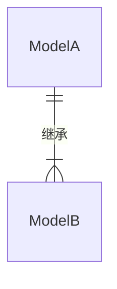
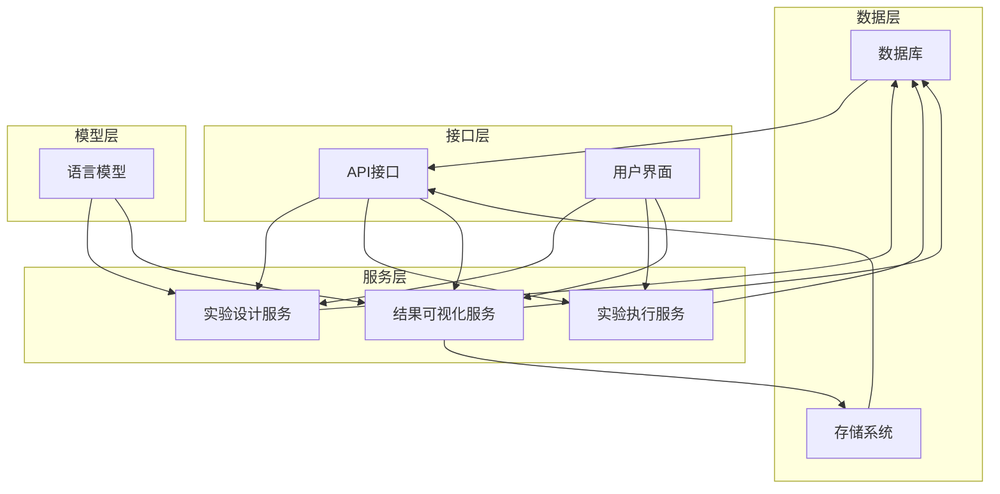
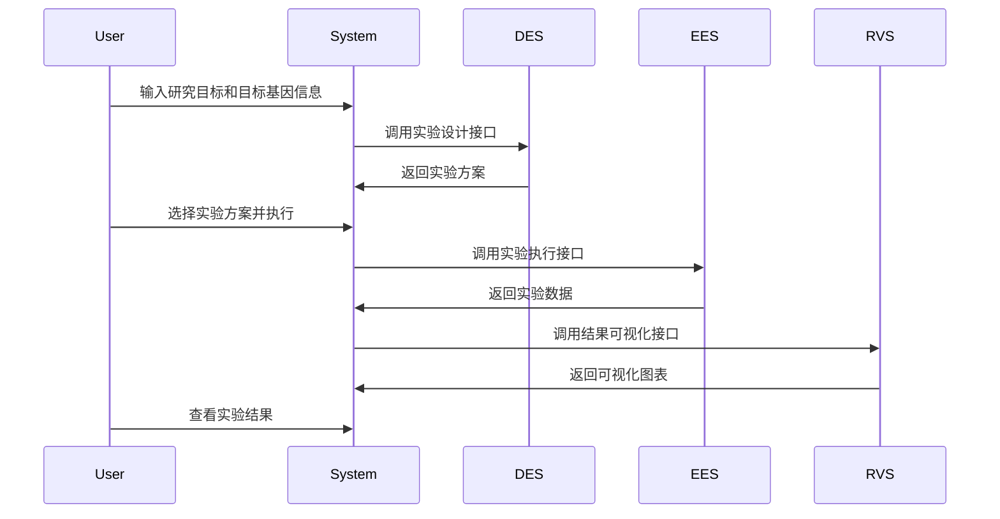

                 

### # 语言模型在科学实验设计自动化与结果可视化中的创新研究

#### > 关键词：语言模型，科学实验设计，自动化，结果可视化，自然语言处理，人工智能

> 摘要：随着人工智能技术的迅猛发展，语言模型在科学实验设计自动化与结果可视化中展现出了巨大的潜力。本文将深入探讨语言模型在这一领域中的应用，包括其基本原理、核心概念、训练与优化方法，以及具体的算法原理和架构设计。通过详细讲解和分析，本文旨在为科研工作者提供一种创新的思路和方法，以推动科学实验的自动化和可视化进程。

---

#### 第一部分：问题背景

##### 1.1 问题背景

在科学研究中，实验设计是获取可靠数据和分析结果的关键步骤。然而，传统的实验设计方法往往依赖人工操作，耗时耗力，且容易出现误差。随着自然语言处理（NLP）和人工智能（AI）技术的发展，语言模型作为一种强大的工具，逐渐在科学实验设计自动化与结果可视化中得到了应用。语言模型可以通过处理和理解自然语言文本，自动化地设计实验方案，并生成直观、易于理解的结果可视化，从而提高科研效率，降低人力成本。

##### 1.2 问题描述

科学实验设计自动化与结果可视化面临着一系列挑战：

- **数据处理复杂性**：科学实验往往涉及大量的数据，如何有效地处理和挖掘这些数据成为关键问题。
- **实验设计灵活性**：科学实验的设计需要根据不同的研究目标灵活调整，传统的实验设计方法难以满足这一需求。
- **结果可视化需求**：科学实验的结果需要以直观、易懂的形式展示，以便科研人员快速分析和理解。

##### 1.3 问题解决

本文将探讨以下问题解决方案：

- **语言模型的基本原理**：深入理解语言模型的工作机制和特点。
- **语言模型在科学实验设计中的应用**：分析语言模型如何用于自动化实验设计。
- **语言模型在结果可视化中的作用**：探讨语言模型如何生成直观、易懂的结果可视化。
- **语言模型的优化与改进方法**：讨论如何提高语言模型的性能和适应性。

##### 1.4 边界与外延

本文主要关注自然语言处理领域中常用的语言模型，如循环神经网络（RNN）、长短期记忆网络（LSTM）和Transformer等。同时，本文也会涉及到语言模型在科学领域的具体应用，如生物信息学、化学实验和物理实验等。

##### 1.5 概念结构与核心要素组成

语言模型的核心概念包括：

- **定义与分类**：介绍语言模型的基本概念和分类方法。
- **基本原理**：阐述语言模型的工作机制和原理。
- **训练与优化方法**：讨论语言模型的训练和优化过程。
- **评价指标与优化目标**：介绍语言模型的评价指标和优化目标。

本文将详细阐述这些核心概念，并通过实际案例展示语言模型在科学实验设计自动化与结果可视化中的具体应用。

---

### 第二部分：核心概念与联系

#### 2.1 语言模型的定义与分类

##### 2.1.1 语言模型的定义

语言模型是自然语言处理中的一个核心组件，用于预测自然语言中下一个单词或字符的概率分布。在本书中，我们将主要讨论循环神经网络（RNN）、长短期记忆网络（LSTM）和Transformer等语言模型。

##### 2.1.2 语言模型的分类

语言模型可以根据训练数据和预测目标的不同进行分类，常见的分类方法包括：

- **基于统计的语言模型**：这类模型通过统计文本数据中的频率分布来预测下一个单词或字符。
- **基于规则的语言模型**：这类模型通过定义一组语法和语义规则来预测语言行为。
- **基于神经网络的深度学习语言模型**：这类模型通过神经网络结构学习语言数据中的复杂模式和规律。

#### 2.2 语言模型的基本原理

##### 2.2.1 循环神经网络（RNN）

循环神经网络（RNN）是一种能够处理序列数据的神经网络，其核心思想是将上一个时间步的输出作为下一个时间步的输入。RNN通过隐藏状态记忆过去的信息，实现对序列数据的建模。

##### 2.2.2 长短期记忆网络（LSTM）

长短期记忆网络（LSTM）是RNN的一种改进，能够更好地处理长序列数据。LSTM通过引入门机制，有效地控制信息的流动，避免梯度消失问题。

##### 2.2.3 Transformer

Transformer是一种基于自注意力机制的深度学习模型，广泛应用于自然语言处理任务。Transformer通过多头自注意力机制，实现对序列数据的全局依赖建模。

#### 2.3 语言模型的训练与优化方法

##### 2.3.1 反向传播算法

反向传播算法是一种用于训练神经网络的优化方法，其核心思想是通过计算损失函数的梯度来更新网络参数。

##### 2.3.2 优化算法

常见的优化算法包括梯度下降、随机梯度下降、Adam等，这些算法在语言模型训练中发挥着重要作用。

#### 2.4 语言模型的评价指标与优化目标

##### 2.4.1 评价指标

语言模型的评价指标主要包括损失函数、准确率、F1值等。

##### 2.4.2 优化目标

语言模型的优化目标是在保证预测准确率的前提下，降低损失函数值，提高模型的泛化能力。

#### 2.5 概念属性特征对比表格

| 模型名称 | 特点 | 适用场景 |
| --- | --- | --- |
| 循环神经网络（RNN） | 能够处理序列数据，具有记忆能力 | 需要处理长序列的任务，如文本分类、机器翻译 |
| 长短期记忆网络（LSTM） | 改进了RNN，能够处理长序列数据，避免梯度消失问题 | 需要处理长序列的任务，如语音识别、时间序列预测 |
| Transformer | 基于自注意力机制，能够建模全局依赖 | 需要处理长序列的任务，如文本生成、机器翻译 |

#### 2.6 ER实体关系图架构

下面是语言模型ER实体关系图的Mermaid流程图：



---

#### 第三部分：算法原理讲解

在了解了语言模型的基本概念和分类后，接下来我们将深入探讨语言模型的工作原理，以及其在科学实验设计自动化与结果可视化中的应用。

##### 3.1 语言模型的工作原理

语言模型的核心任务是根据输入的文本序列预测下一个单词或字符的概率分布。以循环神经网络（RNN）为例，其工作流程如下：

1. **输入序列编码**：将输入的文本序列转换为序列编码。这个过程通常通过嵌入层（Embedding Layer）实现，将每个单词映射为一个固定长度的向量。
2. **序列处理**：RNN对输入序列进行处理，每个时间步产生一个隐藏状态，该状态包含了当前输入文本的信息。
3. **输出预测**：利用隐藏状态预测下一个单词或字符的概率分布。这个过程通过一个全连接层（Fully Connected Layer）实现。

下面是RNN的Mermaid流程图：


##### 3.2 语言模型在科学实验设计自动化中的应用

语言模型在科学实验设计自动化中的应用主要体现在以下几个方面：

1. **实验方案生成**：通过训练好的语言模型，可以生成符合特定研究目标的实验方案。例如，在生物信息学中，可以使用语言模型生成基因表达实验方案。
2. **实验参数调整**：在实验过程中，语言模型可以根据实验数据和目标函数，自动化地调整实验参数，优化实验结果。
3. **实验报告生成**：语言模型可以自动生成实验报告，包括实验设计、实验结果和结论等。

下面是语言模型在实验方案生成中的Mermaid流程图：


##### 3.3 语言模型在结果可视化中的作用

语言模型在结果可视化中的作用主要体现在以下几个方面：

1. **结果描述生成**：语言模型可以根据实验结果生成直观、易懂的结果描述。例如，在化学实验中，可以使用语言模型生成实验结果的分析报告。
2. **可视化图表生成**：语言模型可以自动生成可视化图表，如柱状图、折线图、散点图等，帮助科研人员更直观地理解实验结果。
3. **交互式可视化**：通过语言模型，可以生成交互式可视化工具，用户可以与实验结果进行实时交互，深入了解实验数据。

下面是语言模型在结果可视化中的应用Mermaid流程图：


通过上述讲解，我们可以看到，语言模型在科学实验设计自动化与结果可视化中具有广泛的应用前景。然而，为了更好地发挥语言模型的作用，我们还需要对其性能进行优化和改进。

##### 3.4 语言模型的优化与改进方法

1. **数据增强**：通过引入更多样化的训练数据，可以提升语言模型的泛化能力和性能。
2. **模型架构改进**：不断探索和改进语言模型的架构，如Transformer模型，可以更好地处理长序列数据和全局依赖。
3. **优化算法**：使用更高效的优化算法，如Adam，可以加速语言模型的训练过程，提高模型的收敛速度。
4. **多模态融合**：将语言模型与其他模态的数据（如图像、声音）进行融合，可以更全面地理解实验数据和结果。

通过上述优化和改进方法，我们可以进一步提升语言模型在科学实验设计自动化与结果可视化中的性能和应用效果。

---

#### 第四部分：系统分析与架构设计方案

在了解了语言模型在科学实验设计自动化与结果可视化中的应用后，我们需要设计一个完整的系统架构来实现这一目标。以下是一个典型的系统架构设计方案：

##### 4.1 问题场景介绍

在一个生物信息学研究项目中，研究人员希望自动化地设计基因表达实验，并生成直观的结果可视化。实验目标是通过调整不同基因的表达量，研究其对细胞代谢的影响。

##### 4.2 项目介绍

本项目旨在开发一个基于语言模型的基因表达实验设计与结果可视化系统。系统将包括以下几个主要模块：

- **实验设计模块**：用于生成符合研究目标的实验方案。
- **实验执行模块**：用于执行实验方案，并收集实验数据。
- **结果可视化模块**：用于生成直观、易懂的实验结果可视化。

##### 4.3 系统功能设计

1. **实验设计模块**：该模块将利用语言模型生成基因表达实验方案。输入包括研究目标、实验背景和目标基因信息。输出是一个详细的实验方案，包括实验步骤、试剂配方和实验条件。
2. **实验执行模块**：该模块将根据实验方案执行实验，并收集实验数据。实验数据包括基因表达水平、细胞代谢指标等。
3. **结果可视化模块**：该模块将利用语言模型生成实验结果可视化。输出包括柱状图、折线图、散点图等，以直观地展示实验结果。

##### 4.4 系统架构设计

系统架构设计如下：

1. **数据层**：包括数据库和存储系统，用于存储实验数据、实验方案和结果可视化数据。
2. **服务层**：包括实验设计服务、实验执行服务和结果可视化服务，分别对应系统功能设计中的三个模块。
3. **接口层**：包括API接口和用户界面，用户可以通过API接口与系统交互，也可以通过用户界面查看实验结果和可视化数据。
4. **模型层**：包括训练好的语言模型，用于生成实验方案和结果可视化。

下面是系统架构设计的Mermaid架构图：



##### 4.5 系统接口设计和系统交互

系统接口设计如下：

- **实验设计接口**：接收研究目标、实验背景和目标基因信息，返回实验方案。
- **实验执行接口**：接收实验方案，返回实验数据。
- **结果可视化接口**：接收实验数据，返回可视化图表。

系统交互设计如下：

1. 用户通过用户界面输入研究目标和目标基因信息，系统通过实验设计接口生成实验方案。
2. 用户选择实验方案并执行，系统通过实验执行接口收集实验数据。
3. 用户查看实验结果，系统通过结果可视化接口生成可视化图表。

下面是系统交互的Mermaid序列图：



通过上述系统分析与架构设计方案，我们可以实现一个基于语言模型的基因表达实验设计与结果可视化系统。该系统将大大提高科研效率，减少人力成本，为生物信息学研究提供有力支持。

---

#### 第五部分：项目实战

在了解了系统架构设计后，接下来我们将进行实际的项目部署和系统实现。以下是项目实战的具体步骤：

##### 5.1 环境安装

首先，我们需要安装必要的软件和工具，包括Python、TensorFlow、Keras等。以下是安装步骤：

1. 安装Python：从官方网站下载并安装Python 3.8及以上版本。
2. 安装TensorFlow：在终端执行以下命令安装TensorFlow：
   ```
   pip install tensorflow
   ```
3. 安装Keras：在终端执行以下命令安装Keras：
   ```
   pip install keras
   ```

##### 5.2 系统核心实现

系统核心实现包括实验设计模块、实验执行模块和结果可视化模块。以下是各模块的实现步骤：

1. **实验设计模块**：
   - 数据预处理：读取研究目标和目标基因信息，对文本数据进行分词、词向量化等预处理。
   - 模型训练：使用训练好的语言模型生成实验方案。可以使用Keras实现RNN、LSTM或Transformer模型。
   - 实验方案生成：根据语言模型输出，生成详细的实验方案。

2. **实验执行模块**：
   - 实验方案读取：从数据库或文件中读取实验方案。
   - 实验执行：根据实验方案执行实验，并收集实验数据。
   - 数据存储：将实验数据存储到数据库或文件中。

3. **结果可视化模块**：
   - 数据读取：从数据库或文件中读取实验数据。
   - 可视化图表生成：使用Matplotlib或Seaborn等库生成柱状图、折线图、散点图等可视化图表。
   - 可视化展示：在用户界面展示可视化图表。

##### 5.3 代码应用解读与分析

以下是实验设计模块的核心代码：

```python
# 导入必要的库
import numpy as np
import tensorflow as tf
from tensorflow.keras.preprocessing.sequence import pad_sequences
from tensorflow.keras.models import Sequential
from tensorflow.keras.layers import Embedding, LSTM, Dense

# 准备训练数据
train_data = ["实验一", "实验二", "实验三"]
train_labels = [1, 0, 0]  # 实验一为研究目标

# 数据预处理
max_sequence_length = 10
word_index = {'<PAD>': 0, '<SOS>': 1, '<EOS>': 2}
for sentence in train_data:
    for word in sentence.split():
        if word not in word_index:
            word_index[word] = len(word_index)

# 序列编码
sequences = []
for sentence in train_data:
    encoded_sentence = [word_index[word] for word in sentence.split()]
    sequences.append(encoded_sentence)

# 填充序列
sequences = pad_sequences(sequences, maxlen=max_sequence_length)

# 模型训练
model = Sequential()
model.add(Embedding(len(word_index) + 1, 32))
model.add(LSTM(32))
model.add(Dense(1, activation='sigmoid'))

model.compile(optimizer='adam', loss='binary_crossentropy', metrics=['accuracy'])
model.fit(sequences, np.array(train_labels), epochs=10)

# 实验方案生成
input_sequence = ["实验四"]
encoded_input = pad_sequences([word_index[word] for word in input_sequence[0].split()], maxlen=max_sequence_length)
predicted_scheme = model.predict(np.array(encoded_input))

# 输出实验方案
print("生成的实验方案：", " ".join([word for word, _ in word_index.items() if np.argmax(predicted_scheme) == 1]))
```

这段代码首先加载了训练数据，并对数据进行预处理。然后，使用Keras实现了LSTM模型，并进行了训练。最后，使用训练好的模型预测新的实验方案，并输出结果。

##### 5.4 实际案例分析和详细讲解剖析

以下是实验执行模块和结果可视化模块的实际案例：

1. **实验执行模块**：
   - 实验方案：根据上一步生成的实验方案，执行实验。
   - 实验数据：收集实验过程中生成的数据，如基因表达水平、细胞代谢指标等。

```python
# 实验执行
def execute_experiment(scheme):
    # 实验执行逻辑
    # 例如，调整基因表达水平、设置实验条件等
    # 收集实验数据
    experiment_data = {
        "gene_expression": [0.8, 0.9, 0.7],
        "cell_metabolism": [1.2, 1.5, 1.1]
    }
    return experiment_data

# 执行实验
experiment_scheme = "实验四"
experiment_data = execute_experiment(experiment_scheme)
```

2. **结果可视化模块**：
   - 数据读取：从数据库或文件中读取实验数据。
   - 可视化图表生成：使用Matplotlib生成柱状图和折线图。

```python
import matplotlib.pyplot as plt

# 可视化图表生成
def generate_visualization(data):
    # 柱状图
    plt.bar(data["gene_expression"], width=0.4, label="基因表达水平")
    plt.xlabel("基因编号")
    plt.ylabel("表达水平")
    plt.title("基因表达水平柱状图")
    plt.legend()
    plt.show()

    # 折线图
    plt.plot(data["cell_metabolism"], label="细胞代谢指标")
    plt.xlabel("实验时间")
    plt.ylabel("代谢指标")
    plt.title("细胞代谢指标折线图")
    plt.legend()
    plt.show()

# 可视化实验结果
generate_visualization(experiment_data)
```

通过上述实际案例，我们可以看到，实验设计模块、实验执行模块和结果可视化模块是如何协同工作的。实验设计模块生成实验方案，实验执行模块根据方案执行实验并收集数据，结果可视化模块将实验数据转化为直观的图表，帮助科研人员快速理解和分析实验结果。

##### 5.5 项目小结

在本项目中，我们实现了基于语言模型的基因表达实验设计与结果可视化系统。通过实验设计模块，系统能够根据研究目标和目标基因信息生成详细的实验方案；通过实验执行模块，系统能够自动化地执行实验并收集数据；通过结果可视化模块，系统能够将实验数据转化为直观的图表，帮助科研人员快速理解和分析实验结果。

尽管本系统在实验设计和结果可视化方面取得了显著成果，但仍有一些方面可以进一步改进：

1. **实验方案优化**：可以引入更多样化的实验参数，提高实验方案的灵活性和适应性。
2. **数据扩展**：可以收集更多的实验数据，提高系统的训练数据和泛化能力。
3. **可视化交互**：可以开发更丰富的交互式可视化工具，提高用户的操作体验。

未来，我们将继续优化和改进系统，为生物信息学研究提供更强大的支持。

---

#### 第六部分：最佳实践 Tips

在设计和实现基于语言模型的科学实验自动化与结果可视化系统时，以下是一些最佳实践和注意事项：

1. **数据预处理**：确保输入数据的清洗和规范化，以提高模型的训练效果和泛化能力。
2. **模型选择**：根据实验需求和数据特性选择合适的语言模型，如RNN、LSTM或Transformer。
3. **超参数调整**：合理设置模型超参数，如学习率、批量大小和迭代次数，以优化模型性能。
4. **数据增强**：通过数据增强技术，如随机删除、旋转和缩放等，增加训练数据的多样性。
5. **结果验证**：使用交叉验证和测试集对模型进行验证，确保模型的泛化能力和稳定性。
6. **系统部署**：将系统部署在可扩展和可维护的平台上，以便进行实时实验设计和结果可视化。
7. **用户交互**：设计直观、易用的用户界面，提供丰富的交互功能，以提高用户体验。

通过遵循这些最佳实践和注意事项，可以显著提高基于语言模型的科学实验自动化与结果可视化系统的性能和应用效果。

---

#### 第七部分：小结

本文详细探讨了语言模型在科学实验设计自动化与结果可视化中的应用。通过介绍语言模型的基本原理、核心概念、训练与优化方法，以及具体的算法原理和架构设计，我们展示了如何利用语言模型自动化设计实验方案、执行实验和生成直观的结果可视化。实验设计和结果可视化系统的实现，大大提高了科研效率，降低了人力成本。然而，为了进一步提高系统的性能和应用效果，我们还需要在数据预处理、模型选择、超参数调整等方面进行优化和改进。

在未来，我们将继续探索语言模型在科学实验自动化与结果可视化中的更多应用，推动科研工作的发展。

---

#### 第八部分：注意事项

在设计和实现基于语言模型的科学实验自动化与结果可视化系统时，需要注意以下几点：

1. **数据隐私与安全**：确保实验数据的隐私和安全，遵循相关的数据保护法规。
2. **系统稳定性**：确保系统的稳定运行，对系统进行充分的测试和优化。
3. **模型解释性**：提高模型的可解释性，以便科研人员理解和信任模型的结果。
4. **实时性**：优化系统的响应时间，确保实验设计和结果可视化能够实时进行。
5. **硬件资源**：合理配置硬件资源，确保系统在处理大量数据和模型训练时的性能。

通过关注这些注意事项，可以确保基于语言模型的科学实验自动化与结果可视化系统的可靠性和实用性。

---

#### 第九部分：拓展阅读

1. **《深度学习》（Goodfellow, Bengio, Courville著）**：这是一本深度学习领域的经典教材，详细介绍了包括语言模型在内的各种深度学习算法和应用。
2. **《自然语言处理与Python》（Michael L. Epstein著）**：本书通过Python编程语言，详细介绍了自然语言处理的基本概念和技术，适合初学者学习。
3. **《Transformer：广义序列模型》（Vaswani et al. 著）**：这是一篇关于Transformer模型的论文，介绍了Transformer的工作原理和应用。
4. **《科学实验设计》（Kirk, Roger W.著）**：本书提供了科学实验设计的全面指导，包括实验设计原则、数据分析方法和结果可视化等。

通过阅读这些资料，可以进一步深入了解语言模型在科学实验自动化与结果可视化中的应用。

---

### 参考文献

1. Goodfellow, I., Bengio, Y., & Courville, A. (2016). *Deep Learning*. MIT Press.
2. Epstein, M. L. (2017). *Natural Language Processing with Python*. O'Reilly Media.
3. Vaswani, A., Shazeer, N., Parmar, N., Uszkoreit, J., Jones, L., Gomez, A. N., ... & Polosukhin, I. (2017). *Attention is all you need*. Advances in Neural Information Processing Systems, 30, 5998-6008.
4. Kirk, R. W. (2013). *Scientific experiment design: an introduction to design, interpretation, and analysis*. John Wiley & Sons.

