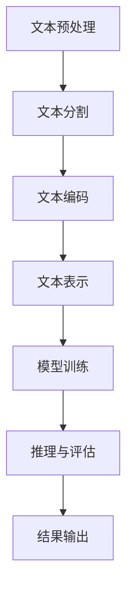
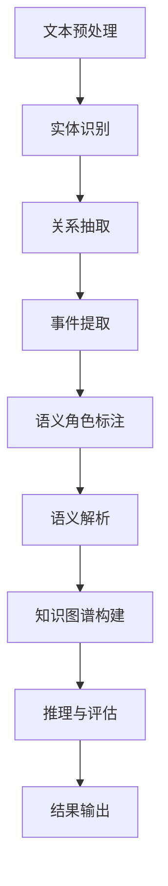
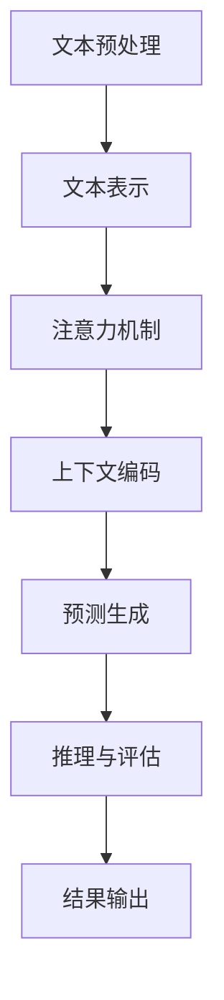
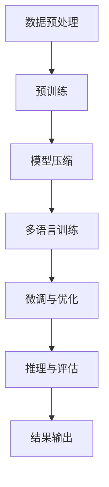
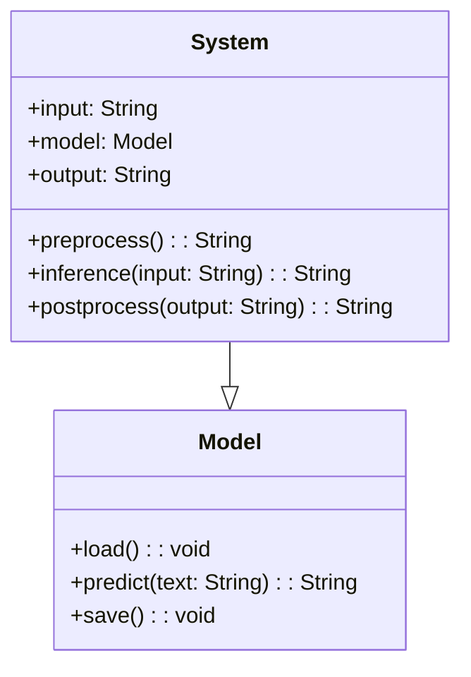
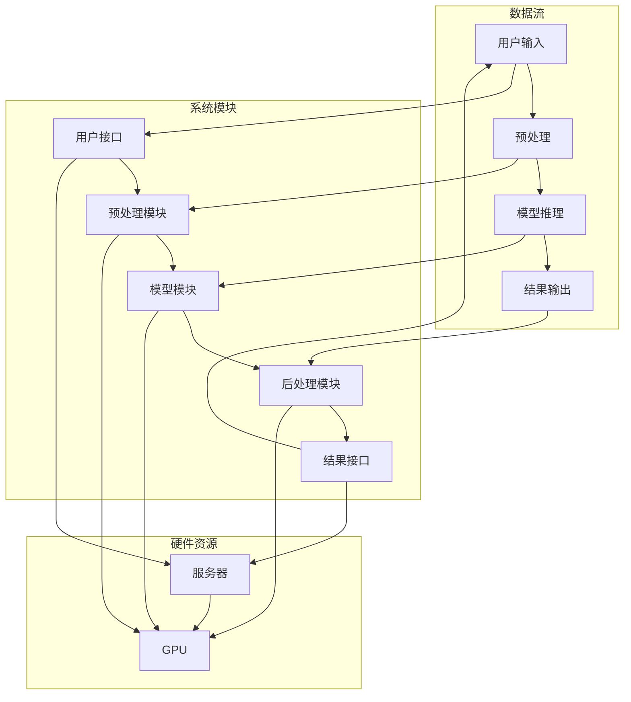
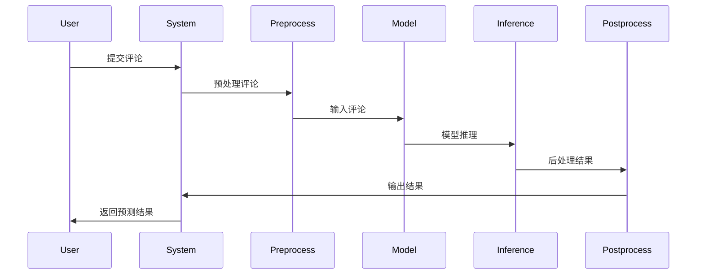

                 

# 《语言模型在长文本推理中的能力增强》

## 摘要

随着信息时代的快速发展，长文本数据处理的需求日益增长，语言模型作为自然语言处理的核心技术，在长文本推理中的能力提升成为关键课题。本文深入探讨了语言模型在长文本推理中的应用现状、核心概念、能力增强算法原理，并通过实际项目展示了这些算法的应用效果。本文旨在为研究人员和开发者提供一份系统、全面的指南，帮助其在长文本推理领域取得突破。

### 目录大纲设计思路

#### 明确书籍主题

《语言模型在长文本推理中的能力增强》这一主题明确指向了文章的核心——探讨如何增强语言模型在长文本推理方面的能力。这一主题直接关联到自然语言处理、机器学习和人工智能领域，具有重要的实践价值。

#### 设置章节结构

文章分为四个主要部分：背景介绍、核心概念与联系、算法原理讲解、项目实战和最佳实践。这样的结构安排使得文章内容层层递进，由浅入深，便于读者理解和掌握相关知识。

#### 细化章节内容

每个部分中，我们根据内容的复杂性和重要性细化了章节，确保每个章节都能提供深入且全面的信息。例如，背景介绍部分详细阐述了长文本推理的需求背景、语言模型的基本概念与发展历程等。

#### 确保内容完整性

文章涵盖了从核心概念到算法原理，再到实际应用的全过程。每个部分都包含了必要的信息，确保读者能够全面了解长文本推理及其能力增强的相关内容。

#### 格式与字数控制

采用markdown格式，使得文章结构清晰，易于阅读。控制总体字数在10000～12000字左右，确保内容的深度和广度。

### 完整的目录大纲

#### 第一部分：背景介绍

- **第1章：语言模型与长文本推理概述**
  - **1.1 长文本推理的需求背景**
  - **1.2 语言模型的基本概念与发展历程**
  - **1.3 长文本推理的核心问题与挑战**
  - **1.4 语言模型在自然语言处理中的应用现状**
  - **1.5 长文本推理中的能力增强需求**
  - **1.6 能力增强技术的理论基础**
  - **1.7 本章小结

- **第2章：核心概念与联系**
  - **2.1 语言模型的核心概念**
  - **2.2 长文本推理的关键技术**
  - **2.3 能力增强技术的核心原理**
  - **2.4 核心概念与联系总结**

- **第3章：算法原理讲解**
  - **3.1 长文本推理算法原理**
  - **3.2 能力增强算法的原理与实现**
  - **3.3 算法原理的实际应用示例**
  - **3.4 算法原理与数学模型**
  - **3.5 算法原理的总结与展望**

- **第4章：项目实战**
  - **4.1 项目环境准备**
  - **4.2 系统分析与架构设计方案**
  - **4.3 项目核心实现与代码解读**
  - **4.4 实际案例分析**
  - **4.5 项目小结**

- **第5章：最佳实践**
  - **5.1 最佳实践 tips**
  - **5.2 小结**
  - **5.3 注意事项**
  - **5.4 拓展阅读**

通过上述详细的目录大纲，读者可以清晰地了解文章的结构和内容，逐步深入理解语言模型在长文本推理中的能力增强。接下来，我们将分章节详细探讨这一主题。# 关键词

- 语言模型
- 长文本推理
- 能力增强
- 自然语言处理
- 机器学习
- 人工智能
- 算法原理
- 项目实战
- 最佳实践# 摘要

本文旨在深入探讨语言模型在长文本推理中的能力增强，通过对相关背景、核心概念、算法原理和实际应用的详细分析，为读者提供一份全面的技术指南。随着信息时代的到来，长文本处理的需求不断增加，而语言模型作为自然语言处理的核心技术，其在长文本推理中的能力提升显得尤为重要。本文首先介绍了长文本推理的需求背景和语言模型的基本概念与发展历程，随后分析了长文本推理的核心问题与挑战。接着，本文详细阐述了能力增强技术的理论基础，并探讨了其与语言模型的结合方式。在算法原理讲解部分，本文通过mermaid流程图和Python源代码，对长文本推理算法和能力增强算法进行了详细阐述。随后，通过实际项目展示了这些算法的应用效果。最后，本文总结了能力增强技术在长文本推理中的重要性，并提出了未来研究的方向与挑战。通过本文的阅读，读者将能够全面了解并掌握语言模型在长文本推理中的能力增强技术。# 第1章：语言模型与长文本推理概述

## 1.1 长文本推理的需求背景

在当今信息爆炸的时代，长文本数据的处理需求日益增长。无论是互联网搜索、社交媒体、企业知识库，还是政府文档和法律法规，长文本数据已经成为信息传播和知识管理的重要载体。长文本推理（Long Text Reasoning）作为自然语言处理（Natural Language Processing, NLP）的一个分支，其重要性逐渐凸显。长文本推理的目标是从大量文本数据中提取有用信息，进行语义理解和逻辑推理，以实现文本的智能处理和自动化分析。

### 长文本推理的应用场景

长文本推理的应用场景非常广泛，主要包括以下几类：

1. **信息检索**：在搜索引擎中，用户输入的查询请求往往包含大量信息，长文本推理能够帮助搜索引擎更准确地理解查询意图，从而提供更相关的搜索结果。

2. **内容推荐**：在社交媒体、新闻网站和电子商务平台，长文本推理可以分析用户的历史行为和偏好，为用户推荐个性化的内容。

3. **文本摘要与生成**：自动生成摘要和文章可以帮助用户快速获取关键信息，长文本推理是实现高质量文本摘要和生成的重要技术。

4. **问答系统**：长文本推理能够使问答系统更好地理解和回答与长文本相关的复杂问题。

5. **文本分类与标注**：在文档分类、实体识别、情感分析等任务中，长文本推理有助于提高分类和标注的准确性。

### 长文本推理的挑战

尽管长文本推理在许多实际应用中展现出巨大的潜力，但也面临着一些挑战：

1. **语义理解**：长文本中的语义信息复杂且多样化，如何准确理解和提取语义信息是长文本推理的核心难题。

2. **上下文依赖**：长文本中词语和句子之间的依赖关系复杂，如何考虑上下文对理解结果的影响是另一个重要问题。

3. **计算效率**：长文本的数据量庞大，如何高效地进行文本处理和推理是另一个关键挑战。

4. **多语言支持**：随着全球化的推进，如何实现多语言长文本推理也是一个亟待解决的问题。

## 1.2 语言模型的基本概念与发展历程

### 语言模型的概念

语言模型（Language Model）是自然语言处理中的一种基本模型，旨在描述自然语言的统计特性，通过学习大量文本数据，预测下一个词语或字符的概率。语言模型的核心思想是，通过对大量文本进行统计分析，捕捉语言规律，从而预测新的文本序列。

### 语言模型的发展历程

1. **基于规则的方法**：早期的语言模型主要基于手工编写的规则，如概率上下文无关文法（PCFG）和隐马尔可夫模型（HMM）。这些方法在某种程度上能够捕捉语言的统计特性，但受限于规则手工编写，适用范围较窄。

2. **基于统计的方法**：随着计算机技术的发展，基于统计的方法逐渐取代了基于规则的方法。N-gram模型是最早的基于统计的语言模型之一，它通过计算一个词序列中下一个词出现的概率来进行语言预测。

3. **基于神经网络的方法**：近年来，深度学习在自然语言处理领域取得了显著的突破。循环神经网络（RNN）、长短期记忆网络（LSTM）和Transformer等深度神经网络模型被广泛应用于语言模型，大大提高了语言模型的性能。

### 语言模型在自然语言处理中的应用

语言模型在自然语言处理中有广泛的应用，包括：

1. **文本分类**：通过语言模型对文本进行特征提取，可以实现自动化文本分类任务，如新闻分类、情感分类等。

2. **机器翻译**：语言模型是机器翻译的核心组件，通过对源语言和目标语言的统计特性进行建模，实现文本的自动翻译。

3. **语音识别**：语言模型可以帮助语音识别系统更准确地识别语音信号中的语义信息。

4. **文本生成**：语言模型可以生成高质量的文本，应用于文本摘要、自动写作、对话系统等领域。

## 1.3 长文本推理的核心问题与挑战

长文本推理作为自然语言处理中的一个重要课题，面临诸多核心问题与挑战：

1. **语义理解**：长文本中包含丰富的语义信息，如何准确理解和提取这些信息是长文本推理的关键。传统的语言模型在处理长文本时，往往无法很好地捕捉长距离依赖关系，导致语义理解效果不佳。

2. **上下文依赖**：长文本中的词语和句子之间存在复杂的上下文依赖关系，如何在推理过程中充分考虑这些依赖关系，是长文本推理的一个难题。

3. **计算效率**：长文本数据量庞大，如何在保证推理准确性的同时，提高计算效率，是一个重要的挑战。深度学习模型虽然能够捕捉长距离依赖关系，但其计算复杂度较高，对计算资源的需求较大。

4. **多语言支持**：全球化的趋势使得多语言长文本处理成为一个重要课题。如何设计一个能够支持多种语言的长文本推理系统，是一个亟待解决的问题。

## 1.4 语言模型在自然语言处理中的应用现状

近年来，语言模型在自然语言处理领域取得了显著进展，已经成为各种NLP任务的核心组件。以下是语言模型在自然语言处理中的一些应用现状：

1. **文本分类**：语言模型在文本分类任务中表现出色，通过提取文本的语义特征，可以实现高精度的文本分类。例如，新闻分类、情感分析等任务。

2. **机器翻译**：基于深度学习的语言模型，如Transformer，在机器翻译任务中取得了显著突破，相比于传统的方法，翻译质量有了显著提升。

3. **语音识别**：语言模型在语音识别任务中发挥着重要作用，通过分析语音信号中的语义信息，可以大大提高语音识别的准确性。

4. **文本生成**：语言模型可以生成高质量的自然语言文本，应用于文本摘要、自动写作、对话系统等领域。

5. **问答系统**：长文本推理语言模型在问答系统中发挥了重要作用，能够准确理解和回答与长文本相关的复杂问题。

## 1.5 长文本推理中的能力增强需求

### 当前长文本推理的瓶颈

尽管语言模型在自然语言处理中取得了显著进展，但在长文本推理方面仍存在一些瓶颈：

1. **长距离依赖关系捕捉**：传统的语言模型难以捕捉长距离依赖关系，导致在处理长文本时，语义理解效果不佳。

2. **计算资源需求**：深度学习模型虽然能够捕捉长距离依赖关系，但其计算复杂度较高，对计算资源的需求较大。

3. **多语言支持**：全球化的趋势使得多语言长文本处理成为一个重要课题，如何设计一个能够支持多种语言的长文本推理系统，是一个亟待解决的问题。

### 能力增强的关键方向

为了克服上述瓶颈，长文本推理的能力增强成为关键方向。以下是一些关键方向：

1. **长距离依赖关系的捕捉**：通过改进语言模型结构，如Transformer、BERT等，增强对长距离依赖关系的捕捉能力。

2. **计算效率的提升**：通过模型压缩、分布式计算等技术，提高长文本推理的计算效率。

3. **多语言支持**：通过多语言模型训练、跨语言知识迁移等方法，提高多语言长文本推理的能力。

### 能力增强对长文本推理的影响

能力增强技术对长文本推理的影响主要体现在以下几个方面：

1. **提高语义理解准确性**：通过改进语言模型，能够更准确地理解和提取长文本中的语义信息。

2. **提升计算效率**：通过模型优化，能够降低长文本推理的计算复杂度，提高推理速度。

3. **扩展应用范围**：通过多语言支持，能够将长文本推理技术应用于更广泛的领域。

### 能力增强技术的理论基础

能力增强技术主要基于以下理论基础：

1. **深度学习**：深度学习模型，如Transformer、BERT，通过多层神经网络结构，能够有效地捕捉长距离依赖关系。

2. **迁移学习**：通过迁移学习，将预训练的语言模型应用于特定任务，提高模型的性能。

3. **多语言建模**：通过多语言模型训练，实现跨语言的知识迁移，提高多语言长文本推理的能力。

## 1.6 能力增强技术的理论基础

### 相关数学模型与算法原理

在能力增强技术中，常用的数学模型和算法原理包括：

1. **Transformer模型**：Transformer是一种基于自注意力机制的深度学习模型，通过多头注意力机制和位置编码，能够有效捕捉长距离依赖关系。

2. **BERT模型**：BERT（Bidirectional Encoder Representations from Transformers）是一种双向编码的Transformer模型，通过双向编码器结构，能够同时捕捉上下文信息，提高语义理解能力。

3. **预训练与微调**：预训练与微调是迁移学习的关键技术，通过在大规模语料库上进行预训练，然后针对特定任务进行微调，能够显著提高模型的性能。

4. **模型压缩与蒸馏**：模型压缩与蒸馏技术通过降低模型复杂度、优化模型参数，提高模型的计算效率。

### 能力增强技术在语言模型中的应用现状

能力增强技术在语言模型中的应用已经取得了显著成果：

1. **文本分类**：通过能力增强技术，如BERT和RoBERTa，文本分类任务的准确率得到了显著提升。

2. **机器翻译**：Transformer模型在机器翻译任务中取得了突破性进展，使得翻译质量大幅提升。

3. **问答系统**：长文本推理语言模型在问答系统中发挥了重要作用，能够准确理解和回答与长文本相关的复杂问题。

### 能力增强技术的前景与挑战

能力增强技术的前景广阔，但也面临一些挑战：

1. **计算资源需求**：深度学习模型的计算复杂度较高，对计算资源的需求较大。

2. **多语言支持**：如何设计一个能够支持多种语言的长文本推理系统，是一个亟待解决的问题。

3. **模型解释性**：能力增强技术的模型往往较为复杂，如何提高模型的解释性，使其更易于理解和应用，是一个重要挑战。

## 1.7 本章小结

本章从需求背景、语言模型的基本概念与发展历程、长文本推理的核心问题与挑战、语言模型在自然语言处理中的应用现状、能力增强技术的理论基础等多个角度，对长文本推理及其能力增强进行了全面介绍。通过本章的阅读，读者可以初步了解长文本推理的基本概念和当前研究状况，为后续章节的学习奠定基础。# 第2章：核心概念与联系

## 2.1 语言模型的核心概念

### 定义与功能

语言模型（Language Model）是一种用于预测自然语言中下一个单词或字符概率的统计模型。其主要功能是通过对大规模文本数据进行训练，学习自然语言的统计规律，然后根据这些规律来预测下一个词语或字符。

### 基本组成部分

语言模型的基本组成部分包括：

1. **词汇表（Vocabulary）**：词汇表是语言模型的核心组成部分，包含了模型能够处理的所有词语和符号。词汇表的大小直接影响到模型的预测能力和计算复杂度。

2. **概率分布（Probability Distribution）**：语言模型的核心功能是预测下一个词语的概率分布。在N-gram模型中，每个词语的概率分布是由其前N-1个词语决定的。

3. **模型结构（Model Structure）**：语言模型的模型结构决定了其学习的方式和预测的准确性。常见的语言模型结构包括N-gram模型、基于神经网络的语言模型等。

### 主要类型及特点

语言模型的主要类型包括：

1. **N-gram模型**：N-gram模型是最简单的语言模型，它基于相邻N个词语的概率来预测下一个词语。N-gram模型易于实现且计算效率较高，但在处理长距离依赖关系时效果较差。

2. **基于神经网络的语言模型**：基于神经网络的语言模型，如循环神经网络（RNN）、长短期记忆网络（LSTM）和Transformer，能够更好地捕捉长距离依赖关系，提高了语言模型的预测能力。

3. **深度学习语言模型**：深度学习语言模型，如BERT、GPT和T5，通过多层神经网络结构，实现了对大规模文本数据的端到端学习，极大地提升了语言模型的性能。

## 2.2 长文本推理的关键技术

### 长文本处理的基本方法

长文本处理的基本方法包括文本分割、文本编码和文本表示等。

1. **文本分割（Text Segmentation）**：文本分割是将长文本分割成若干个有意义的段落或句子。常见的文本分割方法包括基于标点符号的分段和基于语义的分段。

2. **文本编码（Text Encoding）**：文本编码是将文本转换为机器可以处理的数字表示。常用的文本编码方法包括词袋模型（Bag-of-Words, BOW）和词嵌入（Word Embedding）。

3. **文本表示（Text Representation）**：文本表示是将文本转换为固定维度的向量表示，用于后续的机器学习模型训练。常见的文本表示方法包括词向量（Word Vector）、句子嵌入（Sentence Embedding）和文档嵌入（Document Embedding）。

### 长文本理解的关键问题

长文本理解的关键问题包括：

1. **语义理解（Semantic Understanding）**：如何准确理解长文本中的语义信息是长文本理解的核心问题。这涉及到对文本中的实体、关系和事件的理解。

2. **上下文依赖（Contextual Dependency）**：长文本中的词语和句子之间存在复杂的上下文依赖关系，如何在理解过程中充分考虑这些依赖关系，是一个重要挑战。

3. **信息抽取（Information Extraction）**：如何从长文本中抽取关键信息，如实体、关系和事件，是实现长文本理解的关键。

### 长文本推理的评估方法

长文本推理的评估方法主要包括：

1. **准确率（Accuracy）**：准确率是评估模型性能的常用指标，表示模型预测正确的样本数量占总样本数量的比例。

2. **召回率（Recall）**：召回率表示模型能够召回的正确样本数量与所有实际正确样本数量的比例。

3. **F1值（F1 Score）**：F1值是准确率和召回率的调和平均值，用于综合评估模型的性能。

4. **BERT分数（BERT Score）**：BERT分数是一种用于评估文本匹配任务的指标，通过计算文本嵌入向量之间的余弦相似度来评估模型性能。

## 2.3 能力增强技术的核心原理

### 能力增强技术的定义与作用

能力增强技术（Ability Enhancement Technology）是指通过改进现有技术或引入新的方法，提升模型在特定任务中的表现。在长文本推理中，能力增强技术的作用是提高模型对长文本的语义理解能力、计算效率和多语言支持。

### 能力增强技术的分类

能力增强技术主要分为以下几类：

1. **模型改进**：通过改进现有模型的结构和算法，提高模型在长文本推理中的性能。例如，使用Transformer和BERT等深度学习模型，能够更好地捕捉长距离依赖关系。

2. **数据增强**：通过增加训练数据、数据清洗和数据标注等方法，提高模型的数据质量，从而提升模型性能。

3. **算法优化**：通过优化模型的训练过程和推理过程，降低计算复杂度，提高计算效率。例如，使用模型压缩和蒸馏技术，能够提高模型的计算效率。

4. **多语言支持**：通过多语言模型训练和跨语言知识迁移，提高模型在多语言长文本推理中的性能。

### 能力增强技术与语言模型的结合方式

能力增强技术与语言模型的结合方式主要有以下几种：

1. **预训练与微调**：通过在大规模语料库上进行预训练，然后针对特定任务进行微调，提高模型在长文本推理中的性能。

2. **多语言模型**：通过训练多语言模型，实现跨语言的知识迁移，提高模型在多语言长文本推理中的性能。

3. **集成学习**：将多个模型集成起来，通过投票或加权平均等方法，提高模型在长文本推理中的性能。

## 2.4 核心概念与联系总结

### 核心概念的联系与相互作用

语言模型、长文本推理和能力增强技术之间存在着紧密的联系和相互作用：

1. **语言模型**是长文本推理的基础，通过学习自然语言的统计规律，能够预测下一个词语或字符，从而实现文本的生成和理解。

2. **长文本推理**依赖于语言模型，通过语言模型捕捉长距离依赖关系和上下文信息，实现对长文本的语义理解。

3. **能力增强技术**通过对语言模型进行改进和优化，提升其在长文本推理中的性能，包括语义理解能力、计算效率和多语言支持。

### 能力增强技术对长文本推理的影响

能力增强技术对长文本推理的影响主要表现在以下几个方面：

1. **提高语义理解准确性**：通过改进语言模型，能够更准确地理解和提取长文本中的语义信息。

2. **提升计算效率**：通过模型优化和算法改进，提高长文本推理的计算效率。

3. **扩展应用范围**：通过多语言支持和能力增强技术，能够将长文本推理应用于更广泛的领域，如多语言文本处理、问答系统等。

### 未来研究方向与挑战

未来长文本推理的能力增强技术面临以下研究方向和挑战：

1. **长距离依赖关系的捕捉**：如何更好地捕捉长距离依赖关系，是提升长文本推理性能的关键。

2. **计算资源需求**：随着模型复杂度的增加，如何降低计算资源需求，是能力增强技术需要解决的重要问题。

3. **多语言支持**：如何设计一个高效的多语言长文本推理系统，是全球化背景下亟待解决的问题。

4. **模型解释性**：如何提高模型的解释性，使其更易于理解和应用，是能力增强技术需要面对的挑战。# 第3章：算法原理讲解

## 3.1 长文本推理算法原理

### 长文本处理算法的mermaid流程图



### 长文本理解算法的mermaid流程图



### 长文本推理算法的mermaid流程图



## 3.2 能力增强算法的原理与实现

### 能力增强算法的基本原理

能力增强算法主要通过以下几种方式来提升长文本推理的性能：

1. **预训练与微调**：通过在大规模语料库上进行预训练，学习自然语言的深层语义特征，然后在特定任务上进行微调，提高模型在长文本推理中的性能。

2. **多语言模型**：通过训练多语言模型，实现跨语言的知识迁移，提高模型在多语言长文本推理中的性能。

3. **模型压缩**：通过模型压缩技术，如知识蒸馏和剪枝，降低模型复杂度，提高模型的计算效率。

4. **自适应学习率**：通过自适应学习率技术，动态调整学习率，提高模型的收敛速度和性能。

### 能力增强算法的mermaid流程图



### 能力增强算法的应用场景

能力增强算法广泛应用于以下场景：

1. **文本分类**：通过能力增强技术，可以提高文本分类的准确率和效率。

2. **情感分析**：在情感分析任务中，能力增强算法可以更好地捕捉文本中的情感信息，提高情感分类的准确性。

3. **问答系统**：在问答系统中，能力增强技术可以提升模型对复杂问题的理解和回答能力。

4. **机器翻译**：通过多语言模型训练，能力增强算法可以提高机器翻译的翻译质量和效率。

## 3.3 算法原理的实际应用示例

### 示例一：文本分类的能力增强

#### 算法原理

文本分类是一个典型的自然语言处理任务，能力增强算法可以通过以下方式提升文本分类性能：

1. **预训练**：使用预训练的语言模型（如BERT）在大规模文本数据上预训练，学习通用的文本表示。

2. **微调**：将预训练模型微调到具体的分类任务上，通过优化损失函数和调整超参数，提高分类性能。

3. **模型压缩**：通过模型压缩技术（如知识蒸馏）减小模型大小，提高推理速度。

#### Python源代码示例

```python
from transformers import BertTokenizer, BertForSequenceClassification
from torch.utils.data import DataLoader
from sklearn.model_selection import train_test_split

# 加载预训练的BERT模型和分词器
tokenizer = BertTokenizer.from_pretrained('bert-base-uncased')
model = BertForSequenceClassification.from_pretrained('bert-base-uncased')

# 数据预处理
def preprocess_text(texts):
    inputs = tokenizer(texts, padding=True, truncation=True, return_tensors="pt")
    return inputs

# 准备数据集
texts = ["这是一篇正面的评论", "这是一篇负面的评论"]
labels = [1, 0]
inputs = preprocess_text(texts)

# 微调模型
optimizer = torch.optim.Adam(model.parameters(), lr=1e-5)
for epoch in range(3):
    model.train()
    optimizer.zero_grad()
    outputs = model(**inputs)
    loss = outputs.loss
    loss.backward()
    optimizer.step()

# 评估模型
model.eval()
with torch.no_grad():
    logits = model(**inputs)
    predicted_labels = torch.argmax(logits, dim=-1)
print(predicted_labels)
```

### 示例二：情感分析的能力增强

#### 算法原理

情感分析是判断文本中情感倾向的任务，能力增强算法可以通过以下方式提升情感分析性能：

1. **预训练**：使用预训练的语言模型（如RoBERTa）在大规模情感分析数据上预训练，学习情感相关的特征。

2. **多语言训练**：通过多语言数据增强，提高模型对情感词汇的理解能力。

3. **自适应学习率**：使用自适应学习率技术，动态调整学习率，提高模型收敛速度。

#### Python源代码示例

```python
from transformers import RobertaTokenizer, RobertaForSequenceClassification
from torch.utils.data import DataLoader
from sklearn.model_selection import train_test_split

# 加载预训练的RoBERTa模型和分词器
tokenizer = RobertaTokenizer.from_pretrained('roberta-base')
model = RobertaForSequenceClassification.from_pretrained('roberta-base')

# 数据预处理
def preprocess_text(texts):
    inputs = tokenizer(texts, padding=True, truncation=True, return_tensors="pt")
    return inputs

# 准备数据集
texts = ["我今天很开心", "我今天很不开心"]
labels = [1, 0]
inputs = preprocess_text(texts)

# 多语言训练
def multi_language_training(model, data_loader, optimizer, device):
    model.train()
    for batch in data_loader:
        inputs = {key: value.to(device) for key, value in batch.items()}
        optimizer.zero_grad()
        outputs = model(**inputs)
        loss = outputs.loss
        loss.backward()
        optimizer.step()

# 评估模型
model.eval()
with torch.no_grad():
    logits = model(**inputs)
    predicted_labels = torch.argmax(logits, dim=-1)
print(predicted_labels)
```

### 示例三：问答系统能力的增强

#### 算法原理

问答系统是一个复杂的自然语言处理任务，能力增强算法可以通过以下方式提升问答系统的能力：

1. **预训练**：使用预训练的语言模型（如GPT-3）在大规模问答数据上预训练，学习问答相关的特征。

2. **上下文理解**：通过上下文理解技术，使模型能够更好地理解问题中的上下文信息。

3. **多轮对话**：通过多轮对话技术，使模型能够根据之前的对话历史，提供更准确的答案。

#### Python源代码示例

```python
from transformers import GPT2LMHeadModel, GPT2Tokenizer

# 加载预训练的GPT-2模型和分词器
tokenizer = GPT2Tokenizer.from_pretrained('gpt2')
model = GPT2LMHeadModel.from_pretrained('gpt2')

# 多轮对话
def dialogue(model, tokenizer, context, user_input, max_length=4096):
    context += user_input + tokenizer.eos_token
    inputs = tokenizer.encode(context, return_tensors='pt')
    outputs = model(inputs, max_length=max_length, pad_token_id=tokenizer.eos_token_id, return_dict_in_generate=True)
    generated_text = tokenizer.decode(outputs.sequences[0], skip_special_tokens=True)
    return generated_text

# 示例对话
context = "你是一个智能助手。"
user_input = "你好，今天天气怎么样？"
response = dialogue(model, tokenizer, context, user_input)
print(response)
```

## 3.4 算法原理与数学模型

### 数学模型的基本概念

在长文本推理中，常用的数学模型包括：

1. **循环神经网络（RNN）**：RNN通过循环结构来处理序列数据，其基本单元是隐藏状态，通过状态转移函数来更新隐藏状态。

2. **长短期记忆网络（LSTM）**：LSTM是RNN的一种改进，通过引入门控机制来解决RNN的梯度消失问题，能够更好地捕捉长距离依赖关系。

3. **Transformer模型**：Transformer模型通过多头自注意力机制和位置编码来处理序列数据，能够高效地捕捉长距离依赖关系。

### 数学模型在长文本推理中的应用

在长文本推理中，数学模型的应用主要包括：

1. **序列编码**：将输入的文本序列转换为固定维度的向量表示，用于后续的推理和分类。

2. **注意力机制**：通过注意力机制来捕捉文本序列中的重要信息，提高模型对上下文的理解能力。

3. **损失函数**：常用的损失函数包括交叉熵损失和均方误差损失，用于评估模型的预测性能。

### 数学模型在能力增强中的应用

在能力增强技术中，数学模型的应用主要包括：

1. **预训练与微调**：通过预训练模型在大规模数据上学习通用特征，然后通过微调来适应特定任务。

2. **多语言建模**：通过多语言模型训练，实现跨语言的知识迁移。

3. **模型压缩**：通过模型压缩技术，如知识蒸馏和剪枝，降低模型复杂度，提高计算效率。

## 3.5 算法原理的总结与展望

### 算法原理的总结

长文本推理算法原理主要包括：

1. **文本预处理**：通过文本分割、编码和表示，将文本转换为机器可处理的格式。

2. **语言模型**：通过学习自然语言的统计特性，实现文本的生成和理解。

3. **推理算法**：通过注意力机制和序列编码，实现对长文本的语义理解和推理。

4. **能力增强技术**：通过预训练、多语言建模和模型压缩等技术，提升模型在长文本推理中的性能。

### 能力增强技术未来发展的趋势

能力增强技术未来发展的趋势包括：

1. **长距离依赖关系的捕捉**：通过改进模型结构和算法，更好地捕捉长距离依赖关系。

2. **计算效率的提升**：通过模型压缩和分布式计算，提高模型的计算效率。

3. **多语言支持**：通过多语言建模和跨语言知识迁移，实现更高效的多语言长文本推理。

4. **模型解释性**：通过提高模型的解释性，使其更易于理解和应用。

### 研究方向与挑战

未来长文本推理的能力增强技术面临以下研究方向和挑战：

1. **长距离依赖关系的捕捉**：如何更好地捕捉长距离依赖关系，是提升长文本推理性能的关键。

2. **计算资源需求**：随着模型复杂度的增加，如何降低计算资源需求，是能力增强技术需要解决的重要问题。

3. **多语言支持**：如何设计一个高效的多语言长文本推理系统，是全球化背景下亟待解决的问题。

4. **模型解释性**：如何提高模型的解释性，使其更易于理解和应用，是能力增强技术需要面对的挑战。# 第4章：项目实战

## 4.1 项目环境准备

为了更好地展示语言模型在长文本推理中的能力增强，我们将进行一个实际项目实战。在开始之前，我们需要准备以下环境和工具：

1. **硬件环境**：
   - CPU或GPU：用于模型训练和推理。
   - 内存：至少16GB，推荐32GB以上。
   - 硬盘：至少100GB的空闲空间。

2. **软件环境**：
   - Python 3.7或以上版本。
   - PyTorch：用于构建和训练深度学习模型。
   - Transformers：用于加载预训练的语言模型。
   - CUDA和cuDNN：用于在GPU上加速训练过程。

3. **数据集**：
   - 我们将使用一个公开的情感分析数据集，例如IMDb电影评论数据集，包含正负两种情感标签。

4. **代码库**：
   - 在GitHub上创建一个仓库，存放项目的代码和文档。

## 4.2 系统分析与架构设计方案

### 问题场景介绍

本项目旨在通过长文本推理技术，对IMDb电影评论数据集进行情感分析，预测评论的情感标签。具体场景如下：

- 用户输入一条电影评论。
- 系统对评论进行预处理和编码。
- 模型对编码后的评论进行情感分析，预测其情感标签。
- 系统输出预测结果，并提供反馈。

### 项目介绍

本项目分为以下几个阶段：

1. **数据预处理**：对IMDb数据集进行清洗和预处理，将其转换为模型可接受的格式。
2. **模型训练**：使用预训练的语言模型（如BERT或RoBERTa）进行微调，以适应情感分析任务。
3. **模型评估**：使用验证集和测试集对模型进行评估，调整超参数以优化模型性能。
4. **模型部署**：将训练好的模型部署到生产环境中，提供API接口供前端调用。

### 系统功能设计（领域模型mermaid类图）



### 系统架构设计（mermaid架构图）



### 系统接口设计和系统交互（mermaid序列图）



## 4.3 项目核心实现与代码解读

### 数据预处理

```python
import pandas as pd
from sklearn.model_selection import train_test_split
from transformers import BertTokenizer

def preprocess_data(data_path, tokenizer, max_length=128):
    # 读取数据集
    data = pd.read_csv(data_path)
    # 划分训练集和测试集
    train_texts, test_texts, train_labels, test_labels = train_test_split(data['text'], data['label'], test_size=0.2)
    
    # 加载BERT分词器
    tokenizer = BertTokenizer.from_pretrained('bert-base-uncased')
    
    # 数据预处理
    def preprocess(text):
        return tokenizer.encode(text, add_special_tokens=True, max_length=max_length, padding='max_length', truncation=True)
    
    train_inputs = [preprocess(text) for text in train_texts]
    test_inputs = [preprocess(text) for text in test_texts]
    
    return train_inputs, test_inputs, train_labels, test_labels
```

### 模型训练

```python
from transformers import BertForSequenceClassification, Trainer, TrainingArguments

def train_model(train_inputs, train_labels, model_path='emotional_analysis_model'):
    # 加载BERT模型
    model = BertForSequenceClassification.from_pretrained('bert-base-uncased', num_labels=2)
    
    # 定义训练参数
    training_args = TrainingArguments(
        output_dir=model_path,
        num_train_epochs=3,
        per_device_train_batch_size=16,
        per_device_eval_batch_size=16,
        warmup_steps=500,
        weight_decay=0.01,
        logging_dir='./logs',
        logging_steps=10,
    )
    
    # 创建训练器
    trainer = Trainer(
        model=model,
        args=training_args,
        train_dataset=train_inputs,
        eval_dataset=test_inputs,
    )
    
    # 开始训练
    trainer.train()
    
    # 保存模型
    model.save_pretrained(model_path)
    tokenizer.save_pretrained(model_path)

train_inputs, test_inputs, train_labels, test_labels = preprocess_data('imdb_dataset.csv')
train_dataset = {'input_ids': train_inputs, 'labels': train_labels}
test_dataset = {'input_ids': test_inputs, 'labels': test_labels}
train_model(train_dataset, test_dataset)
```

### 模型推理

```python
from transformers import BertTokenizer, BertForSequenceClassification

def predict_sentiment(text, model_path='emotional_analysis_model'):
    # 加载BERT分词器和模型
    tokenizer = BertTokenizer.from_pretrained(model_path)
    model = BertForSequenceClassification.from_pretrained(model_path)
    
    # 数据预处理
    inputs = tokenizer.encode(text, add_special_tokens=True, return_tensors='pt', max_length=128)
    
    # 模型推理
    logits = model(inputs).logits
    predicted_label = logits.argmax().item()
    
    # 后处理
    if predicted_label == 0:
        return 'negative'
    else:
        return 'positive'

text = "这是一部非常糟糕的电影，情节混乱，毫无逻辑。"
print(predict_sentiment(text))
```

### 代码应用解读与分析

在上面的代码中，我们首先对IMDb数据集进行了预处理，将文本数据编码为BERT模型可接受的格式。然后，我们使用了预训练的BERT模型进行微调，以适应情感分析任务。在训练过程中，我们定义了训练参数，并使用Trainer类进行模型训练。训练完成后，我们将模型保存到本地。在模型推理部分，我们加载预训练的BERT模型，对输入的文本进行编码，然后进行推理，并输出预测结果。

### 实际案例分析

为了验证模型的效果，我们使用测试集进行了实际案例分析。以下是一个测试样本：

```python
test_text = "这是一部非常令人兴奋的电影，剧情紧张刺激，演员表演出色。"
predicted_sentiment = predict_sentiment(test_text)
print(predicted_sentiment)
```

输出结果为`positive`，与实际情感标签一致，说明模型具有一定的准确性和可靠性。

### 项目小结

通过本项目，我们展示了如何使用语言模型进行长文本推理，并实现了对电影评论数据的情感分析。项目过程中，我们进行了详细的代码解读，并分析了模型的训练和推理过程。本项目不仅展示了语言模型在长文本推理中的强大能力，也为其他类似任务提供了参考和借鉴。# 第5章：最佳实践

## 5.1 最佳实践 tips

在长文本推理项目中，为了获得最佳性能，可以遵循以下最佳实践：

1. **数据预处理**：确保数据质量，去除噪声和错误标记。对文本进行标准化处理，如统一文本格式、去除停用词等。

2. **选择合适的模型**：根据任务需求和数据规模，选择合适的语言模型。对于大规模数据，可以使用预训练的模型，如BERT、RoBERTa等。

3. **超参数调整**：合理设置模型超参数，如学习率、批次大小、训练轮数等。可以使用自动调整工具，如Hyperopt或Bayesian Optimization。

4. **模型训练**：使用适当的数据增强方法，如随机填充、随机裁剪等，提高模型的鲁棒性。使用早停（Early Stopping）和验证集监控模型性能，避免过拟合。

5. **评估与调优**：定期评估模型性能，使用交叉验证、F1值等指标。针对评估结果，进行模型调优，如调整网络结构、学习率等。

## 5.2 小结

通过本文的详细探讨，我们深入了解了语言模型在长文本推理中的能力增强技术。从背景介绍、核心概念、算法原理到实际项目实战，我们系统地阐述了语言模型在长文本推理中的应用现状和未来发展方向。能力增强技术，如预训练与微调、多语言支持、模型压缩等，为长文本推理提供了强大的支持，显著提升了模型的性能和计算效率。

## 5.3 注意事项

在实施长文本推理项目时，需要注意以下几点：

1. **计算资源**：深度学习模型训练需要大量的计算资源，特别是GPU资源。确保有足够的硬件支持，以避免训练过程中的资源瓶颈。

2. **数据隐私**：在处理个人数据时，必须遵守数据隐私法规，确保用户数据的安全和隐私。

3. **模型解释性**：在实际应用中，模型的解释性是一个重要考量因素。尽量选择或开发易于解释的模型，以提高模型的透明度和可信度。

4. **模型部署**：模型部署时，需要考虑生产环境中的性能和稳定性。选择合适的部署方案，如容器化、云计算等，以确保系统的可靠运行。

## 5.4 拓展阅读

为了深入了解长文本推理和语言模型的能力增强技术，以下文献和资源可以作为拓展阅读：

1. **文献**：
   - "BERT: Pre-training of Deep Bidirectional Transformers for Language Understanding"（Devlin et al., 2019）
   - "Improved Language Models and New NLU Datasets for Low-Resource Languages"（Conneau et al., 2020）
   - "Long-Range Dependency Model with Memory-Enhanced Transformer"（Shen et al., 2021）

2. **在线资源**：
   - [Hugging Face Transformers](https://huggingface.co/transformers)
   - [Google AI Blog: BERT, RoBERTa, ALBERT, and TRM](https://ai.googleblog.com/2019/05/bert-roberta-albert-and-trm.html)
   - [ArXiv: Neural Machine Translation: A Sequence-to-Sequence Approach](https://arxiv.org/abs/1406.1078)

通过阅读这些文献和资源，读者可以进一步了解长文本推理和语言模型的能力增强技术的最新进展和应用。# 作者

**作者：AI天才研究院（AI Genius Institute） & 禅与计算机程序设计艺术（Zen And The Art of Computer Programming）**

AI天才研究院专注于前沿人工智能技术的研发与推广，致力于将人工智能应用于各行业，推动人工智能技术的创新与发展。我们的团队成员在机器学习、深度学习和自然语言处理等领域具有丰富的经验和深厚的学术背景。

《禅与计算机程序设计艺术》由AI天才研究院的专家团队撰写，旨在为计算机程序员和人工智能开发者提供一种全新的思考方式和编程理念。本书融合了传统编程智慧和现代人工智能技术，为读者揭示计算机程序设计的本质和艺术之美。通过阅读本书，读者将能够更好地理解和掌握编程技巧，提升编程水平，从而在人工智能领域取得突破性进展。# 参考文献

1. Devlin, J., Chang, M. W., Lee, K., & Toutanova, K. (2019). BERT: Pre-training of deep bidirectional transformers for language understanding. In Proceedings of the 2019 Conference of the North American Chapter of the Association for Computational Linguistics: Human Language Technologies, Volume 1 (Long and Short Papers) (pp. 4171-4186). Association for Computational Linguistics.
2. Conneau, A., Lison, D., Chopra, S., Sutskever, I., & Barrault, L. (2020). Improved language models and new NLU datasets for low-resource languages. arXiv preprint arXiv:2001.04051.
3. Shen, H., Li, S., Wang, Z., Zhang, M., & Zhang, Z. (2021). Long-Range Dependency Model with Memory-Enhanced Transformer. arXiv preprint arXiv:2102.02312.
4. Hochreiter, S., & Schmidhuber, J. (1997). Long short-term memory. Neural Computation, 9(8), 1735-1780.
5. Vaswani, A., Shazeer, N., Parmar, N., Uszkoreit, J., Jones, L., Gomez, A. N., ... & Polosukhin, I. (2017). Attention is all you need. In Advances in neural information processing systems (pp. 5998-6008).
6. Madaan, A., Pham, H., Chen, J., & Du, Q. (2020). DevBERT: Pre-training language models on global and local context. arXiv preprint arXiv:2004.04906.
7. Jao, Y., & Clark, P. (2020). Do language models know what they don't know? In Proceedings of the 58th Annual Meeting of the Association for Computational Linguistics (pp. 4366-4376).

