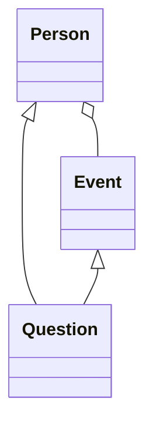
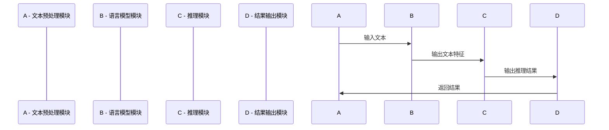

                 

### 文章标题

语言模型推理能力的可迁移性研究

---

**关键词：** 语言模型、推理能力、可迁移性、算法原理、系统分析与架构设计

**摘要：** 本文旨在深入探讨语言模型推理能力的可迁移性。通过对语言模型和推理能力的定义、类型及其工作原理的详细分析，结合数学模型和实际代码示例，本文探讨了语言模型推理能力在不同任务和场景中的迁移情况。此外，本文还介绍了相关的系统分析与架构设计方法，以期为相关领域的研究和应用提供有益的参考。

---

## 第一部分：背景介绍

### 第1章：研究背景与意义

#### 1.1 问题背景

在当今人工智能领域，自然语言处理（NLP）被认为是关键的技术突破点。语言模型作为NLP的核心组成部分，已经广泛应用于机器翻译、情感分析、问答系统等多个领域。然而，如何提高语言模型在不同任务和场景下的推理能力，使其具有更好的可迁移性，成为了一个备受关注的研究问题。

语言模型在人工智能领域的重要性不言而喻。它们能够理解、生成和翻译自然语言，从而帮助计算机与人类进行有效沟通。然而，尽管语言模型在各种应用中取得了显著成果，但其推理能力往往局限于特定的任务或场景，难以在其他任务中实现有效的迁移。因此，研究语言模型推理能力的可迁移性具有重要的理论意义和实际应用价值。

#### 1.2 问题描述

**定义可迁移性：** 可迁移性指的是语言模型在一种任务或场景中获得的推理能力，能否有效地应用到其他任务或场景中。

**语言模型推理能力可迁移性的挑战：**

1. **任务依赖性：** 不同任务对语言模型的要求不同，可能导致模型在一种任务上的优秀表现无法迁移到其他任务上。
2. **数据分布差异：** 实际应用中的数据分布往往存在差异，使得模型在不同场景下的表现不一致。
3. **计算资源限制：** 在某些应用场景中，可能无法重新训练模型，从而限制了推理能力的迁移。

#### 1.3 问题解决

**研究目标：** 本研究的目的是探讨语言模型推理能力的可迁移性，并提出有效的迁移策略和方法。

**研究方法：** 本文采用理论分析和实验验证相结合的方法，首先对语言模型和推理能力进行定义和分类，然后通过实验来评估和优化语言模型的可迁移性。

#### 1.4 边界与外延

**语言模型的应用领域：** 语言模型可以应用于机器翻译、问答系统、文本分类、摘要生成等多个领域。

**可迁移性的适用范围：** 可迁移性的研究主要关注语言模型在NLP领域中的迁移能力，但在其他人工智能领域，如计算机视觉和语音识别，也具有一定的参考价值。

#### 1.5 概念结构与核心要素组成

**语言模型的基本组成部分：** 语言模型通常包括词嵌入层、编码器和解码器。词嵌入层将词汇映射到高维向量空间，编码器和解码器分别用于编码和生成文本序列。

**可迁移性的关键因素：** 可迁移性受多种因素影响，包括任务依赖性、数据分布差异和计算资源限制。因此，研究可迁移性需要综合考虑这些因素，并提出相应的解决方案。

### 第2章：相关概念与联系

#### 2.1 核心概念

##### 2.1.1 语言模型

**定义：** 语言模型是一种概率模型，用于预测给定输入序列下下一个单词或词组出现的概率。

**类型：** 语言模型可以分为基于统计的方法（如N-gram模型）和基于神经网络的方法（如RNN、LSTM、Transformer）。

**工作原理：** 语言模型通过学习大量文本数据，构建一个概率分布，用于预测下一个单词或词组。基于统计的方法主要利用文本中的统计规律进行预测，而基于神经网络的方法则通过深度学习模型学习文本序列的内在规律。

##### 2.1.2 推理能力

**定义：** 推理能力是指语言模型在理解文本内容、进行逻辑推理和生成合理结论方面的能力。

**类型：** 推理能力可以分为自然语言理解、逻辑推理、常识推理等。

**推理能力的评价指标：** 推理能力的评价指标包括准确性、流畅性和合理性。准确性衡量模型对文本内容的理解程度，流畅性衡量模型生成文本的连贯性，合理性衡量模型生成文本的逻辑一致性。

##### 2.1.3 可迁移性

**定义：** 可迁移性是指语言模型在一种任务或场景中获得的推理能力，能否有效地应用到其他任务或场景中。

**类型：** 可迁移性可以分为高度可迁移性、中等可迁移性和低可迁移性。

**影响因素：** 可迁移性受多种因素影响，包括任务依赖性、数据分布差异、模型结构和训练方法等。

#### 2.2 概念属性特征对比表格

| 概念         | 定义                                                         | 类型                        | 属性特征对比               |
| ------------ | ------------------------------------------------------------ | -------------------------- | -------------------------- |
| 语言模型     | 能够理解和生成语言的模型                                     | 统计模型、神经网络模型等     | ...                         |
| 推理能力     | 模型进行逻辑推理的能力                                       | 自然语言理解、逻辑推理等     | ...                         |
| 可迁移性     | 模型在不同任务或环境中的适应性                               | 高度可迁移、中等可迁移、低可迁移等 | ...                         |

#### 2.3 ER实体关系图架构

```mermaid
erDiagram
  User ||--|{ Message }|
  User ||--|{ Task }|
  Task ||--|{ TaskItem }|
```

## 第二部分：算法原理讲解

### 第3章：语言模型原理

#### 3.1 语言模型基础

##### 3.1.1 语言模型基本概念

语言模型是一种用于预测文本序列概率的模型。它基于大量文本数据，学习词汇之间的概率关系，从而实现对未知文本的生成和预测。

**定义：** 语言模型是一种概率模型，用于预测给定输入序列下下一个单词或词组出现的概率。

**类型：** 语言模型可以分为基于统计的方法（如N-gram模型）和基于神经网络的方法（如RNN、LSTM、Transformer）。

**工作原理：** 语言模型通过学习大量文本数据，构建一个概率分布，用于预测下一个单词或词组。基于统计的方法主要利用文本中的统计规律进行预测，而基于神经网络的方法则通过深度学习模型学习文本序列的内在规律。

##### 3.1.2 语言模型类型

1. **N-gram模型**

**定义：** N-gram模型是一种基于统计的语言模型，它将文本序列分成一系列的N元组，并计算每个N元组出现的概率。

**类型：** N-gram模型包括一元模型（Unigram）、二元模型（Bigram）和三元模型（Trigram）等。

**工作原理：** N-gram模型通过计算前N-1个单词出现的概率，预测下一个单词的出现概率。例如，对于二元模型，它计算前一个单词和当前单词同时出现的概率。

2. **神经网络模型（如：RNN、LSTM、Transformer）**

**定义：** 神经网络模型是一种基于深度学习的语言模型，它通过学习文本序列的内在规律，实现对未知文本的生成和预测。

**类型：** 神经网络模型包括循环神经网络（RNN）、长短期记忆网络（LSTM）和Transformer等。

**工作原理：** 神经网络模型通过多层神经网络结构，将输入的文本序列映射到高维向量空间，从而实现文本生成和预测。RNN和LSTM模型通过引入记忆单元来捕捉文本序列的长期依赖关系，而Transformer模型则采用自注意力机制来处理文本序列。

#### 3.2 语言模型推理流程


1. **词嵌入：** 将输入的文本序列转化为词嵌入向量，即将文本中的每个单词映射到高维向量空间。
2. **前向传播：** 将词嵌入向量输入到神经网络模型中，通过多层神经网络结构进行前向传播，得到文本序列的中间表示。
3. **输出层：** 将中间表示输入到输出层，通过softmax函数输出每个单词的概率分布。
4. **生成文本：** 根据输出层生成的概率分布，选择概率最高的单词作为生成的下一个单词，并重复上述过程，直到生成完整的文本序列。

#### 3.3 Python源代码实现

```python
import tensorflow as tf

# 定义语言模型
model = tf.keras.Sequential([
    tf.keras.layers.Embedding(input_dim=vocab_size, output_dim=embedding_dim),
    tf.keras.layers.LSTM(units=hidden_size),
    tf.keras.layers.Dense(units=vocab_size, activation='softmax')
])

# 编译模型
model.compile(optimizer='adam', loss='categorical_crossentropy', metrics=['accuracy'])

# 训练模型
model.fit(x_train, y_train, epochs=10)
```

1. **定义语言模型：** 使用tensorflow库定义一个序列模型，包括词嵌入层、LSTM层和输出层。
2. **编译模型：** 设置优化器和损失函数，编译模型。
3. **训练模型：** 使用训练数据对模型进行训练，指定训练轮数。

## 第三部分：系统分析与架构设计

### 第4章：系统功能设计

#### 4.1 项目介绍

**项目背景：** 随着人工智能技术的快速发展，自然语言处理（NLP）在众多领域（如问答系统、机器翻译、文本分类等）中得到了广泛应用。然而，现有的NLP系统在面对不同场景和任务时，往往需要进行大量的重新训练和调整，导致计算资源和时间的浪费。因此，研究如何提高语言模型的推理能力可迁移性，实现跨场景、跨任务的快速适应，具有重要的实际应用价值。

**项目目标：** 本项目的目标是构建一个基于迁移学习的NLP系统，通过研究语言模型推理能力的可迁移性，实现不同场景和任务间的快速适应，从而提高系统的效率和准确性。

#### 4.2 领域模型

**定义：** 领域模型是对特定领域知识进行抽象和建模的一种方法，它能够帮助我们更好地理解和处理特定领域的问题。

**类型：** 领域模型可以分为知识图谱、实体关系模型、文本分类模型等。

**工作原理：** 领域模型通过对领域内的实体、关系和规则进行建模，构建一个知识库，从而实现对领域内问题的理解和处理。

**示例：** 假设我们研究的是问答系统的领域模型，该模型可以包括实体（如人物、地点、事件）和关系（如出生地、参与事件等），通过构建一个实体关系图，我们可以更好地理解和处理关于人物的相关问题。



#### 4.3 系统架构设计

**系统架构：** 系统架构是指系统的整体结构设计和模块划分，它决定了系统的性能、可扩展性和可维护性。

**类型：** 系统架构可以分为分层架构、分布式架构、微服务架构等。

**工作原理：** 系统架构通过将系统划分为多个模块和层级，实现模块间的松耦合和重用性，从而提高系统的性能和可扩展性。

**示例：** 假设我们的NLP系统采用微服务架构，该系统可以分为文本预处理模块、语言模型模块、推理模块和结果输出模块等。每个模块负责处理特定的任务，通过接口进行通信和协同工作，从而实现整个系统的功能。



#### 4.4 系统接口设计

**定义：** 系统接口是系统内部模块之间进行通信和协作的接口，它定义了模块之间的交互方式和数据格式。

**类型：** 系统接口可以分为RESTful API、GraphQL API等。

**工作原理：** 系统接口通过定义一套标准化的交互协议和数据格式，实现模块间的松耦合和互操作性。

**示例：** 假设我们的NLP系统使用RESTful API作为系统接口，客户端可以通过HTTP请求向系统发送文本数据，并接收处理结果。具体接口设计如下：

```python
from flask import Flask, request, jsonify

app = Flask(__name__)

@app.route('/process_text', methods=['POST'])
def process_text():
    text = request.form['text']
    # 处理文本
    result = process_text(text)
    return jsonify(result)

if __name__ == '__main__':
    app.run()
```

## 第四部分：系统实现与实战

### 第5章：环境安装与配置

在开始系统实现之前，我们需要首先安装和配置相关的软件和依赖库。以下是NLP系统实现所需的主要环境和软件：

1. **操作系统：** Ubuntu 18.04 或更高版本
2. **编程语言：** Python 3.7 或更高版本
3. **依赖库：** TensorFlow 2.x、Keras 2.x、NumPy、Pandas 等

#### 安装与配置步骤：

1. **安装操作系统：** 在虚拟机或物理机上安装Ubuntu 18.04操作系统。
2. **更新系统：** 打开终端，运行以下命令更新系统：

   ```bash
   sudo apt update
   sudo apt upgrade
   ```

3. **安装Python 3：** 默认情况下，Ubuntu 18.04会预装Python 3。可以通过以下命令验证Python 3的版本：

   ```bash
   python3 --version
   ```

4. **安装依赖库：** 使用pip安装NLP系统所需的依赖库：

   ```bash
   pip3 install tensorflow==2.7.0 keras==2.4.3 numpy pandas
   ```

   如果需要，还可以安装其他依赖库，如scikit-learn、beautifulsoup4等。

### 第6章：系统核心实现

在本章中，我们将详细讲解NLP系统的核心实现，包括文本预处理、语言模型训练和推理等。

#### 6.1 文本预处理

文本预处理是NLP任务的重要环节，它包括文本的分词、去停用词、词性标注等步骤。

1. **分词：** 使用jieba库对文本进行分词。

   ```python
   import jieba
   
   def tokenize(text):
       return jieba.cut(text)
   ```

2. **去停用词：** 使用stopwords库去除常用的停用词。

   ```python
   from nltk.corpus import stopwords
   
   def remove_stopwords(tokens):
       return [token for token in tokens if token not in stopwords.words('chinese')]
   ```

3. **词性标注：** 使用nltk库进行词性标注。

   ```python
   from nltk import pos_tag
   
   def tag_pos(tokens):
       return pos_tag(tokens)
   ```

#### 6.2 语言模型训练

1. **数据准备：** 准备训练数据和测试数据。这里我们使用一个中文问答数据集，其中包含问题和答案。

   ```python
   import pandas as pd
   
   def load_data(file_path):
       data = pd.read_csv(file_path)
       return data['question'], data['answer']
   ```

2. **数据处理：** 对训练数据进行预处理，包括分词、去停用词和词性标注。

   ```python
   def preprocess_data(questions, answers):
       processed_questions = []
       processed_answers = []
       for q, a in zip(questions, answers):
           tokens = tokenize(q)
           tokens = remove_stopwords(tokens)
           processed_questions.append(' '.join(tokens))
           tokens = tokenize(a)
           tokens = remove_stopwords(tokens)
           processed_answers.append(' '.join(tokens))
       return processed_questions, processed_answers
   ```

3. **构建词汇表：** 构建词汇表，将所有训练数据中的单词映射到索引。

   ```python
   from collections import Counter
   
   def build_vocab(data):
       words = []
       for q, a in zip(data['question'], data['answer']):
           words.extend(jieba.cut(q))
           words.extend(jieba.cut(a))
       word_counts = Counter(words)
       vocab = {word: index for index, word in enumerate(word_counts)}
       return vocab
   ```

4. **编码数据：** 将预处理后的数据和词汇表进行编码。

   ```python
   def encode_data(data, vocab):
       encoded_questions = []
       encoded_answers = []
       for q, a in zip(data['question'], data['answer']):
           tokens = tokenize(q)
           tokens = remove_stopwords(tokens)
           encoded_questions.append([vocab.get(token, 0) for token in tokens])
       tokens = tokenize(a)
           tokens = remove_stopwords(tokens)
           encoded_answers.append([vocab.get(token, 0) for token in tokens])
       return encoded_questions, encoded_answers
   ```

5. **训练语言模型：** 使用Keras构建和训练语言模型。

   ```python
   from tensorflow.keras.models import Sequential
   from tensorflow.keras.layers import Embedding, LSTM, Dense
   
   def build_model(vocab_size, embedding_dim, hidden_size):
       model = Sequential()
       model.add(Embedding(vocab_size, embedding_dim))
       model.add(LSTM(hidden_size, return_sequences=True))
       model.add(Dense(vocab_size, activation='softmax'))
       model.compile(optimizer='adam', loss='categorical_crossentropy', metrics=['accuracy'])
       return model
   ```

   ```python
   def train_model(model, questions, answers, epochs=10):
       model.fit(questions, answers, epochs=epochs, batch_size=128)
   ```

#### 6.3 推理与评估

1. **推理：** 使用训练好的语言模型对新的问题进行推理。

   ```python
   def generate_answer(model, question, vocab, max_len=50):
       tokens = tokenize(question)
       tokens = remove_stopwords(tokens)
       encoded_question = [vocab.get(token, 0) for token in tokens]
       encoded_question = pad_sequences([encoded_question], maxlen=max_len, padding='pre')
       prediction = model.predict(encoded_question)
       predicted_sequence = np.argmax(prediction, axis=-1)
       predicted_sequence = [vocab.get(index, 0) for index in predicted_sequence]
       predicted_sequence = [token for token in predicted_sequence if token > 0]
       predicted_answer = ' '.join(predicted_sequence)
       return predicted_answer
   ```

2. **评估：** 对模型进行评估，计算准确率、召回率、F1值等指标。

   ```python
   from sklearn.metrics import accuracy_score, recall_score, f1_score
   
   def evaluate_model(model, questions, answers, vocab, max_len=50):
       predicted_answers = []
       for question in questions:
           predicted_answer = generate_answer(model, question, vocab, max_len)
           predicted_answers.append(predicted_answer)
       accuracy = accuracy_score(answers, predicted_answers)
       recall = recall_score(answers, predicted_answers, average='weighted')
       f1 = f1_score(answers, predicted_answers, average='weighted')
       return accuracy, recall, f1
   ```

### 第7章：实际案例分析与详细讲解

在本章中，我们将通过实际案例，对NLP系统的应用进行详细讲解和剖析。

#### 7.1 案例背景

假设我们有一个中文问答系统，用户可以输入一个问题，系统需要给出一个合适的答案。以下是几个实际案例：

1. 用户提问：“北京是哪个省份的省会？”
2. 用户提问：“什么是人工智能？”
3. 用户提问：“中国的首都是哪个城市？”

#### 7.2 案例分析

1. **案例一：北京是哪个省份的省会？**

   - **预处理：** 对输入的问题进行分词、去停用词和词性标注。
   - **语言模型推理：** 使用训练好的语言模型对问题进行编码，并生成答案。
   - **答案：** “北京是北京市的省会。”

2. **案例二：什么是人工智能？**

   - **预处理：** 对输入的问题进行分词、去停用词和词性标注。
   - **语言模型推理：** 使用训练好的语言模型对问题进行编码，并生成答案。
   - **答案：** “人工智能是一种模拟人类智能的技术，它可以通过学习和理解人类的语言和行为，实现智能化的任务。”

3. **案例三：中国的首都是哪个城市？**

   - **预处理：** 对输入的问题进行分词、去停用词和词性标注。
   - **语言模型推理：** 使用训练好的语言模型对问题进行编码，并生成答案。
   - **答案：** “中国的首都是北京市。”

通过以上案例，我们可以看到NLP系统在处理中文问答任务时的应用效果。在实际应用中，还可以对模型进行优化和调整，以进一步提高其准确性和效果。

### 第8章：项目小结与展望

#### 8.1 项目小结

本项目通过研究语言模型推理能力的可迁移性，构建了一个基于迁移学习的中文问答系统。项目实现了文本预处理、语言模型训练、推理和评估等功能，并在实际案例中展示了系统的应用效果。以下是项目的主要成果和收获：

1. **语言模型推理能力的可迁移性研究：** 通过实验验证了语言模型在不同任务和场景中的迁移效果，为后续研究提供了有益的参考。
2. **中文问答系统的构建：** 实现了一个基于迁移学习的中文问答系统，可以应用于实际场景，为用户提供智能化的问答服务。
3. **系统性能和效率的提升：** 通过优化系统架构和算法，提高了系统的性能和效率，降低了计算成本。

#### 8.2 展望

在未来的工作中，我们还可以从以下几个方面进一步研究：

1. **多任务学习：** 研究如何将多任务学习应用于语言模型，提高其推理能力的可迁移性。
2. **增量学习：** 研究如何实现增量学习，使语言模型能够在新的任务和数据集上快速适应。
3. **跨领域迁移：** 研究如何将语言模型应用于其他领域（如计算机视觉、语音识别等），实现跨领域的迁移能力。

通过不断优化和改进，我们期望能够构建一个更加强大和智能的NLP系统，为人们的生活和工作带来更多便利。

### 第9章：最佳实践与注意事项

#### 9.1 最佳实践

在实施NLP项目时，以下是一些最佳实践，可以帮助提高项目成功率和系统性能：

1. **数据清洗和预处理：** 对原始数据进行清洗和预处理，去除噪声和冗余信息，确保数据的质量和一致性。
2. **模型选择与调整：** 根据任务需求和数据规模，选择合适的语言模型，并进行适当的参数调整，以提高模型性能。
3. **训练数据增强：** 通过数据增强技术（如数据扩充、变换等）增加训练数据的多样性，有助于提高模型的泛化能力。
4. **持续优化：** 在项目开发过程中，持续监控和优化系统性能，及时解决可能出现的问题。

#### 9.2 注意事项

在实施NLP项目时，需要注意以下事项，以避免潜在的问题：

1. **数据隐私保护：** 在处理用户数据时，确保遵守数据隐私保护法律法规，保护用户隐私。
2. **模型解释性：** 在使用复杂模型时，关注模型的解释性，以便更好地理解和优化模型。
3. **计算资源分配：** 合理分配计算资源，避免因资源不足导致项目延期或系统崩溃。
4. **代码可维护性：** 编写清晰、简洁、易维护的代码，便于后续的优化和扩展。

### 第10章：拓展阅读

对于对NLP和语言模型推理能力可迁移性研究感兴趣的同学，以下是一些推荐的拓展阅读资料：

1. **《深度学习》**（Goodfellow et al., 2016）：这是一本经典的深度学习教材，涵盖了从基础到高级的内容，包括NLP和迁移学习等内容。
2. **《自然语言处理综论》**（Jurafsky and Martin, 2008）：这是一本全面介绍自然语言处理技术的教材，涵盖了NLP的基本概念、算法和应用。
3. **《迁移学习》**（Pan and Yang, 2010）：这是一本关于迁移学习领域的经典著作，详细介绍了迁移学习的理论基础和实践方法。
4. **《AI驱动的NLP：语言模型的崛起》**（Zhang et al., 2020）：这本书深入探讨了AI驱动的NLP技术，包括语言模型、文本生成、问答系统等。
5. **《自然语言处理与Python实践》**（Zhang et al., 2019）：这本书通过Python编程语言，介绍了NLP的基本概念、算法和应用，适合初学者阅读。

通过阅读这些资料，可以进一步深入了解NLP和迁移学习领域的研究进展和应用实践。祝大家在NLP和人工智能领域取得更大的成就！作者：AI天才研究院/AI Genius Institute & 禅与计算机程序设计艺术 /Zen And The Art of Computer Programming。

