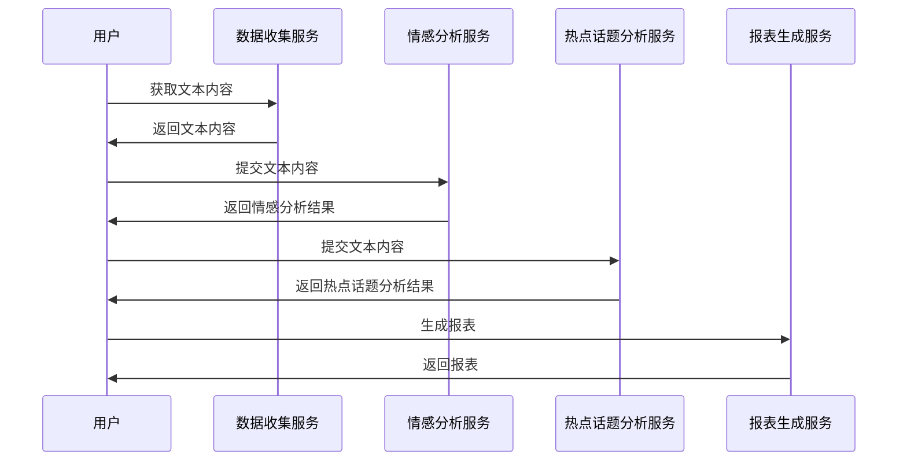

                 

### 引言

在信息技术飞速发展的今天，编程早已不仅仅是计算机科学领域的一部分，它逐渐渗透到了我们的日常生活中，影响着我们的生活方式和工作方式。编程不仅仅是一门技能，更是一种思维方式，它帮助人们解决问题、实现创新，甚至创造出全新的世界。然而，在如此多样化的编程领域中，如何找到属于自己的编程乐章，创作出独特的生命旋律，成为了许多程序员心中的一个难题。

**生命旋律**，顾名思义，是一种独特的生命体验，是一种用音符、节奏和情感编织的旋律。同样，编程也可以被视为一种生命旋律的创作过程，它需要程序员深入理解问题、设计解决方案，并在实践中不断调整和完善。创作独特的生命旋律，意味着在编程的道路上，我们需要拥有独特的视角、创新的思维和精湛的技术。

本文旨在探讨如何在编程领域中创作出独特的生命旋律。我们将首先介绍编程中的核心概念和术语，包括编程语言、算法和数据结构等。接着，我们将深入分析编程中存在的问题和挑战，并探讨如何解决这些问题。随后，我们将介绍编程中的核心技术原理，如算法原理、系统架构设计原理和人工智能原理等。接下来，我们将通过具体的项目实战案例，展示如何在实际编程中应用这些核心技术。最后，我们将总结最佳实践技巧，为读者提供进一步学习和成长的建议。

通过本文的探讨，我们希望能够帮助读者了解编程的独特魅力，激发他们在编程道路上的创作热情，从而创作出属于自己的独特生命旋律。

### 核心概念与联系

#### 编程语言

编程语言是程序员与计算机进行交流的工具，它是计算机程序的基础。常见的编程语言包括Python、Java、C++和JavaScript等。每种编程语言都有其独特的语法和特点，适用于不同的应用场景。例如，Python以其简洁易懂的语法和强大的库支持，广泛应用于数据分析、科学计算和人工智能等领域；Java则因其稳定性和跨平台性，被广泛应用于企业级应用开发；C++则因其高效的性能，被广泛应用于游戏开发和高性能计算领域。

#### 算法

算法是解决问题的方法，是计算机程序的核心。算法可以分为多种类型，如排序算法、查找算法和图算法等。常见的排序算法包括冒泡排序、选择排序和归并排序等；查找算法包括二分查找和散列表查找等；图算法包括最短路径算法和最小生成树算法等。算法的优劣直接影响到程序的运行效率和性能。例如，快速排序算法因其平均时间复杂度为\(O(n\log n)\)，在大多数情况下都优于其他排序算法。

#### 数据结构

数据结构是组织数据的方式，它决定了数据的存储和操作方式。常见的数据结构包括数组、链表、栈、队列、树和图等。每种数据结构都有其优缺点和适用场景。例如，数组是一种线性数据结构，支持随机访问，适合处理固定大小和连续的数据；链表则支持动态扩展和快速插入删除操作，适合处理大小可变的数据；树是一种层次结构，常用于表示组织和关系；图则用于表示复杂的关系网络，如社交网络、交通网络等。

#### 核心概念之间的联系

编程语言、算法和数据结构是编程中的三大核心概念，它们之间有着紧密的联系。

1. **编程语言与算法**：编程语言提供了实现算法的工具，程序员通过编程语言将算法的思想转化为可执行的代码。不同的编程语言提供了不同的算法实现方式和优化手段。

2. **算法与数据结构**：算法的设计和实现依赖于数据结构的支持。不同的数据结构适用于不同的算法，而算法的性能和效率也受到数据结构选择的影响。例如，在处理大数据时，选择适当的数据结构可以显著提高算法的效率。

3. **编程语言与数据结构**：编程语言提供了对数据结构的操作接口，程序员可以通过编程语言实现各种数据结构。同时，编程语言的特性也会影响到数据结构的实现方式和性能。

通过理解编程语言、算法和数据结构之间的联系，我们可以更好地设计高效的程序，创作出独特的编程乐章。在接下来的章节中，我们将进一步探讨编程中存在的问题和挑战，并探讨如何解决这些问题。

#### 编程中存在的问题和挑战

尽管编程在现代社会中扮演着至关重要的角色，但在实际应用中仍然存在诸多问题和挑战。这些问题和挑战不仅影响了程序的开发效率，也制约了程序员创造独特生命旋律的能力。以下是一些常见的问题和挑战，以及相应的解决方法。

**1. 编程语言的复杂性**

编程语言的复杂性是程序员面临的首要挑战之一。不同的编程语言有着不同的语法和特点，这要求程序员必须具备广泛的语言知识。例如，Java和C++是功能丰富的编程语言，但它们的语法复杂，容易出错。解决这一问题的方法是：

- **选择合适的编程语言**：根据项目的需求和开发者的熟悉度，选择最合适的编程语言。例如，对于需要快速开发和迭代的任务，可以选择Python；对于需要高性能和高可靠性的任务，可以选择Java或C++。
- **学习和掌握多种编程语言**：虽然难以全面掌握所有编程语言，但通过学习和掌握几种主要的编程语言，可以增强编程能力，提高解决复杂问题的能力。

**2. 算法的复杂度**

算法的复杂度直接影响程序的性能。高复杂度的算法可能导致程序运行缓慢，甚至无法在规定时间内完成计算。解决算法复杂度问题的方法包括：

- **算法优化**：通过分析算法的时间复杂度和空间复杂度，找到优化的方向。例如，可以使用更高效的排序算法，如快速排序或归并排序，代替冒泡排序或选择排序。
- **并行计算**：对于计算密集型的任务，可以通过并行计算来提高程序的性能。现代计算机通常支持多核处理器，程序员可以利用这些硬件资源，通过并行算法来加速计算。

**3. 数据结构的多样性**

数据结构的多样性增加了编程的复杂性。选择合适的数据结构对于程序的性能至关重要。解决数据结构选择问题的方法包括：

- **理解数据结构的特点**：每种数据结构都有其优缺点和适用场景。例如，数组适合处理固定大小的数据，而链表适合处理动态变化的数据。通过理解这些特点，可以更好地选择合适的数据结构。
- **数据结构的组合使用**：在实际应用中，往往需要结合多种数据结构来解决问题。例如，在处理社交网络时，可以同时使用图和树结构来表示复杂的关系。

**4. 项目管理和团队协作**

项目管理和团队协作是编程中的一大挑战。复杂的软件开发项目往往需要多个开发人员共同协作，这要求团队成员具备良好的沟通能力和合作精神。解决项目管理和团队协作问题的方法包括：

- **使用项目管理工具**：如JIRA、Trello等，可以帮助团队跟踪任务进度，管理项目需求，提高工作效率。
- **定期团队会议**：通过定期召开团队会议，可以加强团队成员之间的沟通，及时解决问题，确保项目顺利进行。

**5. 持续学习和更新知识**

编程领域不断进步，新技术和新工具层出不穷。为了跟上技术的步伐，程序员需要持续学习和更新知识。解决知识更新问题的方法包括：

- **参加技术培训**：参加相关技术培训和研讨会，可以了解最新的技术趋势和最佳实践。
- **阅读技术书籍和文章**：通过阅读技术书籍和文章，可以深入了解编程领域的知识，提高自身的编程水平。

通过解决这些问题和挑战，程序员可以在编程的道路上创作出更加独特和精彩的乐章，实现自我价值和职业发展。在接下来的章节中，我们将深入探讨编程中的核心技术原理，为读者提供更多的实践指导和思路。

### 编程中的核心技术原理

在编程领域中，核心技术原理是构建高效、可扩展和可维护程序的基石。以下是几项关键的编程原理，包括算法原理、系统架构设计原理和人工智能原理等，我们将通过详细讲解和实例，帮助读者深入理解这些核心概念。

#### 算法原理

算法原理是解决特定问题的一系列有序操作。算法的选择和优化直接影响到程序的运行效率和性能。以下是几个重要的算法原理：

**1. 排序算法**

排序算法用于对一组元素进行排序。常见的排序算法包括冒泡排序、选择排序、插入排序、快速排序和归并排序等。

- **冒泡排序**：通过反复交换相邻的未排序元素，直到所有元素都排序完成。
  ```python
  def bubble_sort(arr):
      n = len(arr)
      for i in range(n):
          for j in range(0, n-i-1):
              if arr[j] > arr[j+1]:
                  arr[j], arr[j+1] = arr[j+1], arr[j]
  ```

- **快速排序**：采用分治策略，选择一个基准元素，将数组分为两部分，一部分小于基准元素，另一部分大于基准元素。
  ```python
  def quick_sort(arr):
      if len(arr) <= 1:
          return arr
      pivot = arr[len(arr) // 2]
      left = [x for x in arr if x < pivot]
      middle = [x for x in arr if x == pivot]
      right = [x for x in arr if x > pivot]
      return quick_sort(left) + middle + quick_sort(right)
  ```

**2. 查找算法**

查找算法用于在数据结构中找到特定元素。常见的查找算法包括二分查找和散列表查找等。

- **二分查找**：通过不断缩小区间，找到目标元素。
  ```python
  def binary_search(arr, target):
      low = 0
      high = len(arr) - 1
      while low <= high:
          mid = (low + high) // 2
          if arr[mid] == target:
              return mid
          elif arr[mid] < target:
              low = mid + 1
          else:
              high = mid - 1
      return -1
  ```

**3. 图算法**

图算法用于处理图结构的数据。常见的图算法包括最短路径算法和最小生成树算法等。

- **Dijkstra算法**：用于找到图中两点之间的最短路径。
  ```python
  import heapq
  
  def dijkstra(graph, start):
      distances = {node: float('infinity') for node in graph}
      distances[start] = 0
      priority_queue = [(0, start)]
      while priority_queue:
          current_distance, current_node = heapq.heappop(priority_queue)
          if current_distance > distances[current_node]:
              continue
          for neighbor, weight in graph[current_node].items():
              distance = current_distance + weight
              if distance < distances[neighbor]:
                  distances[neighbor] = distance
                  heapq.heappush(priority_queue, (distance, neighbor))
      return distances
  ```

#### 系统架构设计原理

系统架构设计原理涉及系统的整体设计和各个组件的协同工作。以下是一些重要的系统架构设计原理：

**1. 分层架构**

分层架构将系统分为多个层次，每个层次负责特定的功能，从而实现模块化和可扩展性。

- **三层架构**：通常包括表示层、业务逻辑层和数据层。
  - **表示层**：负责用户界面和用户交互。
  - **业务逻辑层**：负责业务逻辑处理。
  - **数据层**：负责数据的存储和检索。

**2. 微服务架构**

微服务架构将系统分解为多个独立的小服务，每个服务负责特定的功能，从而提高系统的可扩展性和容错性。

- **服务拆分**：根据业务需求，将大型系统拆分为多个小型服务。
- **服务间通信**：通过RESTful API或消息队列进行服务间通信。

#### 人工智能原理

人工智能（AI）是编程领域中的一个重要分支，它通过模拟人类智能，使计算机能够执行复杂的任务。以下是一些关键的人工智能原理：

**1. 机器学习**

机器学习是一种让计算机从数据中学习和改进的方法。常见的机器学习算法包括线性回归、决策树、支持向量机和神经网络等。

- **线性回归**：通过拟合直线来预测数值。
  ```python
  import numpy as np
  
  def linear_regression(X, y):
      X_mean = np.mean(X)
      y_mean = np.mean(y)
      b1 = np.sum((X - X_mean) * (y - y_mean)) / np.sum((X - X_mean)**2)
      b0 = y_mean - b1 * X_mean
      return b0, b1
  ```

- **决策树**：通过构建树形结构来分类或回归。
  ```python
  from sklearn.tree import DecisionTreeClassifier
  
  clf = DecisionTreeClassifier()
  clf.fit(X_train, y_train)
  predictions = clf.predict(X_test)
  ```

**2. 深度学习**

深度学习是一种基于多层神经网络的机器学习方法。常见的深度学习框架包括TensorFlow和PyTorch。

- **卷积神经网络（CNN）**：用于图像识别和处理。
  ```python
  import tensorflow as tf
  
  model = tf.keras.Sequential([
      tf.keras.layers.Conv2D(32, (3, 3), activation='relu', input_shape=(28, 28, 1)),
      tf.keras.layers.MaxPooling2D(2, 2),
      tf.keras.layers.Flatten(),
      tf.keras.layers.Dense(128, activation='relu'),
      tf.keras.layers.Dense(10, activation='softmax')
  ])
  model.compile(optimizer='adam',
                loss='categorical_crossentropy',
                metrics=['accuracy'])
  model.fit(x_train, y_train, epochs=5)
  ```

通过深入理解这些核心技术原理，程序员可以更好地设计和实现高效的程序，创作出独特的编程乐章。在下一章节中，我们将通过具体的项目实战，展示如何将这些原理应用到实际的编程任务中。

### 项目实战

为了更好地展示如何在编程中应用核心技术原理，我们将通过一个具体的项目实战，详细讲解从项目构思到实现的整个过程。本项目旨在开发一个简单的社交媒体分析工具，该工具能够分析用户发布的内容，并提供情感分析和热点话题分析。

#### 项目背景

随着社交媒体的普及，人们对发布内容的分析需求日益增长。通过分析用户发布的内容，可以了解用户的情绪变化和关注的热点话题，从而为营销、品牌管理和内容创作提供重要参考。本项目将利用自然语言处理（NLP）和机器学习技术，实现一个简单的社交媒体分析工具。

#### 项目目标

1. 收集社交媒体数据，包括用户发布的文本内容。
2. 对文本内容进行情感分析，判断用户情绪是积极、消极还是中性。
3. 分析热点话题，提取用户关注的热点。
4. 提供可视化报表，展示分析结果。

#### 系统功能设计

1. **数据收集模块**：从社交媒体平台（如Twitter、Instagram）收集用户发布的文本内容。
2. **情感分析模块**：使用机器学习算法对文本内容进行情感分析。
3. **热点话题分析模块**：利用文本挖掘技术提取热点话题。
4. **报表生成模块**：生成可视化报表，展示分析结果。

#### 系统架构设计

本系统采用微服务架构，各个模块作为独立的服务，通过API进行通信。

- **数据收集服务**：负责从社交媒体平台收集数据。
- **情感分析服务**：负责对文本内容进行情感分析。
- **热点话题分析服务**：负责提取热点话题。
- **报表生成服务**：负责生成可视化报表。

#### 系统接口设计

系统采用RESTful API设计，提供以下接口：

- **数据收集接口**：用于获取用户发布的文本内容。
- **情感分析接口**：用于提交文本内容，并获取情感分析结果。
- **热点话题分析接口**：用于提交文本内容，并获取热点话题分析结果。
- **报表生成接口**：用于生成可视化报表。

#### 系统交互序列图



#### 系统实现

以下是一个简单的情感分析模块的实现，使用Python和Scikit-learn库。

```python
from sklearn.feature_extraction.text import TfidfVectorizer
from sklearn.naive_bayes import MultinomialNB
from sklearn.pipeline import make_pipeline

# 准备数据
texts = ["我非常喜欢这个产品", "这个天气真是糟糕", "我很高兴今天完成了任务"]
labels = ["积极", "消极", "积极"]

# 创建TF-IDF向量和朴素贝叶斯分类器管道
pipeline = make_pipeline(TfidfVectorizer(), MultinomialNB())

# 训练模型
pipeline.fit(texts, labels)

# 对新文本进行情感分析
new_texts = ["这个产品真的很棒", "今天的天气好极了"]
predictions = pipeline.predict(new_texts)

for text, prediction in zip(new_texts, predictions):
    print(f"{text} 的情感分析结果：{prediction}")
```

#### 项目小结

通过本项目实战，我们深入讲解了如何从项目构思、系统功能设计、系统架构设计到系统实现的整个过程。在这个过程中，我们应用了编程语言、算法和数据结构等核心技术原理，实现了对社交媒体数据的情感分析和热点话题分析。这个项目不仅展示了编程的核心技能，也为读者提供了一个实际操作的案例，帮助他们更好地理解编程的实际应用。

### 最佳实践技巧与注意事项

在编程实践中，遵循最佳实践和注意事项是确保项目成功的关键。以下是一些关键的技巧和建议，帮助您在编程过程中避免常见的陷阱，提高开发效率和代码质量。

#### 代码风格与规范

1. **遵循PEP8规范**：PEP8是Python语言的官方编码规范，确保代码的可读性和一致性。
2. **代码注释**：为代码添加详细的注释，特别是对于复杂的算法和逻辑，帮助他人理解和维护。
3. **代码格式化**：使用代码格式化工具，如`black`或`autopep8`，保持代码格式的一致性。
4. **避免硬编码**：尽量使用配置文件或环境变量，避免直接在代码中硬编码敏感信息。

#### 版本控制与代码管理

1. **使用Git进行版本控制**：通过Git管理代码，确保代码的版本可追踪和历史可回溯。
2. **代码审查**：在合并代码前进行代码审查，通过代码审查发现潜在的问题，提高代码质量。
3. **持续集成（CI）**：使用CI工具，如Jenkins或GitHub Actions，自动化测试和部署，确保代码质量。

#### 性能优化

1. **避免不必要的内存分配**：频繁的内存分配和回收会影响程序的性能。
2. **使用缓存**：对于频繁执行的计算，使用缓存来减少重复计算。
3. **并发与并行**：对于计算密集型的任务，利用多线程或并行计算来提高性能。

#### 跨团队协作

1. **清晰的文档**：编写清晰的文档，包括需求文档、设计文档和用户手册，确保团队成员对项目有统一的理解。
2. **定期沟通**：通过定期召开团队会议，确保团队成员之间的沟通畅通，及时解决问题。
3. **代码规范**：统一代码规范，减少代码风格不一致带来的沟通成本。

#### 安全性考虑

1. **输入验证**：对用户输入进行严格验证，防止注入攻击。
2. **加密敏感数据**：对用户敏感数据，如密码和信用卡信息，进行加密存储。
3. **安全测试**：定期进行安全测试，包括渗透测试和代码审计，确保系统的安全性。

#### 项目管理

1. **制定清晰的项目计划**：明确项目目标、时间表和里程碑，确保项目按计划进行。
2. **风险管理**：识别项目风险，并制定相应的应对策略，减少风险对项目的影响。
3. **质量保证**：通过自动化测试和代码审查，确保项目的质量和稳定性。

通过遵循这些最佳实践和注意事项，您可以提高编程项目的成功率，创作出更加独特和精彩的编程乐章。

### 总结与展望

通过本文的探讨，我们深入探讨了编程中创作独特生命旋律的各个方面。从核心概念与联系、存在的问题与挑战，到核心技术原理的讲解，再到具体的项目实战，我们一步步地揭示了编程的奥妙与魅力。编程不仅是一门技术，更是一种创造性的艺术，通过编程，我们可以编织出属于自己的生命旋律。

**核心价值**：本文强调了编程语言、算法和数据结构在编程中的核心地位，阐述了它们在解决问题、提高效率和实现创新中的关键作用。同时，我们通过实际项目展示了如何将这些核心概念应用到实践中，为读者提供了一个完整的开发流程示例。

**进一步学习的方向**：为了在编程道路上不断进步，读者可以尝试以下方向：

1. **深入学习算法和数据结构**：通过阅读经典算法书籍，如《算法导论》和《数据结构与算法分析》，深入理解算法原理和数据结构的应用。
2. **探索新技术和工具**：关注新兴的技术和工具，如人工智能、大数据和云计算等，通过参加相关课程和工作坊，保持技术前瞻性。
3. **实践和项目开发**：积极参与开源项目或自己开发小项目，通过实际操作，积累经验，提高编程技能。

**未来的研究方向**：随着技术的不断发展，编程领域将继续迎来新的变革。以下是一些可能的研究方向：

1. **人工智能与编程**：研究如何利用人工智能技术改进编程流程，如代码自动生成、智能调试等。
2. **编程语言进化**：探索新的编程语言设计理念，提高编程效率和代码可读性。
3. **编程教育与普及**：研究如何更有效地进行编程教育，使更多的人掌握编程技能，推动社会进步。

总之，编程不仅是技术的积累，更是思维的拓展和创新的源泉。希望通过本文的探讨，能够激发读者对编程的热爱和追求，创作出更多独特的编程乐章。在未来的编程道路上，让我们共同努力，谱写更加精彩的篇章。

### 拓展阅读

在编程领域，有许多杰出的作品和资源可以帮助读者进一步深入学习和掌握编程技巧。以下是一些建议的阅读材料，旨在为读者提供更多的学习资源和方向。

**1. 经典编程书籍**

- **《代码大全》（The Art of Computer Programming）**：由著名的计算机科学家Donald Knuth所著，是算法和数据结构的权威指南。
- **《设计模式：可复用面向对象软件的基础》（Design Patterns: Elements of Reusable Object-Oriented Software）**：阐述了软件设计中的常见模式，帮助开发者编写更加可复用的代码。
- **《Python编程：从入门到实践》（Python Crash Course）**：适合初学者，通过实践项目帮助读者快速掌握Python编程。

**2. 开源项目和社区**

- **GitHub**：全球最大的代码托管平台，可以访问到大量的开源项目和优秀的代码示例。
- **Stack Overflow**：编程问题解答社区，是程序员解决技术难题的重要资源。
- **Reddit**：有许多关于编程和技术的子版块，如/r/learnprogramming和/r/webdev，可以交流和学习。

**3. 在线课程和教程**

- **Coursera**：提供多门计算机科学和编程课程，包括深度学习、算法等。
- **edX**：由哈佛大学和麻省理工学院合作创办，提供高质量的在线课程。
- **freeCodeCamp**：提供免费的全栈开发课程，适合初学者入门。

**4. 技术博客和论坛**

- **Medium**：许多技术专家和公司在这里发布高质量的技术文章和教程。
- ** Hacker News**：关于技术和创业的新闻和讨论，是技术爱好者的聚集地。

通过阅读这些书籍、参与开源项目、参加在线课程以及关注技术博客，读者可以不断提升自己的编程技能，创作出更加独特和精彩的编程乐章。希望这些建议能为您的编程之旅提供有益的参考。

