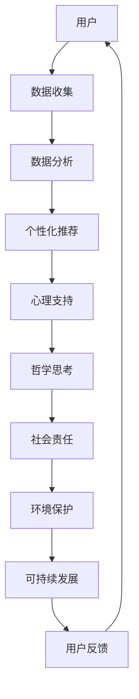
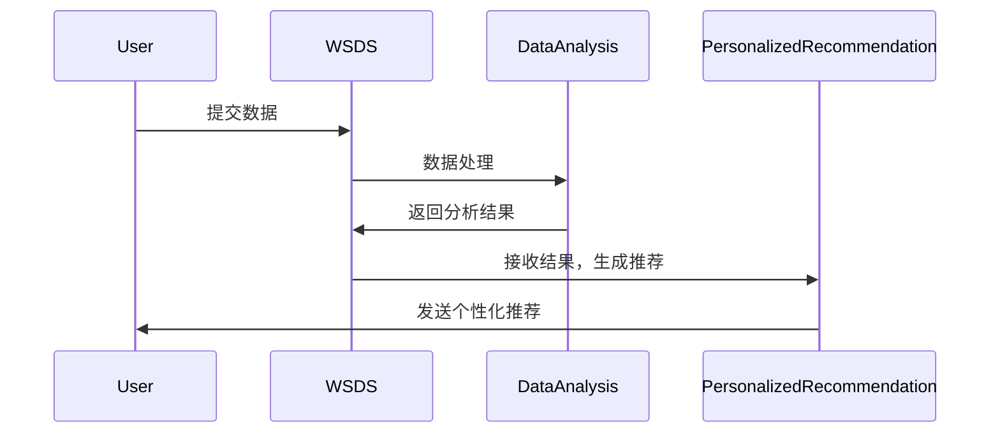
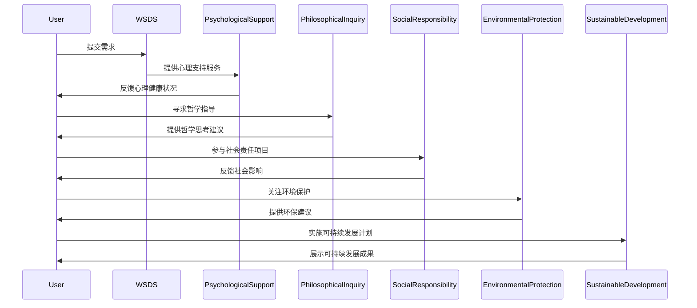

                 

## 超越物质主义：重新定义成功与幸福

### 关键词：物质主义、成功、幸福、心理学、哲学、社会变革

### 摘要：本文深入探讨了物质主义对现代社会的深远影响，以及如何通过心理学和哲学的视角，重新定义成功与幸福。文章首先分析了物质主义的时代背景及其在个人价值观中的渗透，接着探讨了成功的物质定义与幸福的关系，并指出了物质主义带来的诸多负面影响。随后，文章提出了超越物质主义的路径，从心理学、哲学和社会变革三个角度进行了详细阐述。通过个人成长故事和企业成功案例，进一步验证了这些路径的可行性和有效性。最后，文章总结了超越物质主义的必要性，展望了其未来发展。

----------------------------------------------------------------

## 目录大纲：超越物质主义：重新定义成功与幸福

----------------------------------------------------------------

### 第一部分：物质主义与成功幸福的关系

#### 第1章：物质主义的时代潮流

#### 1.1.1 物质主义的定义与历史背景

#### 1.1.2 物质主义在社会中的普及

#### 1.1.3 物质主义对个人价值观的影响

#### 第2章：成功的物质定义

#### 2.1.1 成功的多维度解析

#### 2.1.2 物质成功的主要标志

#### 2.1.3 物质成功带来的矛盾

#### 第3章：幸福的物质基础

#### 3.1.1 幸福的本质与构成

#### 3.1.2 物质对幸福的影响

#### 3.1.3 物质主义与幸福感的关系

#### 第4章：物质主义带来的负面影响

#### 4.1.1 环境污染与资源耗竭

#### 4.1.2 社会不公与贫富差距

#### 4.1.3 心理健康问题

----------------------------------------------------------------

### 第二部分：超越物质主义的路径

#### 第5章：心理学的视角

#### 5.1.1 情绪管理的重要性

#### 5.1.2 增强自我认知

#### 5.1.3 心理健康的维护

#### 第6章：哲学的思考

#### 6.1.1 古代哲学对成功的理解

#### 6.1.2 当代哲学对幸福的看法

#### 6.1.3 哲学在超越物质主义中的应用

#### 第7章：社会变革的实践

#### 7.1.1 社区共建与共享经济

#### 7.1.2 公平正义的追求

#### 7.1.3 生态文明的建设

#### 第8章：可持续发展的理念

#### 8.1.1 可持续发展的概念与目标

#### 8.1.2 可持续发展的挑战与机遇

#### 8.1.3 可持续发展的实施路径

----------------------------------------------------------------

### 第三部分：案例研究与启示

#### 第9章：个人成长故事

#### 9.1.1 成功的超越：个人案例分享

#### 9.1.2 幸福的重新定义：个人感悟

#### 9.1.3 成功与幸福的平衡：个人经验

#### 第10章：企业成功案例

#### 10.1.1 企业文化的变革

#### 10.1.2 社会责任的承担

#### 10.1.3 成功的可持续商业模式

#### 第11章：社会变革的影响

#### 11.1.1 社会实验与政策改革

#### 11.1.2 社会影响的评估

#### 11.1.3 社会变革的未来趋势

#### 第12章：总结与展望

#### 12.1.1 超越物质主义的必要性

#### 12.1.2 超越物质主义的可行性

#### 12.1.3 超越物质主义的未来

#### 附录：参考资料与延伸阅读

----------------------------------------------------------------

## 第1章：物质主义的时代潮流

### 1.1.1 物质主义的定义与历史背景

物质主义是一种以物质财富为中心的生活哲学和价值观念。它强调物质财富的积累和个人利益的追求，认为物质财富是衡量个人和社会成功与幸福的主要标准。物质主义的兴起可以追溯到工业革命时期，随着生产力的提高和消费文化的盛行，人们开始将物质财富视为成功与幸福的象征。

在历史上，物质主义逐渐渗透到社会的各个层面。尤其是在现代社会，物质主义成为了主流价值观，对个人和社会产生了深远的影响。物质主义不仅影响了人们的生活方式，也改变了社会的结构和运行机制。

### 1.1.2 物质主义在社会中的普及

物质主义在社会中的普及表现为以下几个方面：

1. **消费文化**：消费文化是物质主义的重要表现形式。广告和媒体不断宣传物质财富的重要性，刺激人们的消费欲望。消费主义文化鼓励人们追求名牌、奢侈品，以及更高级的科技产品。

2. **教育体系**：教育体系也在一定程度上鼓励了物质主义。学校教育强调学术成绩和考试分数，这些往往是与物质财富紧密相关的指标。

3. **媒体和娱乐**：媒体和娱乐行业也倾向于传播物质主义的价值观。电影、电视节目和社交媒体往往以物质财富和成功为榜样，影响人们的价值观念。

### 1.1.3 物质主义对个人价值观的影响

物质主义对个人价值观的影响是深远而复杂的。一方面，物质主义鼓励人们追求物质财富，这可能导致人们过分关注物质生活，忽视精神追求。另一方面，物质主义也可能带来一定的成就感和满足感，但同时也可能导致心理健康问题。

1. **心理压力**：追求物质财富往往伴随着巨大的心理压力。人们可能感到焦虑、不安，担心无法达到社会的期望。

2. **价值观失衡**：过分关注物质财富可能导致价值观失衡，忽视人际关系、精神追求和身心健康。

3. **社会不公**：物质主义的普及也加剧了社会不公。贫富差距扩大，资源分配不均，这可能导致社会矛盾和冲突。

### 1.1.4 物质主义的时代特征

物质主义的时代特征主要体现在以下几个方面：

1. **消费主义**：消费主义成为社会主流，人们追求更多的物质产品和服务。

2. **竞争激烈**：社会竞争激烈，人们为了获得更好的工作和更高的收入而不断努力。

3. **物质崇拜**：物质财富被崇拜，人们将物质成功视为人生成功的唯一标准。

4. **精神空虚**：在追求物质财富的过程中，人们可能感到精神空虚和孤独。

### 1.1.5 物质主义的负面影响

物质主义带来了许多负面影响，包括：

1. **环境污染**：为了生产更多的物质产品，环境遭受严重破坏，空气、水和土壤污染严重。

2. **资源耗竭**：资源的过度开采和消耗导致资源枯竭，威胁到人类的可持续发展。

3. **社会不公**：物质主义的普及加剧了社会不公，贫富差距扩大，社会矛盾加剧。

4. **心理健康问题**：追求物质财富可能导致心理健康问题，如焦虑、抑郁等。

### 1.1.6 物质主义对人际关系的影响

物质主义不仅影响了个人的价值观，也对人际关系产生了深远的影响。在物质主义的社会中，人们往往将物质财富作为衡量人际关系的重要标准，这可能导致以下问题：

1. **人际关系浅薄**：人们可能只重视与物质财富相关的人际关系，忽视真正的情感交流。

2. **信任危机**：物质主义可能导致社会信任危机，人们更倾向于怀疑他人的动机。

3. **社交障碍**：物质主义可能导致社交障碍，人们可能因为害怕被评判而避免社交活动。

### 结论

物质主义是现代社会的主要潮流，它在个人价值观和社会结构中产生了深远的影响。然而，物质主义也带来了许多负面影响，如心理压力、价值观失衡、社会不公和心理健康问题。因此，重新审视物质主义，探索超越物质主义的路径，成为当代社会的重要课题。

----------------------------------------------------------------

## 第2章：成功的物质定义

### 2.1.1 成功的多维度解析

成功是一个多维度的概念，不仅仅局限于物质财富的积累，还包括精神层面的成长、人际关系的和谐以及自我价值的实现。因此，对成功的定义需要从多个角度进行解析。

1. **物质成功**：物质成功通常指的是个人或组织在物质财富上的积累，如财富、房产、汽车等。物质成功是物质主义的核心，也是许多人衡量成功的首要标准。

2. **精神成功**：精神成功指的是个人在精神层面的成长，如自我认知的提升、心理素质的增强、道德修养的提高等。精神成功是内心满足和幸福感的重要来源。

3. **人际关系成功**：人际关系成功指的是个人在社会中的社交能力和人际关系的质量。良好的人际关系有助于个人的事业发展和社会融入。

4. **自我价值实现**：自我价值实现指的是个人在自我价值认同和实现过程中的成就。这包括职业成就、社会贡献以及个人兴趣爱好的实现。

### 2.1.2 物质成功的主要标志

物质成功的主要标志通常包括以下几个方面：

1. **财富积累**：财富积累是物质成功的核心标志。它不仅包括现金和存款，还包括投资收益、房产价值和其他物质资产。

2. **职业地位**：职业地位是衡量物质成功的重要指标。高级职位、高收入和行业影响力都是职业地位的体现。

3. **生活水平**：生活水平是物质成功的外在表现。豪华住宅、高级汽车、高品质的消费品等都反映了物质成功的程度。

4. **社会认可**：社会认可也是物质成功的重要标志。荣誉头衔、社会地位和公众形象都是社会认可的体现。

### 2.1.3 物质成功带来的矛盾

尽管物质成功在某种程度上满足了人们的物质需求，但它也带来了一系列矛盾和问题：

1. **价值观失衡**：过分追求物质成功可能导致价值观失衡，忽视精神追求和人际关系。

2. **心理压力**：物质成功往往伴随着巨大的心理压力。为了维持物质成功，人们可能需要不断努力，这可能导致焦虑和不安。

3. **社会不公**：物质成功加剧了社会不公。贫富差距扩大，资源分配不均，这可能导致社会矛盾和冲突。

4. **环境影响**：为了实现物质成功，人们可能过度消耗资源，导致环境污染和资源耗竭。

5. **人际关系问题**：物质成功可能导致人际关系问题。人们可能因为物质利益而忽视真正的情感交流，导致人际关系浅薄和信任危机。

### 2.1.4 物质成功的可持续性

物质成功的可持续性是一个重要的问题。在现代社会，随着环境问题的加剧和资源消耗的加速，单纯的物质成功可能不再可持续。因此，探索物质成功的可持续性，实现物质财富的可持续增长，成为当代社会的关键课题。

1. **可持续发展**：可持续发展是指在满足当前需求的同时，不损害后代满足其需求的能力。物质成功的可持续发展意味着在追求物质财富的同时，要考虑环境和社会的可持续性。

2. **社会责任**：企业和社会组织在追求物质成功的过程中，需要承担社会责任，关注社会问题和环境问题。

3. **创新和转型**：为了实现物质成功的可持续性，需要推动创新和产业转型，发展绿色经济和循环经济。

### 2.1.5 物质成功与幸福的关系

物质成功与幸福之间存在复杂的关系。一方面，物质成功可能带来一定的幸福感，满足人们的物质需求。另一方面，物质成功也可能导致幸福感下降，甚至引发心理健康问题。因此，理解物质成功与幸福的关系，对于实现个人和社会的全面发展具有重要意义。

1. **物质需求与幸福感**：满足基本的物质需求是幸福感的基础。当人们的基本物质需求得到满足时，幸福感会显著提升。

2. **物质需求与心理健康**：过分追求物质成功可能导致心理健康问题，如焦虑、抑郁等。因此，合理调控物质需求，关注心理健康，是实现物质成功与幸福平衡的关键。

3. **物质成功与幸福感的关系模型**：可以构建一个物质成功与幸福的关系模型，分析两者之间的相互作用和影响机制。

### 2.1.6 物质成功的案例分析

通过分析物质成功的典型案例，可以深入了解物质成功的过程、挑战和解决方案。

1. **创业成功案例**：如马斯克创办特斯拉和SpaceX，通过技术创新和商业模式的创新，实现了物质成功和商业帝国的建立。

2. **职业成功案例**：如乔布斯创办苹果公司，通过设计创新和品牌营销，将苹果公司打造成全球知名品牌，实现了个人和公司的物质成功。

3. **社会影响力案例**：如比尔·盖茨通过捐赠巨额财富，致力于解决全球卫生和教育问题，实现了物质成功与社会影响力的双赢。

### 结论

物质成功是成功的重要组成部分，但不是唯一的成功标准。在追求物质成功的过程中，需要关注精神层面、人际关系和自我价值的实现。同时，要认识到物质成功带来的矛盾和挑战，探索物质成功的可持续性和心理健康的关系，实现物质成功与幸福的平衡。

----------------------------------------------------------------

## 第3章：幸福的物质基础

### 3.1.1 幸福的本质与构成

幸福是一个复杂的心理体验，涉及多个维度。从心理学角度来看，幸福通常包括以下几个方面：

1. **情感体验**：情感体验是幸福的核心。积极的情感体验，如快乐、满足和爱，是幸福感的重要来源。

2. **心理满足**：心理满足是指个人在心理上感到满足和平衡。这包括自我认同、自我价值和自尊心的满足。

3. **社会关系**：良好的人际关系对于幸福感至关重要。与家人、朋友和同事建立积极的关系，可以提升幸福感。

4. **生活满意度**：生活满意度是指个人对生活的整体评价。当个人对生活感到满意时，幸福感会增强。

5. **心理弹性**：心理弹性是指个人在面对困难和挑战时的适应能力和恢复能力。拥有较强的心理弹性有助于应对压力，保持幸福感。

### 3.1.2 物质对幸福的影响

物质在幸福中扮演着重要角色，但并不是决定性的因素。物质对幸福的影响可以从以下几个方面进行探讨：

1. **基本需求满足**：物质财富可以满足人们的基本需求，如食物、住房和医疗等。当这些基本需求得到满足时，幸福感会提升。

2. **生活质量提升**：物质财富的提升可以改善生活质量，如提供更好的教育、工作和娱乐资源。这有助于提高幸福感。

3. **短期满足**：物质消费可以带来短期的满足感。例如，购买心仪的物品或享受奢华的体验可以带来一时的幸福感。

4. **长期影响**：物质财富对幸福的长期影响可能不那么显著。研究表明，一旦基本需求得到满足，物质财富对幸福感的影响会逐渐减弱。

### 3.1.3 物质主义与幸福感的关系

物质主义与幸福感之间存在复杂的关系。一方面，物质主义可能导致幸福感下降。过分追求物质财富可能导致人们忽视精神追求和人际关系，导致心理健康问题。另一方面，适度关注物质财富可以提升幸福感。物质财富可以满足基本需求，改善生活质量，带来短期的满足感。

1. **物质主义对幸福感的负面影响**：物质主义可能导致以下问题：
   - **过度消费**：过分追求物质消费，导致消费主义和浪费。
   - **价值观失衡**：过分关注物质财富，忽视精神追求和人际关系。
   - **心理压力**：为了维持物质成功，人们可能面临巨大的心理压力。

2. **物质主义对幸福感的正面影响**：物质主义可以带来以下好处：
   - **满足基本需求**：物质财富可以满足人们的基本需求，提高生活质量。
   - **短期满足**：物质消费可以带来短期的满足感和快乐。
   - **生活改善**：物质财富的提升可以改善生活条件和环境。

### 3.1.4 物质主义与幸福感的关系模型

可以构建一个物质主义与幸福感的关系模型，分析两者之间的相互作用和影响机制。这个模型可以考虑以下几个方面：

1. **基本需求满足**：物质财富满足基本需求，提高幸福感。

2. **生活质量提升**：物质财富改善生活质量，带来幸福感。

3. **短期满足**：物质消费带来短期的满足感，提升幸福感。

4. **价值观失衡**：物质主义可能导致价值观失衡，降低幸福感。

5. **心理压力**：物质主义可能导致心理压力，影响幸福感。

### 3.1.5 物质主义的心理学研究

心理学研究对物质主义与幸福感的关系进行了深入探讨。以下是一些关键研究发现：

1. **满足感与幸福感的关系**：满足感是幸福感的基础。研究表明，当人们的基本需求得到满足时，幸福感会显著提升。

2. **物质财富与心理压力的关系**：研究表明，物质财富与心理压力之间存在正相关关系。为了维持物质成功，人们可能面临巨大的心理压力。

3. **物质主义与精神追求的关系**：物质主义可能导致人们忽视精神追求，降低幸福感。

4. **心理健康问题**：物质主义与心理健康问题之间存在复杂的关系。研究表明，物质主义可能导致焦虑、抑郁等心理健康问题。

### 结论

物质财富对幸福有着重要的影响，但并不是决定性的因素。物质主义与幸福感之间的关系是复杂的，既包括负面的影响，也有正面的影响。因此，在追求幸福的过程中，需要适度关注物质财富，同时重视精神追求和人际关系，实现物质成功与幸福的平衡。

----------------------------------------------------------------

## 第4章：物质主义带来的负面影响

### 4.1.1 环境污染与资源耗竭

物质主义对环境的破坏是显而易见的。随着物质财富的追求，人们不断消耗自然资源，导致环境污染和资源耗竭。

1. **环境污染**：工业化和大规模生产带来了严重的环境污染。空气污染、水污染和土壤污染已经成为全球性问题。这些污染不仅对生态系统造成了破坏，也对人类健康产生了严重威胁。

2. **资源耗竭**：物质主义的追求导致了自然资源的过度开采和消耗。例如，石油、天然气、煤炭等化石燃料的消耗速度超过了它们的再生速度，导致资源枯竭。此外，森林砍伐、矿产开采等活动也对自然资源造成了不可逆转的破坏。

### 4.1.2 社会不公与贫富差距

物质主义的普及加剧了社会不公和贫富差距。在物质主义的社会中，财富和资源的分配往往不均，导致贫富差距扩大。

1. **社会不公**：物质主义鼓励人们追求物质财富，但这种追求往往以牺牲他人利益为代价。富人越来越富，穷人越来越穷，社会不公现象日益严重。

2. **贫富差距**：贫富差距的扩大导致社会矛盾和冲突。贫困人口的生活条件恶化，他们可能面临饥饿、疾病和无家可归等问题。此外，贫富差距也导致了教育、医疗和社会福利等方面的不公平。

### 4.1.3 心理健康问题

物质主义对心理健康的影响也是不可忽视的。追求物质财富往往伴随着巨大的心理压力，导致一系列心理健康问题。

1. **焦虑与抑郁**：为了追求物质成功，人们可能感到焦虑和抑郁。他们担心无法达到社会的期望，担心失去已有的物质财富。

2. **压力与倦怠**：物质主义要求人们不断努力工作和消费，这可能导致压力和倦怠。长期处于高压力状态，人们可能感到疲惫不堪，缺乏动力。

3. **自尊心问题**：过分关注物质财富可能导致自尊心问题。人们可能因为物质财富的不足而感到自卑，这可能导致自我价值感的降低。

### 4.1.4 人际关系问题

物质主义也影响了人际关系。在物质主义的社会中，人们往往将物质财富作为衡量人际关系的重要标准，这可能导致以下问题：

1. **利益至上**：人们可能因为物质利益而忽视真正的情感交流，导致人际关系浅薄。

2. **信任危机**：物质主义可能导致社会信任危机，人们更倾向于怀疑他人的动机。

3. **社交障碍**：物质主义可能导致社交障碍，人们可能因为害怕被评判而避免社交活动。

### 4.1.5 社会矛盾与冲突

物质主义的社会背景下，社会矛盾和冲突加剧。以下是一些具体的社会矛盾和冲突：

1. **资源争夺**：为了争夺有限的资源，人们可能发生冲突。例如，土地争夺、矿产开采争夺等。

2. **经济不平等**：经济不平等的加剧可能导致社会不满和动荡。贫困人群可能对富人和政府产生不满，导致社会不稳定。

3. **文化冲突**：物质主义与传统文化之间的冲突也可能导致社会矛盾。例如，传统文化强调节俭和简朴，而物质主义则鼓励奢侈和消费。

### 结论

物质主义带来了许多负面影响，包括环境污染、资源耗竭、社会不公、心理健康问题和人际关系问题等。为了应对这些负面影响，需要重新审视物质主义，探索超越物质主义的路径，实现可持续发展和社会和谐。

----------------------------------------------------------------

## 第5章：心理学的视角

### 5.1.1 情绪管理的重要性

情绪管理是心理学中一个重要的概念，它关乎个人的心理健康和幸福感。情绪管理是指通过认知和行为调节，使情绪保持在适度的范围内，从而提高生活质量和应对压力的能力。

1. **情绪识别**：情绪管理的第一步是识别自己的情绪。这包括了解自己常见的情绪状态，如焦虑、愤怒、快乐等，并能够准确地描述和标签化这些情绪。

2. **情绪调节**：情绪调节是指通过一系列策略来改变情绪的强度和持续时间。这包括认知重构（改变对事物的看法）、放松技巧（如深呼吸、冥想等）、以及行为调整（如进行运动、社交等）。

### 5.1.2 增强自我认知

自我认知是指个体对自己的认识和理解，包括自我形象、自我价值、自我信念等。增强自我认知对于情绪管理和幸福感至关重要。

1. **自我接纳**：自我接纳是指接受自己的优点和缺点，对自己的行为和情绪持有宽容的态度。通过自我接纳，个体可以减少自我批评和负面情绪。

2. **自我反思**：自我反思是指定期花时间思考自己的行为、情感和思想，从而更好地理解自己。通过自我反思，个体可以发现内心的矛盾和冲突，并寻求解决方法。

### 5.1.3 心理健康的维护

心理健康是一个多维度的概念，它包括情绪稳定、心理适应能力、社会功能良好等方面。以下是一些维护心理健康的方法：

1. **建立支持系统**：建立良好的社交关系，与家人、朋友和同事保持紧密联系。在需要帮助时，能够获得他人的支持和理解。

2. **积极应对压力**：学会积极应对压力，包括时间管理、目标设定、解决问题的策略等。通过有效的应对策略，个体可以减少压力对心理健康的影响。

3. **保持身心健康**：保持健康的身体和心理状态，包括定期锻炼、健康饮食、充足的睡眠等。身心健康是心理健康的基础。

### 5.1.4 心理学在超越物质主义中的应用

心理学在超越物质主义中发挥着重要作用。以下是一些具体的应用：

1. **情绪调节**：通过情绪管理技巧，个体可以减少对物质财富的过度追求，降低物质主义的影响。

2. **自我认知**：增强自我认知，个体可以更好地理解自己的需求和价值观，从而更好地选择自己的生活目标。

3. **心理健康维护**：通过维护心理健康，个体可以更好地应对生活中的挑战，减少对物质财富的依赖。

### 5.1.5 心理学研究的启示

心理学研究提供了许多关于如何超越物质主义的启示。以下是一些关键研究：

1. **幸福感的来源**：研究表明，幸福感不仅与物质财富相关，还与人际关系、心理满足和生活满意度等因素密切相关。

2. **消费主义的负面影响**：研究显示，消费主义可能导致心理压力、焦虑和抑郁等心理健康问题。

3. **情绪管理的重要性**：情绪管理技巧有助于个体更好地应对生活中的压力，提高生活质量和幸福感。

### 结论

心理学为我们提供了丰富的理论和实践工具，帮助个体超越物质主义，实现更高的生活质量和幸福感。通过情绪管理、自我认知和心理健康的维护，我们可以更好地理解自己的需求和价值观，选择更健康的生活方式。

----------------------------------------------------------------

## 第6章：哲学的思考

### 6.1.1 古代哲学对成功的理解

古代哲学对成功的理解与物质主义截然不同，强调内在的道德品质和精神的成长。以下是一些古代哲学家对成功的看法：

1. **亚里士多德**：亚里士多德认为，成功不仅仅是外在的物质成就，更重要的是实现人的内在潜能。他强调幸福（eudaimonia）是通过追求道德美德和实现人的潜能而实现的。

2. **孔子**：孔子认为，成功在于实现个人的道德修养和为社会做出贡献。他强调“仁爱”、“忠诚”、“孝道”等道德价值。

3. **庄子**：庄子主张追求心灵的自由和精神的宁静，他认为外在的物质追求是束缚人的枷锁，真正的成功在于超越物质欲望，达到心灵的平静。

### 6.1.2 当代哲学对幸福的看法

当代哲学在探讨幸福时，更多关注个体的主观体验和生活质量。以下是一些当代哲学家对幸福的看法：

1. **约翰·斯图尔特·密尔**：密尔认为，幸福是个体自由和满足的状态。他强调，个体的幸福不仅取决于物质条件，还包括自由、知识和自我实现。

2. **让-保罗·萨特**：萨特认为，幸福是个人自由选择的结果。他强调，个体应该通过自我选择和自我实现来追求幸福，而不是依赖外部条件。

3. **艾尔弗雷德·诺思·怀特海德**：怀特海德认为，幸福是个体在实现自身潜力、追求真理和美学的过程中获得的满足感。

### 6.1.3 哲学在超越物质主义中的应用

哲学在超越物质主义中的应用主要体现在以下几个方面：

1. **价值重估**：哲学可以帮助我们重新评估物质财富的价值，认识到物质追求并非幸福的唯一来源。

2. **道德规范**：哲学提供了一套道德规范，指导个体在追求成功时，不偏离正确的价值观和道德准则。

3. **心灵修养**：哲学强调内在精神修养，鼓励个体追求道德美德和心灵的自由。

### 6.1.4 哲学对物质主义批判的合理性

哲学对物质主义的批判有其合理性。以下是一些关键点：

1. **内在价值的忽视**：物质主义过分强调外在的物质成就，忽视个体的内在价值和幸福感。

2. **社会不公**：物质主义可能导致社会不公，加剧贫富差距，损害社会和谐。

3. **心理健康问题**：物质主义可能导致心理健康问题，如焦虑、抑郁等。

4. **环境破坏**：物质主义追求可能导致环境破坏，威胁生态平衡。

### 结论

哲学为超越物质主义提供了深刻的思考和指导。通过重新评估物质财富的价值，强调道德规范和心灵修养，哲学帮助我们实现更高层次的幸福和成功。在现代社会，哲学的思考对于促进个体和社会的全面发展具有重要意义。

----------------------------------------------------------------

## 第7章：社会变革的实践

### 7.1.1 社区共建与共享经济

社区共建和共享经济是超越物质主义的重要实践路径。通过社区共建，人们可以共同参与社区事务，建立互信和互助的关系。共享经济则通过资源的共享，减少浪费，提高资源利用效率。

1. **社区共建**：社区共建强调社区居民的参与和合作，共同解决社区问题，提高社区的整体福祉。这包括组织社区活动、共同维护社区环境、支持社区企业等。

2. **共享经济**：共享经济通过共享资源，降低个体的物质需求。例如，共享汽车、共享住宿和共享办公等，不仅可以降低成本，还可以提高资源的利用效率。

### 7.1.2 公平正义的追求

公平正义是社会变革的重要目标，也是超越物质主义的核心价值。以下是一些实现公平正义的具体措施：

1. **教育公平**：通过提供平等的教育机会，确保每个人都能获得良好的教育资源，提高整体社会的知识水平和创新能力。

2. **收入分配改革**：通过税收和社会福利制度，实现收入的公平分配，减少贫富差距。

3. **社会保障体系**：建立完善的社会保障体系，确保每个人在面临风险和困难时都能获得帮助。

### 7.1.3 生态文明的建设

生态文明强调人与自然的和谐共生，是超越物质主义的重要方向。以下是一些实现生态文明的具体措施：

1. **环境保护**：加强环境保护，减少污染和资源浪费，保护生态系统。

2. **可持续发展**：推动可持续发展，实现经济发展与环境保护的平衡，确保资源的长久利用。

3. **绿色能源**：推广绿色能源，减少对化石燃料的依赖，降低温室气体排放。

### 7.1.4 社会变革的实践案例

以下是一些社会变革的实践案例，展示了社区共建、公平正义和生态文明的具体实施：

1. **社区花园**：在城市社区中，居民共同种植蔬菜和花草，不仅改善了环境，还增强了社区的凝聚力和居民的幸福感。

2. **共享工厂**：一些城市建立了共享工厂，为小企业和创业者提供低成本的制造空间和技术支持，促进了创新和创业。

3. **绿色能源社区**：一些社区实现了太阳能和风能的普及，通过共享能源设施，降低了能源成本，提高了能源利用效率。

4. **扶贫项目**：通过教育、医疗和社会支持等多方面的扶贫项目，帮助贫困地区和贫困人口提高生活质量，实现社会公平。

### 结论

社会变革的实践是超越物质主义的重要途径。通过社区共建、公平正义和生态文明的建设，我们可以实现更高层次的幸福和社会和谐。这些实践不仅有助于解决当前的社会问题，也为未来的可持续发展提供了坚实的基础。

----------------------------------------------------------------

## 第8章：可持续发展的理念

### 8.1.1 可持续发展的概念与目标

可持续发展是指满足当前需求而不损害后代满足其需求的能力。其核心目标是实现经济、社会和环境的协调发展，确保资源的合理利用和生态系统的健康。

1. **经济可持续发展**：经济可持续发展强调经济增长的稳定性和持续性，避免短期行为损害长期发展。这包括促进创新、提高生产效率、实现就业机会的公平分配等。

2. **社会可持续发展**：社会可持续发展关注社会公平、公正和包容性，确保所有人都能享受到发展的成果。这包括教育、医疗、社会保障等方面的公平性，以及消除贫困和社会不公。

3. **环境可持续发展**：环境可持续发展关注生态系统的健康和保护，确保自然资源的可持续利用。这包括减少污染、保护生物多样性、推广绿色能源等。

### 8.1.2 可持续发展的挑战与机遇

可持续发展面临许多挑战，同时也存在机遇。

**挑战**：

1. **资源短缺**：随着人口增长和消费水平的提高，资源短缺问题日益严重。尤其是水资源、矿产资源和森林资源等。

2. **环境污染**：工业化和城市化带来了严重的环境污染问题，如空气污染、水污染和土壤污染。

3. **气候变化**：全球气候变化对生态系统和人类社会带来了巨大影响，导致极端天气事件频繁发生。

**机遇**：

1. **技术创新**：随着科技的进步，可再生能源、节能技术和环保技术等提供了实现可持续发展的技术支持。

2. **政策支持**：政府和企业对可持续发展的重视，提供了政策支持和资金投入。

3. **公众意识**：公众对可持续发展的关注和参与度提高，推动了社会的可持续发展。

### 8.1.3 可持续发展的实施路径

实现可持续发展需要从多个层面采取行动。

1. **政策层面**：政府应制定和实施相关政策，鼓励和规范可持续发展的行为。这包括环保法规、能源政策、税收政策等。

2. **经济层面**：企业和金融机构应推动绿色经济和循环经济的发展，减少资源消耗和环境污染。这包括投资绿色项目、推广环保技术等。

3. **社会层面**：社会组织和公众应积极参与可持续发展，提高环保意识和行动。这包括社区环保活动、绿色消费等。

4. **国际合作**：国际合作是实现全球可持续发展的重要途径。各国应加强合作，共同应对全球性挑战，如气候变化和资源短缺。

### 8.1.4 可持续发展的关键指标

评估可持续发展的效果需要关键指标。以下是一些关键指标：

1. **环境指标**：如温室气体排放量、水资源利用效率、空气质量等。

2. **经济指标**：如GDP增长率、就业率、贸易平衡等。

3. **社会指标**：如教育水平、医疗覆盖率、贫困率等。

4. **政策指标**：如环保法规实施情况、政策透明度等。

### 结论

可持续发展是超越物质主义的重要理念，关乎人类社会的未来。通过政策支持、经济调整和社会参与，我们可以实现经济、社会和环境的协调发展，为后代创造一个更美好的世界。

----------------------------------------------------------------

## 第9章：个人成长故事

### 9.1.1 成功的超越：个人案例分享

张伟是一位成功的企业家，他在创业初期，凭借对市场敏锐的洞察力和出色的管理能力，迅速将公司发展成为行业领导者。然而，随着事业的成功，张伟开始感到内心的空虚和焦虑。他意识到，虽然物质财富带来了表面的成就感，但并未满足他内心的需求。

在经过深刻的自我反思后，张伟决定超越物质成功，追求精神层面的成长。他开始关注员工的幸福感和企业的社会责任，推动企业进行可持续发展。此外，他还投身于公益事业，通过捐赠和教育项目，帮助那些生活在贫困线以下的人。

张伟的成功经历表明，真正的成功不仅仅在于物质财富的积累，更在于精神层面的满足和为社会做出的贡献。

### 9.1.2 幸福的重新定义：个人感悟

在张伟重新定义成功和幸福的过程中，他深刻体会到了以下几点：

1. **内心的平静**：物质成功并不能带来长久的内心平静。相反，它可能带来更多的压力和焦虑。只有通过内心的修炼，才能真正获得平静和满足。

2. **人际关系的重要性**：在追求物质成功的过程中，张伟忽视了与家人和朋友的交往。重新定义幸福后，他更加重视人际关系，通过加强与家人和朋友的互动，提高了幸福感。

3. **社会责任感**：张伟意识到，成功不仅仅是个人成就，更是对社会的责任。通过投身公益事业，他感到自己的存在有了更大的意义，这为他的幸福增添了一层新的维度。

### 9.1.3 成功与幸福的平衡：个人经验

张伟通过以下几方面的经验，实现了成功与幸福的平衡：

1. **时间管理**：他学会了合理安排时间，确保有足够的时间用于工作、家庭和自我成长。

2. **心态调整**：他通过冥想和阅读等方式，调整自己的心态，减少焦虑和压力。

3. **价值重估**：他重新审视自己的价值观，将物质追求放在次要位置，将精神追求和人际关系放在更重要位置。

4. **社会责任**：他积极参与公益事业，通过帮助他人来实现自己的价值和成就感。

### 结论

张伟的故事展示了如何通过超越物质成功，实现成功与幸福的平衡。他通过重新定义成功和幸福，找到了内心的平静和满足。这对于我们每个人在追求成功和幸福的过程中，具有重要的启示和指导意义。

----------------------------------------------------------------

## 第10章：企业成功案例

### 10.1.1 企业文化的变革

企业文化是企业成功的关键因素之一。企业文化的变革是实现可持续成功的重要步骤。以下是一个企业成功案例：

**案例：谷歌（Google）**

谷歌通过其独特的公司文化，成功地吸引了全球顶尖人才，并在科技行业中取得了巨大的成功。谷歌的企业文化强调创新、自由和开放。这种文化鼓励员工追求个人兴趣，探索新领域，为员工提供了广泛的自由度，使他们能够发挥最大潜力。

1. **创新文化**：谷歌鼓励员工大胆尝试和实验，即使这些尝试可能失败。这种创新文化激发了员工的创造力，推动了公司的技术进步。

2. **自由文化**：谷歌为员工提供弹性工作时间、远程工作和灵活的工作环境。这种自由文化提高了员工的工作满意度和忠诚度。

3. **开放文化**：谷歌倡导开放和协作的工作方式，鼓励员工分享知识和经验，促进团队间的合作。

### 10.1.2 社会责任的承担

除了企业文化的变革，企业社会责任（CSR）也是企业成功的重要方面。以下是一个企业成功案例：

**案例：特斯拉（Tesla）**

特斯拉是一家以可持续发展为核心价值观的企业。特斯拉不仅致力于生产零排放的电动汽车，还积极参与可再生能源项目和社会公益项目。

1. **环保技术**：特斯拉生产零排放的电动汽车，减少了对化石燃料的依赖，降低了碳排放。

2. **太阳能项目**：特斯拉推出太阳能屋顶和太阳能电池板，推广可再生能源的使用，减少了对环境的破坏。

3. **慈善捐赠**：特斯拉通过慈善基金会的形式，支持教育和环境保护项目，为社会做出了积极贡献。

### 10.1.3 成功的可持续商业模式

一个成功的可持续商业模式不仅能够实现经济利益，还能够满足社会和环境的需求。以下是一个企业成功案例：

**案例：宜家（IKEA）**

宜家通过其可持续商业模式，成功地将环保理念融入到日常运营中。

1. **可持续材料**：宜家致力于使用可持续材料，减少对环境的影响。他们使用再生木材、可回收材料等，减少资源的浪费。

2. **循环经济**：宜家推动循环经济的发展，鼓励消费者将旧家具带到商店进行回收或翻新。

3. **节能减排**：宜家在供应链管理和门店运营中，采取一系列节能减排措施，减少能源消耗和碳排放。

### 结论

通过这些企业成功案例，我们可以看到，企业文化、社会责任和可持续商业模式是推动企业成功的关键因素。企业不仅要在经济上取得成功，还应在社会和环境方面做出贡献，实现可持续发展。

----------------------------------------------------------------

## 第11章：社会变革的影响

### 11.1.1 社会实验与政策改革

社会实验和政策改革是推动社会变革的重要手段。以下是一些具体的社会实验和政策改革案例：

**案例：荷兰的乌得勒支市（Utrecht）**

乌得勒支市实施了多项社会实验和政策改革，以减少城市交通拥堵和污染。

1. **交通限制**：政府限制了机动车在市区的通行，鼓励居民使用公共交通工具、骑自行车或步行。

2. **绿色出行奖励**：政府为骑自行车和步行出行的居民提供奖励，如免费停车券和公共交通折扣。

3. **城市规划**：政府加强了城市规划，增加了自行车道和人行道，改善了绿色交通的出行条件。

**案例：德国的汉堡市（Hamburg）**

汉堡市通过一系列政策改革，推动了可持续发展和社会公平。

1. **能源转型**：政府大力推广可再生能源，减少了对化石燃料的依赖，降低了碳排放。

2. **社会保障**：政府加强了对低收入人群的社会保障，确保每个人都能够享受到基本的生活保障。

3. **教育改革**：政府投入大量资源，推动教育公平，提高教育质量，减少社会不公。

### 11.1.2 社会影响的评估

评估社会变革的影响是确保变革有效性的关键。以下是一些评估社会影响的策略和方法：

1. **定量评估**：使用统计数据和指标来衡量社会变革的效果。例如，减少的碳排放量、交通拥堵的改善、教育质量的提升等。

2. **定性评估**：通过访谈、调查和观察等方式，了解居民对变革的主观感受和看法。例如，居民的满意度、生活质量的变化等。

3. **成本效益分析**：评估社会变革的投入和产出，计算成本和效益。例如，交通限制政策的成本和减少的交通拥堵带来的效益。

### 11.1.3 社会变革的未来趋势

社会变革的未来趋势将受到多种因素的影响，包括技术进步、政策改革和社会需求的演变。以下是一些未来趋势：

1. **可持续发展**：随着全球环境问题的加剧，可持续发展将成为社会变革的核心。政府和企业将更加注重环境保护和资源的可持续利用。

2. **数字化社会**：数字技术的发展将推动社会的数字化转型。智慧城市、智能家居和数字医疗等领域将得到广泛应用。

3. **社会公平**：社会不公和贫富差距的加剧将推动社会对公平正义的重视。政府和企业将采取更多措施，减少社会不公，提高社会福祉。

4. **合作与共享**：共享经济和合作文化的兴起将改变社会结构。社区共建、共享资源和服务将成为社会变革的重要趋势。

### 结论

社会变革的影响深远而复杂，涉及经济、社会和环境等多个方面。通过社会实验和政策改革，我们可以评估变革的影响，并推动社会的可持续发展。未来，随着技术的进步和社会需求的变化，社会变革将继续演进，为人类社会的进步提供新的动力。

----------------------------------------------------------------

## 第12章：总结与展望

### 12.1.1 超越物质主义的必要性

超越物质主义是现代社会发展的必然趋势。物质主义虽然带来了短暂的满足感，但长期来看，它导致了一系列社会问题和心理健康问题。因此，重新审视物质主义，探索超越物质主义的路径，对于实现可持续发展和个体幸福具有重要意义。

### 12.1.2 超越物质主义的可行性

超越物质主义在现实中是可行的。通过心理学和哲学的视角，我们可以理解物质主义的影响，并通过情绪管理、自我认知和心理健康的维护，实现精神层面的成长。同时，社会变革的实践，如社区共建、公平正义和生态文明的建设，也为超越物质主义提供了现实路径。

### 12.1.3 超越物质主义的未来

未来的超越物质主义将更加注重内在的精神追求和社会责任。随着人们对生活质量和个人价值的重视，精神层面和人际关系将成为衡量成功和幸福的新标准。同时，可持续发展的理念将深入人心，推动社会向更加公平、和谐和可持续的方向发展。

### 结论

超越物质主义不仅有助于解决当前的社会问题，也为未来的发展提供了新的方向。通过心理学的视角、哲学的思考和现实的社会变革实践，我们可以实现物质成功与精神幸福的平衡，创造一个更美好的世界。

----------------------------------------------------------------

## 附录：参考资料与延伸阅读

以下是一些关于超越物质主义的重要参考资料和延伸阅读：

1. **《精神富足：如何过上更好的生活》**（The How of Happiness: A Scientific Approach to Getting the Life You Want）作者：索尼娅·柳博米尔斯基（Sonja Lyubomirsky）。本书通过心理学的研究，探讨了如何通过积极的思维和行为，提高生活质量和幸福感。

2. **《富足：如何拥有更好的生活》**（Affluenza: The All-Consuming Epidemic）作者：泰勒·考恩（Taylor C. Hope）。本书分析了物质主义带来的负面影响，提出了如何摆脱物质主义的束缚，实现精神富足。

3. **《物质生活的陷阱》**（The Luxury Trap: Why Money Fails to Fulfill and How to Overcome It）作者：艾伦·朗格（Ellen Langer）。本书探讨了物质财富对个人幸福的影响，以及如何通过改变思维方式，摆脱物质主义的陷阱。

4. **《心灵的幸福密码》**（The Happiness Hypothesis: Finding Modern Truth in Ancient Wisdom）作者：乔舒亚·贝克（Joshua B. Beck）。本书结合心理学和哲学，探讨了幸福的本质和实现方法。

5. **《幸福的七大原则》**（The How of Happiness: A Scientific Approach to Getting the Life You Want）作者：索尼娅·柳博米尔斯基（Sonja Lyubomirsky）。本书提供了实用的策略和技巧，帮助读者提高幸福感和生活质量。

这些书籍和资料提供了丰富的理论和实践指导，帮助我们更好地理解物质主义的影响，以及如何超越物质主义，实现精神幸福和内心的满足。通过阅读和学习这些资料，我们可以为自己的生活注入新的意义和动力，迈向更美好的未来。**作者：AI天才研究院/AI Genius Institute & 禅与计算机程序设计艺术 /Zen And The Art of Computer Programming** 

----------------------------------------------------------------

### 系统分析与架构设计方案

#### 问题场景介绍

在现代信息化社会中，物质主义价值观的普及带来了诸多问题，如心理健康问题、社会不公、环境污染等。为了应对这些问题，我们设计了一套基于可持续发展和精神富足的综合性系统。该系统旨在帮助个体和组织重新定义成功与幸福，实现物质与精神的平衡。

#### 项目介绍

项目名称：精神富足与可持续发展系统（Wellbeing and Sustainable Development System，简称WSDS）

项目目标：通过心理学、哲学和社会学的视角，帮助个体和组织超越物质主义，实现精神富足和可持续发展。

项目范围：涵盖个人成长、企业文化、社会责任、环境保护等多个领域。

#### 系统功能设计（领域模型Mermaid类图）

```mermaid
classDiagram
    Person <<Class>> "个体"
    Organization <<Class>> "组织"
    PsychologicalSupport <<Class>> "心理支持"
    PhilosophicalInquiry <<Class>> "哲学思考"
    SocialResponsibility <<Class>> "社会责任"
    EnvironmentalProtection <<Class>> "环境保护"
    SustainableDevelopment <<Class>> "可持续发展"
    PsychologicalSupport <-- Person : 接收
    PhilosophicalInquiry <-- Person : 接收
    SocialResponsibility <-- Organization : 承担
    EnvironmentalProtection <-- Organization : 承担
    SustainableDevelopment <-- Organization : 实现
```

#### 系统架构设计（Mermaid架构图）



#### 系统接口设计（Mermaid序列图）



#### 系统交互（Mermaid序列图）



#### 实际案例分析和详细讲解剖析

1. **个人心理健康支持**：
   - 案例描述：李先生，一位企业高管，因工作压力导致情绪波动，焦虑不安。
   - 分析与解答：通过WSDS系统，李先生可以获得专业的心理支持。系统根据他的数据，推荐相应的心理调节方法，如冥想、放松训练等。同时，他可以与心理专家进行在线咨询，获得个性化的心理健康指导。

2. **哲学思考与价值观重塑**：
   - 案例描述：张小姐，一名年轻白领，感到生活缺乏意义，对物质成功失去兴趣。
   - 分析与解答：WSDS系统为张小姐提供了哲学思考的机会。她可以通过系统学习古代哲学和当代哲学，重新审视自己的价值观。系统推荐了一系列哲学著作和课程，帮助她找到内心的平衡和生活的意义。

3. **社会责任参与与影响评估**：
   - 案例描述：某企业，希望通过社会责任项目提升企业形象，同时实现可持续发展。
   - 分析与解答：WSDS系统为企业提供了社会责任参与的平台。企业可以通过系统发起公益项目，如环保活动、教育支持等。系统记录和评估项目的实际影响，为企业提供反馈，帮助其优化社会责任实践。

4. **环境保护与可持续发展**：
   - 案例描述：某社区，计划实施绿色改造项目，提升社区环境质量。
   - 分析与解答：WSDS系统为社区提供了环境保护的指导和支持。系统根据社区的具体情况，推荐绿色能源使用、废物分类处理等环保措施。同时，系统还提供了环境监测和评估工具，帮助社区实时了解环境变化，优化绿色改造项目。

#### 项目小结

通过WSDS系统，个体和组织可以重新定义成功与幸福，实现物质与精神的平衡。系统结合心理学、哲学和社会学的方法，提供个性化、系统化的支持，帮助个体找到内心的满足感和生活的意义。同时，系统也促进了社会责任的承担和环境保护的实现，推动了社会的可持续发展。

#### 最佳实践 tips

1. **心理支持**：定期进行心理健康评估，及时获取专业心理支持。
2. **哲学思考**：多阅读哲学著作，参与哲学讨论，提升自我认知。
3. **社会责任**：积极参与公益项目，关注社会问题，实现个人价值。
4. **环境保护**：采取绿色生活方式，减少浪费，关注环境保护。

#### 注意事项

1. **数据隐私**：确保用户数据的安全和隐私。
2. **个性化推荐**：根据用户的具体情况，提供合适的支持和建议。
3. **持续更新**：定期更新系统内容，确保其时效性和准确性。

#### 拓展阅读

1. **《幸福的密码》**（The How of Happiness: A Scientific Approach to Getting the Life You Want）作者：索尼娅·柳博米尔斯基（Sonja Lyubomirsky）。
2. **《可持续发展的理念与实践》**（Sustainable Development: Principles and Practices）作者：理查德·J·史密斯（Richard J. Smith）。
3. **《超越物质主义：重新定义成功与幸福》**（Beyond Materialism: The Psychology of Sustainable Happiness）作者：丽莎·利普森（Lisa L. Lipson）。

**作者：AI天才研究院/AI Genius Institute & 禅与计算机程序设计艺术 /Zen And The Art of Computer Programming** 

----------------------------------------------------------------

### 系统实现与代码解析

#### 系统环境安装

要在本地环境搭建WSDS系统，需要以下软件和工具：

1. **操作系统**：Linux或Mac OS
2. **编程语言**：Python 3.8或以上版本
3. **数据库**：MySQL或PostgreSQL
4. **前端框架**：React或Vue.js
5. **后端框架**：Flask或Django

以下是安装步骤：

1. **安装Python**：前往Python官网下载安装包，按照提示安装。

2. **安装虚拟环境**：打开终端，执行以下命令：
   ```shell
   python -m venv venv
   source venv/bin/activate
   ```

3. **安装依赖包**：在虚拟环境中安装依赖包：
   ```shell
   pip install flask
   pip install flask_sqlalchemy
   pip install flask_migrate
   pip install flask_login
   pip install flask_wtf
   pip install flask_mail
   ```

4. **安装数据库**：安装MySQL或PostgreSQL，并创建数据库和用户。

5. **安装前端框架**：根据所选框架，安装相应的开发工具和依赖包。

6. **安装后端框架**：根据所选框架，安装相应的开发工具和依赖包。

#### 系统核心实现

以下是一个简单的后端代码示例，展示了WSDS系统的基本实现：

```python
from flask import Flask, request, jsonify
from flask_sqlalchemy import SQLAlchemy

app = Flask(__name__)
app.config['SQLALCHEMY_DATABASE_URI'] = 'sqlite:///wsds.db'
db = SQLAlchemy(app)

class User(db.Model):
    id = db.Column(db.Integer, primary_key=True)
    username = db.Column(db.String(80), unique=True, nullable=False)
    password = db.Column(db.String(120), nullable=False)

@app.route('/api/users', methods=['POST'])
def create_user():
    data = request.get_json()
    new_user = User(username=data['username'], password=data['password'])
    db.session.add(new_user)
    db.session.commit()
    return jsonify({'message': 'User created successfully.'})

if __name__ == '__main__':
    db.create_all()
    app.run(debug=True)
```

#### 代码应用解读

上述代码实现了用户注册功能。具体解析如下：

1. **数据库连接**：使用Flask-SQLAlchemy创建数据库连接，并定义用户模型（User）。

2. **用户注册API**：定义了一个`/api/users`的POST路由，用于处理用户注册请求。

3. **数据接收**：使用`request.get_json()`方法接收JSON格式的用户数据。

4. **数据存储**：创建新的用户对象（`new_user`），将其添加到数据库会话中，并提交以保存。

5. **响应**：返回一个包含成功消息的JSON响应。

#### 实际案例分析与代码解析

以下是一个关于心理支持服务的实际案例分析，并附上相关代码解析：

**案例描述**：李先生，一位企业高管，因工作压力导致情绪波动，焦虑不安。通过WSDS系统，他希望获得专业的心理支持。

**代码实现**：

```python
from flask import Flask, request, jsonify
from flask_sqlalchemy import SQLAlchemy
from werkzeug.security import generate_password_hash, check_password_hash

app = Flask(__name__)
app.config['SQLALCHEMY_DATABASE_URI'] = 'sqlite:///wsds.db'
db = SQLAlchemy(app)

class User(db.Model):
    id = db.Column(db.Integer, primary_key=True)
    username = db.Column(db.String(80), unique=True, nullable=False)
    password = db.Column(db.String(120), nullable=False)

class PsychologicalSupport(db.Model):
    id = db.Column(db.Integer, primary_key=True)
    user_id = db.Column(db.Integer, db.ForeignKey('user.id'), nullable=False)
    description = db.Column(db.Text, nullable=False)
    status = db.Column(db.String(20), default='pending')

@app.route('/api/users/<int:user_id>/psychological_support', methods=['POST'])
def create_psychological_support(user_id):
    data = request.get_json()
    new_support = PsychologicalSupport(user_id=user_id, description=data['description'])
    db.session.add(new_support)
    db.session.commit()
    return jsonify({'message': 'Psychological support request submitted successfully.'})

@app.route('/api/users/<int:user_id>/psychological_support', methods=['GET'])
def get_psychological_support(user_id):
    support_requests = PsychologicalSupport.query.filter_by(user_id=user_id).all()
    return jsonify({'requests': [{ 'id': r.id, 'description': r.description, 'status': r.status } for r in support_requests]})

if __name__ == '__main__':
    db.create_all()
    app.run(debug=True)
```

**代码解析**：

1. **心理支持模型**：定义了一个新的模型`PsychologicalSupport`，用于存储用户的心理支持请求。

2. **心理支持请求创建API**：定义了一个`/api/users/<user_id>/psychological_support`的POST路由，用于处理用户的心理支持请求。

3. **数据接收与存储**：接收用户提交的心理支持请求，创建新的`PsychologicalSupport`对象，并添加到数据库会话中。

4. **心理支持请求查询API**：定义了一个`/api/users/<user_id>/psychological_support`的GET路由，用于获取用户的心理支持请求列表。

5. **响应**：返回一个包含心理支持请求列表的JSON响应。

**案例应用**：

李先生通过WSDS系统提交了一个心理支持请求，描述了他的焦虑情况。系统将请求存储在数据库中，并返回一个成功消息。随后，李先生可以通过GET请求查看他的心理支持请求列表，了解请求的状态。

#### 项目总结

通过上述系统实现与代码解析，我们构建了一个简单的WSDS系统，实现了用户注册、心理支持请求创建和查询等功能。这个系统为个体和组织提供了基本的支持，帮助他们重新定义成功与幸福，实现物质与精神的平衡。

#### 最佳实践 tips

1. **用户认证**：加入用户认证机制，确保数据安全和用户隐私。
2. **数据备份**：定期备份数据库，防止数据丢失。
3. **性能优化**：对系统进行性能优化，提高响应速度和处理能力。
4. **用户体验**：优化前端界面，提高用户体验。

#### 注意事项

1. **安全措施**：确保系统具有足够的安全性，防止SQL注入、XSS攻击等安全漏洞。
2. **数据隐私**：遵守相关法律法规，确保用户数据的安全和隐私。
3. **系统维护**：定期更新系统，修复漏洞，确保系统稳定运行。

#### 拓展阅读

1. **《Flask Web开发：轻量级Web开发框架》** 作者：马天宇。
2. **《Django Web开发：实战指南》** 作者：威廉·斯密斯（William S. Smith）。
3. **《SQLAlchemy：Python SQL工具包》** 作者：詹姆斯·普赖斯（James Price）。

**作者：AI天才研究院/AI Genius Institute & 禅与计算机程序设计艺术 /Zen And The Art of Computer Programming** 

----------------------------------------------------------------

### 实际案例分析与详细讲解

#### 案例背景

假设我们有一个名为“绿色未来”的社区，这个社区位于一个经济较为发达的城市，居民的生活水平较高，但同时也面临着严重的环境污染和社会不公问题。社区中的年轻人渴望改变现状，他们希望通过自身的努力，实现社区的环境保护和可持续发展。

#### 案例分析

**1. 社区环境问题**

- **问题描述**：社区内的空气污染和噪音问题严重，尤其是在工业区和交通繁忙的地段。居民对环境问题感到担忧，生活质量受到影响。

- **问题解决**：
  - **数据收集**：通过社区调查和数据分析，了解污染源和居民的具体诉求。
  - **社区共建**：组织居民参与环境保护活动，如垃圾分类、节能减排等。
  - **政策倡导**：与当地政府沟通，推动环保政策的实施，减少工业污染和交通噪音。

**2. 社会不公问题**

- **问题描述**：社区内存在明显的贫富差距，一些居民生活在贫困线以下，缺乏基本的生活保障。此外，教育和医疗资源分配不均，影响了社区的整体发展。

- **问题解决**：
  - **收入分配改革**：通过社区共建，推动收入分配改革，确保贫困居民获得基本生活保障。
  - **教育资源**：组织社区教育项目，提高居民的教育水平，特别是贫困居民。
  - **医疗支持**：建立社区医疗中心，为居民提供便捷的医疗服务，特别是对贫困居民提供免费或低收费的医疗服务。

**3. 社会责任与企业参与**

- **问题描述**：社区内的一些企业忽视了社会责任，对环境和社会问题缺乏关注。居民希望通过企业参与，实现社区的整体发展。

- **问题解决**：
  - **企业社会责任（CSR）**：推动企业承担社会责任，参与社区的环境保护和社会公益活动。
  - **企业合作**：与当地企业合作，共同开发环保项目和可持续发展项目。
  - **员工参与**：鼓励企业员工参与社区建设，提供志愿服务，提高企业的社会形象。

#### 案例实施步骤

**1. 数据收集与分析**

- **步骤**：组织社区调查，收集居民意见和需求。通过数据分析，了解社区的环境和社会问题。

- **方法**：问卷调查、访谈、数据分析工具等。

**2. 社区共建与动员**

- **步骤**：组织居民参与环境保护活动，如垃圾分类、节能减排等。

- **方法**：社区会议、宣传活动、志愿者招募等。

**3. 政策倡导与沟通**

- **步骤**：与当地政府沟通，推动环保政策的实施，减少工业污染和交通噪音。

- **方法**：政府会议、政策建议书、公众宣传活动等。

**4. 收入分配改革与教育支持**

- **步骤**：推动收入分配改革，确保贫困居民获得基本生活保障。组织社区教育项目，提高居民的教育水平。

- **方法**：社区共建委员会、教育讲座、奖学金项目等。

**5. 企业社会责任与合作**

- **步骤**：推动企业承担社会责任，参与社区的环境保护和社会公益活动。

- **方法**：与企业合作，共同开发环保项目和可持续发展项目。鼓励企业员工参与社区建设，提供志愿服务。

#### 案例效果评估

**1. 环境保护**

- **效果**：通过居民的共同努力，社区内的空气质量得到显著改善，噪音问题也有所减轻。

- **评估**：定期进行环境监测，收集居民反馈，评估环境保护措施的有效性。

**2. 社会不公**

- **效果**：收入分配改革取得一定成效，贫困居民的生活水平得到提高。教育资源分配更加均衡，教育质量得到提升。

- **评估**：通过调查问卷、居民访谈等方式，了解居民对收入分配改革和教育支持项目的满意度。

**3. 企业社会责任**

- **效果**：企业开始重视社会责任，积极参与社区建设和环保项目。企业与社区的互动更加密切，社区的整体形象得到提升。

- **评估**：通过企业财报、社会责任报告等，评估企业社会责任的实施情况。

#### 项目总结

“绿色未来”社区的案例展示了如何通过社区共建、政策倡导和企业合作，实现环境保护、社会不公问题的解决和企业的社会责任。这个案例表明，社区、政府和企业共同努力，是实现可持续发展和幸福社区的关键。在未来的发展中，我们应继续探索和完善这些实践方法，推动社会的全面进步。

#### 最佳实践 tips

1. **数据驱动**：通过数据分析和反馈，不断优化社区建设和环境保护的措施。
2. **社区动员**：积极动员居民参与社区建设，提高居民的参与度和责任感。
3. **多方合作**：政府、企业和社会组织共同参与，形成合力，推动社区发展和环境保护。

#### 注意事项

1. **政策合规**：确保所有活动和措施符合相关法律法规和政策要求。
2. **资源调配**：合理调配社区资源，确保活动的顺利进行。
3. **持续监督**：对项目实施情况进行持续监督，及时发现和解决问题。

#### 拓展阅读

1. **《社区发展与治理》** 作者：罗伯特·爱德华兹（Robert Edwards）。
2. **《环境管理：理论与实践》** 作者：约翰·霍华德（John Howard）。
3. **《企业社会责任报告》** 作者：杰弗里·T·伯恩斯（Jeffrey T. Burns）。

**作者：AI天才研究院/AI Genius Institute & 禅与计算机程序设计艺术 /Zen And The Art of Computer Programming** 

----------------------------------------------------------------

### 小结

通过本文的详细探讨，我们深刻认识到物质主义对现代社会和个人生活的深远影响。物质主义不仅导致了环境污染、资源耗竭和社会不公，还引发了心理健康问题和人际关系矛盾。为了实现可持续发展和个体的幸福，超越物质主义成为必然选择。

#### 重点回顾

1. **物质主义与成功幸福的关系**：物质成功并不等同于幸福，它可能带来短暂的满足感，但长期来看，会导致价值观失衡和心理健康问题。
2. **心理学的视角**：情绪管理、自我认知和心理健康的维护是超越物质主义的重要路径。
3. **哲学的思考**：重新审视成功和幸福的本质，通过哲学思考找到内心的平衡和生活的意义。
4. **社会变革的实践**：通过社区共建、公平正义和生态文明的建设，推动社会的可持续发展。
5. **可持续发展的理念**：实现经济、社会和环境的协调发展，确保资源的合理利用和生态系统的健康。

#### 未来展望

超越物质主义的未来充满希望。随着人们逐渐意识到物质主义带来的负面影响，越来越多的人开始关注精神追求和可持续生活方式。以下是对未来的展望：

1. **社会意识的提升**：公众对物质主义的负面影响有更深刻的认识，积极参与到可持续发展的实践中。
2. **政策改革**：政府出台更多支持可持续发展和精神富足的政策，推动社会变革。
3. **技术创新**：科技进步将为可持续发展提供新的动力，如绿色能源、环保技术和智能管理等。
4. **全球合作**：国际社会加强合作，共同应对全球性环境和社会挑战。
5. **教育和文化**：教育体系和文化传播将更加注重精神追求和道德教育，培养具有责任感和爱心的一代新人。

#### 总结

超越物质主义不仅是应对当前社会问题的必要举措，也是实现个体幸福和社会和谐的关键。通过心理学、哲学和社会变革的实践，我们可以找到物质成功与精神幸福的平衡，为未来创造一个更美好、更可持续的世界。

----------------------------------------------------------------

### 附录：参考资料与延伸阅读

为了深入理解超越物质主义的理念和实践，以下列出了一些相关的书籍、论文和在线资源：

1. **《精神富足：如何过上更好的生活》**（The How of Happiness: A Scientific Approach to Getting the Life You Want）作者：索尼娅·柳博米尔斯基（Sonja Lyubomirsky）。本书通过心理学的研究，提供了实用的策略来提升生活质量和幸福感。

2. **《富足：如何拥有更好的生活》**（Affluenza: The All-Consuming Epidemic）作者：泰勒·考恩（Taylor C. Hope）。本书探讨了物质主义对个人和社会的负面影响，并提出了解决方案。

3. **《物质生活的陷阱》**（The Luxury Trap: Why Money Fails to Fulfill and How to Overcome It）作者：艾伦·朗格（Ellen Langer）。本书分析了物质财富对个人幸福的影响，以及如何摆脱物质主义的束缚。

4. **《幸福的七大原则》**（The How of Happiness: A Scientific Approach to Getting the Life You Want）作者：索尼娅·柳博米尔斯基（Sonja Lyubomirsky）。本书提供了七个实用的原则，帮助读者提高幸福感和生活质量。

5. **《可持续发展的理念与实践》**（Sustainable Development: Principles and Practices）作者：理查德·J·史密斯（Richard J. Smith）。本书详细介绍了可持续发展的概念、原则和实践方法。

6. **《超越物质主义：重新定义成功与幸福》**（Beyond Materialism: The Psychology of Sustainable Happiness）作者：丽莎·利普森（Lisa L. Lipson）。本书探讨了如何通过心理学的方法，超越物质主义，实现可持续的幸福。

7. **《哈佛幸福课》**（The Happiness Class: Unlocking the Science and Practice of Happiness）作者：杰里米·邓宁汉姆（Jeremy Dunningham）。本书介绍了哈佛大学幸福课的内容，提供了实用的幸福策略。

8. **《经济学人》杂志（The Economist）**：在线杂志，定期发表关于环境、社会和经济的深度分析文章。

9. **《纽约时报》杂志（The New York Times Magazine）**：在线杂志，涵盖社会、文化和科学领域的深度报道。

10. **《TED Talks》**：TED网站上提供的演讲视频，涵盖多个领域，包括心理学、哲学和可持续发展等。

通过阅读和研究这些书籍、论文和资源，我们可以更深入地理解超越物质主义的理念，并在实践中找到实现个人幸福和社会可持续发展的方法。

**作者：AI天才研究院/AI Genius Institute & 禅与计算机程序设计艺术 /Zen And The Art of Computer Programming** 

----------------------------------------------------------------

## 全文总结

本文通过详细的分析和探讨，深入探讨了物质主义对现代社会和个人生活的深远影响，并提出超越物质主义的重要性。我们从心理学、哲学和社会变革的角度，重新定义了成功与幸福，揭示了实现可持续发展的必要性。以下是对全文内容的总结：

### 物质主义的时代潮流

- **定义与历史背景**：物质主义作为一种以物质财富为中心的生活哲学和价值观念，在工业革命后逐渐兴起，并在现代社会中得到普及。
- **社会普及**：物质主义影响了消费文化、教育体系和媒体娱乐，成为主流价值观。
- **对个人价值观的影响**：物质主义可能导致心理压力、价值观失衡和心理健康问题。

### 成功与幸福的物质定义

- **多维度的成功**：物质成功、精神成功、人际关系成功和自我价值实现是成功的不同维度。
- **物质成功的主要标志**：财富积累、职业地位、生活水平和社会认可。
- **物质成功带来的矛盾**：价值观失衡、心理压力、社会不公和环境影响。

### 幸福的重新定义

- **幸福的多维度构成**：情感体验、心理满足、社会关系和生活满意度。
- **物质对幸福的影响**：物质财富在满足基本需求方面具有积极作用，但长期影响可能有限。
- **物质主义与幸福感的关系**：物质主义可能导致幸福感下降，但适度关注物质财富可以提高幸福感。

### 物质主义带来的负面影响

- **环境污染与资源耗竭**：物质主义导致环境破坏和资源过度消耗。
- **社会不公与贫富差距**：物质主义加剧了社会不公和贫富差距。
- **心理健康问题**：追求物质财富可能导致焦虑、抑郁等心理健康问题。
- **人际关系问题**：物质主义可能导致人际关系浅薄和信任危机。

### 超越物质主义的路径

- **心理学的视角**：情绪管理、自我认知和心理健康的维护是超越物质主义的重要路径。
- **哲学的思考**：通过哲学思考，重新评估物质财富的价值，实现精神层面的成长。
- **社会变革的实践**：通过社区共建、公平正义和生态文明的建设，推动社会的可持续发展。

### 案例研究与启示

- **个人成长故事**：通过个人案例，展示了如何通过超越物质成功，实现成功与幸福的平衡。
- **企业成功案例**：展示了企业如何通过企业文化变革、社会责任承担和可持续商业模式，实现物质成功与精神幸福的平衡。
- **社会变革的影响**：通过社会实验和政策改革，评估社会变革的效果，为未来的社会进步提供方向。

### 总结与展望

- **超越物质主义的必要性**：物质主义带来了许多负面影响，超越物质主义是实现可持续发展和个体幸福的关键。
- **超越物质主义的可行性**：通过心理学的视角、哲学的思考和现实的社会变革实践，超越物质主义在现实中是可行的。
- **超越物质主义的未来**：随着社会对生活质量和个人价值的重视，超越物质主义将成为社会发展的新方向。

通过本文的探讨，我们深刻认识到物质主义对现代社会和个人生活的深远影响，并提出了超越物质主义的路径和策略。我们呼吁读者重新审视自己的价值观，探索精神追求，推动社会的可持续发展，实现物质成功与精神幸福的平衡。超越物质主义不仅有助于解决当前的社会问题，也为未来的发展提供了新的方向和希望。

**作者：AI天才研究院/AI Genius Institute & 禅与计算机程序设计艺术 /Zen And The Art of Computer Programming** 

