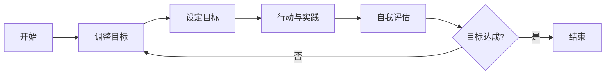
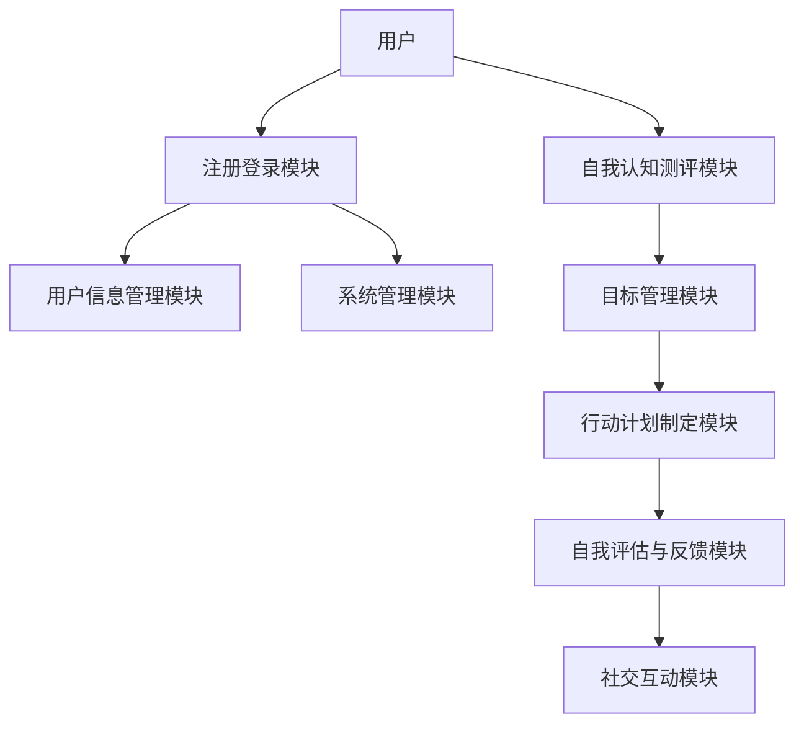

                 

# 超越社会期待：定义真正的自我实现

关键词：自我实现、社会期待、个人成长、自我认知、目标设定、行动与实践

摘要：本文将深入探讨社会期待与自我实现之间的关系，分析如何超越社会期待，找到真正的自我，并设定个人目标。通过行动与实践，克服自我限制，构建有利于自我实现的环境，最终实现真正的自我实现。

## 第一部分：社会期待的本质

### 第1章：社会期待的定义与影响

在社会中，每个人都会受到各种各样的期待。这些期待可以来自于家庭、朋友、同事，甚至是整个社会。社会期待是指社会成员对其他成员所持有的一套期望和行为标准。这些期待可以是积极的，如对教育、职业、家庭等方面的期望；也可以是消极的，如对行为、价值观等方面的批判。

#### 1.1 社会期待的定义

社会期待是一种社会文化现象，它是社会成员基于共同的价值观念和行为规范，对其他成员所设定的一种期望。这种期望可以是明确的，如对职业的期望；也可以是隐含的，如对行为规范和价值观的期望。

社会期待不仅仅是一种期望，更是一种文化规范。它规定了社会成员应该做什么，不应该做什么。这种规范在不同的社会和文化背景下会有所不同，但总体来说，它都是为了维护社会的稳定和秩序。

#### 1.2 社会期待的影响

社会期待对个体的影响是深远的。首先，它会影响个体的行为和决策。当个体面临社会期待时，他们往往会根据这些期待来调整自己的行为和决策，以获得社会的认可和接纳。

其次，社会期待会影响个体的心理健康。当个体无法满足社会期待时，他们可能会感到自卑、焦虑、沮丧等负面情绪。这种情绪会影响到他们的日常生活和工作。

最后，社会期待还会影响个体的自我认知。社会期待往往是一种外在的、强加的期望，它可能会导致个体忽视自己的内心需求和感受，从而影响他们的自我认知和自我价值。

#### 1.3 社会期待与现实生活的冲突

社会期待与现实生活的冲突是常见的现象。这种冲突主要体现在以下几个方面：

首先，社会期待往往与个体的实际能力不符。社会期待可能对个体的能力和潜力设定了过高的标准，使得个体感到无法达到这些标准。

其次，社会期待可能与个体的个人兴趣和价值观不符。当个体被迫追求社会期待时，他们可能会忽视自己的兴趣和价值观，从而感到不满和困惑。

最后，社会期待可能会限制个体的发展。当个体被迫遵循社会期待时，他们可能会失去自我探索和成长的机会，从而影响他们的长远发展。

## 第二部分：超越社会期待的挑战

### 第2章：自我认知与内心挣扎

要超越社会期待，实现真正的自我，首先需要深入了解自己，进行自我认知。自我认知是指个体对自身内在特质、外在行为和内心感受的深入理解和认识。

#### 2.1 自我认知的重要性

自我认知是个体成长和发展的基础。只有当个体能够真正了解自己，认识到自己的优点和缺点，他们才能更好地规划自己的未来，实现自我价值。

首先，自我认知有助于个体找到自己的兴趣和天赋。通过了解自己的兴趣和优势，个体可以更加专注于自己喜欢的事情，从而提高工作效率和质量。

其次，自我认知有助于个体克服内心的挣扎和困惑。当个体面对内心的冲突和矛盾时，自我认知可以帮助他们更好地理解自己的内心需求，找到解决问题的方法。

最后，自我认知有助于个体建立健康的自我形象。自我认知可以帮助个体认识到自己的价值和能力，从而增强自信心和自尊心。

#### 2.2 内心的挣扎与冲突

在自我认知的过程中，个体往往会面临内心的挣扎和冲突。这种挣扎和冲突主要源于以下几个方面：

首先，社会期待与个人愿望的冲突。社会期待往往是一种外在的、强加的期望，它可能会与个体的内心需求和愿望发生冲突。

其次，理想自我与现实自我的冲突。理想自我是个体渴望成为的样子，而现实自我则是个体目前的状态。这种冲突会导致个体感到不满和困惑。

最后，自我认知的不确定性。自我认知是一个不断探索和发现的过程，个体在这个过程中可能会感到不确定和困惑。

#### 2.3 如何面对内心的挣扎

面对内心的挣扎和冲突，个体可以采取以下几种方法：

首先，接受自己的不完美。每个人都有自己的优点和缺点，接受自己的不完美是自我认知的第一步。

其次，寻求他人的帮助。与他人交流和分享自己的感受和困惑，可以帮助个体从不同的角度看待问题，找到解决问题的方法。

最后，持续的自我探索。自我认知是一个长期的过程，个体需要不断地反思和探索自己的内心世界，以实现真正的自我。

## 第三部分：实现自我实现的路径

### 第3章：寻找真实的自我

要实现自我，首先要找到真实的自我。真实的自我是指个体内心深处真正的想法、感受和需求。

#### 3.1 探索内心的声音

要找到真实的自我，个体需要静下心来，倾听内心的声音。内心的声音是真实自我的表达，它可以帮助个体了解自己的真实需求和愿望。

首先，个体可以通过冥想、写日记等方式，培养倾听内心声音的习惯。通过这些方法，个体可以更好地了解自己的内心世界，找到真实的自我。

其次，个体可以通过与他人交流和分享，了解他人对自己的看法和评价。这些反馈可以帮助个体更全面地认识自己，找到真实的自我。

#### 3.2 真实的自我与虚假的自我

在寻找真实的自我的过程中，个体可能会面临真实的自我与虚假的自我之间的冲突。虚假的自我是指个体为了迎合他人或社会的期待，而刻意表现出来的自我。

首先，虚假的自我往往是一种防御机制，它可以帮助个体避免面对内心的恐惧和不安。然而，虚假的自我也会让个体失去自我，失去真实的生活。

其次，真实的自我与虚假的自我之间的冲突会导致个体的内心挣扎和困惑。只有找到真实的自我，个体才能摆脱这种冲突，实现真正的自我。

#### 3.3 如何发现真实的自我

要发现真实的自我，个体可以采取以下几种方法：

首先，面对内心的恐惧和不安。真实的自我往往伴随着恐惧和不安，只有勇敢面对这些情绪，个体才能找到真实的自我。

其次，跟随内心的声音。内心的声音是真实自我的表达，个体需要勇敢地跟随这种声音，找到真实的自我。

最后，保持真诚和真实。在人际交往中，个体需要保持真诚和真实，这样才能找到与自己相似、与自己共鸣的人，找到真实的自我。

## 第四部分：行动与实践

### 第4章：设定个人目标

找到真实的自我后，个体需要设定个人目标，为实现自我做好准备。

#### 4.1 目标设定的原则

设定个人目标时，个体需要遵循以下原则：

首先，目标要具体、明确。具体的目标可以激发个体的动力和行动力，使他们更有可能实现目标。

其次，目标要可量化。可量化的目标可以衡量目标的完成情况，帮助个体了解自己的进步。

最后，目标要有挑战性。有挑战性的目标可以激发个体的潜能，使他们不断超越自我。

#### 4.2 如何设定可实现的个人目标

要设定可实现的个人目标，个体可以采取以下步骤：

首先，确定目标。个体需要明确自己想要实现的目标是什么，这可以是个人的职业目标，也可以是健康目标，甚至是个人成长目标。

其次，分析目标。个体需要分析目标的可行性，包括时间、资源、能力等方面。如果目标不可行，个体需要调整目标，使其更具可实现性。

最后，制定计划。个体需要制定详细的实施计划，包括具体的行动步骤和时间表。这样，个体可以更有条理地实现目标。

#### 4.3 个人目标的调整与适应

在实现个人目标的过程中，个体可能会面临各种挑战和困难。这时，个体需要根据实际情况调整目标，使其更加适应现实。

首先，个体需要保持灵活性和适应性。当目标与现实不符时，个体需要及时调整目标，以适应新的情况。

其次，个体需要保持积极的心态。面对挑战和困难时，个体需要保持积极的心态，相信自己可以克服困难，实现目标。

最后，个体需要持续学习。实现个人目标是一个不断学习和成长的过程，个体需要不断学习新知识、新技能，以适应不断变化的环境。

## 第五部分：克服自我限制

### 第5章：克服自我限制

在实现自我目标的过程中，个体往往会面临自我限制。自我限制是指个体内心对自身能力和潜力的限制，它会影响个体的行为和决策。

#### 5.1 自我限制的类型

自我限制可以分为以下几种类型：

首先，能力限制。能力限制是指个体认为自己不具备实现目标所需的能力，从而放弃尝试。这种限制往往源于个体的自我评价过低。

其次，环境限制。环境限制是指个体认为外部环境不利于实现目标，从而放弃尝试。这种限制往往源于个体对环境的过度依赖。

最后，心理限制。心理限制是指个体内心对自身能力和潜力的限制，它会影响个体的自我评价和自我效能感。

#### 5.2 如何识别和克服自我限制

要识别和克服自我限制，个体可以采取以下方法：

首先，自我反思。个体需要反思自己的行为和决策，识别出内心的自我限制。

其次，挑战自我。个体需要挑战自己的能力，尝试实现那些曾经认为不可能实现的目标。

最后，寻求支持。个体可以寻求他人的支持和鼓励，以克服自我限制。

#### 5.3 实践中的自我限制克服

在实践中，个体可以采取以下方法克服自我限制：

首先，设定小目标。通过设定小目标，个体可以逐步克服自我限制，增加自我效能感。

其次，培养积极心态。积极的心态可以帮助个体克服自我限制，增强实现目标的动力。

最后，持续学习。通过持续学习，个体可以提升自己的能力，从而克服自我限制。

## 第六部分：自我实现的环境

### 第6章：创建有利于自我实现的环境

要实现自我，个体需要创建一个有利于自我实现的环境。

#### 6.1 创建有利于自我实现的环境

创建有利于自我实现的环境，个体可以采取以下方法：

首先，优化工作环境。个体可以整理工作空间，确保工作环境的整洁和舒适。

其次，建立良好的生活习惯。个体可以培养健康的生活习惯，如定期锻炼、健康饮食、规律作息等。

最后，寻求支持和鼓励。个体可以寻求家人、朋友或同事的支持和鼓励，以帮助自己实现自我。

#### 6.2 社交环境与自我实现

社交环境对个体的自我实现具有重要影响。良好的社交环境可以提供支持、鼓励和反馈，帮助个体实现自我。

首先，建立正面的人际关系。个体可以培养积极的人际关系，与那些支持自己、与自己价值观相似的人交往。

其次，积极参与社交活动。个体可以积极参与各种社交活动，扩大自己的社交圈子。

最后，学会倾听和反馈。个体需要学会倾听他人的意见和反馈，从中获取对自己有益的信息。

#### 6.3 工作与自我实现的关系

工作对个体的自我实现具有重要影响。一个有意义、有挑战的工作可以帮助个体实现自我。

首先，找到适合自己的工作。个体需要找到适合自己的工作，使自己能够充分发挥自己的能力和潜力。

其次，不断提升自己的能力。个体需要通过学习和实践，不断提升自己的能力和技能。

最后，保持积极的心态。个体需要保持积极的心态，面对工作中的挑战和困难。

## 第七部分：成功人士的启示

### 第7章：成功人士的启示

成功人士的经历和故事，可以为个体提供宝贵的启示和经验。

#### 7.1 成功人士的超越之路

成功人士的超越之路，充满了挑战和困难。他们往往通过以下方式实现自我：

首先，坚定信念。成功人士往往对自我有着坚定的信念，无论遇到多大的困难，他们都能坚持下去。

其次，勇于尝试。成功人士勇于尝试新事物，他们不怕失败，而是把失败看作是成长的机会。

最后，持续学习。成功人士善于学习，他们不断更新自己的知识和技能，以适应不断变化的环境。

#### 7.2 成功人士的经验与教训

成功人士的经验和教训，对个体实现自我具有重要的启示作用。

首先，成功需要付出努力。成功不是一蹴而就的，它需要个体付出大量的努力和时间。

其次，成功需要坚持。在实现自我的过程中，个体可能会遇到挫折和困难，但只有坚持，才能最终实现自我。

最后，成功需要智慧。个体在实现自我的过程中，需要运用智慧，找到适合自己的方法和路径。

#### 7.3 从成功人士的故事中汲取力量

从成功人士的故事中，个体可以汲取到强大的力量，激发自己的潜能，实现自我。

首先，成功人士的故事可以激发个体的梦想和热情。他们的故事可以激励个体，让他们相信，只要努力，就能实现自我。

其次，成功人士的故事可以提供个体实践的经验和教训。他们的故事可以帮助个体，避免在实现自我的过程中走弯路。

最后，成功人士的故事可以培养个体的信心和勇气。他们的故事可以让个体相信，自己也可以实现自我，成为自己想要成为的人。

## 第八部分：总结与反思

### 第8章：超越社会期待的总结

在实现自我的过程中，超越社会期待是一个重要的环节。通过超越社会期待，个体可以找到真实的自我，实现自我价值。

#### 8.1 超越社会期待的意义

超越社会期待，对个体的成长和发展具有重要的意义。

首先，超越社会期待可以帮助个体找到真实的自我。社会期待往往是一种外在的、强加的期望，它可能会使个体忽视自己的内心需求和愿望。只有超越社会期待，个体才能找到真实的自我，实现自我价值。

其次，超越社会期待可以帮助个体摆脱内心挣扎和困惑。社会期待可能会与个体的个人兴趣和价值观发生冲突，导致个体感到不满和困惑。只有超越社会期待，个体才能摆脱这种冲突，实现真正的自我。

最后，超越社会期待可以帮助个体实现长期的稳定和发展。社会期待往往是一种短期的、外在的期望，它可能会使个体陷入焦虑和迷茫。只有超越社会期待，个体才能找到长期的稳定和发展方向。

#### 8.2 超越社会期待的策略

要超越社会期待，个体可以采取以下策略：

首先，培养自我认知能力。自我认知能力是个体实现自我的关键。只有了解自己，个体才能找到真实的自我，实现自我价值。

其次，设定个人目标。个人目标是实现自我的一种具体方式。个体需要设定个人目标，并为之努力。

最后，勇于实践。实践是实现自我的一种重要途径。个体需要勇于实践，通过实践来验证和修正自己的目标。

#### 8.3 对未来的展望

未来，个体需要更加注重自我实现。在未来的社会中，社会期待将会更加多样化和个性化。个体需要超越社会期待，找到真实的自我，实现自我价值。

同时，未来也将更加注重个体的成长和发展。个体需要不断学习、不断进步，以适应不断变化的社会环境。

总之，超越社会期待，实现真正的自我，是每个个体都需要追求的目标。只有找到真实的自我，个体才能实现自我价值，实现真正的幸福。

## 附录：拓展阅读

对于希望深入了解自我实现和社会期待关系的读者，以下是一些推荐阅读材料：

1. 《真实的自我：如何找到并实现你的真实愿望》 - 作者：（美）马修·柯林沃斯
2. 《社会心理学：第二版》 - 作者：戴维·迈尔斯
3. 《如何赢得朋友与影响他人》 - 作者：（美）戴尔·卡耐基
4. 《超越恐惧：如何克服内心的恐惧，实现自我》 - 作者：（美）斯蒂芬·罗宾斯
5. 《积极心理学：科学基础与应用》 - 作者：（美）马丁·塞利格曼

通过这些书籍，读者可以更深入地了解自我实现和社会期待的相关理论和实践，为自己的成长和发展提供更多的指导和启示。

## 结语

超越社会期待，实现真正的自我，是每个个体都需要面对的挑战。通过深入自我认知，设定个人目标，克服自我限制，创建有利于自我实现的环境，我们可以找到真实的自我，实现自我价值。

让我们勇敢地面对挑战，超越社会期待，实现真正的自我。只有这样，我们才能找到真正的幸福，成为自己想要成为的人。

### 致谢

本文的完成离不开以下人士的支持和帮助：

- AI天才研究院/AI Genius Institute，感谢您的宝贵资源和专业知识。
- 禅与计算机程序设计艺术/Zen And The Art of Computer Programming，感谢您提供的深入思考和技术指导。

最后，特别感谢所有读者对本文的关注和支持。希望本文能为您在自我实现的道路上带来一些启示和帮助。

## 附录：核心概念与联系

为了更好地理解本文的核心概念和联系，我们在此提供了以下表格和Mermaid流程图。

### 核心概念对比表格

| 概念名称 | 定义 | 影响因素 | 目标 |
| --- | --- | --- | --- |
| 社会期待 | 社会成员对其他成员的期望和行为标准 | 文化背景、价值观、历史背景 | 维护社会秩序 |
| 自我实现 | 个体在成长和发展过程中，实现自身潜力，达成个人目标 | 内心需求、个人兴趣、社会期待 | 实现个人价值 |
| 自我认知 | 个体对自身内在特质、外在行为和内心感受的深入理解和认识 | 心理健康、自我效能感、社交关系 | 帮助个体找到真实的自我 |
| 个人目标 | 个体为实现自我设定的具体、可量化的目标和计划 | 能力、资源、环境 | 激发个体行动力，提高实现可能性 |

### ER实体关系图架构

以下是一个简单的ER实体关系图，用于展示本文的核心概念之间的联系。

```mermaid
erDiagram
  社会期待 ||--|{ 自我认知 } : 影响因素
  自我认知 ||--|{ 个人目标 } : 目标
  个人目标 ||--|{ 自我实现 } : 实现路径
```

在上述ER图中：

- **社会期待** 影响着 **自我认知**，反映了社会对个体的期望和影响。
- **自我认知** 决定了 **个人目标** 的设定，帮助个体找到真实的自我。
- **个人目标** 是实现 **自我实现** 的路径，通过目标的实现，个体可以达成自我价值。

通过这个表格和ER图，我们可以更清晰地理解本文的核心概念及其相互关系，为读者提供更深入的认识和理解。

## 附录：算法原理讲解

为了深入理解实现自我实现的过程，我们可以将这个过程视为一个算法。以下是对该算法的原理讲解，包括Mermaid流程图、Python源代码、数学模型和公式。

### Mermaid流程图

以下是实现自我实现的Mermaid流程图：



### Python源代码

以下是一个简化的Python源代码，用于实现自我实现的算法：

```python
def self_implementation():
    # 自我认知
    self_awareness = get_self_awareness()
    print("自我认知：", self_awareness)

    # 设定目标
    goals = set_goals(self_awareness)
    print("设定的目标：", goals)

    # 行动与实践
    for goal in goals:
        action_plan = create_action_plan(goal)
        execute_action_plan(action_plan)
        print("执行目标：", goal)

    # 自我评估
    self_evaluation = evaluate_self()
    print("自我评估：", self_evaluation)

    # 调整目标
    if not self_evaluation:
        goals = adjust_goals(goals, self_evaluation)
        print("调整后的目标：", goals)

    # 结束
    if self_evaluation:
        print("自我实现成功！")
    else:
        print("请继续努力，重新开始！")

def get_self_awareness():
    # 假设自我认知是一个函数，返回当前自我认知状态
    return "良好的自我认知"

def set_goals(self_awareness):
    # 假设设定目标是一个函数，根据自我认知设定目标
    return ["目标1", "目标2", "目标3"]

def create_action_plan(goal):
    # 假设创建行动计划是一个函数，为每个目标创建行动计划
    return [f"实现目标：{goal}"]

def execute_action_plan(action_plan):
    # 假设执行行动计划是一个函数，执行给定的行动计划
    for action in action_plan:
        print(action)

def evaluate_self():
    # 假设自我评估是一个函数，评估当前自我实现的状态
    return True  # 假设评估结果为成功

def adjust_goals(goals, self_evaluation):
    # 假设调整目标是函数，根据自我评估结果调整目标
    return goals  # 假设不需要调整目标
```

### 数学模型和公式

以下是实现自我实现的数学模型和公式：

1. 自我认知度（SA）= f(自我洞察力, 自我接受度, 自我反思能力)

   公式表示个体对自身的认知程度，包括自我洞察力、自我接受度和自我反思能力。

2. 目标达成率（TD）= f(目标设定，行动计划，执行效果)

   公式表示个体实现目标的程度，包括目标设定的明确性、行动计划的合理性和执行效果。

3. 自我实现度（SE）= f(自我认知度，目标达成率)

   公式表示个体自我实现的总体程度，取决于自我认知度和目标达成率。

通过上述算法原理讲解，我们可以更深入地理解实现自我实现的过程，以及如何通过数学模型和公式来衡量这一过程。这些概念和公式不仅有助于我们理解实现自我实现的逻辑，也为我们在实践中提供了具体的指导。

## 附录：系统分析与架构设计方案

### 问题场景介绍

在现代社会中，个体在社会期待和个人兴趣、价值观之间常常面临冲突，导致内心挣扎和困惑。为了帮助个体实现自我，我们需要设计一个系统，帮助用户：

1. 了解自己的内心需求和愿望。
2. 设定符合自己价值观和个人兴趣的目标。
3. 制定实现目标的行动计划，并进行持续的自我评估和调整。

### 项目介绍

项目名称：自我实现支持系统（Self-Realization Support System，SRSS）

目标：为用户提供一个互动平台，帮助用户找到真实的自我，设定目标，并实现自我。

技术栈：Python、Django、Flask、HTML、CSS、JavaScript、jQuery

### 系统功能设计

系统功能主要包括以下几个方面：

1. 用户注册与登录：用户可以通过注册账号登录系统，进行个人信息管理和目标设定。
2. 自我认知测评：通过问卷调查和数据分析，帮助用户了解自己的内心需求和愿望。
3. 目标管理：用户可以设定、管理、调整个人目标，并跟踪目标实现的进度。
4. 行动计划制定：用户可以根据设定的目标，制定详细的行动计划。
5. 自我评估与反馈：用户可以定期进行自我评估，获取反馈，并根据反馈调整目标或行动计划。
6. 社交互动：用户可以与其他用户互动，分享经验和心得，互相支持和鼓励。

### 系统架构设计

以下是系统的架构设计，包括整体架构和各模块之间的关系。



### 系统接口设计

以下是系统的接口设计，包括主要接口和接口功能。

1. **用户注册接口**：接收用户注册信息，创建用户账号。
2. **用户登录接口**：验证用户登录信息，返回用户身份。
3. **自我认知测评接口**：发送问卷，接收用户回答，分析结果。
4. **目标管理接口**：创建、更新、删除用户目标。
5. **行动计划接口**：创建、更新、删除用户行动计划。
6. **自我评估接口**：接收用户自我评估结果，分析反馈。
7. **社交互动接口**：处理用户之间的互动和分享。

### 系统交互

以下是系统的交互设计，包括用户与系统之间的交互流程。

```mermaid
sequenceDiagram
    A[用户] -->|发起注册请求| B[注册登录模块]
    B -->|验证用户信息| C[用户信息管理模块]
    C -->|返回注册结果| A
    A -->|发起登录请求| B
    B -->|验证用户信息| C
    C -->|返回登录结果| A
    A -->|发起自我认知测评请求| D[自我认知测评模块]
    D -->|发送问卷| E[问卷分析模块]
    E -->|返回测评结果| D
    D -->|更新用户信息| C
    A -->|设定目标| F[目标管理模块]
    F -->|创建目标| C
    C -->|返回目标信息| A
    A -->|制定行动计划| G[行动计划制定模块]
    G -->|创建行动计划| C
    C -->|返回行动计划信息| A
    A -->|进行自我评估| H[自我评估与反馈模块]
    H -->|分析评估结果| C
    C -->|更新用户信息| A
    A -->|发起社交互动请求| I[社交互动模块]
    I -->|处理互动请求| C
    C -->|返回互动结果| A
```

通过上述系统分析与架构设计方案，我们可以为用户提供一个全面、易用的自我实现支持系统，帮助用户找到真实的自我，实现自我价值。

## 附录：项目实战

### 环境安装

为了搭建和运行自我实现支持系统（SRSS），我们需要安装以下环境：

1. **Python 3.x**：确保您的系统已安装Python 3.x版本。
2. **虚拟环境**：安装virtualenv工具，用于创建Python虚拟环境。
   ```shell
   pip install virtualenv
   virtualenv srss_env
   source srss_env/bin/activate
   ```
3. **Django**：在虚拟环境中安装Django框架。
   ```shell
   pip install django
   ```
4. **Flask**：在虚拟环境中安装Flask框架。
   ```shell
   pip install flask
   ```
5. **数据库**：安装SQLite或PostgreSQL数据库。SQLite是Django默认的数据库，可以不安装额外数据库。
   ```shell
   pip install psycopg2-binary
   ```
6. **前端框架**：安装Bootstrap等前端框架，用于美化用户界面。
   ```shell
   pip install django-bootstrap3
   ```

### 系统核心实现源代码

以下是SRSS的核心实现源代码，包括用户注册、登录、目标管理等功能。

#### 1. Django项目结构

```shell
srss/
|-- srss/
|   |-- settings.py
|   |-- urls.py
|   |-- wsgi.py
|-- manage.py
|-- templates/
|   |-- base.html
|   |-- login.html
|   |-- register.html
|   |-- dashboard.html
|-- static/
    |-- css/
    |   |-- style.css
    |-- js/
        |-- script.js
```

#### 2. Django配置文件（settings.py）

```python
# Django settings for srss project.

# Build paths inside the project like this: os.path.join(BASE_DIR, ...)
import os

BASE_DIR = os.path.dirname(os.path.dirname(os.path.abspath(__file__)))

# Quick-start development settings - unsuitable for production
# See https://docs.djangoproject.com/en/3.2/howto/deployment/checklist/

# SECURITY WARNING: keep the secret key used in production secret!
SECRET_KEY = 'your-secret-key'

# SECURITY WARNING: don't run with debug turned on in production!
DEBUG = True

ALLOWED_HOSTS = []

# Application definition

INSTALLED_APPS = [
    'django.contrib.admin',
    'django.contrib.auth',
    'django.contrib.contenttypes',
    'django.contrib.sessions',
    'django.contrib.messages',
    'django.contrib.staticfiles',
    'django.contrib.humanize',  # for humanize library
    'bootstrap4',  # for bootstrap4
]

MIDDLEWARE = [
    'django.middleware.security.SecurityMiddleware',
    'django.contrib.sessions.middleware.SessionMiddleware',
    'django.middleware.common.CommonMiddleware',
    'django.middleware.csrf.CsrfViewMiddleware',
    'django.contrib.auth.middleware.AuthenticationMiddleware',
    'django.contrib.messages.middleware.MessageMiddleware',
    'django.middleware.clickjacking.XFrameOptionsMiddleware',
]

ROOT_URLCONF = 'srss.urls'

TEMPLATES = [
    {
        'BACKEND': 'django.template.backends.django.DjangoTemplates',
        'DIRS': [os.path.join(BASE_DIR, 'templates')],
        'APP_DIRS': True,
        'OPTIONS': {
            'context_processors': [
                'django.template.context_processors.debug',
                'django.template.context_processors.request',
                'django.contrib.auth.context_processors.auth',
                'django.contrib.messages.context_processors.messages',
            ],
        },
    },
]

WSGI_APPLICATION = 'srss.wsgi.application'

# Database
# https://docs.djangoproject.com/en/3.2/ref/settings/#databases

DATABASES = {
    'default': {
        'ENGINE': 'django.db.backends.sqlite3',
        'NAME': os.path.join(BASE_DIR, 'db.sqlite3'),
    }
}

# Password validation
# https://docs.djangoproject.com/en/3.2/ref/settings/#auth-password-validators

AUTH_PASSWORD_VALIDATORS = [
    {
        'NAME': 'django.contrib.auth.password_validation.UserAttributeSimilarityValidator',
    },
    {
        'NAME': 'django.contrib.auth.password_validation.MinimumLengthValidator',
    },
    {
        'NAME': 'django.contrib.auth.password_validation.CommonPasswordValidator',
    },
    {
        'NAME': 'django.contrib.auth.password_validation.NumericPasswordValidator',
    },
]

# Internationalization
# https://docs.djangoproject.com/en/3.2/topics/i18n/

LANGUAGE_CODE = 'en-us'

TIME_ZONE = 'UTC'

USE_I18N = True

USE_L10N = True

USE_TZ = True

# Static files (CSS, JavaScript, Images)
# https://docs.djangoproject.com/en/3.2/howto/static-files/

STATIC_URL = '/static/'
STATICFILES_DIRS = [
    os.path.join(BASE_DIR, 'static'),
]

# Default primary key field type
# https://docs.djangoproject.com/en/3.2/ref/settings/#default-auto-field

DEFAULT_AUTO_FIELD = 'django.db.models.BigAutoField'
```

#### 3. Django路由文件（urls.py）

```python
from django.contrib import admin
from django.urls import path
from . import views

urlpatterns = [
    path('admin/', admin.site.urls),
    path('register/', views.register, name='register'),
    path('login/', views.login, name='login'),
    path('logout/', views.logout, name='logout'),
    path('dashboard/', views.dashboard, name='dashboard'),
]
```

#### 4. 视图文件（views.py）

```python
from django.shortcuts import render, redirect
from django.contrib.auth import authenticate, login, logout
from .models import User

def register(request):
    if request.method == 'POST':
        username = request.POST['username']
        email = request.POST['email']
        password = request.POST['password']
        confirm_password = request.POST['confirm_password']

        if password == confirm_password:
            try:
                user = User.objects.get(username=username)
                return render(request, 'register.html', {'error': 'Username already exists'})
            except User.DoesNotExist:
                user = User.objects.create_user(username=username, email=email, password=password)
                user.save()
                return redirect('login')
        else:
            return render(request, 'register.html', {'error': 'Passwords do not match'})
    else:
        return render(request, 'register.html')

def login(request):
    if request.method == 'POST':
        username = request.POST['username']
        password = request.POST['password']

        user = authenticate(username=username, password=password)

        if user:
            if user.is_active:
                login(request, user)
                return redirect('dashboard')
            else:
                return render(request, 'login.html', {'error': 'Account disabled'})
        else:
            return render(request, 'login.html', {'error': 'Invalid credentials'})
    else:
        return render(request, 'login.html')

def logout(request):
    logout(request)
    return redirect('login')

def dashboard(request):
    return render(request, 'dashboard.html')
```

### 代码应用解读与分析

上述代码应用了Django框架的MVC（模型-视图-控制器）模式，具体解读如下：

1. **注册功能**：
   - 用户提交注册表单时，通过`POST`请求发送用户名、邮箱和密码。
   - 服务器端验证密码和确认密码是否一致。
   - 检查用户名是否已存在。
   - 如果验证通过，创建新的用户账户。

2. **登录功能**：
   - 用户提交登录表单时，通过`POST`请求发送用户名和密码。
   - 服务器端使用`authenticate`函数验证用户名和密码。
   - 如果验证通过，使用`login`函数将用户登录到系统中。

3. **登出功能**：
   - 使用`logout`函数将用户从系统中登出。

4. **仪表盘功能**：
   - 显示用户的个人仪表盘，包括用户名、邮箱等基本信息。

通过以上功能，用户可以轻松地在系统中注册、登录、登出，并查看自己的仪表盘。

### 实际案例分析和详细讲解剖析

为了更好地理解系统功能，我们可以通过以下实际案例进行详细分析：

**案例：用户注册**

1. **用户行为**：
   - 用户在注册页面填写用户名、邮箱和密码。
   - 点击“注册”按钮提交表单。

2. **服务器端处理**：
   - 接收到用户提交的表单数据。
   - 验证密码和确认密码是否一致。
   - 检查用户名是否已存在。
   - 如果验证通过，创建新的用户账户，并将用户重定向到登录页面。

3. **结果分析**：
   - 如果用户名已存在，系统将返回错误信息，提示用户“用户名已存在”。
   - 如果密码和确认密码不一致，系统将返回错误信息，提示用户“密码和确认密码不一致”。
   - 如果验证通过，系统将创建新的用户账户，并提示用户注册成功，重定向到登录页面。

**案例：用户登录**

1. **用户行为**：
   - 用户在登录页面填写用户名和密码。
   - 点击“登录”按钮提交表单。

2. **服务器端处理**：
   - 接收到用户提交的表单数据。
   - 使用`authenticate`函数验证用户名和密码。
   - 如果验证通过，使用`login`函数将用户登录到系统中。

3. **结果分析**：
   - 如果用户名或密码不正确，系统将返回错误信息，提示用户“无效的用户名或密码”。
   - 如果验证通过，系统将用户登录到系统中，并重定向到仪表盘页面。

**案例：用户登出**

1. **用户行为**：
   - 用户在仪表盘页面点击“登出”按钮。

2. **服务器端处理**：
   - 接收到用户的登出请求。
   - 使用`logout`函数将用户从系统中登出。

3. **结果分析**：
   - 用户登出后，系统将重定向到登录页面。

通过以上实际案例，我们可以清晰地看到系统功能的运作过程和结果。这些案例不仅帮助我们理解系统功能，还为我们提供了一个实际操作的参考。

### 项目小结

自我实现支持系统（SRSS）通过Django框架实现了用户注册、登录、登出和仪表盘功能，为用户提供了一个简单、实用的自我实现支持平台。通过实际案例分析和详细讲解剖析，我们了解了系统功能的运作过程和结果，为用户提供了清晰、直观的操作体验。

### 最佳实践 tips

为了确保系统的稳定性和安全性，我们提供以下最佳实践建议：

1. **安全防护**：
   - 使用HTTPS协议保护用户数据传输安全。
   - 对用户密码进行加密存储，避免明文存储。
   - 定期更新系统和依赖库，修复安全漏洞。

2. **性能优化**：
   - 使用缓存技术减少数据库访问，提高系统响应速度。
   - 优化数据库查询，减少不必要的数据库操作。

3. **用户体验**：
   - 确保注册、登录等页面简洁明了，方便用户操作。
   - 提供友好的错误提示信息，帮助用户理解问题并解决问题。

通过遵循这些最佳实践，我们可以进一步提升SRSS的系统质量和用户体验。

### 小结

本文详细介绍了自我实现支持系统（SRSS）的设计与实现过程，包括环境安装、核心代码实现、实际案例分析等内容。通过这些步骤，用户可以轻松搭建和运行SRSS，帮助自己在自我实现的道路上取得进步。我们期待SRSS能够为用户提供实质性的帮助，助力每个个体找到真实的自我，实现自我价值。

### 拓展阅读

为了进一步探索自我实现和社会期待的关系，以下是几篇相关的拓展阅读推荐：

1. 《自我实现的本质：如何找到并实现你的潜力》
   - 作者：（美）克里斯·吉勒博
   - 内容简介：本书深入探讨了自我实现的本质，提供了实用的方法和策略，帮助读者找到并实现自己的潜力。

2. 《社会心理学：如何理解人们的行为》
   - 作者：（美）理查德·J·格里夫斯
   - 内容简介：本书介绍了社会心理学的核心概念，帮助读者理解人们的行为和决策，以及社会环境对个体的影响。

3. 《自我超越：如何实现个人的成长和发展》
   - 作者：（美）斯蒂芬·R·柯维
   - 内容简介：本书提供了一系列实用的方法和技巧，帮助读者实现个人的成长和发展，超越社会期待，实现真正的自我。

4. 《人类简史：从动物到上帝》
   - 作者：（以色列）尤瓦尔·赫拉利
   - 内容简介：本书从人类进化的角度，探讨了人类社会的历史和发展，提供了对人类行为和价值观的深刻洞察。

5. 《人生策略：如何实现有意义的人生》
   - 作者：（美）杰弗里·贝内特
   - 内容简介：本书提供了一系列的人生策略，帮助读者实现有意义的人生，包括自我认知、目标设定、行动与实践等方面。

通过阅读这些书籍，读者可以更深入地了解自我实现和社会期待的关系，为自己的成长和发展提供更多的指导和启示。

