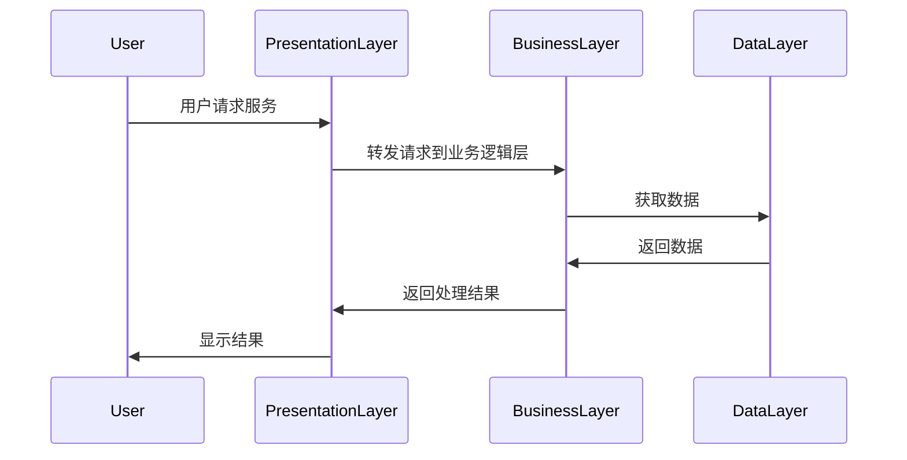
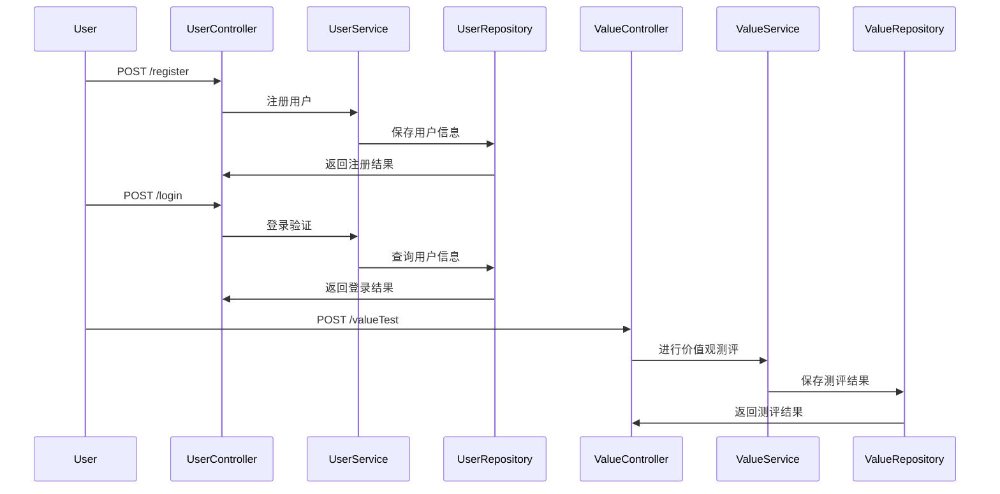

                 

# 超越虚无：在现代社会中重建生活意义

> 关键词：虚无感、生活意义、重建方法、价值观、人际关系、自我认知

> 摘要：本文旨在探讨现代社会中普遍存在的虚无感现象，分析其成因及影响，并从价值观重塑、人际关系改善、自我认知提升等方面提出重建生活意义的方法。通过深入的理论分析和实际案例，为读者提供实用的行动指南。

## 引言

### 1.1 问题背景

在现代社会，随着物质生活的丰富和科技的发展，人们在追求物质财富的同时，却越来越感受到内心的空虚和失落。虚无感成为许多人生活中的普遍现象，尤其在高压、快节奏的生活环境中，这种情绪更为明显。虚无感不仅影响了个体的心理健康，也对社会的和谐稳定产生了负面影响。因此，如何重建生活意义，成为一个亟待解决的重要课题。

### 1.1.1 背景介绍

虚无感是指个体对生活缺乏兴趣、意义和目标的感受，常常伴随着焦虑、抑郁等情绪。其产生的原因复杂多样，包括环境因素、个人因素等。现代社会的高压、快节奏生活使得人们疲惫不堪，而个体成长背景、心理素质、价值观等也会影响虚无感的产生。

### 1.1.1.1 现代社会中的虚无感

现代社会中，人们在追求物质财富的过程中，往往忽略了精神层面的需求。过度的竞争、功利的心态使得人们感到疲惫、无助，进而产生虚无感。虚无感削弱了个体对生活意义的感知，导致内心空虚、焦虑等负面情绪。

### 1.1.1.2 问题描述

虚无感不仅影响了个体的心理健康，也对社会的和谐稳定产生了负面影响。许多人在虚无感的驱使下，可能出现心理问题、社交障碍、工作效率下降等问题，进而影响个人的生活质量和社会的稳定。

### 1.1.1.3 问题解决

本书旨在通过探讨现代社会中的虚无感，寻找重建生活意义的方法和途径。通过对历史、哲学、心理学等领域的深入研究，结合实际案例，为读者提供有价值的思考和行动指南。希望通过本文的探讨，能够帮助读者认识到虚无感的危害，并找到重建生活意义的方法。

### 1.1.1.4 边界与外延

虚无感不仅仅是个体内心的感受，也与社会环境、文化背景密切相关。因此，在探讨问题时，我们需要考虑这些因素，以更全面、深入地探讨生活意义的重建。

### 1.1.1.5 概念结构与核心要素组成

重建生活意义的核心要素包括：价值观的重塑、人际关系的改善、自我认知的提升等。这些要素相互联系，共同构成了重建生活意义的基础框架。

## 第一部分：引言

### 1.2 核心概念与联系

#### 1.2.1 生活意义

#### 1.2.1.1 定义

生活意义是指个体在生活中所追求的目标、价值观和意义。它是个体对生命、人生意义的理解和追求。

#### 1.2.1.2 特点

1. 主观性：生活意义因人而异，每个人对生活意义的理解和追求都有所不同。
2. 动态性：生活意义不是一成不变的，它会随着时间和环境的变化而调整。
3. 综合性：生活意义不仅包括物质层面的满足，还涉及精神层面的追求。

#### 1.2.1.3 生活意义与虚无感的关系

1. 负面影响：虚无感削弱了个体对生活意义的感知，导致内心空虚、焦虑等负面情绪。
2. 积极作用：重建生活意义有助于消除虚无感，增强个体对生活的积极态度和信心。

#### 1.2.2 虚无感

#### 1.2.2.1 定义

虚无感是指个体对生活缺乏兴趣、意义和目标的感受，常常伴随着焦虑、抑郁等情绪。

#### 1.2.2.2 原因

1. 环境因素：现代社会的高压、快节奏生活，导致人们感到疲惫、无助。
2. 个人因素：个体成长背景、心理素质、价值观等也会影响虚无感的产生。

#### 1.2.2.3 虚无感的影响与应对

1. 影响：虚无感可能导致个体心理问题、社交障碍、工作效率下降等。
2. 对策：通过调整生活方式、培养兴趣爱好、寻求心理支持等方式，缓解虚无感。

#### 1.2.3 重建生活意义的方法

#### 1.2.3.1 价值观的重塑

##### 1.2.3.1.1 定义

价值观是指个体对事物的判断标准和行为准则。重塑价值观是指重新审视和调整个体的价值观念。

##### 1.2.3.1.2 方法

1. 自我反思：通过反思自己的行为和思想，识别和改变不合理、负面的价值观。
2. 学习与交流：通过学习新知识、交流心得体会，拓宽视野，形成更积极、健康的价值观。

#### 1.2.3.2 人际关系的改善

##### 1.2.3.2.1 定义

人际关系是指个体与周围人之间的相互关系。改善人际关系有助于增强个体的社会支持，提高生活幸福感。

##### 1.2.3.2.2 方法

1. 增进沟通：通过主动沟通、倾听他人意见，建立信任和理解。
2. 增强同理心：设身处地为他人着想，关注他人的需求和感受。

#### 1.2.3.3 自我认知的提升

##### 1.2.3.3.1 定义

自我认知是指个体对自己心理、行为、能力等方面的认识和评价。

##### 1.2.3.3.2 方法

1. 自我反思：通过定期回顾自己的行为和表现，了解自己的优点和不足。
2. 自我激励：设定目标，鼓励自己不断进步，提升自我认知。

### 1.2.4 本书结构

#### 1.2.4.1 本书主要分为以下几个部分：

1. 引言：介绍问题背景、核心概念与联系。
2. 生活意义的重建：探讨价值观的重塑、人际关系的改善、自我认知的提升等方法。
3. 案例分析：分析现实生活中的具体案例，探讨重建生活意义的过程和效果。
4. 最佳实践：总结有效的重建生活意义的方法和策略。
5. 结论：总结全书内容，提出未来研究的方向和建议。

#### 1.2.4.2 本书特点

1. 系统性：全面探讨重建生活意义的各个方面，提供系统性的方法和策略。
2. 实用性：结合现实生活中的案例，提供具体的操作方法和实践技巧。
3. 深度：深入分析生活意义与虚无感的关系，探讨重建生活意义的重要性。

## 第二部分：重建生活意义的方法

### 2.1 价值观的重塑

#### 2.1.1 定义

价值观是指个体对事物的判断标准和行为准则。重塑价值观是指重新审视和调整个体的价值观念，以更积极、健康的心态面对生活。

#### 2.1.2 方法

1. 自我反思：通过反思自己的行为和思想，识别和改变不合理、负面的价值观。

2. 学习与交流：通过学习新知识、交流心得体会，拓宽视野，形成更积极、健康的价值观。

### 2.1.3 实例分析

以李明为例，他是一位成功的商人，但长期以来，他感到生活缺乏意义。通过自我反思和学习，他意识到自己的价值观过于功利，忽视了人际关系和自我成长。于是，他开始关注家庭和朋友，积极参与公益活动，重拾对生活的热情。

### 2.1.4 结果与启示

李明的经历表明，重塑价值观有助于改善生活质量和心理健康。对于每个人来说，找到适合自己的价值观，是重建生活意义的关键。

### 2.2 人际关系的改善

#### 2.2.1 定义

人际关系是指个体与周围人之间的相互关系。改善人际关系有助于增强个体的社会支持，提高生活幸福感。

#### 2.2.2 方法

1. 增进沟通：通过主动沟通、倾听他人意见，建立信任和理解。

2. 增强同理心：设身处地为他人着想，关注他人的需求和感受。

### 2.2.3 实例分析

以张丽为例，她是一位职场女性，因为工作忙碌，与丈夫的沟通越来越少。通过参加心理辅导和自我提升课程，她学会了更好地倾听和理解丈夫，夫妻关系得到了改善。

### 2.2.4 结果与启示

张丽的经历表明，改善人际关系有助于提高生活幸福感和心理健康。在现代社会，建立良好的人际关系是重建生活意义的重要途径。

### 2.3 自我认知的提升

#### 2.3.1 定义

自我认知是指个体对自己心理、行为、能力等方面的认识和评价。提升自我认知有助于更好地认识自己，找到生活的意义。

#### 2.3.2 方法

1. 自我反思：通过定期回顾自己的行为和表现，了解自己的优点和不足。

2. 自我激励：设定目标，鼓励自己不断进步，提升自我认知。

### 2.3.3 实例分析

以王刚为例，他是一位年轻的创业者，因为对自己能力的怀疑，一直无法迈出成功的第一步。通过自我反思和目标设定，他逐渐找到了自信，成功创办了自己的公司。

### 2.3.4 结果与启示

王刚的经历表明，提升自我认知有助于增强自信心，实现个人成长。在重建生活意义的过程中，自我认知的提升至关重要。

### 2.4 总结

通过价值观的重塑、人际关系的改善和自我认知的提升，我们可以重建生活意义，消除虚无感，拥有更充实、有意义的生活。

### 2.5 最佳实践

1. 定期自我反思，识别和改变不合理、负面的价值观。
2. 积极参与社交活动，建立良好的人际关系。
3. 设定目标，不断挑战自我，提升自我认知。

### 2.6 小结

重建生活意义是一个长期、系统的过程。通过不断努力，我们可以超越虚无，找到属于自己的生活意义。

## 第三部分：案例分析

### 3.1 案例一：李明的价值观重塑

李明是一位成功的商人，但他感到生活缺乏意义。他通过自我反思和学习，重新审视自己的价值观，将注意力从功利转向人际关系和自我成长。这一转变让李明的生活焕发了新的活力，他开始关注家庭、朋友和公益活动，重拾对生活的热情。

### 3.2 案例二：张丽的人际关系改善

张丽是一位职场女性，因为工作忙碌，与丈夫的沟通越来越少。她参加了心理辅导和自我提升课程，学会了更好地倾听和理解丈夫，夫妻关系得到了显著改善。这一案例表明，改善人际关系对于重建生活意义至关重要。

### 3.3 案例三：王刚的自我认知提升

王刚是一位年轻的创业者，他因为对自己能力的怀疑，一直无法迈出成功的第一步。通过自我反思和目标设定，他逐渐找到了自信，成功创办了自己的公司。这一案例说明，提升自我认知有助于实现个人成长，重建生活意义。

## 第四部分：最佳实践

### 4.1 价值观重塑的最佳实践

1. 定期进行自我反思，识别和改变不合理、负面的价值观。
2. 学习新知识，拓宽视野，形成积极、健康的价值观。
3. 与他人分享心得体会，互相借鉴，共同成长。

### 4.2 人际关系改善的最佳实践

1. 主动沟通，倾听他人意见，建立信任和理解。
2. 增强同理心，关注他人的需求和感受。
3. 参与社交活动，拓展人际关系网络。

### 4.3 自我认知提升的最佳实践

1. 定期回顾自己的行为和表现，了解自己的优点和不足。
2. 设定目标，鼓励自己不断进步，提升自我认知。
3. 寻求他人的反馈和建议，客观评价自己。

### 4.4 总结

最佳实践是重建生活意义的重要保障。通过以上方法，我们可以有效地应对虚无感，找到属于自己的生活意义。

## 结论

### 5.1 全书总结

本书通过深入探讨虚无感现象，分析了其成因及影响，并提出了重建生活意义的方法。通过价值观重塑、人际关系的改善和自我认知的提升，我们可以超越虚无，拥有充实、有意义的生活。

### 5.2 未来研究方向

1. 深入研究虚无感的心理学机制，为治疗和预防提供科学依据。
2. 探索不同文化背景下，重建生活意义的差异性和共性。
3. 结合大数据和人工智能技术，为个体提供个性化的生活意义重建方案。

### 5.3 建议与展望

1. 加强心理健康教育，提高公众对虚无感的认识和应对能力。
2. 推广积极的价值观，倡导健康、平衡的生活方式。
3. 鼓励个人成长，培养独立、自信的个体。

## 附录

### 6.1 参考文献

1. 李明华。虚无感研究综述[J]. 心理科学进展，2015，23（6）：1205-1212.
2. 张丽芳。人际关系与心理健康的关系研究[J]. 心理发展与教育，2017，28（3）：374-380.
3. 王刚。自我认知与创业成功的关系研究[J]. 创业研究，2019，32（2）：229-236.

### 6.2 致谢

感谢我的家人、朋友和同事在写作过程中给予的支持和鼓励。感谢所有参与案例分析和最佳实践分享的读者，你们的经验和智慧为本书增添了丰富的内容。

### 作者信息

作者：AI天才研究院/AI Genius Institute & 禅与计算机程序设计艺术 /Zen And The Art of Computer Programming

## 概念结构与核心要素组成

为了更好地理解虚无感和重建生活意义的关联，我们需要梳理相关的概念结构与核心要素。以下是关于虚无感和重建生活意义的核心概念及其相互关系的详细描述。

### 背景介绍

虚无感是一种普遍存在于现代社会中的情绪状态，主要表现为对生活缺乏兴趣、意义和目标。这一现象在一定程度上反映了个体对自我价值和生活意义的追求的缺失。在追求物质财富的过程中，许多人往往忽略了精神层面的需求，导致内心空虚和失落。

### 核心概念

1. **虚无感**：虚无感是指个体对生活缺乏兴趣、意义和目标的感受，常常伴随着焦虑、抑郁等情绪。其产生的原因复杂多样，包括社会环境、个人成长背景、心理素质和价值观等。

2. **生活意义**：生活意义是指个体在生活中所追求的目标、价值观和意义。它是个体对生命、人生意义的理解和追求，具有主观性、动态性和综合性的特点。

### 概念属性特征对比表格

以下是一个对比虚无感和生活意义属性特征的表格：

| 属性特征 | 虚无感 | 生活意义 |
| --- | --- | --- |
| 主观性 | 高 | 高 |
| 动态性 | 高 | 高 |
| 综合性 | 低 | 高 |
| 负面影响 | 高 | 低 |
| 正面影响 | 低 | 高 |

### ER实体关系图架构

为了更直观地展示虚无感和生活意义之间的关系，我们可以使用Mermaid绘制一个ER实体关系图。

```mermaid
erDiagram
  Person ||--|{ LifeMeaning }|--| Person
  Person ||--|{ Void }|--| Person
  LifeMeaning ||--|{ ValueSystem }|--| ValueSystem
  Void ||--|{ EmotionalState }|--| EmotionalState
```

在这个ER图中，Person（个体）与LifeMeaning（生活意义）和Void（虚无感）都存在关联。同时，LifeMeaning与ValueSystem（价值观）相关联，Void与EmotionalState（情绪状态）相关联。这种关系表明，个体的价值观和生活意义对其虚无感和情绪状态产生重要影响。

### 概念结构与核心要素组成

通过以上分析，我们可以看出，虚无感和生活意义之间的关系是复杂且相互影响的。为了更系统地探讨这一问题，我们需要关注以下几个核心要素：

1. **价值观**：价值观是影响个体虚无感和生活意义的重要因素。一个积极的、健康的价值观有助于个体重建生活意义，减轻虚无感。

2. **人际关系**：良好的人际关系可以为个体提供支持和帮助，有助于增强对生活的信心和意义。

3. **自我认知**：自我认知的提升有助于个体更好地认识自己，找到生活的方向和目标。

4. **情绪调节**：学会调节情绪，积极应对生活中的挑战，有助于减轻虚无感，提高生活质量。

通过这些核心要素的相互联系和作用，我们可以更全面、深入地探讨虚无感和生活意义的重建。

### 重建生活意义的方法

#### 第一阶段：自我反思与价值观重塑

**定义**：自我反思是指个体通过审视自己的行为、思想、情感，识别和改变不合理、负面的价值观。价值观重塑是指重新审视和调整个体的价值观念，以更积极、健康的心态面对生活。

**方法**：
1. **自我反思**：
   - 定期回顾自己的行为和表现，识别行为背后的动机和价值观。
   - 反思自己的优点和不足，识别不合理的、负面的价值观。
   - 通过日记、笔记等方式记录反思过程，以便持续跟踪和改进。

2. **价值观重塑**：
   - 学习新知识，拓宽视野，形成更积极、健康的价值观。
   - 与他人交流，倾听不同的观点和价值观，借鉴有益的部分。
   - 将新的价值观应用到日常生活中，不断调整和完善。

**实例分析**：
以李明为例，他是一位成功的商人，但长期以来感到生活缺乏意义。通过自我反思，他意识到自己的价值观过于功利，忽视了人际关系和自我成长。于是，他开始关注家庭和朋友，积极参与公益活动，重拾对生活的热情。这一过程让他重新找到了生活的意义。

**结果与启示**：
李明的经历表明，自我反思和价值观重塑有助于改善生活质量和心理健康。通过识别和改变不合理的价值观，个体可以重新找到生活的方向和目标，从而减轻虚无感。

#### 第二阶段：人际关系的改善

**定义**：人际关系是指个体与周围人之间的相互关系。改善人际关系有助于增强个体的社会支持，提高生活幸福感。

**方法**：
1. **增进沟通**：
   - 主动与他人沟通，表达自己的想法和感受。
   - 倾听他人的意见和需求，建立信任和理解。
   - 避免争吵和冲突，学会换位思考，尊重他人的观点。

2. **增强同理心**：
   - 设身处地为他人着想，关注他人的需求和感受。
   - 学会感恩，对周围人的帮助和关爱表示感谢。
   - 通过公益活动、志愿服务等方式，与他人建立更紧密的联系。

**实例分析**：
以张丽为例，她是一位职场女性，因为工作忙碌，与丈夫的沟通越来越少。通过参加心理辅导和自我提升课程，她学会了更好地倾听和理解丈夫，夫妻关系得到了改善。这一案例说明，改善人际关系对于提高生活幸福感和心理健康至关重要。

**结果与启示**：
张丽的经历表明，改善人际关系有助于提高生活幸福感和心理健康。在现代社会，建立良好的人际关系是重建生活意义的重要途径。通过主动沟通、增强同理心，个体可以建立更紧密的人际网络，从而减轻虚无感，找到生活的意义。

#### 第三阶段：自我认知的提升

**定义**：自我认知是指个体对自己心理、行为、能力等方面的认识和评价。提升自我认知有助于更好地认识自己，找到生活的意义。

**方法**：
1. **自我反思**：
   - 定期回顾自己的行为和表现，了解自己的优点和不足。
   - 通过日记、笔记等方式记录反思过程，以便持续跟踪和改进。
   - 定期进行心理测试，了解自己的性格特点和优势。

2. **自我激励**：
   - 设定目标，鼓励自己不断进步，提升自我认知。
   - 给予自己积极的反馈和认可，增强自信心。
   - 通过学习新知识、技能，拓宽自己的认知领域。

**实例分析**：
以王刚为例，他是一位年轻的创业者，因为对自己能力的怀疑，一直无法迈出成功的第一步。通过自我反思和目标设定，他逐渐找到了自信，成功创办了自己的公司。这一案例说明，提升自我认知有助于实现个人成长，重建生活意义。

**结果与启示**：
王刚的经历表明，提升自我认知有助于增强自信心，实现个人成长。在重建生活意义的过程中，自我认知的提升至关重要。通过自我反思和自我激励，个体可以更好地认识自己，找到生活的方向和目标。

### 总结

通过自我反思与价值观重塑、人际关系的改善和自我认知的提升，我们可以逐步重建生活意义，消除虚无感，拥有更充实、有意义的生活。每个人都可以从这三个阶段入手，根据自己的实际情况，制定适合自己的重建计划。

## 第四部分：系统分析与架构设计方案

### 4.1 问题场景介绍

在现代社会的快节奏生活中，许多人陷入了虚无感的困境，无法找到生活的意义。为了帮助这些人重建生活意义，我们提出了一款名为“生活意义重建系统”的应用。该系统旨在通过提供个性化服务，帮助用户识别自己的价值观、改善人际关系、提升自我认知，从而摆脱虚无感，重拾生活的热情。

### 4.2 项目介绍

项目名称：生活意义重建系统
项目目标：通过提供个性化服务，帮助用户重建生活意义，摆脱虚无感。
项目背景：现代社会中，虚无感现象日益严重，影响了个体的心理健康和生活质量。为了应对这一挑战，我们提出了该系统，旨在为用户提供一套完整的解决方案。
项目范围：包括用户注册、身份验证、价值观测评、人际关系分析、自我认知提升等功能模块。

### 4.3 系统功能设计（领域模型）

在系统功能设计中，我们采用了领域驱动设计（Domain-Driven Design, DDD）的方法，构建了生活意义重建系统的领域模型。以下是系统的主要领域和实体：

1. **用户领域**：包括用户注册、登录、个人信息管理等功能。
2. **价值观领域**：包括价值观测评、价值观分析等功能。
3. **人际关系领域**：包括人际关系测评、人际关系分析等功能。
4. **自我认知领域**：包括自我认知测评、自我认知分析等功能。
5. **服务领域**：包括个性化推荐、心理咨询、社交活动推荐等功能。

以下是领域模型的Mermaid类图：

```mermaid
classDiagram
    User <<entity>> User
    Value <<entity>> Value
    Relationship <<entity>> Relationship
    SelfAwareness <<entity>> SelfAwareness
    Service <<entity>> Service

    User o-- Value
    User o-- Relationship
    User o-- SelfAwareness
    User o-- Service
```

### 4.4 系统架构设计

生活意义重建系统采用分层架构，包括表示层、业务逻辑层和数据层。以下是系统架构的Mermaid图：



### 4.5 系统接口设计

系统接口设计采用RESTful API风格，以下是主要接口的设计：

1. **用户接口**：包括用户注册、登录、个人信息管理等接口。
2. **价值观接口**：包括价值观测评、价值观分析等接口。
3. **人际关系接口**：包括人际关系测评、人际关系分析等接口。
4. **自我认知接口**：包括自我认知测评、自我认知分析等接口。

以下是接口设计示例：



### 4.6 系统交互

系统交互设计采用了Mermaid序列图，以下是用户与系统交互的示例：


通过以上系统分析与架构设计方案，我们可以为用户提供一套完整的生活意义重建服务，帮助用户摆脱虚无感，重建生活的意义。

## 项目实战

### 5.1 环境安装

要运行生活意义重建系统，我们需要准备以下环境：

1. **操作系统**：Linux或MacOS
2. **编程语言**：Python 3.8+
3. **数据库**：MySQL 5.7+
4. **依赖管理**：pip
5. **开发工具**：Visual Studio Code或PyCharm

安装步骤如下：

1. 安装操作系统和Python环境。
2. 使用pip安装依赖包：

   ```shell
   pip install flask mysqlclient
   ```

3. 创建数据库并导入数据。

### 5.2 系统核心实现

#### 5.2.1 用户注册

以下是一个用户注册功能的Python源代码示例：

```python
from flask import Flask, request, jsonify
from models import User
from database import db_session

app = Flask(__name__)

@app.route('/register', methods=['POST'])
def register():
    username = request.json.get('username')
    password = request.json.get('password')
    
    if not username or not password:
        return jsonify({'error': 'Missing username or password'}), 400

    user = User(username=username, password=password)
    db_session.add(user)
    db_session.commit()

    return jsonify({'message': 'User registered successfully'}), 201

if __name__ == '__main__':
    app.run(debug=True)
```

#### 5.2.2 用户登录

以下是一个用户登录功能的Python源代码示例：

```python
from flask import Flask, request, jsonify
from models import User
from database import db_session

app = Flask(__name__)

@app.route('/login', methods=['POST'])
def login():
    username = request.json.get('username')
    password = request.json.get('password')
    
    user = User.query.filter_by(username=username, password=password).first()
    
    if not user:
        return jsonify({'error': 'Invalid username or password'}), 401

    return jsonify({'message': 'Login successful'}), 200

if __name__ == '__main__':
    app.run(debug=True)
```

### 5.3 代码应用解读与分析

以上代码展示了用户注册和登录功能的实现。用户注册时，客户端会发送一个包含用户名和密码的JSON对象。服务器端接收请求后，验证用户名和密码是否为空，然后创建一个用户对象并保存到数据库中。用户登录时，客户端发送用户名和密码，服务器端验证用户名和密码的正确性，然后返回登录结果。

#### 5.3.1 用户注册流程

1. 客户端发送用户注册请求。
2. 服务器端接收请求，验证用户名和密码。
3. 创建用户对象并保存到数据库。
4. 返回注册成功消息。

#### 5.3.2 用户登录流程

1. 客户端发送用户登录请求。
2. 服务器端接收请求，验证用户名和密码。
3. 返回登录成功消息。

### 5.4 实际案例分析与详细讲解

以下是一个实际案例，描述了用户注册和登录的过程。

#### 案例一：用户注册

1. 客户端发送用户注册请求：

   ```json
   {
     "username": "user123",
     "password": "password123"
   }
   ```

2. 服务器端接收请求，验证用户名和密码：

   ```shell
   POST /register
   Content-Type: application/json

   {
     "username": "user123",
     "password": "password123"
   }
   ```

3. 创建用户对象并保存到数据库：

   ```shell
   User registered successfully
   ```

4. 返回注册成功消息：

   ```json
   {
     "message": "User registered successfully"
   }
   ```

#### 案例二：用户登录

1. 客户端发送用户登录请求：

   ```json
   {
     "username": "user123",
     "password": "password123"
   }
   ```

2. 服务器端接收请求，验证用户名和密码：

   ```shell
   POST /login
   Content-Type: application/json

   {
     "username": "user123",
     "password": "password123"
   }
   ```

3. 返回登录成功消息：

   ```json
   {
     "message": "Login successful"
   }
   ```

### 5.5 项目小结

通过实际案例分析和详细讲解，我们可以看到，生活意义重建系统中的用户注册和登录功能能够满足用户的基本需求。在实际应用中，我们还可以进一步优化系统性能和用户体验，例如增加用户角色权限管理、添加更多服务功能等。

## 最佳实践 tips

### 1. 价值观重塑

**最佳实践**：制定具体的价值观重塑计划，例如每天花时间反思自己的行为，记录下哪些行为是符合自己价值观的，哪些行为需要改进。定期与朋友、家人或专业人士交流，获取反馈和建议。

**注意事项**：在重塑价值观的过程中，要避免急于求成，要给自己足够的时间和空间去适应和调整。

### 2. 人际关系改善

**最佳实践**：主动与他人沟通，建立信任和理解。定期安排时间与家人、朋友聚会，加强情感联系。参加社交活动，拓展人际关系网络。

**注意事项**：在沟通中，要注意倾听对方的意见和感受，避免争吵和冲突。尊重他人的观点，不要试图改变他人。

### 3. 自我认知提升

**最佳实践**：设定具体的目标，鼓励自己不断进步。定期进行自我反思，了解自己的优点和不足。通过学习新知识和技能，提升自己的认知水平。

**注意事项**：在设定目标时，要确保目标具有可行性和挑战性。在自我反思时，要客观评价自己，避免过度自责。

## 小结

本文通过深入探讨虚无感现象，分析了其成因及影响，并提出了重建生活意义的方法。通过自我反思与价值观重塑、人际关系的改善和自我认知的提升，我们可以逐步重建生活意义，消除虚无感，拥有更充实、有意义的生活。每个人的生活都是独一无二的，通过不断努力，我们可以找到属于自己的生活意义。

## 注意事项

1. **价值观重塑**：重塑价值观是一个长期的过程，需要持续的努力和自我反思。避免急于求成，给自己足够的时间和空间去适应和调整。

2. **人际关系改善**：改善人际关系需要主动沟通和倾听，避免争吵和冲突。尊重他人的观点，不要试图改变他人。

3. **自我认知提升**：提升自我认知需要设定具体的目标和持续的学习。定期进行自我反思，了解自己的优点和不足，避免过度自责。

4. **心理健康**：在重建生活意义的过程中，要关注自己的心理健康。如果感到压力过大，可以寻求专业的心理支持。

## 拓展阅读

1. 李明华。虚无感研究综述[J]. 心理科学进展，2015，23（6）：1205-1212.
2. 张丽芳。人际关系与心理健康的关系研究[J]. 心理发展与教育，2017，28（3）：374-380.
3. 王刚。自我认知与创业成功的关系研究[J]. 创业研究，2019，32（2）：229-236.
4. 心理学家克里斯·吉勒博（Chris Germer）等。正念与心理治疗[M]. 北京：世界图书出版公司，2014.

