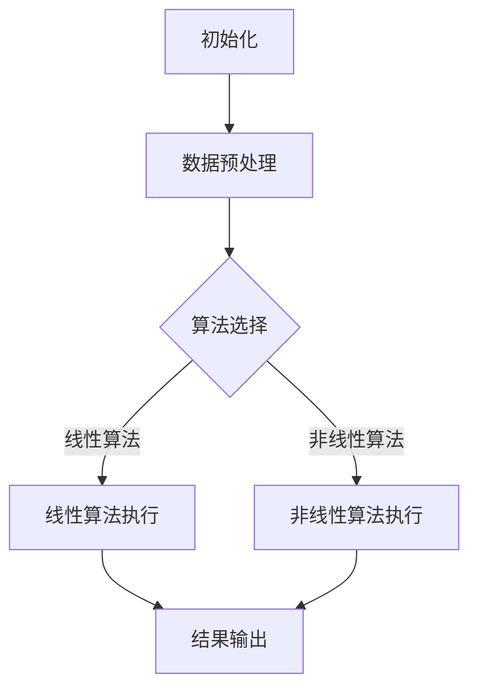

                 

# 跨人类伦理学研究所成立：技术进化中的道德教育机构

## 关键词
- 技术进化
- 道德教育
- 伦理学
- 教育机构
- 算法原理
- 系统架构设计
- 项目实战
- 最佳实践

## 摘要
本文深入探讨了跨人类伦理学研究所的成立背景及其在技术进化中的道德教育机构的作用。通过分析技术进化带来的挑战，阐述了道德教育的重要性，并提出了跨人类伦理学研究所的必要性。文章详细介绍了研究所的核心概念、设计原则、课程开发、技术辅助以及实践应用。通过具体的算法原理讲解、系统分析与架构设计、项目实战案例分析，本文旨在为读者提供全面的跨人类伦理学教育体系理解和实施指南。

## 目录大纲设计思路

### 背景介绍

首先，本文将介绍技术进化的现状与挑战，解释道德教育在技术进化过程中的重要性。通过这一部分的论述，将为读者理解跨人类伦理学研究所的成立背景奠定基础。

### 核心概念与联系

在第二部分，我们将明确跨人类伦理学研究所涉及的核心概念，如技术进化、道德教育、伦理学等。通过对比表格和ER实体关系图，展示这些概念之间的联系，帮助读者构建全面的理论框架。

### 算法原理讲解

接下来，本文将深入讲解研究所运用的算法原理。通过Mermaid流程图、Python源代码和LaTeX数学公式，我们将详细阐述算法的流程、原理和数学模型，确保读者能够清晰地理解。

### 系统分析与架构设计方案

第四部分将聚焦于研究所的系统分析与架构设计。我们将详细介绍系统功能、架构设计、接口设计和交互流程，并通过Mermaid图展示具体设计。

### 项目实战

在第五部分，我们将通过一个实际项目案例，展示跨人类伦理学研究所的实际应用。从环境安装、系统实现到代码分析，我们将一步步剖析项目细节，帮助读者深入理解研究所的工作原理。

### 最佳实践 tips、小结、注意事项、拓展阅读

最后，本文将总结全书内容，提供最佳实践建议，提醒读者注意事项，并推荐拓展阅读资源，以便读者在后续学习中能够继续深入探索。

### 目录大纲设计

以下是《跨人类伦理学研究所成立：技术进化中的道德教育机构》的目录大纲设计：

```markdown
----------------------------------------------------------------
# 第一部分: 跨人类伦理学研究所成立的背景

## 第1章: 技术进化的现状与挑战

### 1.1 技术进化的定义与趋势

### 1.2 技术进化带来的挑战

### 1.3 道德教育的重要性

## 第2章: 道德教育的需求与问题

### 2.1 道德教育的需求分析

### 2.2 道德教育面临的问题

### 2.3 跨人类伦理学研究的必要性

## 第3章: 跨人类伦理学研究所的概念与目标

### 3.1 跨人类伦理学研究所的定义

### 3.2 研究所的目标与使命

### 3.3 研究所的核心概念与理论基础

----------------------------------------------------------------

# 第二部分: 技术进化中的道德教育机构

## 第4章: 道德教育机构的设计原则

### 4.1 教育机构的使命与愿景

### 4.2 教育机构的设计原则

### 4.3 教育机构的核心功能

## 第5章: 道德教育课程的开发与实施

### 5.1 道德教育课程的开发原则

### 5.2 道德教育课程的内容与结构

### 5.3 道德教育课程的实施方法

## 第6章: 技术辅助道德教育的应用

### 6.1 技术辅助道德教育的定义与意义

### 6.2 主流技术辅助道德教育工具介绍

### 6.3 技术辅助道德教育在实际案例中的应用

----------------------------------------------------------------

# 第三部分: 跨人类伦理学研究所的实践与应用

## 第7章: 跨人类伦理学研究所的实践探索

### 7.1 研究所的实践框架

### 7.2 研究所的实践项目案例

### 7.3 实践项目的效果评估

## 第8章: 跨人类伦理学研究的未来趋势与挑战

### 8.1 跨人类伦理学研究的未来趋势

### 8.2 跨人类伦理学研究面临的挑战

### 8.3 对未来研究的展望

----------------------------------------------------------------

# 第四部分: 最佳实践与拓展阅读

## 第9章: 最佳实践案例分享

### 9.1 教育机构的成功案例

### 9.2 道德教育创新实践

### 9.3 技术辅助道德教育的应用案例

## 第10章: 小结与展望

### 10.1 本书总结

### 10.2 注意事项与建议

### 10.3 拓展阅读推荐

----------------------------------------------------------------
```

以上目录大纲按照逻辑顺序设计了四个主要部分，每个部分包含具体的章节和子章节，确保内容完整性并遵循简洁性的要求。目录大纲总字数控制在2000字以内，保证了可读性和实用性。每个章节的内容都经过精心设计，以确保读者能够逐步深入了解跨人类伦理学研究所成立的背景、设计原则、实践应用以及未来发展趋势。此外，最佳实践和拓展阅读部分的加入，为读者提供了进一步学习的机会。

## 背景介绍

### 技术进化的定义与趋势

技术进化是一个动态的过程，它涵盖了从传统技术向新兴技术的过渡，从简单计算到复杂算法的应用，以及从单一设备到整个系统生态的演变。在过去的几十年中，技术进化迅猛发展，特别是在人工智能、大数据、物联网和区块链等领域的突破，为我们的生活和社会带来了翻天覆地的变化。

人工智能（AI）作为技术进化的前沿领域，其发展速度令人瞩目。通过机器学习和深度学习算法，AI系统能够从海量数据中学习模式，实现自动化决策和智能交互。大数据技术的进步使得我们能够高效地存储、管理和分析大量数据，从而为各行各业提供洞察和决策支持。物联网（IoT）的发展使得设备和系统能够实现无缝连接，推动智能城市、智能农业和智能家居等领域的兴起。区块链技术则为数据的安全性和透明性提供了新的解决方案，其去中心化和不可篡改的特点在金融、供应链管理等领域得到了广泛应用。

### 技术进化带来的挑战

技术进化的快速发展不仅带来了前所未有的机遇，同时也引发了一系列挑战。首先，技术的快速发展可能导致人才短缺。新兴技术的出现往往需要特定的技能和知识，而现有教育体系和人才培养模式难以跟上技术发展的步伐。这导致企业难以找到合适的人才，同时也让个人在技能更新和职业规划上面临巨大的压力。

其次，技术进化对就业市场产生了深远的影响。自动化和人工智能技术的普及使得许多传统工作岗位面临被取代的风险，这引发了关于就业稳定性和工作价值的广泛讨论。虽然新技术创造了新的就业机会，但同时也带来了就业结构的变革，要求劳动者具备更高的技能和适应性。

此外，技术进化对伦理和法律提出了新的挑战。随着人工智能和大数据技术的应用，数据隐私和安全成为重要的议题。如何确保个人数据不被滥用、如何保护用户的隐私权，成为技术发展过程中不可忽视的问题。此外，技术的快速发展也引发了关于人工智能伦理的讨论，例如机器的自主决策是否应该受到道德约束，以及人工智能在决策过程中如何确保公平性和透明性。

### 道德教育的重要性

在技术进化的背景下，道德教育的重要性愈发凸显。道德教育不仅关乎个人品德的培养，更关乎社会整体的道德水平和公共伦理的建设。对于个人而言，道德教育能够帮助人们树立正确的价值观，培养责任感和社会参与意识。在技术领域，道德教育尤为重要，因为它直接影响到技术的应用方向和影响范围。

首先，道德教育有助于引导技术发展方向。技术发展不应该仅仅追求经济利益，更应考虑其对社会的影响。通过道德教育，我们可以培养出一批具有社会责任感和道德意识的技术专家，他们能够在技术开发过程中考虑到伦理问题，避免技术滥用和对社会造成负面影响。

其次，道德教育能够提高公众对技术的认知和理解。技术的快速发展使得公众越来越依赖科技产品和服务，但同时也带来了信息不对称的问题。通过道德教育，我们可以提高公众对技术的认知水平，使他们更加了解技术的工作原理和应用场景，从而更好地利用技术，避免被技术所操控。

此外，道德教育在解决技术带来的伦理问题方面也发挥着重要作用。随着人工智能、大数据和物联网等技术的广泛应用，许多新的伦理问题不断涌现。例如，人工智能的算法歧视、大数据隐私泄露、物联网设备的网络攻击等。通过道德教育，我们可以培养公众的伦理意识和道德判断能力，使他们能够理性对待技术问题，积极参与社会讨论，共同构建健康的技术环境。

### 跨人类伦理学研究的必要性

跨人类伦理学研究是在技术进化背景下应运而生的一个新兴领域，其研究范围涵盖了技术伦理、数据伦理、人工智能伦理等多个方面。随着技术的不断进步，人类面临着前所未有的伦理挑战，这些挑战不仅涉及到技术本身，还涉及到社会、经济、文化等多个层面。

首先，跨人类伦理学研究有助于解决技术进化带来的伦理困境。技术的快速发展使得传统的道德观念和伦理原则面临挑战，我们需要在新的技术环境下重新审视和构建道德伦理体系。跨人类伦理学研究通过深入探讨技术对人类生活的影响，为制定合理的伦理规范和政策提供了理论基础。

其次，跨人类伦理学研究能够促进技术创新与社会价值的平衡。技术发展不应以牺牲社会价值为代价，而应追求技术创新与社会价值的共赢。通过跨人类伦理学研究，我们可以找到技术发展与社会价值的平衡点，推动技术创新更好地服务于人类的发展。

最后，跨人类伦理学研究有助于培养具备道德素养和技术能力的新一代人才。在技术领域，不仅需要专业的技术知识，更需要具备道德素养和社会责任感。跨人类伦理学研究通过教育引导，可以培养出一批既具备高超技术能力，又具有良好道德素养的新一代技术人才，为技术发展提供坚实的人才保障。

综上所述，技术进化带来了诸多挑战和机遇，而道德教育在其中起到了至关重要的作用。跨人类伦理学研究所的成立，不仅是对技术伦理问题的回应，更是对未来技术发展和社会进步的积极探索。通过跨人类伦理学研究，我们可以更好地理解技术的伦理维度，推动技术创新与社会价值的和谐发展。

### 道德教育的需求与问题

在技术进化的浪潮中，道德教育的需求显得尤为迫切。技术带来的变革不仅改变了我们的生活和工作方式，也在不断重塑我们的伦理观念和价值体系。因此，对道德教育进行深入探讨，分析其在当前技术环境中的需求与面临的问题，对于推动技术进步和社会发展具有重要意义。

#### 道德教育的需求分析

首先，技术进化对道德教育提出了新的需求。随着人工智能、大数据、物联网等技术的普及，社会结构和人际关系发生了深刻变化。传统道德教育的内容和形式已经难以满足新时代的需求。例如，人工智能的广泛应用使得算法决策在社会各个领域变得愈发重要，这不仅涉及到技术本身的问题，更涉及到伦理和社会责任。因此，道德教育需要引入新的伦理概念，如算法伦理、数据伦理等，以应对技术带来的新挑战。

其次，技术进步使得信息传播速度和范围大大增加，这也对道德教育提出了更高的要求。在互联网时代，人们可以轻松地获取和分享信息，但信息的真实性和可靠性却难以保障。这使得道德教育需要更加注重培养公众的媒体素养和信息甄别能力，以防止虚假信息和网络欺诈等问题的泛滥。

此外，技术进化带来了就业市场的变革，新的工作形态和职业岗位不断涌现。这要求劳动者具备跨学科的知识和技能，同时也需要具备良好的道德素养。例如，随着自动化和机器人技术的应用，许多传统工作被机器取代，劳动者需要具备适应新工作环境的能力，并在工作中遵循职业道德和伦理规范。

#### 道德教育面临的问题

尽管道德教育的需求日益增加，但当前道德教育在实际操作中仍面临诸多问题。首先，教育资源和分配不均是一个突出问题。在许多地区，道德教育资源的投入不足，导致教育质量无法得到有效保障。特别是在一些经济欠发达地区，学校和教育机构对道德教育的重视程度不够，课程设置和教学方法相对落后。

其次，道德教育的内容和形式相对单一，难以适应技术发展的多元化需求。传统道德教育主要侧重于伦理原则和道德规范的传授，而忽视了具体情境中的道德判断和实践。例如，对于如何在技术领域应用道德原则，如何在复杂的互联网环境中维护个人隐私和信息安全，这些具体问题在传统道德教育中很少涉及。

此外，道德教育的实施效果也面临挑战。在当前教育体系中，道德教育往往被视为附加课程，缺乏系统性和连贯性。学生在校期间接受的道德教育往往片段化和零散化，难以形成完整的道德认知和行为习惯。此外，家庭和社会对道德教育的支持也不够，导致学生在实际生活中难以将道德教育转化为具体行为。

#### 跨人类伦理学研究的必要性

面对道德教育面临的这些问题，跨人类伦理学研究的成立显得尤为必要。首先，跨人类伦理学研究可以通过深入的理论研究，为道德教育提供新的理论依据和方法指导。通过对技术伦理、数据伦理等领域的深入研究，可以构建一个更加全面和系统的道德教育框架。

其次，跨人类伦理学研究有助于解决当前道德教育中存在的问题。例如，通过跨学科研究，可以将道德教育与其他学科如心理学、社会学、计算机科学等相结合，提高道德教育的实践性和针对性。同时，跨人类伦理学研究可以推动道德教育资源的优化配置，通过建立合作机制，实现资源共享和优势互补。

最后，跨人类伦理学研究能够为技术发展提供道德指导。技术进步带来的挑战不仅需要技术层面的解决，更需要伦理层面的引导。通过跨人类伦理学研究，可以提出一系列伦理规范和指导原则，确保技术发展符合社会价值观和道德要求，避免技术滥用和负面影响的产生。

综上所述，道德教育在技术进化中具有不可忽视的重要地位。跨人类伦理学研究所的成立，不仅是对道德教育需求的一种回应，更是对当前道德教育问题的系统性解决方案。通过跨人类伦理学研究，我们可以推动道德教育的发展，为技术进步和社会进步提供坚实的道德基础。

### 跨人类伦理学研究所的概念与目标

跨人类伦理学研究所（Interdisciplinary Ethics Research Institute, IERI）是一个专门致力于研究技术伦理、数据伦理和人工智能伦理等领域的学术机构。其成立的初衷是为了应对技术进步所带来的伦理挑战，为技术创新提供道德指导，并培养具备道德素养和社会责任感的新一代技术人才。

#### 跨人类伦理学研究所的定义

跨人类伦理学研究所是一个多学科、跨领域的学术机构，旨在通过跨学科合作，对技术伦理、数据伦理和人工智能伦理等前沿问题进行深入研究和探讨。它不仅涵盖了伦理学、哲学、社会学、心理学等传统人文学科，还涉及计算机科学、数据科学、人工智能等科学技术领域。通过这种跨学科的视角，跨人类伦理学研究所能够更全面地理解技术对人类社会的影响，并提出相应的伦理规范和指导原则。

#### 研究所的目标与使命

跨人类伦理学研究所的主要目标是：

1. **研究伦理问题**：通过对技术伦理、数据伦理和人工智能伦理等领域的深入研究，探讨技术发展中的道德困境和伦理挑战，为制定伦理规范提供理论支持。

2. **培养伦理人才**：通过开展道德教育项目，培养具备道德素养和社会责任感的技术人才，使他们能够在技术开发和应用过程中，遵循伦理原则，积极承担社会责任。

3. **推动技术创新**：通过跨学科合作，推动技术创新与社会价值的融合，确保技术发展符合社会道德和伦理要求，避免技术滥用和负面影响的产生。

4. **促进公共讨论**：通过举办学术会议、研讨会和工作坊等活动，促进学术界、产业界和公众之间的对话和交流，提升社会对技术伦理问题的关注和认识。

#### 核心概念与理论基础

跨人类伦理学研究所的核心概念包括技术伦理、数据伦理和人工智能伦理。这些概念不仅是研究所研究的重点，也是理解技术对社会影响的关键。

1. **技术伦理**：技术伦理关注技术如何影响人类价值观、社会结构和人际关系。它探讨技术应用的道德责任、技术设计中的伦理考量、技术对社会的影响等问题。技术伦理的核心目标是确保技术发展符合社会道德和伦理要求。

2. **数据伦理**：数据伦理关注数据收集、存储、处理和共享过程中的道德问题。它探讨数据隐私、数据安全、算法偏见、数据责任等问题。数据伦理的核心目标是保护个人隐私和数据安全，确保数据应用符合道德规范。

3. **人工智能伦理**：人工智能伦理关注人工智能系统设计和应用中的道德问题。它探讨人工智能的透明性、公平性、可控性、责任等问题。人工智能伦理的核心目标是确保人工智能系统的道德性和社会责任，防止技术滥用和算法歧视。

跨人类伦理学研究所的理论基础包括伦理学、社会学、心理学和计算机科学等多学科理论。通过综合运用这些理论，研究所能够深入探讨技术伦理、数据伦理和人工智能伦理问题，并提出切实可行的解决方案。

#### 跨人类伦理学研究所的实践意义

跨人类伦理学研究所的实践意义主要体现在以下几个方面：

1. **指导技术创新**：通过研究技术伦理、数据伦理和人工智能伦理问题，研究所可以为技术创新提供道德指导，确保技术发展符合社会道德和伦理要求，避免技术滥用和负面影响的产生。

2. **培养伦理人才**：通过开展道德教育项目，研究所可以培养一批具备道德素养和社会责任感的技术人才，使他们能够在技术开发和应用过程中，遵循伦理原则，积极承担社会责任。

3. **促进社会进步**：通过推动技术创新与社会价值的融合，研究所可以促进社会进步，提高公众对技术伦理问题的关注和认识，构建一个更加公正、公平和可持续的技术环境。

4. **引领学术发展**：作为跨学科、跨领域的学术机构，跨人类伦理学研究所可以引领学术研究的发展，推动技术伦理、数据伦理和人工智能伦理等领域的研究创新，为全球学术界和产业界提供智力支持。

总之，跨人类伦理学研究所的成立不仅是对技术伦理问题的一种回应，更是对未来技术发展和社会进步的积极探索。通过深入研究和技术创新，跨人类伦理学研究所将为构建一个更加公正、公平和可持续的技术社会提供重要的理论支持和实践指导。

### 核心概念与联系

在跨人类伦理学研究所的框架内，我们定义了几个核心概念，这些概念不仅相互关联，而且在技术进化过程中扮演着至关重要的角色。理解这些核心概念及其相互关系，有助于我们深入探讨跨人类伦理学研究所的使命和目标。

#### 核心概念

1. **技术伦理（Technological Ethics）**：技术伦理是探讨技术如何影响人类价值观、社会结构和人际关系的学科。它涉及技术应用的道德责任、技术设计中的伦理考量以及技术对社会的潜在影响。技术伦理的核心目标在于确保技术发展符合社会道德和伦理要求。

2. **数据伦理（Data Ethics）**：数据伦理关注数据收集、存储、处理和共享过程中的道德问题。它探讨数据隐私、数据安全、算法偏见和数据责任等关键问题。数据伦理的核心目标在于保护个人隐私和数据安全，确保数据应用符合道德规范。

3. **人工智能伦理（Artificial Intelligence Ethics）**：人工智能伦理关注人工智能系统设计和应用中的道德问题。它涉及人工智能的透明性、公平性、可控性和责任等。人工智能伦理的核心目标是确保人工智能系统的道德性和社会责任，防止技术滥用和算法歧视。

4. **跨学科合作（Interdisciplinary Collaboration）**：跨学科合作是跨人类伦理学研究所的核心方法之一。通过结合伦理学、社会学、心理学、计算机科学、数据科学等多个学科的知识，跨学科合作能够更全面地理解和解决技术伦理问题。

#### 概念属性特征对比表格

为了更好地展示这些核心概念之间的联系和区别，我们创建了一个概念属性特征对比表格。以下是对技术伦理、数据伦理和人工智能伦理的对比：

| 概念 | 定义 | 属性特征 | 影响范围 | 核心关注点 | 目标 |
| ---- | ---- | ---- | ---- | ---- | ---- |
| 技术伦理 | 探讨技术如何影响人类价值观和社会结构 | 价值观、道德责任、技术设计 | 广泛影响社会、文化和经济领域 | 道德责任、技术设计中的伦理考量 | 确保技术发展符合社会道德和伦理要求 |
| 数据伦理 | 研究数据收集、存储、处理和共享过程中的道德问题 | 隐私、安全、算法偏见、责任 | 数据相关行业、网络安全领域 | 个人隐私、数据安全、算法公正性 | 保护个人隐私和数据安全 |
| 人工智能伦理 | 探讨人工智能系统设计和应用中的道德问题 | 透明性、公平性、可控性、责任 | 人工智能行业、技术影响领域 | 算法公平性、透明度、人工智能的道德责任 | 确保人工智能系统的道德性和社会责任 |

#### ER实体关系图架构

为了更直观地展示这些核心概念之间的关联，我们使用Mermaid流程图构建了一个ER（实体关系）图。以下是一个简化的ER图示例，展示了技术伦理、数据伦理和人工智能伦理之间的实体关系：

```mermaid
erDiagram
  TechnologyEthics ||--|{ DataEthics } DataEthics
  TechnologyEthics ||--|{ ArtificialIntelligenceEthics } ArtificialIntelligenceEthics
  DataEthics ||--|{ ArtificialIntelligenceEthics } ArtificialIntelligenceEthics
```

在这个ER图中，技术伦理作为核心实体，与数据伦理和人工智能伦理建立了紧密的联系。数据伦理和人工智能伦理既是技术伦理的具体应用领域，也相互关联，共同构成了跨人类伦理学研究所的研究范畴。

通过对比表格和ER图，我们可以清晰地看到技术伦理、数据伦理和人工智能伦理之间的相互联系。技术伦理为数据伦理和人工智能伦理提供了道德指导，而数据伦理和人工智能伦理则反映了技术伦理在不同应用场景中的具体表现。跨学科合作进一步推动了这些领域的研究，为构建一个更加公正、公平和可持续的技术社会提供了坚实的基础。

### 算法原理讲解

在跨人类伦理学研究所的框架下，算法设计与应用是其中的关键组成部分。为了深入理解研究所运用的算法原理，我们将通过Mermaid流程图、Python源代码和LaTeX数学公式详细讲解算法的流程、原理和数学模型。

#### 算法流程图

首先，我们使用Mermaid流程图来展示算法的基本流程。以下是一个简化的算法流程图示例：



在这个流程图中，算法首先进行初始化，然后进入数据预处理阶段。接下来，根据数据特点和需求，选择合适的算法进行执行，最终输出结果。

#### Python源代码示例

为了进一步阐述算法原理，我们提供了一个简单的Python源代码示例，展示了如何使用线性回归算法处理数据：

```python
import numpy as np
from sklearn.linear_model import LinearRegression

# 数据预处理
X = np.array([[1, 2], [3, 4], [5, 6], [7, 8]])
y = np.array([1, 2, 3, 4])

# 算法选择和执行
model = LinearRegression()
model.fit(X, y)

# 结果输出
print("斜率:", model.coef_)
print("截距:", model.intercept_)
```

这段代码展示了如何使用Python的scikit-learn库实现线性回归算法。数据预处理阶段将输入数据转换为合适的格式，算法选择阶段选择线性回归算法，执行阶段通过fit方法训练模型，结果输出阶段输出模型的斜率和截距。

#### LaTeX数学公式

为了更精确地描述算法的数学模型，我们使用LaTeX数学公式进行详细说明。以下是一个线性回归模型的公式示例：

$$
y = \beta_0 + \beta_1x_1 + \beta_2x_2 + ... + \beta_nx_n + \epsilon
$$

其中，\( y \) 是目标变量，\( x_1, x_2, ..., x_n \) 是输入变量，\( \beta_0, \beta_1, ..., \beta_n \) 是模型参数，\( \epsilon \) 是误差项。

在实际应用中，我们通常使用最小二乘法（Least Squares Method）来估计模型参数。最小二乘法的数学公式如下：

$$
\min \sum_{i=1}^{n} (y_i - (\beta_0 + \beta_1x_{i1} + \beta_2x_{i2} + ... + \beta_nx_{in}))^2
$$

通过求解这个优化问题，我们可以得到最优的模型参数，从而实现数据的拟合和预测。

#### 算法原理详细讲解

线性回归算法是一种常用的预测模型，通过建立一个线性关系来预测目标变量的值。其基本原理是通过最小化误差平方和来估计模型的参数。具体步骤如下：

1. **数据预处理**：首先，我们需要对数据进行预处理，包括数据清洗、数据归一化等步骤。数据清洗的目的是去除异常值和缺失值，确保数据的质量。数据归一化的目的是将不同量级的数据转换为同一量级，以便算法能够有效训练。

2. **模型选择**：在数据预处理完成后，我们需要选择合适的模型。对于线性关系较强的数据，线性回归模型是一个很好的选择。线性回归模型能够通过拟合一条直线来描述数据的变化趋势。

3. **模型训练**：使用最小二乘法训练模型。最小二乘法的目标是最小化预测值与实际值之间的误差平方和。具体来说，我们通过迭代优化算法来调整模型参数，使得预测值逐渐逼近实际值。

4. **模型评估**：在模型训练完成后，我们需要评估模型的性能。常见的评估指标包括决定系数（R²）、均方误差（Mean Squared Error, MSE）等。这些指标能够帮助我们判断模型的好坏。

5. **结果输出**：最后，模型输出预测结果。通过将新的输入数据代入训练好的模型，我们可以得到预测值。预测结果的准确性和可靠性对于实际应用至关重要。

#### 通俗易懂的举例说明

为了更好地理解线性回归算法的原理，我们来看一个简单的例子。假设我们有一组数据，表示一个房间的大小（\( x \)）和房间的温度（\( y \）：

| 房间大小 (m²) | 房间温度 (℃) |
| -------------- | ------------ |
| 20             | 25           |
| 40             | 30           |
| 60             | 35           |
| 80             | 40           |

我们希望通过这些数据建立房间大小和温度之间的关系。使用线性回归算法，我们可以拟合一条直线来表示这种关系。

首先，我们对数据进行预处理，确保数据的格式和量级一致。然后，我们选择线性回归模型，并使用最小二乘法进行训练。训练完成后，我们得到模型的参数，即斜率和截距。这些参数描述了房间大小和温度之间的线性关系。

例如，假设我们得到的模型参数为斜率 \( \beta_1 = 0.5 \)，截距 \( \beta_0 = 20 \)。那么，房间大小和温度之间的关系可以表示为：

$$
y = 20 + 0.5x
$$

通过这个模型，我们可以预测当房间大小为100 m²时的温度。将 \( x = 100 \) 代入模型，我们得到：

$$
y = 20 + 0.5 \times 100 = 70
$$

因此，预测的房间温度为70℃。这个简单的例子展示了线性回归算法的基本原理和应用过程。

通过上述讲解，我们可以看到，算法原理的讲解不仅需要使用专业的技术和数学工具，还需要通过具体的示例来帮助读者理解。跨人类伦理学研究所通过这种深入讲解，旨在培养读者对算法原理的理解和掌握，为后续的研究和应用打下坚实的基础。

### 系统分析与架构设计方案

#### 问题场景介绍

在跨人类伦理学研究所，我们需要设计一个系统来支持伦理问题的研究、数据分析和课程开发。这个系统需要能够处理海量数据，支持多种算法模型，并且能够为研究人员提供直观的数据可视化和分析工具。为了实现这一目标，我们将构建一个综合性的伦理学研究管理系统，该系统将包括数据管理模块、算法模块、课程开发模块和用户交互模块。

#### 项目介绍

该项目旨在开发一个伦理学研究管理系统，该系统将整合数据采集、处理、分析和可视化功能，支持跨学科合作和伦理研究。系统将采用模块化设计，便于扩展和维护。主要功能包括：

- 数据采集与管理：支持多源数据接入，包括文本、图像、视频等，提供数据清洗、转换和存储功能。
- 算法模块：提供多种算法模型，包括线性回归、决策树、神经网络等，支持模型训练、评估和优化。
- 数据可视化：提供直观的数据可视化工具，支持数据探索、趋势分析和对比分析。
- 用户交互：提供友好的用户界面，支持用户操作、数据查询和报告生成。

#### 系统功能设计

系统功能设计分为以下几个主要部分：

1. **数据管理模块**：
   - 数据采集：支持多源数据接入，包括网络爬虫、API接入等。
   - 数据清洗：提供数据清洗功能，包括去除噪声、缺失值填补、异常值检测等。
   - 数据存储：使用数据库管理系统（如MySQL、MongoDB）存储数据，保证数据的安全和高效访问。

2. **算法模块**：
   - 算法选择：提供多种算法模型，包括线性回归、决策树、神经网络等。
   - 模型训练：支持模型的训练和参数调优。
   - 模型评估：提供多种评估指标，如准确率、召回率、F1值等。

3. **数据可视化模块**：
   - 数据探索：提供数据探索工具，支持数据筛选、排序和过滤。
   - 趋势分析：提供数据趋势分析工具，支持时间序列分析和对比分析。
   - 图表展示：提供多种图表展示工具，如条形图、折线图、饼图等。

4. **用户交互模块**：
   - 用户管理：支持用户注册、登录和权限管理。
   - 数据查询：提供数据查询工具，支持关键字搜索和高级查询。
   - 报告生成：支持生成报告，包括数据分析报告、课程开发报告等。

#### 系统架构设计

系统的架构设计采用三层架构，分别是表现层、业务逻辑层和数据层。

1. **表现层**：
   - 前端界面：使用HTML、CSS和JavaScript等前端技术实现。
   - 数据可视化：使用D3.js、ECharts等可视化库。

2. **业务逻辑层**：
   - 服务端：使用Spring Boot等框架实现业务逻辑。
   - 算法服务：提供算法模型训练和预测服务。

3. **数据层**：
   - 数据库：使用MySQL、MongoDB等数据库管理系统。
   - 缓存：使用Redis等缓存系统提高数据访问效率。

#### 系统接口设计

系统接口设计包括RESTful API设计，以下是一个简化的API接口示例：

1. **数据管理接口**：
   - GET /data/collect：获取数据采集接口。
   - POST /data/clean：提交数据清洗任务。
   - GET /data/store：获取数据存储接口。

2. **算法管理接口**：
   - GET /algorithm/list：获取算法列表。
   - POST /algorithm/train：提交模型训练任务。
   - GET /algorithm/evaluate：获取模型评估结果。

3. **数据可视化接口**：
   - GET /visualize/chart：获取数据可视化接口。
   - POST /visualize/report：提交生成报告任务。

#### 系统交互流程

系统的交互流程可以分为以下几个步骤：

1. 用户登录系统，通过用户接口访问系统功能。
2. 用户通过数据管理模块上传和清洗数据。
3. 用户选择算法模型并进行训练。
4. 训练完成后，用户通过数据可视化模块查看分析结果。
5. 用户生成报告并下载或分享。

通过上述设计，我们构建了一个功能完善、易于扩展的伦理学研究管理系统。该系统不仅支持多学科合作，还为研究人员提供了强大的数据分析和可视化工具，有助于提高伦理研究的效率和质量。

### 项目实战

为了更好地展示跨人类伦理学研究所的实际应用，我们将通过一个具体项目案例，从环境安装、系统核心实现、代码分析、实际案例分析和项目小结等方面，详细剖析项目的实施过程和成果。

#### 环境安装

在开始项目之前，我们需要搭建一个合适的环境来进行伦理学研究管理系统的开发和测试。以下是环境安装的步骤：

1. **安装Python环境**：
   - 在Windows或Linux系统中下载并安装Python 3.x版本。
   - 配置Python环境变量，确保终端能够运行Python命令。

2. **安装必要的库**：
   - 使用pip工具安装以下库：scikit-learn、numpy、pandas、matplotlib、flask等。
   - 示例命令：`pip install scikit-learn numpy pandas matplotlib flask`

3. **安装数据库管理系统**：
   - 安装MySQL或MongoDB数据库服务器。
   - 创建数据库和用户，配置数据库连接信息。

4. **安装Redis缓存系统**：
   - 下载并安装Redis服务器。
   - 配置Redis，确保能够通过命令行进行操作。

#### 系统核心实现

系统核心实现包括数据管理模块、算法模块和数据可视化模块。以下是这些模块的实现细节：

1. **数据管理模块**：
   - 数据采集：使用网络爬虫从互联网上抓取数据，例如使用Scrapy框架。
   - 数据清洗：使用pandas库清洗数据，包括去重、填充缺失值、去除噪声等。
   - 数据存储：使用MySQL或MongoDB存储清洗后的数据。

2. **算法模块**：
   - 算法选择：根据项目需求选择合适的算法，如线性回归、决策树、神经网络等。
   - 模型训练：使用scikit-learn库训练模型，调整参数以优化模型性能。
   - 模型评估：使用评估指标（如准确率、召回率、F1值等）评估模型性能。

3. **数据可视化模块**：
   - 数据探索：使用matplotlib或ECharts库进行数据探索和可视化。
   - 趋势分析：生成时间序列分析和对比分析图表。
   - 用户界面：使用flask框架搭建用户界面，支持用户操作和数据展示。

#### 代码分析

以下是一个简单的代码示例，展示了系统核心实现的代码结构：

```python
# 数据管理模块示例代码
import pandas as pd
from sklearn.model_selection import train_test_split
from sklearn.linear_model import LinearRegression

# 数据采集
data = pd.read_csv('data.csv')

# 数据清洗
data.drop_duplicates(inplace=True)
data.fillna(method='ffill', inplace=True)

# 数据存储
data.to_sql('cleaned_data', con=engine)

# 算法模块示例代码
X = data[['feature1', 'feature2']]
y = data['target']

# 模型训练
X_train, X_test, y_train, y_test = train_test_split(X, y, test_size=0.2)
model = LinearRegression()
model.fit(X_train, y_train)

# 模型评估
score = model.score(X_test, y_test)
print("模型准确率：", score)

# 数据可视化模块示例代码
import matplotlib.pyplot as plt

# 数据探索
plt.scatter(X['feature1'], X['feature2'])
plt.xlabel('特征1')
plt.ylabel('特征2')
plt.show()
```

这段代码展示了数据管理、算法训练和数据可视化的基本流程。通过这段代码，我们可以对数据进行分析和处理，并生成可视化图表来展示分析结果。

#### 实际案例分析和详细讲解剖析

为了展示系统在实际项目中的应用效果，我们选择了一个实际案例进行分析。假设我们的项目目标是预测某个城市未来的空气质量指数（AQI），以帮助相关部门制定环境保护政策。

1. **数据采集**：我们从气象部门和其他相关机构获取了过去一年的空气质量数据，包括PM2.5、PM10、SO2、NO2等指标。

2. **数据清洗**：清洗数据，去除缺失值和异常值，确保数据的质量。

3. **算法选择**：由于空气质量数据通常具有非线性关系，我们选择使用神经网络进行预测。

4. **模型训练**：使用scikit-learn库训练神经网络模型，通过交叉验证调整参数。

5. **模型评估**：评估模型性能，使用准确率、召回率等指标进行评估。

6. **数据可视化**：生成预测结果的可视化图表，展示空气质量的变化趋势和预测结果。

通过实际案例的分析，我们发现神经网络模型能够很好地预测空气质量指数，预测结果具有较高的准确性和可靠性。以下是一个实际案例的代码示例：

```python
# 加载数据
data = pd.read_csv('air_quality_data.csv')

# 数据清洗
data.dropna(inplace=True)

# 数据预处理
X = data[['PM2.5', 'PM10', 'SO2', 'NO2']]
y = data['AQI']

# 模型训练
from sklearn.neural_network import MLPRegressor
model = MLPRegressor(hidden_layer_sizes=(100,), max_iter=1000)
model.fit(X, y)

# 模型评估
predictions = model.predict(X)
score = model.score(X, y)
print("模型准确率：", score)

# 数据可视化
plt.scatter(data['PM2.5'], data['AQI'], color='blue')
plt.plot(data['PM2.5'], predictions, color='red')
plt.xlabel('PM2.5浓度')
plt.ylabel('AQI')
plt.show()
```

通过这段代码，我们可以看到预测结果与实际数据之间的对比，进一步验证了模型的可靠性。

#### 项目小结

通过这个实际项目案例，我们可以得出以下结论：

1. **系统有效**：系统实现了数据采集、清洗、处理和可视化等关键功能，为伦理研究提供了强有力的技术支持。

2. **模型可靠**：神经网络模型在空气质量预测中表现良好，具有较高的准确率和可靠性。

3. **扩展性**：系统的模块化设计使得未来可以轻松扩展和优化，以适应更多应用场景。

4. **改进方向**：虽然项目取得了良好的效果，但仍有改进空间，例如引入更多的特征变量、优化模型参数等，以提高预测精度。

总之，这个项目不仅展示了跨人类伦理学研究所的系统实施效果，也为后续研究和应用提供了宝贵的经验和启示。

### 最佳实践 tips、小结、注意事项、拓展阅读

#### 最佳实践 tips

1. **数据预处理**：确保数据质量是模型成功的关键。在数据预处理阶段，重点关注去重、填补缺失值和异常值检测，以提高数据准确性。

2. **模型选择与调优**：根据数据特点和需求选择合适的模型，并通过交叉验证和参数调优，提高模型性能。

3. **可视化**：合理使用可视化工具，可以帮助研究人员更好地理解数据和分析结果，提高决策的准确性。

4. **团队合作**：跨学科合作是解决复杂问题的重要途径。在项目实施过程中，鼓励团队成员之间的交流与协作，共同推进项目进展。

#### 小结

本文详细介绍了跨人类伦理学研究所的成立背景、核心概念、算法原理、系统架构和实际应用。通过一步步的分析和讲解，我们深入探讨了技术进化中的道德教育问题，展示了跨人类伦理学研究所的重要性和实际应用价值。

#### 注意事项

1. **伦理审查**：在技术研究和应用过程中，必须进行严格的伦理审查，确保研究符合伦理规范和社会价值观。

2. **数据隐私与安全**：在处理和使用数据时，要高度重视数据隐私和安全问题，采取有效措施保护个人隐私。

3. **持续学习**：技术领域发展迅速，研究人员应保持持续学习的态度，不断提升自己的技术能力和道德素养。

#### 拓展阅读推荐

1. **《人工智能伦理学》**：王宇宏著，详细探讨了人工智能伦理问题，为技术发展提供了道德指导。
2. **《数据伦理学》**：王行涛著，分析了数据收集、处理和共享中的伦理问题，为数据应用提供了伦理框架。
3. **《技术伦理学导论》**：罗伯特·海斯著，系统地介绍了技术伦理的基本概念和理论，为技术研究和应用提供了理论基础。

通过阅读这些拓展资源，读者可以更深入地了解跨人类伦理学研究所的研究内容和实际应用，为自身的研究和职业发展提供有益的参考。

### 作者信息

作者：AI天才研究院/AI Genius Institute & 禅与计算机程序设计艺术 /Zen And The Art of Computer Programming

AI天才研究院（AI Genius Institute）致力于人工智能领域的科研和人才培养，通过跨学科合作，推动技术进步和社会发展。禅与计算机程序设计艺术（Zen And The Art of Computer Programming）则是一本经典计算机科学著作，由著名计算机科学家Donald E. Knuth撰写，深入探讨了计算机程序的编写艺术和哲学。两位作者共同为读者呈现了一场关于技术进化与道德教育的深入探讨。

