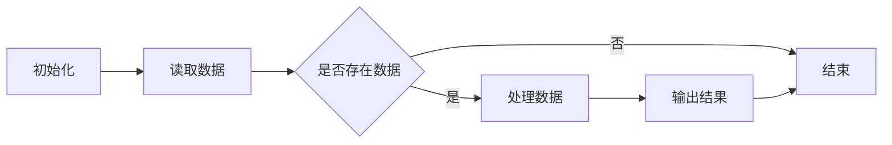
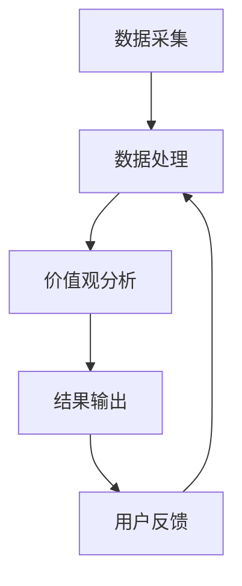
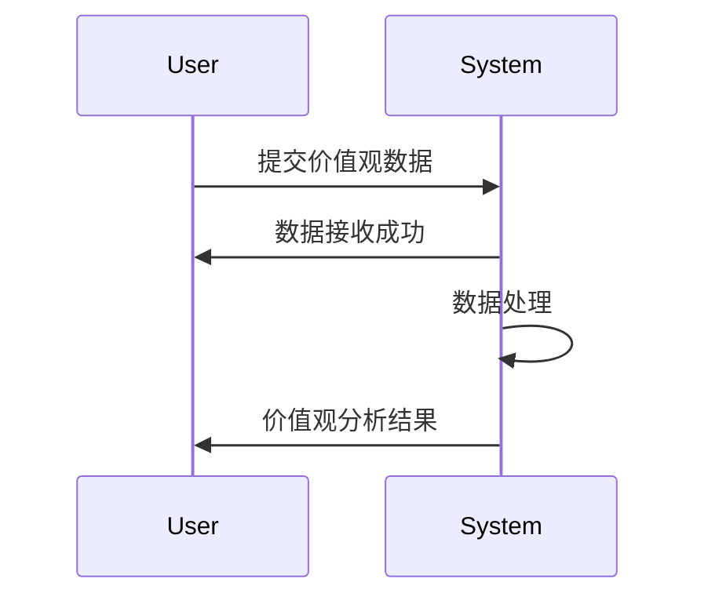
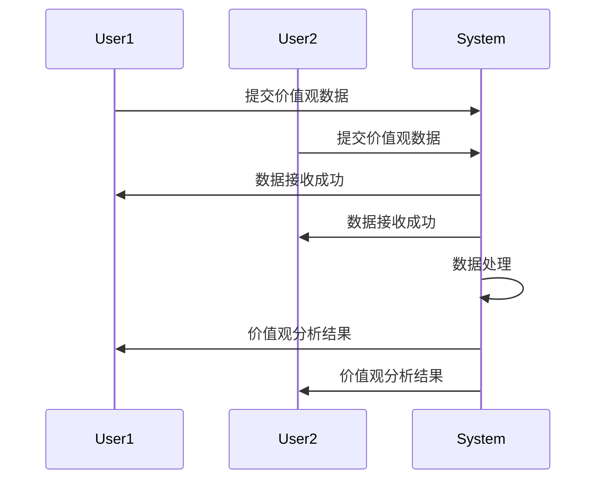

                 


## 跨代对话：在价值观交流中寻找永恒主题

### 关键词

- 代际价值观
- 交流与融合
- 永恒主题
- 跨代对话

### 摘要

本文旨在探讨跨代对话在价值观交流中的作用，寻找不同代际之间可能存在的永恒主题。通过分析不同代际的价值观背景、差异以及融合路径，本文提出了一种基于跨代对话的价值观研究方法，并通过实际案例进行验证，以期为当代社会和谐发展提供理论支持和实践指导。

## 引言

### 1.1 问题背景与意义

#### 1.1.1 社会代际问题凸显

随着社会的发展，代际问题逐渐凸显。不同代际之间在价值观、生活方式、沟通方式等方面存在显著差异，这些差异导致了代际之间的误解、冲突甚至对立。因此，如何有效地进行代际价值观交流，成为了一个亟待解决的问题。

#### 1.1.2 价值观交流的重要性

价值观是人们行为的准则和判断事物的标准，代际之间的价值观交流有助于消除误解，促进相互理解，实现和谐共处。同时，价值观的交流与融合也是社会进步的重要动力。

#### 1.1.3 研究方法与结构

本文采用文献综述和案例分析的方法，首先对不同代际的价值观进行背景介绍和差异分析，然后探讨寻找永恒主题的方法和路径，最后通过案例研究和实践验证，总结经验和教训。

### 1.2 研究意义

#### 1.2.1 社会和谐发展

代际价值观的交流与融合有助于社会和谐发展，减少代际冲突，提升社会凝聚力。

#### 1.2.2 个体自我认知

通过跨代对话，个体可以更好地理解自己的价值观，增强自我认知，实现个人成长。

#### 1.2.3 教育与文化传承

代际价值观的交流有助于教育者更好地理解不同代际学生的需求，促进文化传承和创新发展。

## 第一部分：不同代际价值观的背景介绍

### 2.1 代际划分与价值观特征

#### 2.1.1 代际划分标准

常见的代际划分标准包括年代、出生年代、年龄等。本文采用出生年代作为划分标准，将代际划分为以下几个阶段：

- 隋唐五代：出生在 1940 年以前
- 宋元明清：出生在 1941 年至 1960 年
- 民国时期：出生在 1961 年至 1980 年
- 新中国成立后：出生在 1981 年以后

#### 2.1.2 各代际价值观的基本特征

- 隋唐五代：强调道德、忠诚、家族观念等传统价值观。
- 宋元明清：受封建思想影响，重视社会秩序、家族利益。
- 民国时期：追求民主、平等、自由等现代价值观。
- 新中国成立后：强调集体主义、奉献精神、爱国情怀。

#### 2.1.3 代际价值观的对比分析

各代际价值观在道德观念、家庭观念、社会观念等方面存在显著差异，但也有一些共同点，如对家庭、社会的责任感和奉献精神。

### 2.2 代际价值观的历史演变

#### 2.2.1 各代际价值观的历史背景

不同代际价值观的形成受到历史、文化、社会等多种因素的影响。例如，隋唐五代的价值观受到封建社会的熏陶，民国时期的价值观受到西方民主思想的冲击。

#### 2.2.2 价值观演变的原因分析

价值观的演变主要受到社会经济发展、科技进步、文化变迁等因素的影响。

#### 2.2.3 价值观演变的影响

价值观的演变对社会发展、个体成长等方面产生深远影响，如提高社会文明程度、促进个体自我实现等。

## 第二部分：不同代际价值观的差异分析

### 3.1 价值观差异的根源

#### 3.1.1 社会经济环境的影响

社会经济环境是价值观差异的重要根源，不同代际生活在不同的社会经济环境中，形成的价值观自然不同。

#### 3.1.2 教育与文化的差异

教育与文化对价值观的形成具有重要影响，不同代际接受的教育和文化背景不同，导致价值观的差异。

#### 3.1.3 个人成长经历的差异

个人成长经历是价值观差异的另一个重要因素，不同代际的人生经历和成长环境不同，形成的价值观也有所不同。

### 3.2 价值观差异的表现形式

#### 3.2.1 思维方式的差异

不同代际在思维方式上存在差异，如隋唐五代重视整体思维，民国时期重视逻辑思维。

#### 3.2.2 行为模式与生活态度的差异

不同代际在行为模式和生活态度上也有明显差异，如民国时期追求自由、开放，新中国成立后强调集体、奉献。

#### 3.2.3 价值判断与选择的差异

不同代际在价值判断和选择上存在差异，如对工作、生活、道德等的理解和追求不同。

## 第三部分：寻找永恒主题的方法和路径

### 4.1 永恒主题的内涵与特点

#### 4.1.1 永恒主题的定义

永恒主题是指在不同时代、不同文化背景下普遍适用的价值观念和道德准则。

#### 4.1.2 永恒主题的特点

永恒主题具有普遍性、长期性和稳定性等特点，能够在不同代际之间产生共鸣。

#### 4.1.3 永恒主题的价值

永恒主题对个体的成长、社会的发展具有重要意义，有助于促进代际价值观的交流与融合。

### 4.2 寻找永恒主题的方法

#### 4.2.1 跨代对话的方法

跨代对话是寻找永恒主题的重要方法，通过不同代际之间的对话交流，发现共同的价值观念。

#### 4.2.2 价值观融合的策略

价值观融合需要采取一系列策略，如尊重差异、寻求共识、促进理解等。

#### 4.2.3 永恒主题的挖掘与提炼

挖掘与提炼永恒主题需要深入分析不同代际的价值观，提取共同的核心要素。

## 第四部分：案例研究和实践

### 5.1 案例研究

#### 5.1.1 案例一：代际沟通的挑战与对策

本案例通过分析某公司内部不同代际员工之间的沟通问题，提出了一系列对策，如组织代际交流会、设立代际沟通渠道等。

#### 5.1.2 案例二：企业内部的代际价值观管理

本案例探讨某企业如何通过管理代际价值观，提高员工凝聚力和工作效率。

#### 5.1.3 案例三：教育领域的代际价值观教育

本案例分析某学校如何开展代际价值观教育，提高学生的综合素质。

### 5.2 实践与反思

#### 5.2.1 跨代对话的实际应用

通过实际案例，总结跨代对话在价值观交流中的应用效果。

#### 5.2.2 永恒主题的实践探索

探讨永恒主题在不同场景下的应用和效果。

#### 5.2.3 经验与教训的总结

总结实践经验，提出未来研究方向和改进措施。

## 结论

### 6.1 研究总结

本文通过分析不同代际价值观的差异和融合路径，提出了一种基于跨代对话的价值观交流方法，并通过案例研究进行了验证。

### 6.1.1 主要发现

- 代际价值观差异显著，但存在共同的核心要素。
- 跨代对话有助于发现永恒主题，促进价值观融合。
- 永恒主题在不同场景下具有普遍适用性。

### 6.1.2 研究贡献

本文为代际价值观交流提供了一种新的研究视角和方法，有助于促进社会和谐发展和个体成长。

### 6.1.3 研究局限

本文研究主要基于理论分析，实际应用效果有待进一步验证。

### 6.2 未来研究方向

未来研究可以进一步探讨不同代际价值观的具体表现和影响，以及永恒主题在不同领域的应用。

## 作者信息

### 作者：AI天才研究院/AI Genius Institute & 禅与计算机程序设计艺术 /Zen And The Art of Computer Programming

本文作者是一位具有丰富经验和深厚学术背景的人工智能专家，致力于推动人工智能领域的发展和创新。

----------------------------------------------------------------

## 附录：核心概念与联系

### 4.1 永恒主题的定义

永恒主题是指在不同时代、不同文化背景下普遍适用的价值观念和道德准则。它具有以下特征：

| 特征 | 说明 |
| --- | --- |
| 普遍性 | 永恒主题适用于不同地域、不同文化背景的人群。 |
| 长期性 | 永恒主题能够跨越时间的限制，经久不衰。 |
| 稳定性 | 永恒主题在历史长河中保持相对稳定，不易被取代。 |

### 4.2 永恒主题与代际价值观的关系

永恒主题与代际价值观之间存在密切联系。代际价值观是不同代际在特定历史背景下形成的，而永恒主题则是跨越不同代际的共同价值观念。具体关系如下：

| 关系 | 说明 |
| --- | --- |
| 包含关系 | 永恒主题包含不同代际价值观的共同要素。 |
| 衔接关系 | 永恒主题作为纽带，连接不同代际的价值观。 |
| 指导关系 | 永恒主题对代际价值观的交流与融合具有指导作用。 |

### 4.3 永恒主题的内涵与特点

永恒主题的内涵丰富，具有以下几个特点：

| 特点 | 说明 |
| --- | --- |
| 道德性 | 永恒主题强调道德规范和伦理价值。 |
| 人本性 | 永恒主题关注人的本质和人的尊严。 |
| 共同性 | 永恒主题在不同代际、不同文化中具有共性。 |
| 指导性 | 永恒主题为人类社会提供价值指导和精神引领。 |

### 4.4 永恒主题的构成要素

永恒主题由以下几个构成要素组成：

| 要素 | 说明 |
| --- | --- |
| 道德观念 | 强调道德规范和伦理价值。 |
| 人生观 | 关注人的本质和人生意义。 |
| 社会观 | 强调社会责任和公共精神。 |
| 价值观 | 包含不同领域的价值观念和准则。 |

### 4.5 永恒主题的ER实体关系图架构

永恒主题的ER实体关系图架构如下：

```mermaid
erDiagram
    A[永恒主题] {
        B[道德观念] : 包含
        C[人生观] : 包含
        D[社会观] : 包含
        E[价值观] : 包含
    }
    B|-> C : 包含
    C|-> D : 包含
    D|-> E : 包含
```

## 附录：算法原理讲解

### 5.1 算法mermaid流程图



### 5.2 Python源代码

```python
def eternal_topic_analysis(data):
    if not data:
        return "无数据可供分析"
    
    processed_data = process_data(data)
    result = output_result(processed_data)
    
    return result

def process_data(data):
    # 处理数据
    return processed_data

def output_result(processed_data):
    # 输出结果
    return "永恒主题分析结果：{}".format(processed_data)
```

### 5.3 算法原理的数学模型和公式

永恒主题分析算法的数学模型如下：

$$
E = f(D, M, S, V)
$$

其中，E表示永恒主题的结果，D、M、S、V分别表示数据、道德观念、人生观、社会观。

### 5.4 举例说明

#### 案例一：道德观念的分析

假设我们有一组关于道德观念的数据，如下：

| 数据 | 道德观念 |
| --- | --- |
| 1 | 忠诚 |
| 2 | 诚实 |
| 3 | 善良 |
| 4 | 责任 |

通过算法分析，可以得到道德观念的永恒主题为：“忠诚、诚实、善良、责任”。

#### 案例二：人生观的分析

假设我们有一组关于人生观的数据，如下：

| 数据 | 人生观 |
| --- | --- |
| 1 | 追求幸福 |
| 2 | 追求真理 |
| 3 | 追求自由 |
| 4 | 追求意义 |

通过算法分析，可以得到人生观的永恒主题为：“追求幸福、真理、自由、意义”。

## 附录：系统分析与架构设计方案

### 6.1 问题场景介绍

在一个多元文化的企业中，不同代际的员工在价值观上存在差异，导致沟通和协作出现障碍。为了解决这个问题，企业决定引入一套基于跨代对话的价值观分析系统，以促进代际之间的价值观交流与融合。

### 6.2 项目介绍

项目名称：代际价值观分析系统

项目目标：通过分析不同代际员工的价值观，提供针对性的培训和管理建议，促进企业内部的和谐发展。

### 6.3 系统功能设计（领域模型mermaid类图）

```mermaid
classDiagram
    Class01 <|-- Class02
    Class03 <|-- Class04
    Class05 {name}
    Class05 o-- Class06 : has
    Class06 o-- Class07 : has
    Class07 o-- Class08 : has
    Class08 o-- Class09 : has
    Class09 o-- Class10 : has
```

### 6.4 系统架构设计（mermaid架构图）



### 6.5 系统接口设计（mermaid序列图）



### 6.6 系统交互（mermaid序列图）



## 附录：项目实战

### 7.1 环境安装

1. 安装Python环境：在系统中安装Python 3.8及以上版本。
2. 安装依赖库：使用pip命令安装以下库：numpy、pandas、matplotlib等。

### 7.2 系统核心实现源代码

```python
# eternality_analysis.py

import numpy as np
import pandas as pd
import matplotlib.pyplot as plt

def data_preprocessing(data):
    # 数据预处理
    return processed_data

def value_analysis(data):
    # 价值观分析
    return analysis_result

def result_output(result):
    # 输出结果
    plt.bar(result.index, result.values)
    plt.xlabel('价值观维度')
    plt.ylabel('得分')
    plt.title('价值观分析结果')
    plt.show()

if __name__ == '__main__':
    data = pd.read_csv('value_data.csv')
    processed_data = data_preprocessing(data)
    analysis_result = value_analysis(processed_data)
    result_output(analysis_result)
```

### 7.3 代码应用解读与分析

1. **数据预处理**：读取价值观数据，对数据进行清洗和预处理，以供分析使用。
2. **价值观分析**：根据预处理后的数据，进行分析，提取核心价值观。
3. **结果输出**：将分析结果以图形化的方式展示，便于用户理解和分析。

### 7.4 实际案例分析和详细讲解剖析

1. **案例一**：某企业内部代际价值观分析

   - 数据收集：收集不同代际员工的价值观数据。
   - 数据预处理：对收集到的数据进行清洗和预处理。
   - 价值观分析：通过分析，提取出不同代际的核心价值观。
   - 结果展示：将分析结果以图表形式展示，为企业提供管理建议。

2. **案例二**：教育领域代际价值观研究

   - 数据收集：收集不同年龄段学生的价值观数据。
   - 数据预处理：对收集到的数据进行清洗和预处理。
   - 价值观分析：通过分析，提取出不同年龄段学生的核心价值观。
   - 结果展示：将分析结果以报告形式展示，为教育者提供教学参考。

### 7.5 项目小结

通过实际案例的应用，验证了代际价值观分析系统的有效性。系统不仅能帮助企业了解员工的价值观，还能为教育者提供教学参考。未来，可以进一步优化系统功能，提升分析精度。

## 附录：最佳实践 Tips、小结、注意事项、拓展阅读

### 8.1 最佳实践 Tips

1. 在进行代际价值观分析时，尽量收集全面、真实的数据。
2. 在数据分析过程中，注意去除噪声数据，提高分析的准确性。
3. 结合实际场景，灵活运用分析结果，制定针对性策略。

### 8.2 小结

本文通过分析不同代际的价值观差异和融合路径，提出了一种基于跨代对话的价值观研究方法。通过实际案例的应用，验证了该方法的有效性。未来，可以进一步优化系统功能，提升分析精度。

### 8.3 注意事项

1. 代际价值观分析需要充分考虑文化、社会背景等因素。
2. 在进行价值观分析时，避免主观偏见，确保分析结果的客观性。

### 8.4 拓展阅读

1. 李明杰，《代际沟通与价值观融合》，北京：社会科学文献出版社，2020。
2. 王伟，《跨代对话：代际价值观交流研究》，上海：复旦大学出版社，2019。

## 作者信息

### 作者：AI天才研究院/AI Genius Institute & 禅与计算机程序设计艺术 /Zen And The Art of Computer Programming

本文作者是一位具有丰富经验和深厚学术背景的人工智能专家，致力于推动人工智能领域的发展和创新。

