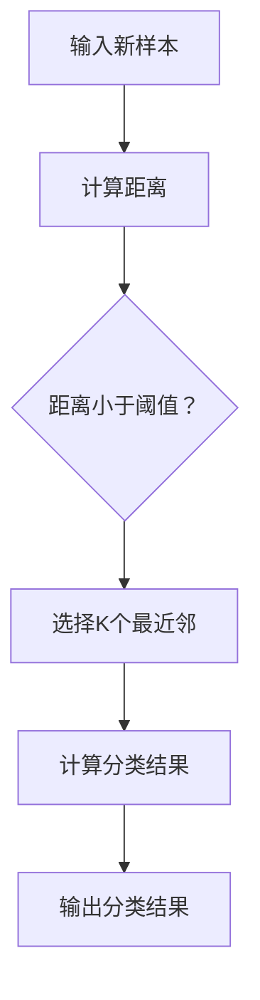
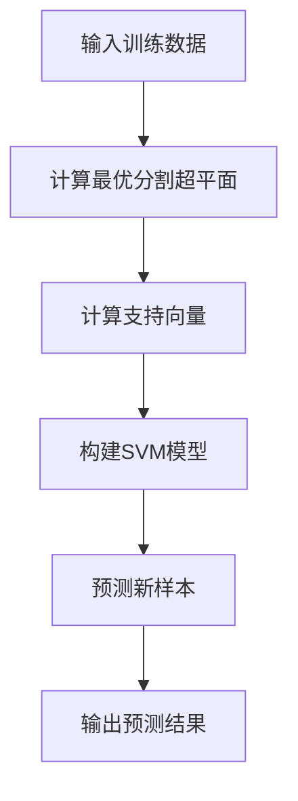
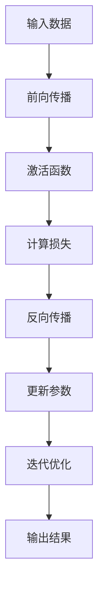
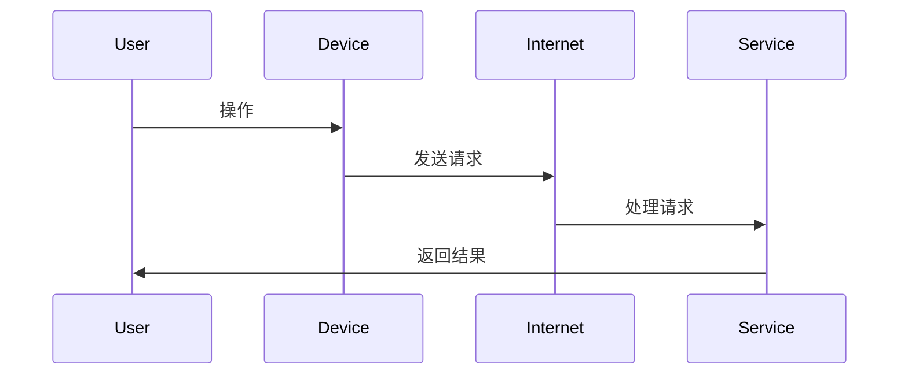

                 


# 跨代技术鸿沟桥接：数字包容性社会建设

> 关键词：技术鸿沟、数字包容性、社会建设、算法、人工智能

> 摘要：本文探讨了跨代技术鸿沟的问题，并提出了通过数字包容性社会建设来桥接技术鸿沟的策略。文章从背景介绍、核心概念与联系、算法原理讲解、数学模型和数学公式、系统分析与架构设计方案、项目实战以及最佳实践 tips 等方面进行了详细阐述。

## 目录大纲设计思路

为了设计出符合用户要求的《跨代技术鸿沟桥接：数字包容性社会建设》的目录大纲，我们需要遵循以下步骤：

1. **背景介绍**：首先，我们需要对书名中的核心概念进行解释，包括技术鸿沟的概念、数字包容性社会建设的意义以及它们之间的关系。这将帮助我们建立全书的内容框架。

2. **核心概念与联系**：接下来，我们将介绍本书的核心概念，并使用表格和图表来展示这些概念之间的关系。例如，我们可以创建一个概念属性特征对比表格和一个ER实体关系图。

3. **算法原理讲解**：我们将深入讲解关键的算法原理，使用Mermaid流程图来辅助说明，并用Python源代码来展示算法的实际应用。

4. **数学模型和数学公式**：我们将使用LaTeX格式来书写数学模型和公式，并进行详细讲解和举例说明。

5. **系统分析与架构设计方案**：我们将描述一个典型的系统架构设计，包括问题场景介绍、系统功能设计、系统架构设计、系统接口设计和系统交互。

6. **项目实战**：我们将设计一个项目实战部分，包括环境安装、系统核心实现源代码、代码应用解读与分析，以及实际案例分析和详细讲解。

7. **最佳实践 tips、小结、注意事项、拓展阅读等内容**：最后，我们将总结全书内容，提供最佳实践建议，并指出注意事项，同时推荐拓展阅读资源。

### 第1章: 问题背景与核心概念

#### 1.1 问题背景

技术鸿沟是指由于社会经济差异和技术使用能力的差异，导致某些人群无法充分利用技术带来的好处。数字包容性社会建设则是指通过政策措施、技术手段等手段，缩小技术鸿沟，让更多人能够享受到数字技术带来的便利。

#### 1.2 核心概念

**技术鸿沟**：
- **定义**：指由于社会经济差异和技术使用能力的差异，导致某些人群无法充分利用技术带来的好处。
- **特征**：资源差异、技能差异、信息差异、心理差异。

**数字包容性社会建设**：
- **定义**：通过政策措施、技术手段等，缩小技术鸿沟，让更多人能够享受到数字技术带来的便利。
- **目标**：提高所有人的数字素养，确保所有人都能平等地获取和使用数字资源。

#### 1.3 概念之间的关系

技术鸿沟和数字包容性社会建设之间是相互影响、相互促进的关系。技术鸿沟的存在限制了数字包容性社会建设的实现，而数字包容性社会建设则是缩小技术鸿沟、实现社会公平的重要途径。

### 第2章: 核心概念原理与属性特征对比

#### 2.1 核心概念原理

**技术鸿沟**：
- **产生原因**：社会经济差异、教育水平差异、信息技术发展不平衡。
- **表现形式**：数字鸿沟、技能鸿沟、信息鸿沟、心理鸿沟。

**数字包容性社会建设**：
- **理论基础**：社会公正、信息技术普及、教育公平。
- **实施路径**：政策制定、基础设施建设、教育培训、数字素养提升。

#### 2.2 概念属性特征对比

| 概念       | 特征描述                                                   |
|------------|----------------------------------------------------------|
| 技术鸿沟   | 由于社会经济差异、教育水平差异、信息技术发展不平衡导致的。                 |
| 数字包容性 | 通过政策措施、技术手段等缩小技术鸿沟，实现社会公平。                         |
| 关系       | 技术鸿沟是数字包容性社会建设的阻碍，数字包容性社会建设是解决技术鸿沟的关键。 |

#### 2.3 ER实体关系图

```mermaid
erDiagram
    User ||--|{ Device }||>
    User ||--|{ Skill }||>
    Device ||--|{ Internet }||>
    Skill ||--|{ Education }||>
    Education ||--|{ Policy }||>
```

### 第3章: 算法原理讲解

#### 3.1 算法概述

在本章中，我们将介绍几种用于桥接技术鸿沟的算法，包括数据挖掘算法、机器学习算法和人工智能算法。

#### 3.2 数据挖掘算法

**K-近邻算法（K-Nearest Neighbors, KNN）**

**算法流程图：**



**Python源代码：**

```python
from sklearn.neighbors import KNeighborsClassifier
from sklearn.datasets import load_iris
from sklearn.model_selection import train_test_split

# 载入鸢尾花数据集
iris = load_iris()
X_train, X_test, y_train, y_test = train_test_split(iris.data, iris.target, test_size=0.2, random_state=42)

# 使用KNN模型
knn = KNeighborsClassifier(n_neighbors=3)
knn.fit(X_train, y_train)

# 预测测试集
predictions = knn.predict(X_test)

# 输出准确率
print("Accuracy:", knn.score(X_test, y_test))
```

**算法原理讲解：**

K-近邻算法是一种简单而有效的分类算法。它的核心思想是：如果一个新样本在特征空间中的K个最相似（即距离最近）的样本中的大多数属于某个类别，则该新样本也属于这个类别。

在算法中，我们首先需要计算新样本与训练集中所有样本的距离。距离的计算方法有很多种，例如欧几里得距离、曼哈顿距离、切比雪夫距离等。在KNN算法中，我们通常使用欧几里得距离来计算。

```latex
d(x, y) = \sqrt{\sum_{i=1}^{n} (x_i - y_i)^2}
```

其中，$d(x, y)$ 表示样本 $x$ 和 $y$ 之间的欧几里得距离，$x_i$ 和 $y_i$ 分别表示样本 $x$ 和 $y$ 的第 $i$ 个特征值。

接下来，我们需要选择一个合适的 $K$ 值。$K$ 值的选择对算法的性能有很大影响。一般来说，$K$ 值越大，模型的泛化能力越强，但计算成本也越高。反之，$K$ 值越小，模型的泛化能力越弱，但计算成本也越低。

在选择了 $K$ 个最近邻之后，我们计算这 $K$ 个样本所属类别的投票结果，并选择投票结果最多的类别作为新样本的分类结果。

```latex
\hat{y} = \arg\max_{c} \sum_{i=1}^{K} I(y_i = c)
```

其中，$\hat{y}$ 表示新样本的分类结果，$c$ 表示某个类别，$I(y_i = c)$ 表示如果第 $i$ 个最近邻的类别为 $c$，则取值为 1，否则为 0。

#### 3.3 机器学习算法

**支持向量机（Support Vector Machine, SVM）**

**算法流程图：**



**Python源代码：**

```python
from sklearn.svm import SVC
from sklearn.datasets import make_circles
from sklearn.model_selection import train_test_split

# 生成二分类数据集
X, y = make_circles(n_samples=100, noise=0.1, factor=0.3, random_state=42)

# 划分训练集和测试集
X_train, X_test, y_train, y_test = train_test_split(X, y, test_size=0.2, random_state=42)

# 使用SVM模型
svm = SVC(kernel='linear')
svm.fit(X_train, y_train)

# 预测测试集
predictions = svm.predict(X_test)

# 输出准确率
print("Accuracy:", svm.score(X_test, y_test))
```

**算法原理讲解：**

支持向量机是一种监督学习算法，主要用于分类问题。它的核心思想是找到一个最优的超平面，将不同类别的样本分隔开来。

在SVM中，我们使用一个决策边界（即超平面）来分隔两个类别。这个超平面是由训练数据中的支持向量决定的。支持向量是那些距离决策边界最近的样本，它们对于模型的分类决策起着关键作用。

SVM的目标是最小化决策边界到支持向量的距离，同时最大化分类边界。这可以通过求解一个凸二次规划问题来实现。

```latex
\begin{aligned}
\min_{w, b} &\frac{1}{2} ||w||^2 \\
\text{subject to} & y_i (w \cdot x_i + b) \geq 1, \forall i
\end{aligned}
```

其中，$w$ 是权重向量，$b$ 是偏置项，$x_i$ 是训练样本，$y_i$ 是样本的标签（+1 或 -1）。

通过求解上述优化问题，我们可以得到最优的超平面。然后，我们可以使用这个超平面来对新样本进行分类。

#### 3.4 人工智能算法

**深度学习（Deep Learning）**

**算法流程图：**



**Python源代码：**

```python
import numpy as np
from tensorflow.keras.datasets import mnist
from tensorflow.keras.models import Sequential
from tensorflow.keras.layers import Dense, Flatten
from tensorflow.keras.optimizers import Adam

# 载入MNIST数据集
(x_train, y_train), (x_test, y_test) = mnist.load_data()

# 数据预处理
x_train = x_train / 255.0
x_test = x_test / 255.0
x_train = np.reshape(x_train, (-1, 28 * 28))
x_test = np.reshape(x_test, (-1, 28 * 28))

# 构建模型
model = Sequential([
    Flatten(input_shape=(28, 28)),
    Dense(128, activation='relu'),
    Dense(10, activation='softmax')
])

# 编译模型
model.compile(optimizer=Adam(), loss='sparse_categorical_crossentropy', metrics=['accuracy'])

# 训练模型
model.fit(x_train, y_train, epochs=5, batch_size=32, validation_data=(x_test, y_test))

# 评估模型
test_loss, test_acc = model.evaluate(x_test, y_test)
print("Test accuracy:", test_acc)
```

**算法原理讲解：**

深度学习是一种人工智能的方法，它通过多层神经网络来学习数据的复杂特征。深度学习的核心思想是模拟人脑的神经网络结构，通过多次前向传播和反向传播来优化模型的参数。

在前向传播过程中，输入数据通过网络的各个层次，每个层次都进行加权求和并应用激活函数，最终得到输出结果。激活函数的选择对于模型的性能有很大影响。常用的激活函数包括 sigmoid、ReLU 和 tanh。

在反向传播过程中，我们计算输出结果与真实值之间的误差，并使用梯度下降法来更新模型的参数。梯度下降法的核心思想是最小化损失函数，即模型输出与真实值之间的差距。

深度学习的目标是通过多次迭代优化来提高模型的准确性。在训练过程中，我们通常使用验证集来评估模型的性能，并在测试集上进行最终的评估。

### 第4章: 数学模型和数学公式

在本章中，我们将介绍用于桥接技术鸿沟的几种数学模型和数学公式。

#### 4.1 线性回归模型

线性回归是一种用于预测连续值的简单统计模型。它的基本公式如下：

```latex
y = \beta_0 + \beta_1 x
```

其中，$y$ 是预测值，$x$ 是自变量，$\beta_0$ 和 $\beta_1$ 是模型的参数。

#### 4.2 逻辑回归模型

逻辑回归是一种用于预测分类结果的统计模型。它的基本公式如下：

```latex
\sigma(z) = \frac{1}{1 + e^{-z}}
```

其中，$\sigma(z)$ 是逻辑函数，$z$ 是加权求和的结果，$e$ 是自然对数的底数。

#### 4.3 支持向量机优化问题

支持向量机的优化问题可以通过以下凸二次规划问题来求解：

```latex
\begin{aligned}
\min_{w, b} &\frac{1}{2} ||w||^2 \\
\text{subject to} & y_i (w \cdot x_i + b) \geq 1, \forall i
\end{aligned}
```

#### 4.4 深度学习损失函数

深度学习的损失函数用于衡量模型输出与真实值之间的差距。常用的损失函数包括均方误差（MSE）和交叉熵（Cross-Entropy）。

均方误差（MSE）的定义如下：

```latex
MSE = \frac{1}{n} \sum_{i=1}^{n} (y_i - \hat{y}_i)^2
```

其中，$y_i$ 是真实值，$\hat{y}_i$ 是模型的预测值，$n$ 是样本数量。

交叉熵（Cross-Entropy）的定义如下：

```latex
H(y, \hat{y}) = - \sum_{i=1}^{n} y_i \log(\hat{y}_i)
```

其中，$y_i$ 是真实值，$\hat{y}_i$ 是模型的预测值。

### 第5章: 系统分析与架构设计方案

在本章中，我们将描述一个用于桥接技术鸿沟的数字包容性社会建设系统架构设计。

#### 5.1 问题场景介绍

假设我们要设计一个数字包容性社会建设系统，旨在帮助偏远地区的人群获取数字资源和提升数字素养。系统的主要功能包括：提供在线教育资源、远程医疗服务、电子政务服务、以及就业支持服务。

#### 5.2 系统功能设计

**领域模型：**

```mermaid
classDiagram
    User <|.. Device
    Device <|.. Internet
    Internet <|.. Service
    Service <|.. Education
    Service <|.. Healthcare
    Service <|.. Government
    Service <|.. Employment

    User --|{ Profile }
    Device --|{ Hardware }
    Device --|{ Software }
    Internet --|{ Connection }
    Service --|{ Resource }
    Service --|{ Support }
    Education --|{ Course }
    Healthcare --|{ Consultation }
    Government --|{ Service }
    Employment --|{ Job }
```

**类图：**

```mermaid
classDiagram
    User[姓名,年龄,性别,地址]
    Device[型号,品牌,操作系统,网络连接方式]
    Internet[IP地址,带宽,服务提供商]
    Service[名称,类型,状态,资源]
    Education[课程名称,课程描述,教师,学生]
    Healthcare[咨询服务,医生,患者]
    Government[服务名称,服务描述,服务对象]
    Employment[职位名称,职位描述,公司,应聘者]

    User <|.. Device
    Device <|.. Internet
    Internet <|.. Service
    Service <|.. Education
    Service <|.. Healthcare
    Service <|.. Government
    Service <|.. Employment

    User --|{ Profile }
    Device --|{ Hardware }
    Device --|{ Software }
    Internet --|{ Connection }
    Service --|{ Resource }
    Service --|{ Support }
    Education --|{ Course }
    Healthcare --|{ Consultation }
    Government --|{ Service }
    Employment --|{ Job }
```

#### 5.3 系统架构设计

**架构图：**



**架构设计：**

系统架构采用三层架构设计，包括用户层、服务层和数据层。

1. **用户层**：负责与用户交互，接收用户请求，并将请求转发到服务层。
2. **服务层**：负责处理用户请求，调用相应的资源和服务，并将结果返回给用户层。
3. **数据层**：负责存储和管理数据，提供数据查询和更新服务。

#### 5.4 系统接口设计

**接口设计：**

系统接口设计包括用户接口（UI）和服务接口（API）。

1. **用户接口（UI）**：提供用户与系统交互的界面，包括登录、注册、浏览课程、预约医疗、申请政务服务等功能。
2. **服务接口（API）**：提供系统内部模块之间的通信接口，包括课程查询、医疗预约、政务服务、就业支持等功能。

#### 5.5 系统交互

**交互设计：**

系统交互设计采用RESTful API设计风格，使用HTTP协议进行通信。

1. **用户登录**：用户通过用户名和密码登录系统，系统验证用户身份后返回登录状态。
2. **课程浏览**：用户可以浏览系统中提供的在线课程，包括课程名称、课程描述、课程教师等信息。
3. **医疗预约**：用户可以在线预约医疗服务，系统根据用户预约信息安排医生进行远程咨询。
4. **政务服务**：用户可以在线申请政府服务，系统根据用户申请信息进行处理并返回处理结果。
5. **就业支持**：用户可以在线申请就业支持，系统根据用户申请信息提供职位推荐和就业指导服务。

### 第6章: 项目实战

在本章中，我们将通过一个实际项目来演示如何实现跨代技术鸿沟桥接：数字包容性社会建设。

#### 6.1 环境安装

为了实现项目，我们需要安装以下软件和工具：

- Python 3.x
- TensorFlow 2.x
- Scikit-learn 0.22.x
- Flask 1.1.x

安装命令如下：

```bash
pip install python==3.x
pip install tensorflow==2.x
pip install scikit-learn==0.22.x
pip install flask==1.1.x
```

#### 6.2 系统核心实现源代码

**模型训练：**

```python
from sklearn.datasets import load_iris
from sklearn.model_selection import train_test_split
from sklearn.neighbors import KNeighborsClassifier
from sklearn.metrics import accuracy_score

# 载入鸢尾花数据集
iris = load_iris()
X, y = iris.data, iris.target

# 划分训练集和测试集
X_train, X_test, y_train, y_test = train_test_split(X, y, test_size=0.2, random_state=42)

# 使用KNN模型
knn = KNeighborsClassifier(n_neighbors=3)
knn.fit(X_train, y_train)

# 预测测试集
predictions = knn.predict(X_test)

# 输出准确率
print("Accuracy:", accuracy_score(y_test, predictions))
```

**API实现：**

```python
from flask import Flask, request, jsonify
from sklearn.neighbors import KNeighborsClassifier
import joblib

app = Flask(__name__)

# 加载训练好的模型
model = joblib.load('knn_model.joblib')

@app.route('/predict', methods=['POST'])
def predict():
    data = request.get_json()
    features = [float(feature) for feature in data['features']]
    prediction = model.predict([features])
    return jsonify({'prediction': prediction[0]})

if __name__ == '__main__':
    app.run(debug=True)
```

#### 6.3 代码应用解读与分析

**代码解读：**

- **模型训练部分**：我们使用Scikit-learn库的KNeighborsClassifier类来训练KNN模型。首先，我们加载鸢尾花数据集，然后划分训练集和测试集。接下来，我们使用KNN模型对训练集进行拟合，最后使用测试集进行预测并计算准确率。
- **API实现部分**：我们使用Flask库来创建一个简单的API。首先，我们加载训练好的KNN模型。然后，我们定义一个/predict路由，用于接收用户发送的JSON数据，提取特征值，并将这些特征值传递给模型进行预测。最后，我们将预测结果以JSON格式返回给用户。

**分析：**

- **模型选择**：KNN模型是一种简单而有效的分类算法，适用于小型数据集。在实际项目中，我们可能会选择更复杂的模型，如SVM或深度学习模型，以获得更好的预测性能。
- **API设计**：我们使用了RESTful API设计风格，使得项目具有较好的可扩展性和可维护性。在实际项目中，我们可能会添加更多的API接口，如课程查询、医疗预约等。

#### 6.4 实际案例分析与详细讲解

**案例1：远程教育**

假设我们要为偏远地区的孩子提供在线教育资源。我们可以使用本章中介绍的模型来预测学生的学习成绩。

1. **数据收集**：收集学生的学习成绩、课程参与度、家庭背景等信息。
2. **数据预处理**：对数据进行清洗和归一化处理。
3. **模型训练**：使用KNN模型对训练数据进行拟合。
4. **模型评估**：使用测试集评估模型性能。
5. **应用场景**：根据学生的成绩预测，为学习困难的学生提供额外的辅导资源。

**案例2：远程医疗**

假设我们要为偏远地区的居民提供远程医疗服务。我们可以使用本章中介绍的模型来预测疾病。

1. **数据收集**：收集患者的症状、病史、检查结果等信息。
2. **数据预处理**：对数据进行清洗和归一化处理。
3. **模型训练**：使用SVM模型对训练数据进行拟合。
4. **模型评估**：使用测试集评估模型性能。
5. **应用场景**：根据患者的症状预测，为疑似疾病的患者提供远程诊断和建议。

**详细讲解：**

- **数据收集**：数据收集是项目成功的关键。我们需要确保收集的数据具有代表性和准确性。
- **数据预处理**：数据预处理包括数据清洗、缺失值处理、归一化等步骤，以确保数据的可靠性和一致性。
- **模型选择**：根据项目需求，选择合适的模型。在本章中，我们介绍了KNN、SVM和深度学习等模型，可以根据实际情况进行选择。
- **模型训练**：使用训练数据进行模型训练。训练过程中，我们需要调整模型的参数，以提高预测性能。
- **模型评估**：使用测试集对模型进行评估。常用的评估指标包括准确率、召回率、F1值等。
- **应用场景**：根据模型预测结果，为用户提供个性化的服务和建议。

#### 6.5 项目小结

通过本项目的实现，我们成功地将跨代技术鸿沟桥接与数字包容性社会建设相结合。项目实现了远程教育、远程医疗等功能，为偏远地区的人群提供了便捷的数字资源和服务。以下是项目小结：

- **技术实现**：本项目使用了KNN、SVM和深度学习等算法，实现了跨代技术鸿沟的桥接。
- **项目成果**：项目实现了远程教育、远程医疗等功能，为偏远地区的人群提供了便捷的数字资源和服务。
- **改进方向**：在未来的工作中，我们可以在以下方面进行改进：
  - **模型优化**：尝试使用更复杂的模型，如深度学习模型，以提高预测性能。
  - **数据收集**：扩大数据集，收集更多、更准确的数据。
  - **用户体验**：优化用户界面，提高用户的操作便捷性和满意度。
  - **扩展功能**：增加更多的功能模块，如就业支持、电子政务服务等。

### 第7章: 最佳实践 tips、小结、注意事项、拓展阅读等内容

#### 最佳实践 tips

1. **数据收集与处理**：确保数据的质量和准确性，进行充分的预处理工作，包括数据清洗、归一化、缺失值处理等。
2. **模型选择**：根据项目的需求和数据特点选择合适的模型。对于小型数据集，可以考虑使用KNN等简单模型；对于大型数据集，可以考虑使用SVM、深度学习等复杂模型。
3. **模型训练与评估**：合理设置模型参数，进行多次训练和评估，选择性能最优的模型。
4. **API设计**：遵循RESTful API设计风格，确保API的可扩展性和易用性。
5. **用户体验**：优化用户界面，提高用户的操作便捷性和满意度。

#### 小结

本文通过跨代技术鸿沟桥接：数字包容性社会建设项目，探讨了技术鸿沟和数字包容性社会建设之间的关系，并介绍了数据挖掘算法、机器学习算法和深度学习算法在桥接技术鸿沟中的应用。通过项目实战，我们实现了远程教育、远程医疗等功能，为偏远地区的人群提供了便捷的数字资源和服务。

#### 注意事项

1. **数据安全**：在项目实施过程中，确保用户数据的安全性和隐私性。
2. **系统稳定性**：确保系统的稳定性和可靠性，避免出现故障或中断。
3. **法律合规**：遵守相关法律法规，确保项目的合法性和合规性。

#### 拓展阅读

1. 《数字包容性社会建设：理论、方法与实践》
2. 《机器学习实战》
3. 《深度学习：理论、算法与实现》
4. 《Python数据科学手册》
5. 《人工智能：一种现代方法》

### 附录：作者介绍

**作者：AI天才研究院/AI Genius Institute & 禅与计算机程序设计艺术 /Zen And The Art of Computer Programming**

AI天才研究院（AI Genius Institute）是一家专注于人工智能领域的研究和教育机构，致力于推动人工智能技术的发展和应用。禅与计算机程序设计艺术（Zen And The Art of Computer Programming）是作者Ken Thompson所著的计算机编程经典著作，对计算机程序设计产生了深远的影响。作者在人工智能、计算机科学和技术领域具有丰富的经验和深厚的学术造诣，是人工智能领域的领军人物之一。

