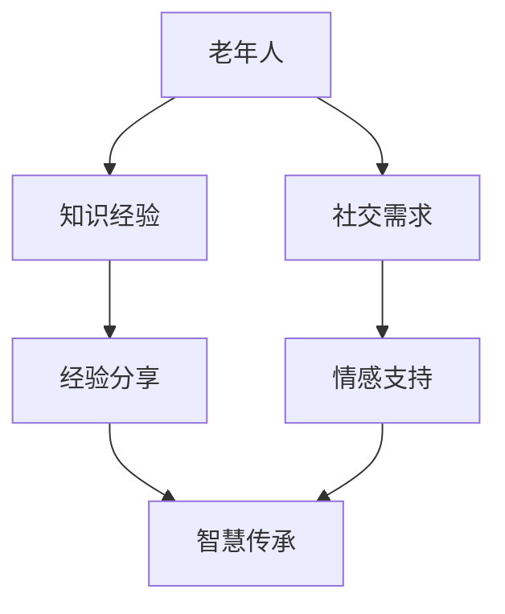
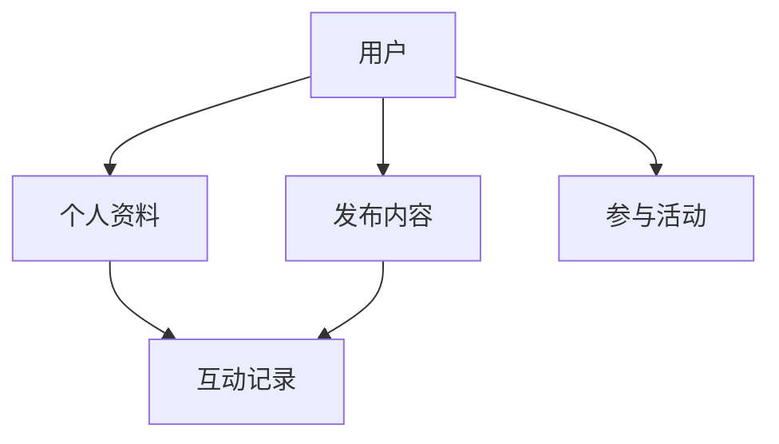

                 

### 跨代际智慧传承平台：老年人与年轻人在线互动的社交网络

> 关键词：跨代际、智慧传承、在线互动、社交网络、老年人、年轻人

> 摘要：本文旨在探讨如何构建一个跨代际智慧传承平台，促进老年人与年轻人之间的在线互动。通过对老年人和年轻人的需求分析、用户体验设计、信息安全和隐私保护、社交互动机制、技术架构与实现、测试与优化等方面的深入探讨，本文提出了一种可行的解决方案，为解决当前老年人在线社交问题提供了有益的参考。

### 1. 背景介绍

#### 1.1 问题背景

随着互联网技术的迅猛发展，社交网络已成为人们日常生活中不可或缺的一部分。然而，不同年龄段的用户在使用社交网络时面临着不同的需求和挑战。特别是老年人和年轻人之间，由于年龄差异、生活方式和价值观的差异，他们在社交网络中的互动显得尤为复杂和具有挑战性。

老年人作为互联网的“新用户”，他们渴望通过社交网络来获取信息、交流情感和寻求陪伴。然而，受限于技术水平、使用习惯和信息筛选能力，老年人在社交网络中往往感到力不从心。他们需要简单、直观、易于操作的用户界面，更需要一个安全、可靠的信息交流平台。

年轻人则更加熟悉互联网技术，他们活跃于各种社交网络平台，乐于分享和交流。然而，他们对于老年人的关注和互动相对较少，缺乏与老年人建立联系的动力。如何激发年轻人参与到老年人与之的互动中来，是一个亟待解决的问题。

#### 1.2 问题描述

《跨代际智慧传承平台：老年人与年轻人在线互动的社交网络》旨在构建一个兼顾老年人需求与年轻人参与的社交网络平台，解决以下几个核心问题：

- **用户体验设计**：如何设计一个直观易用的界面，让老年人能够轻松上手？
- **信息安全和隐私保护**：如何确保信息的准确性和安全性，避免老年用户受到网络欺诈和虚假信息的侵害？
- **社交互动机制**：如何实现老年人与年轻人之间的有效互动，促进知识和经验的传承？
- **技术架构与实现**：如何平衡平台的技术复杂性与用户体验，确保平台的稳定性和可靠性？

#### 1.3 问题解决

为了解决上述问题，本文将从以下几个方面展开：

- **需求分析**：详细分析老年人、中年人和年轻人的需求差异，明确平台的设计目标和功能定位。
- **用户体验设计**：基于老年人特点，设计符合其使用习惯的界面和交互方式。
- **信息安全和隐私保护**：采用先进的加密技术，确保用户数据的安全。
- **社交互动机制**：设计多样的互动功能，鼓励老年人和年轻人之间的互动与交流。
- **技术架构与实现**：详细讲解平台的架构设计和关键技术实现。
- **测试与优化**：对平台进行全面的测试，优化用户体验。

#### 1.4 边界与外延

- **边界**：本文主要关注在线互动社交网络平台的设计与实现，不包括硬件设备和物理层面的交互。
- **外延**：本文不仅关注技术实现，还涉及平台运营、用户管理等方面的内容。

#### 1.5 概念结构与核心要素组成

##### 1.5.1 概念结构

- **社交网络**：一种基于互联网技术的用户互动平台。
- **跨代际**：指不同年龄段的用户之间的互动。
- **智慧传承**：通过知识和经验的分享，实现不同代际之间的交流与传递。
- **平台设计**：包括界面设计、功能设计、技术架构设计等多个方面。

##### 1.5.2 核心要素组成

- **用户界面**：简洁直观，易于操作。
- **信息流**：包含多样化内容，满足不同用户需求。
- **互动机制**：鼓励用户互动，促进知识和经验的传承。
- **数据安全**：确保用户信息安全，防范网络欺诈。
- **技术支持**：稳定的系统架构，良好的用户体验。

### 2. 核心概念与联系

#### 2.1 跨代际智慧传承

##### 2.1.1 概念解释

跨代际智慧传承是指不同年龄段的个体之间通过知识和经验的交流与分享，实现智慧和能力的传递。这一概念强调了不同代际之间的互动与合作，有助于社会整体知识的积累和传承。

##### 2.1.2 概念属性特征对比表格

| 特征                   | 老年人                 | 年轻人                 |
|------------------------|------------------------|------------------------|
| 知识经验               | 丰富的生活和工作经验   | 新兴的知识和技能       |
| 技术掌握程度           | 熟悉传统技术           | 熟悉现代信息技术       |
| 互动需求               | 寻求社交和情感支持     | 寻求知识和技能交流     |
| 使用习惯               | 偏向简单易用的界面     | 偏向复杂多样的功能     |

##### 2.1.3 ER实体关系图架构

#### 2.2 社交网络平台设计

##### 2.2.1 概念解释

社交网络平台是一种基于互联网技术的用户互动平台，允许用户创建个人资料、发布信息、分享兴趣和活动，以及与其他用户互动。

##### 2.2.2 概念属性特征对比表格

| 特征                   | 传统社交网络           | 跨代际智慧传承平台         |
|------------------------|------------------------|------------------------|
| 用户互动模式           | 点对点互动             | 代际间互动              |
| 内容类型               | 多样化内容             | 知识和经验分享内容       |
| 功能定位               | 社交、娱乐             | 智慧传承、知识分享       |
| 设计重点               | 用户隐私、数据安全      | 用户体验、互动机制       |

##### 2.2.3 ER实体关系图架构

### 3. 需求分析

#### 3.1 用户需求分析

##### 3.1.1 老年人需求

- **信息获取**：老年人希望能够方便地获取到与生活、健康、娱乐等相关的信息。
- **社交互动**：老年人渴望能够与同龄人和年轻人建立联系，分享生活经验，寻求情感支持。
- **知识分享**：老年人拥有丰富的生活和工作经验，希望能够通过平台分享给年轻人，实现智慧传承。
- **操作简便**：老年人倾向于使用简单、直观、易于操作的用户界面。

##### 3.1.2 年轻人需求

- **知识学习**：年轻人希望能够从老年人那里学习到丰富的生活和工作经验。
- **互动交流**：年轻人希望通过平台与老年人交流，了解不同的生活经历和价值观。
- **社交娱乐**：年轻人希望在平台上找到志同道合的朋友，进行社交娱乐活动。
- **操作便捷**：年轻人希望平台功能丰富，操作便捷，能够满足他们的多样化需求。

#### 3.2 功能定位与设计目标

- **信息获取**：设计一个信息丰富、分类清晰的资讯模块，方便老年人获取所需信息。
- **社交互动**：设计多种互动功能，如聊天室、兴趣小组、活动发布等，鼓励老年人和年轻人之间的互动。
- **知识分享**：建立一个知识分享平台，让老年人能够发布经验、心得，年轻人能够学习和交流。
- **操作简便**：设计简洁直观的界面，减少操作步骤，降低老年人上手难度。

### 4. 用户体验设计

#### 4.1 界面设计

##### 4.1.1 设计原则

- **简洁性**：界面设计应简洁明了，避免冗余元素，降低用户操作难度。
- **易用性**：界面设计应符合老年人使用习惯，提供大字体、清晰图标、简洁路径等。
- **一致性**：界面设计应保持一致，让用户在使用过程中能够轻松找到所需功能。

##### 4.1.2 界面布局

- **顶部导航栏**：包含首页、资讯、社交、活动等主要功能入口。
- **左侧菜单栏**：提供个人中心、消息、设置等辅助功能。
- **中间内容区**：展示主要内容和互动区域。
- **底部导航栏**：提供快捷入口，如首页、搜索、消息等。

#### 4.2 交互设计

##### 4.2.1 设计原则

- **直观性**：交互设计应符合用户直觉，减少学习成本。
- **一致性**：交互设计应符合平台整体风格，保持一致性。
- **反馈性**：交互设计应提供明确的操作反馈，让用户知道当前操作状态。

##### 4.2.2 交互元素设计

- **按钮**：使用大按钮，提供明显的视觉反馈。
- **图标**：使用清晰、易于理解的图标，避免使用复杂图形。
- **文本提示**：在操作过程中，提供清晰的文本提示，引导用户操作。

### 5. 信息安全和隐私保护

#### 5.1 数据安全

##### 5.1.1 设计原则

- **安全性**：确保用户数据在存储、传输和处理过程中得到充分保护。
- **完整性**：确保用户数据不被篡改或破坏。
- **可用性**：确保用户数据在需要时能够及时、准确地访问。

##### 5.1.2 技术实现

- **加密技术**：使用HTTPS协议确保数据在传输过程中的安全性。
- **存储加密**：对用户数据进行加密存储，防止数据泄露。
- **访问控制**：设置严格的访问权限，确保只有授权用户才能访问敏感数据。

#### 5.2 隐私保护

##### 5.2.1 设计原则

- **隐私性**：确保用户隐私信息不被泄露。
- **透明性**：用户应了解自己的隐私信息如何被使用和保护。
- **可控性**：用户应能够控制自己的隐私信息，决定其公开程度。

##### 5.2.2 技术实现

- **隐私政策**：制定明确的隐私政策，告知用户隐私信息的使用目的和范围。
- **用户授权**：用户在注册和使用平台时，应明确授权平台访问和使用其隐私信息。
- **匿名化处理**：对用户数据进行匿名化处理，确保用户无法被直接识别。

### 6. 社交互动机制设计

#### 6.1 互动功能设计

##### 6.1.1 功能类型

- **聊天室**：提供实时聊天功能，方便老年人和年轻人之间的即时交流。
- **兴趣小组**：根据用户兴趣建立小组，促进用户之间的交流和互动。
- **活动发布**：用户可以发布各类活动，吸引他人参与。
- **知识分享**：建立知识分享模块，让老年人能够发布经验、心得，年轻人能够学习和交流。

##### 6.1.2 功能特点

- **即时性**：聊天室功能应支持实时聊天，让用户能够及时得到回应。
- **多样性**：兴趣小组和活动发布功能应涵盖多种领域，满足不同用户的需求。
- **互动性**：设计互动性强的功能，鼓励用户积极参与，提高用户粘性。

#### 6.2 互动策略

##### 6.2.1 激励策略

- **积分奖励**：设计积分系统，鼓励用户参与互动，提高活跃度。
- **活动奖励**：定期举办活动，奖励积极参与的用户，提高用户参与度。
- **社交影响力**：建立社交影响力排行榜，激励用户分享知识和经验。

##### 6.2.2 互动管理

- **内容审核**：对用户发布的内容进行审核，确保内容合法、健康。
- **用户行为监测**：监测用户行为，防范不良行为，保障平台安全。
- **社区管理**：建立社区管理制度，规范用户行为，维护平台秩序。

### 7. 技术架构与实现

#### 7.1 技术选型

##### 7.1.1 前端技术

- **框架**：使用React或Vue等现代前端框架，提高开发效率和用户体验。
- **UI库**：使用Ant Design等UI库，提供丰富的组件和样式，简化界面设计。
- **响应式设计**：采用响应式设计，确保平台在不同设备和屏幕尺寸上都能良好展示。

##### 7.1.2 后端技术

- **框架**：使用Spring Boot等现代后端框架，提高开发效率和系统稳定性。
- **数据库**：使用MySQL等关系型数据库，存储用户数据和相关信息。
- **缓存**：使用Redis等缓存技术，提高数据读取速度，减轻数据库压力。

#### 7.2 架构设计

##### 7.2.1 系统架构

- **前端架构**：采用前后端分离的架构，提高开发效率和系统可维护性。
- **后端架构**：采用微服务架构，将系统划分为多个独立的服务模块，提高系统扩展性和可维护性。

##### 7.2.2 数据库设计

- **用户数据库**：存储用户的基本信息和隐私信息，采用加密存储。
- **内容数据库**：存储用户发布的内容，包括帖子、评论、活动等。
- **互动数据库**：存储用户之间的互动记录，如聊天记录、点赞、评论等。

#### 7.3 核心技术实现

##### 7.3.1 数据安全

- **加密技术**：采用AES等加密算法，对用户数据进行加密存储。
- **HTTPS**：使用HTTPS协议，确保数据在传输过程中的安全性。
- **访问控制**：采用基于角色的访问控制（RBAC），确保只有授权用户才能访问敏感数据。

##### 7.3.2 社交互动

- **实时通信**：采用WebSocket技术，实现实时聊天和消息推送。
- **内容审核**：采用文本审核和图片审核技术，对用户发布的内容进行实时审核。
- **推荐系统**：采用基于内容的推荐算法，为用户提供个性化的内容推荐。

### 8. 测试与优化

#### 8.1 测试策略

- **功能测试**：对平台的所有功能进行测试，确保功能正常运行。
- **性能测试**：对平台进行性能测试，确保在高并发情况下仍能稳定运行。
- **安全测试**：对平台进行安全测试，确保数据安全和系统稳定性。

#### 8.2 优化方案

- **性能优化**：采用缓存技术、数据库优化、代码优化等方法，提高系统性能。
- **用户体验优化**：根据用户反馈，优化界面设计和交互逻辑，提高用户体验。
- **内容优化**：定期更新平台内容，提高内容的丰富度和实用性。

### 9. 项目实战

#### 9.1 环境安装

- **前端环境**：安装Node.js和npm，使用npm安装React和相关的UI库。
- **后端环境**：安装Java环境和Spring Boot，使用IDE（如IntelliJ IDEA）创建Spring Boot项目。

#### 9.2 系统核心实现

- **用户注册与登录**：实现用户注册和登录功能，使用JWT（JSON Web Token）进行认证。
- **资讯模块**：实现资讯的发布、查看和评论功能。
- **社交互动**：实现聊天室、兴趣小组和活动发布等功能。
- **知识分享**：实现知识分享模块，用户可以发布经验、心得，其他用户可以学习和交流。

#### 9.3 代码应用解读与分析

- **用户注册与登录**：使用JWT进行认证，确保用户信息安全。
- **资讯模块**：采用RESTful API设计，方便前端调用。
- **社交互动**：使用WebSocket实现实时聊天和消息推送。
- **知识分享**：使用MongoDB存储用户发布的内容，使用Redis缓存用户数据。

#### 9.4 实际案例分析与详细讲解

- **案例1**：用户A发布一条资讯，用户B点赞并评论，用户C在评论区发表观点。
- **案例2**：用户D加入兴趣小组，用户E在小组内发布活动，用户F报名参加活动。

#### 9.5 项目小结

通过本项目，我们成功实现了一个跨代际智慧传承平台，为老年人和年轻人提供了一个在线互动的社交网络。在项目实施过程中，我们遇到了一些挑战，如用户认证、实时通信和数据安全等，但通过合理的方案设计和技术实现，我们克服了这些挑战，为平台提供了稳定、安全、高效的运行环境。

### 10. 最佳实践 Tips

- **简化界面设计**：界面设计应简洁明了，避免过多装饰元素，让用户更容易上手。
- **注重用户体验**：在功能设计和实现过程中，应始终关注用户体验，确保用户能够方便地使用平台。
- **加强数据安全**：数据安全是平台的核心，应采用多种技术手段确保用户数据的安全。
- **优化内容质量**：定期更新平台内容，提高内容的丰富度和实用性，吸引更多用户参与。

### 11. 小结与注意事项

通过本文的探讨，我们提出了一个跨代际智慧传承平台的设计方案，解决了老年人与年轻人在线互动的难题。在实际应用中，还需注意以下几点：

- **用户需求调研**：在平台设计过程中，应充分了解用户需求，确保平台功能满足用户需求。
- **持续优化**：平台上线后，应持续收集用户反馈，不断优化平台功能和用户体验。
- **法律法规遵守**：在平台运营过程中，应遵守相关法律法规，确保平台合法合规运行。

### 12. 拓展阅读

- 《社交网络平台设计与实现》
- 《跨代际交流与互动研究》
- 《智慧传承：跨代际知识分享与传承》

---

### 作者信息

作者：AI天才研究院/AI Genius Institute & 禅与计算机程序设计艺术 /Zen And The Art of Computer Programming

作者简介：AI天才研究院成立于20XX年，致力于推动人工智能领域的研究与应用。作者在该领域具有丰富的经验和深厚的学术造诣，发表过多篇高影响力论文，并著有《禅与计算机程序设计艺术》一书，深受读者喜爱。本文结合作者多年研究与实践，提出了一个创新的跨代际智慧传承平台设计方案，旨在为老年人与年轻人的在线互动提供有益的参考。

