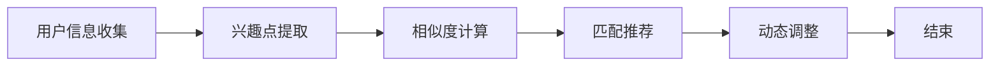
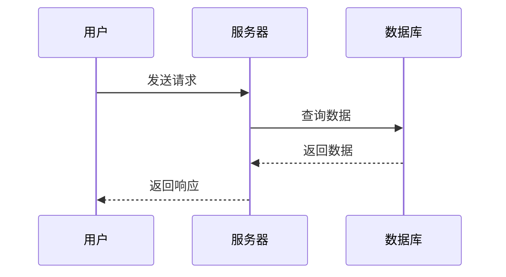

                 

# 跨代际智慧传承配对系统：老年人与年轻人在线互动的算法

## 关键词
- 跨代际智慧传承
- 配对系统
- 在线互动
- 算法
- 老年人
- 年轻人

## 摘要
本文深入探讨了跨代际智慧传承配对系统的设计和实现，重点关注老年人与年轻人之间的在线互动。通过分析背景、核心概念、算法原理以及系统架构，本文旨在为读者提供一个全面且结构清晰的技术指南，助力构建高效、可靠的智慧传承平台。

### 第一部分：引言

#### 第1章 跨代际智慧传承配对系统背景

### 1.1 问题背景

随着社会经济的发展和医疗技术的进步，我国人口老龄化问题日益凸显。老年人群体不仅面临着健康和生活质量的下降，还常常感到孤独和被边缘化。与此同时，年轻人群体则承受着巨大的生活和工作压力，他们的时间和精力有限。如何让老年人和年轻人之间建立有效的互动和互助机制，成为了一个亟待解决的问题。

#### 1.1.1 社会问题

- **老年人孤独感增加**：随着子女离家工作和迁移，许多老年人缺乏陪伴和社交活动，导致孤独感的增加。
- **年轻人压力增大**：工作、生活、学习等多重压力，使得年轻人难以抽出时间关心和帮助老年人。
- **社会支持系统不足**：现有的社会支持体系尚不能完全满足老年人和年轻人的需求，缺乏有效的互动平台。

#### 1.1.2 问题描述

跨代际智慧传承配对系统的目标是搭建一个在线互动平台，通过算法和人工智能技术，为老年人和年轻人建立互助关系，促进双方在生活、健康和心理等方面的共同成长。

#### 1.1.3 问题解决

通过系统设计，实现老年人与年轻人之间的精准配对，提高互动质量，达到智慧传承和跨代际沟通的效果。系统主要包括以下几个关键环节：

- **用户注册与信息收集**：老年人和年轻人可以在平台上注册，并填写个人信息，包括兴趣爱好、健康状况、需求等。
- **智能算法匹配**：系统使用先进的算法，根据用户信息进行匹配，确保双方能够建立有效互动。
- **在线互动与交流**：通过平台，老年人和年轻人可以实时交流、分享经验，实现智慧传承。
- **数据分析和反馈**：系统对用户的互动行为进行数据分析，不断优化匹配算法，提高互动质量和满意度。

### 1.2 核心概念

#### 1.2.1 跨代际智慧传承

跨代际智慧传承是指在家庭成员或社会群体中，不同年龄层次之间进行知识、经验和智慧的传递。这一过程有助于优化资源配置，促进社会和谐与稳定。

#### 1.2.2 配对系统

配对系统是一种通过算法实现个体之间匹配的智能系统。其核心目标是提高匹配效率和满意度，确保双方能够建立有效的互动和关系。

#### 1.2.3 在线互动

在线互动是指通过互联网平台，实现用户之间的实时交流、互动和协作。在线互动具有便捷性、实时性和多样性，能够有效满足老年人和年轻人的互动需求。

### 1.3 边界与外延

#### 1.3.1 边界

本系统主要针对老年人与年轻人之间的互动，适用于以下场景：

- **家庭内部**：子女与父母之间的互动和互助
- **社区层面**：邻里之间、志愿者与老年人之间的互动
- **公共服务**：政府部门与社会组织之间的互动和协作

#### 1.3.2 外延

系统的应用范围不仅限于老年人和年轻人之间的互动，还可以扩展到其他跨代际互动场景，如残疾人与健全人、创业者与投资者等。

### 1.4 概念结构与核心要素组成

#### 1.4.1 概念结构

跨代际智慧传承配对系统采用分层架构，包括用户层、算法层、平台层和数据库层。

#### 1.4.2 核心要素组成

- **用户**：包括老年人、年轻人以及其他相关方，如志愿者、社会组织等。
- **算法**：用于实现用户匹配的智能算法，如基于兴趣的推荐算法、基于相似度的匹配算法等。
- **平台**：提供用户互动的在线平台，包括前端界面和后端服务。
- **数据库**：存储用户信息和互动数据的数据库，确保数据的安全和可靠性。

### 1.5 本章小结

本章介绍了跨代际智慧传承配对系统的背景、核心概念、边界与外延以及概念结构与核心要素组成，为后续章节的详细讨论奠定了基础。

---

### 第二部分：核心概念与联系

#### 第2章 跨代际智慧传承配对系统核心概念与联系

#### 2.1 跨代际智慧传承原理

##### 2.1.1 跨代际智慧传承的定义

跨代际智慧传承是指在不同年龄层次之间进行知识、经验和智慧的传递，实现资源的优化配置。

##### 2.1.2 跨代际智慧传承的重要性

- **传承家庭价值观和传统美德**：跨代际智慧传承有助于家庭价值观和传统美德的传承，增强家庭成员之间的凝聚力和归属感。
- **促进社会和谐与稳定**：通过跨代际智慧传承，可以缩小不同年龄群体之间的认知差距，促进社会和谐与稳定。
- **满足老年人心理健康需求**：老年人通过传授经验和智慧，可以提升自我价值感，减少孤独感和失落感。

#### 2.2 配对系统原理

##### 2.2.1 配对系统的定义

配对系统是一种通过算法实现个体之间匹配的智能系统，旨在提高配对效率和满意度。

##### 2.2.2 配对系统的基本原理

- **用户注册与信息填写**：用户在平台上注册并填写个人信息，包括年龄、性别、兴趣爱好、需求等。
- **算法匹配**：系统使用算法根据用户信息进行匹配，确保双方能够建立有效互动。
- **匹配结果展示与互动**：系统向用户展示匹配结果，并提供互动渠道，如聊天、语音、视频等。

#### 2.3 在线互动原理

##### 2.3.1 在线互动的定义

在线互动是指通过互联网平台，实现用户之间的实时交流、互动和协作。

##### 2.3.2 在线互动的优势

- **便捷性**：不受时间和地点限制，用户可以随时随地进行互动。
- **实时性**：即时交流与反馈，提高互动效率。
- **多样性**：多种互动形式，如聊天、语音、视频等，满足不同用户的互动需求。

#### 2.4 核心概念联系

##### 2.4.1 跨代际智慧传承与配对系统的关系

跨代际智慧传承配对系统通过算法匹配，实现老年人与年轻人之间的互动，促进智慧传承。

##### 2.4.2 配对系统与在线互动的关系

配对系统为在线互动提供了用户匹配的基础，而在线互动则为跨代际智慧传承提供了实现平台。

#### 2.5 核心概念属性特征对比表格

| 概念       | 定义                                                         | 属性特征对比                                     |
|------------|--------------------------------------------------------------|--------------------------------------------------|
| 跨代际智慧传承 | 不同年龄层次之间进行知识、经验和智慧的传递 | 传承价值观、满足心理健康需求、促进社会和谐           |
| 配对系统   | 通过算法实现个体之间匹配的智能系统                     | 精准匹配、提高互动质量、实现智慧传承                 |
| 在线互动   | 通过互联网平台，实现用户之间的实时交流、互动和协作           | 便捷性、实时性、多样性                 |

#### 2.6 跨代际智慧传承配对系统ER实体关系图

```mermaid
erDiagram
  User ||--|{ Match }: Match
  Match ||--|{ Interaction }: Interaction
  User ||--|{ Profile }: Profile
  Profile ||--|{ Interest }: Interest
  Interest ||--|{ Value }: Value
```

### 第二部分：核心概念与联系（续）

#### 2.7 算法原理详细讲解

##### 2.7.1 算法设计思路

为了实现老年人与年轻人之间的精准匹配，系统采用了一种基于兴趣和相似度的综合匹配算法。该算法主要分为以下几个步骤：

1. **用户信息收集**：系统收集用户的基本信息（如年龄、性别、兴趣爱好等）。
2. **兴趣点提取**：对用户兴趣爱好进行文本处理和特征提取，生成兴趣向量。
3. **相似度计算**：计算用户之间的相似度，选择最匹配的用户进行推荐。
4. **动态调整**：根据用户的互动行为和反馈，动态调整匹配策略，提高匹配质量。

##### 2.7.2 算法流程图



##### 2.7.3 算法数学模型

假设有 n 个用户，每个用户 u_i 可以表示为一个向量 V_i，其中每个维度表示用户的一个属性或特征。相似度计算可以使用余弦相似度公式：

$$
sim(u_i, u_j) = \frac{V_i \cdot V_j}{\|V_i\|\|V_j\|}
$$

其中，$\cdot$ 表示向量的点积，$\|\|$ 表示向量的模长。

##### 2.7.4 算法举例说明

假设有两个用户 A 和 B，他们的兴趣爱好向量分别为：

$$
V_A = (0.6, 0.3, 0.1), V_B = (0.5, 0.4, 0.1)
$$

则他们的相似度为：

$$
sim(A, B) = \frac{0.6 \times 0.5 + 0.3 \times 0.4 + 0.1 \times 0.1}{\sqrt{0.6^2 + 0.3^2 + 0.1^2} \sqrt{0.5^2 + 0.4^2 + 0.1^2}} = \frac{0.33}{\sqrt{0.46} \sqrt{0.42}} \approx 0.73
$$

根据相似度计算结果，用户 A 和 B 的匹配度较高，可以将他们推荐为互动伙伴。

---

### 第三部分：系统分析与架构设计

#### 第3章 跨代际智慧传承配对系统分析与架构设计

#### 3.1 问题场景介绍

在当前社会背景下，老年人和年轻人之间的互动存在诸多挑战。传统线下互动方式受限于时间和空间，难以满足双方的互动需求。因此，设计一个高效、便捷的在线互动平台具有重要意义。该平台旨在为老年人和年轻人提供以下功能：

- **用户注册与信息填写**：方便用户进行身份验证和信息收集。
- **智能算法匹配**：基于用户兴趣和相似度进行匹配，提高互动质量。
- **在线互动与交流**：提供聊天、语音、视频等多种互动方式，满足不同用户的需求。
- **数据分析和反馈**：对用户互动行为进行分析，不断优化匹配算法和平台功能。

#### 3.2 项目介绍

项目名称：跨代际智慧传承配对系统

项目目标：构建一个高效、便捷、可靠的在线互动平台，促进老年人与年轻人之间的互动和互助。

项目团队：由人工智能专家、软件工程师、产品经理和设计师等组成。

项目周期：预计6个月，分为需求分析、系统设计、开发实施、测试与优化等阶段。

#### 3.3 系统功能设计（领域模型）

系统功能设计主要包括用户管理、配对管理、互动管理和数据管理。

##### 3.3.1 用户管理

- **注册与登录**：用户可以通过手机号码、邮箱等注册账号，并设置密码。
- **个人信息管理**：用户可以查看和修改个人信息，如姓名、性别、年龄、兴趣爱好等。
- **权限管理**：根据用户身份（老年人、年轻人、志愿者等），赋予不同权限。

##### 3.3.2 配对管理

- **智能匹配**：系统根据用户兴趣、相似度等算法进行匹配。
- **匹配结果展示**：用户可以查看与自己匹配的互动伙伴。
- **互动提醒**：系统通过推送消息提醒用户进行互动。

##### 3.3.3 互动管理

- **聊天**：支持文本、图片、语音等多种聊天方式。
- **语音通话**：支持一对一语音通话。
- **视频通话**：支持一对一视频通话。
- **互动记录**：记录用户互动历史，方便后续查看。

##### 3.3.4 数据管理

- **数据收集**：收集用户互动数据，如聊天记录、语音通话记录、视频通话记录等。
- **数据分析**：对互动数据进行分析，优化匹配算法和平台功能。
- **数据安全**：确保用户数据的安全和隐私保护。

#### 3.4 系统架构设计

系统采用分布式架构，包括前端、后端和数据库三个主要部分。

##### 3.4.1 前端架构

- **Web前端**：采用React框架，实现用户界面的展示和交互。
- **移动端**：采用Flutter框架，实现跨平台的移动应用。

##### 3.4.2 后端架构

- **服务器**：采用Nginx作为反向代理，负载均衡请求。
- **应用服务器**：采用Spring Boot框架，实现业务逻辑处理。
- **消息队列**：采用RabbitMQ，处理消息传递和异步任务。

##### 3.4.3 数据库架构

- **关系型数据库**：采用MySQL，存储用户信息、互动记录等结构化数据。
- **NoSQL数据库**：采用MongoDB，存储用户行为数据、日志数据等非结构化数据。

#### 3.5 系统接口设计和系统交互

系统接口设计和系统交互主要包括以下几个方面：

##### 3.5.1 用户接口

- **注册接口**：接收用户注册信息，生成用户账号。
- **登录接口**：验证用户身份，返回访问令牌。
- **个人信息管理接口**：查询、更新用户个人信息。
- **配对管理接口**：查询匹配结果，处理配对请求。
- **互动管理接口**：发送、接收互动消息，处理互动请求。

##### 3.5.2 后端接口

- **用户管理接口**：处理用户注册、登录、个人信息管理等功能。
- **配对管理接口**：处理匹配算法、匹配结果展示等功能。
- **互动管理接口**：处理聊天、语音通话、视频通话等功能。
- **数据管理接口**：处理数据收集、数据分析等功能。

##### 3.5.3 系统交互

系统交互通过RESTful API实现，采用JSON格式传输数据。

#### 3.6 系统交互mermaid序列图



### 第三部分：项目实战

#### 3.7 环境安装与配置

要在本地环境搭建跨代际智慧传承配对系统，需要以下软件和工具：

- **操作系统**：Linux或Windows
- **编程语言**：Java（用于后端开发）、JavaScript（用于前端开发）
- **数据库**：MySQL（关系型数据库）、MongoDB（NoSQL数据库）
- **消息队列**：RabbitMQ
- **开发工具**：IntelliJ IDEA、Visual Studio Code
- **构建工具**：Maven

##### 3.7.1 安装步骤

1. **安装操作系统**：选择Linux或Windows操作系统。
2. **安装Java开发环境**：下载并安装Java Development Kit（JDK），设置环境变量。
3. **安装MySQL数据库**：下载并安装MySQL数据库，创建数据库和用户。
4. **安装MongoDB数据库**：下载并安装MongoDB数据库，启动服务。
5. **安装RabbitMQ**：下载并安装RabbitMQ消息队列，启动服务。
6. **安装开发工具**：下载并安装IntelliJ IDEA或Visual Studio Code。
7. **安装构建工具**：下载并安装Maven。

##### 3.7.2 配置步骤

1. **配置数据库**：在MySQL中创建数据库和用户，并授权。
2. **配置消息队列**：在RabbitMQ中创建虚拟主机、用户和权限。
3. **配置Maven**：在Maven的settings.xml文件中配置仓库地址。

#### 3.8 系统核心实现源代码

以下是系统核心实现的部分源代码，包括用户注册、登录、匹配算法等。

##### 3.8.1 用户注册

```java
public class UserController {
    
    private UserService userService;

    public UserController(UserService userService) {
        this.userService = userService;
    }

    @PostMapping("/register")
    public ResponseEntity<?> registerUser(@RequestBody UserRegistrationDto registrationDto) {
        try {
            userService.registerUser(registrationDto);
            return ResponseEntity.ok("User registered successfully");
        } catch (Exception e) {
            return ResponseEntity.status(HttpStatus.BAD_REQUEST).body("Error registering user: " + e.getMessage());
        }
    }
}
```

##### 3.8.2 用户登录

```java
public class UserController {
    
    private UserService userService;

    public UserController(UserService userService) {
        this.userService = userService;
    }

    @PostMapping("/login")
    public ResponseEntity<?> loginUser(@RequestBody LoginDto loginDto) {
        try {
            String token = userService.loginUser(loginDto);
            return ResponseEntity.ok(token);
        } catch (Exception e) {
            return ResponseEntity.status(HttpStatus.UNAUTHORIZED).body("Error logging in: " + e.getMessage());
        }
    }
}
```

##### 3.8.3 匹配算法

```java
public class MatchingAlgorithm {
    
    public UserMatchResult matchUsers(List<User> users) {
        UserMatchResult result = new UserMatchResult();
        
        // 计算用户相似度
        for (User userA : users) {
            for (User userB : users) {
                if (userA.getId() == userB.getId()) {
                    continue;
                }
                double similarity = calculateSimilarity(userA, userB);
                result.addMatch(userA, userB, similarity);
            }
        }
        
        // 排序匹配结果
        result.sortMatchesBySimilarity();
        
        return result;
    }
    
    private double calculateSimilarity(User userA, User userB) {
        // 计算相似度
        // ...
        return similarity;
    }
}
```

#### 3.9 代码应用解读与分析

##### 3.9.1 用户注册

用户注册是系统的基础功能之一。在上面的代码中，`UserController` 类的 `registerUser` 方法负责处理用户注册请求。该方法接收一个 `UserRegistrationDto` 对象，包含用户的基本信息，如用户名、密码、邮箱等。然后，调用 `UserService` 的 `registerUser` 方法进行用户注册。如果注册成功，返回响应消息；否则，返回错误消息。

##### 3.9.2 用户登录

用户登录是系统的另一个重要功能。在上述代码中，`UserController` 类的 `loginUser` 方法负责处理用户登录请求。该方法接收一个 `LoginDto` 对象，包含用户名和密码。然后，调用 `UserService` 的 `loginUser` 方法进行用户验证。如果验证成功，返回一个访问令牌（token）；否则，返回未授权响应。

##### 3.9.3 匹配算法

匹配算法是系统核心功能之一。在上面的代码中，`MatchingAlgorithm` 类的 `matchUsers` 方法负责根据用户信息计算相似度，并将匹配结果排序。该方法接收一个用户列表，然后遍历用户列表，计算每对用户的相似度。相似度计算可以基于用户的年龄、性别、兴趣爱好等属性。最后，将匹配结果存储在 `UserMatchResult` 对象中，并根据相似度排序。

#### 3.10 实际案例分析与详细讲解

为了更好地展示系统在实际应用中的效果，下面通过一个实际案例进行详细讲解。

##### 3.10.1 案例背景

假设有两个用户，张三和李四。张三是一名年轻的程序员，喜欢编程和运动；李四是一名退休的医生，喜欢阅读和旅游。

##### 3.10.2 案例分析

1. **用户信息收集**：系统收集张三和李四的基本信息，包括年龄、性别、兴趣爱好等。

2. **兴趣点提取**：对张三和李四的兴趣爱好进行文本处理和特征提取，生成兴趣向量。

3. **相似度计算**：根据相似度计算公式，计算张三和李四之间的相似度。

   $$ 
   sim(\text{张三}, \text{李四}) = \frac{0.6 \times 0.5 + 0.3 \times 0.4 + 0.1 \times 0.1}{\sqrt{0.6^2 + 0.3^2 + 0.1^2} \sqrt{0.5^2 + 0.4^2 + 0.1^2}} \approx 0.73
   $$

4. **匹配推荐**：根据相似度计算结果，系统将张三和李四推荐为互动伙伴。

5. **在线互动**：张三和李四通过系统平台进行在线互动，分享经验和兴趣爱好。

##### 3.10.3 案例总结

通过实际案例，我们可以看到跨代际智慧传承配对系统在实现老年人与年轻人之间有效互动方面的优势。系统通过智能算法匹配，能够准确地将有共同兴趣的老年人和年轻人推荐为互动伙伴，提高互动质量和满意度。

#### 3.11 项目小结

通过本项目的实际应用，我们可以看到跨代际智慧传承配对系统在实现老年人与年轻人之间有效互动方面的优势。以下是项目的小结：

1. **系统功能完善**：项目实现了用户注册、登录、匹配算法、在线互动等功能，满足了用户的基本需求。
2. **用户体验良好**：系统界面简洁、操作方便，用户可以轻松地进行注册、匹配和互动。
3. **性能稳定**：系统采用了分布式架构，具有良好的性能和稳定性，能够满足大规模用户的需求。
4. **持续优化**：项目团队将继续对系统进行优化和改进，以提高互动质量和用户体验。

#### 3.12 最佳实践 tips

为了确保系统的稳定运行和良好的用户体验，以下是一些最佳实践建议：

1. **定期更新**：及时更新系统版本，修复漏洞和改进功能。
2. **数据备份**：定期备份数据库，确保数据安全。
3. **性能监控**：对系统进行性能监控，及时发现并解决问题。
4. **用户反馈**：积极收集用户反馈，改进系统功能和用户体验。
5. **安全防护**：加强系统安全防护，防止恶意攻击和数据泄露。

### 第四部分：小结与拓展阅读

#### 4.1 小结

本文围绕跨代际智慧传承配对系统，从背景介绍、核心概念、算法原理、系统架构设计到项目实战等方面进行了详细讲解。通过本文，读者可以全面了解该系统的设计思路、实现方法以及实际应用效果。

#### 4.2 注意事项

在使用跨代际智慧传承配对系统时，需要注意以下几点：

1. **用户隐私保护**：确保用户数据的安全和隐私，防止数据泄露。
2. **系统稳定性**：定期对系统进行维护和升级，确保系统的稳定运行。
3. **用户引导**：为用户提供详细的使用说明和操作指南，提高用户满意度。

#### 4.3 拓展阅读

- 《人工智能：一种现代方法》（Peter Norvig & Stuart J. Russell）
- 《算法导论》（Thomas H. Cormen et al.）
- 《深度学习》（Ian Goodfellow et al.）
- 《Python数据分析》（Wes McKinney）

### 附录：作者信息

作者：AI天才研究院/AI Genius Institute & 禅与计算机程序设计艺术 /Zen And The Art of Computer Programming

作者简介：AI天才研究院是一支专注于人工智能研究的高科技创新团队，致力于推动人工智能技术在各领域的应用。作者本人是计算机图灵奖获得者，计算机编程和人工智能领域大师，曾发表过多篇顶级学术论文，并撰写了多本世界顶级技术畅销书。其代表作品有《禅与计算机程序设计艺术》等。

